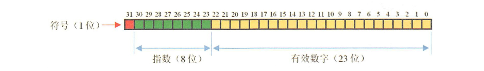

[TOC]

### 进制表示

#### 整数的二进制表示

**整数的表示**

原码：第一位是符号位，0表示正数，1表示负数。其余31位为具体的值，例如：

```
10的原码：00000000000000000000000000001010；
-10的原码：10000000000000000000000000001010；
```

反码：在原码的基础上，符号位不变，其余的按位取反，例如：

```
10的反码：11111111111111111111111111110101； // 在java中没有用到
-10的反码：11111111111111111111111111110101；
```

补码：负数的补码就是反码+1，整数的补码就是原码本身

```
10的补码：00000000000000000000000000001010；
-10的补码：11111111111111111111111111110110；
```

在 java 中整数是用**补码**来表示的，记住**正数的补码就是原码**本身，**负数的补码是反码 + 1**

二进制整数最终都是以补码形式出现的。正数的补码与原码、 反码是一样的，而负数的补码是反码加 1 的结果。 


#### 小数的二进制表示

- 计算机不能精确的表示很多数，因为很多数是二进制格式存储的。二进制仅能精确表示那些为 2 的某次方和的数。

```java
float a = 1f;
float b = 0.9f;
float f = a - b;	// 结果为：0.100000024
```


单精度浮点数格式如下：



指数称为“阶码”，有效数字称为“尾数”。符号位一位，0为正数，1为负数。阶码位 8 位存储**指数的移码**。尾数位共  23 位存储有效数字。

所以0.9 不能用有限二进制位进行精确表示，所以 1 - 0.9 并不精确地等于 0.1。


#### 二进制运算

二进制运算符如下。

| 运算符 |          释义          |
| :----: | :--------------------: |
|   <<   |     左移保留符号位     |
|   >>   |     右移保留符号位     |
|  >>>   | 右移，符号位也一起移动 |
|   ~    |        按位取反        |
|   ^    | 异或，相同为0，不同为1 |
|   &    |         逻辑与         |
|   \|   |         逻辑或         |

**二进制移位运算：**

- value << N ：保留符号位，其余的向左移动N位，整数和负数都是低位补0，相当于乘以2的N次方，这种方式用来做**2的整数倍乘法**运算效率很高。

- \>>：保留符号位，即符号位不动，其余的向右移动 N 位，整数高位补0，负数高位补1；

- \>>>：将符号位也**一起移动**，高位补0，正数跟 >> 一样，负数因为符号位是1，移动后的结果可能不是我们预期的。

```java
@org.junit.Test
public void test6(){
    int a = 10; //00000000000000000000000000001010
    int b = -10; //11111111111111111111111111110110
    System.out.println(a << 2); //40，00000000000000000000000000101000，相当于乘以4
    System.out.println(b << 2); //-40，11111111111111111111111111011000，相当于乘以4
    System.out.println(a >> 2); //2，00000000000000000000000000000010，正数向左移动后，高位是补0，跟符号位一致
    System.out.println(b >> 2); //-3，11111111111111111111111111111101，负数向左移动后，高位时补1，跟符号位一致
    System.out.println(a >>> 2); //40，00000000000000000000000000101000，相当于乘以4
    System.out.println(b >>> 2); //1073741821，00111111111111111111111111111101，将符号位也一起向右移动，高位补0，所以负数会变成一个正数。
    }
```


**二进制逻辑运算：**

- &：按位逻辑与，都为1则为1，否则为0；

- |：按位逻辑或，都为0则为0，有一个为1则为1；

- \^：异或，两个都相同为0，两个不相同为1，1\^1=0，1^0=1；

- ~：按位取反，包括符号位；

```java
@org.junit.Test
public void test7(){
    int a = 10; // 00000000000000000000000000001010
    int b = 9;  // 00000000000000000000000000001001
    System.out.println(a & b); // 8，00000000000000000000000000001000，都为1则为1，否则为0
    System.out.println(a | b); // 11，00000000000000000000000000001011，只要有一个为1就为1
    System.out.println(a ^ b); // 3，00000000000000000000000000000011，相同为0，不同为1
    System.out.println(~a);    // -11，11111111111111111111111111110101，按位取反
}
```


### 数据类型

#### 基本类型

- 除了基本类型，其他都是对象类型。

- Java中所有数据类型所占字节数与**平台无关**。
- 整数常量默认为 int。因此要注意某些范围是否超出。小数默认为 double 类型。

基本类型所占字节数：

- byte/ 1字节
- char/ 2字节
- short/ 2字节
- int/ 4字节
- float/ 4字节
- long/ 8字节
- double/ 8字节
- boolean/ ~

boolean 只有两个值：true、false，可以使用 1 bit 来存储，但是具体大小没有明确规定。JVM 会在**编译时期将 boolean 类型的数据转换为 int，使用 1 来表示 true，0 表示 false**。JVM 支持 boolean 数组，但是是通过读写 byte 数组来实现的。


#### char

- char 用于表示一个字符，这个字符可以是中文字符，也可以是英文字符，赋值时用单引号括起来。
- char 本质上是一个固定占用**两个字节**的无符号**正整数**，这个正整数对应Unicode编号，用于表示那个 Unicode 编号对应的字符。
- char 的本质就是整数，char 的比较就是 Unicode 的比较。


#### float 与 double

Java 不能隐式执行向下转型，因为这会使得精度降低。

1.1 字面量属于 **double** 类型，**不能**直接将 1.1 直接赋值给 float 变量，因为这是向下转型。

```java
// float f = 1.1;
```

1.1 f 字面量才是 float 类型。

```java
float f = 1.1f;
```


#### 数组

- 数组有两块内存空间，一块存储数组内容，一块存储内容的位置。

