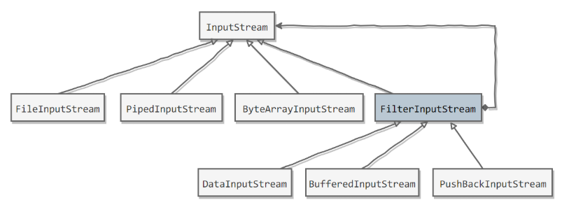

[TOC]

### 字节操作

抽象化磁盘文件的 File 类型，它仅仅用于抽象化描述一个磁盘文件或目录，却**不具备**访问和修改一个文件**内容**的能力。Java 的 **IO 流**就是用于**读写文件内容**的一种设计，它能完成将磁盘文件内容输出到**内存**或者是将内存数据输出到磁盘文件的数据传输工作。

流操作类大致分为两大类，一类是针对二进制文件的**字节流**，另一类是针对文本文件的**字符流**。


#### 基类字节流 InputStream/OutputStream

InputStream 和 OutputStream 分别作为读字节流和写字节流的==基类==，所有字节相关的流都必然继承自他们中任意一个，而它们本身作为一个**抽象类**，也定义了最基本的读写操作。

以 InputStream 为例：

```java
public abstract int read() throws IOException;
```

这是一个**抽象**的方法，并没有提供默认实现，要求子类必须实现。**而这个方法的作用就是为你返回当前文件的下一个字节**。

当然，你也会发现这个方法的返回值是使用的整型类型==「**int**」==来接收的，为什么不用「byte」？

首先，read 方法返回的值一定是一个八位的**二进制**，而一个八位的二进制可以取值的值区间为：**「0000 0000，1111 1111」**，也就是范围 [-128,127]。

read 方法同时又规定当读取到文件的末尾，即文件没有下一个字节供读取了，将返回值 ==**-1**== 。所以如果使用 byte 作为返回值类型，那么当方法返回一个 -1 ，我们该判定这是文件中数据内容，还是流的末尾呢？

而 int 类型占四个字节，高位的三个字节全部为 0，我们只使用它的最低位字节，当遇到流结尾标志时，返回四个字节表示的 -1（32 个 1），这就自然的和表示数据的值 -1（24 个 0 + 8 个 1）区别开来了。

接下来也是一个 read 方法，但是 InputStream 提供默认实现：

```java
public int read(byte b[]) throws IOException {
    return read(b, 0, b.length);
}

public int read(byte b[], int off, int len) throws IOException{
    // 方法体可查看 jdk 源码
}
```

这两个方法本质上是一样的，第一个方法是第二个方法的特殊形态，它允许传入一个**字节数组**，并要求程序将文件中读到的字节从数组索引位置 0 开始填充，供填充数组长度个字节数。

而第二个方法更加宽泛一点，它允许你指定起始位置和字节总数。

InputStream 中还有其他几个方法，基本都没怎么具体实现，留待子类实现，如下：

- public long **skip**(long n)：跳过 n 个字节，返回实际跳过的字节数
- public void **close**()：关闭流并释放对应的资源
- public synchronized void **mark**(int readlimit)
- public synchronized void **reset**()
- public boolean **markSupported**()

mark 方法会在当前流读取位置打上一个标志，reset 方法即重置读取指针到该标志处。

事实上，文件读取是**不可能重置回头读取**的，而一般都是将标志位置到重置点之间所有的字节临时保存了，当调用 reset 方法时，其实是从保存的临时字节集合进行重复读取，所以 readlimit 用于限制最大缓存容量。

而 markSupported 方法则用于确定当前流是否支持这种「回退式」读取操作。

OutputStream 和 InputStream 是类似的，只不过一个是写一个是读，不再赘述。

**实现文件复制**

```java
public static void copyFile(String src, String dist) throws IOException {
    FileInputStream in = new FileInputStream(src);
    FileOutputStream out = new FileOutputStream(dist);

    byte[] buffer = new byte[20 * 1024];
    int cnt;

    // read() 最多读取 buffer.length 个字节
    // 返回的是实际读取的个数
    // 返回 -1 的时候表示读到 eof，即文件尾
    while ((cnt = in.read(buffer, 0, buffer.length)) != -1) {
        out.write(buffer, 0, cnt);
    }

    in.close();
    out.close();
}
```


#### 文件字节流 FileInput/OutputStream

依然着重点于 FileInputStream，而 FileOutputStream 是类似的。

首先 FileInputStream 有以下几种构造器实例化一个对象：

```java
public FileInputStream(String name) throws FileNotFoundException {
    this(name != null ? new File(name) : null);
}
public FileInputStream(File file) throws FileNotFoundException {
    String name = (file != null ? file.getPath() : null);
    SecurityManager security = System.getSecurityManager();
    if (security != null) {
        security.checkRead(name);
    }
    if (name == null) {
        throw new NullPointerException();
    }
    if (file.isInvalid()) {
        throw new FileNotFoundException("Invalid file path");
    }
    fd = new FileDescriptor();
    fd.attach(this);
    path = name;
    open(name);
}
```

这两个构造器本质上也是一样的，前者是后者的特殊形态。后者的方法体大部分都只是在做**安全校验**，核心的就是一个 open 方法，用于打开一个文件。

主要是这两种构造器，如果文件不存在或者文件路径和名称不合法，都将抛出 FileNotFoundException 异常。

记得我们说过，基类 InputStream 中有一个抽象方法 read 要求所有子类进行实现，而 FileInputStream 使用本地方法进行了实现：

```java
public int read() throws IOException {
    return read0();
}

private native int read0() throws IOException;
```

这个 read0 的具体实现我们暂时无从探究，但是你必须明确的是，这个 read 方法的作用，它用于返回流中下一个字节，返回 **-1** 说明读取到文件末尾，已无字节可读。

除此之外，FileInputStream 中还有一些其他的读取相关方法，但大多采用了**本地方法**进行了实现，比如：

- public int **read**(byte b[])：读取 b.length() 个长度的字节到数组中
- public int **read**(byte b[], int off, int len)：读取指定长度的字节数到数组中
- public native long **skip**(long n)：跳过 n 的字节进行读取
- public void **close**()：释放流资源

看一个文件读取的例子：

```java
public static void main(String[] args) throws IOException {
    FileInputStream input = new FileInputStream("C:\\Users\\yanga\\Desktop\\test.txt");
    byte[] buffer = new byte[1024];
    int len = input.read(buffer);
    String str = new String(buffer);
    System.out.println(str);
    System.out.println(len);
    input.close();
}
```

输出结果很简单，会打印出我们 test 文件中的内容和实际读出的字节数，怎么就能保证 test 文件中内容不会超过 1024 个字节呢？

为了能够完整的读出文件中的内容，一种解决办法是：将 **buffer** 定义的足够大，以期望尽可能的能够存储下文件中的所有内容。

这种方法显然是不可取的，因为我们根本不可能实现知道待读文件的实际大小。

第二种方式就是使用的**动态字节数组流**(下一节)，它可以动态调整内部字节数组的大小，保证适当的容量。

关于 FileOutputStream，还需要强调一点的是它的构造器，其中有以下两个构造器：

```java
public FileOutputStream(String name, boolean append)
public FileOutputStream(File file, boolean append)
```

参数 append 指明了此流的写入操作是**覆盖还是追加**，true 表示追加，false 表示覆盖。


#### 字节数组流 ByteArrayInput/OutputStream

所谓的「字节数组流」就是围绕一个**字节数组**运作的流，它并不像其他流一样，针对文件进行流的读写操作。

字节数组流虽然**并不是基于文件的流**，但却依然是一个很重要的流，因为它内部封装的字节数组并不是固定的，而是**动态可扩容**的，往往基于某些场景下，非常合适。

ByteArrayInputStream 是**读字节数组流**，可以通过以下构造函数被实例化：

```java
protected byte buf[];
protected int pos;
protected int count;

public ByteArrayInputStream(byte buf[]) {
    this.buf = buf;
    this.pos = 0;
    this.count = buf.length;
}

public ByteArrayInputStream(byte buf[], int offset, int length)
```

**buf** 就是被封装在 ByteArrayInputStream 内部的一个字节数组，ByteArrayInputStream 的所有读操作都是围绕着它进行的。

所以，实例化一个 ByteArrayInputStream 对象的时候，至少传入一个目标字节数组的。

pos 属性用于记录当前流读取的位置，count 记录了目标字节数组最后一个有效字节索引的后一个位置。

理解了这一点，有关它各种的 read 方法就不难了：

```java
// 读取下一个字节
public synchronized int read() {
    return (pos < count) ? (buf[pos++] & 0xff) : -1;
}
// 读取 len 个字节放到字节数组 b 中
public synchronized int read(byte b[], int off, int len){
	// ...
}
```

除此之外，ByteArrayInputStream 还非常简单的实现了「**重复读取**」操作。

```java
public void mark(int readAheadLimit) {
    mark = pos;
}

public synchronized void reset() {
    pos = mark;
}
```

因为 ByteArrayInputStream 是基于字节数组的，所有重复读取操作的实现就比较容易了，**基于索引实现**就可以了。

ByteArrayOutputStream 是**写的字节数组流**。

首先，这两个属性是必须的：

```java
protected byte buf[];

// 这里的 count 表示的是 buf 中有效字节个个数
protected int count;
```

构造器：

```java
public ByteArrayOutputStream() {
    this(32);
}
    
public ByteArrayOutputStream(int size) {
    if (size < 0) {
        throw new IllegalArgumentException("Negative initial size: "+ size);
    }
    buf = new byte[size];
}
```

构造器的核心任务是，初始化内部的字节数组 buf，允许你传入 size 显式限制初始化的字节数组大小，否则将默认长度 32 。

从外部向 ByteArrayOutputStream 写内容：

```java
public synchronized void write(int b) {
    ensureCapacity(count + 1);
    buf[count] = (byte) b;
    count += 1;
}

public synchronized void write(byte b[], int off, int len){
    if ((off < 0) || (off > b.length) || (len < 0) ||
            ((off + len) - b.length > 0)) {
            throw new IndexOutOfBoundsException();
        }
        ensureCapacity(count + len);
        System.arraycopy(b, off, buf, count, len);
        count += len;
}
```

所有写操作的第一步都是 **ensureCapacity** 方法的调用，目的是为了确保当前流内的字节数组能容纳本次写操作。

如果计算后发现，内部的 buf 不能够支持本次写操作，则会调用 grow 方法做一次扩容。扩容的原理和 ArrayList 的实现是类似的，扩大为原来的两倍容量。

除此之外，ByteArrayOutputStream 还有一个 **writeTo** 方法：

```java
public synchronized void writeTo(OutputStream out) throws IOException {
    out.write(buf, 0, count);
}
```

将我们内部封装的字节数组写到某个输出流当中。

剩余的一些方法也很常用：

- public synchronized byte **toByteArray**()[]：返回内部封装的字节数组
- public synchronized int **size**()：返回 buf 的有效字节数
- public synchronized String **toString**()：返回该数组对应的字符串形式

注意到，这两个流虽然被称作「流」，但是它们本质上**并没有像真正的流一样去分配一些资源**，所以我们无需调用它的 close 方法，调了也没用。


#### 装饰者缓冲流 BufferedInput/OutputStream

##### 装饰者模式

Java I/O 使用了==装饰者模式==来实现。以 InputStream 为例，

- InputStream 是**抽象**组件；
- FileInputStream 是 InputStream 的子类，属于**具体**组件，提供了字节流的**输入**操作；
- FilterInputStream 属于**抽象装饰者**，装饰者用于装饰组件，为组件提供**额外**的功能。例如 BufferedInputStream 为 FileInputStream 提供缓存的功能。



**实例化**一个具有**缓存**功能的**字节流对象**时，只需要在 FileInputStream 对象上再**套一层** **BufferedInputStream** 对象即可。

```java
FileInputStream fileInputStream = new FileInputStream(filePath);
// 需要新功能再嵌套即可
BufferedInputStream bufferedInputStream = new BufferedInputStream(fileInputStream);		
```

DataInputStream 装饰者提供了对更多数据类型进行输入的操作，比如 int、double 等基本类型。


##### BufferedInput/OutputStream

装饰者流其实是基于一种设计模式「**装饰者模式**」而实现的一种文件 IO 流，而我们的缓冲流只是其中的一种。

之前使用的文件读写流 FileInputStream 和 FileOutputStream 都是**一个字节一个字节**的从磁盘读取或写入，非常耗时。

而我们的**缓冲流**可以预先从磁盘一次性读出**指定容量**的字节数到内存中，之后的读取操作将直接从**内存**中读取，提高效率。下面我们一起看看缓冲流的具体实现情况：

依然先以 BufferedInputStream 为例，我们简单提一下它的几个**核心属性**：

```java
private static int DEFAULT_BUFFER_SIZE = 8192;
// 缓冲数组
protected volatile byte buf[];
private static int MAX_BUFFER_SIZE = Integer.MAX_VALUE - 8;
protected int count;
protected int pos;
protected int markpos = -1;
protected int marklimit;
```

buf 就是用于**缓冲读**的字节数组，它的值将随着流的读取而不停的被填充，继而后续的读操作可以直接**基于这个缓冲数组**。

DEFAULT_BUFFER_SIZE 规定了**默认缓冲区**的大小，即 buf 的数组长度。MAX_BUFFER_SIZE 指明了缓冲区的上限。

count 指向缓冲数组中最后一个有效字节索引后一位。pos 指向下一个待读取的字节索引位置。

markpos 和 marklimit 用于**重复读**操作。

接着我们看看 BufferedInputStream 的几个示例构造器：

```java
public BufferedInputStream(InputStream in) {
    this(in, DEFAULT_BUFFER_SIZE);
}
public BufferedInputStream(InputStream in, int size) {
    super(in);
    if (size <= 0) {
        throw new IllegalArgumentException("Buffer size <= 0");
    }
    buf = new byte[size];
}
```

整体上来说，前者只需要传入一个「**被装饰**」的 InputStream **实例**，并使用默认大小的缓冲区。后者则可以显式指明缓冲区的大小。

除此之外，super(in) 会将这个 InputStream 实例保存进父类 FilterInputStream 的 **in 属性**字段中，并且所有实际的磁盘读操作都由这个 InputStream 实例发出。

下面我们来看最重要的读操作以及缓冲区是如何被填充的。

```java
public synchronized int read() throws IOException {
    if (pos >= count) {
        fill();
        if (pos >= count)
            return -1;
    }
    return getBufIfOpen()[pos++] & 0xff;
}
```

即从流中读取下一个字节并返回，但细节上的实现还是稍稍有些不同。

count 指向了缓冲数组中有效字节索引后一位置处，pos 指向下一个待读取的字节索引位置。理论上 pos 是不可能大于 count 的，最多等于。

如果 pos 等于 count，那说明缓冲数组中所有有效字节都已经被读取过了，此时即需要丢弃缓冲区中那些「无用」的数据，从磁盘重新加载一批新数据填充缓冲区。

而事实上，fill 方法就是做的这个事情，它的代码比较多，就解析了。

如果 fill 方法调用之后，pos 依然 等于 count，那么说明 InputStream 实例并没有从流中读取出任何数据，也即文件流中无数据可读。关于这一点，参见 fill 方法 246 行。

总的来说，如果成功填充了缓冲区，那么 read 方法将**直接从缓冲区取出一个字节**返回给调用者。

```java
public synchronized int read(byte b[], int off, int len){
    // .....
}
```

skip 方法用于跳过指定长度的字节数进行文件流的继续读取：

```java
public synchronized long skip(long n){
    // .....
}
```

注意一点的是，skip 方法尽量去跳过 n 个字节，但不保证一定跳过 n 个字节，方法返回的是实际跳过的字节数。如果缓冲数组中剩余可用字节数小于 n，那么最终将跳过缓冲数组中实际可跳过的字节数。

最后要说一说这个 close 方法：

```java
public void close() throws IOException {
    byte[] buffer;
    while ( (buffer = buf) != null) {
        if (bufUpdater.compareAndSet(this, buffer, null)) {
            InputStream input = in;
            in = null;
            if (input != null)
                input.close();
            return;
        }
        // Else retry in case a new buf was CASed in fill()
    }
}
```

close 方法将赋空「**被装饰者**」流，并调用它的 close 方法释放相关资源，最终也会清空缓冲数组所占用的内存空间。

BufferedInputStream 提供了**读缓冲**能力，而 BufferedOutputStream 则提供了**写缓冲**能力，即内存的写操作并不会立马更新到磁盘，**暂时保存在缓冲区**，待缓冲区**满时一并写**入。

```java
protected byte buf[];
protected int count;
```

buf 代表了**内部缓冲区**，count 表示缓冲区中**实际数据容量**，即 buf 中有效字节数，而不是 buf 数组长度。

```java
public BufferedOutputStream(OutputStream out) {
    this(out, 8192);
}

public BufferedOutputStream(OutputStream out, int size) {
    super(out);
    if (size <= 0) {
        throw new IllegalArgumentException("Buffer size <= 0");
    }
    buf = new byte[size];
}
```

一样的实现思路，必须提供的是一个 OutputStream 输出流**实例**，也可以选择性指明缓冲区大小。

```java
public synchronized void write(int b) throws IOException {
    if (count >= buf.length) {
        flushBuffer();
    }
    buf[count++] = (byte)b;
}
```

写方法将首先检查缓冲区是否还能容纳本次写操作，如果不能将发起一次磁盘写操作，将缓冲区数据全部写入磁盘文件，否则将优先写入缓冲区。

当然，BufferedOutputStream 也提供了 flush 方法向外提供接口，也即不一定非要等到缓冲区满了才向磁盘写数据，你也可以显式的调用该方法让它清空缓冲区并更新磁盘文件。

```java
public synchronized void flush() throws IOException {
    flushBuffer();
    out.flush();
}
```

关于缓冲流，核心内容介绍如上，这是一种能够显著提升效率的流，通过它能够减少磁盘访问次数，提升程序执行效率。


