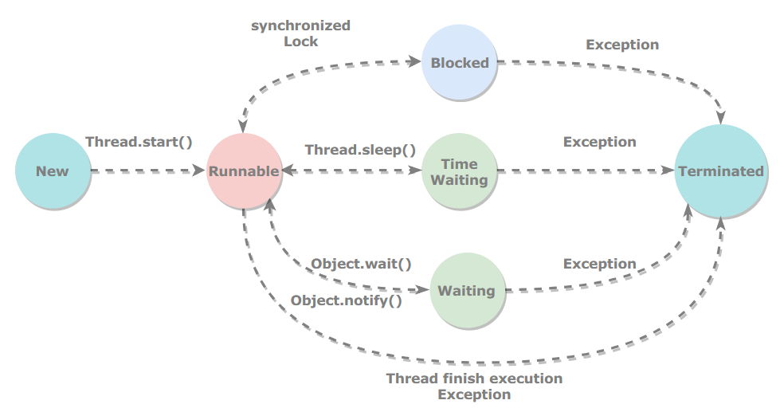

[TOC]

### 线程基础

#### 1. 线程状态转换



**新建（New）**

创建后尚未启动。

**可运行（Runnable）**

可能正在运行，也可能正在等待 CPU 时间片。

包含了操作系统线程状态中的 Running 和 Ready。

**阻塞（Blocked）**

等待获取一个排它锁，如果其线程释放了锁就会结束此状态。

**无限期等待（Waiting）**

等待其它线程显式地唤醒，否则不会被分配 CPU 时间片。

| 进入方法                                   | 退出方法                             |
| ------------------------------------------ | ------------------------------------ |
| 没有设置 Timeout 参数的 Object.wait() 方法 | Object.notify() / Object.notifyAll() |
| 没有设置 Timeout 参数的 Thread.join() 方法 | 被调用的线程执行完毕                 |
| LockSupport.park() 方法                    | LockSupport.unpark(Thread)           |

**限期等待（Timed Waiting）**

无需等待其它线程显式地唤醒，在一定时间之后会被系统自动唤醒。

调用 Thread.sleep() 方法使线程进入限期等待状态时，常常用“使一个线程睡眠”进行描述。

调用 Object.wait() 方法使线程进入限期等待或者无限期等待时，常常用“挂起一个线程”进行描述。

睡眠和挂起是用来描述行为，而阻塞和等待用来描述状态。

阻塞和等待的区别在于，阻塞是被动的，它是在等待获取一个排它锁。而等待是主动的，通过调用 Thread.sleep() 和 Object.wait() 等方法进入。

| 进入方法                                 | 退出方法                                        |
| ---------------------------------------- | ----------------------------------------------- |
| Thread.sleep() 方法                      | 时间结束                                        |
| 设置了 Timeout 参数的 Object.wait() 方法 | 时间结束 / Object.notify() / Object.notifyAll() |
| 设置了 Timeout 参数的 Thread.join() 方法 | 时间结束 / 被调用的线程执行完毕                 |
| LockSupport.parkNanos() 方法             | LockSupport.unpark(Thread)                      |
| LockSupport.parkUntil() 方法             | LockSupport.unpark(Thread)                      |

**终结（Terminated）**

可以是线程结束任务之后自己结束，或者产生了异常而结束。


#### 2. 使用与创建线程

有三种使用线程的方法：

- 实现 Runnable 接口；
- 实现 Callable 接口；
- 继承 Thread 类。

实现 Runnable 和 Callable 接口的类只能当做一个可以在线程中运行的任务，不是真正意义上的线程，因此最后还需要通过 Thread 来调用。可以说任务是通过线程驱动从而执行的。

##### 实现 Runnable 接口

需要实现 run() 方法。没有返回值。

通过 Thread 调用 start() 方法来启动线程。

```java
public class MyRunnable implements Runnable {
    public void run() {
        // ...
    }
}
```

```java
public static void main(String[] args) {
    MyRunnable instance = new MyRunnable();
    Thread thread = new Thread(instance);
    thread.start();
}
```

------

##### 实现 Callable 接口

与 Runnable 相比，Callable **可以有返回值**，返回值通过 **FutureTask** 进行封装。

```java
public class MyCallable implements Callable<Integer> {
    public Integer call() {
        return 123;
    }
}
```

```java
public static void main(String[] args) throws ExecutionException, InterruptedException {
    MyCallable mc = new MyCallable();
    FutureTask<Integer> ft = new FutureTask<>(mc);
    Thread thread = new Thread(ft);
    thread.start();
    System.out.println(ft.get());
}
```

------

##### 继承 Thread 类

同样也是需要实现 run() 方法，因为 Thread 类也实现了 Runable 接口。

当调用 start() 方法启动一个线程时，虚拟机会将该线程放入就绪队列中等待被调度，当一个线程被调度时会执行该线程的 run() 方法。

```java
public class MyThread extends Thread {
    public void run() {
        // ...
    }
}
```

```java
public static void main(String[] args) {
    MyThread mt = new MyThread();
    mt.start();
}
```

------

##### 实现方法对比

实现接口会更好一些，因为：

- Java 不支持多重继承，因此继承了 Thread 类就无法继承其它类，但是可以实现多个接口；
- 类可能只要求可执行就行，继承整个 Thread 类开销过大。


#### 3. 线程基本属性与方法

##### 优先级

每个线程都具有各自的优先级，线程的优先级可以在程序中表明该线程的重要性，如果有很多线程处于就绪状态，系统会根据优先级来决定首先使哪个线程进入运行状态。但这并不意味着低优先级的线程得不到运行，而只是它运行的几率比较小，比如垃圾回收线程的优先级就较低。

Thread类中包含的成员变量代表了线程的某些优先级，比如Thread.MIN_PRIORITY（常数1）、Thread.MAX_PRIORITY（常数2）、Thread.NORM_PRIORITY（常数5）。其中每个线程的优先级都在Thread.MIN_PRIORITY~Thread.MAX_PRIORITY之间，在默认情况下其优先级都是Thread.NORM_PRIORITY。每个新产生的线程都继承了父线程的优先级。
线程的优先级可以使用 setPriority() 方法进行调整，如果使用该方法设置的优先级不在1~10之内，将产生异常。

##### Daemon

守护线程是程序运行时在后台提供**服务**的线程，不属于程序中不可或缺的部分。

当所有非守护线程结束时，程序也就终止，同时会杀死所有守护线程。

main() 属于非守护线程。

使用 **setDaemon**() 方法将一个线程设置为守护线程。

```java
public static void main(String[] args) {
    Thread thread = new Thread(new MyRunnable());
    thread.setDaemon(true);	// 设置为守护线程
}
```

##### sleep()

Thread.sleep(millisec) 方法会**休眠**当前正在执行的线程，millisec 单位为**毫秒**。

sleep() 可能会抛出 InterruptedException，因为异常不能跨线程传播回 main() 中，因此必须在本地进行处理。线程中抛出的其它异常也同样需要在本地进行处理。

```java
public void run() {
    try {
        Thread.sleep(3000);
    } catch (InterruptedException e) {
        e.printStackTrace();
    }
}
```

##### yield()

对静态方法 Thread.yield() 的调用声明了当前线程已经完成了生命周期中最重要的部分，可以切换给其它线程来执行。该方法只是对线程调度器的一个建议，而且也只是建议具有相同优先级的其它线程可以运行。

```java
public void run() {
    Thread.yield();
}
```

#### 4. 共享内存及存在的问题

每个线程有自己的程序计数器，有自己的栈，但是线程之间可能存在共享内存，可以访问与操作相同的对象。因此可能存在问题。

##### 竞态条件

当多个线程访问与操作同一个对象时，最终执行的结果与执行时序有关，可能正确也可能不正确。

如果多个线程对同一个共享数据进行访问而不采取同步操作的话，那么操作的结果是不一致的。

以下代码演示了 1000 个线程同时对 cnt 执行自增操作，操作结束之后它的值有可能小于 1000。

```java
public class ThreadUnsafeExample {

    private int cnt = 0;

    public void add() {
        cnt++;
    }

    public int get() {
        return cnt;
    }
}
```

```java
public static void main(String[] args) throws InterruptedException {
    final int threadSize = 1000;
    ThreadUnsafeExample example = new ThreadUnsafeExample();
    final CountDownLatch countDownLatch = new CountDownLatch(threadSize);
    ExecutorService executorService = Executors.newCachedThreadPool();
    for (int i = 0; i < threadSize; i++) {
        executorService.execute(() -> {
            example.add();
            countDownLatch.countDown();
        });
    }
    countDownLatch.await();
    executorService.shutdown();
    System.out.println(example.get());
}
```

```html
997
```

解决的方法：

- 使用 synchronized 关键字；
- 使用显示锁；
- 使用原子变量。


##### 内存可见性

当多个线程访问与操作同一个对象，当一个线程对一个共享变量修改时，另一个线程不一定马上就能看到，甚至永远看不到。除了内存，数据还会被缓存到CPU 的寄存器以及各级缓存中，当访问一个变量时，可能直接从寄存器或 CPU 缓存读取，而不一定从内存中去读取，当修改一个变量时，也可能是先写到缓存，之后再同步更新到内存中。这在多线程下就可能造成内存可见性问题。

解决方法：

- 使用 volatile 关键字（不能解决静态条件问题）；
- 实现 synchronized 关键字或显示锁进行同步。


