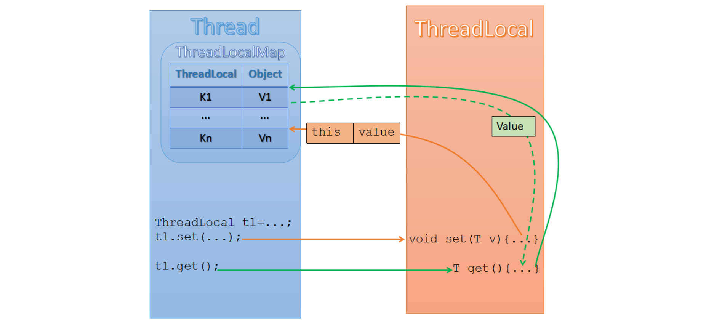

[TOC]

### ThreadLocal

#### 概述

- **线程本地变量**，每个线程都有同一个变量的**独有拷贝**，如多个线程同时操作的是同一个 ThreadLocal 对象，但每个线程都有自己独立的值，变动不会影响其他的线程。
- ThreadLocal 对象一般都定义为 **static**，便于引用。
- ThreadLocal 用一种存储变量与线程绑定的方式，在每个线程中用自己的 **ThreadLocalMap** 安全**隔离**变量，为解决多线程程序的并发问题提供了一种新的思路，如为每个线程创建一个独立的数据库连接。因为是线程绑定的，所以在很多场景也被用来实现线程参数传递，如 Spring 的 RequestContextHolder。也因为每个线程拥有自己唯一的 ThreadLocalMap ，所以 ThreadLocalMap 是天然线程安全的。
- 每个线程都有一个 Map，对于每个 ThreadLocal 对象，调用其 get/set 实际上就是以 ThreadLocal 对象为键读写当前线程的 Map。


#### 使用场景

**日期处理**

ThreadLocal 是实现线程安全的一种方案，如对于 DateFormat/SimpleDateFormat 是非线程安全的，实现安全的一种方式是使用锁，另一种方式是每次都创建一个新的对象，更好的方式是使用 ThreadLocal，每个线程使用自己的 DateFormat，就不存在线程安全问题了。

```java
public class ThreadLocalDateFormat {
    // 定义ThreadLocal变量
    static ThreadLocal<DateFormat> sdf = new ThreadLocal<>() {
        protected DateFormat initValue() {
            return new SimpleDateFormat("yyyy-MM-dd HH:mm:ss");
        }
    };
    
    public static String dateToString(Date date) {
        return sdf.get().format(date);
    }

    public static Date dateToString2(String str) throws ParseException {
        return sdf.get().parse(str);
    }
    
}
```


**随机数**

Random 类是线程安全的，但是多线程使用会存在竞争问题，性能会下降，所以提供了 ThreadLocalRandom 类，它是 Random 的子类，利用了 ThreadLocal，它没有 public 的构造方法，通过静态方法 current 获取对象。如：

```java
public static void main(String[] args) {
    ThreadLocalRandom threadLocalRandom = ThreadLocalRandom.current();
    System.out.println(threadLocalRandom.nextInt(100));
}
```

**上下文信息**

被广泛用在 **Spring** 等框架中。可以存储上下文信息，避免在不同代码之间来回传递，简化代码。


#### 原理分析

##### ThreadLocal 存储结构

首先我们来聊一聊 ThreadLocal 在多线程运行时，各线程是如何存储变量的，假如我们现在定义两个 ThreadLocal 实例如下：

```java
static ThreadLocal<User> threadLocal_1 = new ThreadLocal<>();
static ThreadLocal<Client> threadLocal_2 = new ThreadLocal<>();
```

我们分别在三个线程中使用 ThreadLocal，伪代码如下：

```java
// thread-1中
threadLocal_1.set(user_1);
threadLocal_2.set(client_1);

// thread-2中
threadLocal_1.set(user_2);
threadLocal_2.set(client_2);

// thread-3中
threadLocal_2.set(client_3);
```

这三个线程都在运行中，那此时各线程中的存数数据应该如下图所示。



每个线程持有自己的 ThreadLocalMap，ThreadLocalMap 初始容量为16（即图中的16个槽位），在调用ThreadLocal 的 set 方法时，将以 ThreadLocal 为 Key 存储在 本线程的 ThreadLocalMap 里面，ThreadLocalMap 的 Value 为Object 类型，实际类型由 ThreadLocal 定义。


##### ThreadLocal public方法

1. **ThreadLocal 之 set() 方法**

```java
public void set(T value) {
    Thread t = Thread.currentThread();  // 获取当前线程
    ThreadLocalMap map = getMap(t); 	// 拿到当前线程的 ThreadLocalMap
    if (map != null) 	// 判断 ThreadLocalMap 是否存在
        map.set(this, value); 	// 调用 ThreadLocalMap 的 set 方法
    else
        createMap(t, value); 	// 创建 ThreadLocalMap
}
```

第一次调用时需要 creatMap，创建方式比较简单不详解。这里重要的还是 ThreadLocalMap 的 set 方法。

2. **ThreadLocal 之 get() 方法**

```java
public T get() {
    Thread t = Thread.currentThread();
    ThreadLocalMap map = getMap(t);
    if (map != null) {
        // 调用ThreadLocalMap的getEntry 方法
        ThreadLocalMap.Entry e = map.getEntry(this); 
        if (e != null) {
            @SuppressWarnings("unchecked")
            T result = (T)e.value;
            return result;
        }
    }
    // 如果还没有设置，可以用子类实现 initialValue ，自定义初始值
    return setInitialValue(); 
}
```

3. **ThreadLocal 之 remove() 方法**

```java
public void remove() {
    ThreadLocalMap m = getMap(Thread.currentThread());
    if (m != null)
        // 调用ThreadLocalMap的remove方法
        m.remove(this); 
}
```

这里罗列了 ThreadLocal 的几个 public 方法，其实所有工作最终都落到了 ThreadLocalMap 的头上，ThreadLocal 仅仅是从当前线程取到 ThreadLocalMap 而已，具体执行，请看下面对 ThreadLocalMap 的分析。


##### ThreadLocalMap

###### ThreadLocalMap 简介

ThreadLocalMap 是ThreadLocal 内部的一个Map实现，然而它并没有实现任何集合的接口规范，因为它仅供内部使用，数据结构采用 数组 + 开方地址法，Entry 继承 WeakReference，是基于 ThreadLocal 这种特殊场景实现的 Map，它的实现方式很值得研究。

ThreadLocalMap 类结构及其成员 Entry 定义如下：

```java
static class ThreadLocalMap {
    // Entry类继承了WeakReference<ThreadLocal<?>>，即每个Entry对象都有一个ThreadLocal的弱引用
    //（作为key），这是为了防止内存泄露。一旦线程结束，key变为一个不可达的对象，这个Entry就可以被GC了
    static class Entry extends WeakReference<ThreadLocal<?>> {
        /** The value associated with this ThreadLocal. */
        Object value;
        Entry(ThreadLocal<?> k, Object v) {
            super(k);
            value = v;
        }
    }
    // ThreadLocalMap 的初始容量，必须为2的倍数
    private static final int INITIAL_CAPACITY = 16;

    // resized时候需要的table
    private Entry[] table;

    // table中的entry个数
    private int size = 0;

    // 扩容数值
    private int threshold; // Default to 0
}    
```

Entry 继承 WeakReference，以 ThreadLocal 为 key，类似 WeakHashMap，对内存敏感。虽然继承 WeakReference，但只能实现对 Reference 的 key 的回收，而对 value 的回收需要手动解决。value 何时被回收？ 如果没有理解 value 的回收时间，那可能留下内存溢出的隐患。

其常用的构造函数如下：

```java
 ThreadLocalMap(ThreadLocal<?> firstKey, Object firstValue) {
            table = new Entry[INITIAL_CAPACITY];
            int i = firstKey.threadLocalHashCode & (INITIAL_CAPACITY - 1);
            table[i] = new Entry(firstKey, firstValue);
            size = 1;
            setThreshold(INITIAL_CAPACITY);
        }
```

构造函数的第一个参数就是本 ThreadLocal 实例(this)，第二个参数就是要保存的线程本地变量。构造函数首先创建一个长度为 16 的 Entry 数组，然后计算出 firstKey 对应的哈希值，然后存储到 table 中，并设置 size 和threshold。

注意一个细节，计算 hash 的时候里面采用了 **hashCode & (size - 1)** 的算法，这相当于取模运算 hashCode % size 的一个更高效的实现（和 HashMap 中的思路相同）。正是因为这种算法，我们要求 size 必须是 **2 的指数**，因为这可以使得 hash 发生冲突的次数减小。

###### ThreadLocalMap#set

ThreadLocal 中 put 函数最终调用了 ThreadLocalMap 中的 set 函数，跟进去看一看：

```java
private void set(ThreadLocal<?> key, Object value) {
    Entry[] tab = table;
    int len = tab.length;
    int i = key.threadLocalHashCode & (len-1);

    for (Entry e = tab[i];
         e != null;
         // 冲突了
         e = tab[i = nextIndex(i, len)]) {
        ThreadLocal<?> k = e.get();

        if (k == key) {
            e.value = value;
            return;
        }

        if (k == null) {
            replaceStaleEntry(key, value, i);
            return;
        }
    }

    tab[i] = new Entry(key, value);
    int sz = ++size;
    if (!cleanSomeSlots(i, sz) && sz >= threshold) {
        rehash();
    }
}
```

在上述代码中如果 Entry 在存放过程中冲突了，调用 nextIndex 来处理，如下所示。是否还记得 hashmap 中对待冲突的处理？这里好像是另一种套路：只要 i 的数值小于 len，就加 1 取值，官方术语称为：线性探测法。

```java
 private static int nextIndex(int i, int len) {
            return ((i + 1 < len) ? i + 1 : 0);
 }
```

以上步骤 ok 了之后，再次关注一下源码中的 cleanSomeSlots，该函数主要的作用就是清理无用的 entry，具体细节就不扣了：

```java
private boolean cleanSomeSlots(int i, int n) {
    boolean removed = false;
    Entry[] tab = table;
    int len = tab.length;
    do {
        i = nextIndex(i, len);
        Entry e = tab[i];
        if (e != null && e.get() == null) {
            n = len;
            removed = true;
            i = expungeStaleEntry(i);
        }
    } while ( (n >>>= 1) != 0);
    return removed;
}
```

###### ThreadLocal#get

看完了 set 函数，肯定是要关注 Get 的，源码如下所示：

```java
 public T get() {
        // 获取Thread对象t
        Thread t = Thread.currentThread();
        // 获取t中的map
        ThreadLocalMap map = getMap(t);
        if (map != null) {
            ThreadLocalMap.Entry e = map.getEntry(this);
            if (e != null) {
                @SuppressWarnings("unchecked")
                T result = (T)e.value;
                return result;
            }
        }
        return setInitialValue();
    }
```

如果 map 为 null，就返回 setInitialValue() 这个方法，跟进这个方法看一下：

```java
private T setInitialValue() {
    T value = initialValue();
    Thread t = Thread.currentThread();
    ThreadLocalMap map = getMap(t);
    if (map != null)
        map.set(this, value);
    else
        createMap(t, value);
    return value;
}
```

最后返回的是 value，而 value 来自`initialValue()`,进入这个源码中查看：

```java
protected T initialValue() {
    return null;
}
```

原来如此，如果不设置 ThreadLocal 的数值，默认就是 null，来自于此。


