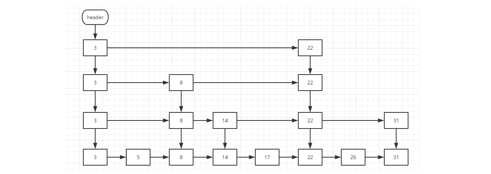
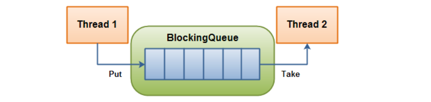

[TOC]

### 并发容器类

### CopyOnWriteArrayList

#### 概述

- 实现了 List 接口，与其他 List 实现类用法类似。
- 是线程安全的，可以被多个线程并发访问。
- 它的迭代器不支持修改操作，但也不会抛出 ConcurrentModificationException。迭代时不需要像同步容器那边对整个列表对象加锁。
- 它以原子方式支持一些复合操作。

#### 适用场景

CopyOnWriteArrayList 在写操作的**同时**允许读操作，大大提高了读操作的性能，因此很适合**读多写少**的应用场景，不适合数组很大且需要频繁修改的场景，它是以优化读为目标的。

但是 CopyOnWriteArrayList 有其缺陷：

- 内存占用：在写操作时需要复制一个**新的数组**，使得内存占用为原来的**两倍**左右；
- 数据不一致：读操作不能读取实时性的数据，因为部分写操作的数据还**未同步**到读数组中。

所以 CopyOnWriteArrayList 不适合内存敏感以及对实时性要求很高的场景。

#### 原理分析

重要的成员属性。

```java
/** The lock protecting all mutators */
final transient ReentrantLock lock = new ReentrantLock();

// 存放元素 volatile保证内存可见性
private transient volatile Object[] array;
```

可以看到，CopyOnWriteArrayList 使用了 ReentrantLock 来支持并发操作，array 就是实际存放数据的数组对象。ReentrantLock 是一种支持重入的独占锁，任意时刻只允许一个线程获得锁，所以可以安全的并发去写数组


**读写分离**

**写操作**在一个**复制的数组**上进行，**读操作**还是在**原始数组**中进行，读写分离，互不影响。

**写**操作需要加**锁**，防止并发写入时导致写入数据丢失。

写操作结束之后需要把原始数组**指向**新的复制数组。读不需要锁，可以并行，读写也可以并行，但多个线程不能同时写，每个写操作都需要先获取锁。

```java
public boolean add(E e) {
    final ReentrantLock lock = this.lock;	// 加锁
    lock.lock();
    try {
        Object[] elements = getArray();
        int len = elements.length;
        Object[] newElements = Arrays.copyOf(elements, len + 1);
        newElements[len] = e;
        setArray(newElements);
        return true;
    } finally {
        lock.unlock();		// 释放锁
    }
}

// 修改内部数组引用
final void setArray(Object[] a) {
    array = a;
}
```

```java
@SuppressWarnings("unchecked")	
private E get(Object[] a, int index) {	// 直接读 可以并行
    return (E) a[index];
}
```

每次修改操作，都会创建一个数组，复制原数组的内容到新数组，在新数组上进行修改，然后以原子方式设置内部的数组引用，这就是写时复制。换句话说，数组内容是**只读**的，写操作都是通过新建数组，然后**原子性**的修改数组引用来实现的。

#### CopyOnWriteArraySet

- 实现了 Set 接口，不包含重复元素。
- 内部通过 CopyOnWriteArrayList 实现，性能较低，不适用于元素个数很多的结合。如果元素较多可以考虑 ConcurrentHashMap 或 ConcurrentSkipListSet 这两个类。


### ==ConcurrentHashMap==

#### 概述

**特点**

- 并发安全，支持高并发，读操作完全并行，写操作一定程度并行。
- 直接支持一些原子复合操作
- 与同步容器相比，迭代不需要加锁
- 若一致性

**为何使用**

并发更新情况下，HashMap 可能出现死循环，多出现在多个线程同时扩容哈希表的时候，占满 CPU。Collections.synchronizedMap 可以生成一个同步容器可以避免死循环，但是同步容器有几个问题：

1、每个方法都需要同步，并发度较低。

2、对于迭代和复合操作，需要调用方加锁。

ConcurrentHashMap 则没有上述的问题。同样实现了 Map 接口，也是基于哈希表实现。


#### 1. 存储结构

```java
static final class HashEntry<K,V> {
    final int hash;
    final K key;
    volatile V value;
    volatile HashEntry<K,V> next;
}
```

ConcurrentHashMap 和 HashMap 实现上类似，最主要的差别是 ConcurrentHashMap 采用了==分段锁（Segment）==，每个分段锁维护着**几个桶**（HashEntry），多个线程可以同时访问**不同分段锁**上的桶，从而使其并发度更高（并发度就是 **Segment 的个数**）。将数据分为多个段，每个段有一个独立的锁，每个段相当于一个独立的哈希表。

采用分段技术，可以大大提高并发度，多个段之间可以并行读写。默认端是 16 个。实现的效果是对于读操作可以并行，对于写操作需要获取锁，不能并行。

Segment 继承自 **ReentrantLock**。具有显示锁的一些机制。

```java
static final class Segment<K,V> extends ReentrantLock implements Serializable {

    private static final long serialVersionUID = 2249069246763182397L;

    static final int MAX_SCAN_RETRIES =
        Runtime.getRuntime().availableProcessors() > 1 ? 64 : 1;

    transient volatile HashEntry<K,V>[] table;

    transient int count;

    transient int modCount;

    transient int threshold;

    final float loadFactor;
}
```

```java
final Segment<K,V>[] segments;
```

默认的并发级别为 16，也就是说默认创建 **16 个** Segment。

```java
static final int DEFAULT_CONCURRENCY_LEVEL = 16;
```


#### 2. size 操作

每个 Segment 维护了一个 count 变量来统计该 Segment 中的**键值对个数**。

```java
/**
 * The number of elements. Accessed only either within locks
 * or among other volatile reads that maintain visibility.
 */
transient int count;
```

在执行 size 操作时，需要遍历所有 Segment 然后把 count **累计**起来。

ConcurrentHashMap 在执行 size 操作时**先尝试不加锁**，如果连续两次不加锁操作得到的**结果一致**，那么可以认为这个结果是正确的。

**尝试次数**使用 RETRIES_BEFORE_LOCK 定义，该值为 2，retries 初始值为 -1，因此尝试次数为 3。

如果尝试的次数**超过 3 次**，就需要对**每个 Segment 加锁**。

```java
/**
 * Number of unsynchronized retries in size and containsValue
 * methods before resorting to locking. This is used to avoid
 * unbounded retries if tables undergo continuous modification
 * which would make it impossible to obtain an accurate result.
 */
static final int RETRIES_BEFORE_LOCK = 2;

public int size() {
    // Try a few times to get accurate count. On failure due to
    // continuous async changes in table, resort to locking.
    final Segment<K,V>[] segments = this.segments;
    int size;
    boolean overflow; // true if size overflows 32 bits
    long sum;         // sum of modCounts
    long last = 0L;   // previous sum
    int retries = -1; // first iteration isn't retry
    try {
        for (;;) {
            // 超过尝试次数，则对每个 Segment 加锁
            if (retries++ == RETRIES_BEFORE_LOCK) {
                for (int j = 0; j < segments.length; ++j)
                    ensureSegment(j).lock(); // force creation
            }
            sum = 0L;
            size = 0;
            overflow = false;
            for (int j = 0; j < segments.length; ++j) {
                Segment<K,V> seg = segmentAt(segments, j);
                if (seg != null) {
                    sum += seg.modCount;
                    int c = seg.count;
                    if (c < 0 || (size += c) < 0)
                        overflow = true;
                }
            }
            // 连续两次得到的结果一致，则认为这个结果是正确的
            if (sum == last)
                break;
            last = sum;
        }
    } finally {
        if (retries > RETRIES_BEFORE_LOCK) {
            for (int j = 0; j < segments.length; ++j)
                segmentAt(segments, j).unlock();
        }
    }
    return overflow ? Integer.MAX_VALUE : size;
}
```

#### 3. JDK 1.8 的改动

JDK 1.7 使用**分段锁机制**来实现并发更新操作，核心类为 **Segment**，它继承自重入锁 ReentrantLock，并发度与 Segment 数量相等。

JDK 1.8 使用了 **==CAS 操作==**来支持更高的并发度，在 CAS 操作失败时使用内置锁 synchronized。

并且 JDK 1.8 的实现也在链表过长时会转换为**红黑树**。


#### 弱一致性

ConcurrentHaspMap 迭代器创建之后，就会按照哈希表结构遍历读取每个元素，但在遍历过程中，内部元素可能会因为其他线程的写入修改发生变化，如果变化发生在已遍历的部分，迭代器就不会反映出来，而如果变化部分发生在未遍历过的部分，迭代器就会发现并反映出来，这就是弱一致性。


### ConcurrentSkipListMap

#### 概述

- ConcurrentSkipListMap 是基于 SkipList 实现的，SkipList 称为跳表。


特点

- 没有使用锁，所有操作都是无阻塞的，所有操作都可以并行，包括写，多线程可以同时写。
- 与 ConcurrentHashMap 类似，迭代器不会抛出 ConcurrentModificationException，是弱一致性的，迭代可能反映最新修改也可能不反映。
- 实现了 ConcurrentMap 接口，支持一些原子复合操作。
- 与 TreeMap 一样可以排序，默认安装键的自然排序，也可以按照自定义比较器进行排序。


#### 原理分析

跳表是基于链表的，在链表的基础上增加了多层索引结构。



最下面一层是最基本的单向链表，这是一个有序的链表。但是链表不能进行直接定位，所以不能进行二分查找。所以为了快速查找，使用了多层索引，高层的索引节点一定同时是底层的索引节点。每个索引节点有两个指针，一个向右指向统同层的索引节点，另一个向下指向下一层的索引节点或者基本链表节点。

基于上述结构就可以进行二分查找了。复杂度是O(logN)。


### 并发队列

都继承自 Queue。

#### ConcurrentLinkedQueue

##### 定义

**ConcurrentLinkedQueue** : 是一个适用于高并发场景下的队列，通过无锁的方式，实现了高并发状态下的高性能，通常 ConcurrentLinkedQueue 性能好于 BlockingQueue。 
它是一个基于链接节点的**无界线程安全队列**，该队列的元素遵循**先进先出**的原则。 **头是最先加入的，尾是最近加入的，该队列不允许null元素。**

ConcurrentLinkedQueue重要方法:

> **add 和offer()** ：都是加入元素的方法(在ConcurrentLinkedQueue中这俩个方法没有任何区别) 
> **poll() 和peek()** ：都是取头元素节点，区别在于前者会删除元素，后者不会。

**代码示例**

```java
ConcurrentLinkedQueue q = new ConcurrentLinkedQueue();
q.offer("张三");
q.offer("李四");
q.offer("王五");
q.offer("赵六");
q.offer("大圣");
// 从头获取元素,删除该元素
System.out.println(q.poll());
// 从头获取元素,不刪除该元素
System.out.println(q.peek());
// 获取总长度
System.out.println(q.size());
```


#### BlockingQueue

**定义：** 
阻塞队列（BlockingQueue）是一个支持两个附加操作的队列。这两个附加的操作是： 
1、在队列为空时，获取元素的线程会等待队列变为非空。 
2、当队列满时，存储元素的线程会等待队列可用。 
阻塞队列是**线程安全**的。 

**用途：** 
阻塞队列常用于生产者和消费者的场景，生产者是往队列里添加元素的线程，消费者是从队列里拿元素的线程。阻塞队列就是生产者存放元素的容器，而消费者也只从容器里拿元素。

| operation | Throws Exception | Special Value | Blocks |          Times Out          |
| :-------: | :--------------: | :-----------: | :----: | :-------------------------: |
|  Insert   |      add(o)      |   offer(o)    | put(o) | offer(o, timeout, timeunit) |
|  Remove   |    remove(o)     |    poll()     | take() |   poll(timeout, timeunit)   |
|  Examine  |    element()     |    peek()     |        |                             |

四种不同行为的含义如下：

- 1.抛异常
    如果尝试操作是不可能的，一个异常将会抛出。
- 2.特殊值
    如果尝试操作是不可能的，一个特殊值将返回（通常是true/false）
- 3.阻塞
    如果尝试操作是不可能的，方法将会阻塞住，直到可以执行。
- 4.超时
    如果尝试操作是不可能的，方法将会阻塞住，直到可以执行，但是阻塞不会超过给定的时间。并且返回一个特定的值来表示操作是否成功（一般是true/false）。

java.util.concurrent.BlockingQueue 接口有以下**阻塞队列**的实现：

- **FIFO 队列** ：LinkedBlockingQueue、ArrayBlockingQueue（固定长度）
- **优先级队列** ：PriorityBlockingQueue

提供了阻塞的 take() 和 put() 方法：如果队列为空 take() 将**阻塞**，**直到**队列中有内容；如果队列为满 put() 将**阻塞**，直到队列有空闲位置。


##### 1、ArrayBlockingQueue

**重要方法：** 

```java
// 将指定的元素插入到此队列的尾部（如果立即可行且不会超过该队列的容量），在成功时返回 true，如果此队列已满，则抛出IllegalStateException
add(E e) 
// 将指定的元素插入到此队列的尾部（如果立即可行且不会超过该队列的容量），在成功时返回 true，如果此队列已满，则返回 false
offer(E e)
// 将指定的元素插入此队列的尾部，如果该队列已满，则在到达指定的等待时间之前等待可用的空间
offer(E e, long timeout, TimeUnit unit)
```

**定义：**

ArrayBlockingQueue是一个**有边界**的阻塞队列，它的内部实现是一个数组。 有边界的意思是它的容量是有限的，我们必须在其初始化的时候指定它的容量大小，容量大小一旦指定就不可改变。 
ArrayBlockingQueue是以**先进先出**的方式存储数据，最新插入的对象是尾部，最新移出的对象是头部。

下面是一个初始化和使用ArrayBlockingQueue的例子：

```java
// 初始化3个队列
ArrayBlockingQueue array = new ArrayBlockingQueue(3);
array.add("张三");
array.add("李四");
array.add("大圣");
// 添加阻塞队列
boolean a=array.offer("王五",1, TimeUnit.SECONDS);
System.out.println(a);
// 运行结果：false
```


##### 2、LinkedBlockingQueue

**定义：**

LinkedBlockingQueue 阻塞队列大小的配置是可选的， 如果我们初始化时指定一个大小，它就是有边界的，如果不指定，它就是无边界的。 说是无边界，其实是采用了默认大小为Integer.MAX_VALUE的容量 。它的内部实现是一个链表。 和 ArrayBlockingQueue 一样，LinkedBlockingQueue 也是以**先进先出**的方式存储数据，最新插入的对象是尾部，最新移出的对象是头部。

下面是一个初始化和使LinkedBlockingQueue的例子：

```java
// 初始化
LinkedBlockingQueue lbq = new LinkedBlockingQueue(3);
lbq.add("张三");
lbq.add("李四");
lbq.add("李四");
System.out.println(lbq.size());
// 运行结果：3
```


##### 3、PriorityBlockingQueue

**定义：**

PriorityBlockingQueue 是一个**没有边界**的队列，它的排序规则和 java.util.PriorityQueue 一样。需要注意，PriorityBlockingQueue 中**允许插入null**对象。 
所有插入 PriorityBlockingQueue 的对象必须实现  java.lang.Comparable 接口，队列**优先级**的排序规则就是按照我们对这个接口的实现来定义的。 
另外，我们可以从 PriorityBlockingQueue 获得一个迭代器 Iterator，但这个迭代器并不保证按照优先级顺序进行迭代。

PriorityBlockingQueue 实现了BlockingQueue 接口，在队列为空时，take 方法会阻塞等待。


##### 4、SynchronousQueue

**定义：**

SynchronousQueue 队列内部**仅允许容纳一个元素**。当一个线程插入一个元素后会被阻塞，除非这个元素被另一个线程消费。


#### 使用 BlockingQueue 模拟生产者与消费者

生产者：

```java
public class ProducerThread implements Runnable {
    private BlockingQueue queue;
    private volatile boolean flag = true;
    private static AtomicInteger count = new AtomicInteger();
 
    public ProducerThread(BlockingQueue queue) {
        this.queue = queue;
    }
 
    @Override
    public void run() {
        try {
            System.out.println("生产线程启动...");
            while (flag) {
                System.out.println("正在生产数据....");
                String data = count.incrementAndGet()+"";
                // 将数据存入队列中
                boolean offer = queue.offer(data, 2, TimeUnit.SECONDS);
                if (offer) {
                    System.out.println("生产者,存入" + data + "到队列中,成功.");
                } else {
                    System.out.println("生产者,存入" + data + "到队列中,失败.");
                }
                Thread.sleep(1000);
            }
        } catch (Exception e) {
 
        } finally {
            System.out.println("生产者退出线程");
        }
 
    }
    public void stopThread() {
        this.flag = false;
    }
}
```

消费者：

```java
class ConsumerThread implements Runnable {
    private BlockingQueue<String> queue;
    private volatile boolean flag = true;
 
    public ConsumerThread(BlockingQueue<String> queue) {
        this.queue = queue;
 
    }
 
    @Override
    public void run() {
        System.out.println("消费线程启动...");
        try {
            while (flag) {
                System.out.println("消费者,正在从队列中获取数据..");
                String data = queue.poll(2, TimeUnit.SECONDS);
                if (data != null) {
                    System.out.println("消费者,拿到队列中的数据data:" + data);
                    Thread.sleep(1000);
                } else {
                    System.out.println("消费者,超过2秒未获取到数据..");
                    flag = false;
                }
 
 
            }
        } catch (Exception e) {
            e.printStackTrace();
        } finally {
            System.out.println("消费者退出线程...");
        }
    }
}
```

运行：

```java
public class ProducerAndConsumer {
    public static void main(String[] args) throws InterruptedException {
        BlockingQueue<String> queue = new LinkedBlockingQueue<String>(10);
        ProducerThread producerThread1 = new ProducerThread(queue);
        ProducerThread producerThread2 = new ProducerThread(queue);
        ConsumerThread consumerThread1 = new ConsumerThread(queue);
        Thread t1 = new Thread(producerThread1);
        Thread t2 = new Thread(producerThread2);
        Thread c1 = new Thread(consumerThread1);
        t1.start();
        t2.start();
        c1.start();
        // 执行2s后，生产者不再生产
        Thread.sleep(2* 1000);
        producerThread1.stopThread();
        producerThread2.stopThread();
    }
}
```


