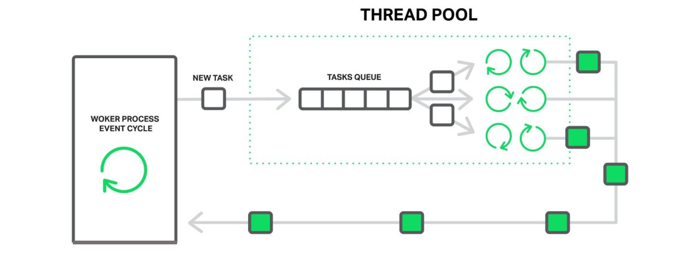

[TOC]

### 异步任务Executors框架与线程池

- 此节与**异步任务**相关。

Executor 管理**多个异步任务**的执行，而无需程序员显式地管理线程的**生命周期**。这里的异步是指多个任务的执行互不干扰，**不需要进行同步**操作。

==**Executor 框架**包括：**线程池**，Executor，Executors，ExecutorService，CompletionService，Future，Callable等。==

Executor接口中之定义了一个方法 execute（Runnable command），该方法接收一个 Runable 实例，它用来执行一个任务，任务即一个实现了 Runnable 接口的类。

ExecutorService 接口继承自 Executor 接口，它提供了更丰富的实现多线程的方法，比如 ExecutorService 提供了关闭自己的方法，以及可为跟踪一个或多个异步任务执行状况而生成 **Future** 的方法。 

Executors 提供了一系列工厂方法用于**创建线程池**，返回的线程池都实现了 ExecutorService 接口。   

```java
// 创建固定线程数量的线程池
public static ExecutorService newFixedThreadPool(int nThreads);
// 创建不限制线程数量的线程池
public static ExecutorService newCachedThreadPool();
// 创建单线程的线程池
public static ExecutorService newSingleThreadExecutor();
// 创建一个支持定时及周期性的任务执行的线程池，多数情况下可用来替代Timer类
public static ScheduledExecutorService newScheduledThreadPool(int corePoolSize);
```

这四种方法都是用的 Executors 中的 ThreadFactory 建立的线程。


#### 创建线程池

##### newFixedThreadPool

创建固定数目线程的线程池，使用固定数目 nThreads 个线程，使用**无界队列 LinkedBlockingQueue**，线程创建后不会超时终止，由于是无界队列，如果排队任务过多，可能消耗过多**内存**。

`newFixedThreadPool`方法簇用于创建固定线程数的`ThreadPoolExecutor`线程池。包括两个构造方法：

```java
public static ExecutorService newFixedThreadPool(int nThreads) {
    return new ThreadPoolExecutor(nThreads, nThreads,
                                    0L, TimeUnit.MILLISECONDS,
                                    new LinkedBlockingQueue<Runnable>());
}
public static ExecutorService newFixedThreadPool(int nThreads, ThreadFactory threadFactory) {
    return new ThreadPoolExecutor(nThreads, nThreads,
                                    0L, TimeUnit.MILLISECONDS,
                                    new LinkedBlockingQueue<Runnable>(),
                                    threadFactory);
}
```

各构造参数总结：

1. 核心线程数与最大线程数`nThreads`：构建的`ThreadPoolExecutor`核心线程数与最大线程数相等且均为`nThreads`，这说明当前线程池不会存在非核心线程，即不会存在线程的回收（`allowCoreThreadTimeOut`默认为`false`），随着任务的提交，线程数增加到`nThreads`个后就不会变化；
2. 存活时间为0：线程存在非核心线程，该时间没有特殊效果；
3. 等待队列`LinkedBlockingQueue`：该等待队列为`LinkedBlockingQueue`类型，没有长度限制；
4. `ThreadFactory`参数：默认为DefaultThreadFactory，也可通过构造函数设置。

##### newCachedThreadPool

使用的队列是 **SynchronousQueue** 创建一个可缓存的线程池，调用 execute 将重用以前构造的线程（如果线程空闲可用），如果现有线程没有可用的，则创建一个**新线程**并添加到池中。终止并从缓存中移除那些已有 60 秒钟未被使用的线程。其 corePoolSize 是 0，maximumPoolSize 是 Integer.MAX_VALUE，keepAliveTime 是60秒。因此可以创建的线程数量是没有限制的。

`newCachedThreadPool`方法簇用于创建可缓存任务的`ThreadPoolExecutor`线程池。包括两个重构方法：

```java
public static ExecutorService newCachedThreadPool() {
    return new ThreadPoolExecutor(0, Integer.MAX_VALUE,
                                    60L, TimeUnit.SECONDS,
                                    new SynchronousQueue<Runnable>());
}
public static ExecutorService newCachedThreadPool(ThreadFactory threadFactory) {
    return new ThreadPoolExecutor(0, Integer.MAX_VALUE,
                                    60L, TimeUnit.SECONDS,
                                    new SynchronousQueue<Runnable>(),
                                    threadFactory);
}
```

结合上文分析的`ThreadPoolExecutor`各构造参数，可总结如下：

1. 核心线程数为0：没有核心线程，即在没有任务运行时所有线程均会被回收；
2. 最大线程数为`Integer.MAX_VALUE`，即线程池中最大可存在的线程为`Integer.MAX_VALUE`，由于此值在通常情况下远远大于系统可新建的线程数，可简单理解为此线程池不限制最大可建的线程数，此处可出现逻辑风险，在提交任务时可能由于超过系统处理能力造成无法再新建线程时会出现OOM异常，提示无法创建新的线程；
3. 存活时间60秒：线程数量超过核心线程后，空闲60秒的线程将会被回收，根据第一条可知核心线程数为0，则本条表示所有线程空闲超过60秒均会被回收；
4. 等待队列`SynchronousQueue`：构建`CachedThreadPool`时，使用的等待队列为`SynchronousQueue`类型，此类型的等待队列较为特殊，可认为这是一个容量为0的阻塞队列，在调用其`offer`方法时，如当前有消费者正在等待获取元素，则返回`true`，否则返回`false`。使用此等待队列可做到快速提交任务到空闲线程，没有空闲线程时触发新建线程；
5. `ThreadFactory`参数：默认为`DefaultThreadFactory`，也可通过构造函数设置。


##### newSingleThreadExecutor

只使用一个线程，使用无界队列 LinkedBlockingQueue，线程创建后不会超时终止，该线程顺序执行所有任务，适用于需要确保所有任务被顺序执行的场景。

`newSingleThreadExecutor`方法簇用于创建只包含一个线程的线程池。包括两个构造方法：

```java
public static ExecutorService newSingleThreadExecutor() {
    return new FinalizableDelegatedExecutorService
        (new ThreadPoolExecutor(1, 1,
                                0L, TimeUnit.MILLISECONDS,
                                new LinkedBlockingQueue<Runnable>()));
}
public static ExecutorService newSingleThreadExecutor(ThreadFactory threadFactory) {
    return new FinalizableDelegatedExecutorService
        (new ThreadPoolExecutor(1, 1,
                                0L, TimeUnit.MILLISECONDS,
                                new LinkedBlockingQueue<Runnable>(),
                                threadFactory));
}
```

结合上文分析的`ThreadPoolExecutor`各构造参数，可总结如下：

1. 核心线程数与最大线程数1:当前线程池中有且仅有一个核心线程；
2. 存活时间为0：当前线程池不存在非核心线程，不会存在线程的超时回收；
3. 等待队列`LinkedBlockingQueue`：该等待队列为`LinkedBlockingQueue`类型，没有长度限制；
4. `ThreadFactory`参数：默认为DefaultThreadFactory，也可通过构造函数设置。


##### **比较**

当系统负载不太高时，单个任务执行的时间也短的话，newCachedThreadPool 效率可能更高，因为任务不需要排队，直接交给一个空闲线程进行处理。

系统负载很高时，newFixedThreadPool 可以通过队列对新任务排队，保证有足够的资源处理实际的任务，而newSingleThreadExecutor 则会为每个任务创建一个线程，导致创建过多的线程竞争 CPU 和内存资源，这时候使用newFixedThreadPool 较为合理。

系统负载极高时，newFixedThreadPool 和 newCachedThreadPool 都不是很好的选择，newFixedThreadPool 的问题是任务**队列过长**，newCachedThreadPool 的问题是创建**线程过多**。这时候应该根据情况自定义 ThreadPoolExecutor，传递合适的参数。

`Executors`工具类创建常见线程池的方法，现对三种线程池区别进行比较。

|     线程池类型     |                  CachedThreadPool                  |             FixedThreadPool              |                     SingleThreadExecutor                     |
| :----------------: | :------------------------------------------------: | :--------------------------------------: | :----------------------------------------------------------: |
|     核心线程数     |                         0                          |          `nThreads`（用户设定）          |                              1                               |
|     最大线程数     |                 Integer.MAX_VALUE                  |          `nThreads`（用户设定）          |                              1                               |
| 非核心线程存活时间 |                        60s                         |               无非核心线程               |                         无非核心线程                         |
|  等待队列最大长度  |                         1                          |                  无限制                  |                            无限制                            |
|        特点        | 提交任务优先复用空闲线程，没有空闲线程则创建新线程 | 固定线程数，等待运行的任务均放入等待队列 | 有且仅有一个线程在运行，等待运行任务放入等待队列，可保证任务运行顺序与提交顺序一直 |
|      内存溢出      |     大量提交任务后，可能出现无法创建线程的OOM      |  大量提交任务后，可能出现内存不足的OOM   |            大量提交任务后，可能出现内存不足的OOM             |


##### 三种类型的线程池与GC关系

**原理说明**

一般情况下 JVM 中的 GC 根据可达性分析确认一个对象是否可被回收(eligible for GC)，而在运行的线程被视为 ‘GCRoot’。因此被在运行的线程引用的对象是不会被 GC 回收的。在`ThreadPoolExecutor`类中具有非静态内部类`Worker`，用于表示当前线程池中的线程，并且根据[Java语言规范](https://docs.oracle.com/javase/specs/jls/se8/html/jls-8.html#jls-8.1.3)`An instance i of a direct inner class C of a class or interface O is associated with an instance of O, known as the immediately enclosing instance of i. The immediately enclosing instance of an object, if any, is determined when the object is created (§15.9.2).`可知非静态内部类对象具有外部包装类对象的引用（此处也可通过查看字节码来验证），因此`Worker`类的对象即作为线程对象（‘GCRoot’）有持有外部类`ThreadPoolExecutor `对象的引用，则在其运行结束之前，外部内不会被 GC 回收。 
根据以上分析，再次观察以上三个线程池：

1、CachedThreadPool：没有核心线程，且线程具有超时时间，可见在其引用消失后，等待任务运行结束且所有线程空闲回收后，GC 开始回收此线程池对象；

2、FixedThreadPool：核心线程数及最大线程数均为`nThreads`，并且在默认`allowCoreThreadTimeOut`为`false`的情况下，其引用消失后，核心线程即使空闲也不会被回收，故 GC 不会回收该线程池；

3、SingleThreadExecutor：默认与`FixedThreadPool`情况一致，但由于其语义为单线程线程池，JDK 开发人员为其提供了`FinalizableDelegatedExecutorService`包装类，在创建`FixedThreadPool`对象时实际返回的是`FinalizableDelegatedExecutorService`对象，该对象持有`FixedThreadPool`对象的引用，但`FixedThreadPool`对象并不引用`FinalizableDelegatedExecutorService`对象，这使得在`FinalizableDelegatedExecutorService`对象的外部引用消失后，GC将会对其进行回收，触发`finalize`函数，而该函数仅仅简单的调用`shutdown`函数关闭线程，是的所有当前的任务执行完成后，回收线程池中线程，则GC可回收线程池对象。

因此可得出结论，`CachedThreadPool`及`SingleThreadExecutor`的对象在不显式调用`shutdown`函数（或`shutdownNow`函数），且其对象引用消失的情况下，**可以被GC回收**；`FixedThreadPool`对象在不显式调用`shutdown`函数（或`shutdownNow`函数），且其对象引用消失的情况下**不会被GC回收，会出现内存泄露**。

**实验验证**

以上结论可使用实验验证：

```java
public static void main(String[] args) throws InterruptedException {
        ExecutorService executorService = Executors.newCachedThreadPool();
        // ExecutorService executorService = Executors.newFixedThreadPool(1);
        // ExecutorService executorService = Executors.newSingleThreadExecutor();
        executorService.execute(() -> System.out.println(Thread.currentThread().getName()));
        // 线程引用置空
        executorService = null;
        Runtime.getRuntime().addShutdownHook(new Thread(() -> System.out.println("Shutdown.")));
        // 等待线程超时，主要对CachedThreadPool有效
        Thread.sleep(100000);
        // 手动触发GC
        System.gc();
}
```

使用以上代码，分别创建三种不同的线程池，可发现最终`FixedThreadPool`不会打印出‘Shutdown.’，JVM没有退出。另外两种线程池均能退出JVM。
因此无论使用什么线程池线程池使用完毕后均**调用`shutdown`**以保证其最终会被GC回收是一个较为安全的编程习惯。


#### Executor 执行任务

在Java 5之后，任务分两类：一类是实现了 Runnable 接口的类，一类是实现了 Callable 接口的类。两者都可以被ExecutorService 执行，但是 Runnable 任务没有返回值，而 Callable 任务有返回值。

##### 执行 Runnable 任务

通过 Executors 的以上四个静态工厂方法获得 **ExecutorService** 实例，而后调用该实例的 execute（Runnable command）方法即可。一旦 Runnable 任务传递到 execute() 方法，该方法便会自动在一个线程上执行。下面是是Executor执行Runnable任务的示例代码：

```java
import java.util.concurrent.ExecutorService; 
import java.util.concurrent.Executors; 
 
public class TestCachedThreadPool{ 
	public static void main(String[] args){ 
        ExecutorService executorService = Executors.newCachedThreadPool(); 
//      ExecutorService executorService = Executors.newFixedThreadPool(5);
//		ExecutorService executorService = Executors.newSingleThreadExecutor();
        for (int i = 0; i < 5; i++){ 
			executorService.execute(new TestRunnable()); 
			System.out.println("************* a" + i + " *************"); 
		} 
        executorService.shutdown(); 
	} 
} 
 
class TestRunnable implements Runnable{ 
	public void run(){ 
		System.out.println(Thread.currentThread().getName() + "线程被调用了。"); 
    } 
}
```

execute 会首先在线程池中选择一个已有空闲线程来执行任务，如果线程池中没有空闲线程，它便会创建一个新的线程来执行任务。

##### 执行 Callable 任务

Callable 的 call() 方法只能通过 ExecutorService 的 submit (Callable\<T> task) 方法来执行，并且返回一个\<T>Future\<T>，是表示任务等待完成的 Future。

Callable 接口类似于 Runnable，两者都是为那些其实例可能被另一个线程执行的类设计的。但是 Runnable 不会返回结果，并且无法抛出经过检查的异常而 Callable 又**返回结果**，而且当获取返回结果时可能会**抛出异常**。Callable 中的 call() 方法类似 Runnable 的 run() 方法，区别同样是有返回值，后者没有。
当将一个 Callable 的对象传递给 ExecutorService 的 **submit** 方法，则该 call 方法自动在一个线程上执行，并且会返回执行**结果 Future** 对象。同样，将 Runnable 的对象传递给 ExecutorService 的 submit 方法，则该 run 方法自动在一个线程上执行，并且会返回执行结果 Future 对象，但是在该 Future 对象上调用 get 方法，将返回null。

```java
import java.util.ArrayList; 
import java.util.List; 
import java.util.concurrent.*; 
 
public class CallableDemo{ 
	public static void main(String[] args){ 
		ExecutorService executorService = Executors.newCachedThreadPool(); 
		List<Future<String>> resultList = new ArrayList<Future<String>>(); 
 
		// 创建10个任务并执行 
		for (int i = 0; i < 10; i++){ 
			// 使用ExecutorService执行Callable类型的任务，并将结果保存在future变量中 
			Future<String> future = executorService.submit(new TaskWithResult(i)); 
			// 将任务执行结果存储到List中 
			resultList.add(future); 
		} 
 
		// 遍历任务的结果 
		for (Future<String> fs : resultList){ 
				try{ 
                    // Future返回如果没有完成，则一直循环等待，直到Future返回完成
					while(!fs.isDone);
                    // 打印各个线程（任务）执行的结果
					System.out.println(fs.get());      
				}catch(InterruptedException e){ 
					e.printStackTrace(); 
				}catch(ExecutionException e){ 
					e.printStackTrace(); 
				}finally{ 
					// 启动一次顺序关闭，执行以前提交的任务，但不接受新任务
					executorService.shutdown(); 
				} 
		} 
	} 
} 
 
class TaskWithResult implements Callable<String>{ 
	private int id; 
 
	public TaskWithResult(int id){ 
		this.id = id; 
	} 
 
	/** 
	 * 任务的具体过程，一旦任务传给ExecutorService的submit方法，
	 * 则该方法自动在一个线程上执行
	 */ 
	public String call() throws Exception {
		System.out.println("call()方法被自动调用！！！" + Thread.currentThread().getName()); 
		// 该返回结果将被Future的get方法得到
		return "call()方法被自动调用，任务返回的结果是：" + id + " " + Thread.currentThread().getName(); 
	} 
}
```

submit() 也是首先选择空闲线程来执行任务，如果没有才会创建新的线程来执行任务。另外，需要注意：如果Future 的返回尚未完成，则get() 方法会**阻塞等待**，直到 Future 完成返回，可以通过调用 isDone() 方法判断Future 是否完成了返回。


##### Executor 的中断任务

调用 Executor 的 shutdown() 方法会等待线程都**执行完毕之后**再关闭，但是如果调用的是 shutdownNow() 方法，则相当于调用每个线程的 interrupt() 方法。

以下使用 Lambda 创建线程，相当于创建了一个匿名内部线程。

```java
public static void main(String[] args) {
    ExecutorService executorService = Executors.newCachedThreadPool();
    executorService.execute(() -> {
        try {
            Thread.sleep(2000);
            System.out.println("Thread run");
        } catch (InterruptedException e) {
            e.printStackTrace();
        }
    });
    // 立马结束
    executorService.shutdownNow();
    System.out.println("Main run");
}
```

```html
Main run
java.lang.InterruptedException: sleep interrupted
    at java.lang.Thread.sleep(Native Method)
    at ExecutorInterruptExample.lambda$main$0(ExecutorInterruptExample.java:9)
    at ExecutorInterruptExample$$Lambda$1/1160460865.run(Unknown Source)
    at java.util.concurrent.ThreadPoolExecutor.runWorker(ThreadPoolExecutor.java:1142)
    at java.util.concurrent.ThreadPoolExecutor$Worker.run(ThreadPoolExecutor.java:617)
    at java.lang.Thread.run(Thread.java:745)
```

如果只想中断 Executor 中的一个线程，可以通过使用 **submit()** 方法来提交一个线程，它会返回一个 **Future<?> 对象**，通过调用该对象的 cancel(true) 方法就可以中断线程。

```java
Future<?> future = executorService.submit(() -> {
    // ...
});
// 通过Future对象中断线程
future.cancel(true);  
```


#### ThreadPoolExecutor

java.uitl.concurrent.ThreadPoolExecutor 类是线程池中**最核心**的一个类，因此如果要透彻地了解Java中的线程池，必须先了解这个类。下面我们来看一下ThreadPoolExecutor类的具体实现源码。

我们先来看一下 ThreadPoolExecutor 类中其他的一些比较**重要成员变量**：

```java
// 任务缓存队列，用来存放等待执行的任务
private final BlockingQueue<Runnable> workQueue;  	
// 线程池的主要状态锁，对线程池状态（比如线程池大小、runState等）的改变都要使用这个锁
private final ReentrantLock mainLock = new ReentrantLock();  
// 用来存放工作集                                                 
private final HashSet<Worker> workers = new HashSet<Worker>();  
// 线程存活时间  
private volatile long  keepAliveTime;      
// 是否允许为核心线程设置存活时间
private volatile boolean allowCoreThreadTimeOut;  
// 核心池的大小（即线程池中的线程数目大于这个参数时，提交的任务会被放进任务缓存队列）
private volatile int   corePoolSize;     
// 线程池最大能容忍的线程数
private volatile int   maximumPoolSize;   
// 线程池中当前的线程数 
private volatile int   poolSize;       
// 任务拒绝策略 
private volatile RejectedExecutionHandler handler; 
// 线程工厂，用来创建线程 
private volatile ThreadFactory threadFactory;   
// 用来记录线程池中曾经出现过的最大线程数 
private int largestPoolSize;   
// 用来记录已经执行完毕的任务个数 
private long completedTaskCount;   
```

每个变量的作用都已经标明出来了，这里要重点解释一下corePoolSize、maximumPoolSize、largestPoolSize三个变量。

corePoolSize在很多地方被翻译成**核心池大小**，其实我的理解这个就是线程池的大小。举个简单的例子：

假如有一个工厂，工厂里面有 10个 工人，每个工人同时只能做一件任务。因此只要当 10 个工人中有工人是空闲的，来了任务就分配给空闲的工人做；当 10 个工人都有任务在做时，如果还来了任务，就把任务进行排队等待；如果说新任务数目增长的速度远远大于工人做任务的速度，那么此时工厂主管可能会想补救措施，比如重新招 4 个临时工人进来；然后就将任务也分配给这 4 个临时工人做；如果说着 14 个工人做任务的速度还是不够，此时工厂主管可能就要考虑不再接收新的任务或者抛弃前面的一些任务了。当这 14 个工人当中有人空闲时，而新任务增长的速度又比较缓慢，工厂主管可能就考虑辞掉4个临时工了，只保持原来的 10 个工人，毕竟请额外的工人是要花钱的。

这个例子中的 corePoolSiz e就是10，而 maximumPoolSize 就是10 + 4 = 14。也就是说corePoolSize就是线程池大小，maximumPoolSize在我看来是线程池的一种补救措施，即任务量突然过大时的一种补救措施。

largestPoolSize只是一个用来起记录作用的变量，用来记录线程池中曾经有过的最大线程数目，跟线程池的容量没有任何关系。

在ThreadPoolExecutor类中提供了四个**构造方法**：

```java
public class ThreadPoolExecutor extends AbstractExecutorService {
    // ...
    public ThreadPoolExecutor(int corePoolSize,int maximumPoolSize,long keepAliveTime,TimeUnit unit, BlockingQueue<Runnable> workQueue);
    public ThreadPoolExecutor(int corePoolSize,int maximumPoolSize,long keepAliveTime,TimeUnit unit, BlockingQueue<Runnable> workQueue,ThreadFactory threadFactory);
    public ThreadPoolExecutor(int corePoolSize,int maximumPoolSize,long keepAliveTime,TimeUnit unit, BlockingQueue<Runnable> workQueue,RejectedExecutionHandler handler);
    public ThreadPoolExecutor(int corePoolSize,int maximumPoolSize,long keepAliveTime,TimeUnit unit, BlockingQueue<Runnable> workQueue,ThreadFactory threadFactory,RejectedExecutionHandler handler);
    // ...
}
```

从上面的代码可以得知，ThreadPoolExecutor 继承了 AbstractExecutorService 类，并提供了四个构造器，事实上，通过观察每个构造器的源码具体实现，发现前面三个构造器都是调用的**第四个**构造器进行的初始化工作。

下面解释下一下构造器中各个参数的含义：

- **corePoolSize**：**核心池**的大小，这个参数跟后面讲述的线程池的实现原理有非常大的关系。在创建了线程池后，默认情况下，线程池中并没有任何线程，而是等待有任务到来才创建线程去执行任务，除非调用了prestartAllCoreThreads() 或者 prestartCoreThread() 方法，从这两个方法的名字就可以看出，是**预创建**线程的意思，即在没有任务到来之前就创建 corePoolSize 个线程或者一个线程。默认情况下，在创建了线程池后，线程池中的线程数为 0，当有任务来之后，就会创建一个线程去执行任务，当线程池中的线程数目达到corePoolSize 后，就会把到达的任务放到**缓存队列**当中；
- **maximumPoolSize**：线程池**最大**线程数，这个参数也是一个非常重要的参数，它表示在线程池中最多能创建多少个线程；
- **keepAliveTime**：表示线程**没有任务执行时最多保持多久时间会终止**。默认情况下，只有当线程池中的线程数**大于 corePoolSize** 时，keepAliveTime 才会起作用，直到线程池中的线程数不大于 corePoolSize，即当线程池中的线程数大于 corePoolSize 时，如果一个线程空闲的时间达到 keepAliveTime，则会终止，直到线程池中的线程数不超过 corePoolSize。但是如果调用了 allowCoreThreadTimeOut(boolean) 方法，在线程池中的线程数不大于 corePoolSize 时，keepAliveTime 参数也会起作用，直到线程池中的线程数为0；
- **unit**：参数keepAliveTime的时间单位，有7种取值，在TimeUnit类中有7种静态属性：

```java
TimeUnit.DAYS;              // 天
TimeUnit.HOURS;             // 小时
TimeUnit.MINUTES;           // 分钟
TimeUnit.SECONDS;           // 秒
TimeUnit.MILLISECONDS;      // 毫秒
TimeUnit.MICROSECONDS;      // 微妙
TimeUnit.NANOSECONDS;       // 纳秒
```

- **workQueue**：一个**阻塞队列**，用来存储**等待执行的任务**，这个参数的选择也很重要，会对线程池的运行过程产生重大影响，一般来说，这里的阻塞队列有以下几种选择：

```java
ArrayBlockingQueue;
LinkedBlockingQueue;
SynchronousQueue;
```

ArrayBlockingQueue 和 PriorityBlockingQueue 使用较少，一般使用 LinkedBlockingQueue 和 SynchronousQueue。线程池的排队策略与 BlockingQueue 有关。

- **threadFactory**：线程工厂，主要用来**创建线程**；
- **handler**：表示当**拒绝**处理任务时的策略，有以下四种取值:

```java
ThreadPoolExecutor.AbortPolicy;	// 丢弃任务并抛出RejectedExecutionException异常。 
ThreadPoolExecutor.DiscardPolicy;	// 也是丢弃任务，但是不抛出异常。 
ThreadPoolExecutor.DiscardOldestPolicy;	// 丢弃队列最前面的任务，然后重新尝试执行任务（重复此过程）
ThreadPoolExecutor.CallerRunsPolicy;	// 由调用线程处理该任务 
```

从上面给出的 ThreadPoolExecutor 类的代码可以知道，ThreadPoolExecutor 继承了 AbstractExecutorService，AbstractExecutorService 是一个抽象类，它实现了 ExecutorService 接口。而ExecutorService 接口又是继承了 Executor接口。

```java
public interface Executor {
    void execute(Runnable command);
}
```

Executor 是一个顶层接口，在它里面只声明了一个方法 execute(Runnable)，返回值为 void，参数为 Runnable 类型，从字面意思可以理解，就是用来执行传进去的任务的；

然后 ExecutorService 接口继承了 Executor 接口，并声明了一些方法：submit、invokeAll、invokeAny 以及shutDown 等；

抽象类 AbstractExecutorService 实现了 ExecutorService 接口，基本实现了 ExecutorService 中声明的所有方法；

然后 ThreadPoolExecutor 继承了类 AbstractExecutorService。

在ThreadPoolExecutor类中有几个非常重要的方法：

```java
execute();
submit();
shutdown();
shutdownNow();
```

execute() 方法实际上是 Executor 中声明的方法，在 ThreadPoolExecutor 进行了具体的实现，这个方法是ThreadPoolExecutor 的核心方法，通过这个方法可以向线程池**提交一个任务**，交由线程池去执行。

submit() 方法是在 ExecutorService 中声明的方法，在 AbstractExecutorService 就已经有了具体的实现，在ThreadPoolExecutor 中并没有对其进行重写，这个方法也是用来向线程池**提交任务**的，但是它和 execute() 方法不同，**它能够返回任务执行的结果**，去看 submit() 方法的实现，会发现它实际上还是调用的 execute() 方法，只不过它利用了 **Future** 来获取任务执行结果。

shutdown() 和 shutdownNow() 是用来**关闭**线程池的。

还有很多其他的方法：

比如：getQueue() 、getPoolSize() 、getActiveCount()、getCompletedTaskCount() 等获取与线程池相关属性的方法，可以自行查阅 API。


#### 线程池现原理详解



以下基于 Java6。


**线程池的作用**
线程池作用就是限制系统中执行线程的数量。 
根据系统的环境情况，可以自动或手动设置线程数量，达到运行的最佳效果；少了浪费了系统资源，多了造成系统拥挤效率不高。用线程池控制线程数量，其他线程排 队等候。一个任务执行完毕，再从队列的中取最前面的任务开始执行。若队列中没有等待进程，线程池的这一资源处于等待。当一个新任务需要运行时，如果线程池中有等待的工作线程，就可以开始运行了；否则进入等待队列。


##### 1. 线程池状态

在 ThreadPoolExecutor 中定义了一个 volatile 变量，另外定义了几个 static final 变量表示线程池的各个状态。

```java
volatile int runState;
static final int RUNNING    = 0;
static final int SHUTDOWN   = 1;
static final int STOP       = 2;
static final int TERMINATED = 3;
```

runState 表示当前线程池的状态，它是一个 volatile 变量用来保证线程之间的**内存可见性**；

下面的几个static final变量表示 runState 可能的几个取值。

当创建线程池后，初始时，线程池处于 **RUNNING** 状态；

如果调用了 shutdown() 方法，则线程池处于 **SHUTDOWN** 状态，此时线程池不能够接受新的任务，它会等待所有任务执行完毕；

如果调用了 shutdownNow() 方法，则线程池处于 **STOP** 状态，此时线程池不能接受新的任务，并且会去尝试终止正在执行的任务；

当线程池处于 SHUTDOWN 或 STOP 状态，并且所有工作线程已经销毁，任务缓存队列已经清空或执行结束后，线程池被设置为 TERMINATED 状态。

##### 2. 任务的执行

看一下任务从提交到最终执行完毕经历了哪些过程。

在 ThreadPoolExecutor 类中，**最核心**的任务提交方法是 **execute**() 方法，虽然通过 **submit**()  也可以提交任务，但是实际上 submit()  方法里面最终调用的还是 execute() 方法，所以我们只需要研究 execute() 方法的实现原理即可：

```java
public void execute(Runnable command) {
    if (command == null)
        throw new NullPointerException();
    if (poolSize >= corePoolSize || !addIfUnderCorePoolSize(command)) {
        if (runState == RUNNING && workQueue.offer(command)) {
            if (runState != RUNNING || poolSize == 0)
                ensureQueuedTaskHandled(command);
        }
        else if (!addIfUnderMaximumPoolSize(command))
            reject(command); // is shutdown or saturated
    }
}
```

上面的代码可能看起来不是那么容易理解，下面我们一句一句解释：

首先，判断提交的任务 command 是否为 null，若是 null，则抛出空指针异常；

接着是这句，这句要好好理解一下：

```java
if (poolSize >= corePoolSize || !addIfUnderCorePoolSize(command))
```

 　　由于是或条件运算符，所以先计算前半部分的值，如果线程池中当前线程数不小于核心池大小，那么就会直接进入下面的 if 语句块了。

　　如果线程池中当前线程数小于核心池大小，则接着执行后半部分，也就是执行

```java
addIfUnderCorePoolSize(command)
```

　　如果执行完 addIfUnderCorePoolSize 这个方法返回 false，则继续执行下面的if语句块，否则整个方法就直接执行完毕了。

　　如果执行完 addIfUnderCorePoolSize 这个方法返回 false，然后接着判断：

```java
if(runState == RUNNING && workQueue.offer(command))
```

 　　如果当前线程池处于 RUNNING 状态，则将任务放入任务缓存队列；如果当前线程池不处于 RUNNING 状态或者任务放入缓存队列失败，则执行：

```java
addIfUnderMaximumPoolSize(command)
```

　　如果执行 addIfUnderMaximumPoolSize 方法失败，则执行 reject() 方法进行任务拒绝处理。

　　回到前面：

```java
if(runState == RUNNING && workQueue.offer(command))
```

 　　这句的执行，如果说当前线程池处于RUNNING状态且将任务放入任务缓存队列成功，则继续进行判断：

```java
if(runState != RUNNING || poolSize == 0)
```

 　　这句判断是为了防止在将此任务添加进任务缓存队列的同时其他线程突然调用 shutdown 或者shutdownNow 方法关闭了线程池的一种应急措施。如果是这样就执行：

```java
ensureQueuedTaskHandled(command)
```

 进行应急处理，从名字可以看出是保证 添加到任务缓存队列中的任务得到处理。

接着看2个关键方法的实现：addIfUnderCorePoolSize 和 addIfUnderMaximumPoolSize：

```java
private boolean addIfUnderCorePoolSize(Runnable firstTask) {
    Thread t = null;
    final ReentrantLock mainLock = this.mainLock;
    mainLock.lock();
    try {
        if (poolSize < corePoolSize && runState == RUNNING)
            t = addThread(firstTask);        // 创建线程去执行firstTask任务   
        } finally {
        mainLock.unlock();
    }
    if (t == null)
        return false;
    t.start();
    return true;
}
```

这个是 addIfUnderCorePoolSize 方法的具体实现，从名字可以看出它的意图就是当低于核心吃大小时执行的方法。下面看其具体实现，首先获取到锁，因为这地方涉及到线程池状态的变化，先通过if语句判断当前线程池中的线程数目是否小于核心池大小，有朋友也许会有疑问：前面在 execute() 方法中不是已经判断过了吗，只有线程池当前线程数目小于核心池大小才会执行 addIfUnderCorePoolSize 方法的，为何这地方还要继续判断？原因很简单，前面的判断过程中并没有加锁，因此可能在 execute 方法判断的时候 poolSize 小于 corePoolSize，而判断完之后，在其他线程中又向线程池提交了任务，就可能导致 poolSize 不小于 corePoolSize 了，所以需要在这个地方继续判断。然后接着判断线程池的状态是否为 RUNNING，原因也很简单，因为有可能在其他线程中调用了shutdown 或者 shutdownNow 方法。然后就是执行

```java
t = addThread(firstTask);
```

这个方法也非常关键，传进去的参数为提交的任务，返回值为 Thread 类型。然后接着在下面判断t是否为空，为空则表明创建线程失败（即poolSize >= corePoolSize 或者 runState 不等于 RUNNING），否则调用 t.start() 方法启动线程。

我们来看一下addThread方法的实现：

```java
private Thread addThread(Runnable firstTask) {
    Worker w = new Worker(firstTask);
    Thread t = threadFactory.newThread(w);  // 创建一个线程，执行任务   
    if (t != null) {
        w.thread = t;            // 将创建的线程的引用赋值为w的成员变量       
        workers.add(w);
        int nt = ++poolSize;     // 当前线程数加1       
        if (nt > largestPoolSize)
            largestPoolSize = nt;
    }
    return t;
}
```

在 addThread 方法中，首先用提交的任务创建了一个 Worker 对象，然后调用线程工厂 threadFactory 创建了一个新的线程 t，然后将线程 t 的引用赋值给了 Worker 对象的成员变量 thread，接着通过 workers.add(w) 将Worker 对象添加到工作集当中。

下面我们看一下Worker类的实现：

```java
private final class Worker implements Runnable {
    private final ReentrantLock runLock = new ReentrantLock();
    private Runnable firstTask;
    volatile long completedTasks;
    Thread thread;
    Worker(Runnable firstTask) {
        this.firstTask = firstTask;
    }
    boolean isActive() {
        return runLock.isLocked();
    }
    void interruptIfIdle() {
        final ReentrantLock runLock = this.runLock;
        if (runLock.tryLock()) {
            try {
        if (thread != Thread.currentThread())
        thread.interrupt();
            } finally {
                runLock.unlock();
            }
        }
    }
    void interruptNow() {
        thread.interrupt();
    }
 
    private void runTask(Runnable task) {
        final ReentrantLock runLock = this.runLock;
        runLock.lock();
        try {
            if (runState < STOP &&
                Thread.interrupted() &&
                runState >= STOP)
            boolean ran = false;
            // beforeExecute方法是ThreadPoolExecutor类的一个方法，没有具体实现，用户可以根据
            beforeExecute(thread, task);   
            // 自己需要重载这个方法和后面的afterExecute方法来进行一些统计信息，比如某个任务的执行时间等           
            try {
                task.run();
                ran = true;
                afterExecute(task, null);
                ++completedTasks;
            } catch (RuntimeException ex) {
                if (!ran)
                    afterExecute(task, ex);
                throw ex;
            }
        } finally {
            runLock.unlock();
        }
    }
 
    public void run() {
        try {
            Runnable task = firstTask;
            firstTask = null;
            while (task != null || (task = getTask()) != null) {
                runTask(task);
                task = null;
            }
        } finally {
            workerDone(this);   // 当任务队列中没有任务时，进行清理工作       
        }
    }
}
```

它实际上实现了 Runnable 接口，因此上面的 Thread t = threadFactory.newThread(w); 效果跟下面这句的效果基本一样：

```java
Thread t = new Thread(w);
```

相当于传进去了一个 Runnable 任务，在线程 t 中执行这个 Runnable。

既然 Worker 实现了 Runnable 接口，那么自然最核心的方法便是 run() 方法了：

```java
public void run() {
    try {
        Runnable task = firstTask;
        firstTask = null;
        while (task != null || (task = getTask()) != null) {
            runTask(task);
            task = null;
        }
    } finally {
        workerDone(this);
    }
}
```

从 run 方法的实现可以看出，它首先执行的是通过构造器传进来的任务 firstTask，在调用 runTask() 执行完firstTask 之后，在 while 循环里面不断通过 getTask() 去取新的任务来执行，那么去哪里取呢？自然是从任务缓存队列里面去取，getTask 是 ThreadPoolExecutor 类中的方法，并不是 Worker 类中的方法，下面是 getTask 方法的实现：

```java
Runnable getTask() {
    for (;;) {
        try {
            int state = runState;
            if (state > SHUTDOWN)
                return null;
            Runnable r;
            if (state == SHUTDOWN)  // Help drain queue
                r = workQueue.poll();
            // 如果线程数大于核心池大小或者允许为核心池线程设置空闲时间
            else if (poolSize > corePoolSize || allowCoreThreadTimeOut) 
                // 则通过poll取任务，若等待一定的时间取不到任务，则返回null
                r = workQueue.poll(keepAliveTime, TimeUnit.NANOSECONDS);
            else
                r = workQueue.take();
            if (r != null)
                return r;
            // 如果没取到任务，即r为null，则判断当前的worker是否可以退出
            if (workerCanExit()) {    
                if (runState >= SHUTDOWN) // Wake up others
                    interruptIdleWorkers();   // 中断处于空闲状态的worker
                return null;
            }
            // Else retry
        } catch (InterruptedException ie) {
            // On interruption, re-check runState
        }
    }
}
```

在 getTask 中，先判断当前线程池状态，如果 runState 大于 SHUTDOWN（即为 STOP 或者 TERMINATED），则直接返回 null。

如果 runState 为 SHUTDOWN 或者 RUNNING，则从任务缓存队列取任务。

如果当前线程池的线程数大于核心池大小 corePoolSize 或者允许为核心池中的线程设置空闲存活时间，则调用poll(time,timeUnit) 来取任务，这个方法会等待一定的时间，如果取不到任务就返回 null。

然后判断取到的任务 r 是否为 null，为 null 则通过调用 workerCanExit() 方法来判断当前 worker 是否可以退出，我们看一下 workerCanExit() 的实现：

```java
private boolean workerCanExit() {
    final ReentrantLock mainLock = this.mainLock;
    mainLock.lock();
    boolean canExit;
    // 如果runState大于等于STOP，或者任务缓存队列为空了
    // 或者允许为核心池线程设置空闲存活时间并且线程池中的线程数目大于1
    try {
        canExit = runState >= STOP ||
            workQueue.isEmpty() ||
            (allowCoreThreadTimeOut &&
             poolSize > Math.max(1, corePoolSize));
    } finally {
        mainLock.unlock();
    }
    return canExit;
}
```

也就是说如果线程池处于 STOP 状态、或者任务队列已为空或者允许为核心池线程设置空闲存活时间并且线程数大于 1  时，允许 worker 退出。如果允许 worker 退出，则调用 interruptIdleWorkers() 中断处于空闲状态的worker，我们看一下 interruptIdleWorkers() 的实现：

```java
void interruptIdleWorkers() {
    final ReentrantLock mainLock = this.mainLock;
    mainLock.lock();
    try {
        for (Worker w : workers)  // 实际上调用的是worker的interruptIfIdle()方法
            w.interruptIfIdle();
    } finally {
        mainLock.unlock();
    }
}
```

从实现可以看出，它实际上调用的是 worker 的 interruptIfIdle() 方法，在 worker 的 interruptIfIdle() 方法中：

```java
void interruptIfIdle() {
    final ReentrantLock runLock = this.runLock;
    // 这里是调用tryLock()来获取锁的，因为如果当前worker正在执行任务，锁已经被获取了，是无法获取到锁的
    if (runLock.tryLock()) {    
        // 如果成功获取了锁，说明当前worker处于空闲状态
        try {
    if (thread != Thread.currentThread())  
    thread.interrupt();
        } finally {
            runLock.unlock();
        }
    }
}
```

这里有一个非常巧妙的设计方式，假如我们来设计线程池，可能会有一个任务分派线程，当发现有线程空闲时，就从任务缓存队列中取一个任务交给空闲线程执行。但是在这里，并没有采用这样的方式，因为这样会要额外地对任务分派线程进行管理，无形地会增加难度和复杂度，这里直接让执行完任务的线程去任务缓存队列里面取任务来执行。

 　　我们再看 addIfUnderMaximumPoolSize 方法的实现，这个方法的实现思想和 addIfUnderCorePoolSize 方法的实现思想非常相似，唯一的区别在于 addIfUnderMaximumPoolSize 方法是在线程池中的线程数达到了核心池大小并且往任务队列中添加任务失败的情况下执行的：

```java
private boolean addIfUnderMaximumPoolSize(Runnable firstTask) {
    Thread t = null;
    final ReentrantLock mainLock = this.mainLock;
    mainLock.lock();
    try {
        if (poolSize < maximumPoolSize && runState == RUNNING)
            t = addThread(firstTask);
    } finally {
        mainLock.unlock();
    }
    if (t == null)
        return false;
    t.start();
    return true;
}
```

看到没有，其实它和 addIfUnderCorePoolSize 方法的实现基本一模一样，只是 if 语句判断条件中的 poolSize < maximumPoolSize 不同而已。

　　到这里，对任务提交给线程池之后到被执行的整个过程应该有了一个基本的了解，下面总结一下：

　　1）首先，要清楚 corePoolSize 和 maximumPoolSize 的含义；

　　2）其次，要知道 Worker 是用来起到什么作用的；

　　3）要知道任务提交给线程池之后的**处理策略**，这里总结一下主要有4点：

- 如果当前线程池中的线程数目小于 corePoolSize，则每来一个任务，就会创建一个线程去执行这个任务；
- 如果当前线程池中的线程数目 >= corePoolSize，则每来一个任务，会尝试将其添加到任务缓存队列当中，若添加成功，则该任务会等待空闲线程将其取出去执行；若添加失败（一般来说是任务缓存队列已满），则会尝试创建新的线程去执行这个任务；
- 如果当前线程池中的线程数目达到 maximumPoolSize，则会采取任务拒绝策略进行处理；
- 如果线程池中的线程数量大于 corePoolSize 时，如果某线程空闲时间超过 keepAliveTime，线程将被终止，直至线程池中的线程数目不大于 corePoolSize；如果允许为核心池中的线程设置存活时间，那么核心池中的线程空闲时间超过 keepAliveTime，线程也会被终止。


##### 3. 线程池中的线程初始化

默认情况下，创建线程池之后，线程池中是没有线程的，需要提交任务之后才会创建线程。

在实际中如果需要线程池创建之后立即创建线程，可以通过以下两个方法办到，即预先创建线程：

- prestartCoreThread()：初始化一个核心线程；
- prestartAllCoreThreads()：初始化所有核心线程

```java
public boolean prestartCoreThread() {
    return addIfUnderCorePoolSize(null); // 注意传进去的参数是null
}
 
public int prestartAllCoreThreads() {
    int n = 0;
    while (addIfUnderCorePoolSize(null))// 注意传进去的参数是null
        ++n;
    return n;
}
```

注意上面传进去的参数是 null，根据前面的分析可知如果传进去的参数为 null，则最后执行线程会阻塞在 getTask方法中的

```java
r = workQueue.take();
```

即等待任务队列中有任务。


##### 4. 任务缓存队列及排队策略

在前面我们多次提到了任务缓存队列，即 **workQueue**，它用来存放等待执行的任务。

workQueue的类型为 BlockingQueue\<Runnable>，通常可以取下面三种类型：

- ArrayBlockingQueue：基于数组的先进先出队列，此队列创建时必须指定大小；
- LinkedBlockingQueue：基于链表的先进先出队列，如果创建时没有指定此队列大小，则默认为Integer.MAX_VALUE；
- synchronousQueue：这个队列比较特殊，它不会保存提交的任务，而是将直接新建一个线程来执行新来的任务。


##### 5. 任务拒绝策略

当线程池的任务缓存队列已满并且线程池中的线程数目达到 maximumPoolSize，如果还有任务到来就会采取任务拒绝策略，通常有以下四种策略：

```java
ThreadPoolExecutor.AbortPolicy; 	// 丢弃任务并抛出RejectedExecutionException异常。
ThreadPoolExecutor.DiscardPolicy;	// 也是丢弃任务，但是不抛出异常。
ThreadPoolExecutor.DiscardOldestPolicy;	// 丢弃队列最前面的任务，然后重新尝试执行任务（重复此过程）
ThreadPoolExecutor.CallerRunsPolicy;	// 由调用线程处理该任务
```


##### 6. 线程池的关闭

ThreadPoolExecutor提供了两个方法，用于线程池的关闭，分别是shutdown()和shutdownNow()，其中：

- shutdown()：不会立即终止线程池，而是要等所有任务缓存队列中的任务都执行完后才终止，但再也不会接受新的任务
- shutdownNow()：立即终止线程池，并尝试打断正在执行的任务，并且清空任务缓存队列，返回尚未执行的任务


##### 7. 线程池容量的动态调整

　　ThreadPoolExecutor提供了动态调整线程池容量大小的方法：setCorePoolSize()和setMaximumPoolSize()，

- setCorePoolSize：设置核心池大小
- setMaximumPoolSize：设置线程池最大能创建的线程数目大小

　　当上述参数从小变大时，ThreadPoolExecutor进行线程赋值，还可能立即创建新的线程来执行任务。


##### 8. 使用示例

```java
public class Test {
     public static void main(String[] args) {   
         ThreadPoolExecutor executor = new ThreadPoolExecutor(5, 10, 200, TimeUnit.MILLISECONDS, new ArrayBlockingQueue<Runnable>(5));
          
         for(int i=0;i<15;i++){
             MyTask myTask = new MyTask(i);
             executor.execute(myTask);
             System.out.println("线程池中线程数目："+executor.getPoolSize()+"，队列中等待执行的任务数目："+
             executor.getQueue().size()+"，已执行玩别的任务数目："+executor.getCompletedTaskCount());
         }
         executor.shutdown();
     }
}
 
 
class MyTask implements Runnable {
    private int taskNum;
     
    public MyTask(int num) {
        this.taskNum = num;
    }
     
    @Override
    public void run() {
        System.out.println("正在执行task "+taskNum);
        try {
            Thread.currentThread().sleep(4000);
        } catch (InterruptedException e) {
            e.printStackTrace();
        }
        System.out.println("task "+taskNum+"执行完毕");
    }
}
```

```html
正在执行task 0
线程池中线程数目：1，队列中等待执行的任务数目：0，已执行玩别的任务数目：0
线程池中线程数目：2，队列中等待执行的任务数目：0，已执行玩别的任务数目：0
正在执行task 1
线程池中线程数目：3，队列中等待执行的任务数目：0，已执行玩别的任务数目：0
正在执行task 2
线程池中线程数目：4，队列中等待执行的任务数目：0，已执行玩别的任务数目：0
正在执行task 3
线程池中线程数目：5，队列中等待执行的任务数目：0，已执行玩别的任务数目：0
正在执行task 4
线程池中线程数目：5，队列中等待执行的任务数目：1，已执行玩别的任务数目：0
线程池中线程数目：5，队列中等待执行的任务数目：2，已执行玩别的任务数目：0
线程池中线程数目：5，队列中等待执行的任务数目：3，已执行玩别的任务数目：0
线程池中线程数目：5，队列中等待执行的任务数目：4，已执行玩别的任务数目：0
线程池中线程数目：5，队列中等待执行的任务数目：5，已执行玩别的任务数目：0
线程池中线程数目：6，队列中等待执行的任务数目：5，已执行玩别的任务数目：0
正在执行task 10
线程池中线程数目：7，队列中等待执行的任务数目：5，已执行玩别的任务数目：0
正在执行task 11
线程池中线程数目：8，队列中等待执行的任务数目：5，已执行玩别的任务数目：0
正在执行task 12
线程池中线程数目：9，队列中等待执行的任务数目：5，已执行玩别的任务数目：0
正在执行task 13
线程池中线程数目：10，队列中等待执行的任务数目：5，已执行玩别的任务数目：0
正在执行task 14
task 3执行完毕
task 0执行完毕
task 2执行完毕
task 1执行完毕
正在执行task 8
正在执行task 7
正在执行task 6
正在执行task 5
task 4执行完毕
task 10执行完毕
task 11执行完毕
task 13执行完毕
task 12执行完毕
正在执行task 9
task 14执行完毕
task 8执行完毕
task 5执行完毕
task 7执行完毕
task 6执行完毕
task 9执行完毕
```

从执行结果可以看出，当线程池中线程的数目大于 5 时，便将任务放入任务缓存队列里面，当任务缓存队列满了之后，便创建新的线程。如果上面程序中，将 for 循环中改成执行20个任务，就会抛出任务拒绝异常了。

不过在java doc中，并不提倡我们直接使用 ThreadPoolExecutor，而是使用 Executors 类中提供的几个静态方法来创建线程池。


##### 9. 线程池补充

###### 线程池死锁

任务之间有依赖可能造成线程池死锁。可以使用 newCachedThreadPool 创建线程池，让线程数不受限制。也可以使用 SynchronousQueue 来避免线程池死锁。


