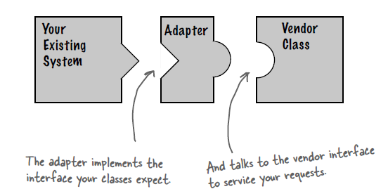
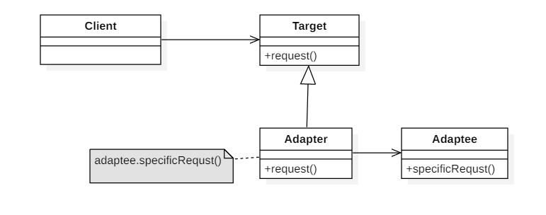
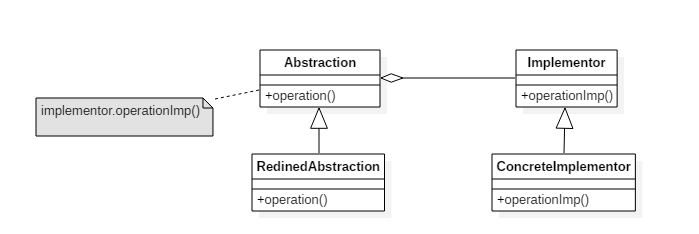
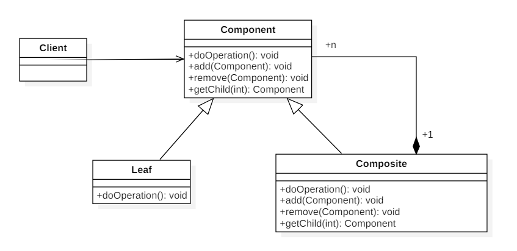
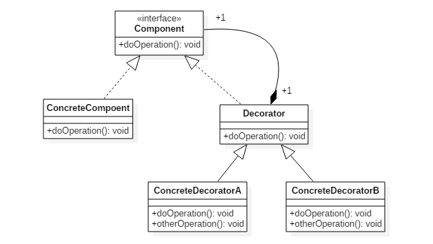
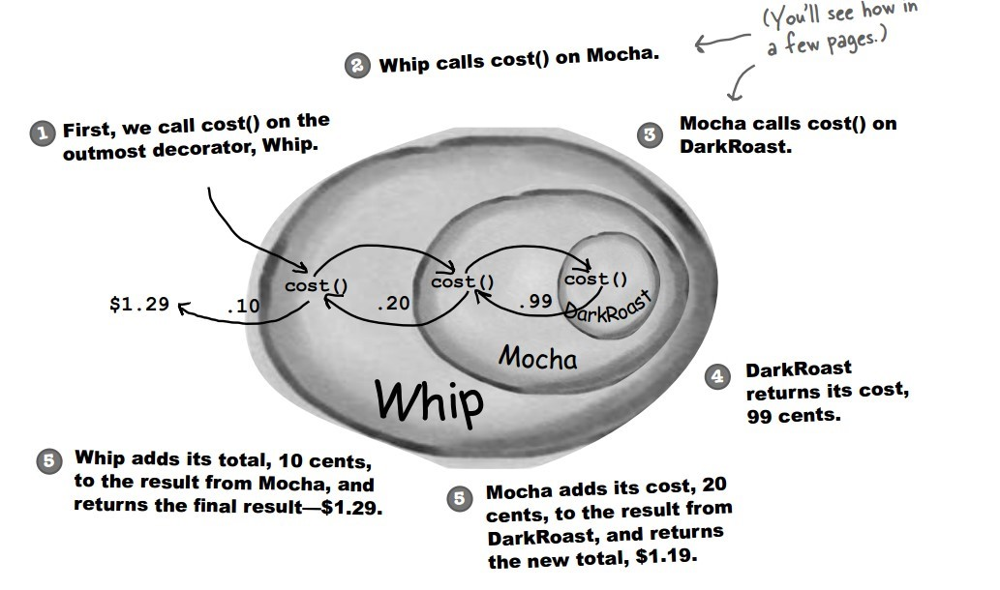
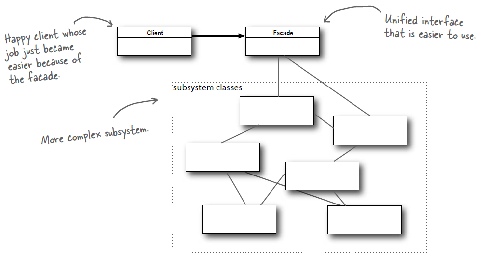
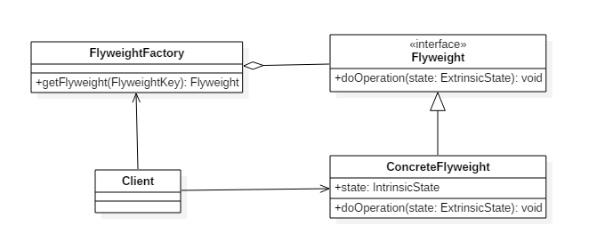
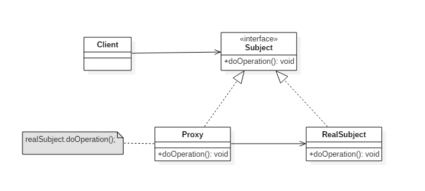

[TOC]

### 设计模式-结构型

#### 适配器模式（Adapter）

##### Intent

把一个类接口转换成另一个用户需要的接口。Adapter模式使得原本由于接口不兼容而不能一起工作的那些类可以一起工作。



定义一个**包装类**，用于**包装不兼容接口的对象**：

- 包装类 = 适配器 Adapter；
- 被包装对象 = 适配者Adaptee = 被适配的类

**使用场景：**

- 系统需要复用现有类，而该类的接口不符合系统的需求，可以使用适配器模式使得原本由于接口不兼容而不能一起工作的那些类可以一起工作。
- 多个组件功能类似，但接口不统一且可能会经常切换时，可使用适配器模式，使得客户端可以以统一的接口使用它们。
- 需要一个**统一的输出接口**，但是**输入类型却不可预知**。

**类的适配器模式和对象的适配器模式的选择：**

适配器模式的形式分为：类的适配器模式 & 对象的适配器模式

- 灵活使用时：选择对象的适配器模式，类适配器使用对象继承的方式，是静态的定义方式；而对象适配器使用对象组合的方式，是动态组合的方式。
- 需要同时配源类和其子类：选择对象的适配器，对于对象适配器，一个适配器可以把多种不同的源适配到同一个目标。
- 需要重新定义 Adaptee 的部分行为：选择类适配器。对于类适配器，适配器可以重定义 Adaptee 的部分行为，相当于子类覆盖父类的部分实现方法。对于对象适配器，要重定义 Adaptee 的行为比较困难。
- 仅仅希望使用方便时：选择类适配器，对于类适配器，仅仅引入了一个对象，并不需要额外的引用来间接得到Adaptee。对于对象适配器，需要额外的引用来间接得到Adaptee。

##### Class Diagram



##### Implementation

下面以一个案例来介绍设配器模式：该过程大概分成4步：

步骤1：定义目标接口（Target）：客户所期待的接口。目标可以是具体的或抽象的类，也可以是接口。

```java
public interface Target {
	void handleReq();
}
```

步骤2：定义 需要适配的类（Adaptee）：需要适配的类或适配者类。

```java
/**
 * 被适配的类
 * (相当于例子中的，PS/2键盘)
 */
public class Adaptee {
	
	public void request(){
		System.out.println("可以完成客户请求的需要的功能！");
	}
}
```

步骤3：定义适配器（Adapter）：通过包装一个需要适配的对象，把原接口转换成目标接口。

```java
/**
 * 适配器 (类适配器方式)
 * (相当于usb和ps/2的转接器)
 */
public class Adapter extends Adaptee implements Target {
	@Override
	public void handleReq() {
		super.request();
	}
}
```

对象适配器方式:

```java
/**
 * 适配器 (对象适配器方式,使用了组合的方式跟被适配对象整合)
 * (相当于usb和ps/2的转接器)
 */
public class Adapter2  implements Target {
	
	private Adaptee adaptee;

	@Override
	public void handleReq() {
		adaptee.request();
	}

	public Adapter2(Adaptee adaptee) {
		super();
		this.adaptee = adaptee;
	}
}
```

步骤4：测试

```java
/**
 * 客户端类:测试
 */
public class Client {
	
	public void test1(Target t){
		t.handleReq();
	}
	
	public static void main(String[] args) {
		Client  c = new Client();
		Adaptee a = new Adaptee();
//		Target t = new Adapter();
		Target t = new Adapter2(a);
		c.test1(t);
	}
}
```

##### JDK

- [java.util.Arrays#asList()](http://docs.oracle.com/javase/8/docs/api/java/util/Arrays.html#asList%28T...%29)
- [java.util.Collections#list()](https://docs.oracle.com/javase/8/docs/api/java/util/Collections.html#list-java.util.Enumeration-)
- [java.util.Collections#enumeration()](https://docs.oracle.com/javase/8/docs/api/java/util/Collections.html#enumeration-java.util.Collection-)
- [javax.xml.bind.annotation.adapters.XMLAdapter](http://docs.oracle.com/javase/8/docs/api/javax/xml/bind/annotation/adapters/XmlAdapter.html#marshal-BoundType-)


#### 桥接模式（Bridge）

##### Intent

将**抽象与实现分离**开来，使它们可以独立变化。就像一个桥，将两个变化维度连接起来。各个维度都可以独立的变化。故称之为桥接模式。

**核心要点** ： 处理多层继承结构，处理多维度变化的场景，将各个维度设计成独立的继承结构，使各个维度可以独立的扩展在抽象层建立关联。

**实际开发中应用场景**:

1. JDBC 驱动程序;
2. AWT 中的 Peer 架构;
3. 银行日志管理：格式分类：操作日志、交易日志、异常日志。距离分类：本地记录日志、异地记录日志。

##### Class Diagram

- **Abstraction**：定义**抽象类**的接口
- **Implementor**：定义**实现类**接口



##### Implementation

RemoteControl 表示**遥控器**，指代 Abstraction。

TV 表示**电视**，指代 Implementor。

桥接模式将遥控器和电视分离开来，从而可以独立改变遥控器或者电视的实现。

```java
public abstract class TV {
    public abstract void on();

    public abstract void off();

    public abstract void tuneChannel();
}
```

```java
public class Sony extends TV {
    @Override
    public void on() {
        System.out.println("Sony.on()");
    }

    @Override
    public void off() {
        System.out.println("Sony.off()");
    }

    @Override
    public void tuneChannel() {
        System.out.println("Sony.tuneChannel()");
    }
}
```

```java
public class RCA extends TV {
    @Override
    public void on() {
        System.out.println("RCA.on()");
    }

    @Override
    public void off() {
        System.out.println("RCA.off()");
    }

    @Override
    public void tuneChannel() {
        System.out.println("RCA.tuneChannel()");
    }
}
```

```java
public abstract class RemoteControl {
    protected TV tv;

    public RemoteControl(TV tv) {
        this.tv = tv;
    }

    public abstract void on();

    public abstract void off();

    public abstract void tuneChannel();
}
```

```java
public class ConcreteRemoteControl1 extends RemoteControl {
    public ConcreteRemoteControl1(TV tv) {
        super(tv);
    }

    @Override
    public void on() {
        System.out.println("ConcreteRemoteControl1.on()");
        tv.on();
    }

    @Override
    public void off() {
        System.out.println("ConcreteRemoteControl1.off()");
        tv.off();
    }

    @Override
    public void tuneChannel() {
        System.out.println("ConcreteRemoteControl1.tuneChannel()");
        tv.tuneChannel();
    }
}
```

```java
public class ConcreteRemoteControl2 extends RemoteControl {
    public ConcreteRemoteControl2(TV tv) {
        super(tv);
    }

    @Override
    public void on() {
        System.out.println("ConcreteRemoteControl2.on()");
        tv.on();
    }

    @Override
    public void off() {
        System.out.println("ConcreteRemoteControl2.off()");
        tv.off();
    }

    @Override
    public void tuneChannel() {
        System.out.println("ConcreteRemoteControl2.tuneChannel()");
        tv.tuneChannel();
    }
}
```

```java
public class Client {
    public static void main(String[] args) {
        RemoteControl remoteControl1 = new ConcreteRemoteControl1(new RCA());
        remoteControl1.on();
        remoteControl1.off();
        remoteControl1.tuneChannel();
        RemoteControl remoteControl2 = new ConcreteRemoteControl2(new Sony());
         remoteControl2.on();
         remoteControl2.off();
         remoteControl2.tuneChannel();
    }
}
```

##### JDK

- AWT (It provides an abstraction layer which maps onto the native OS the windowing support.)
- JDBC


#### 组合模式（Composite）

##### Intent

将对象组合成树形结构来表示“整体/部分”层次关系，允许用户以相同的方式处理单独对象和组合对象。

**开发中的应用场景**：

1. 操作系统的资源管理器
2. GUI中的容器层次图
3. XML文件解析
4. OA系统中，组织结构的处理
5. Junit单元测试框架 : 底层设计就是典型的组合模式，TestCase(叶子)、TestUnite(容器)、Test接口(抽象)

##### Class Diagram

1. **component** (抽象构件：**容器**)：它可以是接口或者抽象类，为叶子构建和子容器构建对象声明接口，在该角色中可以包含所有子类共有的行为的实现和声明。在抽象构建中定义了访问及管理它的子构件的方法，如增加子构件，删除子构件，获取子构件等。它定义了叶子和容器构件的共同点。
2. **leaf**(**叶子**构建)：叶子构建可以说就是各种类型的文件！叶子构建没有子构件。它实现了抽象构建中的定义的行为。对于那些访问子容器，删除子容器，增加子容器的就报错。
3. **compsite**(**子容器**构建)：它在组合模式中表示容器节点对象，容器结点是子节点，可以是子容器，也可以是叶子构建，它提供一个集合来存储子节点。它有容器特征，可以包含子节点。

组件（Component）类是组合类（Composite）和叶子类（Leaf）的父类，可以把组合类看成是树的中间节点。

组合对象拥有一个或者多个组件对象，因此组合对象的操作可以委托给组件对象去处理，而组件对象可以是另一个组合对象或者叶子对象。



##### Implementation

```java
public abstract class Component {
    protected String name;

    public Component(String name) {
        this.name = name;
    }

    public void print() {
        print(0);
    }

    abstract void print(int level);

    abstract public void add(Component component);

    abstract public void remove(Component component);
}
```

```java
public class Composite extends Component {

    private List<Component> child;

    public Composite(String name) {
        super(name);
        child = new ArrayList<>();
    }

    @Override
    void print(int level) {
        for (int i = 0; i < level; i++) {
            System.out.print("--");
        }
        System.out.println("Composite:" + name);
        for (Component component : child) {
            component.print(level + 1);
        }
    }

    @Override
    public void add(Component component) {
        child.add(component);
    }

    @Override
    public void remove(Component component) {
        child.remove(component);
    }
}
```

```java
public class Leaf extends Component {
    public Leaf(String name) {
        super(name);
    }

    @Override
    void print(int level) {
        for (int i = 0; i < level; i++) {
            System.out.print("--");
        }
        System.out.println("left:" + name);
    }

    @Override
    public void add(Component component) {
        throw new UnsupportedOperationException(); // 牺牲透明性换取单一职责原则，这样就不用考虑是叶子节点还是组合节点
    }

    @Override
    public void remove(Component component) {
        throw new UnsupportedOperationException();
    }
}
```

```java
public class Client {
    public static void main(String[] args) {
        Composite root = new Composite("root");
        Component node1 = new Leaf("1");
        Component node2 = new Composite("2");
        Component node3 = new Leaf("3");
        root.add(node1);
        root.add(node2);
        root.add(node3);
        Component node21 = new Leaf("21");
        Component node22 = new Composite("22");
        node2.add(node21);
        node2.add(node22);
        Component node221 = new Leaf("221");
        node22.add(node221);
        root.print();
    }
}
```

```html
Composite:root
--left:1
--Composite:2
----left:21
----Composite:22
------left:221
--left:3
```

##### JDK

- javax.swing.JComponent#add(Component)
- java.awt.Container#add(Component)
- java.util.Map#putAll(Map)
- java.util.List#addAll(Collection)
- java.util.Set#addAll(Collection)


#### 装饰模式（Decorator）

##### Intent

为对象动态添加功能。也叫包装器模式（Wrapper），装饰模式是一种用于提代继承的技术，无需通过子类增加继承就能拓展对象的新功能；使用对象的关联关系替代继承关系，更加灵活，同时避免类型体系的快速膨胀。

开发中使用的场景：

1. 典型应用场景就是：**IO中输入流和输出流**的设计；
2. Swing 包中图形界面构件功能；
3. Servlet API 中提供了一个request对象的Decorator设计模式的默认实现类HttpServletRequestWrapper，HttpServletRequestWrapper类，增强了request对象的功能；
4. Struts2中，request，response, session 对象的处理。

**优点：**

- 扩展对象功能，比继承灵活，不会导致类个数急剧增加；
- 可以对一个对象进行多次装饰，创造出不同行为的组合，得到功能更加强大的对象；
- 具体构建类和具体装饰类可以独立变化，用户可以根据需要自己增加；
- 新的具体构件子类和具体装饰子类。

**缺点：**

- 产生很多小对象。大量小对象占据内存，一定程度上影响性能；
- 装饰模式易于出错，调试排查比较麻烦。

**装饰模式和桥接模式的区别**：
两个模式都是为了解决**过多子类对象**问题。但他们的诱因不一样。桥模式是对象自身现有机制**沿着多个维度变化**，是既有部分不稳定。装饰模式是为了**增加新的**功能。

##### Class Diagram

装饰者（Decorator）和具体组件（ConcreteComponent）都继承自组件（Component），具体组件的方法实现不需要依赖于其它对象，而装饰者组合了一个组件，这样它可以装饰其它装饰者或者具体组件。所谓装饰，就是把这个装饰者套在被装饰者之上，从而动态扩展被装饰者的功能。装饰者的方法有一部分是自己的，这属于它的功能，然后调用被装饰者的方法实现，从而也保留了被装饰者的功能。可以看到，具体组件应当是装饰层次的最低层，因为只有具体组件的方法实现不需要依赖于其它对象。



##### Implementation

设计不同种类的**饮料**，饮料可以添加**配料**，比如可以添加牛奶，并且支持**动态添加新配料**。每增加一种配料，该饮料的价格就会增加，要求计算一种饮料的价格。

下图表示在 DarkRoast 饮料上新增新添加 Mocha 配料，之后又添加了 Whip 配料。DarkRoast 被 Mocha 包裹，Mocha 又被 Whip 包裹。它们都继承自**相同父类**，都有 cost() 方法，外层类的 cost() 方法调用了内层类的 cost() 方法。



饮料接口

```java
public interface Beverage {
    double cost();
}
```

```java
public class DarkRoast implements Beverage {
    @Override
    public double cost() {
        return 1;
    }
}
```

```java
public class HouseBlend implements Beverage {
    @Override
    public double cost() {
        return 1;
    }
}
```

```java
public abstract class CondimentDecorator implements Beverage {
    protected Beverage beverage;
}
```

```java
public class Milk extends CondimentDecorator {

    public Milk(Beverage beverage) {
        this.beverage = beverage;
    }

    @Override
    public double cost() {
        return 1 + beverage.cost();
    }
}
```

```java
public class Mocha extends CondimentDecorator {

    public Mocha(Beverage beverage) {
        this.beverage = beverage;
    }

    @Override
    public double cost() {
        return 1 + beverage.cost();
    }
}
```

```java
public class Client {

    public static void main(String[] args) {
        Beverage beverage = new HouseBlend();
        beverage = new Mocha(beverage);
        beverage = new Milk(beverage);
        System.out.println(beverage.cost());
    }
}
```

```html
3.0
```

##### 设计原则

类应该**对扩展开放，对修改关闭**：也就是添加新功能时不需要修改代码。饮料可以动态添加新的配料，而不需要去修改饮料的代码。

不可能把所有的类设计成都满足这一原则，应当把该原则应用于最有可能发生改变的地方。

##### JDK

- java.io.BufferedInputStream(InputStream)
- java.io.DataInputStream(InputStream)
- java.io.BufferedOutputStream(OutputStream)
- java.util.zip.ZipOutputStream(OutputStream)
- java.util.Collections#checked[List|Map|Set|SortedSet|SortedMap]()


#### 外观模式（Facade）

##### Intent

提供了一个**统一的接口**，用来访问**子系统中的一群接口**，从而让子系统更容易使用。

**外观模式核心**： 为子系统提供**统一的入口**。封装子系统的复杂性，便于客户端调用。使得客户端和子系统之间解耦，让子系统内部的模块功能更容易扩展和维护。

**开发中常见的场景** ： 应用频率很高。哪里都会遇到。各种技术和框架中，都有外观模式的使用。如：

- Hibernate 提供的工具类
- Spring JDBC 工具类等

简单来说，该模式就是把一些复杂的流程封装成一个接口供给外部用户更简单的使用。这个模式中，设计到3个角色。
　　1）**子系统角色** : 实现了子系统的功能。它对客户角色和 Facade 时未知的。它内部可以有系统内的相互交互，也可以由供外界调用的接口。
　　2） **门面角色**：外观模式的核心。它被客户角色调用，它熟悉子系统的功能。内部根据客户角色的需求预定了几种功能的组合。
　　3）**客户角色** : 通过调用 Facede 来完成要实现的功能。

##### Class Diagram



##### Implementation

观看电影需要操作很多**电器**，使用外观模式实现**一键看电影**功能。

子系统

```java
public class SubSystem {
    // 开电视
    public void turnOnTV() {
        System.out.println("turnOnTV()");
    }
	// 放置CD
    public void setCD(String cd) {
        System.out.println("setCD( " + cd + " )");
    }
	// 开始观看
    public void startWatching(){
        System.out.println("startWatching()");
    }
}
```

门面

```java
public class Facade {
    // 子系统
    private SubSystem subSystem = new SubSystem();
	// 看电影方法
    public void watchMovie() {
        subSystem.turnOnTV();
        subSystem.setCD("a movie");
        subSystem.startWatching();
    }
}
```

测试

```java
public class Client {
    public static void main(String[] args) {
        Facade facade = new Facade();
        facade.watchMovie();
    }
}
```

##### 设计原则

最少知识原则：只和你的密友谈话。也就是说客户对象所需要交互的对象应当尽可能少。


#### 享元模式（Flyweight）

##### Intent

利用**共享**的方式来支持**大量细粒度**的对象，这些对象一部分**内部状态是相同**的。

**享元模式核心**：

1. 享元模式以共享的方式高效地支持大量细粒度对象的重用。
2. 享元对象能做到共享的关键是**区分**了内部状态和外部状态。
    • 内部状态：可以共享，不会随环境变化而改变
    • 外部状态：不可以共享，**会随环境变化而改变**


享元模式的优缺点：
**优点**

- 极大减少内存中对象的数量
- 相同或相似对象内存中只存一份，极大的节约资源，提高系统性能
- 外部状态相对独立，不影响内部状态

**缺点**

- 模式较复杂，使程序逻辑复杂化
- 为了节省内存，共享了内部状态，分离出外部状态，而读取外部状态使运行时间变长。用**时间换取了空间**。


**享元模式开发中应用的场景**：

1. 享元模式由于其共享的特性，可以在**==任何“池”==**中操作，比如：线程池、数据库连接池。
2. String 类的设计也是享元模式。
3. Java 利用**缓存**来加速**大量小对象**的访问时间。**自动装箱**和拆箱操作。

##### Class Diagram

- **Flyweight**：享元**对象**
- **IntrinsicState**：内部状态，享元对象共享内部状态
- **ExtrinsicState**：外部状态，每个享元对象的外部状态不同



##### Implementation

比如围棋软件设计，每个围棋**棋子**都是一个对象，有如下属性：颜色、形状、大小(这些是可以共享的)。称之为：**内部状态**。而围棋的位置(这些不可以共享)称之为：**外部状态**。该过程可分为以下5步：

步骤1：定义抽象享元接口

```java
/**
 * 享元类
 */
public interface ChessFlyWeight {
	void setColor(String c);
	String getColor();
	void display(Coordinate c);
}
```

步骤2：定义具体享元类

```java
/**
 * 具体享元类
 */
class ConcreteChess implements ChessFlyWeight {

	private String color;
	
	public ConcreteChess(String color) {
		super();
		this.color = color;
	}

	@Override
	public void display(Coordinate c) {
		System.out.println("棋子颜色："+color);
		System.out.println("棋子位置："+c.getX()+"----"+c.getY());
	}

	@Override
	public String getColor() {
		return color;
	}

	@Override
	public void setColor(String c) {
		this.color = c;
	}
}
```

步骤3：定义非共享享元类，棋子坐标。即为外部状态。

```java
/**
 * 外部状态 UnSharedConcreteFlyWeight
 */
public class Coordinate {
	private int x,y;

	public Coordinate(int x, int y) {
		super();
		this.x = x;
		this.y = y;
	}

	public int getX() {
		return x;
	}
	public void setX(int x) {
		this.x = x;
	}
	public int getY() {
		return y;
	}
	public void setY(int y) {
		this.y = y;
	}
}
```

步骤4：定义享元工厂类。

```java
/**
 * 享元工厂类
 */
public class ChessFlyWeightFactory {
	// 享元池
	private static Map<String,ChessFlyWeight> map = new HashMap<String, ChessFlyWeight>();
	// 获取一个棋子
	public static ChessFlyWeight getChess(String color){
		if(map.get(color)!=null){
			return map.get(color);
		}else{
			ChessFlyWeight cfw = new ConcreteChess(color);
			map.put(color, cfw);
			return cfw;
		}
	}
}
```

步骤5：测试

```java
public class Client {
	public static void main(String[] args) {
		ChessFlyWeight chess1 = ChessFlyWeightFactory.getChess("黑色");
		ChessFlyWeight chess2 = ChessFlyWeightFactory.getChess("黑色");
		System.out.println(chess1);
		System.out.println(chess2);
		
		System.out.println("增加外部状态的处理===========");
		chess1.display(new Coordinate(10, 10));
		chess2.display(new Coordinate(20, 20));
	}
}
```


##### JDK

Java 利用**缓存**来加速**大量小对象**的访问时间。

- java.lang.Integer#valueOf(int)
- java.lang.Boolean#valueOf(boolean)
- java.lang.Byte#valueOf(byte)
- java.lang.Character#valueOf(char)


#### 代理模式（Proxy）

##### Intent

控制对其它对象的访问。可以详细控制访问某个（某类）对象的方法，在调用这个方法前做前置处理，调用这个方法后做后置处理。

**分类**：

- 静态代理(静态定义代理类)
- 动态代理(动态生成代理类) : JDK 自带的动态代理， javaassist 字节码操作库实现, CGLIB。

**JDK自带的动态代理 :**

java.lang.reflect.**Proxy** , 作用：动态生成代理类和对象。
java.lang.reflect.**InvocationHandler**(处理器接口) , 可以通过 invoke 方法实现对真实角色的代理访问。每次通过Proxy 生成代理类对象时都要指定对应的处理器对象。

**动态代理相比于静态代理的优点**
抽象角色中(接口)声明的所以方法都被转移到调用处理器一个集中的方法中处理，这样，我们可以更加灵活和统一的处理众多的方法。

**应用场景：**

- 安全代理：屏蔽对真实角色的直接访问。
- 远程代理：通过代理类处理远程方法调用(RMI)。
- 延迟加载：先加载轻量级的代理对象，真正需要再加载真实对象。( 比如你要开发一个大文档查看软件，大文档中有大的图片，有可能一个图片有100MB，在打开文件时不可能将所有的图片都显示出来，这样就可以使用代理模式，当需要查看图片时，用proxy来进行大图片的打开。)

**开发框架中应用场景**：实际上，随便选择一个技术框架都会用到代理模式！

- struts2 中拦截器的实现
- 数据库连接池关闭处理
- Hibernate 中延时加载的实现
- AspectJ 的实现 , spring 中 **AOP** 的实现
- Mybatis 中实现拦截器插件
- 日志拦截
- **声明式事务处理**
- Web Service
- RMI远程方法调用

##### Class Diagram

代理有以下四类：

- **远程代理**（Remote Proxy）：控制对远程对象（不同地址空间）的访问，它负责将请求及其参数进行编码，并向不同地址空间中的对象发送已经编码的请求。
- **虚拟代理**（Virtual Proxy）：根据需要创建开销很大的对象，它可以缓存实体的附加信息，以便延迟对它的访问，例如在网站加载一个很大图片时，不能马上完成，可以用虚拟代理缓存图片的大小信息，然后生成一张临时图片代替原始图片。
- **保护代理**（Protection Proxy）：按权限控制对象的访问，它负责检查调用者是否具有实现一个请求所必须的访问权限。
- **智能代理**（Smart Reference）：取代了简单的指针，它在访问对象时执行一些附加操作：记录对象的引用次数；当第一次引用一个对象时，将它装入内存；在访问一个实际对象前，检查是否已经锁定了它，以确保其它对象不能改变它。



##### Implementation

以下是一个虚拟代理的实现，模拟了图片延迟加载的情况下使用与图片大小相等的临时内容去替换原始图片，直到图片加载完成才将图片显示出来。

```java
public interface Image {
    void showImage();
}
```

```java
public class HighResolutionImage implements Image {

    private URL imageURL;
    private long startTime;
    private int height;
    private int width;

    public int getHeight() {
        return height;
    }

    public int getWidth() {
        return width;
    }

    public HighResolutionImage(URL imageURL) {
        this.imageURL = imageURL;
        this.startTime = System.currentTimeMillis();
        this.width = 600;
        this.height = 600;
    }

    public boolean isLoad() {
        // 模拟图片加载，延迟 3s 加载完成
        long endTime = System.currentTimeMillis();
        return endTime - startTime > 3000;
    }

    @Override
    public void showImage() {
        System.out.println("Real Image: " + imageURL);
    }
}
```

```java
public class ImageProxy implements Image {

    private HighResolutionImage highResolutionImage;

    public ImageProxy(HighResolutionImage highResolutionImage) {
        this.highResolutionImage = highResolutionImage;
    }

    @Override
    public void showImage() {
        while (!highResolutionImage.isLoad()) {
            try {
                System.out.println("Temp Image: " + highResolutionImage.getWidth() + " " + highResolutionImage.getHeight());
                Thread.sleep(100);
            } catch (InterruptedException e) {
                e.printStackTrace();
            }
        }
        highResolutionImage.showImage();
    }
}
```

```java
public class ImageViewer {

    public static void main(String[] args) throws Exception {
        String image = "http://image.jpg";
        URL url = new URL(image);
        HighResolutionImage highResolutionImage = new HighResolutionImage(url);
        ImageProxy imageProxy = new ImageProxy(highResolutionImage);
        imageProxy.showImage();
    }
}
```

##### JDK

- java.lang.reflect.Proxy
- RMI


### 参考资料

- 弗里曼. Head First 设计模式 [M]. 中国电力出版社, 2007.
- Gamma E. 设计模式: 可复用面向对象软件的基础 [M]. 机械工业出版社, 2007.
- Bloch J. Effective java[M]. Addison-Wesley Professional, 2017.
- [Design Patterns](http://www.oodesign.com/)
- [Design patterns implemented in Java](http://java-design-patterns.com/)
- [The breakdown of design patterns in JDK](http://www.programering.com/a/MTNxAzMwATY.html)

- Java 编程思想
- 敏捷软件开发：原则、模式与实践
- 一个不错的帖子：https://blog.csdn.net/cui_yonghua/article/details/90512943
- [面向对象设计的 SOLID 原则](http://www.cnblogs.com/shanyou/archive/2009/09/21/1570716.html)
- [看懂 UML 类图和时序图](http://design-patterns.readthedocs.io/zh_CN/latest/read_uml.html#generalization)
- [UML 系列——时序图（顺序图）sequence diagram](http://www.cnblogs.com/wolf-sun/p/UML-Sequence-diagram.html)
- [面向对象编程三大特性 ------ 封装、继承、多态](http://blog.csdn.net/jianyuerensheng/article/details/51602015)


