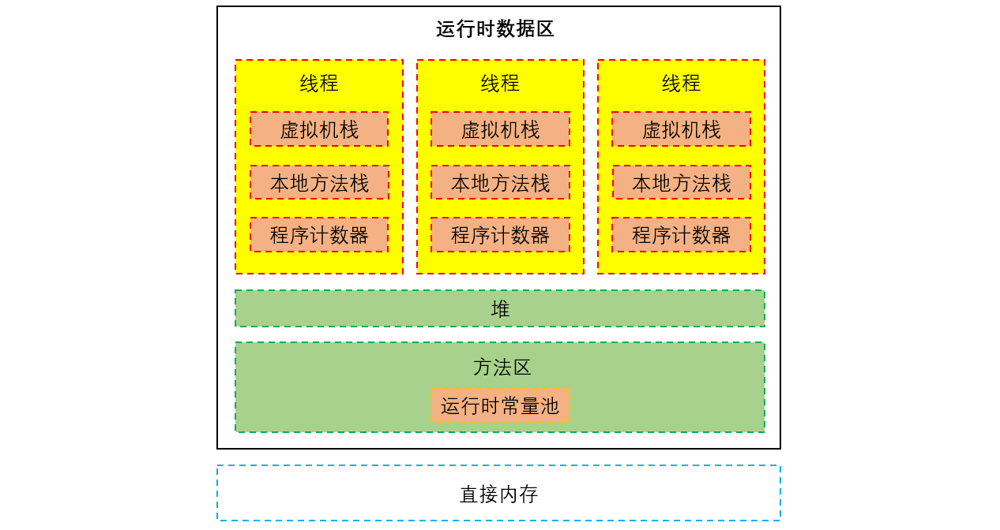
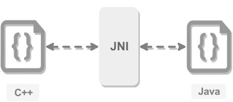

[TOC]

### Java内存区域与对象解析

#### 运行时数据区

如下图所示，**程序计数器、Java虚拟机栈和本地方法栈**是线程==**私有**==的，每个线程都有分配这些内存。


为了更清楚的表达私有共有关系，可以参考下图。



##### 1. Java 虚拟机栈

也是线程**私有**的。

每个 **Java 方法**在执行的同时会创建一个==**栈帧**==用于存储**局部变量表、操作数栈、常量池**引用等信息。从方法调用直至执行完成的过程，就对应着一个**栈帧**在 Java ==虚拟机栈==中**入栈和出栈**的过程。


可以通过 **-Xss** 这个虚拟机参数来指定**每个线程**的 Java 虚拟机**栈内存**大小：

```java
java -Xss512M HackTheJava
```

该区域可能抛出以下异常：

- 当线程请求的栈深度超过最大值，会抛出 **StackOverflowError** 异常；
- 栈可以进行动态扩展，但如果无法申请到足够内存，会抛出 **OutOfMemoryError** 异常。

##### 2. 本地方法栈

本地方法栈与 Java 虚拟机栈类似，它们之间的区别只不过是虚拟机栈为虚拟机执行 Java 方法服务，而本地方法栈则为虚拟机使用 **Native方法**服务。也是线程**私有**的。

本地方法一般是用其它语言（C、C++ 或汇编语言等）编写的，并且被编译为基于本机硬件和操作系统的程序，对待这些方法需要特别处理。



##### 3. 程序计数器

记录正在执行的虚拟机**字节码指令的地址**（如果正在执行的是本地方法则为空）。

可以看成是当前线程执行字节码的行号指示器。

**每个线程**都需要有一个**独立的程序计数器**，各个线程之间计数器**互不影响**，独立存储，这种内存区域称为“**线程私有内存**”。

此内存区域是唯一一个**没有**规定 OutOfMemoryError 的区域。


##### 4. 堆

所有==**对象实例**==都在这里分配**内存**，是垃圾收集的主要区域（"**GC 堆**"），所有的对象实例及数组都要在堆上分配。属于线程共享区域。

现代的垃圾收集器基本都是采用**分代收集算法**，其主要的思想是针对不同类型的对象采取不同的垃圾回收算法。可以将堆分成**两块**（也可以细致一点分为 Eden 空间、From Survivor 空间、To Survivor 空间等）：

- **新生代**（Young Generation）
- **老年代**（Old Generation）

堆不需要连续内存，并且可以动态增加其内存，增加失败会抛出 OutOfMemoryError 异常。

可以通过 ==-Xms 和 -Xmx== 这两个虚拟机参数来指定一个程序的**堆内存**大小，第一个参数设置初始值，第二个参数设置最大值。

```java
java -Xms1M -Xmx2M HackTheJava
```


##### 5. 方法区

用于存放已被加载的**类信息、常量、静态变量、即时编译器编译后的代码**等数据。是线程共享区域。有人喜欢称其为**永久代**。

和堆一样不需要连续的内存，并且可以动态扩展，动态扩展失败一样会抛出 OutOfMemoryError 异常。

对这块区域进行垃圾回收的主要目标是对**常量池的回收和对类的卸载**，但是一般比较难实现，回收效果与效率很低。

HotSpot 虚拟机把它当成**永久代**来进行垃圾回收。但很难确定永久代的大小，因为它受到很多因素影响，并且每次 Full GC 之后永久代的大小都会改变，所以经常会抛出 OutOfMemoryError 异常。为了更容易管理方法区，从 JDK 1.8 开始，移除永久代，并把**方法区移至==元空间==**，它位于本地内存中，而不是虚拟机内存中。

**方法区是一个 JVM 规范，永久代与元空间都是其一种实现方式**。在 JDK 1.8 之后，原来永久代的数据被分到了==堆和元空间==中。**元空间存储类的元信息，静态变量和常量池等放入堆中。**


**运行时常量池**

运行时常量池是**方法区**的一部分。

Class 文件中的**常量池**（编译器生成的字面量和符号引用）会在类加载后被放入这个区域。

除了在编译期生成的常量，还允许动态生成（即运行期间将新的常量放入池中），例如 String 类的 intern()。


##### 6. 直接内存

在 JDK 1.4 中新引入了 ==**NIO 类**==，它可以使用 Native 函数库直接分配**堆外内存**，然后通过 Java 堆里的 **DirectByteBuffer** 对象作为这块内存的引用进行操作。这样能在一些场景中显著提高性能，因为**避免**了在堆内存和堆外内存来回**拷贝**数据。

大量 NIO 操作会用到直接内存。

本机直接内存的分配**不会受到 Java 堆**大小的限制，但是受到本机总内存限制。


#### 对象解析

##### 1. 对象创建

Java 是一门面向对象的编程语言，在Java 程序运行过程中无时无刻都有对象被创建出来．在语言层面上，创建对象（例如克隆、反序列化）通常仅仅是一个 new 关键字而己，而在虚拟机中，对象（指普通 Java 对象，**非数组和Class 对象**等） 的创建是一个非常复杂的过程。

虚拟机遇到一条 new 指令时，首先将去检查这个指令的参数是否能在常量池中定位到一个类的符号引用，并且检查这个符号引用代表的类是否已被加载、解析和初始化过。如果没有，那必须先执行相应的**类加载过程**。在类加载检查通过后，接下来虚拟机将为新生对象分配内存。对象所需内存的大小在类加载完成后便可完全确定，为对象分配空间的任务等同于把一块确定大小的内存从 Java 堆中划分出来。

假设 Java 堆中内存是绝对规整的，就仅仅是把指针向空闲空间那边挪动一段与对象大小相等的距离，这种分配方式称为“**指针碰撞**”（ Bump the Pointer）。

如果 Java 堆中的内存并不是规整的，已使用的内存和空闲的内存相互交错，虚拟机就必须维护一个列表，记录哪些内存块是可用的， 在分配的时候从列表中找到一块足够大的空间划分给对象实例， 并更新列表上的记录，这种分配方式称为“**空闲列表**”（ Free List ）。

选择哪种分配方式由 Java 堆是否规整决定，而 Java 堆是否规整是由所采用的垃圾收集器是否带有压缩整理功能决定。因此，在使用 Serial、ParNew 等带 Compact（紧凑）过程的收集器时，系统采用的分配算法是指针碰撞，而使用 CMS 这种基于 Mark-Sweep 算法的收集器时，通常采用空闲列表。

还要考虑内存分配在多线程下同步问题。一种解决办法是对分配内存空间的动作进行同步处理。实际上虚拟机采用 CAS 配上失败重试的方式保证更新操作的原子性：另一种是把内存分配的动作按照线程划分在不同的空间之中进行，每个线程在 Java 堆中预先分配一小块内存，称为本地线程分配缓冲（ Thread  Local Allocation Buffer）。哪个线程要分配内存，就在哪个线程的 TLAB 上分配，只有 TLAB 用完并分配新的 TLAB 时，才需要同步锁定。

内存分配完成后，虚拟机需要将分配到的内存空间都初始化为零值（不包括对象头），接下来，虚拟机要对对象进行必要的设置。例如这个对象是哪个类的实例、如何才能找到类的元数信息、对象的哈希码、对象的 GC 分代年龄等信息。这些信息存放在对象的**对象头（Object Header）**之中。根据虚拟机当前的运行状态的不同，如是否启用偏向锁等。

这时候对象才刚刚生产出一个对象，但是还**未执行 \<init> 方法**，所有字段都还为**零**，执行 new 指令之后紧接着会执行 \<init> 方法，把对象按照程序的设计进行初始化，这样一个可用的对象才完全创建。


##### 2. 对象的内存布局

一个对象本身的内在结构需要一种**描述方式**，这个描述信息是以**字节码**的方法存储在**方法区**中的。
Class 本身就是一个**对象**，都以 KB 为单位，如果 new Integer() 为了表示一个数据就占用 KB 级别的内存就有点不值了，下面讲解 JVM 是如何做的。

为了表示对象的属性、方法等信息，不得不需要**结构描述**。每一个Java类，在被 JVM 加载的时候，JVM 会给这个类创建一个`instanceKlass`，保存在方法区，用来在 JVM 层表示该 Java 类。Hotspot VM 使用**对象头部的一个元数据指针指向 Class 区域**的方式来找到对象的 Class 描述，以及内部的方法、属性入口。如下图所示：


在 HotSpot 虚拟机中，对象在内存中存储布局分为 **3 块区域**：**对象头（Header）、实例数据（Instance Data）、对齐填充（Padding）**，下面详细讲解各部分内容。


###### **2.1 对象头**

HotSpot 虚拟机的对象头包括两部分（非数组对象）信息，如下图所示：

- 第一部分用于存储对象自身的**运行时数据**，如哈希码（HashCode）、GC 分代年龄、锁状态标志、线程持有的锁、偏向线程 ID、偏向时间戳、对象分代年龄，这部分信息称为**“Mark Word”**；Mark Word 被设计成一个非固定的数据结构以便在极小的空间内存储尽量多的信息，它会根据自己的状态**复用**自己的存储空间。
- 第二部分是**类型指针**，即对象指向它的**类元数据**的指针，虚拟机通过这个指针来确定这个对象是**哪个类**的实例；
- 如果对象是一个 Java **数组**，那在对象头中还必须有**一块**用于记录**数组长度**的数据。因为虚拟机可以通过普通 Java 对象的元数据信息确定 Java 对象的大小，但是从数组的元数据中无法确定数组的大小。

Mark Word在32位JVM中的长度是32bit，在64位 JVM 中长度是64bit。

Mark Word在不同的锁状态下存储的内容不同，在32位 JVM 中是这么存的：


###### **2.2 实例数据**

实例数据部分是对象真正存储的**有效信息**，也是在程序代码中所定义的各种类型的字段内容。

这部分的存储顺序会受到虚拟机分配策略参数（FieldsAllocationStyle）和字段在 Java 源码中定义顺序的影响。


###### **2.3 对齐填充**

对齐填充不是必然存在的，没有特别的含义，它仅起到**占位符**的作用。

由于 HotSpot VM 的自动内存管理系统要求对象起始地址必须是 8 字节的整数倍，也就是说对象的大小必须是 8 字节的整数倍。对象头部分是 8 字节的倍数，所以当对象实例数据部分没有对齐时，就需要通过对齐填充来补全。


###### **2.4 如何估算对象大小？**

32 位系统下，当使用 new Object() 时，JVM 将会分配 8（Mark Word+类型指针） 字节的空间，128 个 Object 对象将占用 1KB 的空间。
如果是 new Integer()，那么对象里还有一个 int 值，其占用 4 字节，这个对象也就是 8 + 4 = 12 字节，对齐后，该对象就是 16 字节。

以上只是一些简单的对象，那么对象的内部属性是怎么排布的？

```java
Class A {
    int i;
    byte b;
    String str;
}
```

其中对象头部占用 ‘Mark Word’ （4） + ‘类型指针’ （4） = 8 字节；byte 8 位长，占用 1 字节；int 32 位长，占用 4 字节；String 只有引用，占用 4 字节；
那么对象 A 一共占用了 8+1+4+4 = 17 字节，按照 8 字节对齐原则，对象大小也就是 24 字节。

这个计算看起来是没有问题的，对象的大小也确实是 24 字节，但是对齐（padding）的位置并不对：

在 HotSpot VM 中，对象排布时，间隙是在 4 字节基础上的（在 32 位和 64 位压缩模式下），上述例子中，int 后面的 byte，空隙只剩下 3 字节，接下来的 String 对象引用需要 4 字节来存放，因此 byte 和对象引用之间就会有 3 字节对齐，对象引用排布后，最后会有 4 字节对齐，因此结果上依然是 7 字节对齐。


##### 3. 对象访问定位

Java程序通过栈上的 **reference 数据**来操作堆上的具体对象，由于 reference 类型在 Java 虚拟机规范中只规定了一个指向对象引用。而没有规定这个引用应该通过何种方式去定位、访问堆中的对象的具体位置，它取决于 Java 虚拟机实现。目前主要有两种实现方式：

**使用句柄（类似间接指针）：**在 Java 堆中划分出一块**内存**来作为**句柄池**，reference 中存储的就是对象的句柄地址，句柄中包含对象实例数据与类型各自具体地址信息。示例图如下图所示。


**直接指针访问：**Java 堆中的对象布要考虑如何放置访问类型数据相关的信息，而 reference 中存储的直接就是对象地址。示例图如下图所示。**Hotspot 虚拟机采用此种方式**。


**两者的比较：**

句柄的好处是 reference中存储的是稳定的句柄地址，在对象被移动时只会改变句柄中的实例数据指针，而reference 本身不需要修改。

**直接指针访问**的最大好处就是速度更快，节省一次指针定位时间开销，因为对象访问在 Java 中非常频繁，这类开销积少成多也非常可观。 


