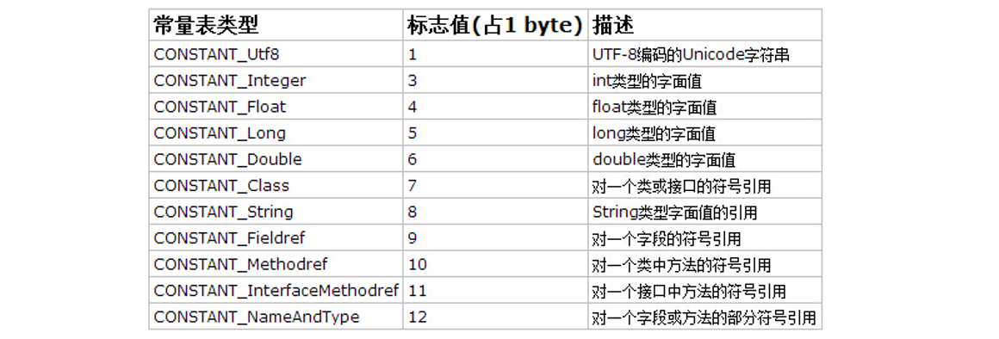
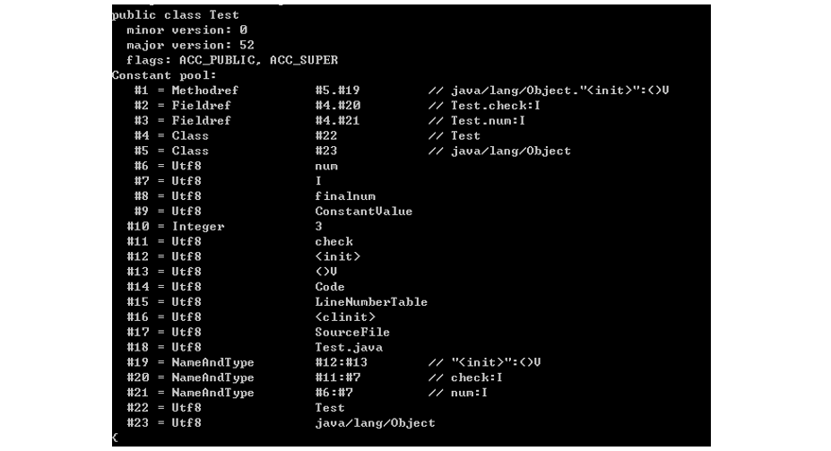

[TOC]

### 类文件结构

#### 平台无关性

各种不同平台的虚拟机与所有平台都使用统一的程序存储格式--**字节码**，是构成平台无关性的基石。

实现语言无关性的基础仍然是**虚拟机和字节码的存储格式**。把代码编译成 Class 文件，虚拟机并不关心 Class 的来源是何种语言。


#### Class 类文件的结构

Class 文件是一组以 **8 位**字节数为基础单位的二进制流，各个数据项目严格按照顺序紧凑排列在 Class 文件之中，中间没有添加任何分隔符，这使得整个 Class 文件存储的内容几乎全部是程序的必要的数据，没有空隙存在。

Class 文件类似于 C 语言**结构体**的伪结构的存储数据，这种结构中只有两种数据类型，**无符号数和表**。

**无符号数**属于基本的数据类型，下表展示了对应的类型介绍：

| 数据类型 | 字节数 |
| :------: | :----: |
|    u1    |   1    |
|    u2    |   2    |
|    u4    |   4    |
|    u8    |   8    |

无符号数可以用来描述数字，索引引用，数量值或者按照UTF-8编码构成的字符串值。

**表**是由多个无符号数或者其他表作为数据项构成的符合数据类型，所有表习惯性以 "**info**" 结尾，表用于描述有层次结构的复合结构数据。整个 Class 文件本质上就是一张**表**。

Class 文件结构类似如下所示：

```c
ClassFile{
	magic                        u4,
	minor_version                u2,
	major_version                u2,
	constant_pool_count          u2,
	constant_pool                cp_info*constant_pool_count,
	access_flags                 u2,
	this_class                   u2,
	super_class                  u2,
	interface_count              u2,
	interfaces                   u2 * interface_count,
	fields_count                 u2,
	fields                       field_info * fields_count,
	methods_count                u2,
	methods                      method_info * methods_count,
	attributes_count             u2,
	attributes                   attributes_info * attributes_count
}
```

无论是无符号数还是表，当需要描述同一类型但是数量不定的多个数据的时候，经常会使用一个前置容量计数器加若干个连续的数据项的形式，这时候称之为某一类型的集合。

这里讲下面 Java 文件通过 javac 编译为.class文件：

```java
public class Test {
    private static int num=3;
    private static final int finalnum=3;
    private int check;
    public Test(){
    	check=23;
    }
}
```

class 文件对应的字节流码:

```java
cafe babe 0000 0034 0018 0a00 0500 1309
0004 0014 0900 0400 1507 0016 0700 1701
0003 6e75 6d01 0001 4901 0008 6669 6e61
6c6e 756d 0100 0d43 6f6e 7374 616e 7456
616c 7565 0300 0000 0301 0005 6368 6563
6b01 0006 3c69 6e69 743e 0100 0328 2956
0100 0443 6f64 6501 000f 4c69 6e65 4e75
6d62 6572 5461 626c 6501 0008 3c63 6c69
6e69 743e 0100 0a53 6f75 7263 6546 696c
6501 0009 5465 7374 2e6a 6176 610c 000c
000d 0c00 0b00 070c 0006 0007 0100 0454
6573 7401 0010 6a61 7661 2f6c 616e 672f
4f62 6a65 6374 0021 0004 0005 0000 0003
000a 0006 0007 0000 001a 0008 0007 0001
0009 0000 0002 000a 0002 000b 0007 0000
0002 0001 000c 000d 0001 000e 0000 002b
0002 0001 0000 000b 2ab7 0001 2a10 17b5
0002 b100 0000 0100 0f00 0000 0e00 0300
0000 0500 0400 0600 0a00 0700 0800 1000
0d00 0100 0e00 0000 1d00 0100 0000 0000
0506 b300 03b1 0000 0001 000f 0000 0006
0001 0000 0002 0001 0011 0000 0002 0012
```


##### 魔数

可以看到第一个字符为 u4 类型的 **magic** 变量，称之为魔数，该变量来表明是否是一个虚拟机能接受的 Class 文件。从上面的Class文件中可以看到，4 个字节 magic 是 0xcafe babe，咖啡宝贝的意思。


##### 主次版本号

minor_version 代表 Java 的**次版本号**占**两个字节**，major_version 代表**主版本号**也占两个字节。在上述 Class 文件中：

- minor_version：0x0000
- major_version：0x0034

34 代表十进制的 52，说明 Java 版本为1.8，可以通过 `java -version` 来验证准确性。


##### 常量池

接下来的是常量池的入口，常量池可以理解为 Class 文件中的**资源仓库**。由于常量池的数量是**不固定**的，所以需要放置 u2 类型的数据来表示常量池容量的**计数值** constant_pool_count，即上述 Class 文件中的 0x0018，转换为十进制为 24，表明当前常量池中有 23 项常量，索引范围为 1-24。**需要注意的是constant_pool_count计数开始为1，而不是一般计算机中的0**。

常量池中主要存放着两大类常量：**字面量(Literal)**以及**符号引用**(Symbolic References)，字面量接近于 Java 层中的**常量**的概念，如文本字符串，申明为 final 的常量值等等，而符号引用则属于**编译原理**方面的概念，主要包括下面三类：

- 类和接口的全限定名
- 字段的名称和描述符
- 方法的名称和描述符

Java 在执行 javac 编译的时候，不像 c 和 c++ 一样有链接的步骤，而是在虚拟机加载 Class 文件时候进行**动态**的链接。**也就说在Class文件中不会保存各个方法，字段的最终内存信息，音这些字段，方法的符号引用不经过运行期转化的话是无法获得真正的内存入口的。**当虚拟机运行的时候，需要从 Class 文件的**常量池获得对应的符号引用**，然后在类创建或者运行时解析，翻译到具体的内存地址当中。

在常量池中，每一项常量都是一个表，JDK1.7 之前有 11 种不同的表结构，在 1.7 时新增了三种结构，分别是CONSTANT_MethodHandle_info，CONSTANT_MethodType_info，CONSTANT_InvokeDynamic_info。 这14中标有一个共同点，即在表的开始的第一位是一个**u1类型的标志位（记为tag）**，代表当前这个常量属于哪种常量类型。具体的常量类型如下所示：



上述都是字面量和符号引用。

CONSTANT_Methodref_info 这个符号引用包括两部分， 一部分是该方法所在的类， 另一部分是该方法的方法名和描述符。 这就是所谓的 “对方法的符号引用”。

```c
CONSTANT_Methodref_info {
    u1 tag;
    u2 class_index;             // CONSTANT_Class_info
    u2 name_and_type_index;     // CONSTANT_NameAndType_info
}
```

这里如果一直通过 Class 的字节码去看就太费劲了，我们可以 javap 来代替对应的查看操作，调用获得常量池的信息

```java
javap -p Test
```

截图如下:



上图中 Constant pool 表示 Class 文件中的常量池，图中总共 23 个常量值，跟我们上面通过字节码计算的方式得出的结果一致。就很清晰了，我们也不用去一个字节一个字节算出结果，还容易算错。可以看到第一个CONSTANT_Methodref_info 对应的是 **init** 方法，来自于 Obejct 类，返回值为 void，参数为空。


##### 访问标志

在常量池结束之后，紧接着的两个字节表示访问标志，这个标志用于**识别类或者接口层次的访问信息**，包括：

- 这个 Class 是类还是接口
- 是否定义为 public 类型
- 是否定义为 abstract 类型
- 如果是类，是否被声明为 final 类型
- ...

这个我们也可以通过 javap 命令来看到对应的标志：


可以看到 Test 类的 flag 为 ACC_PUBLIC 和 ACC_SUPER。


##### 类索引，父索引和接口索引集合

类索引 (this_class) 以及父类索引 (super_class) 都是一个u2类型的数据，接口索引集合(interfaces)是一组 u2 类型的数据集合，在 Class 文件中，通过上述三个数据来**确定这个类的==继承关系==**。

类索引确定这个类的全限定名，福类索引确定这个类的父类的全限定名，接口索引集合用来描述该类实现了哪些接口。


##### 字段表集合

字段表用于描述接口或者类中**声明的变量**。字段包括类级变量以及实例级变量，**包括在方法内部声明的局部变量。**一个字段可以包含的信息如下：

- 字段的作用域 (public, private, protected)
- 实例变量还是类变量(有无 static 修饰符)
- 可变性(final)
- 并发可见性(volatile，强制从主内存中读写)
- 是否可序列化(transient)
- 字段数据类型(基本类型，对象，数组)
- 字段名称

各个修饰符都可以用布尔值来设定是否存在，对于字段的数据类型以及名称，则只能引用常量池中的常量来描述了。


##### 方法表集合

Class 文件存储格式中对**方法的描述**与对字段的描述几乎是一样的。

因为 volatile 以及 transient 关键字不能修饰方法，所以方法表的访问标志中没有 ACC_VOLATILE 和ACC_TRANSIENT 标志。但是可以使用 synchronized，native，strictfp 和 abstract 关键字修饰方法，则对应增加了访问标志。

如果父类方法在子类中**没有被重写**，那么方法表集合中就不会出现父类的方法信息，但是有可能出现由**编译器自动添加**的方法，比如 \<init> 和 \<clinit> 方法。


##### 属性表集合

在 Class 文件、字段表、方法表都可以携带自己的属性表集合，用于描述某些场景专有的信息。

###### Code 属性

Java 中的方法体的代码经过 javac 编译处理后，最终会变成**字节码指令**存储在 **Code** 属性中。Code 属性出现在方法表的属性集合之中，但并非所有方法都存在 Code 属性，如接口以及抽象类中的抽象方法就不存在。

Code 属性是 Class 文件中最重要的一个属性，如果把一个 Java 程序中的信息分为**代码**（Code，方法体里面的代码）和**元数据**（Metadata，包括类、方法、字段定义及其他信息）两部分，那么 **Code 属性用于描述代码，其他所有数据都用于描述元数据**。


###### Exceptions 属性

列举出方法中可能抛出的受查异常，也就是代码中 throws 关键字后面的异常。


###### LocalVariableTable 属性

用于描述栈帧中局部变量表中的变量与 Java 源码中定义的变量之间的关系。


###### SourceFile 属性

用于记录生成这个 Class 文件的源码文件名称。


###### ConstantValue 属性

ConstantValue 属性的作用是通知虚拟机自动为**静态变量赋值**。只有被 **static** 关键字修饰的变量(类变量)才能使用这项属性。


###### InnerCalsses 属性

InnerCalsses 属性用于记录内部类和宿主类之间的关联。


#### 字节码指令简介

Java 虚拟机的指令由一个字节长度的、代表着某种特定操作含义的数字（称为**操作码**，Opcode）以及跟随其后的零至多个代表此操作所需参数（称为**操作数**，Operands）而构成。由于 Java 虚拟机采用**面向操作数栈**而不是寄存器的架构，所以大多数的指令都不包含操作数，只有一个操作码。

在 Java 虚拟机的指令集中，大多数的指令都包含了其操作所对应的数据类型信息。例如，iload 指令用于从局部变量表中加载 int 型的数据到操作数栈中，而 fload 指令加载的则是 float 类型的数据。这两条指令的操作在虚拟机内部可能会是由同一段代码来实现的，但在 Class 文件中它们必须拥有各自独立的操作码。

对于大部分与数据类型相关的字节码指令，它们的操作码助记符中都有特殊的字符来表明专门为哪种数据类型服务：i 代表对 int 类型的数据操作，l 代表 long，s 代表 short，b 代表 byte，c 代表 char，f 代表 float，d 代表 double，a 代表 reference。也有一些指令的助记符中没有明确地指明操作类型的字母，如 arraylength 指令，它没有代表数据类型的特殊字符，但操作数永远只能是一个数组类型的对象。还有另外一些指令，如无条件跳转指令 goto 则是与数据类型无关的。

在处理 boolean、byte、short 和 char 类型的数组时，也会转换为使用对应的 int 类型的字节码指令来处理。因此，大多数对于 boolean、byte、short 和 char 类型数据的操作，**实际上都是使用相应的 int 类型作为运算类型**（Computational Type）。


##### 加载和存储指令

加载和存储指令用于将数据在栈帧中的局部变量表和操作数栈之间来回传输，这类指令包括如下内容（未列全）。

- 将一个局部变量加载到操作栈：iload、lload、fload、dload、aload。
- 将一个数值从操作数栈存储到局部变量表：istore、lstore、fstore、dstore、astore。
- 将一个常量加载到操作数栈：bipush、sipush、ldc、ldc_w、ldc2_w、aconst_null、iconst_m1。
- 扩充局部变量的访问索引的指令：wide。

存储数据的操作数栈和局部变量表主要就是由**加载和存储指令**进行操作，除此之外，还有少量指令，如访问对象的字段或数组元素的指令也会向操作数栈传输数据。


##### 运算指令

运算或算术指令用于对两个操作数栈上的值进行某种特定运算，并把结果重新存入到操作栈顶。大体上算术指令可以分为两种：对整型数据进行运算的指令与对浮点型数据进行运算的指令，无论是哪种算术指令，都使用 Java 虚拟机的数据类型，由于没有直接支持 byte、short、char 和 boolean 类型的算术指令，对于这类数据的运算，应使用操作 int 类型的指令代替。整数与浮点数的算术指令在溢出和被零除的时候也有各自不同的行为表现，所有的算术指令如下。

- 加法指令：iadd、ladd、fadd、dadd。
- 减法指令：isub、lsub、fsub、dsub。
- 乘法指令：imul、lmul、fmul、dmul。
- 除法指令：idiv、ldiv、fdiv、ddiv。
- 求余指令：irem、lrem、frem、drem。
- 取反指令：ineg、lneg、fneg、dneg。
- 位移指令：ishl、ishr、iushr、lshl、lshr、lushr。
- 按位或指令：ior、lor。
- 按位与指令：iand、land。
- 按位异或指令：ixor、lxor。
- 局部变量自增指令：iinc。
- 比较指令：dcmpg、dcmpl、fcmpg、fcmpl、lcmp。

Java 虚拟机要求在进行浮点数运算时，所有的运算结果都必须舍入到适当的精度，非精确的结果必须舍入为可被表示的最接近的精确值。


##### 类型转换指令

类型转换指令可以将两种不同的数值类型进行相互转换，这些转换操作一般用于实现用户代码中的显示类型转换操作，或者用来处理本节开篇所提到的字节码指令集中数据类型相关指令无法与数据类型一一对应的问题。

- int 类型到 long、float 或者 double 类型。
- long 类型到 float、double 类型。
- float 类型到 double 类型。

尽管数据类型**窄化转换**可能会发生上限溢出、下限溢出和精度丢失等情况，但是 Java 虚拟机规范中明确规定数值类型的窄化转换指令永远**不可能**导致虚拟机抛出运行时异常。


##### 对象创建与访问指令

虽然类实例和数组都是对象，但 Java 虚拟机对类实例和数组的创建与操作使用了不同的字节码指令（数组和普通类型创建过程是不同的）。对象创建后，就可以通过对象访问指令获取对象实例或者数组实例中的字段或者数组元素，这些指令如下。

- 创建类实例的指令：new。
- 创建数组的指令：newarray、anewarray、multianewarray。
- 访问类字段（static 字段，或者成为类变量）和实例字段（非 static 字段，或者成为实例变量）的指令：getfield、putfield、getstatic、putstatic。
- 把一个数组元素加载到操作数栈的指令：baload、caload、saload、iaload、laload、faload、daload、aaload。
- 将一个操作数栈的值存储到数组元素中的指令：bastore、castore、sastore、iastore、fastore、dastore、aastore。
- 取数组长度的指令：arraylength。
- 检查类实例类型的指令：instanceof、checkcast。


##### 操作数栈管理指令

​    如同操作一个普通数据结构中的堆栈那样，Java 虚拟机提供了一些用于直接操作操作数栈的指令，包括：

- 将操作数栈的栈顶一个或两个元素出栈：pop、pop2。
- 复制栈顶一个或两个数值并将复制值或双份的复制重新压入栈顶：dup、dup2、dup_x1、dup2_x1、dup_x2、dup2_x2。
- 将栈最顶端的两个数值互换：swap。


##### 控制转移指令

​    控制转移指令可以让 Java 虚拟机有条件或无条件地从指定的位置指令而不是控制转移指令的下一条指令继续执行程序，从概念模型上理解，可以认为控制转移指令就是在有条件或无条件地修改 PC 寄存器的值。控制转移指令如下。

- 条件分支：ifeq、iflt、ifle、ifne、ifgt、ifge、ifnull、ifnonnull、if_icmpeq、if_icmpne、if_icmplt、if_icmpgt、if_icmple、if_icmpge、if_acmpeq 和 if_acmpne。
- 复合条件分支：tableswitch、lookupswitch。
- 无条件分支：goto、goto_w、jsr、jsr_w、ret。


##### 方法调用和返回指令

​    方法调用（分派、执行过程），先列举以下 5 条用于方法调用的指令。

- invokevirtual  指令用于调用对象的实例方法，根据对象的实际类型进行分派（虚方法分派），这也是 Java 语言中最常见的方法分派方式。
- invokeinterface  指令用于调用接口方法，它会在运行时搜索一下实现了这个接口方法的对象，找出适合的方法进行调用。
- invokespecial  指令用于调用一些需要特殊处理的实例方法，包括实例初始化方法、私有方法和父类方法。
- invokestatic  指令用于调用类方法（static 方法）。
- invokedynamic  指令用于在运行时动态解析出调用点限定符所引用的方法，并执行该方法，前面 4 条调用指令的分派逻辑都固化在 Java 虚拟机内部，而 invokedynamic 指令的分派逻辑是由用户所设定的引导方法决定的。


##### 异常处理指令

在 Java 程序中显式抛出异常的操作（throw 语句）都由 **athrow** 指令来实现，除了用 throw 语句显式抛出异常情况之外，Java 虚拟机规范还规定了许多运行时异常会在其他 Java 虚拟机指令检测到异常状况时自动抛出。


##### ==同步指令==

Java 虚拟机可以支持方法级的同步和方法内部一段指令序列的同步，这两种同步结构都是使用**管程**（Monitor）来支持的。

同步一段指令集序列通常是由 Java 语言中的 synchronized 语句块来表示的，Java 虚拟机的指令集中有 **==monitorenter 和 monitorexit 两条指令来支持 synchronized 关键字的语义==**，正确实现 synchronized 关键字需要 javac 编译器与 Java 虚拟机两者共同协作支持。

编译器必须确保无论方法通过何种方式完成，方法中调用过的每条 monitorenter 指令**都必须执行其对应的 monitorexit** 指令，而无论这个方法是正常结束还是异常结束。


