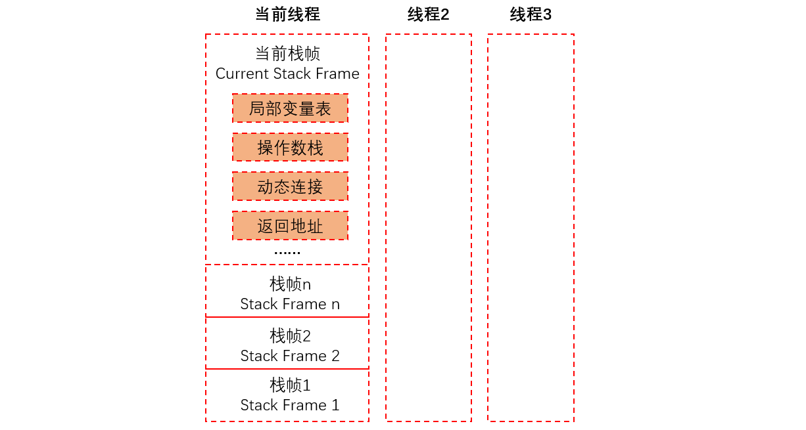

[TOC]

### 虚拟机字节码执行引擎

执行引擎是 Java 虚拟机最核心的组成部件之一。虚拟机的执行引擎由自己实现，所以可以自行定制指令集与执行引擎的结构体系，并且能够执行那些不被硬件直接支持的指令集格式。

所有的 Java 虚拟机的执行引擎都是一致的：**输入的是字节码文件，处理过程是字节码解析的等效过程，输出的是执行结果**。本节将主要从概念模型的角度来讲解**虚拟机的方法调用和字节码执行**。


#### 运行时栈帧结构

**栈帧（Stack Frame）** 是用于支持虚拟机方法调用和方法执行的数据结构，它是虚拟机运行时数据区中**虚拟机栈（Virtual Machine Stack）的栈元素**。

栈帧存储了方法的局部变量表、操作数栈、动态连接和方法返回地址等信息。每一个方法从调用开始至执行完成的过程，都对应着一个栈帧在虚拟机栈里面从入栈到出栈的过程。

栈帧结构如下图所示。



每一个栈帧都包含局部变量表、操作数栈、动态连接、方法返回地址和一些额外的附加信息。

一个栈帧需要分配多少内存，不会受到程序运行期变量数据的影响，而仅仅取决于具体的虚拟机实现。

在活动线程中，只有位于栈顶的栈帧才是有效的，称为**当前栈帧**，与这个栈帧相关联的方法称为当前方法。


##### 1. 局部变量表

局部变量表是一组**变量值**存储空间，用于**存放方法参数和方法内定义的局部变量**。
局部变量表的容量以**变量槽**（Variable Slot）为最小单位。 一个 Slot 可以存放一个 **32 位**以内（boolean、byte、char、short、int、float、reference和returnAddress）的数据类型，reference 类型表示一个对象实例的引用，returnAddress 已经很少见了，可以忽略。

对于 64 位的数据类型（Java 语言中明确的 64 位数据类型只有 long 和 double），虚拟机会以**高位对齐**的方式为其分配**两个连续**的 Slot 空间。

**虚拟机通过==索引定位==的方式使用局部变量表**，索引值的范围从 0 开始至局部变量表最大的 Slot 数量。访问的是 32位数据类型的变量，索引 n 就代表了使用第 n 个 Slot ,如果是 64 位数据类型，就代表会同时使用 n 和 n + 1 这两个 Slot。

**为了节省栈帧空间，局部变量 Slot 可以==重用==**，方法体中定义的变量，其作用域并不一定会覆盖整个方法体。如果当前字节码 PC 计数器的值超出了某个变量的作用域，那么这个变量的 Slot 就可以交给其他变量使用。这样的设计会带来一些额外的副作用，比如：在某些情况下，Slot 的复用会直接影响到系统的收集行为。

```
注意：局部变量不像类变量具有“准备阶段”，所以必须初始化。没有赋初始值是不能使用的。
```


##### 操作数栈

**Java 虚拟机的解释执行引擎成为“==基于栈的执行引擎==”，这里的“栈”就是指的“操作数栈”。**

**操作数栈（Operand Stack）** 也常称为操作栈，它是一个**后入先出栈**。当一个方法执行开始时，这个方法的操作数栈是空的，在方法执行过程中，会有各种字节码指令往操作数栈中写入和提取内容，也就是 **出栈/入栈**操作。


在概念模型中，一个活动线程中两个**栈帧**是相互**独立**的。但大多数虚拟机实现都会做一些**优化**处理：让下一个栈帧的**部分操作数栈**与上一个栈帧的部分**局部变量表**重叠在一起，这样的好处是方法调用时可以**共享一部分数据**，而无须进行额外的参数复制传递。


##### 动态连接

每个栈帧都包含一个指向运行时常量池中该栈帧所属方法的引用，持有这个引用是为了支持方法调用过程中的**动态连接**；

字节码中方法调用指令是以常量池中的指向方法的符号引用为参数的，有一部分符号引用会在类加载阶段或第一次使用的时候转化为直接引用，这种转化称为 **静态解析**，另外一部分在每次的运行期间转化为直接引用，这部分称为**动态连接**。


##### 方法返回地址

当一个方法被执行后，有两种方式退出这个方法：

- 第一种是执行引擎遇到任意一个方法返回的字节码指令，这种退出方法的方式称为**正常完成出口（Normal Method Invocation Completion）**。
- 另外一种是在方法执行过程中遇到了异常，并且这个异常没有在方法体内得到处理（即本方法异常处理表中没有匹配的异常处理器），就会导致方法退出，这种退出方式称为**异常完成出口（Abrupt Method Invocation Completion）**。
    注意：这种退出方式**不会**给上层调用者产生任何返回值。

**无论采用何种退出方式，在方法退出后，都需要返回到方法==被调用==的位置，程序才能继续执行**，方法返回时可能需要在栈帧中保存一些信息，用来帮助恢复它的上层方法的执行状态。一般来说，方法正常退出时，调用者的PC计数器的值可以作为返回地址，栈帧中很可能会保存这个计数器值。而方法异常退出时，返回地址是通过异常处理器表来确定的，栈帧中一般不会保存这部分信息。

方法退出的过程实际上等同于把当前栈帧出栈，因此退出时可能执行的操作有：恢复上层方法的局部变量表和操作数栈，把返回值（如果有的话）压入调用者栈帧的操作数栈中，调整 PC 计数器的值以指向方法调用指令后面的一条指令等。


##### 附加信息

虚拟机规范允许虚拟机实现向栈帧中添加一些自定义的附加信息，例如与调试相关的信息等。


#### 方法调用

方法调用阶段的目的：**确定被调用方法的版本（哪一个方法），不涉及方法内部的具体运行过程**，在程序运行时，进行方法调用是最普遍、最频繁的操作。

> **一切方法调用在 Class 文件里存储的都只是==符号引用==，这是需要在类加载期间或者是运行期间，才能确定为方法在实际运行时内存布局中的==入口地址==（相当于之前说的==直接引用==）**。


##### 解析

“**==编译期可知，运行期不可变==**”的方法（静态方法和私有方法），在类加载的解析阶段，会将其**符号引用**转化为**直接引用（入口地址）**。这类方法的调用称为“**解析（Resolution）**”。

符合这种条件的有**静态方法、私有方法、实例构造器、父类方法** 4 类。这些方法称之为非虚方法。这些方法类加载时可以确定**入口地址**。

在 Java 虚拟机中提供了 5 条方法调用字节码指令：

- **invokestatic**: 调用静态方法 
- **invokespecial**: 调用实例构造器方法、私有方法、父类方法
- **invokevirtual**: 调用所有的虚方法
- **invokeinterface**: 调用接口方法，会在运行时在确定一个实现此接口的对象
- **invokedynamic**: 先在运行时动态解析出点限定符所引用的方法，然后再执行该方法，在此之前的 4 条调用命令的分派逻辑是固化在 Java 虚拟机内部的，而 invokedynamic 指令的分派逻辑是由用户所设定的引导方法决定的。


##### 分派

**分派调用过程将会揭示==多态性==特征的一些最基本的体现，如==“重载”和“重写”==在 Java 虚拟中是如何实现的。**

###### **1 静态分派**

所有依赖静态类型来定位方法执行版本的分派动作，都称为静态分派。静态分派发生在**编译**阶段。

**静态分派**最典型的应用就是==**方法重载**==。

```java
public class StaticDispatch {
    static abstract class Human {
    }

    static class Man extends Human {
    }

    static class Woman extends Human {
    }

    public void sayhello(Human guy) {
        System.out.println("Human guy");
    }

    public void sayhello(Man guy) {
        System.out.println("Man guy");
    }

    public void sayhello(Woman guy) {
        System.out.println("Woman guy");
    }

    public static void main(String[] args) {
        Human man = new Man();
        Human woman = new Woman();
        StaticDispatch staticDispatch = new StaticDispatch();
        staticDispatch.sayhello(man);  // Human guy
        staticDispatch.sayhello(woman);// Human guy
    }
}
```

运行结果：

```java
Human guy
Human guy
```

**为什么会出现这样的结果呢？**

```java
Human man = new Man(); 
```

其中的 Human 称为变量的**==静态类型==（Static Type）**, Man 称为变量的**==实际类型==（Actual Type）**。
**两者的区别是**：静态类型在**编译器**可知，而实际类型到**运行期**才确定下来。
在重载时通过参数的**静态类型**而不是实际类型作为判定依据，因此，在编译阶段，Javac 编译器会根据参数的静态类型决定使用**哪个重载版本**。

使用哪个重载版本，就完全取决于**传入参数的数量和数据类型**。

所以选择了 sayhello(Human) 作为调用目标，并把这个方法的符号引用写到 main()方法里的两条 invokevirtual 指令的参数中。


###### **2 动态分派**

在**运行期**根据**实际类**型确定方法执行版本的分派过程称为**==动态分派==**。最典型的应用就是**==方法重写==**。

```java
public class DynamicDisptch {

    static abstract class Human {
        abstract void sayhello();
    }

    static class Man extends Human {

        @Override
        void sayhello() {
            System.out.println("man");
        }
    }

    static class Woman extends Human {

        @Override
        void sayhello() {
            System.out.println("woman");
        }
    }

    public static void main(String[] args) {
        Human man = new Man();
        Human woman = new Woman();
        man.sayhello();
        woman.sayhello();
        man = new Woman();
        man.sayhello();
    }
}
```

运行结果：

```java
man
woman
woman
```


###### **3 单分派和多分派**

方法的接收者、方法的参数都可以称为方法的宗量。根据分批基于多少种宗量，可以将分派划分为单分派和多分派。**单分派是根据一个宗量对目标方法进行选择的，多分派是根据多于一个的宗量对目标方法进行选择的。**

Java 在进行静态分派时，选择目标方法要依据两点：一是变量的静态类型是哪个类型，二是方法参数是什么类型。因为要根据两个宗量进行选择，所以 Java 语言的**静态分派属于多分派类型**。

运行时阶段的动态分派过程，由于编译器已经确定了目标方法的签名（包括方法参数），运行时虚拟机只需要确定方法的接收者的实际类型，就可以分派。因为是根据一个宗量作为选择依据，所以Java语言的动态分派属于单分派类型。

注：到 JDK1.7 时，Java 语言还是静态多分派、动态单分派的语言，未来有可能支持动态多分派。


###### **4 虚拟机动态分派的实现**

由于动态分派是非常频繁的动作，而动态分派在方法版本选择过程中又需要在方法元数据中搜索合适的目标方法，虚拟机实现出于性能的考虑，通常不直接进行如此频繁的搜索，而是采用优化方法。

其中一种“稳定优化”手段是：在类的方法区中建立一个==**虚方法表**==（Virtual Method Table, 也称 vtable, 与此对应也存在接口方法表——Interface Method Table，也称 itable）。**使用虚方法表索引来代替元数据查找以提高性能。其原理与C++的虚函数表类似。**

虚方法表中存放的是各个方法的**实际入口地址**。如果某个方法在子类中没有被重写，那子类的虚方法表里面的地址入口和父类中该方法相同，都指向**父类的实现入口**。**虚方法表一般在类加载的连接阶段进行初始化**。


##### 动态类型语言的支持

JDK 新增加了 **invokedynamic** 指令来是实现“动态类型语言”。

**静态语言和动态语言的区别：**

- **静态语言（强类型语言）**：
    静态语言是在编译时变量的数据类型即可确定的语言，多数静态类型语言要求在使用变量之前必须声明数据类型。 
    例如：C++、Java、Delphi、C# 等。
- **动态语言（弱类型语言）** ：
    动态语言是在运行时确定数据类型的语言。变量使用之前不需要类型声明，通常变量的类型是被赋值的那个值的类型。 
    例如 PHP/ASP/Ruby/Python/Perl/ABAP/SQL/JavaScript/Unix Shell 等等。
- **强类型定义语言** ：
    强制数据类型定义的语言。也就是说，一旦一个变量被指定了某个数据类型，如果不经过强制转换，那么它就永远是这个数据类型了。举个例子：如果你定义了一个整型变量 a,那么程序根本不可能将 a 当作字符串类型处理。强类型定义语言是类型安全的语言。
- **弱类型定义语言** ：
    数据类型可以被忽略的语言。它与强类型定义语言相反, 一个变量可以赋不同数据类型的值。强类型定义语言在速度上可能略逊色于弱类型定义语言，但是强类型定义语言带来的严谨性能够有效的避免许多错误。


#### 基于栈的字节码解释执行引擎

虚拟机如何调用方法的内容已经讲解完毕，现在我们来探讨虚拟机是**如何执行方法中的字节码指令**。


##### 解释执行

Java 语言经常被人们定位为 **“解释执行”语言**，在 Java 初生的 JDK1.0 时代，这种定义还比较准确的，但当主流的虚拟机中都包含了即时编译后，Class 文件中的代码到底会被解释执行还是编译执行，就成了只有虚拟机自己才能准确判断的事情。再后来，Java 也发展出来了直接生成本地代码的编译器 [如何 GCJ（GNU Compiler for the Java）]，而 C/C++ 也出现了通过解释器执行的版本（如 CINT），这时候再笼统的说“解释执行”，对于整个 Java 语言来说就成了几乎没有任何意义的概念，**只有确定了谈论对象是某种具体的 Java 实现版本和执行引擎运行模式时，谈解释执行还是编译执行才会比较确切**。

Java 语言中，javac 编译器完成了程序代码经过词法分析、语法分析到抽象语法树，再遍历语法树生成线性的字节码指令流的过程，因为这一部分动作是在 Java 虚拟机**之外**进行的，而**解释器在虚拟机内部**，所以 Java 程序的编译就是半独立实现的。


##### 基于栈的指令集和基于寄存器的指令集

Java 编译器输出的指令流，基本上是一种**基于栈的指令集架构（Instruction Set Architecture，ISA）**，**依赖操作数栈进行工作**。与之相对应的另一套常用的指令集架构是**基于寄存器的指令集**， **依赖寄存器进行工作**。

那么，**基于栈的指令集和基于寄存器的指令集这两者有什么不同呢？**

举个简单例子，分别使用这两种指令计算 1 + 1 的结果，**基于栈的指令集会是这个样子：**

```c
iconst_1
iconst_1
iadd
istore_0
```

两条 iconst_1 指令连续把两个常量 1 压入栈后，iadd 指令把栈顶的两个值出栈、相加，然后将结果放回栈顶，最后 istore_0 把栈顶的值放到局部变量表中的第 0 个 Slot 中。

**如果基于寄存器的指令集，那程序可能会是这个样子：**

```c
mov eax, 1
add eax, 1
```

mov 指令把 EAX 寄存器的值设置为 1，然后 add 指令再把这个值加 1，将结果就保存在 EAX 寄存器里面。

**基于栈的指令集主要的优点就是可移植，寄存器是由硬件直接提供，程序直接依赖这些硬件寄存器则不可避免地要受到硬件的约束。**

栈架构的指令集还有一些其他的优点，如代码相对更加紧凑，编译器实现更加简单等。
栈架构指令集的主要**缺点**是执行速度相对来说会稍微慢一些。


