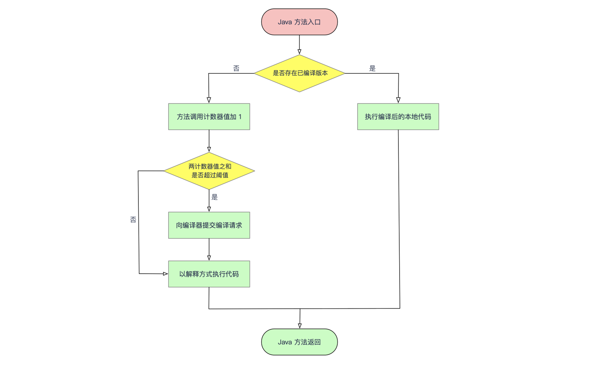
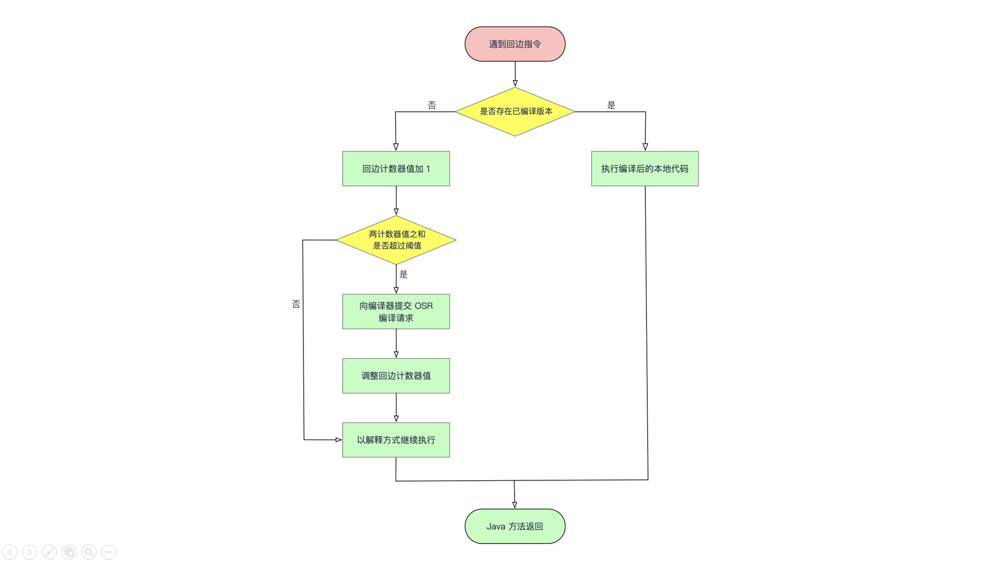

[TOC]

### 程序编译与代码优化

对于性能和效率的追求一直是程序开发中永恒不变的宗旨，除了我们自己在编码过程中要充分考虑代码的性能和效率，虚拟机在编译阶段也会对代码进行优化。本文就从虚拟机层面来看看虚拟机对我们所编写的代码采用了哪些优化手段。

#### 早期优化（编译期优化）

Java 语言的「**编译期**」其实是一段「不确定」的操作过程。因为它可能是一个前端编译器（如 Javac）把 *.java 文件编译成 *.class 文件的过程；也可能是程序运行期的**即时编译器**（JIT 编译器，Just In Time Compiler）把字节码文件编译成机器码的过程；还可能是**静态提前编译器**（AOT 编译器，Ahead Of Time Compiler）直接把 *.java 文件编译成本地机器码的过程。

Javac 这类编译器对代码的运行效率几乎没有任何优化措施，虚拟机设计团队把对性能的优化都放到了后端的即时编译器中，这样可以让那些不是由 Javac 产生的 class 文件（如 Groovy、Kotlin 等语言产生的 class 文件）也能享受到编译器优化带来的好处。但是 Javac 做了很多针对 Java 语言编码过程的优化措施来改善程序员的编码风格、提升编码效率。相当多新生的 Java 语法特性，都是靠编译器的「**语法糖**」来实现的，而不是依赖虚拟机的底层改进来支持。

Java 中即时编译器在运行期的优化过程对于程序运行来说更重要，而前端编译器在编译期的优化过程对于程序编码来说更加密切。


##### Javac 编译器

Javac 编译器的编译过程大致可分为 3 个步骤：

1. 解析与填充符号表；
2. 插入式注解处理器的注解处理；
3. 分析与字节码生成。

这 3 个步骤之间的关系如下图所示：


###### 解析与填充符号表

解析步骤包含了经典程序编译原理中的词法分析和语法分析两个过程；完成词法分析和语法分析之后，下一步就是填充符号表的过程。符号表是由一组符号地址和符号信息构成的表格。在语义分析中，符号表所登记的内容将用于语义检查和产生中间代码。在目标代码生成阶段，当对符号名进行地址分配时，符号表是地址分配的依据。


###### 注解处理器

注解（Annotation）是在 JDK 1.5 中新增的，有了编译器注解处理的标准 API 后，我们的代码就可以干涉编译器的行为，比如在编译期生成 **class 文件**。


###### 语义分析与字节码生成

语法分析之后，编译器获得了程序代码的抽象语法树表示，语法树能表示一个结构正确的源程序的抽象，但无法保证源程序是符合逻辑的。而语义分析的主要任务是对结构上正确的源程序进行上下文有关性质的审查，比如进行类型审查。

字节码生成是 Javac 编译过程的最后一个阶段，字节码生成阶段不仅仅是把前面各个步骤所生成的信息（语法树、符号表）转化成字节码写到磁盘中，编译器还进行了少量的代码添加和转换工作。如前面提到的 () 方法就是在这一阶段添加到语法树中的。

在字节码生成阶段，除了生成构造器以外，还有一些其它的代码替换工作用于优化程序的实现逻辑，如把字符串的加操作替换为 StringBiulder 或 StringBuffer。

完成了对语法树的遍历和调整之后，就会把填充了所需信息的符号表交给 com.sun.tools.javac.jvm.ClassWriter 类，由这个类的 writeClass() 方法输出字节码，最终生成字节码文件，到此为止整个编译过程就结束了。


##### Java语法糖

Java 中提供了有很多语法糖来方便程序开发，虽然语法糖不会提供实质性的功能改进，但是它能提升开发效率、语法的严谨性、减少编码出错的机会。下面我们来了解下语法糖背后我们看不见的东西。

###### 泛型与类型擦除

泛型顾名思义就是类型泛化，本质是参数化类型的应用，也就是说操作的数据类型被指定为一个参数。这种参数可以用在类、接口和方法的创建中，分别称为泛型类、泛型接口和泛型方法。

在 Java 语言还没有泛型的时候，只能通过 Object 是所有类型的父类和强制类型转换两个特点的配合来实现类型泛化。例如 HashMap 的 get() 方法返回的就是一个 Object 对象，那么只有程序员和运行期的虚拟机才知道这个 Object 到底是个什么类型的对象。在编译期间，编译器无法检查这个 Object 的强制类型转换是否成功，如果仅仅依赖程序员去保障这项操作的正确性，许多 ClassCastException 的风险就会转嫁到程序运行期。

Java 语言中泛型只在程序源码中存在，在编译后的字节码文件中，就已经替换为原来的原生类型，并且在相应的地方插入了强制类型转换的代码。因此对于运行期的 Java 语言来说， ArrayList 与 ArrayList 是同一个类型，所以泛型实际上是 Java 语言的一个语法糖，这种泛型的实现方法称为类型擦除。

###### 自动装箱、拆箱与遍历循环

自动装箱、拆箱与遍历循环是 Java 语言中用得最多的语法糖。这块比较简单，我们直接看代码：

```java
public class SyntaxSugars {

    public static void main(String[] args){
        List<Integer> list = Arrays.asList(1,2,3,4,5);
        int sum = 0;
        for(int i : list){
            sum += i;
        }
        System.out.println("sum = " + sum);
    }
}
```

自动装箱、拆箱与遍历循环编译之后：

```java
public class SyntaxSugars {

    public static void main(String[] args) {
        List list = Arrays.asList(new Integer[]{
                Integer.valueOf(1),
                Integer.valueOf(2),
                Integer.valueOf(3),
                Integer.valueOf(4),
                Integer.valueOf(5)
        });

        int sum = 0;
        for (Iterator iterable = list.iterator(); iterable.hasNext(); ) {
            int i = ((Integer) iterable.next()).intValue();
            sum += i;
        }
        System.out.println("sum = " + sum);
    }
}
```

第一段代码包含了**泛型、自动装箱、自动拆箱、遍历循环和变长参数** 5 种语法糖，第二段代码则展示了它们在编译后的变化。

###### 条件编译

Java 语言中**条件编译**的实现也是一颗语法糖，根据布尔常量值的真假，编译器会把分支中不成立的代码块消除。

```java
public static void main(String[] args) {
    if (true) {
        System.out.println("block 1");
    } else {
        System.out.println("block 2");
    }
}
```

上述代码经过编译后 class 文件的反编译结果：

```java
public static void main(String[] args) {
    System.out.println("block 1");
}
```


#### 晚期优化（运行期优化）

在部分商业虚拟机中，Java 最初是通过解释器解释执行的，当虚拟机发现某个方法或者代码块的运行特别频繁时，就会把这些代码认定为「热点代码」（Hot Spot Code）。为了提高热点代码的执行效率，在运行时，虚拟机将会把这些代码编译成与本地平台相关的机器码，并进行各种层次的优化，完成这个任务的编译器称为**即时编译器**（JIT）。

即时编译器不是虚拟机必须的部分，Java 虚拟机规范并没有规定虚拟机内部必须要有即时编译器存在，更没有限定或指导即时编译器应该如何实现。但是 JIT 编译性能的好坏、代码优化程度的高低却是衡量一款商用虚拟机优秀与否的最关键指标之一。


##### HotSpot 虚拟机内的即时编译器

由于 Java 虚拟机规范中没有限定即时编译器如何实现，所以本节的内容完全取决于虚拟机的具体实现。我们这里拿 HotSpot 来说明，不过后面的内容涉及具体实现细节的内容很少，主流虚拟机中 JIT 的实现又有颇多相似之处，因此对理解其它虚拟机的实现也有很高的参考价值。

###### 解释器与编译器

尽管并不是所有的 Java 虚拟机都采用解释器与编译器并存的架构，但许多主流的商用虚拟机，如 HotSpot、J9 等，都同时包含解释器与编译器。

解释器与编译器两者各有优势：

- 当程序需要迅速启动和执行的时候，解释器可以首先发挥作用，省去编译的时间，立即执行。在程序运行后，随着时间的推移，编译器逐渐发挥作用，把越来越多的代码编译成本地机器码之后，可以获得更高的执行效率。
- 当程序运行环境中内存资源限制较大（如部分嵌入式系统），可以使用解释器执行来节约内存，反之可以使用编译执行来提升效率。

同时，解释器还可以作为编译器激进优化时的一个「逃生门」，当编译器根据概率选择一些大多数时候都能提升运行速度的优化手段，当激进优化的假设不成立，如加载了新的类后类型继承结构出现变化、出现「罕见陷阱」时可以通过逆优化退回到解释状态继续执行。

###### 编译对象与触发条件

程序在运行过程中会被即时编译器编译的「热点代码」有两类：

- 被多次调用的方法；
- 被多次执行的循环体。

这两种被多次重复执行的代码，称之为「热点代码」。

- 对于被多次调用的方法，方法体内的代码自然会被执行多次，理所当然的就是热点代码。
- 而对于多次执行的循环体则是为了解决一个方法只被调用一次或者少量几次，但是方法体内部存在循环次数较多的循环体问题，这样循环体的代码也被重复执行多次，因此这些代码也是热点代码。

对于第一种情况，由于是方法调用触发的编译，因此编译器理所当然地会以整个方法作为编译对象，这种编译也是虚拟机中标准的 JIT 编译方式。而对于后一种情况，尽管编译动作是由循环体所触发的，但是编译器依然会以整个方法（而不是单独的循环体）作为编译对象。这种编译方式因为发生在方法执行过程中，因此形象地称之为栈上替换（On Stack Replacement，简称 OSR 编译，即方法栈帧还在栈上，方法就被替换了）。

我们反复提到多次，可是多少次算多次呢？虚拟机如何统计一个方法或一段代码被执行过多少次呢？回答了这两个问题，也就回答了即时编译器的触发条件。

判断一段代码是不是热点代码，是不是需要触发即时编译，这样的行为称为「**热点探测**」。其实进行热点探测并不一定需要知道方法具体被调用了多少次，目前主要的热点探测判定方式有两种。

- 基于采样的热点探测：采用这种方法的虚拟机会周期性地检查各个线程栈顶，如果发现某个（或某些）方法经常出现在栈顶，那这个方法就是「**热点方法**」。基于采样的热点探测的好处是实现简单、高效，还可以很容易地获取方法调用关系（将调用栈展开即可），缺点是很难精确地确认一个方法的热度，容易因为受到线程阻塞或别的外界因数的影响而扰乱热点探测。
- 基于计数器的热点探测：采用这种方法的虚拟机会为每个方法（甚至代码块）建立计数器，统计方法的执行次数，如果执行次数超过一定的阈值就认为它是「热点方法」。这种统计方法实现起来麻烦一些，需要为每个方法建立并维护计数器，而且不能直接获取到方法的调用关系，但是统计结果相对来说更加精确和严谨。

HotSpot 虚拟机采用的是第二种：基于计数器的热点探测。因此它为每个方法准备了两类计数器：方法调用计数器（Invocation Counter）和回边计数器（Back Edge Counter）。

在确定虚拟机运行参数的情况下，这两个计数器都有一个确定的阈值，当计数器超过阈值就会触发 JIT 编译。


###### **方法调用计数器**

顾名思义，这个计数器用于**统计方法被调用的次数**。当一个方法被调用时，会首先检查该方法是否存在被 JIT 编译过的版本，如果存在，则优先使用编译后的本地代码来执行。如果不存在，则将此方法的调用计数器加 1，然后判断方法调用计数器与回边计数器之和是否超过方法调用计数器的阈值。如果超过阈值，将会向即时编译器提交一个该方法的代码编译请求。

如果不做任何设置，执行引擎不会同步等待编译请求完成，而是继续进入解释器按照解释方式执行字节码，直到提交的请求被编译器编译完成。当编译完成后，这个方法的调用入口地址就会被系统自动改写成新的，下一次调用该方法时就会使用已编译的版本。



如果不做任何设置，方法调用计数器统计的并不是方法被调用的**绝对次数**，而是一个相对的执行频率，即一段时间内方法调用的次数。当超过一定的时间限度，如果方法的调用次数仍然不足以让它提交给即时编译器编译，那这个方法的调用计数器值就会被减少一半，这个过程称为方法调用计数器热度的衰减，而这段时间就称为此方法统计的半衰期。

进行热度衰减的动作是在虚拟机进行 GC 时顺便进行的，可以设置虚拟机参数来关闭热度衰减，让方法计数器统计方法调用的绝对次数，这样，只要系统运行时间足够长，绝大部分方法都会被编译成本地代码。此外还可以设置虚拟机参数调整半衰期的时间。


###### 回边计数器

回边计数器的作用是统计一个方法中循环体代码执行的次数，在字节码中遇到控制流向后跳转的指令称为「**回边**」（Back Edge）。建立回边计数器统计的目的是为了触发 OSR 编译。

当解释器遇到一条回边指令时，会先查找将要执行的代码片段是否已经有编译好的版本，如果有，它将优先执行已编译的代码，否则就把回边计数器值加 1，然后判断方法调用计数器和回边计数器值之和是否超过计数器的阈值。当超过阈值时，将会提交一个 OSR 编译请求，并且把回边计数器的值降低一些，以便继续在解释器中执行循环，等待编译器输出编译结果。



与方法计数器不同，回边计数器没有计算热度衰减的过程，因此这个计数器统计的就是该方法循环执行的绝对次数。当计数器溢出时，它还会把方法计数器的值也调整到溢出状态，这样下次再进入该方法的时候就会执行标准编译过程。


##### 编译优化技术

我们都知道，以编译方式执行本地代码比解释执行方式更快，一方面是因为节约了虚拟机解释执行字节码额外消耗的时间；另一方面是因为虚拟机设计团队几乎把所有对代码的优化措施都集中到了即时编译器中。这一小节我们来介绍下 HotSpot 虚拟机的即时编译器在编译代码时采用的优化技术。

###### 优化技术概览

代码优化技术有很多，实现这些优化也很有难度，但是大部分还是比较好理解的。为了便于介绍，我们先从一段简单的代码开始，看看虚拟机会做哪些代码优化。

```java
static class B {
    int value;
    final int get() {
        return value;
    }
}

public void foo() {
    y = b.get();
    z = b.get();
    sum = y + z;
}
```

首先需要明确的是，这些代码优化是建立在代码的某种中间表示或者**机器码**上的，绝不是建立在 Java 源码上。这里之所使用 Java 代码来介绍是为了方便演示。

上面这段代码看起来简单，但是有许多可以优化的地方。

第一步是进行**方法内联**（Method Inlining），方法内联的重要性要高于其它优化措施。方法内联的目的主要有两个，一是去除方法调用的成本（比如建立栈帧），二是为其它优化建立良好的基础，方法内联膨胀之后可以便于更大范围上采取后续的优化手段，从而获得更好的优化效果。因此，各种编译器一般都会把内联优化放在优化序列的最前面。内联优化后的代码如下：

```java
public void foo() {
    y = b.value;
    z = b.value;
    sum = y + z;
}
```

第二步进行**冗余消除**，代码中「z = b.value;」可以被替换成「z = y」。这样就不用再去访问对象 b 的局部变量。如果把 b.value 看做是一个表达式，那也可以把这项优化工作看成是公共子表达式消除。优化后的代码如下：

```java
public void foo() {
    y = b.value;
    z = y;
    sum = y + z;
}
```

第三步进行**复写传播**，因为这段代码里没有必要使用一个额外的变量 z，它与变量 y 是完全等价的，因此可以使用 y 来代替 z。复写传播后的代码如下：

```java
public void foo() {
    y = b.value;
    y = y;
    sum = y + y;
}
```

第四步进行**无用代码消除**。无用代码可能是永远不会执行的代码，也可能是完全没有意义的代码。因此，又被形象的成为「Dead Code」。上述代码中 y = y 是没有意义的，因此进行无用代码消除后的代码是这样的：

```java
public void foo() {
    y = b.value;
    sum = y + y;
}
```

经过这四次优化后，最新优化后的代码和优化前的代码所达到的效果是一致的，但是优化后的代码执行效率会更高。编译器的这些优化技术实现起来是很复杂的，但是想要理解它们还是很容易的。接下来我们再讲讲如下几项最有代表性的优化技术是如何运作的，它们分别是：

- 公共子表达式消除；
- 数组边界检查消除；
- 方法内联；
- 逃逸分析。


###### 公共子表达式消除

如果一个表达式 E 已经计算过了，并且从先前的计算到现在 E 中所有变量的值都没有发生变化，那么 E 的这次出现就成了公共子表达式。对于这种表达式，没有必要花时间再对它进行计算，只需要直接使用前面计算过的表达式结果代替 E 就好了。如果这种优化仅限于程序的基本块内，便称为局部公共子表达式消除，如果这种优化的范围覆盖了多个基本块，那就称为全局公共子表达式消除。


###### 数组边界检查消除

如果有一个数组 array[]，在 Java 中访问数组元素 array[i] 的时候，系统会自动进行上下界的范围检查，即检查 i 必须满足 i >= 0 && i < array.length，否则会抛出一个运行时异常：java.lang.ArrayIndexOutOfBoundsException，这就是数组边界检查。

对于虚拟机执行子系统来说，每次数组元素的读写都带有一次隐含的条件判定操作，对于拥有大量数组访问的程序代码，这是一种不小的性能开销。为了安全，数组边界检查是必须做的，但是数组边界检查并不一定每次都要进行。比如在循环的时候访问数组，如果编译器只要通过数据流分析就知道循环变量是不是在区间 [0, array.length] 之内，那在整个循环中就可以把数组的上下界检查消除。

###### 方法内联

方法内联前面已经通过代码分析介绍过，这里就不再赘述了。

###### 逃逸分析

逃逸分析不是直接优化代码的手段，而是为其它优化手段提供依据的分析技术。逃逸分析的基本行为就是分析对象的动态作用域：当一个对象在方法中被定义后，它可能被外部方法所引用，例如作为调用参数传递到其它方法中，称为方法逃逸。甚至还有可能被外部线程访问到，例如赋值给类变量或可以在其他线程中访问的实例变量，称为线程逃逸。

如果能证明一个对象不会逃逸到方法或者线程之外，也就是别的方法和线程无法通过任何途径访问到这个方法，则可能为这个变量进行一些高效优化。比如：

1. **栈上分配**：如果确定一个对象不会逃逸到方法之外，那么就可以在栈上分配内存，对象所占的内存空间就可以随栈帧出栈而销毁。通常，不会逃逸的局部对象所占的比例很大，如果能栈上分配就会大大减轻 GC 的压力。
2. **同步消除**：如果逃逸分析能确定一个变量不会逃逸出线程，无法被其它线程访问，那这个变量的读写就不会有多线程竞争的问题，因而变量的同步措施也就可以消除了。
3. **标量替换**：标量是指一个数据无法再拆分成更小的数据来表示了，Java 虚拟机中的原始数据类型都不能再进一步拆分，所以它们就是标量。相反，一个数据可以继续分解，那它就称作聚合量，Java 中的对象就是聚合量。如果把一个 Java 对象拆散，根据访问情况将其使用到的成员变量恢复成原始类型来访问，就叫标量替换。如果逃逸分析证明一个对象不会被外部访问，并且这个对象可以被拆散，那程序执行的时候就可能不创建这个对象，而改为直接创建它的若干个被这个方法使用到的成员变量来替代。对象被拆分后，除了可以让对象的成员变量在栈上分配和读写，还可以为后续进一步的优化手段创造条件。


**参考资料**

- [深入理解Java虚拟机（程序编译与代码优化）](https://www.cnblogs.com/baronzhang/p/11108322.html)https://www.cnblogs.com/baronzhang/p/11108322.html