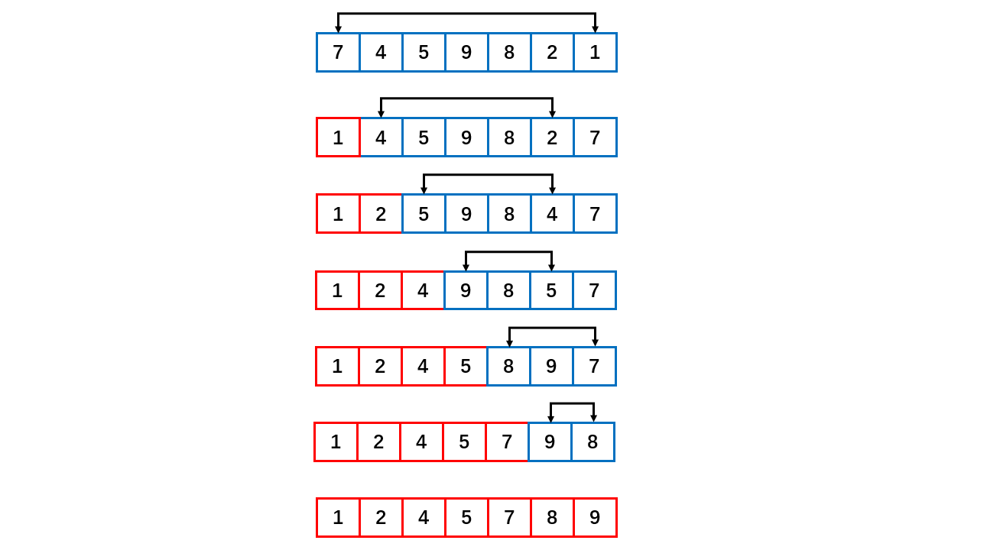
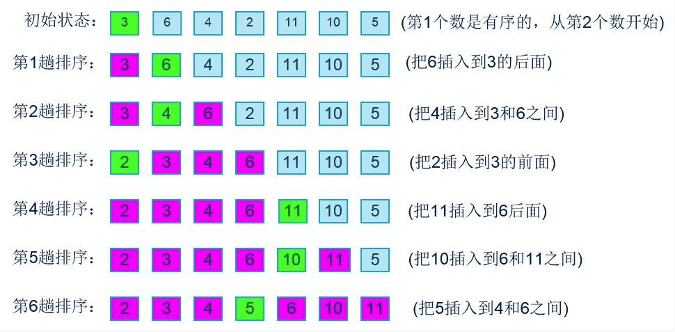
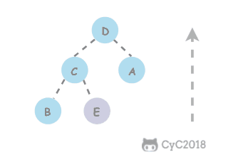
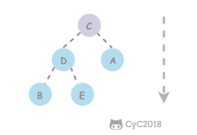
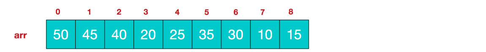

[TOC]

## 排序算法

### 1 基础

#### 约定

待排序的元素需要实现 Java 的 **Comparable 接口**，该接口有 **compareTo()** 方法，可以用它来判断两个元素的大小关系。

约定都是**基于比较**的排序。

使用**辅助函数 less() 和 swap() 来进行比较和交换**的操作，使得代码的可读性和可移植性更好。

排序算法的成本模型是==比较和交换的次数==。

```java
public abstract class Sort<T extends Comparable<T>> {

    public abstract void sort(T[] nums);

    // 比较
    protected boolean less(T v, T w) {
        return v.compareTo(w) < 0;
    }

    // 交换
    protected void swap(T[] a, int i, int j) {
        T t = a[i];
        a[i] = a[j];
        a[j] = t;
    }
}
```


#### 相关术语

- 稳定：如果 a 原本在 b 前面，而 a = b，排序之后 a 仍然在 b 的前面；如果排序算法不改变**相等对象**的相对次序，则成为**稳定的**。
- 不稳定：如果 a 原本在 b 的前面，而 a = b，排序之后 a 可能会出现在 b 的后面；
- 内排序：所有排序操作都在内存中完成；
- 外排序：由于数据太大，因此把数据放在磁盘中，而排序通过磁盘和内存的数据传输才能进行；
- 时间复杂度：一个算法执行所耗费的时间。
- 空间复杂度：运行完一个程序所需内存的大小。
- n：数据规模
- k：“桶”的个数
- In-place:  不占用额外内存
- Out-place: 占用额外内存


### 2 选择排序

将未排序的数组的第一个数作为最小元素，往后进行遍历比较，如果找到比其更小的数就重置最小的数，找到本轮最小的数之后将其与未排序的数组的第一个进行交换，如此往复。

从未排序的数组中**选择最小元素**，将它与数组的**第一个元素交换位置**。再从数组剩下的元素中选择出最小的元素，将它与数组的第二个元素交换位置。不断进行这样的操作，直到将整个数组排序。

选择排序需要 \~**N<sup>2</sup>/2 次比较和 \~N 次**交换，它的运行时间与输入无关，这个特点使得它对一个已经排序的数组也需要这么多的比较和交换操作。



```java
/**
 * 选择排序
 */
public static void selectionSort(Comparable[] a) {
    // 数组长度
    int N = a.length;
    // N次循环
    for (int i = 0; i < N - 1; i++) {
        // 首先取第一个元素为最小元素
        int min = i;
        // 第i次遍历之后前面已经有i个有序元素，因此后面从i + 1开始比较
        for (int j = i + 1; j < N; j++) {
            // 寻找最小的元素
            if (less(a[j], a[min])) {
                min = j;
            }
        }
        // 将每次的第一个元素与最小元素交换
        swap(a, i, min);
    }
}

private static boolean less(Comparable v, Comparable w) {
    return v.compareTo(w) < 0;
}

private static void swap(Comparable[] a, int i, int j) {
    Comparable t = a[i];
    a[i] = a[j];
    a[j] = t;
}
```

需要O(n^2^)次比较和O(n)次交换。时间复杂度是O(n^2^)。最优时，最坏时和平均时都是O(n^2^)。


### 3 冒泡排序

从左到右**不断交换相邻逆序**的元素，在一轮的循环之后，可以让未排序的最大元素**上浮到右侧**。

在一轮循环中，如果没有发生交换，那么说明数组已经是有序的，此时可以直接退出。


```java
/**
 * 冒泡排序
 */
public static void bubbleSort(int []arr) {
    // 几个元素就循环几次
    for(int m = 1;m < arr.length; m++) {
        // 第n轮循环的时候，后面的n个元素已经有序，故只比较前面的length - n个元素
        for(int n = 0;n < arr.length - m; n++) {
            // 此处是比较的条件，可以更改实现逆序或者顺序排序
            if(arr[n] > arr[n + 1]) {
                // 交换元素
                int temp = arr[n];
                arr[n] = arr[j + 1];
                arr[n + 1] = temp;
            }
        }    
    }
}
```


### 4 插入排序

每次都将当前元素插入到**左侧已经排序**的数组中，使得插入之后左侧数组**依然有序**。

对于数组 {3, 5, 2, 4, 1}，它具有以下逆序：(3, 2), (3, 1), (5, 2), (5, 4), (5, 1), (2, 1), (4, 1)，插入排序每次**只能交换相邻元素**，令**逆序数量减少 1**，因此插入排序需要==交换的次数为逆序数量==。

插入排序的时间复杂度取决于数组的**初始顺序**，如果数组已经部分有序了，那么逆序较少，需要的交换次数也就较少，时间复杂度较低。

- **平均**情况下插入排序需要 \~N<sup>2</sup>/4 比较以及 \~N<sup>2</sup>/4 次交换；
- **最坏**情况下需要 \~N<sup>2</sup>/2 比较以及 \~N<sup>2</sup>/2 次交换，最坏的情况是数组是**倒序**的；
- **最好**情况下需要 N-1 次比较和 0 次交换，最好的情况就是数组已经**有序**了。

插入排序的效率最优时是 O(n)，**最坏时是 O(n^2^)**，数组越接近有序，需要做的工作越少。



上述是插入排序流程。分成了有序和无序两部分，在比较时，需要将有序部分数组右移，为插入腾出空间。

当 10 插入到 6 和 11 之间 时，需要将 6 往右移动才有空间给 10.

```java
/**
 * 插入排序
 */
public class InsertSort {
    public static void insertSort(int[] a) {
        
        int length = a.length;
        // 只有一个元素时不操作
        if (length <= 1) {
            return;
        } else {
            // insertNote为要插入的数据
            int i, j, insertNote;
            // 从数组的第二个元素开始循环将数组中的元素插入
            for (i = 1; i < a.length; i++) {
                // 设置数组中的第2个元素为第一次循环要插入的数据
                insertNote = a[i];
                j = i - 1;
                while (j >= 0 && insertNote < a[j]) {
                    // 如果要插入的元素小于第j个元素,就将第j个元素向后移动
                    a[j + 1] = a[j];
                    j--;
                }
                // 直到要插入的元素不小于第j个元素,将insertNote插入到数组中
                a[j + 1] = insertNote;
            }
        }
    }
    
	// 测试
    public static void main(String[] args) {
        int a[] = { 38,65,97,76,13,27,49 };
        insertSort(a);
        System.out.println(Arrays.toString(a));
    }
} 
```


### 5 希尔排序

#### 概述

简单插入排序的问题：

数组 arr = {2, 3, 4, 5, 6, 1} 这时需要插入的数 1(最小), 这样的过程是：

```java
{2,3,4,5,6,6}
{2,3,4,5,5,6}
{2,3,4,4,5,6}
{2,3,3,4,5,6}
{2,2,3,4,5,6}
{1,2,3,4,5,6}
```

**结论**:当需要插入的数是较小的数时，后移的次数明显增多，对效率有影响。

希尔排序也是一种直接插入排序，只是是对直接插入排序算法的优化。

对于**大规模**的数组，插入排序很慢，因为它只能交换**相邻**的元素，每次只能将逆序数量减少 1。希尔排序的出现就是为了解决插入排序的这种局限性，它通过**交换不相邻的元素，每次可以将逆序数量减少大于 1**。希尔排序也是一种插入排序，它是简单插入排序经过改进之后的一个更高效的版本，也称为==**缩小增量排序**==。

希尔排序使用==插入排序==对==间隔 h 的序列进行排序==。通过不断==减小 h，最后令 h = 1==，就可以使得整个数组是有序的。

#### 增量序列

来看下希尔排序的基本步骤，在此我们**选择增量 gap = length / 2，缩小增量继续以 gap = gap / 2的方式**，这种增量选择我们可以用一个序列来表示

```java
n/2, (n/2)/2, ..., 1
```

这称为**增量序列**。

希尔排序的增量序列的选择与证明是个数学难题，我们选择的这个增量序列是比较常用的，也是希尔建议的增量，称为**希尔增量**，但其实这个增量序列不是最优的。此处我们做示例使用**希尔增量**。

可以证明采用希尔增量时**最坏情况**下运行时间是 **O(n^2^)**。

Hibbard 提出一个不同的增量序列，形如

```java
1, 3, 7, ..., 2^k-1 
```

可以证明采用 Hibbard 增量时**最坏情况**下运行时间是 **O(n^1.5^)**。

采用其他的增量序列还可能降低最坏运行时间。


#### 图解举例

初始增量步长 **gap = length / 2**，意味着整个数组被分为 5 组，如下图颜色分别对应。然后在各自组内进行插入排序。第二次 gap = 5 / 2 = 2，所以数组被分为 2 组，如颜色对应所示，再对两组分别进行直接插入排序，使得整体更加有序，最后再缩小增量 gap = 2 / 2 = 1，此时再次进行插入排序就很快了。


在希尔排序的理解时，我们倾向于对于每一个分组，逐组进行处理，但在代码实现中，我们可以不用这么按部就班地处理完一组再调转回来处理下一组（这样还得加个 for 循环去处理分组）比如 [5, 4, 3, 2, 1, 0] ，首次增量设 gap = length / 2 = 3,则为 3 组 [5, 2] [4, 1] [3, 0]，实现时不用循环按组处理，我们可以从第 gap 个元素开始，逐个跨组处理。同时在插入数据时，可以采用元素交换法寻找最终位置，也可以采用数组元素移动法寻觅。

#### 代码实现

希尔排序的代码比较简单，如下：

```java
/**
 * 希尔排序
 * @param a 数组
 */
private void shellSort(int[] a){
    // 数组长度
    int n = a.length;
    // 初始间隔取为原始长度一半
    int gap = n / 2;
    // 循环直到间隔为1
    while(gap >= 1){
        for(int i = gap; i < a.length; i++){
            int j = 0;
            int temp = a[i];
            for(j = i - gap; j >= 0 && temp < a[j]; j = j - gap){
                a[j + gap] = a[j];
            }
            a[j + gap] = temp;
        }
        // 间隔取一半
        gap = gap / 2;
    }
}
```

以下是《数据结构与算法分析》的实现方法。这种方法可以**避免显式的进行交换**操作。

```java
/**
 * 希尔排序
 * 
 * @param array 待排序数组
 * @param <AnyType> 泛型类型
 */
public static <AnyType extends Comparable<? super AnyType>> void shellSort(AnyType[] array) {
    int j;

    for(int gap = array.length / 2; gap > 0; gap /= 2) {
        for(int i = gap; i < array.length; i++) {
            AnyType tmp = array[i];
            for(j = i; j >= gap && tmp.compareTo(array[j - gap]) < 0; j -= gap) {
                array[j] = array[j - gap];
            }
            array[j] = tmp;
        }
    }
}
```

**尚硅谷的希尔排序方法**

1) 希尔排序时， 对有序序列在插入时采用**交换法**, 并测试排序速度。此时测试时效率比普通的希尔排序更低。**不可用**！

```java
/**
 * 希尔排序
 * 有序序列在插入时采用交换法 不可用
 *
 * @param arr 待排序数组
 */
public static void shellSort(int[] arr) {
    
    // 根据前面的逐步分析，使用循环处理
    for (int gap = arr.length / 2; gap > 0; gap /= 2) {
        for (int i = gap; i < arr.length; i++) {
            // 遍历各组中所有的元素(共gap组，每组有N个元素),步长为gap
            for (int j = i - gap; j >= 0; j = j - gap) {
                // 如果当前元素大于加上步长后的那个元素，说明需要交换，其实此处的交换非常有损性能
                if (arr[j] > arr[j + gap]) {
                    // 以下执行交换动作
                    int temp = arr[j];
                    arr[j] = arr[j + gap];
                    arr[j + gap] = temp;
                }
            }
        }
        // 测试每轮后的结果，可注释
        System.out.println("希尔排序中间结果: " + Arrays.toString(arr));
    }

    System.out.println("希尔排序结果:" + Arrays.toString(arr));
}
```

2) 希尔排序时， 对有序序列在插入时**采用移位法**, 并测试排序速度，发现快了许多。合理可用。

```java
/**
 * 希尔排序
 * 有序序列在插入时采用移位法 可用
 * 
 * @param arr 待排序数组
 */
public static void shellSort2(int[] arr) {

    // 增量gap, 并逐步的缩小增量
    for (int gap = arr.length / 2; gap > 0; gap /= 2) {
        // 从第gap个元素，逐个对其所在的组进行直接插入排序
        for (int i = gap; i < arr.length; i++) {

            int j = i;
            int temp = arr[j];
            if (arr[j] < arr[j - gap]) {
                while (j - gap >= 0 && temp < arr[j - gap]) {
                    // 移动
                    arr[j] = arr[j - gap];
                    j = j - gap;
                }
                // 当退出while后，就给temp找到插入的位置
                arr[j] = temp;
            }
        }
    }
}
```

希尔排序的运行时间达不到平方级别，使用递增序列 1, 4, 13, 40, ...  的希尔排序所需要的比较次数不会超过 N 的若干倍乘于递增序列的长度。后面介绍的高级排序算法只会比希尔排序快两倍左右。

**希尔排序的效率**

调整间隔能改善其效率，一般是**避免间隔 gap 是偶数值**。因为当 gap 是偶数时的比较会在增量是 gap / 2 的下一题排序中**重复**。在此种情况下，当 gap 为偶数时，只需将其加 1 。即可将最坏情形改进为 O(n^1.5^)。


### 6 归并排序

归并排序的思想是将数组分成**两部分**，分别进行排序，然后归并起来。基本操作就是**合并两个已排序的数组**，由于两个数组是已经排序的，所以若将**输出放到==第三个==数组**中，则该算法可以通过 对输入数据一趟排序完成。

归并排序是一种分治策略。


将两个**数组合并**起来的步骤如下图所示，即维护**两个指针**分别指向两个有序的数组，然后分别比较两者的值，**值小的拷贝到辅助数组**里面，并将此索引进行移动，直到某一边全部移动完毕，然后把**剩余的没有复制完成的全部拷贝**到辅助数组（如下图中 1 2 3 6 全部拷贝到辅助数组中后，左边还剩下 7、8），最后把辅助数组**拷贝到原数组**即可。


维护两个指针分别比较，然后将较小的项复制到第三个数组中， 因此需要额外的**辅助数组**，会消耗**内存**空间。

一般使用递归归并排序，逐层排序。真正的排序发生在**合并步骤**而不是递归调用的步骤。8 个数据会 merge 7 次，80000 个数据会 merge 8000 - 1 = 79999 次。

```java
/**
 * 归并排序
 * @author cz
 */
public class MergeSort {
    public static void main(String[] args) {
        int arr[] = { 8, 4, 5, 7, 1, 3, 6, 2, 3, 13, 1, 21, 12, 21, 12};

        // 归并排序需要一个额外空间
        int temp[] = new int[arr.length];
        mergeSort(arr, 0, arr.length - 1);

        System.out.println("归并排序后 =" + Arrays.toString(arr));
    }

    /**
     * 分 + 合的方法
     * @param arr 待排数组
     * @param left 左索引
     * @param right 右索引
     */
    public static void mergeSort(int[] arr, int left, int right) {

        if(left < right) {
            // 中间索引
            int mid = (left + right) / 2;
            // 向左递归进行分解
            mergeSort(arr, left, mid);
            // 向右递归进行分解
            mergeSort(arr, mid + 1, right);
            // 每分解一次就合并一次
            merge(arr, left, mid, right);
        }
    }

    /**
     * 合并两个数组的方法
     * @param array 排序的原始数组
     * @param left 左边有序序列的初始索引
     * @param mid 中间索引
     * @param right 最右边的索引
     */
    public static void merge(int[] array, int left, int mid, int right) {
		// 辅助数组
        int[] temp = new int[array.length];
        // 初始化i, 即为左边有序序列的初始索引
        int i = left;
        // 初始化j, 即为右边有序序列的初始索引
        int j = mid + 1;
        // 指向temp数组的当前索引
        int tempIndex = 0;

        // 步骤1
        // 先把左右两边(有序)的数据按照规则填充到temp数组
        // 直到左右两边的有序序列，有一边处理完毕为止
        while (i <= mid && j <= right) {
            // 如果左边的有序序列的当前元素，小于等于右边有序序列的当前元素
            // 即将左边的当前元素，填充到 temp数组
            // 然后 tempIndex++ 后移, i++也要后移
            if(array[i] <= array[j]) {
                temp[tempIndex] = array[i];
                tempIndex = tempIndex + 1;
                i = i + 1;
                // 反之,将右边有序序列的当前元素填充到temp数组
            } else {
                temp[tempIndex] = array[j];
                tempIndex = tempIndex + 1;
                j = j + 1;
            }
        }

        // 步骤2
        // 如果左边还有剩余，就把左边的剩余元素全部拷贝到temp中
        while( i <= mid) {
            temp[tempIndex] = array[i];
            tempIndex = tempIndex + 1;
            i = i + 1;
        }

        // 如果右边还有剩余，就把右边的剩余元素全部拷贝到temp中
        while( j <= right) {
            temp[tempIndex] = array[j];
            tempIndex = tempIndex + 1;
            j = j + 1;
        }


        // 步骤3
        // 将temp数组的元素拷贝到arr
        // 注意，并不是每次都拷贝所有的元素，因为之前的
        tempIndex = 0;
        int tempLeft = left;
        // 第一次合并 tempLeft = 0 , right = 1
        // tempLeft = 2  right = 3
        // tempLeft = 0 right = 3
        // 最后一次 tempLeft = 0  right = 7
        while(tempLeft <= right) {
            array[tempLeft] = temp[tempIndex];
            tempIndex = tempIndex + 1;
            tempLeft = tempLeft + 1;
        }

    }
}
```

以下是《数据结构与算法分析》中的归并排序代码

```java
/**
 * 归并排序
 * 
 * @param array 待排数组
 * @param <AnyType> 泛型类型
 */
public static <AnyType extends Comparable<? super AnyType>> void mergeSort(AnyType[] array) {
    
    // 临时数组
    AnyType[] tmpArray = (AnyType[]) new Comparable[ array.length ];
    // 驱动程序
    mergeSort( array, tmpArray, 0, array.length - 1 );
}

/**
 * 真正的归并排序
 * 
 * @param array 待排数组
 * @param tmpArray 辅助数组
 * @param leftIndex 需要排序的数组的左索引
 * @param rightIndex 需要排序的数组的右索引
 */
private static <AnyType extends Comparable<? super AnyType>> void mergeSort( AnyType[] array, AnyType[] tmpArray, int leftIndex, int rightIndex) {
    if(leftIndex < rightIndex) {
        int center = (leftIndex + rightIndex) / 2;
        mergeSort(array, tmpArray, leftIndex, center);
        mergeSort(array, tmpArray, center + 1, rightIndex);
        merge(array, tmpArray, leftIndex, center + 1, rightIndex);
    }
}
```


**归并排序效率**

归并排序在所有情形下都是**O(NlogN)**的，其缺点是需要临时辅助数组进行合并。归并排序是**稳定**的。

归并排序的运行时间严重依赖于比较元素和在数组中移动位置的相对开销，这些开销是与**编程语言**相关的。

对于**小规模**的子数组可以采用**插入排序**。


### 7 ==**快速排序**==

- 快排是对冒泡排序的改进。

#### 基本算法

- 它的平均运行时间是 ***O(N log N)***。最坏情形是***O(N^2^)***。
- 快排也是一种**分治**的递归算法。

- 归并排序将数组分为**两个子数组**分别排序，并将有序的子数组归并使得整个数组排序；
- 快速排序通过一个==**切分枢轴元**（pivot）==将数组分为两个子数组，==左子数组小于等于切分元素==，右子数组大于等于切分元素，将这两个子数组排序也就将整个数组排序了。


#### 枢轴元的选取

十分重要，直接影响排序的时间。

一种较为安全的做法是随机选取枢轴元。

更为保险的做法是选取**左端、右端以及中间三个元素**，并取其**中值**作为枢轴元。称为三数中值分割法。


代码实现

```java
/**
 * 快速排序
 * @param array 待排序数组
 * @param left 数组左index
 * @param right 数组右index
 */
public static void quickSort(int[] array, int left, int right) {

    // pivot 中轴值
    int pivot = array[(left + right) / 2];

    // 左下标
    int leftIndex = left;

    // 右下标
    int rightIndex = right;

    // while循环的目的是让比pivot 值小放到左边,比pivot值大放到右边,即从小到大排序
    while( leftIndex < rightIndex) {

        // 在pivot的左边一直找,找到大于等于pivot值才退出此小循环
        while(array[leftIndex] < pivot) {
            // 指针不断往右移动
            leftIndex = leftIndex + 1;
        }

        // 在pivot的右边一直找,找到小于等于pivot值,才退出
        while(array[rightIndex] > pivot) {
            // 指针不断往左移动
            rightIndex = rightIndex - 1;
        }

        // 如果leftIndex >= rightIndex 说明pivot左边全部是
        // 小于等于pivot值，右边全部是大于等于pivot值放置
        if( leftIndex >= rightIndex) {
            break;
        }

        // 交换两个指针指向的值
        int temp = array[leftIndex];
        array[leftIndex] = array[rightIndex];
        array[rightIndex] = temp;

        // 如果交换完后，发现这个arr[leftIndex] == pivot值，则rightIndex--，前移一步
        if(array[leftIndex] == pivot) {
            rightIndex = rightIndex - 1;
        }
        // 如果交换完后，发现这个arr[rightIndex] == pivot值 相等 leftIndex++， 后移
        if(array[rightIndex] == pivot) {
            leftIndex = leftIndex + 1;
        }
    }

    // 上述步骤把全部元素都放到了pivot的两边

    // 如果 leftIndex == rightIndex, 必须leftIndex++, rightIndex--, 否则为出现栈溢出
    if (leftIndex == rightIndex) {
        leftIndex = leftIndex + 1;
        rightIndex = rightIndex - 1;
    }

    // 向左递归 实现pivot左边全部排序
    if(left < rightIndex) {
        quickSort(array, left, rightIndex);
    }

    // 向右递归 实现pivot右边全部排序
    if(right > leftIndex) {
        quickSort(array, leftIndex, right);
    }
}

public static void main(String[] args) {
    int[] arr = {-9,78,0,23,-567,70, -1,900, 4561};
    quickSort(arr, 0, arr.length-1);
    System.out.println("arr =" + Arrays.toString(arr));
}
```


#### 性能分析

快速排序是**原地排序**，**不需要辅助数组，但是==递归调用==需要辅助栈**。

快速排序**最好情况**下是每次都正好将数组**对半分**，这样递归调用次数才是最少的。这种情况下比较次数为 C<sub>N</sub>=2C<sub>N/2</sub>+N，复杂度为 **O(NlogN)**。

可以证明**平均情况**也是 **O(NlogN)**。

**最坏情况**下，第一次从最小的元素切分，第二次从第二小的元素切分，如此这般。因此最坏的情况下需要比较 N<sup>2</sup>/2，此时复杂度是 **O(N^2^)**。为了防止数组最开始就是有序的，在**进行快速排序时需要随机打乱数组**。


#### ==快速排序算法改进==

1.**切换到插入排序**

因为快速排序在小数组中也会递归调用自己，对于**小数组（小于 20 项），插入排序比快速排序的性能更好**，因此在小数组中可以切换到插入排序。

**2. 三数取中**

最好的情况下是每次都能取数组的中位数作为切分元素，但是计算中位数的代价很高。一种折中方法是取第一项、中间项和最后一项 3 个元素，并将大小居中的元素作为切分元素。

3.**三向切分**

对于有**大量重复元素**的数组，可以将数组切分为**三部分**，分别对应**小于、等于和大于切分元素**。

三向切分快速排序对于有**大量重复元素**的随机数组可以在线性时间内完成排序。

```java
public class ThreeWayQuickSort<T extends Comparable<T>> extends QuickSort<T> {

    @Override
    protected void sort(T[] nums, int l, int h) {
        if (h <= l) {
            return;
        }
        int lt = l, i = l + 1, gt = h;
        T v = nums[l];
        while (i <= gt) {
            int cmp = nums[i].compareTo(v);
            if (cmp < 0) {
                swap(nums, lt++, i++);
            } else if (cmp > 0) {
                swap(nums, i, gt--);
            } else {
                i++;
            }
        }
        sort(nums, l, lt - 1);
        sort(nums, gt + 1, h);
    }
}
```


#### 快排应用

##### 基于切分的快速选择算法

**求一个数组的第 k 大元素，可以使用堆排序，也可以使用基于快排思想的快速选择算法**。

快速排序的 partitionSort() 方法，会返回一个整数 j 使得 a[l..j-1] 小于等于 a[j]，且 a[j+1..h] 大于等于 a[j]，此时 a[j] 就是数组的第 j 大元素。

可以利用这个特性找出数组的**第 k 个元素**。

该算法是线性级别的，假设每次能将数组二分，那么比较的总次数为 (N+N/2+N/4+..)，直到找到第 k 个元素，这个和显然小于 2N。

```java
public T select(T[] nums, int k) {
    int l = 0, h = nums.length - 1;
    while (h > l) {
        int j = partition(nums, l, h);

        if (j == k) {
            return nums[k];

        } else if (j > k) {
            h = j - 1;

        } else {
            l = j + 1;
        }
    }
    return nums[k];
}
```

Java 中的 Array 类的 sort 方法使用快速排序对基本类型的数组进行升序排序。


### 8 基数排序

- 基数排序是**线性时间**的排序。但是使用情况比较特殊。

- 属于“分配式排序”（distribution sort），又称“**桶子法**”（bucket sort）或 bin sort，是桶排序的拓展，顾名思义，它是通过键值的各个位的值，将要排序的元素分配至某些“桶”中，达到排序的作用。

- **不作为**通用排序算法。
- 负数的数组最好不要使用基数排序。
- 整数排序需要10个桶，字母排序需要26个桶。
- 基数排序是使用**空间换时间**的经典算法，基数排序所需要的**内存比较大**。如果排序的数据量较大，可能造成**内存溢出**。

比如排序

```java
arr = {53, 3, 542, 748, 14, 241}
```

将其看成字符串进行排序，小于 100 的前面补 0占位。

从个位到十位再到百位排序，每一位可能情况有 0-9 共10种情况，因此需要十个桶，将对应的数字放到对应的桶里面，桶里面是**有序**的。重排之后将桶里面的数据再次按照十位分入不同的桶中。最后按照百位分入桶中。最后实现排列。


代码如下

```java
/**
 * 基数排序
 * @author cz
 */
public class RadixSort {

    public static void main(String[] args) {
        int arr[] = { 53, 3, 542, 748, 14, 214};
        System.out.println("基数排序前: " + Arrays.toString(arr));
        radixSort(arr);
        System.out.println("基数排序后: " + Arrays.toString(arr));
    }

    /**
     * 基数排序方法
     * @param array 待排数组
     */
    public static void radixSort(int[] array) {

        // 首先得到数组中最大的数的位数，需要先寻找数组中最大的数
        int max = array[0];
        for(int i = 1; i < array.length; i++) {
            if (array[i] > max) {
                max = array[i];
            }
        }
        // 得到最大数是几位数
        int maxLength = (max + "").length();
        
        // 定义一个二维数组，表示10个桶, 每个桶就是一个一维数组
        // 说明
        // 1. 二维数组包含10个一维数组
        // 2. 为了防止在放入数的时候数据溢出，则每个一维数组(桶)大小定为array.length
        int[][] bucket = new int[10][array.length];

        // 为了记录每个桶中实际存放了多少个数据,定义一个一维数组来记录各个桶的每次放入的数据个数
        // 比如：bucketElementCounts[0] , 记录的就是 bucket[0] 桶的放入数据个数
        // 这个数组的长度就是桶的个数即10
        int[] bucketElementCounts = new int[10];

        for(int i = 0 , n = 1; i < maxLength; i++, n = n * 10) {
            // (针对每个元素的对应位进行排序处理)， 第一次是个位，第二次是十位，第三次是百位...
            // 处理的轮数与数组中最大的数据的位数相同
            for(int j = 0; j < array.length; j++) {
                // 取出每个元素的对应位的值 ※
                int digitOfElement = array[j] / n % 10;
                // 放入到对应的桶的对应的桶的元素个数指针的地方
                bucket[digitOfElement][bucketElementCounts[digitOfElement]] = array[j];
                // 记录对应桶已经存放数据量的值
                bucketElementCounts[digitOfElement]++;
            }

            // 按照这个桶的顺序(一维数组的下标依次取出数据，放入原来数组)
            int index = 0;
            // 遍历每一个桶，并将桶中是数据，放入到原数组
            for(int k = 0; k < bucketElementCounts.length; k++) {
                // 如果桶中有数据放入到原数组（说明这个桶有数据）
                if(bucketElementCounts[k] != 0) {
                    // 循环该桶即第k个桶(即第k个一维数组), 放入
                    for(int l = 0; l < bucketElementCounts[k]; l++) {
                        // 取出元素放入到array
                        array[index] = bucket[k][l];
                        index ++;
                    }
                }
                // 第 i+1 轮处理后，需要将每个 bucketElementCounts[k] 记录的数据个数值清空
                bucketElementCounts[k] = 0;
            }
             System.out.println("第" + (i+1) + "轮排序处理 arr =" + Arrays.toString(array));
        }
    }

}
```

结果如下：

```java
基数排序前: [53, 3, 542, 748, 14, 214]
第1轮排序处理 arr =[542, 53, 3, 14, 214, 748]
第2轮排序处理 arr =[3, 14, 214, 542, 748, 53]
第3轮排序处理 arr =[3, 14, 53, 214, 542, 748]
基数排序后: [3, 14, 53, 214, 542, 748]
```


### 9 堆排序1

#### 1. 堆

**堆中**某个节点的值总是大于等于其子节点的值，并且堆是**一颗完全二叉树**。

堆可以用**数组**来表示，这是因为**堆是完全二叉树**，而完全二叉树很容易就存储在数组中。位置 k 的节点的父节点位置为 **k / 2**，而它的两个子节点的位置分别为 **2k 和 2k+1**。这里**不使用数组索引为 0** 的位置，是为了更清晰地描述节点的位置关系。


```java
public class Heap<T extends Comparable<T>> {

    private T[] heap;
    private int N = 0;

    public Heap(int maxN) {
        this.heap = (T[]) new Comparable[maxN + 1];
    }

    public boolean isEmpty() {
        return N == 0;
    }

    public int size() {
        return N;
    }

    private boolean less(int i, int j) {
        return heap[i].compareTo(heap[j]) < 0;
    }

    private void swap(int i, int j) {
        T t = heap[i];
        heap[i] = heap[j];
        heap[j] = t;
    }
}
```

#### 2. 上浮和下沉

在堆中，当一个节点比父节点大，那么需要**交换**这个两个节点。交换后还可能比它新的父节点大，因此需要不断地进行**比较和交换**操作，把这种操作称为**上浮**。

<div align="center">  </div><br>
```java
private void swim(int k) {
    while (k > 1 && less(k / 2, k)) {
        swap(k / 2, k);
        k = k / 2;
    }
}
```

类似地，当一个节点比子节点来得小，也需要不断地向下进行比较和交换操作，把这种操作称为**下沉**。一个节点如果有两个子节点，应当与两个子节点中最大那个节点进行交换。

<div align="center">  </div><br>
```java
private void sink(int k) {
    while (2 * k <= N) {
        int j = 2 * k;
        if (j < N && less(j, j + 1))
            j++;
        if (!less(k, j))
            break;
        swap(k, j);
        k = j;
    }
}
```

#### 3. 插入元素

将新元素放到**==数组末尾==**，然后**==上浮==**到合适的位置。

```java
public void insert(Comparable v) {
    heap[++N] = v;
    swim(N);
}
```

#### 4. 删除最大元素

从数组**顶端删除最大**的元素，并将数组的**最后一个元素放到顶端**，并让这个元素**==下沉到合适==**的位置。

```java
public T delMax() {
    T max = heap[1];
    swap(1, N--);
    heap[N + 1] = null;
    sink(1);
    return max;
}
```

#### 5. 堆排序

把**最大元素**和当前堆中数组的**最后一个元素**交换位置，并且**不删除它**，那么就可以得到一个**从尾到头的递减**序列，从正向来看就是一个递增序列，这就是**堆排序**。

##### 5.1 构建堆

**无序数组**建立堆最直接的方法是从**左到右遍历数组**进行**上浮**操作。**==一个更高效的方法是从右至左进行下沉操作==**，如果一个节点的两个节点都已经是堆有序，那么进行下沉操作可以使得这个节点为根节点的堆有序。叶子节点不需要进行下沉操作，可以忽略叶子节点的元素，因此只需要**遍历一半**的元素即可。

<div align="center">  </div><br>
##### 5.2 交换堆顶元素与最后一个元素

交换之后需要进行下沉操作维持堆的有序状态。

<div align="center">  </div><br>
```java
public class HeapSort<T extends Comparable<T>> extends Sort<T> {
    /**
     * 数组第 0 个位置不能有元素
     */
    @Override
    public void sort(T[] nums) {
        int N = nums.length - 1;
        for (int k = N / 2; k >= 1; k--)
            sink(nums, k, N);

        while (N > 1) {
            swap(nums, 1, N--);
            sink(nums, 1, N);
        }
    }

    private void sink(T[] nums, int k, int N) {
        while (2 * k <= N) {
            int j = 2 * k;
            if (j < N && less(nums, j, j + 1))
                j++;
            if (!less(nums, k, j))
                break;
            swap(nums, k, j);
            k = j;
        }
    }

    private boolean less(T[] nums, int i, int j) {
        return nums[i].compareTo(nums[j]) < 0;
    }
}
```

#### 6. 特征分析

一个堆的高度为 logN，因此在堆中插入元素和删除最大元素的复杂度都为 logN。

对于堆排序，由于要对 N 个节点进行下沉操作，因此复杂度为 NlogN。

堆排序是一种**原地排序**，没有利用额外的空间。

现代操作系统很少使用堆排序，因为它无法利用局部性原理进行缓存，也就是数组元素很少和相邻的元素进行比较和交换。


### 9 堆排序2

以下内容基于尚硅谷数据结构与算法教程。

- 堆排序是利用**堆**这种数据结构而设计的一种排序算法，堆排序是一种**选择排序，**它的最坏，最好，平均时间复杂度均为**O(NlogN)**，它也是不稳定排序。
- 堆是具有以下性质的**==完全二叉树==**：每个结点的值都大于或等于其左右孩子结点的值，称为**大顶堆**。**注意** : 没有要求结点的左孩子的值和右孩子的值的大小关系。每个结点的值都小于或等于其左右孩子结点的值，称为**小顶堆**。
- 一般**升序**采用**大顶堆**，**降序**采用**小顶堆**。


对堆中的结点按层进行编号，将这种逻辑结构**映射**到数组中就是下面这个样子




该数组从逻辑上讲就是一个堆结构，用简单的公式来描述一下堆的定义就是：

- **大顶堆：arr[i] >= arr[2i+1] && arr[i] >= arr[2i+2]**  

- **小顶堆：arr[i] <= arr[2i+1] && arr[i] <= arr[2i+2]**  


堆排序的**基本思想：**

将待排序序列构造成一个**大顶堆**。此时，整个序列的**最大值**就是堆顶的**根节点**。将堆顶元素与**末尾元素进行交换**，此时末尾就为最大值。然后将剩余 n - 1 个元素**重新构造成一个堆**，这样会得到 n - 1 个元素的最大值，再将当前堆顶的最大值与 n - 1 个元素的末尾值进行交换。如此反复执行，便能得到一个有序序列。


**步骤一 构造初始堆。将给定无序序列构造成一个大顶堆（一般升序采用大顶堆，降序采用小顶堆)。**

1、假设给定无序序列结构如下


2、此时从最后一个非叶子结点开始（叶结点自然不用调整，第一个非叶子结点 arr.length / 2 - 1 = 5 / 2 - 1 = 1，也就是下面的6结点），从左至右，从下至上进行调整。


3、找到第二个非叶节点 4，由于 [4, 9, 8] 中9元素最大，4 和 9 交换。


4、这时，交换导致了子根 [4, 5, 6] 结构混乱，继续调整，[4, 5, 6]中 6 最大，交换 4 和 6。


此时就将一个无需序列构造成了一个大顶堆。

**步骤二 将堆顶元素与末尾元素进行交换，使末尾元素最大。然后继续调整堆，再将堆顶元素与末尾元素交换，得到第二大元素。如此反复进行交换、重建、交换。**

将堆顶元素 9 和末尾元素 4 进行交换。


重新调整结构，使其继续满足堆定义


再将堆顶元素 8 与末尾元素 5 进行交换，得到第二大元素 8


后续过程，继续进行调整，交换，如此反复进行，最终使得整个序列有序


再简单总结下堆排序的基本思路：

- 将**无序序列**构建成一个**堆**，根据升序降序需求选择**大顶堆**或**小顶堆**;
- 将**堆顶元素**与**末尾元素**交换，将最大元素**"下沉"**到数组末端;
- 重新调整结构，使其满足堆定义，然后继续交换堆顶元素与当前末尾元素，反复执行**调整+交换**步骤，直到整个序列有序。


代码实现：

```java
/**
 * 堆排序
 * @author cz
 */
public class HeapSort {

    public static void main(String[] args) {
        //要求将数组进行升序排序
        int arr[] = {4, 6, 8, 5, 9};
        heapSort(arr);
    }

    /**
     * 堆排序方法
     * @param array 待排数组
     */
    public static void heapSort(int array[]) {
        int temp = 0;

        // 将无序序列构建成一个堆，根据升序降序需求选择大顶堆或小顶堆, i 也是非叶子结点个数
        for(int i = array.length / 2 - 1; i >= 0; i--) {
            // 此时构造一次大顶堆
            adjustHeap(array, i, array.length);
        }

		 // 将堆顶元素与末尾元素交换，将最大元素"沉"到数组末端;
    	 //	重新调整结构，使其满足堆定义，然后继续交换堆顶元素与当前末尾元素，反复执行调整 + 交换步骤，直到整个序列有序
        for(int j = array.length - 1;j > 0; j--) {
            // 交换
            temp = array[j];
            // 最大堆中array[0]是最大值
            array[j] = array[0];
            array[0] = temp;
            adjustHeap(array, 0, j);
        }

        System.out.println("排序后 =" + Arrays.toString(array));
    }


    /**
     * 将一个数组(二叉树), 调整成一个大顶堆
     *
     * 功能：完成将以i对应的非叶子结点的树调整成大顶堆
     * 举例  int[] arr = {4, 6, 8, 5, 9}; => i = 1 => adjustHeap => 得到 {4, 9, 8, 5, 6}
     * 如果我们再次调用 adjustHeap 传入的是 i = 0 => 得到 {4, 9, 8, 5, 6} => {9, 6, 8, 5, 4}
     * @param array 待调整的数组
     * @param i 表示非叶子结点在数组中索引
     * @param length 表示对多少个元素继续调整， length 是在逐渐的减少
     */
    private static void adjustHeap(int[] array, int i, int length) {

        // 先取出当前元素的值，保存在临时变量
        int temp = array[i];
        // 开始调整
        // 说明
        // k = i * 2 + 1    k 是非叶子结点 i 结点的左子结点
        for(int k = i * 2 + 1; k < length; k = k * 2 + 1) {
            // 说明左子结点的值小于右子结点的值
            if(k + 1 < length && array[k] < array[k + 1]) {
                // k 指向右子结点
                k++;
            }
            // 如果子结点大于父结点
            if(array[k] > temp) {
                // 把较大的值赋给当前结点,array[i]的值通过temp临时变量得到
                array[i] = array[k];
                //!!! i 指向 k,继续循环比较
                i = k;
            } else {
                // 记得退出
                break;
            }
        }
        // 当 for 循环结束后，我们已经将以 i 为父结点的树的最大值，放在了最顶(局部)

        // 将temp值放到调整后的位置
        array[i] = temp;
    }

}
```


### 10 排序算法小结

- **快速排序是最快的通用排序算法**。---《算法第 4 版》

#### 排序算法的比较

|       算法       | 稳定性 |          时间复杂度          | 空间复杂度 |           备注           |
| :--------------: | :----: | :--------------------------: | :--------: | :----------------------: |
|     选择排序     |   ×    |        N<sup>2</sup>         |     1      |                          |
|     冒泡排序     |   √    |        N<sup>2</sup>         |     1      |                          |
|     插入排序     |   √    |      N \~ N<sup>2</sup>      |     1      | 时间复杂度和初始顺序有关 |
|     希尔排序     |   ×    | N 的若干倍乘于递增序列的长度 |     1      |      改进版插入排序      |
|     快速排序     |   ×    |            NlogN             |    logN    |                          |
| 三向切分快速排序 |   ×    |          N \~ NlogN          |    logN    |   适用于有大量重复主键   |
|     归并排序     |   √    |            NlogN             |     N      |                          |
|      堆排序      |   ×    |            NlogN             |     1      |    无法利用局部性原理    |
|     基数排序     |   √    |             N*k              |            |        空间换时间        |

**原地排序**：选择排序、插入排序、希尔排序、快速排序、三向快速排序、堆排序

**非原地排序**：归并排序。


快速排序是最快的通用排序算法，它的内循环的指令很少，而且它还能利用缓存，因为它总是顺序地访问数据。它的运行时间近似为 \~cNlogN，这里的 c 比其它线性对数级别的排序算法都要小。

使用三向切分快速排序，实际应用中可能出现的某些分布的输入能够达到线性级别，而其它排序算法仍然需要线性对数时间。


#### 相关定理

- N 个互异数的数组的平均逆序数是 ***N(N - 1) / 4***。
- 通过**交换相邻元素**进行排序的任何算法平均都需要 **Ω(N^2^)** 时间。
- 只使用**元素间比较**的任何排序算法均需要 **Ω(N log N)** 次比较。
- 对任何基于**比较**的算法，找**最小元**都必须至少用 N - 1 次比较。 
- 平均来说，基于**切分**的选择算法的运行时间是**线性**级别的。


#### **Java 的排序算法实现**

Java 主要排序方法为 java.util.Arrays.sort()，对于原始数据类型使用三向切分的快速排序，对于引用类型使用归并排序。

