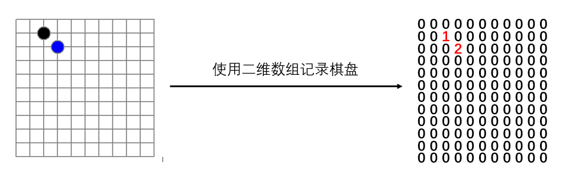
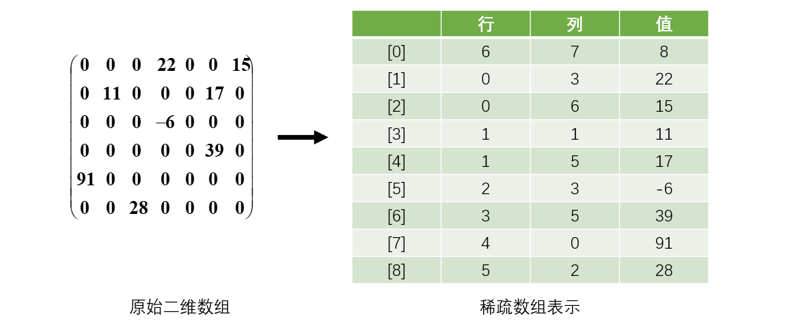
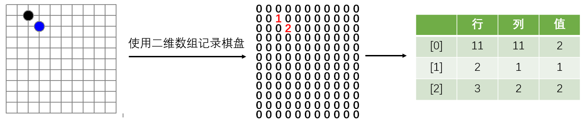

[TOC]

### 稀疏数组

#### 稀疏数组

应用场景：记录一个**棋盘**。或者**地图**等，如下所示。



因为该二维数组的很多值是**默认值 0**, 因此记录了很多没有意义的数据，考虑使用稀疏数组。

当一个数组中**大部分元素为０**，或者为同一个值的数组时，可以使用稀疏数组来保存该数组。

稀疏数组的处理方法是:

- 记录数组一共有**几行几列**，有多少个**不同的值**；
- 把具有不同值的元素的行列及值记录在一个小规模的数组中，从而缩小程序的规模。
- 行不确定，但是列是三列的动态数组。

**表示举例**



上述数组 0 较多，使用稀疏数组表示，该数组第 0 个元素记录原始数组的 行数、列数和有效数据数。后面的值就是记录有效的位置和数据值。

##### 应用实例

将上述棋盘表示成稀疏数组如下



二维数组转稀疏数组思路：

- 遍历原始的二维数组，得到有效数据的个数 noneZeroValueCounter；
- 根据 noneZeroValueCounter 创建稀疏数组 sparseArr int \[noneZeroValueCounter + 1][3]
- 将二维数组的有效数据存入到稀疏数组

稀疏数组还原成原始二维数组：

- 读取稀疏数组第一行，根据第一行数据创建原始二维数组，如上面的 chessArr = int [11] [11]
- 读取稀疏数组的后几行，还原到原始二维数组即可。


##### 代码实现

```java
/**
 * 稀疏数组
 * @author cz
 */
public class SparseArray {

    public static void main(String[] args) {
        // 创建一个原始的二维数组 11 * 11
        // 0: 表示没有棋子， 1 表示 黑子 2 表蓝子
        int[][] chessArrRaw = new int[11][11];
        chessArrRaw[1][2] = 1;
        chessArrRaw[2][3] = 2;
        // 输出原始的二维数组
        System.out.println("原始的二维数组");
        for (int[] row : chessArrRaw) {
            for (int data : row) {
                System.out.printf("%d\t", data);
            }
            System.out.println();
        }

        // 将二维数组转稀疏数组的思路
        // 1. 先遍历二维数组得到非0数据的个数
        int noneZeroValueCounter = 0;
        for (int i = 0; i < 11; i++) {
            for (int j = 0; j < 11; j++) {
                if (chessArrRaw[i][j] != 0) {
                    noneZeroValueCounter++;
                }
            }
        }

        // 2. 创建对应的稀疏数组 noneZeroValueCounter + 1行，固定3列
        int[][] sparseArray = new int[noneZeroValueCounter + 1][3];
        // 给稀疏数组第一行赋值记录二维数组信息
        sparseArray[0][0] = 11;
        sparseArray[0][1] = 11;
        sparseArray[0][2] = noneZeroValueCounter;

        // 遍历二维数组，将非0的值存放到 sparseArr中
        int counter = 0; // count 用于记录是第几个非0数据
        for (int i = 0; i < 11; i++) {
            for (int j = 0; j < 11; j++) {
                if (chessArrRaw[i][j] != 0) {
                    counter++;
                    // 原始数组元素的行
                    sparseArray[counter][0] = i;
                    // 原始数组元素的列
                    sparseArray[counter][1] = j;
                    // 原始数组元素的值
                    sparseArray[counter][2] = chessArrRaw[i][j];
                }
            }
        }

        // 输出稀疏数组的形式
        System.out.println();
        System.out.println("得到稀疏数组为");
        for (int i = 0; i < sparseArray.length; i++) {
            System.out.printf("%d\t%d\t%d\t\n", sparseArray[i][0], sparseArray[i][1], sparseArray[i][2]);
        }
        System.out.println();


        // 将稀疏数组恢复成原始的二维数组
        /*
         *  1. 先读取稀疏数组的第一行，根据第一行的数据，创建原始的二维数组，比如上面的  chessArr2 = int [11][11]
         *	2. 在读取稀疏数组后几行的数据，并赋给原始的二维数组 即可.
         */

        // 1.先读取稀疏数组的第一行，根据第一行的数据，创建原始的二维数组
        int[][] chessArrNew = new int[sparseArray[0][0]][sparseArray[0][1]];

        // 2.在读取稀疏数组后几行的数据(从第二行开始)，并赋给 原始的二维数组 即可
        for(int i = 1; i < sparseArray.length; i++) {
            chessArrNew[sparseArray[i][0]][sparseArray[i][1]] = sparseArray[i][2];
        }

        // 输出恢复后的二维数组
        System.out.println();
        System.out.println("恢复后的二维数组");

        for (int[] row : chessArrNew) {
            for (int data : row) {
                System.out.printf("%d\t", data);
            }
            System.out.println();
        }
    }
}
```


