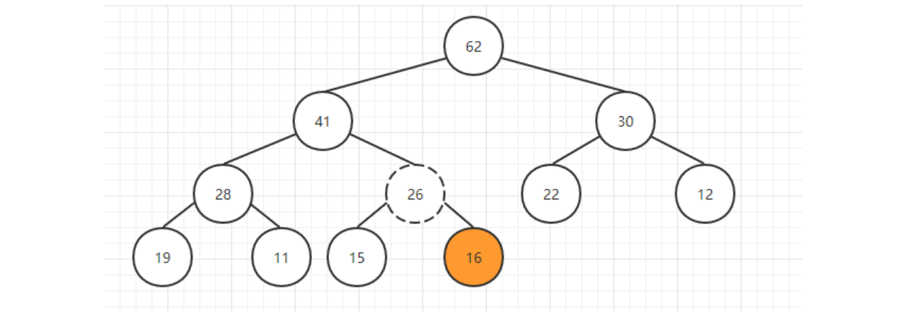
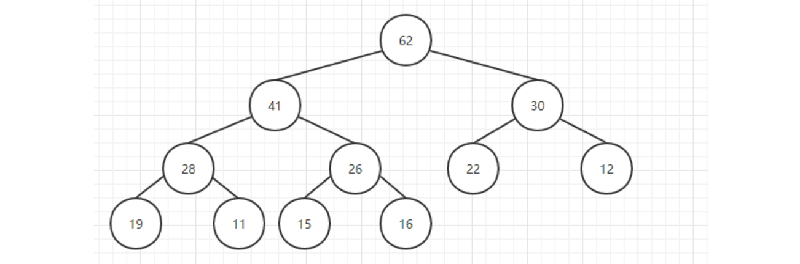
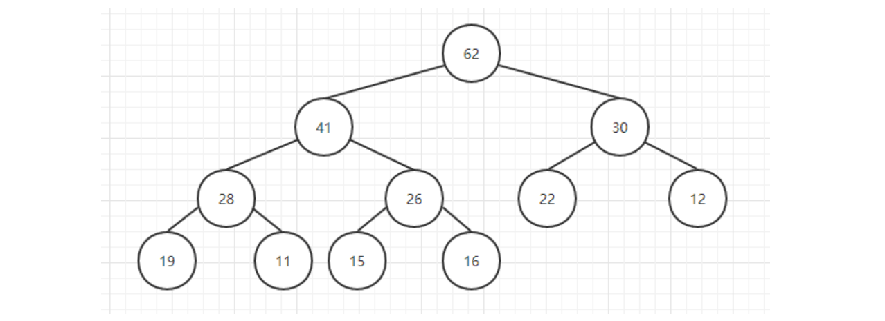
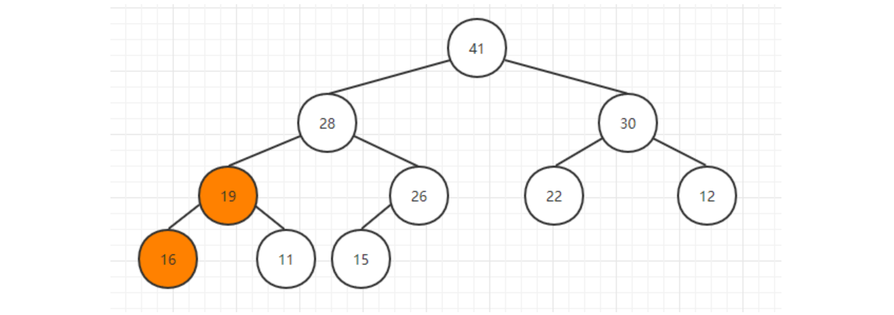

[TOC]

## 优先队列与堆

### 1 概述

优先队列有多种实现方法，对比如下表。

|  数据结构  |  插入元素  | 删除最大元素 |
| :--------: | :--------: | :----------: |
|  有序数组  |     N      |      1       |
|  无序数组  |     1      |      N       |
| **二叉堆** | ***logN*** |  ***logN***  |
| 理想情况1  |     1      |      1       |

用堆实现优先队列比较香。


### 2 二叉堆

#### 概述

当一颗二叉树的每个结点都大于等于它的两个子结点时，它被称为堆有序。

根结点是堆有序的二叉树中的最大结点。

**堆中**某个节点的值总是**大于等于**其子节点的值，并且堆是**一颗完全二叉树**。

堆可以用==**数组**==来表示，这是因为**堆是完全二叉树**，而完全二叉树很容易就存储在数组中。位置 **k** 的节点的父节点位置为 **k / 2**，而它的两个子节点的位置分别为 **2k 和 2k+1**。这里**不使用数组索引为 0** 的位置，是为了更清晰地描述节点的位置关系。

|   结点   |    位置     |
| :------: | :---------: |
| 当前结点 |  **a[k]**   |
|  父结点  | **a[k/2]**  |
| 左子结点 |  **a[2k]**  |
| 右子结点 | **a[2k+1]** |


一颗大小为 N 的完全二叉树的高度为 lgN。


#### 二叉堆的数组存储

首先来看堆是怎样表示的，一种可能的方法就是使用**数组**，因为堆在形式上是一颗完全二叉树，用数组来存储它**不会浪费**任何空间。


用数组来表示堆不仅不会浪费空间还具有一定的**优势**：

- 每个结点的左孩子为下标 i 的 2 倍：

```java
leftChild(i) = i * 2
```

- 每个结点的右孩子为下标 i 的 2 倍加 1：

```java
rightChild(i) = i * 2 + 1
```

每个结点的父亲结点为下标的二分之一：

```java
parent(i) = i / 2
```

注意这里是**整数除**，2 和 3 除以 2 都为 1，大家可以验证一下。

- **注意：**这里是把下标为 **0** 的地方**空出来**了的，主要是为了方便理解，如果 0 不空出来只需要在计算的时候把 i值往右偏移一个位置就行了。


#### 特征分析

一个堆的高度为 logN，因此在堆中插入元素和删除最大元素的复杂度都为 logN。

对于堆排序，由于要对 N 个节点进行下沉操作，因此复杂度为 NlogN。

堆排序是一种**原地排序**，没有利用额外的空间。

现代操作系统很少使用堆排序，因为它无法利用局部性原理进行缓存，也就是数组元素很少和相邻的元素进行比较和交换。


### 3 二叉堆基本操作与代码实现

以下是二叉堆类的基本元素与基本操作。

```java
/**
 * 二叉堆
 *
 * @param <AnyType> 泛型类型
 * @author cz
 */
public class BinaryHeap<AnyType extends Comparable<? super AnyType>> {

    /**
     * 默认容量
     */
    private static final int DEFAULT_CAPACITY = 10;

    /**
     * 当前堆中的元素个数
     */
    private int currentSize;

    /**
     * 存放堆元素的数组
     */
    private AnyType [] dataArray;

    /**
     * 构造器
     */
    public BinaryHeap() {
        this( DEFAULT_CAPACITY );
    }

    /**
     * Construct the binary heap.
     * @param capacity the capacity of the binary heap.
     */
    public BinaryHeap( int capacity ) {
        currentSize = 0;
        dataArray = (AnyType[]) new Comparable[ capacity + 1 ];
    }
    

    /**
     * 拓展数组
     *
     * @param newSize 新数组容量
     */
    private void enlargeArray(int newSize) {
        AnyType[] old = dataArray;
        dataArray = (AnyType[]) new Comparable[ newSize];
        for(int i = 0; i < old.length; i++) {
            dataArray[i] = old[i];
        }
    }

    /**
     * 返回二叉堆最小值
     *
     * @return 最小值
     */
    public AnyType findMin() {
        if( isEmpty() ) {
            throw new RuntimeException( );
        }
        // 当前构造的最小堆，数组第一个元素就是最小值
        return dataArray[1];
    }

    /**
     * 判断是否为空
     */
    public boolean isEmpty() {
        return currentSize == 0;
    }

    /**
     * 清空二叉堆
     */
    public void makeEmpty() {
        currentSize = 0;
    }


    /**
     * 测试用
     */
    public static void main( String [ ] args ) {
        int numItems = 10000;
        BinaryHeap<Integer> h = new BinaryHeap<>( );
        int i = 37;

        for( i = 37; i != 0; i = ( i + 37 ) % numItems ) {
            h.insert( i );
        }
        for( i = 1; i < numItems; i++ ) {
            if( h.deleteMin( ) != i ) {
                System.out.println( "Oops! " + i );
            }
        }

    }
}
```


#### 插入元素

当**插入**一个元素到堆中时，它可能不满足堆的性质，在这种情况下，需要**调整堆中元素的位置使之重新变成堆**，这个过程称为**堆化**（heapifying）；在最大堆中，要堆化一个元素，需要**找到它的父亲结点**，如果不满足堆的基本性质则**交换两个元素的位置**，重复该过程直到每个结点都满足堆的性质为止。

在堆的**==下一个可用位置创建一个空穴==**，否则该堆将不是完全树。将**待插入的元素**与**空穴的父结点**进行比较，如果比父节点小就交换空穴与父节点位置，空穴**上浮**，循环此过程。

下面我们来模拟一下这个过程：

下面我们在该堆中插入一个新的元素 26：

在二叉堆的下一个可用位置放置一个空穴，该空穴假定值为 26，但是不赋值，可以**==减少比较与交换操作==**。


我们通过**索引**（上面的公式）可以很容易地找到新插入元素的**父亲结点**，然后**比较它们的大小**，如果新元素更大则交换两个元素的位置，这个操作就相当于把该元素**==上浮==**了一下。如下图中 26 与 16 交换位， 26 上浮。



重复该操作直到 26 到了一个满足堆条件的位置，此时就完成了插入的操作，下图插入 26 完成。



插入元素代码实现如下。下面的方法中，如果空穴上浮 d 层，那么反复交换需要执行 3d 次操作，而下面的方法只用到了 **d + 1** 次幅值。

```java
/**
 * 插入元素 注：下面的代码是插入元素到小顶堆中
 */
public void insert(AnyType newNode) {
    // 先检查数组容量是否需要扩容
    if( currentSize == dataArray.length - 1 ) {
        enlargeArray( dataArray.length * 2 + 1 );
    }

    // 空穴位置是当前元素数量＋1
    int hole = ++currentSize;

    // 不断将插入元素与空穴的父节点进行比较
    for(dataArray[ 0 ] = newNode; newNode.compareTo( dataArray[ hole / 2 ] ) < 0; hole /= 2 ) {
        // 交换空穴与其父节点位置 空穴上浮
        dataArray[hole] = dataArray[hole / 2];
    }

    // 最后才将插入值赋给空穴处 可以减少每次的交换操作
    dataArray[hole] = newNode;
}
```


#### 删除顶部元素

取出堆中的堆顶元素就是用**最后一个元素替换掉栈顶元素**，然后把最后一个元素删除掉，这样一来元素的总个数也满足条件，然后只需要把**栈顶元素依次往下调整**就好了，这个操作就叫做**Sift Down（下沉）**。

操作也是将堆顶元素置换为空穴，然后将空穴的**两个儿子中较小者**与其交换位置，直到下沉到对应位置。但是可能遇到**只有一个子结点**的情况，此时一种解决方法是始终保证算法把每一个结点都**看成有两个子结点**。为了实施这种解法，当堆的大小为偶数时在每个**下沉开始处**，可将其值**大于堆中任何元素的标记**放到堆的**终端后面**的位置上。也就是假想有一个大于或者小于任何元素的结点此时正在堆的**最后一个位置**上。

例如删除堆顶元素 62。



用最后元素**==替换==**掉栈顶元素，然后删除最后一个元素：


然后比较其孩子结点的大小：


如果不满足堆的条件，那么就跟**孩子结点中较大**的一个交换位置：41 ＞ 30，所以16 与 41 交换位置。


重复该步骤，直到 16 到达合适的位置：


完成取出堆顶元素的操作：



代码实现如下

```java
/**
 * 删除最小值 注意下面的代码是移除小顶堆的最小值代码
 *
 * @return 返回删除后的最小值
 */
public AnyType deleteMin() {
    // 判空
    if( isEmpty() ) {
        throw new RuntimeException( );
    }

    AnyType minItem = findMin();
    // 交换堆顶元素与最后一个元素
    dataArray[1] = dataArray[currentSize--];
    // 执行下沉操作
    percolateDown(1);
    return minItem;
}

/**
     * 下沉操作
     *
     * @param hole 空穴
     */
private void percolateDown(int hole) {
    int child;
    AnyType tmp = dataArray[hole];

    for( ; hole * 2 <= currentSize; hole = child ) {
        child = hole * 2;
        if( child != currentSize && dataArray[ child + 1 ].compareTo( dataArray[ child ] ) < 0 ) {
            child++;
        }
        if( dataArray[ child ].compareTo( tmp ) < 0 ) {
            dataArray[ hole ] = dataArray[ child ];
        } else {
            break;
        }
    }
    dataArray[hole] = tmp;
}
```


#### 根据数组构造堆

下列的代码是根据数组构造小顶堆。

```java
/**
 * 通过给定的任意数组构造一个二叉堆
 */
public BinaryHeap(AnyType[] items) {
    currentSize = items.length;
    dataArray = (AnyType[]) new Comparable[ ( currentSize + 2 ) * 11 / 10 ];

    int i = 1;
    for(AnyType item : items) {
        dataArray[i++] = item;
    }
    // 构建堆
    buildHeap();
}

/**
     * 构建堆
     */
private void buildHeap() {
    for( int i = currentSize / 2; i > 0; i-- ) {
        percolateDown( i );
    }
}
```


在堆中，当一个节点比父节点大，那么需要**交换**这个两个节点。交换后还可能比它新的父节点大，因此需要不断地进行**比较和交换**操作，把这种操作称为**上浮**。

<div align="center">  </div><br>
```java
private void swim(int k) {
    while (k > 1 && less(k / 2, k)) {
        swap(k / 2, k);
        k = k / 2;
    }
}
```

类似地，当一个节点比子节点来得小，也需要不断地向下进行比较和交换操作，把这种操作称为**下沉**。一个节点如果有两个子节点，应当与两个子节点中最大那个节点进行交换。

<div align="center">  </div><br>
```java
private void sink(int k) {
    while (2 * k <= N) {
        int j = 2 * k;
        if (j < N && less(j, j + 1))
            j++;
        if (!less(k, j))
            break;
        swap(k, j);
        k = j;
    }
}
```

##### 插入元素

将新元素放到**==数组末尾==**，然后**==上浮==**到合适的位置。

```java
public void insert(Comparable v) {
    heap[++N] = v;
    swim(N);
}
```

##### 删除最大元素

从数组**顶端删除最大**的元素，并将数组的**最后一个元素放到顶端**，并让这个元素**==下沉到合适==**的位置。

```java
public T delMax() {
    T max = heap[1];
    swap(1, N--);
    heap[N + 1] = null;
    sink(1);
    return max;
}
```


### 4 堆排序

- 堆排序是利用**堆**这种数据结构而设计的一种排序算法，堆排序是一种**选择排序，**它的最坏，最好，平均时间复杂度均为**O(NlogN)**，它也是不稳定排序。
- 堆排序能同时最优的利用时间和空间。
- 堆是具有以下性质的**==完全二叉树==**：每个结点的值都大于或等于其左右孩子结点的值，称为**大顶堆**。**注意** : 没有要求结点的左孩子的值和右孩子的值的大小关系。每个结点的值都小于或等于其左右孩子结点的值，称为**小顶堆**。
- 一般**升序**采用**大顶堆**，**降序**采用**小顶堆**。

**堆排序基本思想**

将待排序序列构造成一个**大顶堆**。此时，整个序列的**最大值**就是堆顶的**根节点**。将堆顶元素与**末尾元素进行交换**，此时末尾就为最大值。然后将剩余 n - 1 个元素**重新构造成一个堆**，这样会得到 n - 1 个元素的最大值，再将当前堆顶的最大值与 n - 1 个元素的末尾值进行交换。如此反复执行，便能得到一个有序序列。

把**最大元素**和当前堆中数组的**最后一个元素**交换位置，并且**不删除它**，那么就可以得到一个**从尾到头的递减**序列，从正向来看就是一个递增序列，这就是**堆排序**。


#### 构建堆

**无序数组**建立堆最直接的方法是从**左到右遍历数组**进行**上浮**操作。**==一个更高效的方法是从右至左进行下沉操作==**，如果一个节点的两个节点都已经是堆有序，那么进行下沉操作可以使得这个节点为根节点的堆有序。叶子节点不需要进行下沉操作，可以忽略叶子节点的元素，因此只需要**遍历一半**的元素即可。

<div align="center">  </div><br>

#### 交换堆顶元素与最后一个元素

交换之后需要进行**下沉**操作维持堆的有序状态。

<div align="center">  </div><br>

```java
public class HeapSort<T extends Comparable<T>> extends Sort<T> {
    /**
     * 数组第 0 个位置不能有元素
     */
    @Override
    public void sort(T[] nums) {
        int N = nums.length - 1;
        for (int k = N / 2; k >= 1; k--)
            sink(nums, k, N);

        while (N > 1) {
            swap(nums, 1, N--);
            sink(nums, 1, N);
        }
    }

    private void sink(T[] nums, int k, int N) {
        while (2 * k <= N) {
            int j = 2 * k;
            if (j < N && less(nums, j, j + 1))
                j++;
            if (!less(nums, k, j))
                break;
            swap(nums, k, j);
            k = j;
        }
    }

    private boolean less(T[] nums, int i, int j) {
        return nums[i].compareTo(nums[j]) < 0;
    }
}
```


### 5 Java 中的 PriorityQueue

在 Java 中也实现了自己的优先队列`java.util.PriorityQueue`，与我们自己写的不同之处在于，Java 中内置的为**最小堆**，然后就是一些函数名不一样，底层还是维护了一个 **Object 类型的数组**，另外如果想要把最小堆变成**最大堆**可以给 PriorityQueue 传入自己的**比较器**，例如：

```java
// 默认为最小堆
PriorityQueue<Integer> pq = new PriorityQueue<>();

pq.add(5);
pq.add(2);
pq.add(1);
pq.add(10);
pq.add(3);

while (!pq.isEmpty()) {
    System.out.println(pq.poll() + ", ");
}
System.out.println();
System.out.println("————————————————————————");

// 使用Lambda表达式传入自己的比较器转换成最大堆
PriorityQueue<Integer> pq2 = new PriorityQueue<>((a, b) -> b - a);
pq2.add(5);
pq2.add(2);
pq2.add(1);
pq2.add(10);
pq2.add(3);

while (!pq2.isEmpty()) {
    System.out.println(pq2.poll() + ", ");
}
```


### 6 优先队列的应用

应用很多

- 数据压缩：赫夫曼编码算法；
- 最短路径算法：Dijkstra 算法；
- 最小生成树算法：Prim 算法；
- 事件驱动仿真：顾客排队算法；
- 选择问题：查找第 k 个最小元素；


#### 动态数据排序找前 K 个值

在某些数据处理的例子中，总数据量太大，无法排序（甚至无法全部装进内存）。例如，需要从十亿个元素中选出**最大的十个**，你真的想把一个 10 亿规模的数组排序吗？但有了优先队列，你只用一个能存储**十个元素的队列**即可。具体做法是让元素一个个输入，只要优先队列的个数大于 10，就不断删除最小元素，最后优先队列长度不大于 10 时停止删除，只剩 10 个自然就是所有元素中最大的 10 个了。很多情况我们会收集一些元素，处理当前键值最大（或最小）的元素，然后再收集更多的元素，再处理当前最大的（或最小的）元素，这可以看成我们按照事件的优先级顺序来处理，生活中很多任务都是有优先级高低之分的，所以优先队列可以高效地处理这些情况。


### 7 左式堆

设计一种堆结构像二叉堆那样高效的支持合并操作而且**只使用一个数组**似乎很困难。原因在于，**合并**似乎需要把一个数组拷贝到另一个数组中去，对于相同大小的堆，这将花费O(N)。正因为如此，所有**支持高效合并**的高级数据结构都需要使用指针。

像二叉堆那样，**左式堆**也有结构性和堆序性。不仅如此，左式堆也是二叉树，它和二叉堆之间的唯一区别在于：**左式堆不是理想平衡的，而实际上是趋向于非常不平衡**。
把任意节点 X 的**零路径长**(null path length, **NPL**) NPL(X) 定义为从 X 到一个**没有两个儿子**的节点的**最短路径**长。因此，具有 0 个或 1 个儿子的节点的 NPL 值为 0，而 NPL(NULL) = -1。注意，任意节点的零路径长比它的各个儿子节点的最小值多 1。

左式堆的性质是：对于堆中的每一个节点 X，**==左儿子==的零路径长==至少==与==右儿子==的零路径长一样大**。这个性质使左式堆明显更偏重于**使树向左增加深度**，左式堆的名称也由此而来。


### 8 斜堆

斜堆是左式堆的自调节形式，实现起来较为简单。

斜堆是具有堆序的二叉树，但不存在对树的结构限制。


**参考资料**

- 《数据结构与算法分析 Java语言描述》

- https://www.cnblogs.com/wmyskxz/p/9301021.html