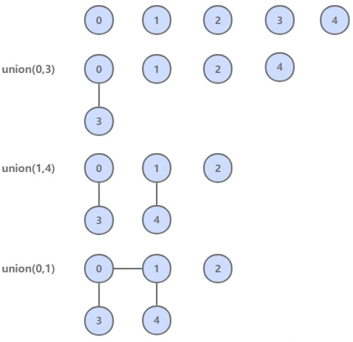
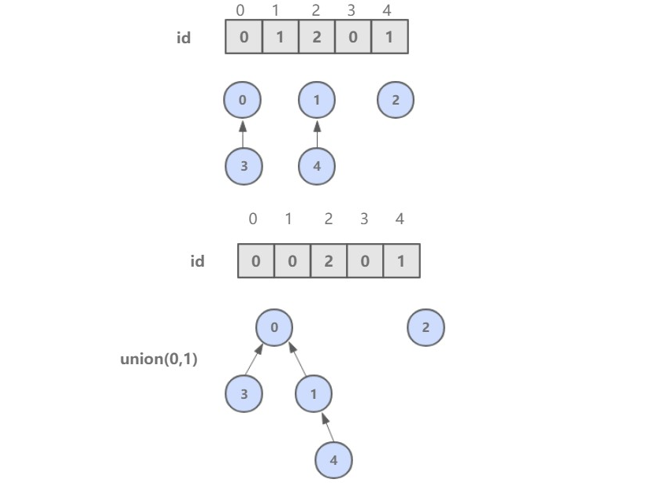

[TOC]

### 其他

#### 并查集

并查集，在一些有 N 个元素的集合应用问题中，我们通常是在开始时让每个元素构成一个单元素的集合，然后按一定顺序将属于同一组的元素所在的集合合并，其间要反复查找一个元素在哪个集合中。


##### 前言

用于解决动态连通性问题，能动态连接两个点，并且判断两个点是否连通。



|              方法               |           描述            |
| :-----------------------------: | :-----------------------: |
|            UF(int N)            | 构造一个大小为 N 的并查集 |
|    void union(int p, int q)     |     连接 p 和 q 节点      |
|         int find(int p)         | 查找 p 所在的连通分量编号 |
| boolean connected(int p, int q) | 判断 p 和 q 节点是否连通  |

```java
public abstract class UF {

    protected int[] id;

    public UF(int N) {
        id = new int[N];
        for (int i = 0; i < N; i++) {
            id[i] = i;
        }
    }

    public boolean connected(int p, int q) {
        return find(p) == find(q);
    }

    public abstract int find(int p);

    public abstract void union(int p, int q);
}
```


##### Quick Find

可以快速进行 find 操作，也就是可以快速判断两个节点是否连通。

需要保证同一连通分量的所有节点的 id 值相等。

但是 union 操作代价却很高，需要将其中一个连通分量中的所有节点 id 值都修改为另一个节点的 id 值。


```java
public class QuickFindUF extends UF {

    public QuickFindUF(int N) {
        super(N);
    }


    @Override
    public int find(int p) {
        return id[p];
    }


    @Override
    public void union(int p, int q) {
        int pID = find(p);
        int qID = find(q);

        if (pID == qID) {
            return;
        }

        for (int i = 0; i < id.length; i++) {
            if (id[i] == pID) {
                id[i] = qID;
            }
        }
    }
}
```


##### Quick Union

可以快速进行 union 操作，只需要修改一个节点的 id 值即可。

但是 find 操作开销很大，因为同一个连通分量的节点 id 值不同，id 值只是用来指向另一个节点。因此需要一直向上查找操作，直到找到最上层的节点。



```java
public class QuickUnionUF extends UF {

    public QuickUnionUF(int N) {
        super(N);
    }


    @Override
    public int find(int p) {
        while (p != id[p]) {
            p = id[p];
        }
        return p;
    }


    @Override
    public void union(int p, int q) {
        int pRoot = find(p);
        int qRoot = find(q);

        if (pRoot != qRoot) {
            id[pRoot] = qRoot;
        }
    }
}
```

这种方法可以快速进行 union 操作，但是 find 操作和树高成正比，最坏的情况下树的高度为节点的数目。


##### 加权 Quick Union

为了解决 quick-union 的树通常会很高的问题，加权 quick-union 在 union 操作时会让较小的树连接较大的树上面。

理论研究证明，加权 quick-union 算法构造的树深度最多不超过 logN。


```java
public class WeightedQuickUnionUF extends UF {

    // 保存节点的数量信息
    private int[] sz;


    public WeightedQuickUnionUF(int N) {
        super(N);
        this.sz = new int[N];
        for (int i = 0; i < N; i++) {
            this.sz[i] = 1;
        }
    }


    @Override
    public int find(int p) {
        while (p != id[p]) {
            p = id[p];
        }
        return p;
    }


    @Override
    public void union(int p, int q) {

        int i = find(p);
        int j = find(q);

        if (i == j) return;

        if (sz[i] < sz[j]) {
            id[i] = j;
            sz[j] += sz[i];
        } else {
            id[j] = i;
            sz[i] += sz[j];
        }
    }
}
```


##### 路径压缩的加权 Quick Union

在检查节点的同时将它们直接链接到根节点，只需要在 find 中添加一个循环即可。


##### 比较

|            算法            |   union    |    find    |
| :------------------------: | :--------: | :--------: |
|         Quick Find         |     N      |     1      |
|        Quick Union         |    树高    |    树高    |
|      加权 Quick Union      |    logN    |    logN    |
| 路径压缩的加权 Quick Union | 非常接近 1 | 非常接近 1 |


#### ThreeSum

此例子源于《算法》第四版。

ThreeSum 用于统计一个数组中和为 0 的三元组数量。

```java
public interface ThreeSum {
    int count(int[] nums);
}
```

1. **穷举法**

该算法的内循环为 `if (nums[i] + nums[j] + nums[k] == 0)` 语句，总共执行的次数为 N(N-1)(N-2) = N<sup>3</sup>/6-N<sup>2</sup>/2+N/3，因此它的近似执行次数为 \~N<sup>3</sup>/6，增长数量级为 **O(N<sup>3</sup>)**。

```java
// 穷举法 No Offer
public class ThreeSumSlow implements ThreeSum {
    @Override
    public int count(int[] nums) {
        int N = nums.length;
        int cnt = 0;
        for (int i = 0; i < N; i++) {
            for (int j = i + 1; j < N; j++) {
                for (int k = j + 1; k < N; k++) {
                    if (nums[i] + nums[j] + nums[k] == 0) {
                        cnt++;
                    }
                }
            }
        }
        return cnt;
    }
}
```

2. **二分查找方式**

将数组进行**排序**，对两个元素**求和**，并用二分查找方法查找是否存在该和的**相反数**，如果存在，就说明存在和为 0 的三元组。

应该注意的是，只有数组**不含有相同元素**才能使用这种解法，否则二分查找的结果会出错。

该方法可以将 ThreeSum 算法增长数量级降低为 O(N<sup>2</sup>logN)。

```java
public class ThreeSumBinarySearch implements ThreeSum {

    @Override
    public int count(int[] nums) {
        // 先排序
        Arrays.sort(nums);
        int N = nums.length;
        int cnt = 0;
        for (int i = 0; i < N; i++) {
            for (int j = i + 1; j < N; j++) {
                int target = -nums[i] - nums[j];
                int index = BinarySearch.search(nums, target);
                // 应该注意这里的下标必须大于 j，否则会重复统计。
                if (index > j) {
                    cnt++;
                }
            }
        }
        return cnt;
    }
}
```

```java
public class BinarySearch {

    public static int search(int[] nums, int target) {
        int l = 0, h = nums.length - 1;
        while (l <= h) {
            int m = l + (h - l) / 2;
            if (target == nums[m]) {
                return m;
            } else if (target > nums[m]) {
                l = m + 1;
            } else {
                h = m - 1;
            }
        }
        return -1;
    }
}
```

3. **双指针解法**

更有效的方法是先将**数组排序**，然后使用**双指针**进行查找，时间复杂度为 O(N<sup>2</sup>)。

```java
public class ThreeSumTwoPointer implements ThreeSum {

    @Override
    public int count(int[] nums) {
        // 此处应该检查一下数组长度是否大于等于3
        int N = nums.length;
        int cnt = 0;
        // 先排序
        Arrays.sort(nums);
        
        for (int i = 0; i < N - 2; i++) {
            int l = i + 1, h = N - 1, target = -nums[i];
            if (i > 0 && nums[i] == nums[i - 1]) continue;
            while (l < h) {
                int sum = nums[l] + nums[h];
                if (sum == target) {
                    cnt++;
                    while (l < h && nums[l] == nums[l + 1]) l++;
                    while (l < h && nums[h] == nums[h - 1]) h--;
                    l++;
                    h--;
                } else if (sum < target) {
                    l++;
                } else {
                    h--;
                }
            }
        }
        return cnt;
    }
}
```


4.**倍率实验**

如果 T(N) \~ aN<sup>b</sup>logN，那么 T(2N)/T(N) \~ 2<sup>b</sup>。

例如对于暴力的 ThreeSum 算法，近似时间为 \~N<sup>3</sup>/6。进行如下实验：多次运行该算法，每次取的 N 值为前一次的两倍，统计每次执行的时间，并统计本次运行时间与前一次运行时间的比值，得到如下结果：

|   N   | Time(ms) | Ratio |
| :---: | :------: | :---: |
|  500  |    48    |   /   |
| 1000  |   320    |  6.7  |
| 2000  |   555    |  1.7  |
| 4000  |   4105   |  7.4  |
| 8000  |  33575   |  8.2  |
| 16000 |  268909  |  8.0  |

可以看到，T(2N)/T(N) \~ 2<sup>3</sup>，因此可以确定 T(N) \~ aN<sup>3</sup>logN。

```java
public class RatioTest {

    public static void main(String[] args) {
        int N = 500;
        int loopTimes = 7;
        double preTime = -1;
        while (loopTimes-- > 0) {
            int[] nums = new int[N];
            StopWatch.start();
            ThreeSum threeSum = new ThreeSumSlow();
            int cnt = threeSum.count(nums);
            System.out.println(cnt);
            double elapsedTime = StopWatch.elapsedTime();
            double ratio = preTime == -1 ? 0 : elapsedTime / preTime;
            System.out.println(N + "  " + elapsedTime + "  " + ratio);
            preTime = elapsedTime;
            N *= 2;
        }
    }
}
```

```java
// 计时器
public class StopWatch {

    private static long start;

    public static void start() {
        start = System.currentTimeMillis();
    }
    public static double elapsedTime() {
        long now = System.currentTimeMillis();
        return (now - start) / 1000.0;
    }
}
```


