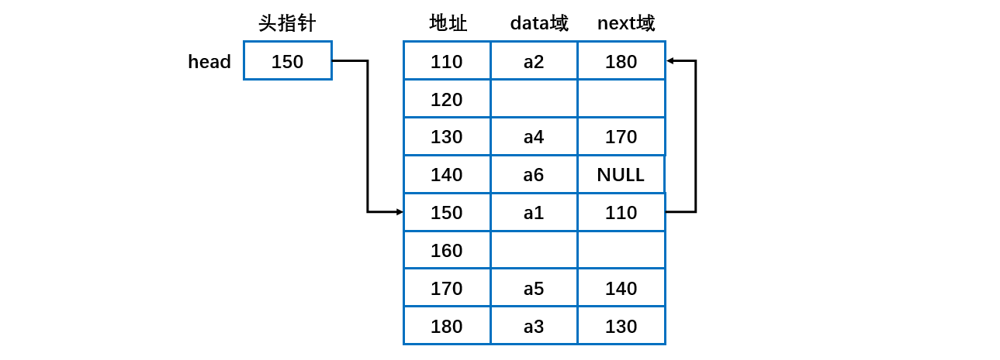
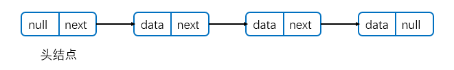
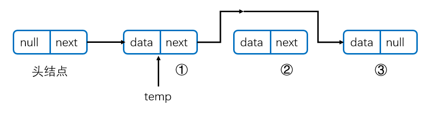
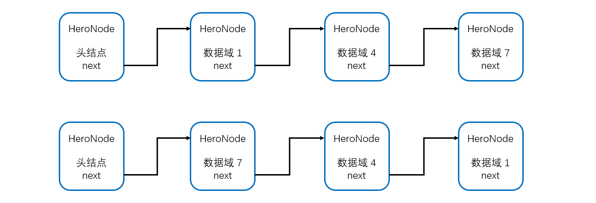
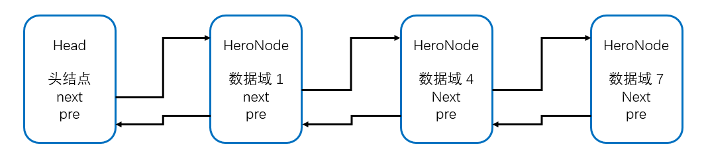

[TOC]

## 线性表

### 1 概述

线性表存储方式分为**==顺序存储和链式存储==**。顺序存储使用数组进行存储。链式存储使用链表进行存储。

对比表格如下

|                |             顺序表             |                    链式表                    |
| :------------: | :----------------------------: | :------------------------------------------: |
|  **存储方式**  |            **数组**            |                   **链表**                   |
| **地址连续性** |      内存地址**连续**存储      | 节点的地址不是连续的，是通过**指针**连起来的 |
|    **查找**    |       方便。直接内存寻址       |             不方便。需要遍历链表             |
|    **插入**    | 不方便。后面的元素需要整体后移 |              方便。修改指针即可              |
|    **删除**    | 不方便。后面的元素需要整体前移 |              方便。修改指针即可              |

**使用**

- 当线性表中的元素个数变化较大或者根本不知道有多大时，最好用单链表结构，这样可以不需要考虑存储空间的大小问题。而如果事先知道线性表的大致长度，用顺序存储结构效率会高很多。


### 2 使用数组实现线性表

**特点**

- 元素的存储空间是连续的。在内存中是以顺序存储，内存划分的**区域是连续**的。如下图。


- 缺点就是，添、删、改的时候特别麻烦，特别是添和改的时候要移动数组，数组容易越界。可能出现数组存储满的情况，需要进行**扩容并复制**。

**插入元素**：在**指定的位置**添加元素时，需要把**后面的元素整体移动**，效率不高。位置编号越大， 插入时所需要移动的元素越少，时间越快。当加入的元素**超过容量之后也需要扩展数组**，并把原来的数组内容进行**复制**，这里也是效率不高。如插入 11 需要将 10 和 2 整体后移再插入。


**删除元素**：删除指定位置的元素之后，也需要把后面的元素**整体往前移动补空位**。如下图删除 3 之后，需要把后面的数据整体前移。


###  3 单链表

#### 特点分析

- 元素在内存中不一定是连续存储的。如下图所示。



- 链表是以**结点**方式来存储数据。
- 每个结点包含 **data 域， next 域**，用于指向下一个结点。
- 链表中的节点不一定是连续存储的。如上图头结点指针 head 指向 150 地址的 a1 元素。
- 链表分带**头节点**的链表和**没有头节点**的链表，根据实际的需求来确定。
- 单向链表**不能自我删除**，需要靠**辅助节点** 。


#### 代码实现

使用链表维护一个英雄排行榜。



**头结点不存放数据**，指向第一个结点，**最后一个结点的指针域为空**。

**结点类 HeroNode**

```java
// 定义HeroNode ， 每个HeroNode 对象就是一个节点
class HeroNode {
    // 数据域
	public int no;
	public String name;
	public String nickname;
    // 指向下一个节点
	public HeroNode next; 
	// 构造器
	public HeroNode(int no, String name, String nickname) {
		this.no = no;
		this.name = name;
		this.nickname = nickname;
	}

	@Override
	public String toString() {
		return "HeroNode [no=" + no + ", name=" + name + ", nickname=" + nickname + "]";
	}
}
```

先初始化一个头结点，**头结点一般不能动**！

```java
class SingleLinkedList {
	private HeroNode head = new HeroNode(0, "", null);
}
```

##### 添加结点至链尾

添加结点到链表**末尾**。如果链表**不要求有序**，可以直接将数据添加到**头结点**。

```java
/**
 * 添加元素到链表 (直接添加到最后按照插入顺序插入)
 * @param heroNode 新结点
 *
 * 1. 找到当前链表的最后节点
 * 2. 将最后这个节点的next 指向新的节点
 * 3. 也可以直接把结点加在链表头部
 */
public void add(HeroNode heroNode) {

    // 因为head节点不能动，因此我们需要一个辅助遍历 tempNode
    HeroNode tempNode = head;
    // 遍历链表，找到最后
    while(tempNode.next != null) {
        // 如果没有找到最后, 将temp后移
        tempNode = tempNode.next;
    }
    // 当退出while循环时，temp就指向了链表的最后, 将最后这个节点的next指向新的节点
    tempNode.next = heroNode;
}
```


##### 指定位置插入结点

- 首先添加结点的**位置**，通过辅助变量找到（temp 结点），遍历实现;
- 新的结点.next = temp.next;
- 将 temp.next = 新的结点。

```java
/**
 * 第二种方式在添加英雄时，根据排名将英雄插入到指定位置
 *     (如果有这个排名，则添加失败，并给出提示)
 * @param heroNode 新的结点
 */
public void addByOrder(HeroNode heroNode) {
    // 因为头节点不能动，因此我们仍然通过一个辅助指针(变量)来帮助找到添加的位置
    // 因为单链表，因为我们找的temp 是位于添加位置的 前一个 节点，否则插入不了
    HeroNode temp = head;
    boolean flag = false; // flag标志添加的编号是否存在，默认为false
    while(temp.next != null) {
        if(temp.next.no > heroNode.no) { //位置找到，就在temp的后面插入
            break;
        } else if (temp.next.no == heroNode.no) {//说明希望添加的heroNode的编号已然存在
            flag = true; // 说明编号存在
            break;
        }
        temp = temp.next; // 后移，遍历当前链表
    }
    // 判断flag 的值
    if(flag) { // 不能添加，说明编号存在
        System.out.printf("准备插入的英雄的编号 %d 已经存在了, 不能加入\n", heroNode.no);
    } else {
        // 编号不存在则插入到链表中, temp的后面
        heroNode.next = temp.next;
        temp.next = heroNode;
    }
}
```


##### 遍历打印链表

```java
/**
 * 遍历打印链表
 */
public void list() {
    // 先判断链表是否为空
    if(head.next == null) {
        System.out.println("链表为空");
        return ;
    }
    // 因为头节点，不能动，因此我们需要一个辅助变量来遍历
    HeroNode tempNode = head.next;
    while(tempNode != null) {
        // 输出节点的信息
        System.out.println(tempNode);
        // 将temp后移
        tempNode = tempNode.next;
    }
}
```


**单链表的修改**

编号不变，名字和昵称可变。

```java
/**
 * 修改节点的信息, 根据no编号来修改，即no编号不能改.
 * @param newHeroNode 传入需要修改的结点
 *
 * 根据 newHeroNode 的 no 序号来修改即可
 */
public void update(HeroNode newHeroNode) {
    // 判断是否空
    if(head.next == null) {
        System.out.println("链表为空");
        return;
    }
    // 根据no编号找到需要修改的节点,
    // 定义一个辅助变量
    HeroNode temp = head.next;
    boolean flag = false; // 表示是否找到该节点
    while(temp.next != null) {
        if(temp.no == newHeroNode.no) {
            // 说明当前temp指向的结点就是需要修改的结点，找到结点
            flag = true;
            break;
        }
        temp = temp.next;
    }
    // 根据flag 判断是否找到要修改的节点
    if(flag) {
        temp.name = newHeroNode.name;
        temp.nickname = newHeroNode.nickname;
    } else {  //没有找到
        System.out.printf("没有找到编号 %d 的节点,不能修改\n", newHeroNode.no);
    }
}

```


##### **删除链表结点**

- 先找到需要删除的结点的前一个结点 temp，如需要删除 2 号，使得 temp 指向其前一个结点 1 号；
- 然后让 temp.next = temp.next.next 即让被删除的结点 2 号的前一个结点 1 号指向被删除结点的下一个结点3 号。



```java
/**
 * 删除节点
 *
 * @param no 需要删除的结点的序号
 * 1. head 不能动，因此我们需要一个temp辅助节点找到待删除节点的前一个节点
 * 2. 说明我们在比较时，是temp.next.no 和需要删除的节点的no比较
 */
public void delete(int no) {

    HeroNode temp = head;
    boolean flag = false; // 标志是否找到待删除节点的
    while(temp.next != null) {
        if(temp.next.no == no) {
            // 找到的待删除节点的前一个节点temp
            flag = true;
            break;
        }
        temp = temp.next; // temp后移，遍历
    }
    // 判断flag
    if(flag) { //找到
        // 可以删除
        temp.next = temp.next.next;
    }else {
        System.out.printf("要删除的 %d 节点不存在\n", no);
    }
}

```


**总结**

- 可以维护一个**尾结点**。
- 如果是无序的，也可以直接将新节点添加到链表头部。
- 一定要多注意判断**临界值**。


#### 单链表效率分析

- 在尾部添加元素、替换元素、获取元素等操作使用数组实现通常更快。
- 在给定位置添加与删除元素使用数组通常会需要移动其他元素，会较慢。
- 如果主要在近表头与表头位置添加元素，则使用链式较好。如果操作多接近表尾，则可用数组实现。
- 对于链式实现，只有头引用和同时有头引用与尾引用两种情况效率有时会有差别。
- 为了方便操作，可以维护一个指向链尾的结点。这样在链尾操作时可以不需要每次都遍历整个链。


#### 补充

**求单链表中有效结点的个数**

```java
/**
 * 获取到单链表的节点的个数(如果是带头结点的链表，需求不统计头节点)
 * 
 * @param head 链表的头节点
 * @return 返回的就是有效节点的个数
 */
public static int getLength(HeroNode head) {
    if(head.next == null) { // 空链表
        return 0;
    }
    int length = 0;
    // 定义一个辅助的变量, 这里我们没有统计头节点
    HeroNode cur = head.next;
    while(cur != null) {
        length++;
        cur = cur.next; // 遍历
    }
    return length;
}

```

**查找单链表的倒数第 K 个结点（新浪面试题）**

思路

- 编写一个方法，接收 head 节点，同时接收一个 index 
- index 表示是倒数第 index 个节点
- 先把链表从头到尾遍历，得到链表的总的长度 getLength
- 得到size 后，我们从链表的第一个开始遍历  (size - index) 个，就可以得到
- 如果找到了，则返回该节点，否则返回 nulll



思路1: 

- 先定义一个节点 HeroNode reverseHead = new HeroNode();
- 从头到尾遍历原来的链表，每遍历一个节点，就将其取出，并放在新的链表 reverseHead 的**最前端**.
- 原来的链表的head.next = reverseHead.next。

思路2：

- 使用如下题中的==栈结构==，利用其先进后出的特点实现逆序。

```java
/**
 * 将单链表反转
 * @param head 头结点
 */
public static void reversetList(HeroNode head) {
    // 如果当前链表为空，或者只有一个节点，无需反转，直接返回
    if(head.next == null || head.next.next == null) {
        return ;
    }

    // 定义一个辅助的指针(变量)，帮助我们遍历原来的链表
    HeroNode current = head.next;
    HeroNode next = null;   // 指向当前节点[cur]的下一个节点
    HeroNode reverseHead = new HeroNode(0, "", "");
    // 遍历原来的链表，每遍历一个节点，就将其取出，并放在新的链表reverseHead的最前端
    while(current != null) {
        next = current.next;    // 先暂时保存当前节点的下一个节点，因为后面需要使用
        current.next = reverseHead.next;    // 将current的下一个节点指向新的链表的最前端
        reverseHead.next = current;     	// 将 current 连接到新的链表上
        current = next; //让current后移
    }
    // 将原始的头结点指向新的链表的第一个结点
    head.next = reverseHead.next;
}

```

**从尾到头打印单链表（百度面试）**

方式一：先将单链表进行反转操作，然后再遍历，但是这样会破坏原来单链表的结构，不建议。

方式二：可以利用==栈==这个数据结构，将**各个节点==压入到栈==**中，然后利用栈的先进后出的特点，就实现了==逆序打印==的效果.

```java
/**
 * 逆序打印一个链表
 * @param head 头结点
 *
 * 可以利用栈这个数据结构，将各个节点压入到栈中，然后利用栈的先进后出的特点，就实现了逆序打印的效果. 且没有改变链表本身的结构
 */
public static void reversePrint(HeroNode head) {
    if(head.next == null) {
        return;  // 空链表，不能打印
    }
    // 创建要给一个栈，将各个节点压入栈
    Stack<HeroNode> stack = new Stack<>();
    HeroNode cur = head.next;
    // 将链表的所有节点压入栈
    while(cur != null) {
        stack.push(cur);
        cur = cur.next;     // cur后移，这样就可以压入下一个节点
    }
    // 将栈中的节点进行打印,pop 出栈
    while (stack.size() > 0) {
        // stack的特点是先进后出
        System.out.println(stack.pop());
    }
}

```


### 4 双向链表

#### 概述

- 单向链表，**查找的方向只能是一个方向**，而双向链表可以向前或者向后查找。
- 单向链表**不能自我删除**，需要靠**辅助节点** ，而双向链表，则可以**自我删除**，所以前面我们单链表删除节点时，总是需要先找到 temp, temp 是待删除节点的前一个节点。
- 双向链表维护了一个 next 指向下一个结点，维护了一个 pre 指向上一个结点。因此添加删除操作等需要**同时操作 next 和 pre** ，不要遗忘了。



#### 基本操作

##### 1. 遍历

**遍历**方式和单链表一样，只是可以向前，也可以向后查找。

##### 2. 插入结点

- 假设添加到双向链表的**最后**。

- 先找到双向链表的最后这个节点。
- temp.next = newHeroNode。
- newHeroNode.pre = temp。

##### 3. 修改结点

**修改** 思路和原来的单向链表一样.

##### 4. 删除结点

**删除**节点

- 因为是双向链表，因此可以实现**自我删除**某个节点，直接让其前一个结点指向其下一个结点，让其下一个结点指向其前一个结点。
- 直接找到要删除的这个节点，比如 temp
- temp.pre.next = temp.next
- temp.next.pre = temp.pre


#### 代码实现

**结点类**，多了一个 **pre 指针**指向前一个结点。

```java
/**
 * 定义HeroNode，每个HeroNode对象就是一个节点
 */
class HeroNode {
	public int no;
	public String name;
	public String nickname;
	public HeroNode next; 	// 指向下一个节点, 默认为null
	public HeroNode pre; 	// 指向前一个节点, 默认为null

	// 构造器
	public HeroNode(int no, String name, String nickname) {
		this.no = no;
		this.name = name;
		this.nickname = nickname;
	}

	@Override
	public String toString() {
		return "HeroNode [no=" + no + ", name=" + name + ", nickname=" + nickname + "]";
	}
}

```

双向链表实现类

```java
/**
 * 创建一个双向链表的类
 * @author cz
 */
class DoubleLinkedList {

	// 先初始化一个头节点, 头节点不要动, 不存放具体的数据
	private HeroNode head = new HeroNode(0, "", "");

	// 返回头节点
	public HeroNode getHead() {
		return head;
	}

	/**
	 * 遍历双向链表的方法
	 */
	public void list() {
		// 判断链表是否为空
		if (head.next == null) {
			System.out.println("链表为空");
			return;
		}
		// 因为头节点，不能动，因此我们需要一个辅助变量来遍历
		HeroNode temp = head.next;
		while (temp != null) {
			// 输出节点的信息
			System.out.println(temp);
			// 将temp后移， 一定小心
			temp = temp.next;
		}
	}

	/**
	 * 添加一个节点到双向链表的最后
	 * @param heroNode 新结点
	 */
	public void add(HeroNode heroNode) {

		// 因为head节点不能动，因此我们需要一个辅助遍历 temp
		HeroNode temp = head;
		// 遍历链表，找到最后 当退出while循环时，temp就指向了链表的最后
		while (temp.next != null) {
			// 如果没有找到最后, 将temp后移
			temp = temp.next;
		}
		// 形成一个双向链表
		temp.next = heroNode;
		heroNode.pre = temp;
	}

	/**
	 * 修改一个节点的内容, 双向链表的节点内容修改和单向链表一样
	 * @param newHeroNode 新结点
	 */
	public void update(HeroNode newHeroNode) {
		// 判断是否空
		if (head.next == null) {
			System.out.println("链表为空~");
			return;
		}
		// 找到需要修改的节点, 根据no编号 定义一个辅助变量
		HeroNode temp = head.next;
		boolean flag = false; 	// 表示是否找到该节点
		while (temp != null) {
			if (temp.no == newHeroNode.no) {
				// 找到
				flag = true;
				break;
			}
			temp = temp.next;
		}
		// 根据flag 判断是否找到要修改的节点
		if (flag) {
			temp.name = newHeroNode.name;
			temp.nickname = newHeroNode.nickname;
		} else { // 没有找到
			System.out.printf("没有找到 编号 %d 的节点，不能修改\n", newHeroNode.no);
		}
	}

	/**
	 * 从双向链表中删除一个节点,
	 *
	 * @param no 序号
	 * 1 对于双向链表，我们可以直接找到要删除的这个节点
	 * 2 找到后，自我删除即可
	 */
	public void del(int no) {

		// 判断当前链表是否为空
		if (head.next == null) {
			System.out.println("链表为空，无法删除");
			return;
		}

		HeroNode temp = head.next; 	// 辅助变量(指针)
		boolean flag = false; 		// 标志是否找到待删除节点的
		while (temp != null) {
			if (temp.no == no) {
				// 找到的待删除节点的前一个节点temp
				flag = true;
				break;
			}
			temp = temp.next; 	// temp后移，遍历
		}
		// 判断flag
		if (flag) { // 找到
			temp.pre.next = temp.next;
			// 如果是最后一个节点，就不需要执行下面这句话，否则出现空指针
			if (temp.next != null) {
				temp.next.pre = temp.pre;
			}
		} else {
			System.out.printf("要删除的 %d 节点不存在\n", no);
		}
	}
}

```


### 5 单向环形链表

**Josephu(约瑟夫、约瑟夫环)  问题**

Josephu  问题为：设编号为 1，2，… n 的 n 个男孩 boy 围坐一圈，约定编号为 k（1<=k<=n）的人从1开始报数，数到m 的那个人出列，它的下一位又从1开始报数，数到m的那个人又出列，依次类推，直到所有人出列为止，由此产生一个出队编号的序列。

**提示**：用一个不带头结点的循环链表来处理Josephu 问题：先构成一个有 n 个结点的单循环链表，然后由 k 结点起从1开始计数，计到 m 时，对应结点从链表中删除，然后再从被删除结点的下一个结点又从 1 开始计数，直到最后一个结点从链表中删除算法结束。


链表形成一个环状。环状的链表可以是单向的也可以是双向的。注意判断链表空的特殊条件。

**解决约瑟夫问题**

**构建**一个单向的环形链表思路

- 先创建第一个节点, 让 first 指向该节点，并形成环形
- 后面当我们每创建一个新的节点，就把该节点，加入到已有的环形链表中即可.

**遍历**环形链表

- 先让一个辅助指针(变量) curBoy，指向 first 节点
- 然后通过一个 while 循环遍历该环形链表即可。直到 **curBoy.next  == first** 结束

```java
/**
 * 约瑟夫问题求解
 * @author cz
 */
public class Josepfu {

    public static void main(String[] args) {
        // 测试构建环形链表，和遍历是否ok
        CircleSingleLinkedList circleSingleLinkedList = new CircleSingleLinkedList();
        circleSingleLinkedList.addBoy(125);  // 加入125个小孩节点
        circleSingleLinkedList.showBoy();

        // 测试一把小孩出圈是否正确
        circleSingleLinkedList.countBoy(10, 20, 125); // 2->4->1->5->3
        // String str = "7*2*2-5+1-5+3-3";
    }

}

/**
 * 创建一个环形的单向链表
 */
class CircleSingleLinkedList {
    // 创建一个first节点,当前没有编号
    private Boy first = null;

    /**
     * 添加小孩节点，构建成一个环形的链表
     * @param nums 添加的小孩数目
     */
    public void addBoy(int nums) {
        // nums 做一个数据校验
        if (nums < 1) {
            System.out.println("nums的值不正确");
            return;
        }
        Boy curBoy = null;  // 辅助指针，帮助构建环形链表
        // 使用for来创建我们的环形链表
        for (int i = 1; i <= nums; i++) {
            // 根据编号，创建小孩节点
            Boy boy = new Boy(i);
            // 如果是第一个小孩
            if (i == 1) {
                first = boy;
                // 构成环
                first.setNext(first);
                // 让 curBoy 指向第一个小孩
                curBoy = first;
            } else {
                curBoy.setNext(boy);    
                boy.setNext(first);     
                curBoy = boy;
            }
        }
    }

    /**
     * 遍历当前的环形链表
     */
    public void showBoy() {
        // 判断链表是否为空
        if (first == null) {
            System.out.println("没有任何小孩~~");
            return;
        }
        // 因为first不能动，因此我们仍然使用一个辅助指针完成遍历
        Boy curBoy = first;
        while (true) {
            System.out.printf("小孩的编号 %d \n", curBoy.getNo());
            if (curBoy.getNext() == first) {// 说明已经遍历完毕
                break;
            }
            curBoy = curBoy.getNext(); // curBoy后移
        }
    }

    /**
     * 根据用户的输入，计算出小孩出圈的顺序
     * @param startNo 表示从第几个小孩开始数数
     * @param countNum 表示数几下
     * @param nums 表示最初有多少小孩在圈中
     */
    public void countBoy(int startNo, int countNum, int nums) {
        // 先对数据进行校验
        if (first == null || startNo < 1 || startNo > nums) {
            System.out.println("参数输入有误， 请重新输入");
            return;
        }
        // 创建要给辅助指针,帮助完成小孩出圈
        Boy helper = first;
        // 需求创建一个辅助指针(变量) helper , 事先应该指向环形链表的最后这个节点
        while (true) {
            if (helper.getNext() == first) { // 说明helper指向最后小孩节点
                break;
            }
            helper = helper.getNext();
        }
        // 小孩报数前，先让 first 和  helper 移动 k - 1次
        for(int j = 0; j < startNo - 1; j++) {
            first = first.getNext();
            helper = helper.getNext();
        }
        // 当小孩报数时，让first 和 helper 指针同时 的移动  m  - 1 次, 然后出圈
        // 这里是一个循环操作，知道圈中只有一个节点
        while(true) {
            if(helper == first) { // 说明圈中只有一个节点
                break;
            }
            // 让 first 和 helper 指针同时 的移动 countNum - 1
            for(int j = 0; j < countNum - 1; j++) {
                first = first.getNext();
                helper = helper.getNext();
            }
            // 这时first指向的节点，就是要出圈的小孩节点
            System.out.printf("小孩%d出圈\n", first.getNo());
            // 这时将first指向的小孩节点出圈
            first = first.getNext();
            helper.setNext(first); //

        }
        System.out.printf("最后留在圈中的小孩编号%d \n", first.getNo());

    }
}

/**
 * 创建一个Boy类，表示一个节点
 */
class Boy {
    private int no;     // 编号
    private Boy next;   // 指向下一个节点,默认null

    public Boy(int no) {
        this.no = no;
    }

    public int getNo() {
        return no;
    }

    public void setNo(int no) {
        this.no = no;
    }

    public Boy getNext() {
        return next;
    }

    public void setNext(Boy next) {
        this.next = next;
    }

}
```


