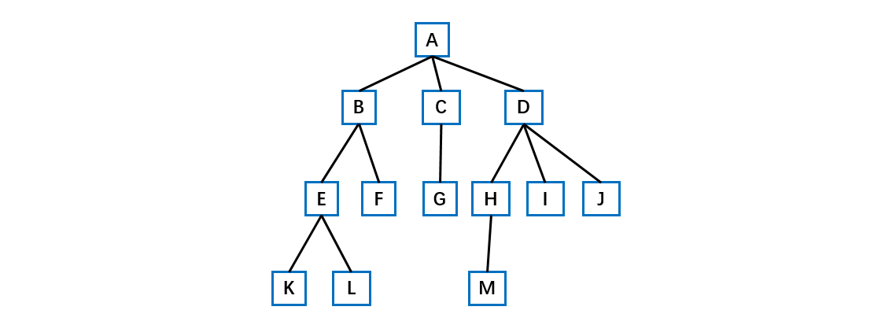
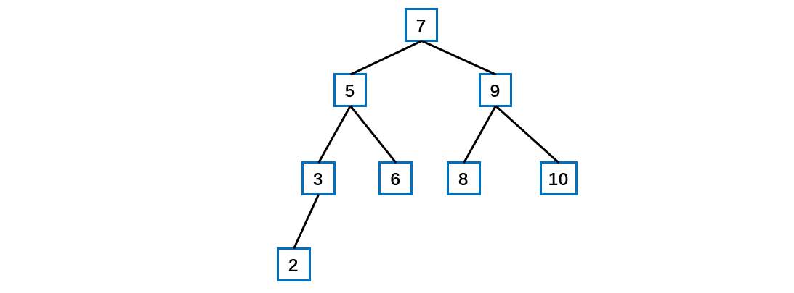
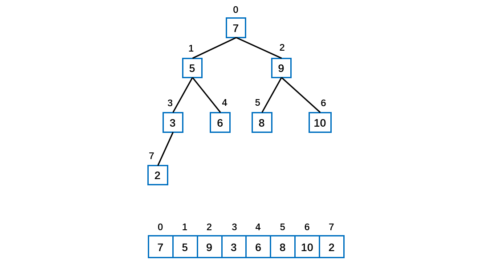
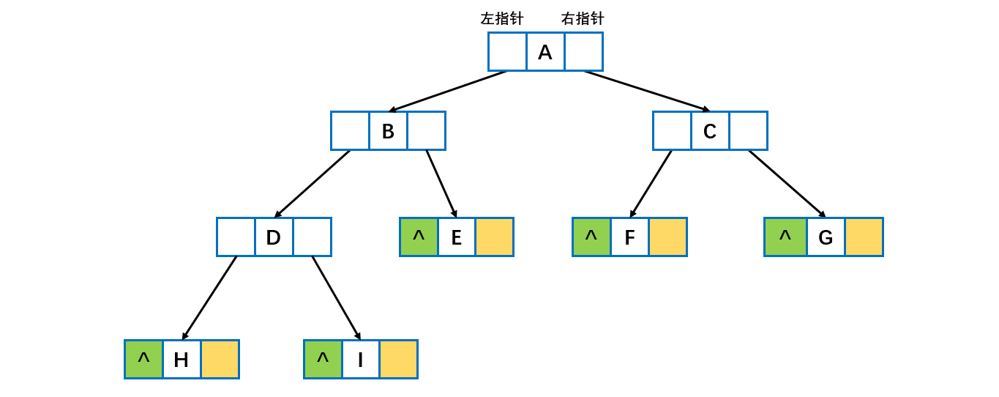

[TOC]

## 树基础

### 1 概述

- 计算机科学中的树


### 基本定义

树 (Tree) 是 n (n ≥ 0) 个结点的有限集 T，并且当 n＞0 时满足下列条件：
   （1）有且仅有一个特定的称为**根** (Root) 的结点；
   （2）当 n＞1时，其余结点可以划分为 m(m＞0) 个互不相交的有限集 T1、T2 、…、Tm，每个集 Ti (1≤ i ≤ m)均为树，且称为树 T 的**子树 ** (SubTree)。

特别地，不含任何结点(即 n＝0)的树，称为**空树**。



- **结点：**存储数据元素和指向子树的链接，由数据元素和构造数据元素之间关系的引用组成。
- **孩子结点：**树中一个结点的子树的根结点称为这个结点的孩子结点，如图中的 A 的孩子结点有B、C、D。
- **父结点：**树中某个结点有孩子结点(即该结点的度不为 0)，该结点称为它孩子结点的父结点，也叫前驱结点。父结点和孩子结点是相互的，如图中，A 的孩子结点是 B、C、D，则 B、C、D 的父结点是 A。
- **兄弟结点：**具有相同双亲结点(即同一个前驱)的结点称为兄弟结点，如图中 B、B、D 为兄弟结点。
- **结点的度：**结点所有**子树的个数**称为该结点的度，如图中 A 的度为 3，B 的度为 2。
- **树的度：**树中所有结点的度的最大值称为树的度，如图的度为 3.
- **叶子结点：**度为 0 的结点称为叶子结点。如图中的 K、L、F、G、M、I、J。
- **分支结点：**度不为 0 的结点称为分支结点。如图中的 A、B、C、D、E、H。
- **结点的层次：**从根结点到树中某结点所经路径的分支数称为该结点的层次。根结点的层次一般为 1(也可以自己定义为 0)，这样，其它结点的层次是其双亲结点的层次加 1。
- **树的深度：**树中所有结点的层次的最大值称为该树的**深度**(也就是最下面那个结点的层次)。
- **有序树和无序树：**树中任意一个结点的各子树按从左到右是有序的，称为有序树，否则称为无序树。
- **数据元素：**具有相同特性的数据元素的集合。
- **结构关系：**树中数据元素间的结构关系由树的定义确定。

- **森林**：由 m 棵不相交的树组成的集合，叫做森林。


树的种类有很多，我们接触到的树有二叉树、平衡二叉树、二叉查找树、B 树、B+ 树、哈夫曼树、B* 树、红黑树和 trie 树等。


**二叉树**

- 每个结点**最多两个子节点**的树为二叉树。
- 如果二叉树的叶子结点都在最后一层，并且结点总数 = 2 ^ n - 1 （n 为层数），则此为**满二叉树**。
- 如果二叉树除了最后一层之外均为满的，且最后一层的子节点从左到右排列，此成为**完全二叉树**。


### 2 普通二叉树的遍历与查找

#### 遍历思路

==**二叉树的遍历**==

前序遍历: **先输出父节点**，再遍历左子树和右子树。

中序遍历: 先遍历左子树，**再输出父节点**，再遍历右子树。

后序遍历: 先遍历左子树，再遍历右子树，**最后输出父节点**。

**小结**: 看输出**父节点**的顺序，就确定是前序，中序还是后序

前序遍历步骤：初始的时候是 root 结点，先输出当前结点，如果左子结点不为空，则继续递归前序遍历。如果右子结点不为空，则继续递归前序遍历。

中序遍历步骤：初始的时候是 root 结点，如果当前结点的左子结点不为空，则继续递归中序遍历。输出当前结点。如果当前节点的右子结点不为空，则继续递归中序遍历。

后序遍历步骤：初始的时候是 root 结点，如果当前结点的左子结点不为空，则继续递归中序遍历。如果当前节点的右子结点不为空，则继续递归中序遍历。输出当前结点。

**二叉树的查找**

**前序查找**思路：

先判断当前结点的 data 是不是要查找的，如果是相等的就返回当前结点。如果不相等，判断当前结点的左结点是否非空，如果不为空，则递归前序查找。如果左递归前序查找找到结点，则返回结点，否则继续判断当前结点的右结点是否为空，如果不为空则继续向右递归前序查找。

**中序查找**思路：

判断当前结点的左子节点是否为空，如果不为空，则递归中序查找 。如果找到则返回结点，如果没有找到，就和当前结点比较，如果是则返回当前结点，否则继续进行右递归的中序查找。如果右递归中序查找，找到就返回结点，否则返回 null。

**后续查找**思路：

判断当前结点的左子节点是否为空，如果不为空，则递归后序查找。如果找到就返回结点，如果没有找到就判断当前结点的右子结点是否为空，如果不为空，就右递归进行后续查找，如果找到就返回。和当前结点进行比较，如果是则返回，否则返回 null。

#### 遍历实例

**注意：首先处理 null 的情形，然后才是其余的工作。**

如下图所示的普通二叉树



下面的代码是上图中的三种遍历与查找。

```
前序遍历结果:
[7, 5, 3, 2, 6, 9, 8, 10]
中遍历结果:
[2, 3, 5, 6, 7, 8, 9, 10]
后序遍历结果:
[2, 3, 6, 5, 8, 10, 9, 7]
```

结点类 Node。

```java
/**
 * 结点类
 */
@Data
class Node {

    /**
     * 数据
     */
    private int data;
    
    /**
     * 左子结点
     */
    private Node leftNode;

    /**
     * 右子结点
     */
    private Node rightNode;

    public Node(int data) {
        this.data = data;
    }
}
```

```java
import java.util.ArrayList;
import java.util.Arrays;
import java.util.List;
import lombok.Data;
import lombok.Getter;

/**
 * 二叉树遍历
 * @author cz
 */
public class BinaryTree {

    public static void main(String[] args) {

        // 构造一颗二叉树
        Node rootNode = new Node(7);
        Node node5 = new Node(5);
        Node node9 = new Node(9);
        Node node3 = new Node(3);
        Node node6 = new Node(6);
        Node node8 = new Node(8);
        Node node10 = new Node(10);
        Node node2 = new Node(2);
        rootNode.setLeftNode(node5);
        rootNode.setRightNode(node9);
        node5.setLeftNode(node3);
        node5.setRightNode(node6);
        node3.setLeftNode(node2);
        node9.setLeftNode(node8);
        node9.setRightNode(node10);

        BinaryTree binaryTree = new BinaryTree();
        binaryTree.preOrder(rootNode);
        System.out.println("前序遍历结果:");
        System.out.println(Arrays.toString(binaryTree.getPreOrderDataList().toArray()));


        binaryTree.midOrder(rootNode);
        System.out.println("中遍历结果:");
        System.out.println(Arrays.toString(binaryTree.getMidOrderDataList().toArray()));


        binaryTree.postOrder(rootNode);
        System.out.println("后序遍历结果:");
        System.out.println(Arrays.toString(binaryTree.getPostOrderDataList().toArray()));

        System.out.println("前序遍历查找");
        Node resultNode = binaryTree.preOrderSearch(rootNode, 10);

        if (resultNode != null) {
            System.out.println("找到数据:" + resultNode.getData());
        } else {
            System.out.println("未找到数据");
        }

    }


    /**
     * 存放遍历后数据结果的列表
     */
    @Getter
    private List<Integer> preOrderDataList = new ArrayList<>();

    @Getter
    private List<Integer> midOrderDataList = new ArrayList<>();

    @Getter
    private List<Integer> postOrderDataList = new ArrayList<>();


    /**
     * 前序遍历 递归实现
     * @param node 结点类
     */
    public void preOrder(Node node) {

        preOrderDataList.add(node.getData());
        if (node.getLeftNode() != null) {
            preOrder(node.getLeftNode());
        }
        if (node.getRightNode() != null) {
            preOrder(node.getRightNode());
        }
    }


    /**
     * 中序遍历 递归实现
     * @param node 结点类
     */
    public void midOrder(Node node) {

        if (node.getLeftNode() != null) {
            midOrder(node.getLeftNode());
        }

        midOrderDataList.add(node.getData());

        if (node.getRightNode() != null) {
            midOrder(node.getRightNode());
        }
    }


    /**
     * 后序遍历 递归实现
     * @param node 结点类
     */
    public void postOrder(Node node) {

        if (node.getLeftNode() != null) {
            postOrder(node.getLeftNode());
        }

        if (node.getRightNode() != null) {
            postOrder(node.getRightNode());
        }

        postOrderDataList.add(node.getData());
    }


    /**
     * 前序遍历查找数值
     * @param node 根节点
     * @param searchValue 待查找数值
     * @return Node 结点，为null就没找到
     */
    public Node preOrderSearch(Node node, int searchValue) {

        // 判断当前结点是不是
        if (node.getData() == searchValue) {
            return node;
        }

        // 定义一个结果结点
        Node resultNode = null;

        // 判断当前结点的做子结点是否为空，如果不是则递归前序查找
        // 如果左递归前序查找找到结点则返回
        if (node.getLeftNode() != null) {
            resultNode = preOrderSearch(node.getLeftNode(), searchValue);
        }

        // 说明在左子树找到
        if (resultNode != null) {
            return resultNode;
        }

        // 如果左子树没有找到则继续判断当前结点的右子结点是否为空，不为空则继续右递归进行查找
        if (node.getRightNode() != null) {
            resultNode = preOrderSearch(node.getRightNode(), searchValue);
        }

        // 右递归时，不管找到没有都返回结果结点，如果为null则说明没找到
        return resultNode;
    }


    /**
     * 中序遍历查找数值
     * @param node 根节点
     * @param searchValue 待查找数值
     * @return Node 结点，为null就没找到
     */
    public Node midOrderSearch(Node node, int searchValue) {

        Node resultNode = null;
        if (node.getLeftNode() != null) {
            resultNode = midOrderSearch(node.getLeftNode(), searchValue);
        }
        if (resultNode != null) {
            return resultNode;
        }
        if (node.getData() == searchValue) {
            return node;
        }
        // 如果右递归中序查找，找到就返回结点，否则返回 null
        if (node.getRightNode() != null) {
            resultNode = midOrderSearch(node.getRightNode(), searchValue);
        }
        return resultNode;
    }


    /**
     * 后序遍历查找数值
     * @param node 根节点
     * @param searchValue 待查找数值
     * @return Node 结点，为null就没找到
     */
    public Node postOrderSearch(Node node, int searchValue) {

        Node resultNode = null;
        if (node.getLeftNode() != null) {
            resultNode = postOrderSearch(node.getLeftNode(), searchValue);
        }
        if (resultNode != null) {
            return resultNode;
        }
        if (node.getRightNode() != null) {
            resultNode = postOrderSearch(node.getRightNode(), searchValue);
        }
        if (resultNode != null) {
            return resultNode;
        }
        // 左右子树都没找到，比较当前结点是否是
        if (node.getData() == searchValue) {
            return node;
        }
        return resultNode;
    }

}
```


### 3 顺序存储二叉树

从数据存储来看，**数组存储方式**和**树的存储方式**可以相互转换，即**==数组==**可以转换成树，树也可以转换成数组。

特点：

1、顺序二叉树通常只考虑**完全**二叉树

2、第 n 个元素的**左子节点**为  **2 * n + 1** 

3、第 n 个元素的**右子节点**为  **2 * n + 2**

4、第 n 个元素的**父节点**为  **(n - 1) / 2**

如下图所示的二叉树



这个结构可以应用与**堆**及堆排序。


### 4 线索二叉树

二叉树可以使用两种存储结构：**顺序存储和二叉链表**。在使用二叉链表的存储结构的过程中，会存在大量的**空指针**域，为了充分利用这些空指针域，引申出了“线索二叉树”。

- 这种加上了线索的二叉链表称为线索链表，相应的二叉树称为**线索二叉树**(Threaded BinaryTree)。根据线索性质的不同，线索二叉树可分为**前序**线索二叉树、**中序**线索二叉树和**后序**线索二叉树三种。

- 一个结点的前一个结点，称为**前驱**结点。一个结点的后一个结点，称为**后继**结点。



通过观察上面的二叉链表，存在着若干个没有指向的**空指针域**。对于一个有 n 个节点的二叉链表，每个节点有指向左右节点的 2 个指针域，整个二叉链表存在 2n 个指针域。而 n 个节点的二叉链表有 n - 1 条分支线，那么空指针域的个数 = 2n - (n-1) = **n + 1个空指针域**，从存储空间的角度来看，这 n + 1个空指针域浪费了内存资源。 

从另外一个角度来分析，如果我们想知道按**中序方式**遍历二叉链表时 B 节点的前驱节点或者后继节点时，必须要按中序方式遍历二叉链表才能够知道结果，每次需要结果时都需要进行一次遍历，是否可以考虑**提前存储这种前驱和后继的关系**来提高时间效率呢？ 
综合以上两方面的分析，可以通过充分利用二叉链表中的空指针域，存放节点在某种遍历方式下的前驱和后继节点的指针。**我们把这种指向前驱和后继的指针成为线索，加上线索的二叉链表成为线索链表，对应的二叉树就成为“线索二叉树(Threaded Binary Tree)”** 。

**线索二叉树构造过程**

此处对二叉树进行中序遍历，遍历的结果为

```
H D I B E A F C G
```

将所有的节点**右子节点**为空的指针域指向它的后继节点。如下图： 

具体参考：

https://blog.csdn.net/jisuanjiguoba/article/details/81092812

线索化二叉树后**不能再使用之前基础**的二叉树遍历方式。这时需要使用新的方式遍历线索化二叉树，各个节点可以通过线型方式遍历，因此无需使用递归方式，这样也提高了遍历的效率。 遍历的次序应当和中序遍历保持一致。


**参考资料**

- https://blog.csdn.net/jisuanjiguoba/article/details/81092812