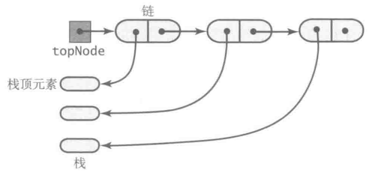
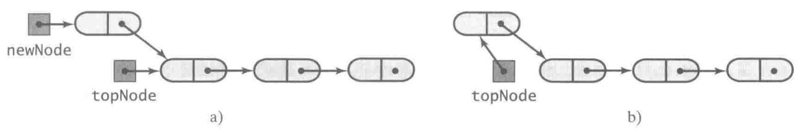
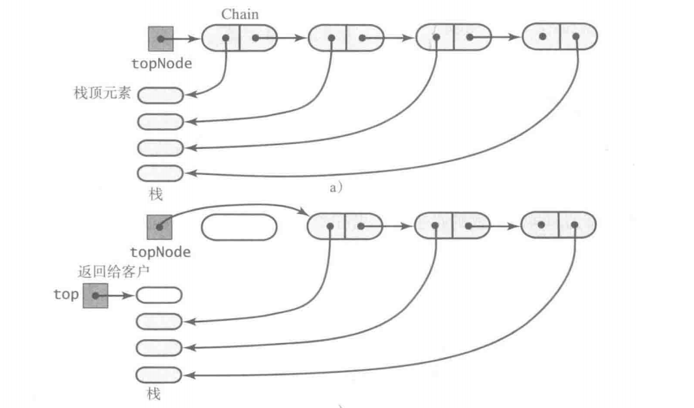
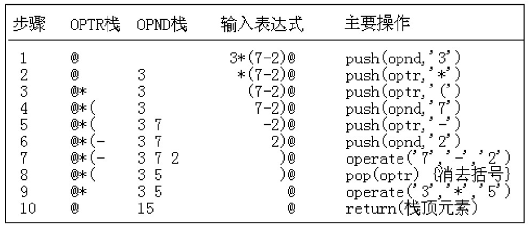

[TOC]

### 栈

#### 概述

- 后进先出（LIFO）。
- 栈的操作端通常被称为栈顶，另一端被称为栈底。
- 所有添加都位于栈顶。栈顶是最新的数据。删除也是先删除栈顶。
- 入栈：增加元素；出栈：删除元素；查看：获取栈顶但不删除。
- 顺序存储的栈称为**顺序栈**；链式存储的栈称为**链式栈**。


#### 栈的抽象接口

```java
public interface StackInterface<T> {
    /**
     * 压栈
     * @param newEntry 新元素
     */
    void push(T newEntry);

    /**
     * 弹栈 删除元素
     * @return 栈顶元素
     * @throws  EmptyStackException 自定义栈空异常
     */
    T pop();

    /**
     * 查看栈顶元素但不删除
     * @return 栈顶元素
     * @throws  EmptyStackException 自定义栈空异常
     */
    T peek();

    /**
     * 是否为空
     */
    boolean isEmpty();

    /**
     * 清空栈
     */
    void clear();
}
```


#### 栈的链式实现

需要使用链表的头插法来实现，因为头插法中最后压入栈的元素在链表的开头，它的 next 指针指向前一个压入栈的元素，在弹出元素时就可以通过 next 指针遍历到前一个压入栈的元素从而让这个元素成为新的栈顶元素。

使用链式实现栈，则首节点应该指向**栈顶**元素。首节点指向链尾是不合理的。



**压栈**操作就是分配一个新结点，使之指向目前的栈链，如下图所示。



a) 构造指向栈顶的新节点；

b) 头指针指向栈顶新节点。

弹栈操作就是将首节点的引用赋给topNode，从而出栈。故将topNode指向链中的第二个结点。如下图所示。



实现方式

```java
/**
 * 使用链式结构实现栈
 * @param <T> T类型元素
 * @author cz
 */
public class LinkedStack<T> implements StackInterface<T> {

    /**
     * 头结点
     */
    private Node topNode;

    public LinkedStack() {
        topNode = null;
    }

    /**
     * 压栈
     * @param newEntry 新元素
     */
    @Override
    public void push(T newEntry) {
        // 让新结点指向原始的头结点
        Node newNode = new Node(newEntry, topNode);
        // 头结点指向新结点
        topNode = newNode;

        // 上述也可以写成：topNode = new Node(newEntry, topNode);
    }

    /**
     * 查看栈顶元素但不删除
     * @return 栈顶元素
     */
    @Override
    public T peek() throws EmptyStackException {
        if (isEmpty()){
            throw new EmptyStackException();
        } else{
            return topNode.getData();
        }
    }


    /**
     * 弹栈 删除栈顶
     * @return 栈顶
     */
    @Override
    public T pop() throws EmptyStackException {
        if (topNode != null){
            T top = topNode.getData();
            topNode = topNode.getNextNode();
            return top;
        } else {
            throw new EmptyStackException();
        }
    }

    /**
     * 判断是否为空
     */
    @Override
    public boolean isEmpty() {
        return topNode == null;
    }

    /**
     * 清空栈
     */
    @Override
    public void clear() {
        topNode = null;
    }
    
    /**
     * 链表节点 内部类
     */
    private class Node {
        private T    data; // Entry in stack
        private Node next; // Link to next node

        private Node(T dataPortion) {
            this(dataPortion, null);
        }

        private Node(T dataPortion, Node linkPortion) {
            data = dataPortion;
            next = linkPortion;
        }

        private T getData() {
            return data;
        }

        private void setData(T newData) {
            data = newData;
        }

        private Node getNextNode() {
            return next;
        }

        private void setNextNode(Node nextNode) {
            next = nextNode;
        }
    }
}
```


#### 栈的数组实现

使用可变大小数组实现栈，容量不够时可以自动扩容。

使用数组实现栈则数组的第一个位置是栈底，数组最后占用的位置才指向栈顶，否则压栈会整体移动元素位置。


弹栈操作可以将所有的元素依次弹栈即可。

具体实现

```java
/**
 * 使用数组实现栈
 * @param <T> T类型元素
 * @author cz
 */
public class ArrayStack<T> implements StackInterface<T> {
    
    /**
     * 存放对象的元素
     */
    private T[] stack;

    /**
     * 栈顶索引
     */
    private int topIndex;

    /**
     * 是否初始化
     */
    private boolean initialized = false;

    /**
     * 默认容量
     */
    private static final int DEFAULT_CAPACITY = 50;

    /**
     * 设置最大容量防止内存溢出
     */
    private static final int MAX_CAPACITY = 10000;

    public ArrayStack() {
        this(DEFAULT_CAPACITY);
    }

    public ArrayStack(int initialCapacity) {
        checkCapacity(initialCapacity);

        // 无法构造泛型数组，需要类型转换
        @SuppressWarnings("unchecked")
        T[] tempStack = (T[])new Object[initialCapacity];
        stack = tempStack;
        topIndex = -1;
        initialized = true;
    }
    
    /**
     * 压栈
     * @param newEntry 新元素
     */
    @Override
    public void push(T newEntry) {
        checkInitialization();
        ensureCapacity();
        stack[topIndex + 1] = newEntry;
        topIndex++;
    }

    /**
     * 确保容量
     */
    private void ensureCapacity() {
        if (topIndex >= stack.length - 1) {
            int newLength = 2 * stack.length;
            checkCapacity(newLength);
            stack = Arrays.copyOf(stack, newLength);
        }
    }
    
    /**
     * 查看栈顶元素但不删除
     * @return 栈顶元素
     * @throws EmptyStackException 自定义空栈异常
     */
    @Override
    public T peek() throws EmptyStackException {
        checkInitialization();
        if (isEmpty()){
            throw new EmptyStackException();
        } else {
            return stack[topIndex];
        }
    }
    
    /**
     * 弹栈 删除栈顶
     * @return 栈顶
     */
    @Override
    public T pop() throws EmptyStackException {
        checkInitialization();
        if (isEmpty()) {
            throw new EmptyStackException();
        } else {
            T top = stack[topIndex];
            stack[topIndex] = null;
            topIndex--;
            return top;
        }
    }

    /**
     * 是否为空
     */
    @Override
    public boolean isEmpty() {
        return topIndex < 0;
    }

    /**
     * 情况栈（即不断弹栈）
     */
    @Override
    public void clear() {
        while (!isEmpty()){
            pop();
        }
    }

    /**
     * 检查新的扩容是否超过最大容量 防止内存溢出
     * @param capacity 新的容量
     */
    private void checkCapacity(int capacity){
        if (capacity > MAX_CAPACITY) {
            throw new IllegalStateException("超过最大的创建容量");
        }
    }

    /**
     * 为了初始化安全进行检查没有初始化就抛出异常
     */
    private void checkInitialization(){
        if (!initialized) {
            throw new SecurityException("尚未初始化");
        }
    }
}
```


#### 栈的向量Vector类实现

Java 类库 Vector 类，其实例（称为向量）的行为类似于一个可变大小的数组。可用于构造栈。Vector 类的实现基于动态可变大小的数组，但是其内部已经实现了许多方法，可以轻松实现栈结构。

如果使用向量实现栈，则向量的首元素应该指向栈底元素。而向量的最后的占用位置指向栈顶元素。

具体实现

```java
import java.util.Vector;

/**
 * 基于Vector类实现栈
 * @param <T> 类型变量
 * @author cz
 */
public class VectorStack<T> implements StackInterface<T> {

    /**
     * Vector类存放栈元素 内部使用动态数组实现
     */
    private Vector<T> stack;

    /**
     * 是否初始化
     */
    private boolean initialized = false;
    private static final int DEFAULT_CAPACITY = 50;
    private static final int MAX_CAPACITY = 10000;

    public VectorStack() {
        this(DEFAULT_CAPACITY);
    }

    public VectorStack(int initialCapacity) {
        checkCapacity(initialCapacity);
        // 初始化Vector类
        stack = new Vector<>(initialCapacity);
        initialized = true;
    }

    /**
     * 压栈
     * @param newEntry 新元素
     */
    @Override
    public void push(T newEntry) {
        checkInitialization();
        stack.add(newEntry);
    }

    /**
     * 查看栈顶元素 不删除
     * @return 栈顶
     */
    @Override
    public T peek() throws EmptyStackException {
        checkInitialization();
        if (isEmpty()) {
            throw new EmptyStackException();
        } else {
            return stack.lastElement();
        }
    }

    /**
     * 弹栈 删除栈顶
     * @return 栈顶
     */
    @Override
    public T pop() throws EmptyStackException {
        checkInitialization();
        if (isEmpty()) {
            throw new EmptyStackException();
        } else {
            return stack.remove(stack.size() - 1);
        }
    }

    /**
     * 判断为空
     */
    @Override
    public boolean isEmpty() {
        return stack.isEmpty();
    }

    /**
     * 清除栈
     */
    @Override
    public void clear() {
        stack.clear();
    }
    
    /**
     * 检查新的扩容是否超过最大容量 防止内存溢出
     * @param capacity 新的容量
     */
    private void checkCapacity(int capacity){
        if (capacity > MAX_CAPACITY) {
            throw new IllegalStateException("超过最大的创建容量");
        }
    }

    /**
     * 为了初始化安全进行检查没有初始化就抛出异常
     */
    private void checkInitialization(){
        if (!initialized) {
            throw new SecurityException("尚未初始化");
        }
    }
}
```


#### 递归处理链

需要将链的**第一个结点**传递给递归方法。

**显示使用链实现的数组内容：**

```java
public void display() {
    displayChain(firstNode);
}

public void displayChain(Node nodeOne){
    if (nodeOne != null) {
        System.out,println(nodeOne.getData());
        // 递归调用下一个结点
        displayChain(nodeOne.getNextNode());
    }
}
```

上述先处理第一个结点，再处理后续结点。直到参数是 null 时停止。


**反向显示链**

将链表内容反向显示。

使用迭代的话一般需要遍历两次，一次从头到尾找到尾，一次从尾到头遍历显示。使用递归只需要遍历一次，可以遍历一次保存指向各个节点的引用，然后用这些引用的反序来显示链节点中的对象。

```java
public void displayBackward(){
    displayChainBackward(firstNode);
}

public void displayChainBackward(Node nodeOne) {
    if (nodeOne != null) {
        // 递归记录各个结点的引用
        displayChainBackward(nodeOne.getNextNode());
        // 递归完成逐一打印数据
        System.out,println(nodeOne.getData());
    }
}
```


#### 栈的应用

栈的常见应用：十进制转 N 进制、行编辑器、校验括号是否匹配、中缀表达式转后缀表达式、表达式求值等。

##### 处理代数表达式

以 3 * （5 - 2）+ 7 为例，构造两个栈进行计算。




##### Java程序栈

PC 是程序计数器，记录方法入口。


