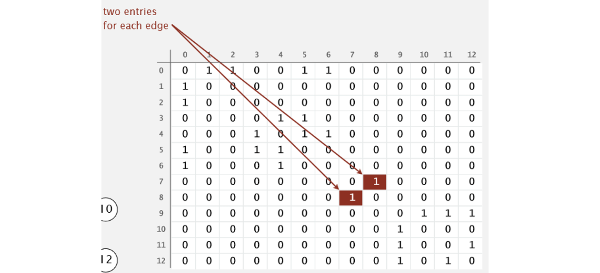

[TOC]

## 无向图

### 1 概述

一系列点以及把它们连起来的边就构成了一幅图，图是现实生活中许多东西的抽象比如地图或者电路图，在数学中也有图论这一分支专门研究图的性质，这一篇以及接下来的几篇都是和图相关的。


上图是一幅图的示例。
这里我们先研究无向图，就是图中的边是没有方向的。


#### 基本术语

还要介绍几个定义：

**顶点（V）**

**边（E）**

**度数**：某一个顶点的度数即为依附于它的边的总数。
**路径**：由边顺序连接起来的一系列顶点。
**环**：该路径上的任意一个顶点都可以沿着这条路径回到原来的顶点。
**连通图**：如果从任意一个顶点都存在一条路径到达另一个任意定点，那么这幅图是连通图。

特殊的情况自环和平行边如下图所示。


基本术语如下图所示。

树是一幅无环连通图。互不相连的树组成的集合成为森林。


#### 图的表示

以下图为例。


显然，这个无向图有 13 个点。

0 可以通往 1, 2, 5, 6；

6 可以通往 0, 4 ; 

5可以通往0, 3, 4。

即 0 的邻居点有 1, 2, 5 ,6；

6 的邻居点有 0, 4。

那么，我们怎么告诉程序这个无向图呢？

目前有两种主流的方法：**邻接矩阵（Adjacency-matrix）和邻接列表（Adjacency-list）。**

##### 邻接矩阵

如果两个点**相邻**，则用 1 表示，否则用 0。例如 1 是 0 的邻居点，所以 0 和 1 相交对应的格子为 1。

从这个图可以看出，如果每个点不是与大量的其它点互为邻居，则会有很多 0 出现。如果点的数量庞大，矩阵将十分巨大，且有很多空间浪费（0 占据的格子）。

邻接矩阵在**稠密图**中较为适合。




##### 邻接表数组

就是用一个**数组**把所有点装起来，每个位置是由**对应点的所有邻居点形成的数组**。使用邻接表可以只保留有效信息，从而大大减少空间的需求。

即 adj[0] = 6, 2, 1, 5 ( 0 可以通往 1, 2, 5, 6);

adj[6] = 0, 4（6 可以通往 0, 4）。

这个列表比较适合每个点只与少量其它点相邻的情况。即适用于**稀疏图**的情况。


在上述的数据结构中每条边会出现两次。

性能特点如下：

- 使用的空间和 **V + E** 成正比。

2. **添加一条边**所需的时间为**常数**
3. 遍历顶点 V 所有的相邻顶点所需的时间和 V 的**度数**成正比

数据结构如下

```java
public class Graph {
    private final int V; // 顶点个数
    private  int E;      // 边的个数
    private Bag<Integer>[] adj;  // 邻接表数组

    public Graph(int V){
        this.V  = V;
        this.E = 0;
        // 初始化
        adj = (Bag<Integer>[]) new Bag[V];
        for (int v=0;v<V;v++){
            adj[v] = new Bag<Integer>();
        }

    }

    public Graph(In in){
        // 读取表示图的文件
        this(in.readInt());
        int E = in.readInt();
        for(int i=0;i<E;i++){
            int v = in.readInt();
            int w = in.readInt();
            addEdge(v,w);
        }
    }

    public int V(){return V;}
    public int E(){return E;}

    public void addEdge(int v,int w){
        // 无向图需要添加两次
        adj[v].add(w);
        adj[w].add(v);
        E++;
    }

    public Iterable<Integer> adj(int v){
        return adj[v];
    }

}
```


我们可以根据实际情况进行选择用列表还是矩阵。

通过创建一个矩阵或者列表，程序可以知道这个无向图有哪些点和点与点之间的联系。如果要加点或者删点，应该不难实现，这里不做详述。

对所有数据结构，我们基本都想要一个方法能够**遍历**里面所有的数据，对于较简单的栈或者队列，我们可以直接按照元素加入的相关顺序返回一个 Iterable<> 对象，对于二叉搜索树或者红黑树，我们可以按照大小返回一个迭代对象，对于散列表，我们很难得到什么顺序信息，所以我们不会在用它的时候返回迭代数据，但同时我们牺牲这个性质以及部分空间换来的是几乎常数级的查找速度。
**现在对于图，我们也需要一个操作，遍历所有数据**，并且它最好能够反映节点之间的相关信息，所以就有了两个很重要的搜索方法，**深度优先和广度优先搜索**，下面先介绍深度优先搜索。


### 2 深度优先搜索（DFS）

深度优先搜索(DepthFirstSearch)的主要特征就是，假设一个顶点有不少相邻顶点，当我们搜索到该顶点，我们对于它的相邻顶点并不是现在就对所有都进行搜索，而是对一个顶点继续往后搜索，直到某个顶点，他周围的相邻顶点都已经被访问过了，这时他就可以返回，对它来的那个顶点的其余顶点进行搜索。

简单来说就是，在访问一个顶点时：

- 将它标记为已访问；
- 递归地访问它的所有没有被标记过的邻居顶点。

一路走到尽头，然后返回上一个分支，走另一条路到尽头，再返回，再走其他路，直到全部走完为止。

深度优先搜索的实现可以利用**递归**很简单地实现

````java
public class DepthFirstSearch {
    private boolean[] marked;
    private int count;

    public DepthFirstSearch(Graph G, int s){
        marked = new boolean[G.V()];
        dfs(G,s);
    }

    private void dfs(Graph G, int v){
        marked[v] = true;
        count++;
        for (int w:G.adj(v))
            if (!marked[w]) dfs(G, w);
    }

    public boolean marked(int w){
        return marked[w];
    }
    public int count(){return count;}

}
````

代码中使用一个 **boolean[] 数组标识某个顶点是否被访问过**，这在以后与图相关的算法中很常见，因为我们必须直到哪些顶点被访问过了。
过程如下面的图：


#### 深度优先方式寻找路径

上面的代码只是一个遍历方法，加一些东西就能够进行**路径的查找**。
主要的思想就是，利用深度优先进行全面的搜索，同时维护一个 **edgeTo[] 数组**，**保存到达每个顶点的==上一个==顶点**。深度优先搜索一定会遍历一个连通图中所有的顶点，如果两个顶点在一个连通图中，那么他们两个一定会被访问到，然后 **edgeTo[] 保存了所有的路径**，那么对于想要查找的顶点，我们就能够得到起点到它的路径。
代码如下：

```java
public class DepthFirstPaths {
    // 判断顶点是否被访问过
    private boolean[] marked;
	// 保存到某顶点的上一个顶点
    private int[] edgeTo;
	// 起点
    private final int s;

    public DepthFirstPaths(Graph G, int s){
        marked =new boolean[G.V()];
        edgeTo = new int[G.V()];
        this.s = s;
        dfs(G,s);
    }

    private void dfs(Graph G, int v){
        marked[v] = true;
        for(int w: G.adj(v)) {
            if (!marked[w]){
            // 相对于原来的深度优先搜索函数，只需要加这一行代码，保存下路径就行
            edgeTo[w] = v;
            dfs(G, w);
            }
        }
    }

    public boolean hasPathTo(int v){
        return marked[v];
    }

    public Iterable<Integer> pathTo(int v){
        if (!hasPathTo(v)) return null;
        Stack<Integer> path =new Stack<Integer>();
        for (int x=v;x!=s;x=edgeTo[x])
            path.push(x);
        path.push(s);
        return path;
    }

    public static void main(String[] args){
        java.io.File file = new java.io.File("./Graph/mediumG.txt");
		// 从《算法4》网站上下载的测试用例
        Graph G = new Graph(new In(file));
        int so=0;
        int v=150;
        DepthFirstPaths dppath = new DepthFirstPaths(G, so);
        String s =dppath.hasPathTo(v)? "is":"isn't";
        System.out.println("There "+ s +" a path to vertex "+v);
        if (dppath.hasPathTo(v))
            System.out.println(dppath.pathTo(v));

    }
}
```


### 3 广度优先搜索（BFS）

广度优先搜索（BreadthFirstSearch）相对于深度优先搜索侧重点不一样，深度优先好比是一个人走迷宫，一次只能选定一条路走下去，而广度优先搜索好比是**一次能够有任意多个人**，一次就走到和一个顶点相连的所有未访问过的顶点，然后再从这些顶点出发，继续这个过程。

具体实现的时候我们使用**先进先出队列**来实现这个过程

1. 首先将**起点加入队列**，然后**将其出队**，把和起点相连的**顶点加入队列**;
2. 将队首元素 V 出队并标记它；
3. 将和 V 相连的未标记的元素加入队列，然后继续执行步骤 2 直到队列为空。

使用一个队列来保存所有已经被标记过但邻接表还未被检查过得顶点。先将起点加入队列，然后重复以下步骤直到队列为空：

- 取队列中的下一个顶点 V 并标记它；
- 将与 V 相邻的所有**未被标记过**的顶点加入队列。

广度优先搜索的一个重要作用就是它能够找出最短路径，这个很好理解，因为广度优先搜索相当于每次从一个起点开始向所有可能的方向走一步，那么第一次到达目的地的这个路径一定是最短的，而到达了之后由于这个点已经被访问过而不会再被访问，这个路径就不会被更改了。

下面是利用广度优先进行路径搜索的代码：

```java
public class BreadthFirstPaths {
    // 到达该顶点的最短路径已知吗？
    private boolean[] marked;
    // 到达该顶点的已知路径上的最后一个顶点
    private int[] edgeTo;
    // 起点
    private final int s;

    public BreadthFirstPaths(Graph G, int s){
        marked = new boolean[G.V()];
        edgeTo = new int[G.V()];
        this.s = s;
        bfs(G,s);
    }

    // 广度优先搜索
    private void bfs(Graph G, int s){
        // 队列
        Queue<Integer> queue = new Queue<Integer>();
        // 标记起点
        marked[s] = true;
        // 加入队列
        queue.enqueue(s);
        // 不断循环直到队列为空
        while(!queue.isEmpty()){
            int v = queue.dequeue();
            for (int w:G.adj(v)){
                // 对于每个未标记的相邻顶点操作
                if (!marked[w]){
                    // 保存最短路径的最后一条边
                    edgeTo[w] = v;
                    // 标记它，因为最短路径已知
                    marked[w] =true;
                    // 将其添加到队列中
                    queue.enqueue(w);
                }
            }
        }
    }

    public boolean hasPathTo(int v){
        return marked[v];
    }

    public Iterable<Integer> pathTo(int v){
        if (!hasPathTo(v)) return null;
        Stack<Integer> path =new Stack<Integer>();
        for (int x=v;x!=s;x=edgeTo[x])
            path.push(x);
        path.push(s);
        return path;
    }
}
```

**这段代码中函数 pathTo() 返回的就是两点之间的最短路径**，当然这只是对于简单的无向图来说的，对于有向图以及加权的图情况又有所不同。

- 对于从 s 可达的任意顶点 V，广度优先搜索都能找到一条从 s 到 V 的最短路径。

- 广度优先搜索所需的时间在最坏情况下和 V + E 成正比。


### 连通分量

一个图可能是**不连通**的，那么找出图中**有几个连通分量**，找出两个顶点是否位于同一个连通分量都可以用深度优先搜索或者广度优先搜索完成，但是**深度优先搜索实现起来更简单**。
我们先看代码实现：

```java
public class CC {
    private boolean[] marked;
    private int[] id;
    private int count;

    public CC (Graph G){
        marked =new boolean[G.V()];
        id =new int[G.V()];
        for(int s=0;s<G.V();s++){
            if (!marked[s]){
                dfs(G,s);
                count++;
            }
        }
    }

    private void dfs(Graph G, int v){
        marked[v] =true;
        id[v] = count;
        for(int w:G.adj(v))
            if(!marked[w])
                dfs(G, w);
    }
    public boolean connected(int v, int w){
        return id[v]==id[w];
    }

    public int id(int v){
        return id[v];
    }
    public int count(){
        return count;
    }
}
```

代码中维护了**两个数组**，一个是常见的 **marked[]** 数组，用来表示是否被访问过，另一个是 **id[]** 数组，用来判定每个顶点**属于哪个连通分量**。
在构造函数中我们使用了**深度优先搜索函数 dfs**，对于一个顶点来说， dfs() 会遍历这个顶点**所在的连通分量所有的顶点**才会返回，接着执行下一语句也就是 count++ 刚好可以给**下一个连通分量**使用，而这些语句外围的 for 循环则可以保证会遍历所有顶点，这样就能找出所有连通分量并将它们**区分**开来。

- 深度优先搜索的预处理时间使用的时间和空间和 V+E 成正比且可以在常数时间内处理关于图的连通性的查询。

如下图有**三个**联通分量。其 id 值分别为 0, 1, 2。


#### 检测是否为无环图

检测无环图的代码有点难以理解，首先代码如下：

```java
public class Cycle {
    private boolean[] marked;
    private boolean hasCycle;

    public Cycle(Graph G){
        marked = new boolean[G.V()];
        for(int s=0;s<G.V();s++)
            if (!marked[s])
                dfs(G,s,s);
    }

    private void dfs(Graph G, int v, int u){
        marked[v] = true;
        for(int w: G.adj(v)){
            if (!marked[w])
                dfs(G, w, v); // 可以看出第二个函数表示该顶点的上一个顶点
            else if (w != u) hasCycle = true;
        }
    }
    public boolean hasCycle(){
        return hasCycle;
    }   
}
```

这里有两个关键，一个是为什么要将深度优先搜索函数 dfs() 设计成有两个参数的，观察 for 语句里面的递归用法，就知道了，第二个参数**代表当前顶点的上一个顶点是哪一个**。然而这有什么用？这里需要知道一点**连通无环图就是一颗树**，然后我们以叶节点为例，考虑深度优先搜索进行到这里的情况，假设叶节点为 w ，它的上一个节点为 v，那么我们首先调用了 dfs(G, w, v)，然后是 marked[w] = true; 节点 w 被访问，然后进入 for 循环，这时候 w 的相邻节点只有 v，if 循环被跳过，在 else 语句里面 v==v那么 hasCycle 就不会被置为 false，所以综上，这样设计成两个参数就是因为在无向图里面两个顶点互相相邻，那么就一定会有子顶点会访问到父顶点的情况，这时候访问到的已经被访问的顶点就是上一个顶点，而如果图里面有环那么显而易见，这个被访问过的顶点并不是上一个顶点，这样就能够检测出环了。


**参考资料**

- https://www.cnblogs.com/mcomco/p/10298021.html

- https://blog.csdn.net/leonliu1995/article/details/78509599