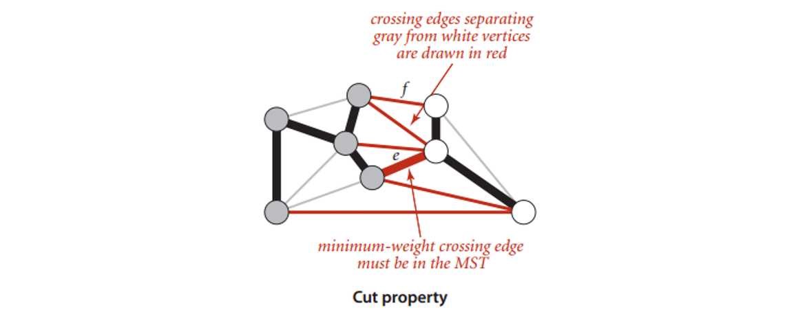
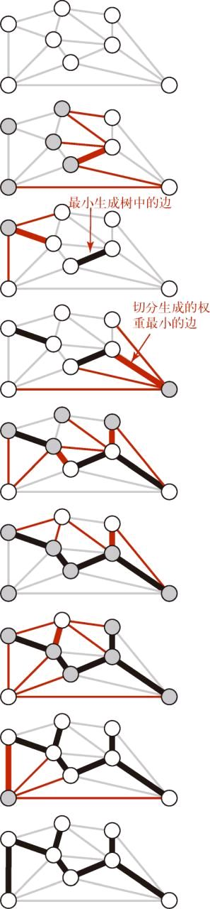
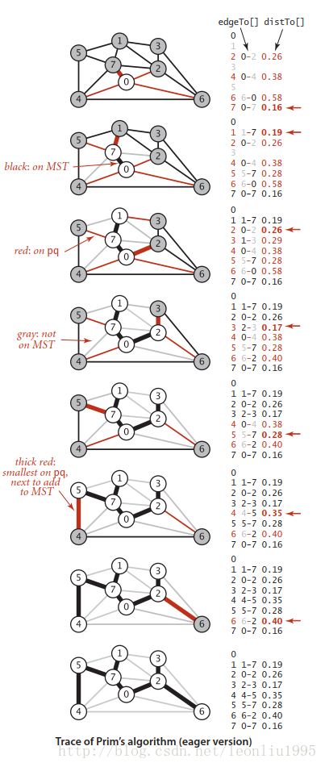
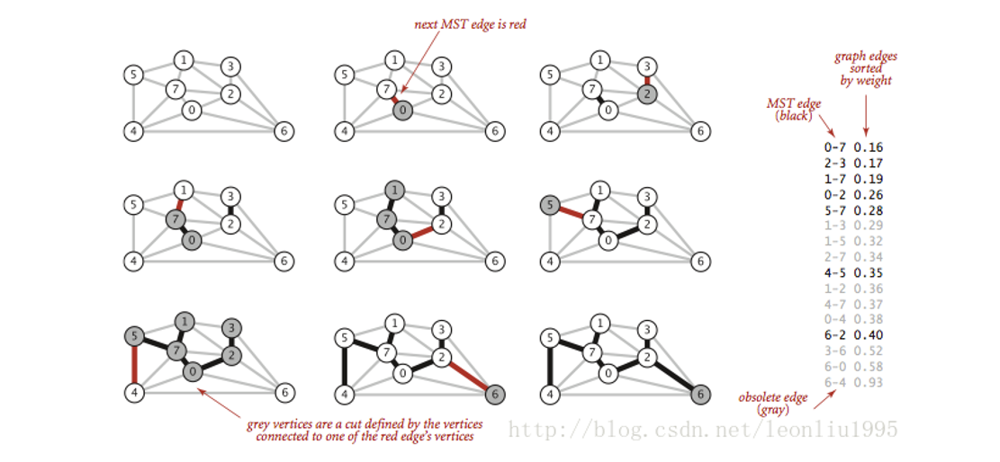

[TOC]

## 最小生成树

### 1 概述

在前面我们了解到了无向图和加权有向图，类似的我们给无向图的每一条边加上权重，就得到了加权无向图，加权无向图在现实中也有许多应用，在这一篇，我们讨论对它的一个重要的处理，就是找出图中（本篇中默认为**加权无向图**）的最小生成树。

**最小生成树：图的生成树是它的一棵含有所有顶点的无环连通子图。加权图的最小生成树（MST）是它的一棵权值之和最小的生成树**。

*默认权值是不相同的，否则会产生不唯一的最小生成树*。

最小生成树算法有很多应用，比如顶点是城市，边是城市之间的航线，那么最小生成树可以看作覆盖这些城市做需要的最短总航线，下面我们先来看基本的实现原理。


### 2 基本原理

#### 切分定理

- 切分：将图的顶点集分为两个非空并且没有交集的集合。下图即切分为**白色和灰色**两部分的顶点。
- **横切边**：链接两个属于不同集合的顶点的边。（下图的红色边）



**切分定理**：在一副加权图中，给定任意的切分，**它的横切边中的==权重最小者==必然属于图中的最小生成树**。

**权重最小的横切边必然属于最小生成树。**


#### 最小生成树的贪心算法

贪心思想：**使用切分定理找到最小生成树的一条边，不断重复直到找到最小生成树的所有边。**

贪心算法是所有最小生成树算法的基础，基本原理就是从一个点开始，以已经找到的最小生成树的顶点，和其他顶点作为一个切分，找出权重最小的横切边，加入最小生成树，不断进行下去，直到包含了所有顶点。

过程如下：

将含有 V 个顶点的任意加权连通图中属于最小生成树的**边标记为黑色**。

1. 初始状态下所有边均为灰色，找到一种切分，它产生的横切边**均不为黑色**。
2. 将它**权重最小**的横切边标记为**黑色**。
3. 反复，直到标记了 **V-1 条黑色**边为止。




### 3 无向加权图数据结构

同样，对新的数据结构也要进行实现，不一样的是为了方便对边的操作，这里增加了**边的对象**。数据结构与无向图有区别了！

```java
// 带权重的边的类
public class Edge implements Comparable<Edge>{
    // 顶点之一
    private final int v;
    // 另一个顶点
    private final int w;
    // 权重
    private final double weight;

    public Edge(int v, int w, double weight){
        this.v = v;
        this.w = w;
        // 边的权重
        this.weight = weight;
    }

    public double weight(){
        return weight;
    }
    public int either(){
        return v;
    }
    // 返回另一个顶点
    public int other(int vertex){
        if      (vertex == v) return w;
        else if (vertex == w) return v;
        else throw new RuntimeException("Inconsistent edge");
    }

    public int compareTo(Edge that){
        // 使用边的权重进行比较
        if    (this.weight < that.weight)   return -1;
        else if  (this.weight > that.weight) return 1;
        else return 0;
    }

    public String toString(){
        return String.format("%d-%d  %.2f", v,w,weight);
    }
}
```

然后才是加权无向图的实现代码。

```java
public class EdgeWeightedGraph {
    // 顶点总数
    private final int V;
    // 边的总数
    private int E;
    // 邻接表
    private Bag<Edge>[] adj;

    public EdgeWeightedGraph(int V){
        this.V = V;
        this.E = 0;
        adj = (Bag<Edge>[]) new Bag[V];
        for(int v = 0; v<V;v++){
            adj[v] = new Bag<Edge>();
        }
    }

    public EdgeWeightedGraph(In in){
        this(in.readInt());
        int E = in.readInt();
        for(int i=0;i<E;i++){
            int v = in.readInt();
            int w = in.readInt();
            Double weight = in.readDouble();
            Edge e = new Edge(v, w, weight);
            addEdge(e);
        }
    }

    public int V(){return V;}
    public int E(){return E;}

    public void addEdge(Edge e){
        // 获取两个顶点
        int v = e.either();
        int w = e.other(v);
        adj[v].add(e);
        adj[w].add(e);
        E++;
    }
    public Iterable<Edge> adj(int v){
        return adj[v];
    }

    public Iterable<Edge> edges(){
        Bag<Edge> bag = new Bag<Edge>();
        for(int v=0;v<V;v++)
            for (Edge e:adj[v])
                if(e.other(v)>v) bag.add(e);
        return bag;
    }

}
```

值得注意的一点是，因为是**无向图**，所以添加的时候要在**两个端点的 Bag 里面都要添加**，但是因为添加的是 Edge 对象的引用，所以所有的 Edge 对象**只存了一份**。


### 4 Prim算法

这里介绍的 Prim 算法和下面将要介绍的 Kruskal 算法基本原理都是上面说的**贪心算法**，可以发现算法实现的关键就是**找出横切边**。这两个算法被发现的年代都很早，但是在《算法4》中，作者使用的都是**最小优先队列**，但是在 Prim 算法的**即时版本**中使用的是**索引优先队列**，具体的这种数据结构放在稍后介绍，主要功能是差不多的，在第一个位置能够得到最小的键值的索引，不过先来看 Prim 算法的具体实现原理。
这里只介绍书上的**即时版本**（还有一个**延时**版本）。代码中维护几个重要的数据结构：

**edgeTo[]:** 对于索引 i，edgeTo[i] 表示对于顶点 i，将其链接到最小生成树上的边。
**distTo[]**：distTo[w] = edgeTo[w].weight()，就是上面所说的对应的边的权重。
**marked[]**：顶点 v 在树中则为 true
**IndexMinPQ 的索引优先队列**：保存顶点值如 w 和它到树的所有边中权重的最小值，也是 distTo[w] 的值，这个值会变化，只要在树的生长过程中发现某个顶点 v 到 w 的边的权重比 distTo[w] 小，那么distTo[w] 的值就会改成边 v-w 的权值，相应的 edgeTo[w] 也会改成边 v-w。

下面是从教材上截取的一幅图：


我们可以大致看下算法的运行过程，首先将 0 加入优先队列，之后将其弹出，插入和 0 相邻的顶点，图中左边显示了 edgeTo[] 和 distTo[]，红色的值代表当前阶段在优先队列中的边，也就是图示中细红色的边。再看第 6 步，原本是 0-4 这条边连接在生成树上的，但是当树生长到 5 节点的时候，发现 5-4 的权重更低，所以就更改了 4 连到树上的边。最后还有一点需要注意，树内的顶点是不能连接的，否则就会**形成环**，所以在生长的过程中不能连接 marked[] 为 true 的节点，下面是 Prim 算法**即时版本**的代码：

```java
// Prim算法的即时版本
public class PrimMST {
    private Edge[] edgeTo;
    private double[] distTo;
    private boolean[] marked;
    // 所有的有效边都保存在索引优先队列中
    private IndexMinPQ<Double> pq;

    public PrimMST(EdgeWeightedGraph G){
        edgeTo = new Edge[G.V()];
        distTo = new double[G.V()];
        marked = new boolean[G.V()];
        for (int v = 0;v<G.V();v++)
            distTo[v] =Double.POSITIVE_INFINITY;
        pq = new IndexMinPQ<Double>(G.V());

        distTo[0] = 0.0;
        pq.insert(0, 0.0);
        while(!pq.isEmpty())
            // 找到权重最小的横切边，和相应的顶点，然后再加入新的横切边
            visit(G, pq.delMin());
    }

    private void visit(EdgeWeightedGraph G, int v){
        marked[v] =true;// 将顶点v加入生成树
        for (Edge e: G.adj(v)){// 遍历v的所有边
            int w = e.other(v);

            if (marked[w]) continue;// 另一个顶点如果在树中就不加入
            if (e.weight()<distTo[w]){// 发现更小权重的边就对数据结构更新
                edgeTo[w] =e;
                distTo[w] =e.weight();

                if(pq.contains(w))    pq.change(w, distTo[w]);
                else                  pq.insert(w, distTo[w]);
                // 优先队列中有的话就更新，没有的话就插入。
            }
        }
    }

    public Iterable<Edge> edges(){
        Bag<Edge>  mstBag = new Bag<Edge>();
        for(int v=1;v<edgeTo.length;v++)
            mstBag.add(edgeTo[v]);
        return mstBag;
    }

    public double weight(){
        double weight = 0;
        for (int i=1;i<edgeTo.length;i++)
            weight+=distTo[i];
        return weight;
    }
}
```

**索引优先队列**在本篇中不是重点，下面只给出代码实现，不做具体分析：

```java
// 《算法4》中的索引优先队列
public class IndexMinPQ<Key extends Comparable<Key>> implements Iterable<Integer> {
    private int N;
    private int[] pq;
    private int[] qp;
    private Key[] keys;
    private int maxN ;

    public IndexMinPQ(int maxN){

        this.maxN =maxN;
        N=0;
        keys = (Key[]) new Comparable[maxN+1];
        pq  =new int[maxN+1];
        qp  =new int[maxN+1];
        for (int i=0;i<=maxN;i++) qp[i] = -1;
    }

    public boolean isEmpty(){
        return N==0;
    }

    public boolean contains(int k){
        return qp[k] !=-1;
    }
    public int size(){
        return N;
    }
    private boolean greater(int i, int j){
        return keys[pq[i]].compareTo(keys[pq[j]])>0;
    }
    private void exch (int i, int j){
        int swap = pq[i];
        pq[i] = pq[j];
        pq[j] =swap;

        qp[pq[i]] =i;
        qp[pq[j]] =j;
    }

    public void insert(int k, Key key){
        N++;
        qp[k] =N;
        pq[N] = k;
        keys[k] =key;
        swim(N);

    }

    public Key min(){
        return keys[pq[1]];
    }

    private void swim(int k){
        while(k>1 && greater(k/2, k)){  
            exch( k, k/2);
            k = k/2;
        }
    }

    private void sink(int k){
        while(2*k<N){
            int j=2*k;
            if (j<=N &&  greater(j, j+1)) j++;
            if (!greater(k, j)) break;
            exch( k, j);
            k=j;
        }
    }

    public void change(int i, Key key){
        keys[i] =key;
        swim(qp[i]);
        sink(qp[i]);
    }

    public int delMin(){
        int min =pq[1];
        exch(1, N--);
        sink(1);
        assert min == pq[N+1];
        qp[min] = -1;
        keys[min] = null;
        pq[N+1] = -1;return min;
    }

    public void delete(int i){
        int index = qp[i];
        exch(index, N--);
        swim(index);
        sink(index);
        keys[i] = null;
        qp[i] = -i;
    }

    public Iterator<Integer> iterator() { return new HeapIterator(); }

    private class HeapIterator implements Iterator<Integer> {
        // create a new pq
        private IndexMinPQ<Key> copy;

        // add all elements to copy of heap
        // takes linear time since already in heap order so no keys move
        public HeapIterator() {
            copy = new IndexMinPQ<Key>(pq.length - 1);
            for (int i = 1; i <= N; i++)
                copy.insert(pq[i], keys[pq[i]]);
        }

        public boolean hasNext() { return !copy.isEmpty();  }
        public void remove()  { throw new UnsupportedOperationException();  }

        public Integer next() {
            if (!hasNext()) throw new NoSuchElementException();
            return copy.delMin();
        }
    }

}
```


### 5 Kruskal算法

Prim 算法是从**一个顶点开始**不断地生长，Kruskal 算法却不是这样，其基本想法是，**对所有边的权重进行排序，然后从小到大，不断地将最小的边加入优先队列**，这里又用到了优先队列。到最后所有的边连在一起形成一整棵树的时候，算法就可以停止。但是要注意的是，**即使我们得到了一个权重最小的边，也不一定能加入到树中，新加入的边不能让已有的边形成环**，因为生成树肯定是没有环的。

《算法4》中又使用了一种数据结构 UnionFound，可以用来**快速查找节点之间是否连通**，本质上还是树，查找的时候从叶结点不断上溯到根节点，以根节点为连通分量的区分标志。具体的结构不再详述，感兴趣的可查找其他资料。

Kruskal 算法构造最小生成树的时候也是一条边一条边的构造，不同的是它寻找的边会连接一片森林中的两棵树。我们从一片由 V 颗单节点的树构成的森林开始，不断将两棵树合并（用可以找到的最短边）直到只剩下一棵树，这就是最小生成树。



看着上面的图就会发现过程很好理解，**右边是按照权重排序好的边**，黑色的是插入树的边，灰色的是插入时会形成环的，所以没有插入的边，这样的边直接**略过**，最后只要总的**边数达到 V-1** 就行了。下面是代码示例：

```java
// Kruskal最小生成树
public class KruskalMST {
    private Queue<Edge> mst;

    public KruskalMST(EdgeWeightedGraph G){
        mst = new Queue<Edge>();
        MinPQ<Edge> pq = new MinPQ<Edge>(G.E());
        for(Edge e:G.edges()) {
            pq.insert(e);
        }
        // 这个数据结构在下面
        WeightedQuickUnionUF uf = new WeightedQuickUnionUF(G.V());

        while(!pq.isEmpty() && mst.size()<G.V()-1){
            // 从pq得到权重最小的边和它的顶点
            Edge edge = pq.delMin();
            int v = edge.either(), w = edge.other(v);
            // 忽略失效的边
            if (uf.connected(v, w)) continue;
            // 合并分量
            uf.union(v, w);
            // 将边添加到最小生成树中
            mst.enqueue(edge);
        }
    }

    public Iterable<Edge> edges(){
        return mst;
    }

    public double weight(){
        double weight =0 ;
        for (Edge e:mst)
            weight+=e.weight();
        return weight;
    }

}
```

可以看出代码很短，当然也是因为用了比较高级的数据结构，算法本身其实也不复杂，下面是 **UnionFound** 的代码，以供参考：

```java
public class WeightedQuickUnionUF {
    private int[] id;
    private int[] sz;
    private int count;

    public WeightedQuickUnionUF(int N){
        count = N;
        id =new int[N];
        for(int i=0;i<N;i++) id[i] =i;
        sz = new int[N];
        for (int i=0;i<N;i++) sz[i] =i;
    }
    public int count(){return count;}

    public boolean connected(int p, int q){
        return find(p)==find(q);
    }

    public int find(int p){
        while(p!=id[p]) p=id[p];
        return p;
    }
    public void union(int p, int q){
        int i = find(p);
        int j = find(q);
        if (i==j) return ;
        if (sz[i]<sz[j])  {id[i] =j;sz[j]+=sz[i];}
        else              {id[j] = i; sz[i]+=sz[j];}
        count--;
    }

}
```

这里用的是一种**加权**的算法，可以有效地降低树的高度，增加查找的速度


### 6 算法对比

对于时间成本上面介绍的即使 Prim 算法的速度最坏情况下可以达到 ElogV，因为它维护的是一个**关于顶点的优先队列**，所以一次最坏速度为 logV，算法进行过程中需要 V 次插入，V 次删除最小值，以及最坏情况下 E 次改变权重，而每次改变权重都需要重新使堆有序，也就是又一次logV，所以总共的最坏速度为ElogV。
对于 Kruskal 算法就要慢一些对于最坏情况下速度为 ElogE，主要是因为它维护了一个所有边的优先队列，那每次对优先队列操作成本为 logV，而最坏情况下需要遍历所有边才能够得到我们需要的 V-1 条，其他的 UnionFound 的操作因为是对顶点进行的，所以乘的是 logV，量级上比较小，所以忽略。

Kruskal 算法一般还是要比 Prim 算法慢，因为在处理每条边时除了两种算法都需要完成的优先队列操作之外，Kruskal 算法还需要进行一次 connect() 操作。

Kruskal 算法和 Prim 算法**都不能处理有向图**。

综上，是最小生成树的两种常用算法。


**参考资料**

- https://blog.csdn.net/leonliu1995/article/details/78634015

