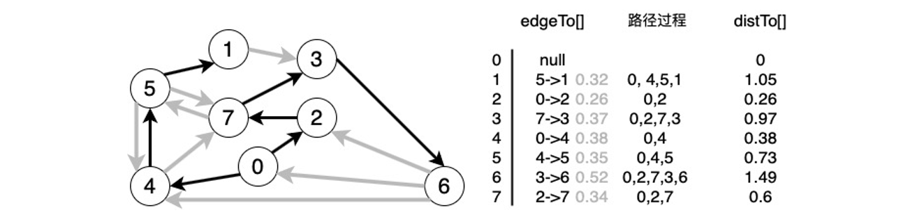
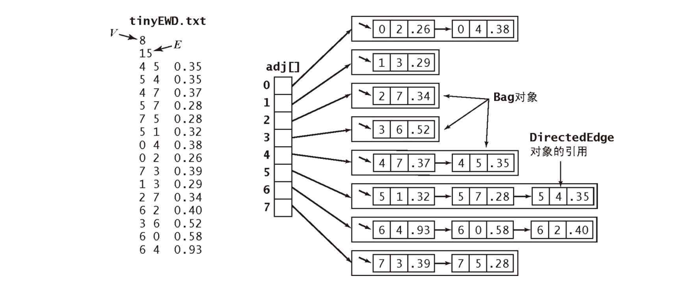
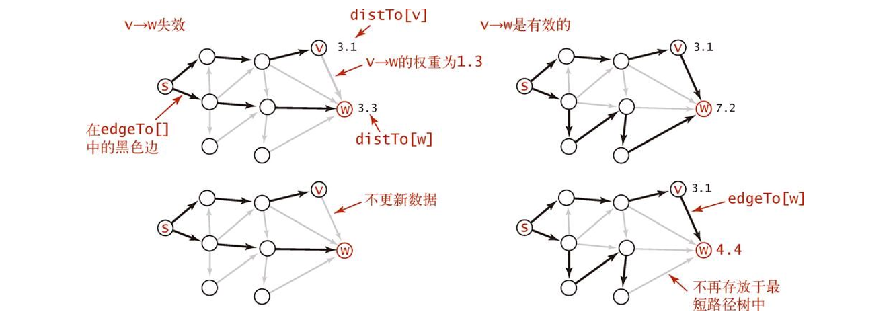
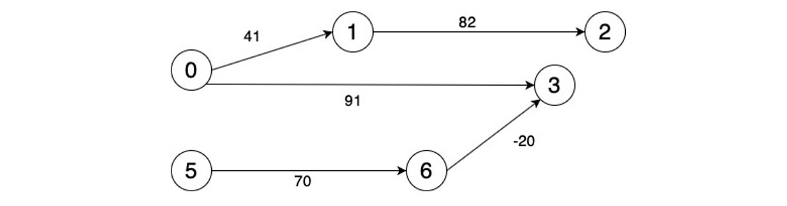

[TOC]

## 最短路径

### 1 概述

#### 基础

在一幅**加权有向图**中,从顶点 s 到顶点 t 的**最短路径**是所有从 s 到 t 的路径中的**权重最小**者。


#### 最短路径树SPT

重点是**单点最短路径**，**最短路径树(SPT)**包含了顶点 s 到所有可达的顶点的最短路径。

给定一幅加权有向图和一个起点 s，以 s 为起点的一颗最短路径树是图的一幅子图。

从一个顶点 s 到其他所有顶点的最短路径的集合其实本质是**一颗树**。因为如果最短路径中存在环的话，那么从 s 到环中任意一个顶点的距离就不是唯一的，也就不存在最短的定义了。

因此我们**本质是要得到一颗最短路径树**。

1）最短路径的边。使用一个父链接数组 edgeTo[]。edgeTo[v] 的值为树中连接v和它的父节点的边（也是从s到v的最短路径上的最后一条边）

2）到达起点的距离。用一个distTo[] 数组来存从距离。distTo[v] 表示从 s 到 v 的最短路径的长度。



 上图表示的是从 0 出发的**最短路径树**。


#### 加权有向图数据结构

首先介绍**有向边**以及**加权有向图**这两种关键的数据结构，这里的两种数据结构和《算法4》最小生成树之 Prim 与 Kruskal 算法中的边以及加权无向图的数据结构**很类似**，大致看一下就行。
下面是**有向边**的数据结构：

```java
// 加权有向图有向边
public class DirectedEdge {
    // 边的起点
    private final int v;
    // 边的终点
    private final int w;
    // 边的权重
    private final double weight;

    public DirectedEdge(int v, int w, double weight){
        this.v = v;
        this.w = w;
        this.weight = weight;
    }

    public double weight(){
        return weight;
    }

    public  int from (){
        return v;
    }
    public int to(){
        return w;
    }


    public String toString(){
        return String.format("%d->%d  %.2f", v,w,weight);
    }

}
```

下面是**加权有向图**的数据结构：

```java
public class EdgeWeightedDigraph {
    // 顶点总数
    private final int V;
    // 边的总数
    private int E;
    // 邻接表
    private Bag<DirectedEdge>[] adj;

    public EdgeWeightedDigraph(int V){
        this.V = V;
        this.E = 0;
        adj = (Bag<DirectedEdge>[]) new Bag[V];
        for(int v = 0; v<V;v++){
            adj[v] = new Bag<DirectedEdge>();
        }
    }

    public EdgeWeightedDigraph(In in){
        this(in.readInt());
        int E = in.readInt();
        for(int i=0;i<E;i++){
            int v = in.readInt();
            int w = in.readInt();
            Double weight = in.readDouble();
            DirectedEdge e= new DirectedEdge(v, w, weight);
            addEdge(e);
        }
    }

    public int V(){return V;}
    public int E(){return E;}

    public void addEdge(DirectedEdge e){
        int v = e.from();
        // 有向图加一次即可
        adj[v].add(e);
        E++;
    }
    public Iterable<DirectedEdge> adj(int v){
        return adj[v];
    }

    public Iterable<DirectedEdge> edges(){
        Bag<DirectedEdge> bag = new Bag<DirectedEdge>();
        for(int v=0;v<V;v++)
            for (DirectedEdge e:adj[v])
                 bag.add(e);
        return bag;
    }
}
```

每条边在邻接表中只会出现一次。

邻接表如下图所示。




### 2 最短路径基本原理

对于一幅加权有向图，从源点开始到所有顶点的所有最短路径构成了一个最短路径树。我们在算法中维护了两个关键的数据结构, **edgeTo[]** 代表在最短路径树中指向每个顶点的边， **distTo[]** 代表从源到某个顶点的“距离”也就是所经过的最短路径边的**权重之和**。

下面介绍一种关键的技术：“**松弛**”，可以参考下图：


**松弛**就相当于放松一条边时将橡皮筋转移到一条更短的路径上，从而缓解了橡皮筋的压力。

所谓**松弛**就是对于一条边 **v->w**，此时 w 到源点的最短路径为 distTo[w]，这个值不管是不是真的，目前来看是最优值，然后现在如果 **distTo[v] + e.weight() > distTo[w]** 那么就证明 v->w 这条边一定不可能在最短路径树里面，那么这条边就**可以不用管**了。等于的话我们没必要管它。
如果相反，**dist[w] > distTo[v] + e.weoght()**, 那么就证明我们**找到了从源点到达 w 顶点的一条更短路径**，那么就可以**更新** edgeTo[w] 和 distTo[w]，以上两种情况分别对应于上图左右两种情况。

**最短路径的最优性条件**：当且仅当对于从 v 到 w 的任意一条边 e，这些值**都满足 **

```java
distTo[w] <= distTo[v]+e.weight()
```

时，他们是最短路径。具体的证明在此处略过，证明它并不难。


### 3 Dijkstra算法

其实 Dijkstra 算法和 Prim 算法很相似，Prim 算法是在横切边中找到权重最小的边加入最小生成树，Dijkstra 算法也可以说是在横切边中找权重最小的边。两个算法也都维护了一个**索引优先队列**，不过一个是存储边的权值，一个存储从源点到该点的路径长度。 所以两个算法完全可以类比，同时加深理解。
对于 **Dijkstra 索引优先队列** pq 代表**在最小路径树之外的还需要进行放松**（这里用的为 relax() 函数）**的边**，每次从 pq 中删除路径长度最小的顶点，其实**删除就意味着顶点加入最小路径树**，因为它**不参与**之后的比较了。然后将该顶点相连的所有边进行放松，这一步可能会改变某些已经放松过的顶点的路径值，但是这没有关系，首先对于这样的顶点和它相邻的顶点，以前的放松让它满足 

```java
distTo[w] <= distTo[v] + e.weight()
```

这一次的放松只会让 distTo[w] 更小，那么不等式还是满足的。就这样不断 delMin()，**当索引优先队列为空的时候，所有的边都松弛过了，同时是所有顶点都在最小路径树中了**。
下面是代码实现：

```java
// 最短路径的Dijkstra算法
public class DijkstraSP {
    private DirectedEdge[] edgeTo;
    private double[] distTo;
    private IndexMinPQ<Double> pq;

    private DijkstraSP(EdgeWeightedDigraph G, int s){
        edgeTo = new DirectedEdge[G.V()];
        distTo = new double[G.V()];
        pq = new IndexMinPQ<Double>(G.V());

        for (int v=0;v<G.V();v++){
            // 不可达即无穷大
            distTo[v] = Double.POSITIVE_INFINITY;
        }
        distTo[s] = 0.0;

        pq.insert(s, 0.0);
        while(!pq.isEmpty())
            relax(G, pq.delMin());

    }

    private void relax(EdgeWeightedDigraph G, int v){
        for (DirectedEdge e:G.adj(v)){
            int w = e.to();
            if (distTo[w]>distTo[v]+e.weight()){
                distTo[w] = distTo[v] + e.weight();
                edgeTo[w] = e;
                if (pq.contains(w)) pq.change(w, distTo[w]);
                else                pq.insert(w, distTo[w]);
            }
        }
    }

    public double distTo(int v){
        return distTo[v];
    }
    public boolean hasPathTo(int v){
        return distTo[v]<Double.POSITIVE_INFINITY;
    }

    public Iterable<DirectedEdge> pathTo(int v){
        if (!hasPathTo(v)) return null;
        Stack<DirectedEdge> path =new  Stack<DirectedEdge>();
        for (DirectedEdge edge = edgeTo[v];edge !=null;edge  = edgeTo[edge.from()]) {
            path.push(edge);
        }
            
        return path;

    }

}
```

可以看到代码都和 Prim 很像，时间成本也是相同的都是 ElogV。

Prim 算法和 Dijkstra 算法都会用添加边的方式构造一棵树：**Prim 算法每次添加的都是==离树最近的非树顶点==，Dijkstra 算法每次添加的都是==离起点最近的非树顶点==。**

**Dijkstra 算法能够解决==边权重非负==的==加权有向图==的==单起点最短路径==问题。**

但是 Dijkstra 算法**默认边的权重非负**，对于**有负权重**的边，他是**不能**给出合理的最短路径的，这时候就要用上另一个算法 Bellman-Ford 算法。


### 4 ==无环加权有向图==中的最短路径算法

#### 最短路径

如果加权有向图是**无环**的，那么可以使用一种比 Dijkstra 算法更快的算法来找最短路径。

无环加权有向图的算法的核心在于**依照有向图的拓扑排序来松弛每条边**。而拓扑排序又保证了每条边只会被放松一次，因此这是一种最优的最短路径搜索方法。

算法思想：

**首先将 distTo[s] 初始化为 0，其他的 distTo[] 元素初始化为无穷大，然后一个一个按照==拓扑顺序==放松所有顶点。**

**按照==拓扑顺序放松顶点==，就能在与 E+V 成正比的时间内解决无环加权有向图的单点最短路径问题。**

无环加权有向图的最短路径算法如下。

```java
// 无环加权有向图的最短路径算法
public class AcyclicSP{
    private double[] distTo;
    private DirectedEdge[] edgeTo;

    public AcyclicSP(EdgeWeightedDigraph G, int s){
        distTo = new double[G.V()];
        edgeTo = new DirectedEdge[G.V()];
        for(int v =0 ;v<G.V(); v++)
            distTo[v] = Double.POSITIVE_INFINITY;

        distTo[s] = 0.0;
        // 实现拓扑排序
        Topological top = new Topological(G); 
        for(int v:top.order())
            relax(G, v);
    }

    // 放松顶点
    public void relax(EdgeWeightedDigraph G, int v){
        for(DirectedEdge e: G.adj(v))
        {
            int w = e.to();
            if(distTo[w] > distTo[v] + e.weight())
            {
                distTo[w] = distTo[v] + e.weight();
                edgeTo[w] = e;
            }
        }
    }
    
    public double hasPathTo(int v)
        
    public boolean distTo(int v)
        
    public Iterable<DirecedEdge> pathTo(int v)   
}
```

在**已知加权图是无环**的情况下，这是找出最短路径的**最好的方法**。


#### 最长路径

**任务调度问题**的**关键路径**方法可将问题规约为寻找无环加权有向图的**最长路径问题**。

相对最后期限限制下的并行任务调度问题是一个加权有向图中的**最短路径问题**（可能存在环和负权重边）。


### 5 Bellman-Ford算法

#### 理解负权重

负权重的出现其实不只体现在数学上，在实际应用中其实非常实用。以任务调度为例。



以上图为例。边的权重指的是任务需要的时间。例如任务 0 需要 41 个时间单位才能完成，任务 0 完成后才能开始任务 1，任务 1 需要 82 个时间单位，然后才能开始任务 2...

而 6 指向 3 的路径权重为 -20，这是指 6 号任务需要在 3 号任务开始后的 20 个时间单位内开始，或者说 3 号任务不能早于 6 号任务的 20 个时间单位。


#### Bellman-Ford算法

Bellman-Ford算法：**在任意含有 V 个顶点的加权有向图中给定起点 s，从 s 无法到达任何负权重环，然后将 distTo[s] 初始化为 0，其他初始化为无穷大，以==任意顺序==放松所有边，重复 V 轮**。

这种算法**比较慢**，所需**时间与 EV** 成正比，**空间与 V** 成正比，实际中很浪费。因为每一轮算法都会**放松** E 条边，重复 V 轮。

还有一个重要的问题是如果存在负权重环（就是环的所有边的权重加起来为负），那么经过该环的所有顶点的最短路径都是无意义的，所以算法还需要能够**检测负权重环**，不过这里的算法和检测无环图部分的思想是一样的，这里就不再赘述。
代码如下

```java
public class BellmanFordSP {
    private double[] distTo;
    private DirectedEdge[] edgeTo;
    private boolean[] onQ;
    private Queue<Integer> queue;
    private int cost;
    private Iterable<DirectedEdge> cycle;

    public BellmanFordSP(EdgeWeightedDigraph G, int s){
        distTo = new double[G.V()];
        edgeTo = new DirectedEdge[G.V()];
        onQ = new boolean[G.V()];
        queue = new Queue<Integer>();
        for (int v=0;v<G.V();v++)
            distTo[v] = Double.POSITIVE_INFINITY;
        distTo[s] = 0.0;

        queue.enqueue(s);
        onQ[s] = true;
        while(!queue.isEmpty() && !hasNegativeCycle()){
            int v = queue.dequeue();
            onQ [v] =false;
            relax(G, v);
        }

    }

    private void relax(EdgeWeightedDigraph G, int v){
        for (DirectedEdge e:G.adj(v)){
            int w = e.to();
            if(distTo[w] > distTo[v]+e.weight()){
                distTo[w] = distTo[v]+e.weight();
                edgeTo[w] = e;
                if(!onQ[w]){
                    queue.enqueue(w);
                    onQ[w] = true;
                }
            }
            if(cost++ % G.V() ==0){
                findNegativeCycle();
                if (hasNegativeCycle()) return ;
            }
        }
    }

    public double distTo(int v){
        return distTo[v];
    }
    public boolean hasPathTo(int v){
        return distTo[v]<Double.POSITIVE_INFINITY;
    }

    public Iterable<DirectedEdge> pathTo(int v){
        if (!hasPathTo(v)) return null;
        Stack<DirectedEdge> path =new  Stack<DirectedEdge>();
        for (DirectedEdge edge = edgeTo[v];edge !=null;edge  =edgeTo[edge.from()])
            path.push(edge);
        return path;

    }

    private  void findNegativeCycle(){
        int V = edgeTo.length;
        EdgeWeightedDigraph spt=new EdgeWeightedDigraph(V);
        for (int v = 0;v<V; v++)
            if (edgeTo[v] !=null)
                spt.addEdge(edgeTo[v]);
        EdgeWeightedDirectedCycle finderCycle = new EdgeWeightedDirectedCycle(spt);
        cycle =finderCycle.cycle(); 
    }

    public boolean hasNegativeCycle(){
        return cycle != null;
    }

    public Iterable<DirectedEdge> nagativeCycle(){
        return cycle;
    }

}
```

上面的代码是**基于队列**的，从其中关键的循环部分

```java
while(!queue.isEmpty() && !hasNegativeCycle())
```

 可以看出，首先我们要**一直运行到队列为空**，队列什么时候会有顶点入队？当有顶点的 distTo[] 值被改变的时候，所以当算法运行结束的时候，**所有顶点的路径长都已经是最小值**，不能再改了。另一种情况是，我们的算法运行了 **V 轮**之后，如果**有负权重环**的话，**队列一定是非空**的，所以我们**每隔 V 轮检测一下是不是遇到了负权重环，如果遇到了就退出**。

可以看出 Bellman-Ford 其实和 Dijstra 也有一些相似之处。

下面的代码就是在加权有向图中检测环的代码

```java
public class EdgeWeightedDirectedCycle {
    private boolean[] marked;
    private DirectedEdge[] edgeTo;
    private boolean[] onStack;
    private Stack<DirectedEdge> cycle;

    public EdgeWeightedDirectedCycle(EdgeWeightedDigraph G){
        marked = new boolean[G.V()];
        onStack = new boolean[G.V()];
        edgeTo = new DirectedEdge[G.V()];
        for (int v = 0;v<G.V();v++)
            if (!marked[v]) dfs(G, v);
    }

    private void dfs(EdgeWeightedDigraph G, int v){
        onStack[v] = true;
        marked[v] = true;
        for (DirectedEdge e:G.adj(v)){
            int w = e.to();
            if(cycle !=null) return ;

            else if(!marked[w]){
                edgeTo[w] = e;
                dfs(G, w);
            }
            else if(onStack[w]){
                cycle = new Stack<DirectedEdge>();
                DirectedEdge f = e;
                while(f.from() !=w){
                    cycle.push(f);
                    f = edgeTo[f.from()];
                }
                cycle.push(f);
                return ;
            }
        }
        onStack[v] =false;
    }

    public boolean hasCycle(){
        return cycle!= null;
    }

    public Iterable<DirectedEdge> cycle(){
        return cycle;
    }

}

```

综上，**基于队列**的 Bellman-Ford 算法要比原始版快得多基本是  O(V+E) 的，但是最坏情况也有O(VE)，可是它的适用范围要大得多，**可以存在负权重环，还可以检测出负权重环**。

**套汇问题**等价于加权有向图中的负权重环的检测问题。


### 6 算法总结

|           算法            |            局限            | 一般情况 | 最坏情况 | 所需空间 |             优势             |
| :-----------------------: | :------------------------: | :------: | :------: | :------: | :--------------------------: |
| Dijkstra 算法（即时版本） |      边的权重必须为正      |  ElogV   |  ElogV   |    V     |    最坏情况下性能依然可以    |
|         拓扑排序          | **只适用于无环加权有向图** |  E + V   |  E + V   |    V     | 是**无环图**中的**最优**算法 |
|     Bellman-Ford 算法     |      不能存在负权重环      |  E + V   |    EV    |    V     |         适用领域广泛         |


**参考资料**

- https://blog.csdn.net/leonliu1995/article/details/78701997


