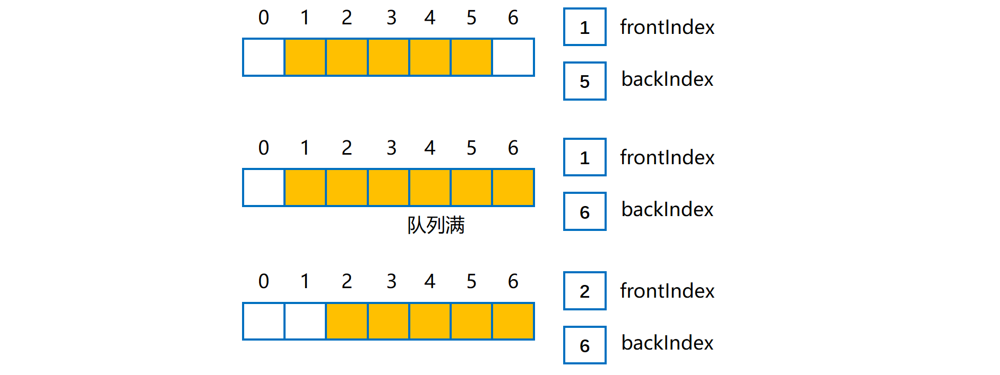
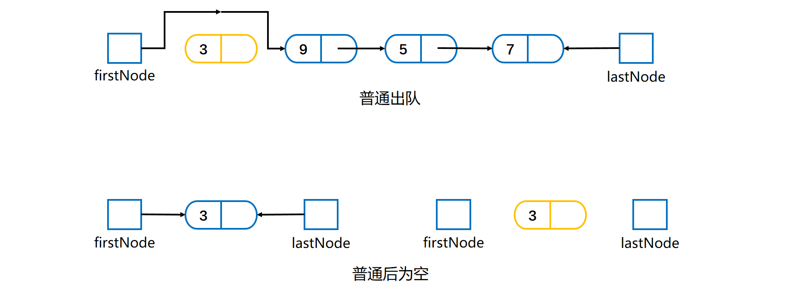

[TOC]

## 队列

### 1 概述

- 先进先出 **FIFO** 结构。
- 添加元素在**后端**，出队列在**前端**。
- 基本操作：**入队**（enqueue）；**出队**（dequeue）获取队头且删除；**取值**（getFront）获取队头但是不删除。
- 队列为空时出队或者取值可能抛出自定义异常 EmptyQueueException。


### 2 队列抽象接口

```java
/**
 * 队列抽象接口
 * @param <T> 数据类型
 * @author cz
 */
public interface QueueInterface<T> {
    /**
     * 入队列
     * @param newEntry 新元素
     */
    void enqueue(T newEntry);

    /**
     * 出队列 删除队头
     * @return 队头元素
     * @throws EmptyQueueException 队列空异常
     */
    T dequeue();

    /**
     * 取值 不删除队头
     * @return 队头元素
     * @throws EmptyQueueException 队列空异常
     */
    T getFront();

    /**
     * 是否为空
     */
    boolean isEmpty();

    /**
     * 清空队列
     */
    void clear();
}
```

自定义异常 EmptyQueueException.

```java
/**
 * 队列空异常
 * @author cz 
 */
public class EmptyQueueException extends Exception{
    
    public EmptyQueueException(){
        this("The queue is empty.");
    }
    
    public EmptyQueueException(String message) {
        super(message);
    }
}
```


### 3 队列的数组实现

#### 结构分析

使用**数组**来存放队列，维护一个 **frontIndex** 和 **backIndex** 来指示**队头队尾**。

使用==**循环数组**==。使用**一般的循环数组**实现队列的话，~~放队列空或者队列满的时候，都满足 frontIndex 等于 backIndex，这是有问题的。~~

因此使用==**带一个不用位置的循环数组**==来实现队列。即该数组中始终有一个位置**空缺**， 可以将其放在**队尾**。此时判断队列的**空与满有不同的条件**。

所以存储对象的数组应比设定的大小**多 1**。

下图是队列满与空流程图。





队列**满**时（公式源自《数据结构与抽象 Java 版》）

```java
frontIndex == (backIndex + 2) % queue.length
6 == (4 + 2)% 7    
```

队列**空**时

```java
frontIndex == (backIndex + 1) % queue.length
```

**入队**即在**队列后端**添加元素，数组是**循环**的，需要使用 **==%==** 来确定索引位置。

**出队**过程即把 frontIndex 指向下一个元素。

**数组扩容**

容量不足实现**扩容**时，与之前的数组扩容有所差距如下图。将原来的循环队列**全都复制到新队列的开始**处。


#### 代码实现

```java
/**
 * 数组实现队列
 * @author cz
 */
public class ArrayQueue<T> implements QueueInterface<T>{

    /**
     * 存放元素的队列
     */
    private T[] queue;

    /**
     * 队列索引
     */
    private int frontIndex;
    private int backIndex;

    private boolean initialized = false;

    private static final int DEFAULT_CAPACITY = 50;
    private static final int MAX_CAPACITY = 10000;

    public ArrayQueue() {
        this(DEFAULT_CAPACITY);
    }

    public ArrayQueue(int initialCapacity) {
        checkCapacity(initialCapacity);

        @SuppressWarnings("unchecked")
        T[] tempQueue = (T[]) new Object[initialCapacity + 1];
        queue = tempQueue;
        frontIndex = 0;
        backIndex = initialCapacity;
        initialized = true;
    }

    /**
     * 入队
     * @param newEntry 新元素
     */
    @Override
    public void enqueue(T newEntry) {
        checkInitialization();
        ensureCapacity();
        backIndex = (backIndex + 1) % queue.length;
        queue[backIndex] = newEntry;
    }

    /**
     * 出队 删除元素
     * @return 队首元素
     * @throws EmptyQueueException 队列空异常
     */
    @Override
    public T dequeue() throws EmptyQueueException {
        checkInitialization();
        if (isEmpty()) {
            throw new EmptyQueueException();
        } else {
            T front = queue[frontIndex];
            queue[frontIndex] = null;
            frontIndex = (frontIndex + 1) % queue.length;
            return front;
        }
    }

    /**
     * 获取队首元素 不删除
     * @return 队首
     * @throws EmptyQueueException 队列空异常
     */
    @Override
    public T getFront() throws EmptyQueueException {
        checkInitialization();
        if (isEmpty()) {
            throw new EmptyQueueException();
        } else {
            return queue[frontIndex];
        }
    }

    /**
     * 是否为空
     */
    @Override
    public boolean isEmpty() {
        return frontIndex == (backIndex + 1) % queue.length;
    }

    /**
     * 清空队列
     */
    @Override
    public void clear() {
        while (!isEmpty()) {
            dequeue();
        }
    }
    
    /**
     * 保证容量足够进行扩容
     */
    private void ensureCapacity() {
        if (frontIndex == ((backIndex + 2) % queue.length)) {
            T[] oldQueue = queue;
            int oldSize = oldQueue.length;
            int newSize = oldSize * 2;
            checkCapacity(newSize);
            @SuppressWarnings("unchecked")
            T[] tempQueue = (T[]) new Object[newSize];
            queue = tempQueue;
            for (int index = 0; index < oldSize - 1; index++){
                queue[index] = oldQueue[frontIndex];
                frontIndex = (frontIndex + 1) % oldSize;
            }
            frontIndex = 0;
            backIndex = oldSize - 2;
        }
    }
    
    /**
     * 检查新的扩容是否超过最大容量 防止内存溢出
     * @param capacity 新的容量
     */
    private void checkCapacity(int capacity){
        if (capacity > MAX_CAPACITY) {
            throw new IllegalStateException("超过最大的创建容量");
        }
    }

    /**
     * 为了初始化安全进行检查没有初始化就抛出异常
     */
    private void checkInitialization(){
        if (!initialized) {
            throw new SecurityException("尚未初始化");
        }
    }
}
```


### 4 队列的链式实现

#### 结构分析

队列的两端在**链的两端**。队列的**前端**放在链的**开头**，队列的**后端**放在链的**链尾**。

**firstNode** 指向队列前端，**lastNode** 指向队列后端，如下图所示。当队列为**空**时两个**都为 null**。


##### 入队

**入队**是添加新结点到后端，需要判断链是否为**空**！如果是空链，则添加元素之后如下，即 firstNode 和 lastNode 均指向新结点。


如果是一般结点**入队**，则链中最后一个结点和 lastNode 指向新结点，如下。

- **最后一个结点**指向新结点；
- **lastNode** 指向新结点。


##### 出队

如果有多个结点，**出队**将 firstNode 指向链的第二个结点。如果队列中**仅有一个节点**，则出队之后为空。如下所示。




#### 代码实现

```java
/**
 * 队列的链式实现
 * @author cz 
 */
public class LinkedQueue<T> implements QueueInterface<T> {
    
    // 头结点
    private Node firstNode;
    // 尾结点
    private Node lastNode;
    
    
    public LinkedQueue() {
        firstNode = null;
        lastNode = null;
    }

    /**
     * 入队
     * @param newEntry 新元素
     */
    @Override
    public void enqueue(T newEntry) {
        Node newNode = new Node(newEntry, null);
        if (isEmpty()) {
            firstNode = newNode;
        } else {
            lastNode.setNextNode(newNode);
        }
        lastNode = newNode;
    }


    /**
     * 出队列
     * @return 队列头元素 要删除
     * @throws EmptyQueueException 空队列异常
     */
    @Override
    public T dequeue() throws EmptyQueueException {
        T front = getFront();
        if (firstNode != null) {
            firstNode.setData(null);
            firstNode = firstNode.getNextNode();
        } else {
            lastNode = null;
        }
        return front;
    }

    /**
     * 获取队列头元素
     * @return 队列头元素
     * @throws EmptyQueueException 队列空异常
     */
    @Override
    public T getFront() throws EmptyQueueException {
        if (isEmpty()) {
            throw new EmptyQueueException();
        } else {
            return firstNode.getData();
        }
    }

    @Override
    public boolean isEmpty() {
        return (firstNode == null) && (lastNode == null);
    }

    @Override
    public void clear() {
        firstNode = null;
        lastNode = null;
    }

	// 内部结点类
    private class Node {
        private T data;
        private Node nextNode;

        public Node(T data, Node nextNode) {
            this.data = data;
            this.nextNode = nextNode;
        }

        public T getData() {
            return data;
        }

        public void setData(T data) {
            this.data = data;
        }

        public Node getNextNode() {
            return nextNode;
        }

        public void setNextNode(Node nextNode) {
            this.nextNode = nextNode;
        }
    }
}
```


### 5 队列的循环链式实现

#### 结构分析

循环链中，最后一个结点指向第一个结点。每个结点的 **nextNode** 域**不会为 null**。如下图有指向最后结点的外部引用的循环链。


只需要**一个 lastNode** 数据域即可，它属于**链尾**，使用 

```java
lastNode.getNextNode();
```

 就可以获取到**链头**。


#### 两部分组成的循环链

循环链由**两部分**组成，一个是 queueNode 指向的**数据链**。另一个是 freeNode 指向的**未用结点链**。当有元素**入队**时，如果 freeNode 链仅有一个结点，就会**分配新的节点**来存放新元素；**出队**时，原来的结点**不回收**，放到freeNode 链之下。


当循环链中只有一个结点时，这个结点必须指向自己。当

```java
queueNode == freeNode.getNextNode()
```

时，必须分配不用的结点。


### 6 双端队列（deque）

- 能在队列的**前端和后端**进行添加、删除与获取操作。
- 行为上类似于**双端栈**。

#### 抽象接口

```java
/**
 * 双端队列抽象接口
 * @param <T> 数据类型
 * @author cz 
 */
public interface DequeInterface<T> {
    /**
     * 在前端和后端添加元素 
     * @param newEntry 元素
     */
    void addToFront(T newEntry);
    void addToBack(T newEntry);

    /**
     * 从前端后端删除元素
     * @return 端头元素
     * @throws  EmptyQueueException 自定义空异常
     */
    T removeFront();
    T removeBack();

    /**
     * 从前端后端获取元素但不删除
     * @return 元素
     * @throws  EmptyQueueException 自定义空异常
     */
    T getFront();
    T getBack();

    /**
     * 判空
     */
    boolean isEmpty();

    /**
     * 清空双端队列
     */
    void clear();
}
```


### 7 优先队列（Priority Queue）

- 根据**优先级**组织队列中的对象。
- 对象优先级通过 **compareTo()** 方法确定。
- Java中有对应的类库：**PriorityQueue** 类。
- 可以使用数组、链表或者向量来实现优先队列。
- 需要按项的优先级对项进行排序。

详细见优先队列部分。重点是**堆**实现。


### 8 Java队列实现

#### Java类库：Queue接口

```java
// 将元素插入队列
boolean add(E e);

// 将元素插入队列，与add相比，在容量受限时应该使用这个
boolean offer(E e);

// 将队首的元素删除，队列为空则抛出异常
E remove();

// 将队首的元素删除，队列为空则返回null
E poll();

// 获取队首元素，但不移除，队列为空则抛出异常
E element();

// 获取队首元素，但不移除，队列为空则返回null
E peek();

void clear();

int size();
```

入队、出队和取值两个一组，一个**抛出异常，一个返回 null**。


#### Java类库：Deque接口

继承于 Queue 接口。两种方法**成对**，出现问题时一个出现**异常**一个返回 **NULL**。

| 操作类型 | 第一个元素（Deque实例的开头）  | 最后一个元素（Deque实例的结尾） |
| :------: | :----------------------------: | :-----------------------------: |
|   插入   | `addFirst(e)`  `offerFirst(e)` |  `addLast(e)`  `offerLast(e)`   |
|   移除   | `removeFirst()`  `pollFirst()` |  `removeLast()`  `pollLast()`   |
|   检索   |  `getFirst()`  `peekFirst()`   |    `getLast()`  `peekLast()`    |


#### Java类库：ArrayDeque类

实现了 **Deque 接口**。

因为 Deque 接口声明了对应于**双端队列、队列和栈**的方法，因此可以用 ArrayDeque 类来创建这些数据集合的实例。

==**不要**使用 Stack 类来创建栈，使用这个类==。

可以使用双向链实现双端队列。


