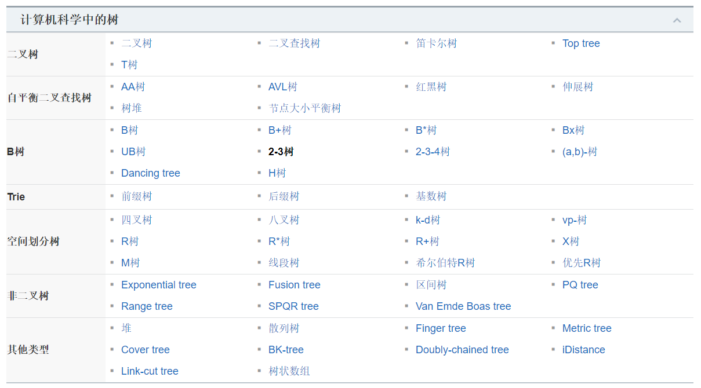

[TOC]

## 树

### 概述

- 计算机科学中的树

### 基本定义

树 (Tree) 是 n (n ≥ 0) 个结点的有限集 T，并且当 n＞0 时满足下列条件：
   （1）有且仅有一个特定的称为**根** (Root) 的结点；
   （2）当 n＞1时，其余结点可以划分为 m(m＞0) 个互不相交的有限集 T1、T2 、…、Tm，每个集 Ti (1≤ i ≤ m)均为树，且称为树 T 的**子树 ** (SubTree)。

特别地，不含任何结点(即 n＝0)的树，称为**空树**。

- **结点：**存储数据元素和指向子树的链接，由数据元素和构造数据元素之间关系的引用组成。
- **孩子结点：**树中一个结点的子树的根结点称为这个结点的孩子结点，如图中的 A 的孩子结点有B、C、D。
- **父结点：**树中某个结点有孩子结点(即该结点的度不为 0)，该结点称为它孩子结点的父结点，也叫前驱结点。父结点和孩子结点是相互的，如图中，A 的孩子结点是 B、C、D，则 B、C、D 的父结点是 A。
- **兄弟结点：**具有相同双亲结点(即同一个前驱)的结点称为兄弟结点，如图中 B、B、D 为兄弟结点。
- **结点的度：**结点所有**子树的个数**称为该结点的度，如图中 A 的度为 3，B 的度为 2。
- **树的度：**树中所有结点的度的最大值称为树的度，如图的度为 3.
- **叶子结点：**度为 0 的结点称为叶子结点。如图中的 K、L、F、G、M、I、J。
- **分支结点：**度不为 0 的结点称为分支结点。如图中的 A、B、C、D、E、H。
- **结点的层次：**从根结点到树中某结点所经路径的分支数称为该结点的层次。根结点的层次一般为 1(也可以自己定义为 0)，这样，其它结点的层次是其双亲结点的层次加 1。
- **树的深度：**树中所有结点的层次的最大值称为该树的**深度**(也就是最下面那个结点的层次)。
- **有序树和无序树：**树中任意一个结点的各子树按从左到右是有序的，称为有序树，否则称为无序树。
- **数据元素：**具有相同特性的数据元素的集合。
- **结构关系：**树中数据元素间的结构关系由树的定义确定。

- **森林**：由 m 棵不相交的树组成的集合，叫做森林。

树的种类有很多，我们接触到的树有二叉树、平衡二叉树、二叉查找树、B 树、B+ 树、哈夫曼树、B* 树、红黑树和 trie 树等。

