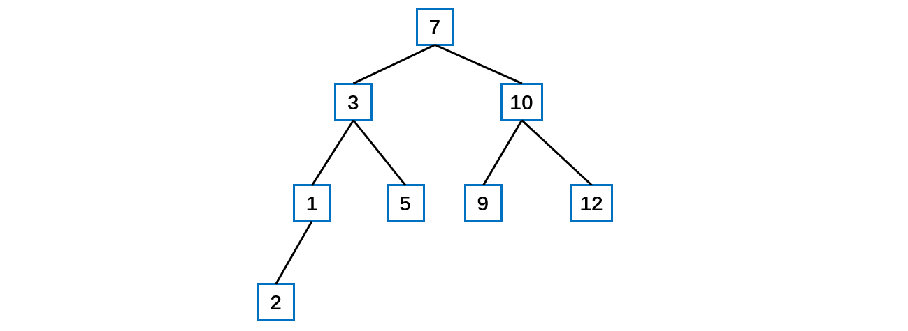
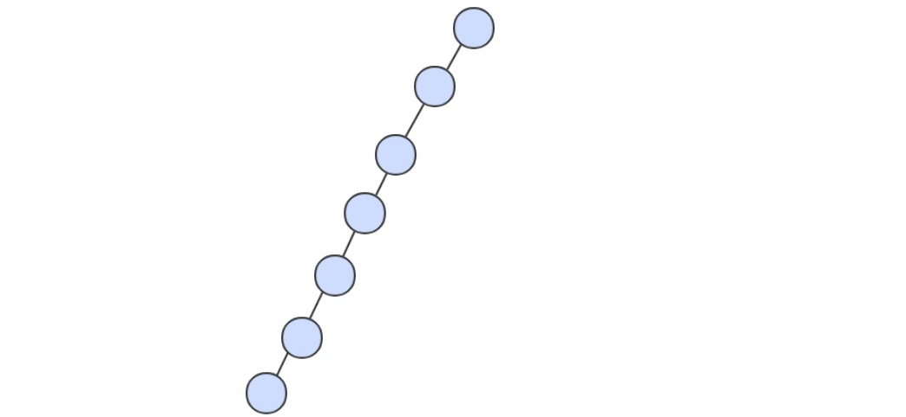

[TOC]

## 排序二叉树BST树

### 1 结构分析

排序二叉树也可以称为**二叉查找树**。

对于二叉排序树的任何一个**非叶子节点**，要求**左子节点的值比当前节点的值小，右子节点的值比当前节点的值大**。即**每个节点的值都==大于等于==其==左子树==中的==所有==节点的值而==小于等于右子树==的==所有==节点的值。**

**特别说明**：如果有相同的值，可以将该节点放在左子节点或右子节点。

**二叉树**  是一个空链接，或者是一个有左右两个链接的节点，每个链接都指向一颗子二叉树。

BST 有一个重要性质，就是它的==**中序遍历**结果**递增**==排序。如下图所示。

对于下面的排序二叉树。




### 2 代码实现

#### 结点类

```java
/**
 * 结点类
 * @param <AnyType> 泛型类型
 */
private static class BinaryNode<AnyType> {
    BinaryNode(AnyType theElement) {
        this(theElement, null, null );
    }

    BinaryNode( AnyType theElement, BinaryNode<AnyType> lt, BinaryNode<AnyType> rt ) {
        element  = theElement;
        leftChild = lt;
        rightChild = rt;
    }

    AnyType element;            // The data in the node
    BinaryNode<AnyType> leftChild;   // Left child
    BinaryNode<AnyType> rightChild;  // Right child
}
```


#### 是否为空

根结点为空则树为空。

```java
public boolean isEmpty() {
    return root == null;
}
```


#### 是否包含元素

从根结点开始，如果当前元素比结点元素**小就往左**递归，如果比结点元素**大就往右**递归，直到为 **null** 或者找到为止。

```java
/**
 * 判断是否包含某元素
 */
private boolean contains(AnyType x, BinaryNode<AnyType> t) {
    if( t == null ) {
        // 未找到
        return false;
    }
    int compareResult = x.compareTo( t.element );
    if( compareResult < 0 ) {
        // 小往左递归
        return contains( x, t.leftChild);
    } else if( compareResult > 0 ) {
        // 大往右递归
        return contains( x, t.rightChild);
    } else {
        // 找到
        return true;    
    }
}
```


#### 寻找最大最小值

从根开始并且只要有**左子结点**就**递归往左**进行查找，**终止点**就是**最小**的元素。如果往**右**递归就是寻找**最大**值。

可以有**递归或者迭代**方式实现。下列的代码使用递归查找最小值，使用迭代寻找最大值。

```java
/**
 * Find the smallest item in the tree.
 * @return smallest item or null if empty.
 */
public AnyType findMin() {
    if(isEmpty()) {
        throw new RuntimeException( );
    }
    return findMin(root).element;
}

/**
 * 递归方式找最小值
 */
private BinaryNode<AnyType> findMin(BinaryNode<AnyType> node) {
    // 递归的结束条件是空树
    if( node == null ) {
        return null;
    } else if (node.leftChild == null) {
        return node;
    }
    // 迭代寻找最小值
    return findMin(node.leftChild);
}

/**
 * 迭代方式寻找最大值
 */
private BinaryNode<AnyType> findMax(BinaryNode<AnyType> t) {
    if( t != null ) {
        while( t.right != null ) {
            t = t.right;
        }
    }
    return t;
}
```


#### 插入结点

```java
/**
 * Insert into the tree; duplicates are ignored.
 * @param x the item to insert.
 */
public void insert(AnyType x) {
    // 传入根结点
    root = insert(x, root);
}

/**
 * Internal method to insert into a subtree.
 * @param x the item to insert.
 * @param t the node that roots the subtree.
 * @return the new root of the subtree.
 */
private BinaryNode<AnyType> insert(AnyType x, BinaryNode<AnyType> t) {
    if( t == null ) {
        return new BinaryNode<>( x, null, null );
    }
    
    int compareResult = x.compareTo(t.element);
        
    if(compareResult < 0) {
        t.leftChild = insert(x, t.leftChild);
    } else if(compareResult > 0) {
        t.rightChild = insert(x, t.rightChild);
    } else {
        ;  // Duplicate; do nothing
    }
    return t;
}
```


#### 删除结点


三种情况：

1、**删除叶子结点**：如 2，5，9，12。首先找到需要删除的结点 targetNode，确定目标 targetNode 的父结点 parentNode（还需要考虑是否存在 parentNode），确定 targetNode 是 parentNode 的左子结点还是右子结点。根据前面的情况来对应删除。

2、删除**只有一棵子树**的结点：如 1。首先找到需要删除的结点 targetNode，确定目标 targetNode 的父结点 parentNode（还需要考虑是否存在 parentNode）。确定 targetNode 是左子结点还是右子结点。再确定 targetNode 是 parentNode 的左子结点还是右子结点。此处就有四种组合，对应处理即可。

3、删除**有两棵子树**的结点，如 3，7，10。首先找到需要删除的结点 targetNode，确定目标 targetNode 的父结点 parentNode（还需要考虑是否存在 parentNode）。从 targetNode 的==**右子树**找到**最小**==的结点，将其值存储在临时变量中，删除该最小值结点，再将其值赋给 targetNode。也可以选==**左子树的最大值**==。如果删除的次数不多，通常使用的策略是**懒惰删除**。

需要分三种情况写。

```java
/**
 * Remove from the tree. Nothing is done if x is not found.
 * @param x the item to remove.
 */
public void remove(AnyType x) {
    root = remove( x, root );
}

/**
 * 删除结点
 */
private BinaryNode<AnyType> remove(AnyType x, BinaryNode<AnyType> t) {
    if( t == null ) {
        // Item not found; do nothing
        return t;
    }

    int compareResult = x.compareTo( t.element );

    if( compareResult < 0 ) {
        t.leftChild = remove( x, t.leftChild );
    } else if( compareResult > 0 ) {
        t.rightChild = remove( x, t.rightChild );
        // 两个子结点情况
    } else if( t.leftChild != null && t.rightChild != null ) {
        // 找右子树最小元素
        t.element = findMin( t.rightChild ).element;
        // 迭代
        t.rightChild = remove(t.element, t.rightChild);
    } else {
        t = ( t.leftChild != null ) ? t.leftChild : t.rightChild;
    }
    return t;
}
```


### 3 分析

如果插入的结点不合理，那么这个 BST 树会变得**不平衡**，甚至**退化成为链表**。因此使用**平衡树**可以把深度控制在一定范围之内。

二叉查找树所有操作在最坏的情况下所需要的时间都和树的高度成正比。

二叉查找树的算法运行时间取决于**树的形状**，而树的形状又取决于键被插入的**先后顺序**。

最好的情况下树是完全平衡的，每条空链接和根节点的距离都为 logN。


在最坏的情况下，树的高度为 N。




解决方案在下一节：平衡二叉树 AVL 树。


