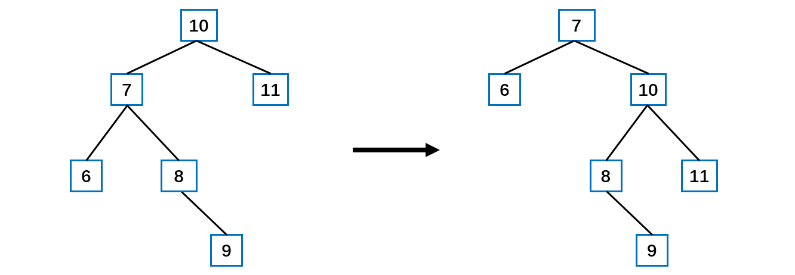

[TOC]

### 平衡二叉树AVL树

给你一个数列 **{1, 2, 3, 4, 5}**，要求创建一颗二叉排序树(BST)。左子树全部为空，从形式上看，更像一个**单链表**.


这种情况下，插入速度没有影响，查询速度明显降低(因为需要类似于链表依次比较), 不能发挥BST的优势，因为每次还需要比较左子树，其查询速度比单链表还慢。解决方案：平衡二叉树(AVL) 。

平衡二叉树也叫**平衡二叉搜索树**（Self-balancing binary search tree）又被称为 **AVL 树**， 可以保证查询效率较高。
具有以下特点：它是一棵空树或它的**左右两个子树的高度差的绝对值不超过 1**，并且左右两个子树都是一棵平衡二叉树。平衡二叉树的常用实现方法有**红黑树、AVL**、替罪羊树、Treap、伸展树等。

平衡二叉树的许多代码都是可以复用 BST 树中的，比如添加、删除结点的操作。


**构建一棵平衡二叉树**

给定一个数列 {4, 3, 6, 5, 7, 8}  构造排序二叉树 如下。左右子树高度差大于 1，并不平衡。


**左旋转**的流程：

- 创建一个新的结点 newNode，其值等于当前的根结点值。
- 把新结点的左子树设置为根结点的左子树。
- 把新结点的右子树设置为根结点的右子树的左子树。
- 把根结点的值换为右子结点的值。
- 把根结点的右子树设置成右子树的右子树。
- 把根结点的左子树设置成新结点。
- 原来的结点 6 没有引用指向，被垃圾回收。

左旋转之后的结果，成为了一棵平衡二叉树。


首先需要计算树的高度以及子树的高度

```java
/**
 * 返回以当前结点为跟结点的树的高度
 * @param node 根结点
 * @return 树高度
 */
private int getTreeHeight(Node node) {
    if (node == null) {
        return 0;
    }
    if (node.getLeftNode() == null && node.getRightNode() == null) {
        return 1;
    }
    return Math.max(node.getLeftNode() == null ? 0 : getTreeHeight(node.getLeftNode()), node.getRightNode() == null ? 0 : getTreeHeight(node.getRightNode())) + 1;
}

/**
 * 返回左子树的高度
 * @param node 根结点
 * @return 左子树高度
 */
private int getLeftTreeHeight(Node node) {
    if (node.getLeftNode() == null) {
        return 0;
    }
    // 返回以根结点的左结点作为根结点的树的高度
    return getTreeHeight(node.getLeftNode());
}

/**
 * 返回右子树的高度
 * @param node 根结点
 * @return 右子树高度
 */
private int getRightTreeHeight(Node node) {
    if (node.getRightNode() == null) {
        return 0;
    }
    // 返回以根结点的右结点作为根结点的树的高度
    return getTreeHeight(node.getRightNode());
}
```

当**添加**完一个结点之后，如果右子树的高度比左子树的高度大于 1，则进行左旋转。

```java
/**
 * 左旋转
 * @param node 根结点
 */
private void leftRotate(Node node) {
    // 以根结点的值创建新的结点
    Node newNode = new Node(node.getValue());
    // 把新结点的左子树设置为根结点的左子树
    newNode.setLeftNode(node.getLeftNode());
    // 把新结点的右子树设置为根结点的右子树的左子树
    newNode.setRightNode(node.getRightNode().getLeftNode());
    // 把根结点的值换为右子结点的值
    node.setValue(node.getRightNode().getValue());
    // 把根结点的右子树设置成右子树的右子树
    node.setRightNode(node.getRightNode().getRightNode());
    // 把根结点的左子树设置成新结点
    node.setLeftNode(newNode);
}
```

如下所示的排序二叉树，当**添加**一个结点 6 时，需要进行右旋转


右旋转的步骤：

- 以当前根结点的值创建一个新结点。
- 把新结点的右子树设置为当前根结点的右子树。
- 把新结点的左子树设置为根结点的左子树的右子树。
- 把根结点的值换为左子结点的值。
- 把根结点的左子树设置为根结点的左子结点的左子结点。
- 把根结点的右子树设置为新的结点。

```java
/**
 * 右旋转
 * @param rootNode 根结点
 */
private void rightRotate(Node rootNode) {
    // 以当前根结点的值创建一个新结点
    Node newNode = new Node(rootNode.getValue());
    // 把新结点的右子树设置为当前根结点的右子树
    newNode.setRightNode(rootNode.getRightNode());
    // 把新结点的左子树设置为根结点的左子树的右子树
    newNode.setLeftNode(rootNode.getLeftNode().getRightNode());
    // 把根结点的值换为左子结点的值
    rootNode.setValue(rootNode.getLeftNode().getValue());
    // 把根结点的左子树设置为根结点的左子结点的左子结点
    rootNode.setLeftNode(rootNode.getLeftNode().getLeftNode());
    // 把根结点的右子树设置为新的结点
    rootNode.setRightNode(newNode);
}
```

但是有时候使用左旋转与右旋转并不能完成平衡二叉树的转换，比如下面左图满足右旋转条件，但是右旋转之后仍然不是平衡二叉树。




问题分析：当符合右旋转条件时，如果它的左子树的右子树高度大于它的左子树的高度，就产生了上述的问题。需要做中转操作，先局部做左旋转再做右旋转。


