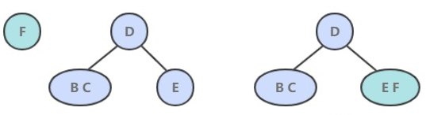
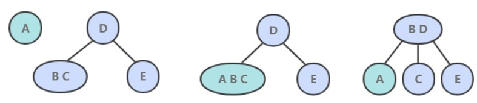

[TOC]

### 2-3 查找树

#### 1 概述

2-3 查找树引入了 2 节点和 3 节点，目的是为了让**树平衡**。一颗完美平衡的 2-3 查找树的所有空链接到根节点的距离应该是相同的。

2-3 树是**最简单的 B 树**结构, 具有如下特点:

- 2-3 树的所有**叶子节点**都在**同一层**.(只要是 B 树都满足这个条件)
- 2-3 树是由**二节点和三节点**构成的树。
- 有两个子节点的节点叫**二节点**，二节点要么**没有**子节点，要么有**两个**子节点.
- 有三个子节点的节点叫**三节点**，三节点要么**没有**子节点，要么有**三个**子节点.
- 2-3 树中结点的顺序**也要满足排序树**的特点，即左边的结点的值大于根结点的值，根结点的值小于右结点的值。

#### 2 构造过程

给定数列构造 2-3 树。{16, 24, 12, 32, 14, 26, 34, 10, 8, 28, 38, 20} 。

##### 1. 插入操作

插入操作和 BST 的插入操作有很大区别，BST 的插入操作是先进行一次未命中的查找，然后再将节点插入到对应的空链接上。但是 2-3 查找树如果也这么做的话，那么就会破坏了平衡性。**它是将新节点插入到叶子节点上**。

根据叶子节点的类型不同，有不同的处理方式：

- 如果插入到 2 节点上，那么直接将新节点和原来的节点组成 3 节点即可。

- 如果是插入到 3 节点上，就会产生一个临时 4 节点时，需要将 4 节点分裂成 3 个 2 节点，并将中间的 2 节点移到上层节点中。如果上移操作继续产生临时 4 节点则一直进行分裂上移，直到不存在临时 4 节点。

##### 2. 性质

2-3 查找树插入操作的变换都是局部的，除了相关的节点和链接之外不必修改或者检查树的其它部分，而这些局部变换不会影响树的全局有序性和平衡性。

2-3 查找树的查找和插入操作复杂度和插入顺序无关，在最坏的情况下查找和插入操作访问的节点必然不超过 logN 个，含有 10 亿个节点的 2-3 查找树最多只需要访问 30 个节点就能进行任意的查找和插入操作。

#### 多路查找树

二叉树的操作效率较高，但是也存在问题。比如对于数据库存储，在构建二叉树存储数据时，需要多次进行 i/o 操作(海量数据存在数据库或文件中)，节点海量，构建二叉树时，速度有影响。如果节点海量，也会造成二叉树的高度很大，会降低操作速度。

在二叉树中，每个节点有数据项，最多有两个子节点。如果允许每个节点可以有更多的数据项和更多的子节点，就是**多叉树**（multiway tree）。
后面讲解的 2 - 3 树，2 - 3 - 4 树就是多叉树，多叉树通过重新组织节点，**减少树的高度**，能对二叉树进行优化。

B 树通过重新组织节点，降低树的高度，并且减少 IO 读写次数来提升效率。

文件系统及数据库系统的设计者利用了磁盘预读原理，将一个节点的大小设为等于一个页(页得大小通常为 4k)，这样每个节点只需要一次 I/O 就可以完全载入。
将树的度 M 设置为 1024，在 600 亿个元素中最多只需要 4 次 I/O 操作就可以读取到想要的元素, B 树广泛应用于文件存储系统以及数据库系统中。