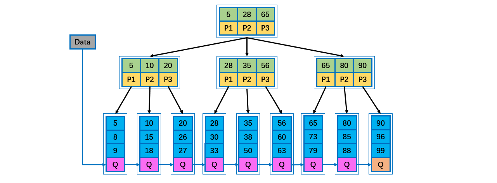

[TOC]

## B树

### 1 B 树

 B-tree 树即 B 树，B 即 Balanced，**平衡**的意思。有人把 B-tree 翻译成 **B-** 树，容易让人产生误解。会以为 B- 树是一种树，而 B 树又是另一种树。实际上，B-tree 就是指的 B 树。

说明：

- B 树的阶：节点的**最多子节点**个数。比如 2-3 树的阶是 3，2-3-4 树的阶是 4。

- B- 树的搜索，从根结点开始，对结点内的关键字（有序）序列进行**二分查找**，如果命中则结束，否则进入查询关键字所属范围的**儿子结点**；重复，直到所对应的儿子指针为空，或已经是叶子结点。

- 关键字集合分布在**整颗树**中, 即叶子节点和非叶子节点都存放数据。

- 搜索有可能在非叶子结点结束。

- 其搜索性能等价于在关键字**全集内**做**一次二分查找**。

    

### 2 B+ 树

B+ 树是 B 树的变体，也是一种多路搜索树。

说明：

- B+ 树的搜索与 B 树也基本相同，区别是 B+ 树只有达到叶子结点才命中（B 树可以在非叶子结点命中），其性能也等价于在关键字全集做一次二分查找。
- 所有**关键字**都出现在**叶子结点**的链表中（即**数据只能在叶子节点**【也叫稠密索引】），且链表中的关键字(数据)恰好是**有序**的。
- 不可能在非叶子结点命中。
- 非叶子结点相当于是叶子结点的索引（稀疏索引），叶子结点相当于是存储（关键字）数据的数据层。
- 更适合**文件索引**系统。
- B 树和 B+ 树各有自己的应用场景，不能说 B+ 树完全比 B 树好，反之亦然。

### 3 B* 树

B* 树是 B+ 树的变体，在 B+ 树的**非根和非叶子结点**再增加指向兄弟的指针。

- B* 树定义了非叶子结点关键字个数至少为 (2/3) * M，即块的最低使用率为 2 / 3，而 B+ 树的块的最低使用率为B+ 树的1/2。

- B* 树分配新结点的概率比 B+ 树要低，空间使用率更高。

