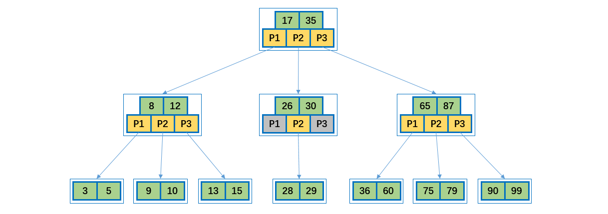

[TOC]

## B树

### 1 B 树

#### 概述

磁盘读取依靠的是机械运动，分为寻道时间、旋转延迟、传输时间三个部分，这三个部分耗时相加就是一次磁盘 IO 的时间，大概 9ms 左右。这个成本是访问内存的**十万倍**左右；正是由于**磁盘 IO 是非常昂贵的操作**，所以计算机操作系统对此做了优化：预读；每一次 IO 时，不仅仅把当前磁盘地址的数据加载到内存，同时也把相邻数据也加载到内存缓冲区中。因为局部预读原理说明：当访问一个地址数据的时候，与其相邻的数据很快也会被访问到。每次磁盘 IO 读取的数据我们称之为一页（page）。一页的大小与操作系统有关，一般为 4k 或者 8k。这也就意味着读取一页内数据的时候，实际上发生了一次磁盘 IO。

所以综上：**磁盘访问的代价太高了**。**减少磁盘访问次数**就是减少运行时间。B 树就是用来干这种事的数据结构。

我们知道**二叉查找树**查询的时间复杂度是 **O（logN）**，查找速度最快和比较次数最少，既然性能已经如此优秀，但为什么实现索引是使用 B-Tree 而不是二叉查找树，关键因素是磁盘 IO 的次数。

**数据库索引是存储在磁盘**上，当表中的数据量比较大时，索引的大小也跟着增长，达到几个 G 甚至更多。当我们利用索引进行查询的时候，不可能把索引全部加载到内存中，只能**逐一加载每个磁盘页**，这里的**磁盘页**就对应索引树的**节点**。

从二叉树的查找过程来看，最坏的情况下磁盘 IO 的次数由树的**高度**来决定。

从前面分析情况来看，减少磁盘 IO 的次数就必须要**压缩树的高度**，让瘦高的树尽量变成**矮胖的树**，所以 B-Tree 就在这样伟大的时代背景下诞生了。


B-Tree 就是我们常说的 B 树，一定不要读成 B 减树，否则就很丢人了。B 树这种数据结构常常用于实现**数据库索引**，因为它的查找效率比较高。


#### 结构分析

B 树是平衡 M 路树。

 B-tree 树即 B 树，B 即 Balanced，**平衡**的意思。有人把 B-tree 翻译成 **B-** 树，容易让人产生误解。会以为 B- 树是一种树，而 B 树又是另一种树。实际上，B-tree 就是指的 B 树。

**B 树**可以看作是对 2-3 查找树的一种扩展，即他允许每个节点有 M - 1 个子节点。

##### B树特性

一棵 m 阶的 B 树 (m 叉树)的特性如下：

- B 树中所有节点的**孩子节点数中的最大值**称为 B 树的阶，记为 M（**重点**）。
- 树中的每个节点至多有 M 棵子树，即：如果定了 M，则这个 B 树中任何节点的子节点数量都不能超过 M。
- 若根节点不是终端节点，则至少有两棵子树。
- 除根节点和叶节点外，所有点至少有 M / 2 棵子树（上溢）。
- 所有的叶子结点都位于同一层。

说明：

- B 树的阶：节点的**最多子节点**个数。比如 2-3 树的阶是 3，2-3-4 树的阶是 4。

- B- 树的搜索，从根结点开始，对结点内的关键字（有序）序列进行**二分查找**，如果命中则结束，否则进入查询关键字所属范围的**儿子结点**；重复，直到所对应的儿子指针为空，或已经是叶子结点。

- 关键字集合分布在**整颗树**中, 即叶子节点和非叶子节点都存放数据。

- 搜索有可能在非叶子结点结束。

- 其搜索性能等价于在关键字**全集内**做**一次二分查找**。

    
    
    


**操作图示**

B 树的插入及平衡化操作和 2-3 树很相似，下面是往 B 树中依次插入下列数据的过程。

```java
6 10 4 14 5 11 15 3 2 12 1 7 8 8 6 3 6 21 5 15 15 6 32 23 45 65 7 8 6 5 4
```


**插入或者删除元素**都会导致节点发生**裂变反应**，有时候会非常麻烦，但正因为如此才让 B 树能够始终保持多路平衡，这也是 B 树自身的一个优势：**自平衡**；B 树主要应用于**文件系统**以及部分数据库索引，如 MongoDB，大部分关系型数据库**索引**则是使用 **B+ 树**实现。


### 2 B+ 树

B+ 树是 B 树的变体，也是一种**多路搜索树**。查询性能更好。

**特性**

1. 有 n 棵子树的非叶子结点中含有 n 个关键字（ B 树是 n - 1 个），这些关键字**不保存数据**，只用来**索引**，所有**数据都保存在叶子节点**（B 树是**每个关键字都保存数据**）。
2. 所有的叶子结点中包含了全部关键字的信息，及指向含这些**关键字记录的指针**，且叶子结点本身依关键字的大小自小而大顺序链接。
3. 所有的**非叶子结点**可以看成是**索引部分**，结点中仅含其子树中的最大（或最小）关键字。
4. 通常在 B+ 树上有两个头指针，一个指向根结点，一个指向关键字最小的叶子结点。
5. 同一个数字会在不同节点中重复出现，根节点的最大元素就是 B+ 树的最大元素。


说明：

- B+ 树元素**自底向上**插入。

- B+ 树的搜索与 B 树也基本相同，**区别是 B+ 树只有达到叶子结点才命中**（B 树可以在非叶子结点命中），其性能也等价于在关键字全集做一次二分查找。
- 所有**关键字**都出现在**叶子结点**的链表中（即**数据只能在叶子节点**【也叫稠密索引】），且链表中的关键字(数据)恰好是**有序**的。
- B+ 树的特点是能够**保持数据稳定有序**，其插入与修改拥有较稳定的对数时间复杂度。 
- 不可能在非叶子结点命中。
- 非叶子结点相当于是叶子结点的索引（稀疏索引），叶子结点相当于是存储（关键字）数据的数据层。
- 更适合**文件索引**系统。
- B 树和 B+ 树各有自己的应用场景，不能说 B+ 树完全比 B 树好，反之亦然。


### 3 B* 树

B* 树是 B+ 树的变体，在 B* 树的**非根和非叶子结点**再增加**指向兄弟**的指针。

- B* 树定义了非叶子结点关键字个数至少为 (2/3) * M，即块的最低使用率为 2 / 3，而 B+ 树的块的最低使用率为B+ 树的1/2。

- B* 树分配新结点的概率比 B+ 树要低，**空间使用率更高**。


**参考资料**

- B-Tree与二叉查找树的对比 http://m.elecfans.com/article/662237.html