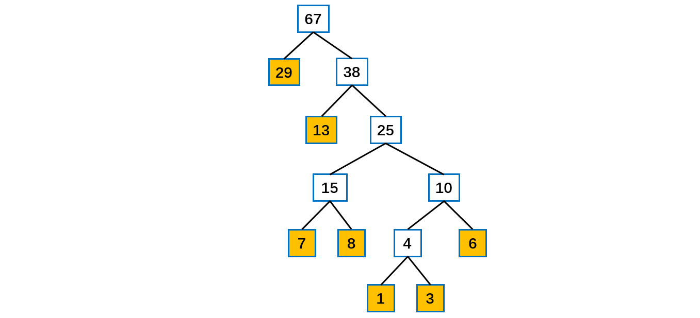

[TOC]

## 霍夫曼树

### 1 霍夫曼编码

#### 概述

- 赫夫曼编码也翻译为哈夫曼编码(Huffman Coding)，又称霍夫曼编码，是一种编码方式, 属于一种程序算法。
- 赫夫曼编码是赫哈夫曼树在电讯**通信**中的经典的应用之一。
- 赫夫曼编码广泛地用于数据文件**压缩**。其压缩率通常在20%～90%之间。
- 赫夫曼码是**可变字长编码**(VLC)的一种。Huffman于1952年提出一种编码方法，称之为最佳编码。


#### 编码原理

根据数据出现的**频率**对数据进行编码，从而**压缩原始数据**。

例如对于一个文本文件，其中各种字符出现的次数如下：

- a : 10
- b : 20
- c : 40
- d : 80

可以将每种字符转换成**二进制编码**，例如将 a 转换为 00，b 转换为 01，c 转换为 10，d 转换为 11。这是最简单的一种编码方式，没有考虑各个字符的**权值**（出现频率）。而哈夫曼编码采用了**贪心策略**，使**==出现频率最高的字符的编码最短==**，从而保证整体的编码长度最短。

如下的字符串共40个字符(包括空格)  

```
i like like like java do you like a java  
```

对应的 ASCII 码

```java
105 32 108 105 107 101 32 108 105 107 101 32 108 105 107 101 32 106 97 118 97 32 100 111 32 121 111 117 32 108 105 107 101 32 97 32 106 97 118 97
```

对应的二进制

```java
01101001 00100000 01101100 01101001 01101011 01100101 00100000 01101100 01101001 01101011 01100101 00100000 01101100 01101001 01101011 01100101 00100000 01101010 01100001 01110110 01100001 00100000 01100100 01101111 00100000 01111001 01101111 01110101 00100000 01101100 01101001 01101011 01100101 00100000 01100001 00100000 01101010 01100001 01110110 01100001 
```

按照二进制来传递信息，总的长度是  359   (包括空格)。还有一种变长编码。

对于赫夫曼编码方式，统计各个字符出现的次数如下：

```java
d:1 y:1 u:1 j:2  v:2  o:2  l:4  k:4  e:4 i:5  a:5  (空格):9  // 各个字符对应的个数
```

按照上面字符出现的次数构建一颗赫夫曼树, **次数作为==权值==**。构造步骤如上述的赫夫曼树构造步骤。

根据赫夫曼树，给各个字符编码，规定编码**向左的路径为 0，向右的路径为 1**，得到的**路径编码**如下：

```java
o: 1000   u: 10010  d: 100110  y: 100111  i: 101
a: 110    k: 1110   e: 1111    j: 0000    v: 0001
l: 001    (空格): 01
```

这是一个前缀编码，即每个编码都不会是另一个编码的前缀。

按照上面的赫夫曼编码，上述字符串对应的编码如下：

```java
1010100110111101111010011011110111101001101111011110100001100001110011001111000011001111000100100100110111101111011100100001100001110
```

长度变为 133。原来长度是  359 , 压缩了  (359 - 133) / 359 = 62.9%
此编码满足前缀编码, 即字符的编码都不能是其他字符编码的前缀。**不会造成匹配的多义性**。赫夫曼编码是无损压缩。

注意，赫夫曼树根据排序方法不同，也可能不太一样，**这样对应的赫夫曼编码也不完全一样**，但是 WPL 是一样的，都是最小的。比如有多个字符出现权值相同的情况，这时候如何处理这里权值相同的字符的排列方式就会产生形状不同的霍夫曼树，此时产生的编码可能不一样，但是其长度应该是一样的。

可以进行字符串压缩，也可以进行文件压缩。


### 2 霍夫曼树

#### 霍夫曼树

- 给定 n 个权值作为 n 个叶子结点，构造一棵二叉树，若该树的**带权路径长度( wpl)** 达到最小，称这样的二叉树为**最优二叉树**。

- 赫夫曼树是**带权路径长度最短**的树，权值**较大**的结点**离根较近**。

- 路径和路径长度：在一棵树中，从一个结点往下可以达到的孩子或孙子结点之间的通路，称为路径。通路中分支的数目称为路径长度。若规定根结点的层数为 1，则从根结点到第L层结点的路径长度为 L - 1。
- **结点的权及带权路径长度：若将树中结点赋给一个有着某种含义的数值，则这个数值称为该结点的权。**结点的**带权路径长度**为：从根结点到该结点之间的路径长度与该结点的权的乘积。

- **树的带权路径长度：**树的带权路径长度规定为所有==**叶子结点**==的带权路径长度**之和**，记为 **WPL**(Weighted
    Path Length) , 权值越大的结点离根结点越近的二叉树才是最优二叉树。
- WPL 最小的二叉树就是赫夫曼树。


#### 代码实现

首先生成一颗哈夫曼树，每次生成过程中选取频率最少的两个节点，生成一个新节点作为它们的父节点，并且新节点的频率为两个节点的和。选取频率最少的原因是，生成过程使得先选取的节点位于树的更低层，那么需要的编码长度更长，频率更少可以使得总编码长度更少。

生成编码时，从根节点出发，向左遍历则添加二进制位 0，向右则添加二进制位 1，直到遍历到叶子节点，叶子节点代表的字符的编码就是这个路径编码。


```java
public class Huffman {

    private class Node implements Comparable<Node> {
        char ch;
        int freq;
        boolean isLeaf;
        Node left, right;

        public Node(char ch, int freq) {
            this.ch = ch;
            this.freq = freq;
            isLeaf = true;
        }

        public Node(Node left, Node right, int freq) {
            this.left = left;
            this.right = right;
            this.freq = freq;
            isLeaf = false;
        }

        @Override
        public int compareTo(Node o) {
            return this.freq - o.freq;
        }
    }

    public Map<Character, String> encode(Map<Character, Integer> frequencyForChar) {
        PriorityQueue<Node> priorityQueue = new PriorityQueue<>();
        for (Character c : frequencyForChar.keySet()) {
            priorityQueue.add(new Node(c, frequencyForChar.get(c)));
        }
        while (priorityQueue.size() != 1) {
            Node node1 = priorityQueue.poll();
            Node node2 = priorityQueue.poll();
            priorityQueue.add(new Node(node1, node2, node1.freq + node2.freq));
        }
        return encode(priorityQueue.poll());
    }

    private Map<Character, String> encode(Node root) {
        Map<Character, String> encodingForChar = new HashMap<>();
        encode(root, "", encodingForChar);
        return encodingForChar;
    }

    private void encode(Node node, String encoding, Map<Character, String> encodingForChar) {
        if (node.isLeaf) {
            encodingForChar.put(node.ch, encoding);
            return;
        }
        encode(node.left, encoding + '0', encodingForChar);
        encode(node.right, encoding + '1', encodingForChar);
    }
}
```


#### 数组构造霍夫曼树

**给定一个数组，要求转为一棵赫夫曼树**

给定数组如下，先排序得到有序数组。

```java
{13, 7, 8, 3, 29, 6, 1}
{1, 3, 6, 7, 8, 13, 29}
```

构成赫夫曼树的步骤：

- 从小到大进行排序, 将每一个数据，每个数据都是一个节点 ， 每个节点可以看成是一颗最简单的二叉树
- 取出根节点权值最小的**两颗**二叉树 
- 组成一颗新的二叉树, 该新的二叉树的根节点的权值是前面两颗二叉树根节点权值的和  
- 再将这颗新的二叉树，以**根节点的权值大小再次排序**， 不断重复  1-2-3-4 的步骤，直到数列中，所有的数据都被处理，就得到一颗赫夫曼树



上图中黄色结点是子结点，即为给定数组中的值，**由下往上不断构造**。由此得到赫夫曼树。

赫夫曼树子结点类。

```java
/**
 * 霍夫曼树节点类
 * @author cz
 *
 * 为了让Node对象持续排序Collections集合排序让Node实现Comparable接口
 */
@Data
class Node implements Comparable<Node> {

    /**
     * 结点权值
     */
    private int value;

    /**
     * 指向左子结点
     */
    private Node leftNode;

    /**
     * 指向右子结点
     */
    private Node rightNode;


    public Node(int value) {
        this.value = value;
    }

    @Override
    public String toString() {
        return "Node [value=" + value + "]";
    }

    @Override
    public int compareTo(Node node) {
        // 表示从小到大排序
        return this.value - node.value;
    }

}
```

**构造与遍历**赫夫曼树

```java
/**
 * 霍夫曼树
 * @author cz
 */
public class HuffmanTree {

    public static void main(String[] args) {
        int arr[] = { 13, 7, 8, 3, 29, 6, 1 };
        Node root = createHuffmanTree(arr);
        System.out.println("前序遍历霍夫曼树");
        preOrder(root);

    }

    /**
     * 前序遍历 递归实现
     * @param node 结点类
     */
    public static void preOrder(Node node) {

        System.out.println(node.toString());

        if (node.getLeftNode() != null) {
            preOrder(node.getLeftNode());
        }

        if (node.getRightNode() != null) {
            preOrder(node.getRightNode());
        }
    }

    /**
     * 创建赫夫曼树的方法
     *
     * @param arr 需要创建成哈夫曼树的数组
     * @return 创建好后的赫夫曼树的root结点
     */
    public static Node createHuffmanTree(int[] arr) {
        // 第一步为了操作方便
        // 遍历arr数组,将arr的每个元素构成成一个Node,将Node放入到ArrayList中
        List<Node> nodes = new ArrayList<>();
        for (int value : arr) {
            nodes.add(new Node(value));
        }

        // 循环处理链表中的node值
        while(nodes.size() > 1) {

            // 将数组实现从小到大排序
            Collections.sort(nodes);

            System.out.println("构造一次: Nodes = " + nodes);

            // 取出根节点权值最小的两颗二叉树
            // 取出权值最小的结点（一个结点可以看成一棵二叉树）
            Node leftNode = nodes.get(0);
            // 取出权值第二小的结点（二叉树）
            Node rightNode = nodes.get(1);

            // 构建一颗新的二叉树，父节点权值为两个子结点的权值之和
            Node parent = new Node(leftNode.getValue() + rightNode.getValue());
            parent.setLeftNode(leftNode);
            parent.setRightNode(rightNode);

            // 从ArrayList删除处理过的二叉树
            nodes.remove(leftNode);
            nodes.remove(rightNode);
            // 将parent加入到nodes，因为新的parent也成为链表中的成员继续用于构造下一次选择创建
            nodes.add(parent);
        }

        // 返回哈夫曼树的root结点
        return nodes.get(0);
    }
}
```

输出结果：

```java
构造一次: Nodes = [Node [value=1], Node [value=3], Node [value=6], Node [value=7], Node [value=8], Node [value=13], Node [value=29]]
构造一次: Nodes = [Node [value=4], Node [value=6], Node [value=7], Node [value=8], Node [value=13], Node [value=29]]
构造一次: Nodes = [Node [value=7], Node [value=8], Node [value=10], Node [value=13], Node [value=29]]
构造一次: Nodes = [Node [value=10], Node [value=13], Node [value=15], Node [value=29]]
构造一次: Nodes = [Node [value=15], Node [value=23], Node [value=29]]
构造一次: Nodes = [Node [value=29], Node [value=38]]
前序遍历霍夫曼树
Node [value=67]
Node [value=29]
Node [value=38]
Node [value=15]
Node [value=7]
Node [value=8]
Node [value=23]
Node [value=10]
Node [value=4]
Node [value=1]
Node [value=3]
Node [value=6]
Node [value=13]
```


