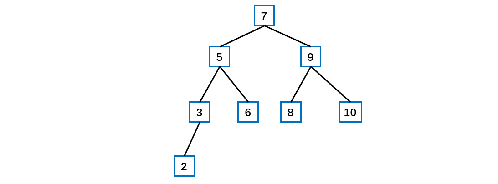

[TOC]

### 二叉树

#### 概述

- 每个结点最多两个子节点的树为二叉树。
- 如果二叉树的叶子结点都在最后一层，并且结点总数 = 2 ^ n - 1 （n 为层数），则此为满二叉树。
- 如果二叉树除了最后一层之外均为满的，且最后一层的子节点从左到右排列，此成为完全二叉树。


#### 普通二叉树的遍历与查找

==**二叉树的遍历**==

前序遍历: **先输出父节点**，再遍历左子树和右子树

中序遍历: 先遍历左子树，**再输出父节点**，再遍历右子树

后序遍历: 先遍历左子树，再遍历右子树，**最后输出父节点**

**小结**: 看输出**父节点**的顺序，就确定是前序，中序还是后序

前序遍历步骤：初始的时候是 root 结点，先输出当前结点，如果左子结点不为空，则继续递归前序遍历。如果右子结点不为空，则继续递归前序遍历。

中序遍历步骤：初始的时候是 root 结点，如果当前结点的左子结点不为空，则继续递归中序遍历。输出当前结点。如果当前节点的右子结点不为空，则继续递归中序遍历。

后序遍历步骤：初始的时候是 root 结点，如果当前结点的左子结点不为空，则继续递归中序遍历。如果当前节点的右子结点不为空，则继续递归中序遍历。输出当前结点。

**二叉树的查找**

**前序查找**思路：

先判断当前结点的 data 是不是要查找的，如果是相等的就返回当前结点。如果不相等，判断当前结点的左结点是否非空，如果不为空，则递归前序查找。如果左递归前序查找找到结点，则返回结点，否则继续判断当前结点的右结点是否为空，如果不为空则继续向右递归前序查找。

**中序查找**思路：

判断当前结点的左子节点是否为空，如果不为空，则递归中序查找 。如果找到则返回结点，如果没有找到，就和当前结点比较，如果是则返回当前结点，否则继续进行右递归的中序查找。如果右递归中序查找，找到就返回结点，否则返回 null。

**后续查找**思路：

判断当前结点的左子节点是否为空，如果不为空，则递归后序查找。如果找到就返回结点，如果没有找到就判断当前结点的右子结点是否为空，如果不为空，就右递归进行后续查找，如果找到就返回。和当前结点进行比较，如果是则返回，否则返回 null。

如下图所示的普通二叉树



下面的代码是上图中的三种遍历与查找。

```java
import java.util.ArrayList;
import java.util.Arrays;
import java.util.List;
import lombok.Data;
import lombok.Getter;

/**
 * 二叉树遍历
 * @author cz
 */
public class BinaryTree {

    public static void main(String[] args) {

        // 构造一颗二叉树
        Node rootNode = new Node(7);
        Node node5 = new Node(5);
        Node node9 = new Node(9);
        Node node3 = new Node(3);
        Node node6 = new Node(6);
        Node node8 = new Node(8);
        Node node10 = new Node(10);
        Node node2 = new Node(2);
        rootNode.setLeftNode(node5);
        rootNode.setRightNode(node9);
        node5.setLeftNode(node3);
        node5.setRightNode(node6);
        node3.setLeftNode(node2);
        node9.setLeftNode(node8);
        node9.setRightNode(node10);

        BinaryTree binaryTree = new BinaryTree();
        binaryTree.preOrder(rootNode);
        System.out.println("前序遍历结果:");
        System.out.println(Arrays.toString(binaryTree.getPreOrderDataList().toArray()));


        binaryTree.midOrder(rootNode);
        System.out.println("中遍历结果:");
        System.out.println(Arrays.toString(binaryTree.getMidOrderDataList().toArray()));


        binaryTree.postOrder(rootNode);
        System.out.println("后序遍历结果:");
        System.out.println(Arrays.toString(binaryTree.getPostOrderDataList().toArray()));

        System.out.println("前序遍历查找");
        Node resultNode = binaryTree.preOrderSearch(rootNode, 10);

        if (resultNode != null) {
            System.out.println("找到数据:" + resultNode.getData());
        } else {
            System.out.println("未找到数据");
        }

    }


    /**
     * 存放遍历后数据结果的列表
     */
    @Getter
    private List<Integer> preOrderDataList = new ArrayList<>();

    @Getter
    private List<Integer> midOrderDataList = new ArrayList<>();

    @Getter
    private List<Integer> postOrderDataList = new ArrayList<>();


    /**
     * 前序遍历 递归实现
     * @param node 结点类
     */
    public void preOrder(Node node) {

        preOrderDataList.add(node.getData());
        if (node.getLeftNode() != null) {
            preOrder(node.getLeftNode());
        }
        if (node.getRightNode() != null) {
            preOrder(node.getRightNode());
        }
    }


    /**
     * 中序遍历 递归实现
     * @param node 结点类
     */
    public void midOrder(Node node) {

        if (node.getLeftNode() != null) {
            midOrder(node.getLeftNode());
        }

        midOrderDataList.add(node.getData());

        if (node.getRightNode() != null) {
            midOrder(node.getRightNode());
        }
    }


    /**
     * 后序遍历 递归实现
     * @param node 结点类
     */
    public void postOrder(Node node) {

        if (node.getLeftNode() != null) {
            postOrder(node.getLeftNode());
        }

        if (node.getRightNode() != null) {
            postOrder(node.getRightNode());
        }

        postOrderDataList.add(node.getData());
    }


    /**
     * 前序遍历查找数值
     * @param node 根节点
     * @param searchValue 待查找数值
     * @return Node 结点，为null就没找到
     */
    public Node preOrderSearch(Node node, int searchValue) {

        // 判断当前结点是不是
        if (node.getData() == searchValue) {
            return node;
        }

        // 定义一个结果结点
        Node resultNode = null;

        // 判断当前结点的做子结点是否为空，如果不是则递归前序查找
        // 如果左递归前序查找找到结点则返回
        if (node.getLeftNode() != null) {
            resultNode = preOrderSearch(node.getLeftNode(), searchValue);
        }

        // 说明在左子树找到
        if (resultNode != null) {
            return resultNode;
        }

        // 如果左子树没有找到则继续判断当前结点的右子结点是否为空，不为空则继续右递归进行查找
        if (node.getRightNode() != null) {
            resultNode = preOrderSearch(node.getRightNode(), searchValue);
        }

        // 右递归时，不管找到没有都返回结果结点，如果为null则说明没找到
        return resultNode;
    }


    /**
     * 中序遍历查找数值
     * @param node 根节点
     * @param searchValue 待查找数值
     * @return Node 结点，为null就没找到
     */
    public Node midOrderSearch(Node node, int searchValue) {

        Node resultNode = null;
        if (node.getLeftNode() != null) {
            resultNode = midOrderSearch(node.getLeftNode(), searchValue);
        }
        if (resultNode != null) {
            return resultNode;
        }
        if (node.getData() == searchValue) {
            return node;
        }
        // 如果右递归中序查找，找到就返回结点，否则返回 null
        if (node.getRightNode() != null) {
            resultNode = midOrderSearch(node.getRightNode(), searchValue);
        }
        return resultNode;
    }


    /**
     * 后序遍历查找数值
     * @param node 根节点
     * @param searchValue 待查找数值
     * @return Node 结点，为null就没找到
     */
    public Node postOrderSearch(Node node, int searchValue) {

        Node resultNode = null;
        if (node.getLeftNode() != null) {
            resultNode = postOrderSearch(node.getLeftNode(), searchValue);
        }
        if (resultNode != null) {
            return resultNode;
        }
        if (node.getRightNode() != null) {
            resultNode = postOrderSearch(node.getRightNode(), searchValue);
        }
        if (resultNode != null) {
            return resultNode;
        }
        // 左右子树都没找到，比较当前结点是否是
        if (node.getData() == searchValue) {
            return node;
        }
        return resultNode;
    }

}

/**
 * 结点类
 */
@Data
class Node {

    /**
     * 数据
     */
    private int data;
    
    /**
     * 左子结点
     */
    private Node leftNode;

    /**
     * 右子结点
     */
    private Node rightNode;

    public Node(int data) {
        this.data = data;
    }
}
```


#### 顺序存储二叉树

从数据存储来看，**数组存储方式**和**树的存储方式**可以相互转换，即**==数组==**可以转换成树，树也可以转换成数组。

特点：

1、顺序二叉树通常只考虑**完全**二叉树

2、第 n 个元素的**左子节点**为  **2 * n + 1** 

3、第 n 个元素的**右子节点**为  **2 * n + 2**

4、第 n 个元素的**父节点**为  **(n - 1) / 2**

如下图所示的二叉树


这个结构可以应用与堆及堆排序。


#### 线索二叉树

二叉树可以使用两种存储结构：顺序存储和二叉链表。在使用二叉链表的存储结构的过程中，会存在大量的空指针域，为了充分利用这些空指针域，引申出了“线索二叉树”。

- 这种加上了线索的二叉链表称为线索链表，相应的二叉树称为**线索二叉树**(Threaded BinaryTree)。根据线索性质的不同，线索二叉树可分为**前序**线索二叉树、**中序**线索二叉树和**后序**线索二叉树三种。

- 一个结点的前一个结点，称为**前驱**结点。一个结点的后一个结点，称为**后继**结点。


通过观察上面的二叉链表，存在着若干个没有指向的**空指针域**。对于一个有 n 个节点的二叉链表，每个节点有指向左右节点的 2 个指针域，整个二叉链表存在 2n 个指针域。而 n 个节点的二叉链表有 n - 1 条分支线，那么空指针域的个数 = 2n - (n-1) = **n + 1个空指针域**，从存储空间的角度来看，这 n + 1个空指针域浪费了内存资源。 

从另外一个角度来分析，如果我们想知道按**中序方式**遍历二叉链表时 B 节点的前驱节点或者后继节点时，必须要按中序方式遍历二叉链表才能够知道结果，每次需要结果时都需要进行一次遍历，是否可以考虑**提前存储这种前驱和后继的关系**来提高时间效率呢？ 
综合以上两方面的分析，可以通过充分利用二叉链表中的空指针域，存放节点在某种遍历方式下的前驱和后继节点的指针。**我们把这种指向前驱和后继的指针成为线索，加上线索的二叉链表成为线索链表，对应的二叉树就成为“线索二叉树(Threaded Binary Tree)”** 。

**线索二叉树构造过程**

此处对二叉树进行中序遍历，遍历的结果为

```
H D I B E A F C G
```

将所有的节点**右子节点**为空的指针域指向它的后继节点。如下图： 

具体参考：

https://blog.csdn.net/jisuanjiguoba/article/details/81092812

线索化二叉树后不能再使用之前基础的二叉树遍历方式。这时需要使用新的方式遍历线索化二叉树，各个节点可以通过线型方式遍历，因此无需使用递归方式，这样也提高了遍历的效率。 遍历的次序应当和中序遍历保持一致。


**参考资料**

- https://blog.csdn.net/jisuanjiguoba/article/details/81092812