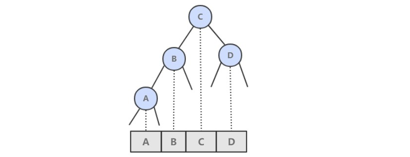
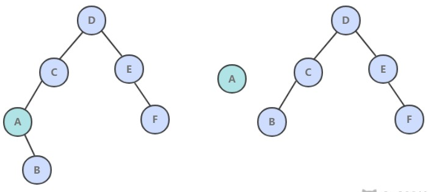
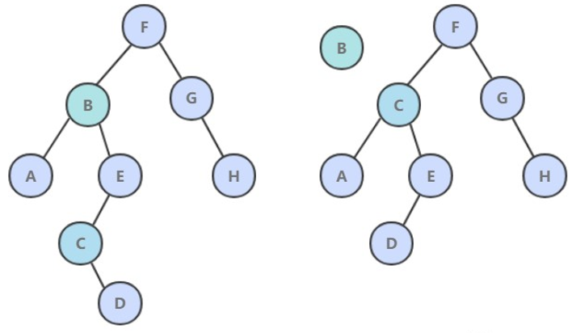

[TOC]

### 二叉查找树

**二叉树**  是一个空链接，或者是一个有左右两个链接的节点，每个链接都指向一颗子二叉树。


**二叉查找树** （BST）是一颗二叉树，并且每个节点的值都大于等于其左子树中的所有节点的值而小于等于右子树的所有节点的值。

BST 有一个重要性质，就是它的**中序遍历**结果**递增**排序。



基本数据结构：

```java
public class BST<Key extends Comparable<Key>, Value> implements OrderedST<Key, Value> {

    protected Node root;

    protected class Node {
        Key key;
        Value val;
        Node left;
        Node right;
        // 以该节点为根的子树节点总数
        int N;
        // 红黑树中使用
        boolean color;

        Node(Key key, Value val, int N) {
            this.key = key;
            this.val = val;
            this.N = N;
        }
    }

    @Override
    public int size() {
        return size(root);
    }

    private int size(Node x) {
        if (x == null)
            return 0;
        return x.N;
    }

    protected void recalculateSize(Node x) {
        x.N = size(x.left) + size(x.right) + 1;
    }
}
```

为了方便绘图，下文中二叉树的空链接不画出来。

##### 1. get()

- 如果树是空的，则查找未命中；
- 如果被查找的键和根节点的键相等，查找命中；
- 否则递归地在子树中查找：如果被查找的键较小就在左子树中查找，较大就在右子树中查找。

```java
@Override
public Value get(Key key) {
    return get(root, key);
}

private Value get(Node x, Key key) {
    if (x == null)
        return null;
    int cmp = key.compareTo(x.key);
    if (cmp == 0)
        return x.val;
    else if (cmp < 0)
        return get(x.left, key);
    else
        return get(x.right, key);
}
```

##### 2. put()

当插入的键不存在于树中，需要创建一个新节点，并且更新上层节点的链接指向该节点，使得该节点正确地链接到树中。


```java
 @Override
public void put(Key key, Value value) {
    root = put(root, key, value);
}

private Node put(Node x, Key key, Value value) {
    if (x == null)
        return new Node(key, value, 1);
    int cmp = key.compareTo(x.key);
    if (cmp == 0)
        x.val = value;
    else if (cmp < 0)
        x.left = put(x.left, key, value);
    else
        x.right = put(x.right, key, value);
    recalculateSize(x);
    return x;
}
```

##### 3. 分析

二叉查找树的算法运行时间取决于树的形状，而树的形状又取决于键被插入的先后顺序。

最好的情况下树是完全平衡的，每条空链接和根节点的距离都为 logN。


在最坏的情况下，树的高度为 N。


##### 4. floor()

floor(key)：小于等于键的最大键

- 如果键小于根节点的键，那么 floor(key) 一定在左子树中；
- 如果键大于根节点的键，需要先判断右子树中是否存在 floor(key)，如果存在就返回，否则根节点就是 floor(key)。

```java
public Key floor(Key key) {
    Node x = floor(root, key);
    if (x == null)
        return null;
    return x.key;
}

private Node floor(Node x, Key key) {
    if (x == null)
        return null;
    int cmp = key.compareTo(x.key);
    if (cmp == 0)
        return x;
    if (cmp < 0)
        return floor(x.left, key);
    Node t = floor(x.right, key);
    return t != null ? t : x;
}
```

##### 5. rank()

rank(key) 返回 key 的排名。

- 如果键和根节点的键相等，返回左子树的节点数；
- 如果小于，递归计算在左子树中的排名；
- 如果大于，递归计算在右子树中的排名，加上左子树的节点数，再加上 1（根节点）。

```java
@Override
public int rank(Key key) {
    return rank(key, root);
}

private int rank(Key key, Node x) {
    if (x == null)
        return 0;
    int cmp = key.compareTo(x.key);
    if (cmp == 0)
        return size(x.left);
    else if (cmp < 0)
        return rank(key, x.left);
    else
        return 1 + size(x.left) + rank(key, x.right);
}
```

##### 6. min()

```java
@Override
public Key min() {
    return min(root).key;
}

private Node min(Node x) {
    if (x == null)
        return null;
    if (x.left == null)
        return x;
    return min(x.left);
}
```

##### 7. deleteMin()

令指向最小节点的链接指向最小节点的右子树。



```java
public void deleteMin() {
    root = deleteMin(root);
}

public Node deleteMin(Node x) {
    if (x.left == null)
        return x.right;
    x.left = deleteMin(x.left);
    recalculateSize(x);
    return x;
}
```

##### 8. delete()

- 如果待删除的节点只有一个子树，  那么只需要让指向待删除节点的链接指向唯一的子树即可；
- 否则，让右子树的最小节点替换该节点。



```java
public void delete(Key key) {
    root = delete(root, key);
}
private Node delete(Node x, Key key) {
    if (x == null)
        return null;
    int cmp = key.compareTo(x.key);
    if (cmp < 0)
        x.left = delete(x.left, key);
    else if (cmp > 0)
        x.right = delete(x.right, key);
    else {
        if (x.right == null)
            return x.left;
        if (x.left == null)
            return x.right;
        Node t = x;
        x = min(t.right);
        x.right = deleteMin(t.right);
        x.left = t.left;
    }
    recalculateSize(x);
    return x;
}
```

##### 9. keys()

利用二叉查找树中序遍历的结果为递增的特点。

```java
@Override
public List<Key> keys(Key l, Key h) {
    return keys(root, l, h);
}

private List<Key> keys(Node x, Key l, Key h) {
    List<Key> list = new ArrayList<>();
    if (x == null)
        return list;
    int cmpL = l.compareTo(x.key);
    int cmpH = h.compareTo(x.key);
    if (cmpL < 0)
        list.addAll(keys(x.left, l, h));
    if (cmpL <= 0 && cmpH >= 0)
        list.add(x.key);
    if (cmpH > 0)
        list.addAll(keys(x.right, l, h));
    return list;
}
```

##### 10. 分析

二叉查找树所有操作在最坏的情况下所需要的时间都和树的高度成正比。


