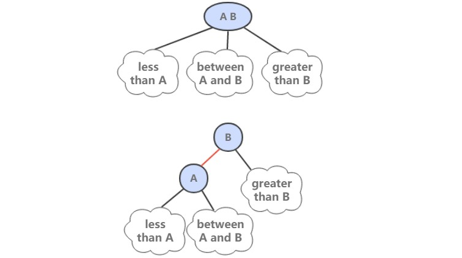
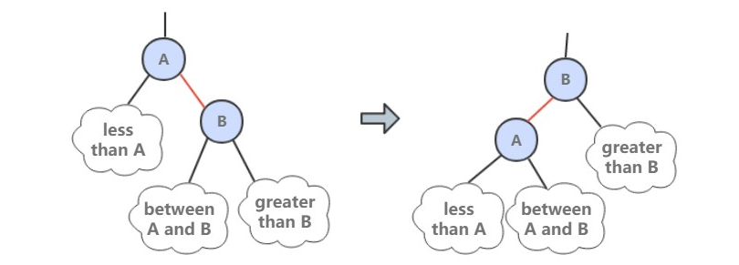
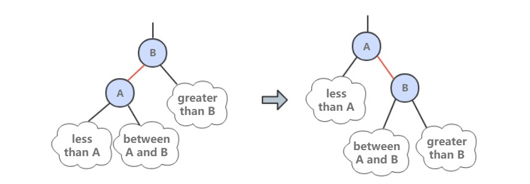
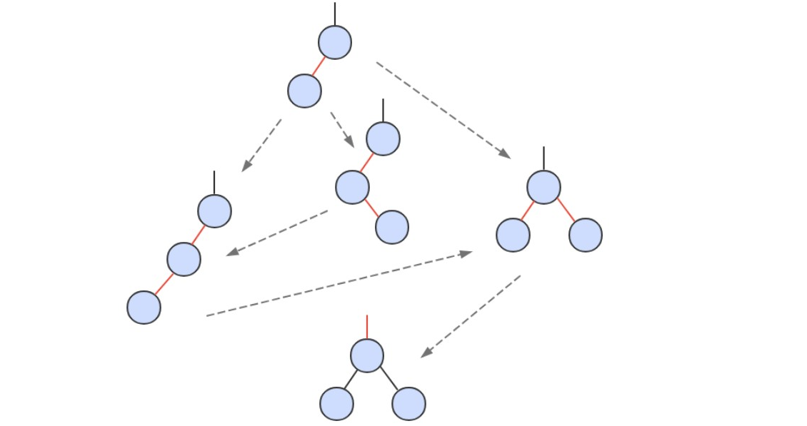

[TOC]

### 红黑树

红黑树是 2-3 查找树，但它不需要分别定义 2- 节点和 3- 节点，而是在普通的二叉查找树之上，为节点添加颜色。指向一个节点的链接颜色如果为红色，那么这个节点和上层节点表示的是一个 3- 节点，而黑色则是普通链接。



红黑树具有以下性质：

- 红链接都为左链接；
- 完美黑色平衡，即任意空链接到根节点的路径上的黑链接数量相同。

画红黑树时可以将红链接画平。


```java
public class RedBlackBST<Key extends Comparable<Key>, Value> extends BST<Key, Value> {

    private static final boolean RED = true;
    private static final boolean BLACK = false;

    private boolean isRed(Node x) {
        if (x == null)
            return false;
        return x.color == RED;
    }
}
```

##### 1. 左旋转

因为合法的红链接都为左链接，如果出现右链接为红链接，那么就需要进行左旋转操作。



```java
public Node rotateLeft(Node h) {
    Node x = h.right;
    h.right = x.left;
    x.left = h;
    x.color = h.color;
    h.color = RED;
    x.N = h.N;
    recalculateSize(h);
    return x;
}
```

##### 2. 右旋转

进行右旋转是为了转换两个连续的左红链接，这会在之后的插入过程中探讨。



```java
public Node rotateRight(Node h) {
    Node x = h.left;
    h.left = x.right;
    x.right = h;
    x.color = h.color;
    h.color = RED;
    x.N = h.N;
    recalculateSize(h);
    return x;
}
```

##### 3. 颜色转换

一个 4- 节点在红黑树中表现为一个节点的左右子节点都是红色的。分裂 4- 节点除了需要将子节点的颜色由红变黑之外，同时需要将父节点的颜色由黑变红，从 2-3 树的角度看就是将中间节点移到上层节点。


```java
void flipColors(Node h) {
    h.color = RED;
    h.left.color = BLACK;
    h.right.color = BLACK;
}
```

##### 4. 插入

先将一个节点按二叉查找树的方法插入到正确位置，然后再进行如下颜色操作：

- 如果右子节点是红色的而左子节点是黑色的，进行左旋转；
- 如果左子节点是红色的，而且左子节点的左子节点也是红色的，进行右旋转；
- 如果左右子节点均为红色的，进行颜色转换。



```java
@Override
public void put(Key key, Value value) {
    root = put(root, key, value);
    root.color = BLACK;
}

private Node put(Node x, Key key, Value value) {
    if (x == null) {
        Node node = new Node(key, value, 1);
        node.color = RED;
        return node;
    }
    int cmp = key.compareTo(x.key);
    if (cmp == 0)
        x.val = value;
    else if (cmp < 0)
        x.left = put(x.left, key, value);
    else
        x.right = put(x.right, key, value);

    if (isRed(x.right) && !isRed(x.left))
        x = rotateLeft(x);
    if (isRed(x.left) && isRed(x.left.left))
        x = rotateRight(x);
    if (isRed(x.left) && isRed(x.right))
        flipColors(x);

    recalculateSize(x);
    return x;
}
```

可以看到该插入操作和二叉查找树的插入操作类似，只是在最后加入了旋转和颜色变换操作即可。

根节点一定为黑色，因为根节点没有上层节点，也就没有上层节点的左链接指向根节点。flipColors() 有可能会使得根节点的颜色变为红色，每当根节点由红色变成黑色时树的黑链接高度加 1.

##### 5. 分析

一颗大小为 N 的红黑树的高度不会超过 2logN。最坏的情况下是它所对应的 2-3 树，构成最左边的路径节点全部都是 3- 节点而其余都是 2- 节点。

红黑树大多数的操作所需要的时间都是对数级别的。

