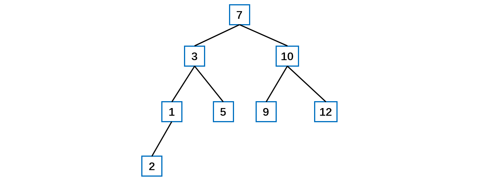

[TOC]

### 排序二叉树BST树

给定一个数列 (7, 3, 10, 12, 5, 1, 9)，要求能够高效的完成对数据的**查询和添加**。

**数组存储方式的分析**

优点：通过下标方式访问元素，速度快。**对于有序数组**，还可使用二分查找提高检索速度。
缺点：如果要检索具体某个值，或者插入值(按一定顺序)**会整体移动**，效率较低。可能还涉及到数组扩容，这中间的数据复制开销较大。

**链式存储方式的分析**

优点：在一定程度上对数组存储方式有优化 (比如：插入一个数值节点，只需要将插入节点，链接到链表中即可，
删除效率也很好)。
缺点：在进行检索查找时，效率仍然较低，比如(检索某个值，需要从头节点开始遍历) 。

**树存储方式的分析**

能提高数据**存储，读取**的效率,  比如利用 **二叉排序树**(Binary Sort Tree)，既可以保证数据的检索速度，同时也可以保证数据的插入，删除，修改的速度。


二叉排序树也可以称为二叉查找树。

对于二叉排序树的任何一个**非叶子节点**，要求**左子节点的值比当前节点的值小，右子节点的值比当前节点的值大**。

**特别说明**：如果有相同的值，可以将该节点放在左子节点或右子节点。




**删除结点**

三种情况：

1、删除叶子结点：如 2, 5，9，12。首先找到需要删除的结点 targetNode，确定目标 targetNode 的父结点 parentNode（还需要考虑是否存在 parentNode），确定 targetNode 是 parentNode 的左子结点还是右子结点。根据前面的情况来对应删除。

2、删除只有一棵子树的结点：如 1。首先找到需要删除的结点 targetNode，确定目标 targetNode 的父结点 parentNode（还需要考虑是否存在 parentNode）。确定 targetNode 是左子结点还是右子结点。再确定 targetNode 是 parentNode 的左子结点还是右子结点。此处就有四种组合，对应处理即可。

3、删除有两棵子树的结点，如 3，7，10。首先找到需要删除的结点 targetNode，确定目标 targetNode 的父结点 parentNode（还需要考虑是否存在 parentNode）。从 targetNode 的**右子树**找到**最小**的结点，将其值存储在临时变量中，删除该最小值结点，再将其值赋给 targetNode。

需要分三种情况写。

结点类

```java
/**
 * 结点类
 * @author cz
 */
@Data
public class Node {

    /**
     * 数据值
     */
    private int value;

    /**
     * 左右子结点
     */
    private Node leftNode;
    private Node rightNode;

    public Node(int value) {
        this.value = value;
    }

    @Override
    public String toString() {
        return "Node{" +
                "value=" + value +
                '}';
    }
}
```

下面是根据给定的数列构造二叉排序树的过程，添加结点没问题，但是删除的逻辑还有些问题。（没找出来，详见尚硅谷数据结构与算法 129 - 134 节）

```java
/**
 * 二叉排序树
 * @author cz
 */
public class BinarySortTree {


    public static void main(String[] args) {
        int[] array = {7, 3, 10, 12, 5, 1, 9};
        BinarySortTree binarySortTree = new BinarySortTree();
        for (int i = 0; i < array.length; i++) {
            binarySortTree.addNode(new Node(array[i]));
        }
        binarySortTree.midOrder(binarySortTree.getRootNode());
        binarySortTree.addNode(new Node(2));
        binarySortTree.midOrder(binarySortTree.getRootNode());
    }

    /**
     * 根结点
     */
    @Getter
    private Node rootNode;

    /**
     * 对外的添加节点的方法
     * @param newNode 新结点
     */
    public void addNode(Node newNode) {
        // 根结点为空
        if (rootNode == null) {
            rootNode = newNode;
        } else {
            addNode(rootNode, newNode);
        }
    }


    /**
     * 添加结点的方法
     * @param node 根结点
     * @param newNode 新结点
     */
    private void addNode(Node node, Node newNode) {

        // 新的结点为空
        if (newNode == null) {
            return;
        }

        // 传入的结点的值小于当前子树的根结点的值，放在左边
        if (newNode.getValue() < node.getValue()) {

            // 如果当前结点左子结点为null
            if (node.getLeftNode() == null) {
                node.setLeftNode(newNode);
            } else {
                // 递归向左子树添加
                addNode(node.getLeftNode(), newNode);
            }
        } else {
            // 传入的结点的值大于当前子树的根结点的值，放在右边
            if (node.getRightNode() == null) {
                node.setRightNode(newNode);
            } else {
                // 递归向右子树添加
                addNode(node.getRightNode(), newNode);
            }

        }
    }

    /**
     * 中序遍历树
     */
    private void midOrder(Node node) {

        if (node.getLeftNode() != null) {
            midOrder(node.getLeftNode());
        }

        System.out.println(node.toString());

        if (node.getRightNode() != null) {
            midOrder(node.getRightNode());
        }
    }

    /**
     * 删除一个结点
     * @param value 待删结点
     */
    private void deleteNode(int value) {
        deleteNode(rootNode, value);
    }

    /**
     * 删除结点
     *
     * 首先找到待删除的结点，然后找到待删除结点的父结点
     * 之后分成三种情况删除：待删结点为叶子结点，待删结点有两个叶子结点，待删结点有一个子结点
     */
    private void deleteNode(Node rootNode, int value) {

        if (rootNode == null) {
            return;
        } else {
            // 寻找待删结点
            Node targetNode = search(rootNode, value);
            if (targetNode == null) {
                return;
            }

            // 如果当前这棵二叉排序树只有一个结点直接删掉
            if (rootNode.getLeftNode() == null && rootNode.getRightNode() == null) {
                rootNode = null;
                return;
            }

            Node parentNode = searchParentNode(rootNode, value);

            // 说明待删结点是叶子结点
            if (targetNode.getLeftNode() == null && targetNode.getRightNode() == null) {
                // 判断待删结点是父结点的左结点还是右结点
                if (parentNode != null && parentNode.getLeftNode() != null && parentNode.getLeftNode().getValue() == value) {
                    parentNode.setLeftNode(null);
                } else if (parentNode != null && parentNode.getRightNode() != null && parentNode.getRightNode().getValue() == value){
                    parentNode.setRightNode(null);
                }

                // 说明待删结点是含两棵子树的结点
                // 从 targetNode 的右子树找到最小的结点，将其值存储在临时变量中，删除该最小值结点，再将其值赋给targetNode
            } else if (targetNode.getLeftNode() != null && targetNode.getRightNode() != null) {

                // 找到以待删结点的右子结点为根结点的排序二叉树的最小值
                deleteRightTreeMin(targetNode.getRightNode());

                // 剩下的情况就是含一颗子树的结点
            } else {
                // 如果要删除的结点有左子结点
                if (targetNode.getLeftNode() != null) {
                    // targetNode是parentNode的左子结点
                    if (parentNode != null && parentNode.getLeftNode().getValue() == value) {
                        parentNode.setLeftNode(targetNode.getLeftNode());
                    } else {
                        parentNode.setRightNode(targetNode.getLeftNode());
                    }
                } else {
                    // 如果要删除的结点有右子结点
                    if (parentNode != null && parentNode.getLeftNode().getValue() == value) {
                        parentNode.setLeftNode(targetNode.getRightNode());
                    } else {
                        parentNode.setRightNode(targetNode.getRightNode());
                    }
                }

            }
        }

    }

    /**
     * 返回以node为根结点的二叉排序树的最小结点的值并删除以node为根结点的二叉排序树的最小结点
     * @param node 根结点
     * @return 最小结点值
     */
    private int deleteRightTreeMin(Node node) {
        Node target = node;

        while (target.getLeftNode() != null) {
            target.setLeftNode(target.getLeftNode());
        }

        deleteNode(node, target.getValue());

        return target.getValue();
    }

    /**
     * 查找需要删除的结点
     * @param node 待删除结点
     * @param value 值
     * @return 结点
     */
    private Node search(Node node, int value) {
        if (node == null) {
            return null;
        }

        if (node.getValue() == value) {
            return node;
        } else if (value < node.getValue()) {
            // 查找值小于当前结点的值，往左子树递归查找

            // 如果左子结点为空直接找不到
            if (node.getLeftNode() == null) {
                return null;
            }
            // 递归左边查找
            return search(node.getLeftNode(), value);
        } else {
            // 查找值大于当前结点的值，往右子树递归查找
            if (node.getRightNode() == null) {
                return null;
            }
            return search(node.getRightNode(), value);
        }
    }

    /**
     * 找到待删除结点的父节点
     * @param node 根结点
     * @param value 待删结点值
     * @return 待删结点父节点
     */
    private Node searchParentNode(Node node, int value) {

        // 待删结点是当前结点的左子结点和右子结点的情况
        boolean isTargetNodeLeft = node.getLeftNode() != null && node.getValue() == value;
        boolean isTargetNodeRight = node.getRightNode() != null && node.getValue() == value;
        if ( isTargetNodeLeft || isTargetNodeRight) {
            return node;
        } else {
            // 如果当前结点左结点不为空，且当前值小于目标值
            // 往左递归
            if (value < node.getValue() && node.getLeftNode() != null) {
                return searchParentNode(node.getLeftNode(), value);
                // 往右递归
            } else if (value >= node.getValue() && node.getRightNode() != null) {
                return searchParentNode(node.getRightNode(), value);
            } else {
                // 没有找到父节点 如根结点
                return null;
            }
        }
    }

}
```


