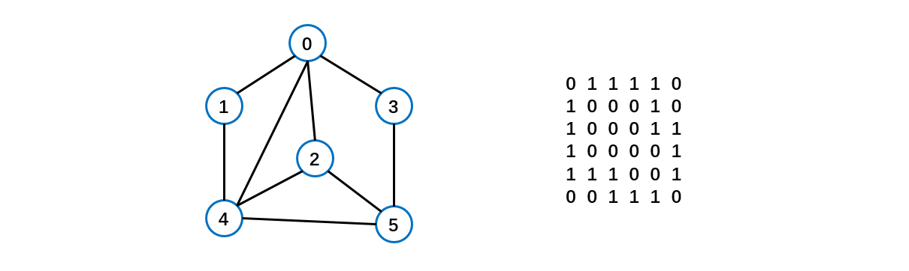
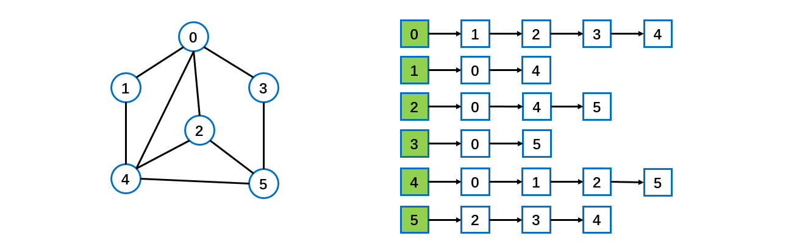

[TOC]

### 图

#### 概述

需要表示多对多的关系时， 这里我们就用到了图。

图是一种数据结构，其中结点可以具有零个或多个相邻元素。两个结点之间的连接称为**边**。
结点也可以称为**顶点**。

图的表示方式：

图的表示方式有两种：二维数组表示（邻接矩阵）；链表表示（邻接表）。

**邻接矩阵**是表示图形中**顶点之间相邻关系**的矩阵，对于 n 个顶点的图而言，矩阵是的 row 和 col 表示的是 1....n 个点。

邻接矩阵需要为每个顶点都分配 n 个边的空间，其实有很多边都是不存在,会造成空间的一定**损失**。

**邻接表**的实现只关心存在的边，不关心不存在的边。因此没有空间浪费，邻接表由**数组 + 链表**组成。

标号为 0 的结点的相关联的结点为 1 2 3 4。
标号为 1 的结点的相关联结点为0 4。
标号为 2 的结点相关联的结点为 0 4 5。

