[TOC]

### 网络安全

#### 1 网络安全问题概述

##### 1.1 计算机网络面临的安全性威胁

计算机网络上的通信面临以下两大类威胁：

**被动攻击和主动攻击**

**被动攻击**

- 指攻击者从网络上**窃听**他人的通信内容。
- 通常把这类攻击称为**截获**。
- 在被动攻击中，攻击者只是观察和分析某一个协议数据单元 PDU，以便了解所交换的数据的某种性质。但不干扰信息流。
- 这种被动攻击又称为流量分析 (traffic analysis)。

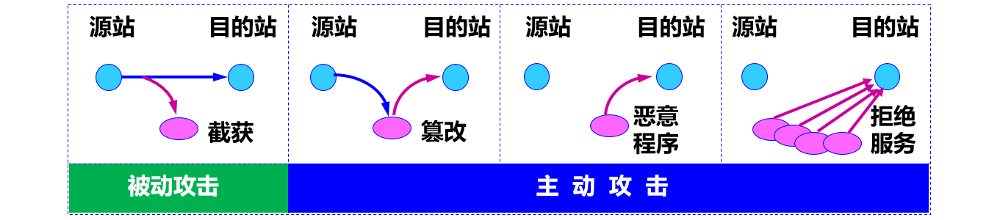

**主动攻击**主要有：

- **篡改**——故意篡改网络上传送的报文。这种攻击方式有时也称为更改报文流。
- **恶意程序**——种类繁多，对网络安全威胁较大的主要包括：计算机病毒、计算机蠕虫、特洛伊木马、逻辑炸弹、后门入侵、流氓软件等。
- **拒绝服务** **DoS**——指攻击者向互联网上的某个服务器不停地发送大量分组，使该服务器无法提供正常服务，甚至完全瘫痪。若从互联网上的成百上千的网站集中攻击一个网站，则称为分布式拒绝服务 DDoS。

**对策**

- 对于主动攻击，可以采取适当措施加以检测。
- 对于被动攻击，通常却是检测不出来的。
- 根据这些特点，可得出计算机网络通信安全的目标：
    （1）防止分析出报文内容和流量分析。
    （2）防止恶意程序。
    （3）检测更改报文流和拒绝服务。
- 对付被动攻击可采用各种数据加密技术。
- 对付主动攻击则需将加密技术与适当的鉴别技术相结合

**数据加密模型**

- 加密和解密用的**密钥K** (key) 是一串秘密的字符串（即比特串）。
- 明文通过加密算法 E  和加密密钥 K  变成密文。
- 接收端利用解密算法 D 运算和解密密钥 K  解出明文 X。解密算法是加密算法的**逆运算**。

- 加密密钥和解密密钥可以一样，也可以**不一样**。
- 密钥通常由密钥中心提供。
- 当密钥需要向远地传送时，一定要通过另一个安全信道。

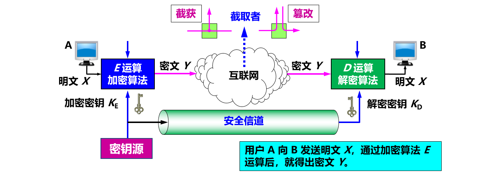

#### 2 两类密码体制

##### 2.1 对称密钥密码体制

所谓常规密钥密码体制，即**加密密钥与解密密钥是相同的密码体制**。这种加密系统又称为**对称密钥**系统。

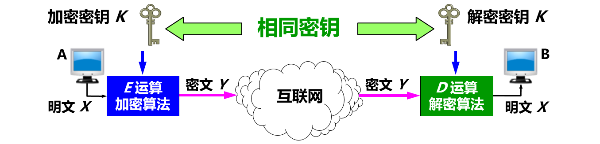

- 数据加密标准 DES 属于**对称密钥密码体制**，是一种**分组密码**。
- 在加密前，先对整个明文进行分组。每一个组长为 64 位。
- 然后对每一个 64 位 二进制数据进行加密处理，产生一组 64 位密文  数据。
- 最后将各组密文串接起来，即得出整个的密文。
- 使用的密钥为 64 位（**实际密钥长度为 56 位**，有 8 位用于奇偶校验)。 

- DES 的**保密性仅取决于对密钥的保密**，其**算法是公开**的。
- 目前较为严重的问题是 DES 的密钥的长度。
- 现在已经设计出搜索 DES 密钥的专用芯片。56位 DES 已不再认为是安全的了。 

**三重 DES**

- 使用两个 56 位的密钥。
- 把一个 64 位明文用一个密钥加密，再用另一个密钥解密，然后再使用第一个密钥加密。

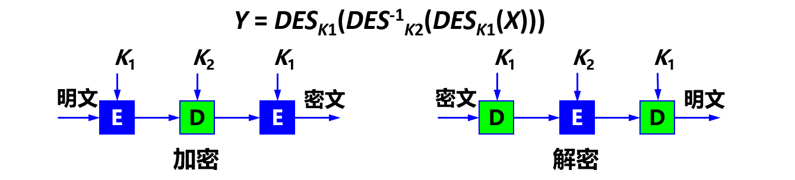

##### 2.2 公钥密码体制

- 公钥密码体制（又称为公开密钥密码体制）使用**不同的加密密钥与解密密钥**，是一种“由已知加密密钥推导出解密密钥在计算上是不可行的”密码体制。 
- 公钥密码体制产生的主要原因：
    （1）常规密钥密码体制的密钥分配问题。
    （2）对**数字签名**的需求。

- 在公钥密码体制中，**加密密钥 PK**（public key，即公钥）是向公众**公开**的，而**解密密钥 SK**（secret key，即私钥或秘钥）则是需要**保密**的。
- 加密算法 E 和解密算法 D 也都是**公开**的。
- 虽然私钥 SK 是由公钥 PK 决定的，但却**不能**根据 PK 计算出 SK。 

**公钥算法**

- 密钥对**产生器**产生出接收者 B 的一对密钥：**加密密钥 PKB 和解密密钥 SKB** 。
- 加密密钥 PKB 就是接收者 B 的**公钥**，它向公众**公开**。
- 解密密钥 SKB 就是接收者 B 的**私钥**，对其他人都**保密**。
- 发送者 A 用 B 的公钥 PKB 对明文 X 加密（E 运算）后，接收者 B 用自己的私钥 SKB 解密（D 运算），即可恢复出明文。

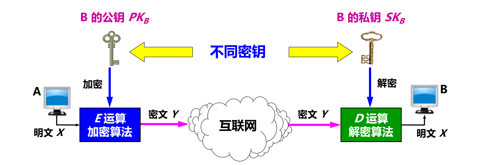

**公开密钥与对称密钥的区别**

- 在使用**对称密钥**时，由于双方使用同样的密钥，因此在通信信道上可以进行**一对一的双向保密通信**，每一方既可用此密钥加密明文，并发送给对方，也可接收密文，用同一密钥对密文解密。这种保密通信仅限于持有此密钥的双方（如再有第三方就不保密了）。
- 在使用**公开密钥**时，在通信信道上可以是**多对一的单向保密通信**。

#### 3 数字签名

- 用于证明真实性。
- 数字签名必须保证以下三点：
    （1）报文鉴别——接收者能够核实发送者对报文的签名（**证明来源**）；
    （2）报文的完整性——发送者事后不能抵赖对报文的签名（**防否认**）；
    （3）不可否认——接收者不能伪造对报文的签名（**防伪造**）。
- 现在已有多种实现各种数字签名的方法。**但采用公钥算法更容易实现**。 

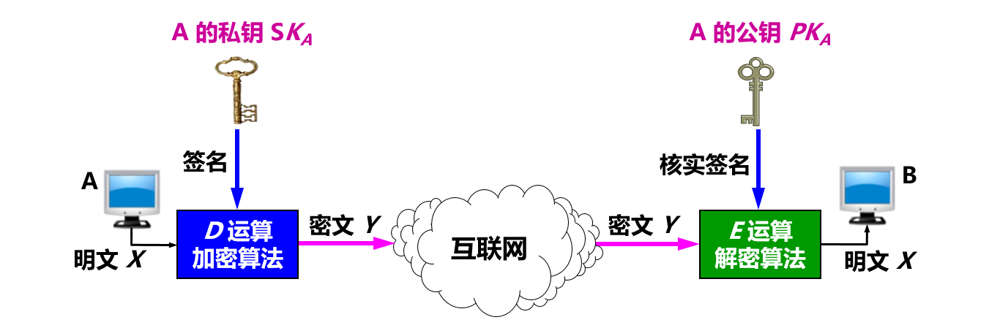

**基于公钥的数字签名的实现**

因为除 A 外没有别人能具有 A 的私钥，所以除 A 外没有别人能产生这个密文。因此 B 相信报文 X 是 A 签名发送的。
若 A 要抵赖曾发送报文给 B，B 可将明文和对应的密文出示给第三者。第三者很容易用 A 的公钥去证实 A 确实发送 X 给 B。
反之，若 B 将 X 伪造成 X'，则 B 不能在第三者前出示对应的密文。这样就证明了 B 伪造了报文。 

**具有保密性的数字签名**

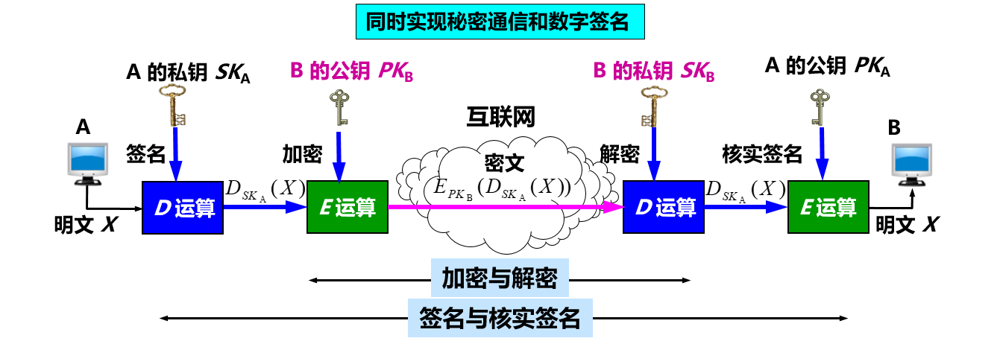

#### 4 鉴别

在信息的安全领域中，对付**被动攻击**的重要措施是**加密**，而对付**主动攻击**中的**篡改和伪造**则要用**鉴别** (authentication)。
报文鉴别使得通信的接收方能够验证所收到的报文（发送者和报文内容、发送时间、序列等）的**真伪**。
使用**加密**就可达到**报文鉴别**的目的。但在网络的应用中，许多报文**并不需要**加密。应当使接收者能用很**简单的方法**鉴别报文的真伪。 

**鉴别分类**

- **报文鉴别**：即鉴别所收到的报文的确是报文的**发送者**所发送的，而不是其他人伪造的或篡改的。这就包含了**端点鉴别和报文完整性**的鉴别。
- **实体鉴别**：仅仅鉴别发送报文的**实体**。实体可以是一个人，也可以是一个进程（客户或服务器）。这就是**端点鉴别**。

##### 4.1 报文鉴别

许多报文**并不需要加密**，但却需要**数字签名**，以便让报文的**接收者**能够鉴别报文的**真伪**。然而对很长的报文进行数字签名会使计算机增加很大的**负担**（需要进行很长时间的运算）。当我们传送不需要加密的报文时，应当使接收者能用**很简单**的方法鉴别报文的真伪。

###### 1. 密码散列函数

**数字签名**就能够实现对报文的**鉴别**。但这种方法有一个很大的**缺点**：对较长的报文（这是很常见的）进行数字签名会使计算机增加非常大的负担，因为这需要**较多的时间**来进行运算。
**密码散列函数** (cryptographic hash function)是一种**相对简单**的对**报文进行鉴别**的方法。

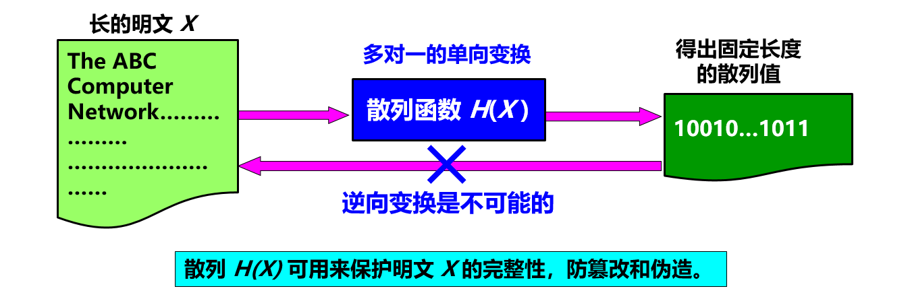

散列函数的输入长度可以很长，但其**输出长度则是固定**的，并且较短。散列函数的输出叫做**散列值**，或称为散列。
不同的散列值肯定对应于不同的输入，但不同的输入却可能得出相同的散列值。这就是说，散列函数的输入和输出并非一一对应，而是**多对一**的。在密码学中使用的散列函数称为密码散列函数。具有**单向性**的特点。要找到两个不同的报文，它们具有同样的密码散列函数输出，在计算上是不可行的。也就是说，**密码散列函数实际上是一种单向函数** (one-way function)。

###### 2.使用的密码散列函数 MD5 和 SHA

通过许多学者的不断努力，已经设计出一些**实用的密码散列函数**（或称为散列算法），其中最出名的就是 **MD5 和 SHA-1**。SHA-1比 MD5 更安全，但计算起来却比 MD5 要慢些。

**①MD5报文摘要算法**

MD5 是报文摘要 MD (Message Digest) 的第 5 个版本。MD5 的设计者 Rivest 曾提出一个猜想，即根据给定的 MD5 报文摘要代码，要找出一个与原来报文有相同报文摘要的另一报文，其难度在计算上几乎是不可能的。
基本思想：用足够复杂的方法将报文的数据位充分“弄乱”，报文摘要代码中的**每一位**都与**原来报文中的每一位有关**。

MD5 实现的报文鉴别**可以防篡改**，但**==不能防伪造==**，因而不能真正实现报文鉴别。

**计算步骤**

1. 附加：把任意长的报文按模 264 计算其余数（64位），追加在报文的后面（长度项）。
2. 填充：在报文和长度项之间填充 1～512 位，使得填充后的总长度是 512 的整数倍。填充的首位是 1，后面都是 0。

3. 分组：把追加和填充后的报文分割为一个个 512 位的数据块，每个 512 位的报文数据再分成 4 个 128 位的数据块。
4. 计算：将 4 个 128 位的数据块依次送到不同的散列函数进行 4 轮计算。每一轮又都按 32 位的小数据块进行复杂的运算。一直到最后计算出 MD5 报文摘要代码（128 位）。

**② SHA 安全散列算法 **

SHA 比 MD5 更安全，已制定 SHA-1、SHA-2、 SHA-3 等版本。现在用的基本都是高版本的。

###### 3.报文鉴别码 MAC

MD5 实现的报文鉴别可以防篡改，但**不能防伪造**，因而不能真正实现报文鉴别。

例如：

(1) 入侵者创建了一个伪造的报文 M，然后计算出其散列 H(M )，并把拼接有散列的扩展报文冒充 A 发送给 B。
(2) B 收到扩展的报文 (M, H(M )) 后， 通过散列函数的运算，计算出收到的报文 MR 的散列 H(MR)。
(3) 若 H(M ) = H(MR)，则 B 就会误认为所收到的伪造报文就是 A 发送的。

为防范上述攻击，可以**对散列进行一次加密**。散列加密后的结果叫做**报文鉴别码 MAC** (Message Authentication Code)。由于入侵者不掌握密钥 K，所以入侵者无法伪造 A 的报文鉴别码 MAC，因而无法伪造 A 发送的报文。这样就**完成了对报文的鉴别**。

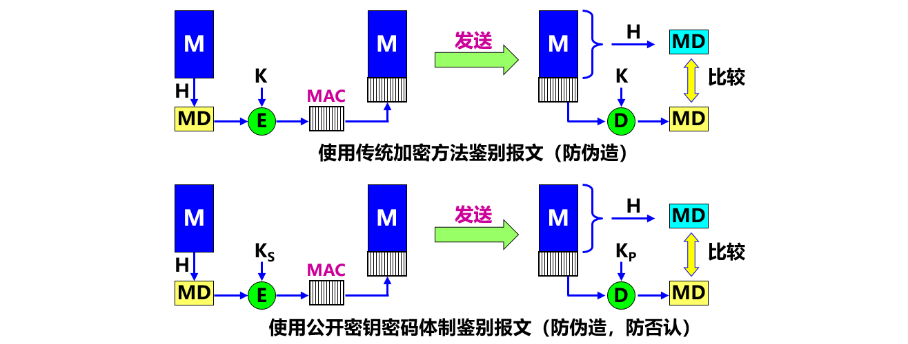

所以现在**整个**的报文是**不需要加密**的。
虽然从散列 H 导出报文鉴别码 MAC 需要加密算法，但由于散列 H 的长度通常都远远小于报文 X 的长度，因此这种加密**不会消耗**很多的计算资源。因此，使用**鉴别码 MAC 就能够很方便地保护报文的完整性**。

##### 4.2 实体鉴别

实体鉴别与报文鉴别不同。报文鉴别是对**每一个**收到的**报文**都要鉴别报文的发送者。**实体鉴别**是在系统接入的全部持续**时间内**对和自己通信的对方实体**只需验证一次**。 

**使用不重数进行鉴别**

在使用公钥密码体制时，可以对**不重数**进行签名鉴别。
B 用其**私钥对不重数** **RA** 进行签名后发回给 A。A 用 B 的公钥核实签名。如能得出自己原来发送的不重数 **RA**，就核实了和自己通信的对方的确是 B。
同样，A 也用自己的**私钥对不重数** **RB** 进行签名后发送给 B。B 用 A 的公钥核实签名，鉴别了 A 的身份。
公钥密码体制虽然不必在互相通信的用户之间秘密地分配共享密钥，但**仍有**受到攻击的可能。

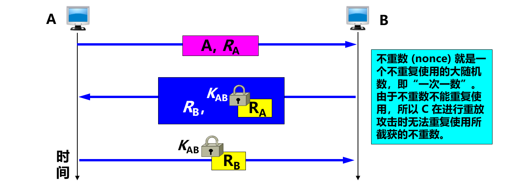

如下面的中间人攻击。A 向 B 发送“我是 A”的报文，并给出了自己的身份。此报文被 “中间人” C 截获，C 把此报文原封不动地转发给 B。B 选择一个不重数 RB 发送给 A，但同样被 C 截获后也照样转发给 A。
中间人 C 用自己的私钥 SKC 对 RB 加密后发回给 B，使 B 误以为是 A 发来的。A 收到 RB 后也用自己的私钥 SKA 对 RB 加密后发回给 B，中途被 C 截获并丢弃。B 向 A 索取其公钥，此报文被 C 截获后转发给 A。

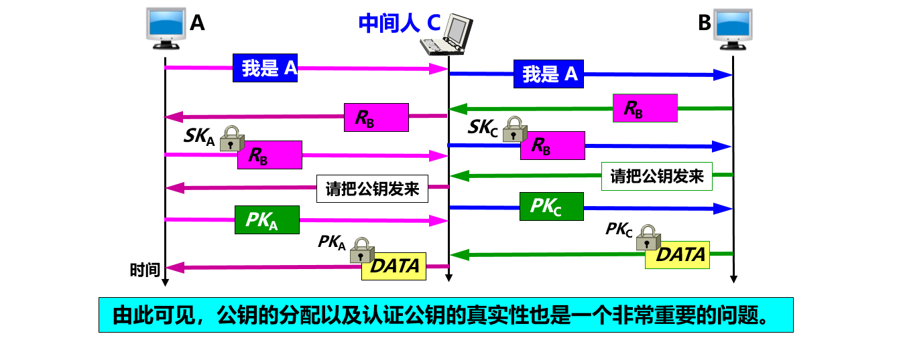

**使用公钥体制进行不重数鉴别**

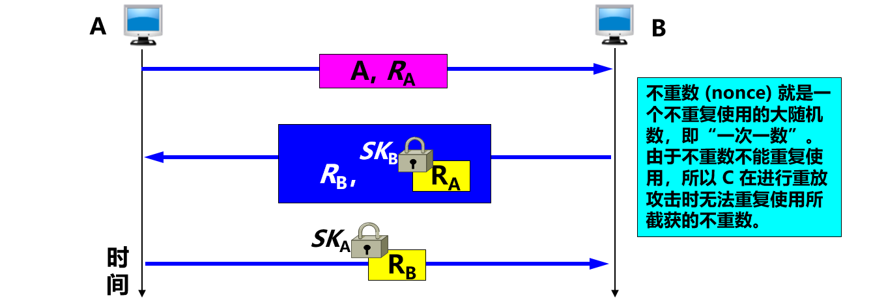

#### 5 密钥分配

##### 5.5 对称密钥的分配

目前常用的密钥分配方式是设立**密钥分配中心 KDC** (Key Distribution Center)。KDC 是大家都信任的机构，其任务就是给需要进行秘密通信的用户临时分配一个会话密钥（**仅使用一次**）。假设用户 A 和 B 都是 KDC 的登记用户，并已经在 KDC 的服务器上安装了各自和 KDC 进行通信的主密钥（master key）KA 和 KB。 “主密钥”可简称为“密钥”。

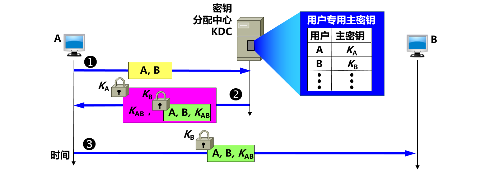

说明：为防止重放攻击，KDC 还可在报文中加入**时间戳**。会话密钥 KAB 是**一次性**的，因此保密性较高。KDC 分配给用户的密钥 KA 和 KB，应**定期更换**，以减少攻击者破译密钥的机会。

目前最出名的**密钥分配协议是 Kerberos V5**。

##### 5.6 公钥的分配

在公钥密码体制中，如果**每个用户都具有其他用户的公钥**，就可实现安全通信。但不能随意公布用户的公钥，因为无法防止假冒和欺骗。使用者也无法确定公钥的真正拥有者。

需要有一个值得信赖的机构——**即认证中心 CA** (Certification Authority)，来将**公钥**与其对应的**实体**（人或机器）进行**绑定** (binding)。每个**实体**都有 **CA  发来的证书** (certificate)，里面有公钥及其拥有者的标识信息。此证书被 CA 进行了数字签名，是不可伪造的，可以信任。证书是一种身份证明，用于解决**信任问题**。

#### 6 ==安全协议==

##### 6.1 网络层安全协议

IP 安全性很差：

- 没有为通信提供良好的数据源鉴别机制；
- 没有为数据提供强大的完整性保护机制；
- 没有为数据提供任何机密性保护；
- 在设计和实现上存在安全漏洞，使各种攻击有机可乘。例如：攻击者很容易构造一个包含虚假地址的 IP 数据报。

- IP 几乎不具备任何安全性，**不能保证**：数据机密性、数据完整性、数据来源认证。
- 由于其在设计和实现上存在安全漏洞，使各种攻击有机可乘。例如：攻击者很容易构造一个包含虚假地址的 IP 数据报。
- **IPsec** 提供了标准、健壮且包含广泛的机制保证 IP 层安全。

###### **1. IPsec协议族概述**

IPsec 就是**“IP 安全 (security)”**的缩写。IPsec 并不是一个单个的协议，而是能够在 IP 层提供互联网通信安全的协议族。IPsec 是个框架，它允许通信双方选择合适的算法和参数（例如，密钥长度）。为保证互操作性，IPsec 还包含了所有 IPsec 的实现都必须有的一套**加密算法**。

**组成**

（1）**IP 安全数据报格式**的两个协议

- 鉴别首部 AH (Authentication Header) 协议
- **封装安全有效载荷 ESP** (Encapsulation Security Payload) 协议

（2）**有关加密算法**的三个协议（在此不讨论）
（3）**互联网密钥交换 IKE** (Internet Key Exchange) 协议

AH 协议提供源点鉴别和数据完整性，但不能保密。ESP 协议比 AH 协议复杂得多，它提供源点鉴别、数据完整性和保密。**使用 ESP 或 AH 协议的 IP 数据报称为 ==IP 安全数据报==（或 ==IPsec数据报==）**。Ipsec 支持 IPv4 和 IPv6。AH 协议的功能都已包含在 ESP 协议中。

###### **2. IP安全数据报的工作方式**

**①运输方式**

在**==整个运输层报文段==**的前后分别添加若干**控制信息**，再加上 IP 首部，**构成 IP 安全数据报**。适合于主机到主机之间的安全传送。 需要使用 IPsec 的主机都运行 IPsec 协议。

**②隧道方式**

在**==原始的 IP 数据报==**的前后分别添加若干**控制信息**，再加上新的 IP 首部，构成一个 IP 安全数据报。需要在 IPsec 数据报所经过的所有路由器上都运行 IPsec 协议。隧道方式常用来**实现虚拟专用网 VPN**的加密。

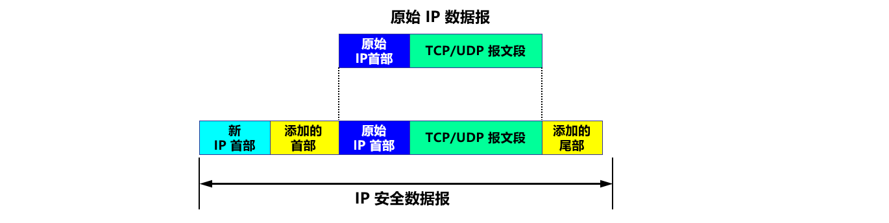

无论使用哪种方式，最后得出的 IP 安全数据报的 **IP 首部都是不加密**的。所谓“安全数据报”是指数据报的**数据部分是经过加密**的，并能够被鉴别的。通常把数据报的数据部分称为数据报的有效载荷 (payload)。

###### 3. 安全关联

在发送 IP 安全数据报之前，在源实体和目的实体之间必须创建一条**网络层的逻辑连接**。此逻辑连接叫做**安全关联** SA (Security Association) 。**IPsec** 就把传统互联网无连接的网络层**转换为具有逻辑连接的网络层**。 

安全关联是从源点到终点的**单向连接**，它能够提供安全服务。在安全关联 SA 上传送的就是 **IP 安全数据报**。
如要进行双向安全通信，则两个方向都需要建立安全关联。若 n 个员工进行双向安全通信，一共需要创建 (2 + 2n ) 条安全关联 SA。

下图所示为路由器 R1到 R2 的安全关联 SA。

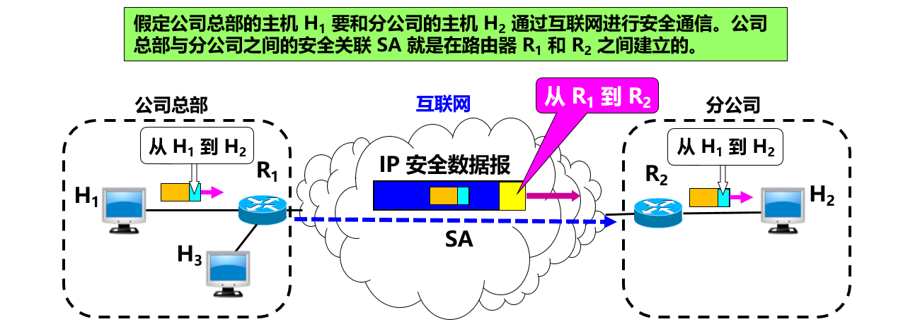

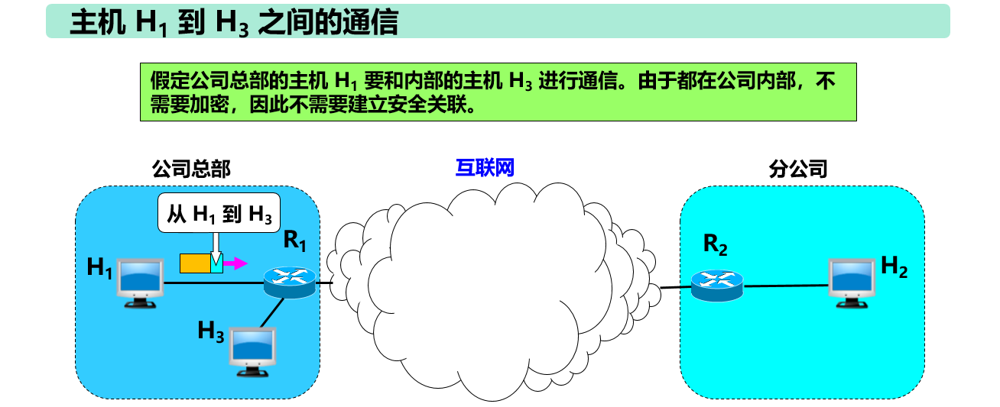

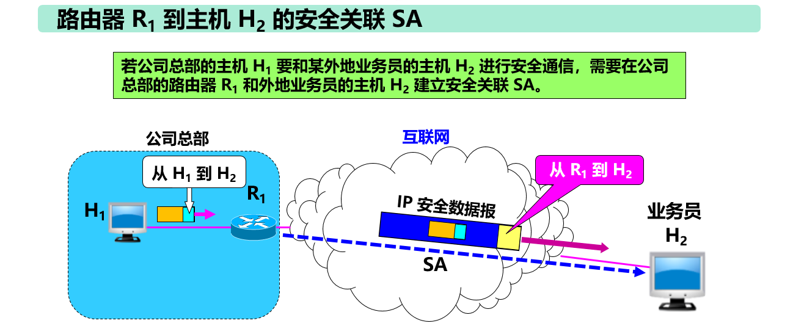

###### 4. IP 安全数据报的格式

**隧道**方式下的 IP 安全数据报的格式

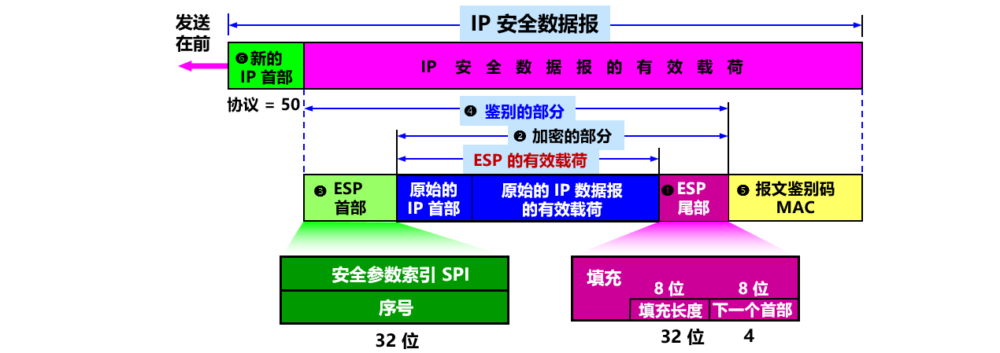

##### 6.2 ==运输层安全协议==

###### 1. 概述

现在广泛使用的有以下两个协议： 

- **安全套接字层协议 SSL** (Secure Socket Layer) 
- **运输层安全 TLS 协议** (Transport Layer Security)  

安全套接层 SSL 由 Netscape 于 1994 年开发，广泛应用于基于万维网的各种网络应用（但不限于万维网应用）。
SSL 作用在端系统应用层的 **HTTP 和运输层**之间，在 **TCP 之上建立起一个安全通道**，为通过 **TCP 传输的应用层**数据提供安全保障。
1999 年，IETF 在 SSL 3.0 **基础**上推出了**传输层安全标准 TLS**，为**所有基于 TCP 的网络应用**提供安全数据传输服务。

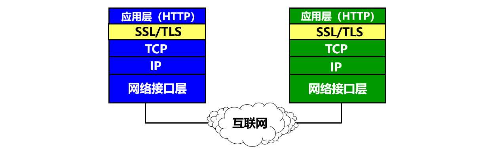

在发送方，SSL 接收**应用层**的数据，对数据进行加密，然后把加了密的数据送往 **TCP 套接字**。在接收方，SSL 从 TCP 套接字读取数据，解密后把数据交给应用层。 

运输层不使用安全协议和**使用安全协议**的对比如下图所示。

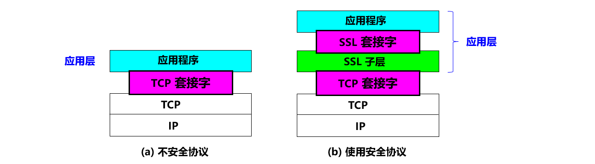

- SSL / TLS 建立在**可靠的 TCP** 之上，与应用层协议独立无关。
- SSL / TLS 已被所有常用的浏览器和万维网服务器所支持。
- SSL / TLS **基本目标**：实现两个应用实体之间的安全可靠通信。

应用层使用 SSL 最多的就是 **HTTP**，但 SSL 并非仅用于 HTTP，而是可用于**任何应用层**的协议。
应用程序 HTTP 调用 SSL 对整个网页进行加密时，网页上会提示用户，在网址栏原来显示 http 的地方，现在变成了 **https**。在 http 后面加上的 s 代表 security，表明现在使用的是提供安全服务的 HTTP 协议（TCP 的 HTTPS 端口号是 443，而不是平时使用的端口号 80）。

**SSL  提供的安全服务**

- **SSL 服务器鉴别**，允许用户证实服务器的身份。支持 SSL 的客户端 通过验证来自服务器的证书，来鉴别服务器的真实身份并获得服务器的公钥。
- **SSL 客户鉴别**，SSL 的可选安全服务，允许服务器证实客户的身份。
- **加密的 SSL 会话**，对客户和服务器间发送的所有报文进行加密，并检测报文是否被篡改。

###### **2. SSL 安全会话建立过程**

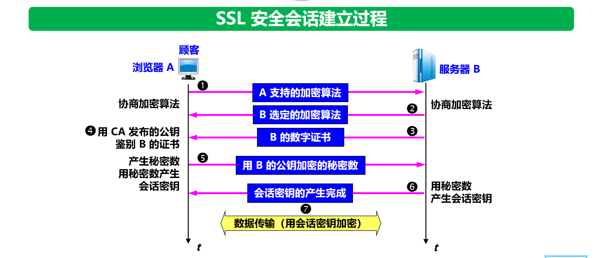

1. 协商加密算法。 ①浏览器 A 向服务器 B 发送浏览器的 SSL 版本号和一些可选的加密算法。 ② B 从中选定自己所支持的算法（如 RSA），并告知 A。
2. 服务器鉴别。 ③ 服务器 B 向浏览器 A 发送包含其 RSA 公钥的数字证书。 ④ A 使用该证书的认证机构 CA 公开发布的RSA公钥对该证书进行验证。
3. 会话密钥计算。由浏览器 A 随机产生一个秘密数。 ⑤ 用服务器 B 的 RSA 公钥进行加密后发送给 B。 ⑥ 双方根据协商的算法产生共享的对称会话密钥。
4. 安全数据传输。 ⑦ 双方用会话密钥加密和解密它们之间传送的数据并验证其完整性。

##### 6.3 应用层安全协议

本节仅讨论应用层中有关**电子邮件**的安全协议。发送电子邮件是个即时的行为。发送方 A 和接收方 B 并不会为此而建立任何会话。电子邮件安全协议就应当为每种加密操作定义相应的算法，以及密钥管理、鉴别、完整性保护等方法。

#### 7  系统安全：防火墙与入侵检测

##### 7.1 防火墙

防火墙是由软件、硬件构成的系统，是一种特殊编程的**路由器**，用来在两个网络之间实施访问控制策略。
访问控制策略是由使用防火墙的单位自行制订的，为的是可以最适合本单位的需要。防火墙内的网络称为“可信的网络”(trusted network)，而将外部的互联网称为“不可信的网络”(untrusted network)。防火墙可用来解决**内联网和外联网**的安全问题。

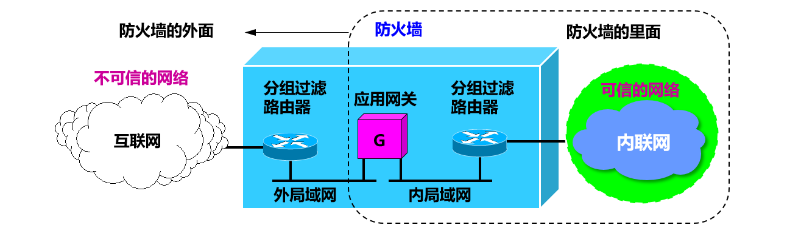

防火墙的功能有两个：**阻止和允许**。

- “阻止”就是阻止某种类型的通信量通过防火墙（从外部网络到内部网络，或反过来）。
- “允许”的功能与“阻止”恰好相反。

防火墙必须能够识别各种类型的通信量。不过在大多数情况下防火墙的主要功能是“阻止”。

防火墙技术分为一般两类：

**分组过滤路由器**

- 是一种具有分组过滤功能的路由器，它根据过滤规则对进出内部网络的分组执行转发或者丢弃（即过滤）。过滤规则基于分组的网络层或运输层首部的信息，例如：源/目的 IP 地址、源/目的端口、协议类型（TCP 或 UDP）等。
- 分组过滤可以是无状态的，即独立地处理每一个分组。也可以是有状态的，即要跟踪每个连接或会话的通信状态，并根据这些状态信息来决定是否转发分组。
- 简单高效，对用户透明，但不能对高层数据进行过滤。

**应用网关也称为代理服务器 (proxy server)**

- 它在应用层通信中扮演报文中继的角色。
- 每种网络应用需要一个应用网关。
- 在应用网关中，可以实现基于应用层数据的过滤和高层用户鉴别。
- 所有进出网络的应用程序报文都必须通过应用网关。
- 应用网关也有一些缺点：每种应用都需要一个不同的应用网关；在应用层转发和处理报文，处理负担较重；对应用程序不透明，需要在应用程序客户端配置应用网关地址。

##### 7.2 入侵检测

防火墙试图在入侵行为发生之前阻止所有可疑的通信。**入侵检测系统 IDS** (Intrusion Detection System) 能够在入侵已经开始，但还没有造成危害或在造成更大危害前，及时检测到入侵，以便尽快阻止入侵，把危害降低到最小。 

IDS 对进入网络的分组执行深度分组检查，当观察到可疑分组时，向网络管理员发出告警或执行阻断操作（由于 IDS 的“误报”率通常较高，多数情况不执行自动阻断）。
IDS 能用于**检测多种网络攻击**，包括网络映射、端口扫描、DoS 攻击、蠕虫和病毒、系统漏洞攻击等。

