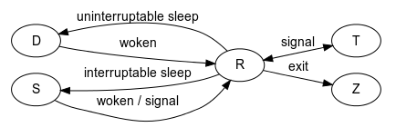

[TOC]

## Linux服务管理

### Linux 进程管理

#### 查看进程

##### 1. ps

查看某个时间点的**进程信息**

示例一：查看自己的进程

```sh
# ps -l
```

示例二：查看系统所有进程

```sh
# ps aux
```

示例三：查看**特定的进程**

```sh
# ps aux | grep threadx
```

##### 2. pstree

查看**进程树**

示例：查看所有进程树

```sh
# pstree -A
```

##### 3. top

**实时显示进程信息**

示例：两秒钟刷新一次

```sh
# top -d 2
```

##### 4. netstat

查看**占用端口的进程**

示例：查看特定端口的进程

```sh
# netstat -anp | grep port
```

----

#### 进程状态

| 状态 | 说明                                                         |
| :--: | ------------------------------------------------------------ |
|  R   | running or runnable (on run queue)                           |
|  D   | uninterruptible sleep (usually I/O)                          |
|  S   | interruptible sleep (waiting for an event to complete)       |
|  Z   | zombie (terminated but not reaped by its parent)             |
|  T   | stopped (either by a job control signal or because it is being traced) |



---

#### SIGCHLD

当一个子进程改变了它的状态时（停止运行，继续运行或者退出），有两件事会发生在父进程中：

- 得到 **SIGCHLD** 信号；
- waitpid() 或者 wait() 调用会返回。

其中子进程发送的 SIGCHLD 信号包含了子进程的信息，比如进程 ID、进程状态、进程使用 CPU 的时间等。

在子进程退出时，它的进程描述符不会立即释放，这是为了让父进程得到子进程信息，父进程通过 wait() 和 waitpid() 来获得一个已经退出的子进程的信息。


---

#### wait()

```c
pid_t wait(int *status)
```

父进程调用 wait() 会一直阻塞，直到收到一个子进程退出的 SIGCHLD 信号，之后 wait() 函数会销毁子进程并返回。

如果成功，返回被收集的子进程的进程 ID；如果调用进程没有子进程，调用就会失败，此时返回 -1，同时 errno 被置为 ECHILD。

参数 status 用来保存被收集的子进程退出时的一些状态，如果对这个子进程是如何死掉的毫不在意，只想把这个子进程消灭掉，可以设置这个参数为 NULL。

----

#### waitpid()

```c
pid_t waitpid(pid_t pid, int *status, int options)
```

作用和 wait() 完全相同，但是多了两个可由用户控制的参数 pid 和 options。

pid 参数指示一个子进程的 ID，表示只关心这个子进程退出的 SIGCHLD 信号。如果 pid=-1 时，那么和 wait() 作用相同，都是关心所有子进程退出的 SIGCHLD 信号。

options 参数主要有 WNOHANG 和 WUNTRACED 两个选项，WNOHANG 可以使 waitpid() 调用变成非阻塞的，也就是说它会立即返回，父进程可以继续执行其它任务。

----

#### 孤儿进程

一个**父进程**退出，而它的一个或多个子进程还在运行，那么这些子进程将成为孤儿进程。

孤儿进程将被 **init 进程**（进程号为 1）所收养，并由 init 进程对它们完成状态收集工作。

由于孤儿进程会被 init 进程收养，所以孤儿进程不会对系统造成危害。

----

#### 僵尸进程

一个子进程的进程描述符在子进程退出时不会释放，只有当父进程通过 wait() 或 waitpid() 获取了子进程信息后才会释放。如果子进程退出，而父进程并没有调用 wait() 或 waitpid()，那么子进程的**进程描述符**仍然保存在系统中，这种进程称之为僵尸进程。

僵尸进程通过 ps 命令显示出来的状态为 **Z（zombie）**。

系统所能使用的进程号是有限的，如果产生大量僵尸进程，将因为没有可用的进程号而导致系统不能产生新的进程。

要**消灭**系统中大量的僵尸进程，只需要将其**父进程**杀死，此时僵尸进程就会变成孤儿进程，从而被 init 进程所收养，这样 init 进程就会释放所有的僵尸进程所占有的资源，从而结束僵尸进程。

----


