[TOC]

## Redis

Redis 指令参考：http://redisdoc.com/index.html

Redis 安装与启动：https://www.cnblogs.com/y896926473/articles/9434404.html

可以用 Docker 快速搭建 Redis 服务器。

Redis 配置在配置文件 redis.conf 中。可以配置端口，持久化方式、日志等。

redis.conf 文件中的 bind 值默认为 127.0.0.1，此时只能供本机连接，需要改成服务器自己的 IP 地址外部才能连接。还需要把 protected-mode 改为 no。


### 一、概述

Redis 是速度非常快的**非关系型（NoSQL）内存键值数据库**，可以存储键和五种不同类型的值之间的映射。

**==键==的类型只能为==字符串==，==值==支持五种数据类型：==字符串、列表、集合、散列表、有序集合==**。

Redis 支持很多特性，例如将内存中的数据持久化到硬盘中，使用复制来扩展读性能，使用分片来扩展写性能。


### 二、数据类型

|  数据类型  |        可以存储的值        |                             操作                             |
| :--------: | :------------------------: | :----------------------------------------------------------: |
| **STRING** |   字符串、整数或者浮点数   | 1. 对整个字符串或者字符串的其中一部分执行操作 <br/> 2.对整数和浮点数执行自增或者自减操作 |
|  **LIST**  |            列表            | 1. 从两端**压入或者弹出**元素 <br/> 2. 对单个或者多个元素  <br/>3.进行修剪，只保留一个范围内的元素 |
|  **SET**   |        **无序**集合        | 1. 添加、获取、移除单个元素 <br/>2. 检查一个元素是否存在于集合中 <br/>3.计算交集、并集、差集<br/> 4.从集合里面随机获取元素 |
|  **HASH**  | 包含**键值对**的无序散列表 | 1. 添加、获取、移除单个键值对  <br/>2. 获取所有键值对 <br/> 3. 检查某个键是否存在 |
|  **ZSET**  |        **有序集合**        | 1. 添加、获取、删除元素 <br/> 2. 根据分值范围或者成员来获取元素  <br/>3.计算一个键的排名 |

> [What Redis data structures look like](https://redislabs.com/ebook/part-1-getting-started/chapter-1-getting-to-know-redis/1-2-what-redis-data-structures-look-like/)

---

#### 1. STRING

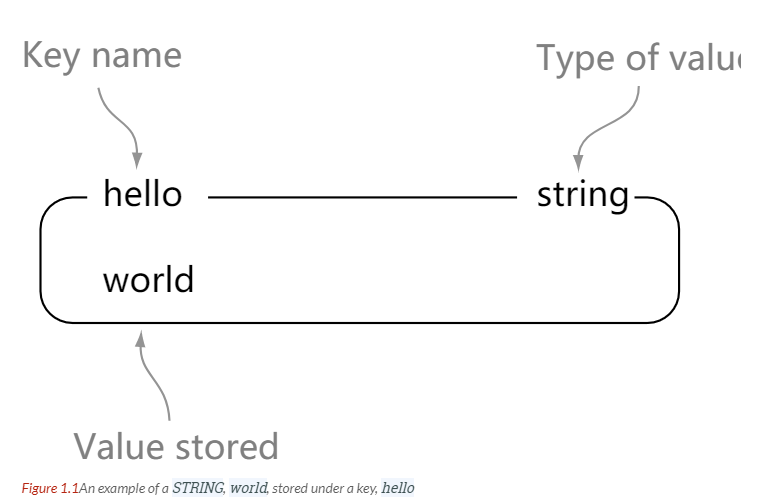

```html
> set hello world
OK
> get hello
"world"
> del hello
(integer) 1
> get hello
(nil)
```

----

#### 2. LIST

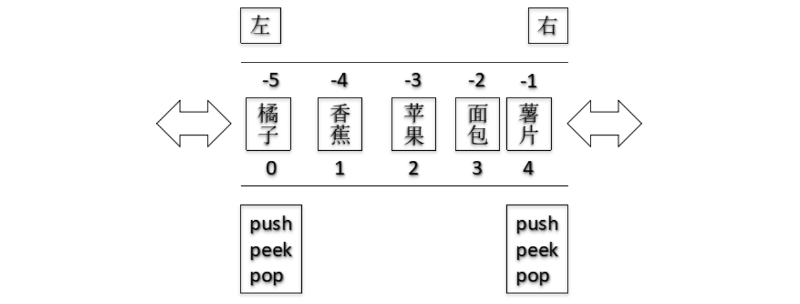


```html
> rpush list-key item
(integer) 1
> rpush list-key item2
(integer) 2
> rpush list-key item
(integer) 3

> lrange list-key 0 -1
1) "item"
2) "item2"
3) "item"

> lindex list-key 1
"item2"

> lpop list-key
"item"

> lrange list-key 0 -1
1) "item2"
2) "item"
```

----

#### 3. SET

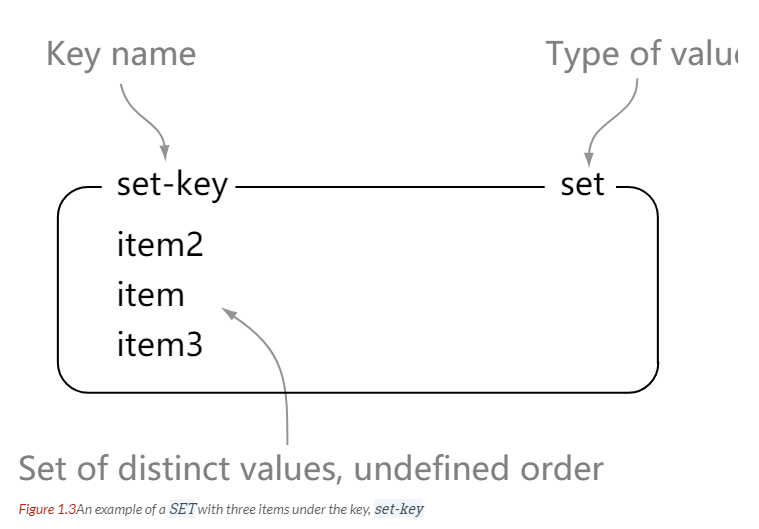

```html
> sadd set-key item
(integer) 1
> sadd set-key item2
(integer) 1
> sadd set-key item3
(integer) 1
> sadd set-key item
(integer) 0

> smembers set-key
1) "item"
2) "item2"
3) "item3"

> sismember set-key item4
(integer) 0
> sismember set-key item
(integer) 1

> srem set-key item2
(integer) 1
> srem set-key item2
(integer) 0

> smembers set-key
1) "item"
2) "item3"
```

-----

#### 4. HASH

结构像下面这样，KEY 里面的 value 才包含真正的 key 和 value。

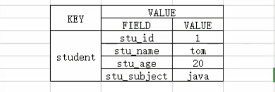

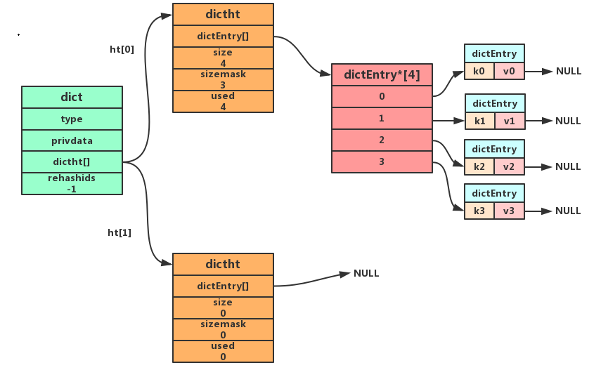

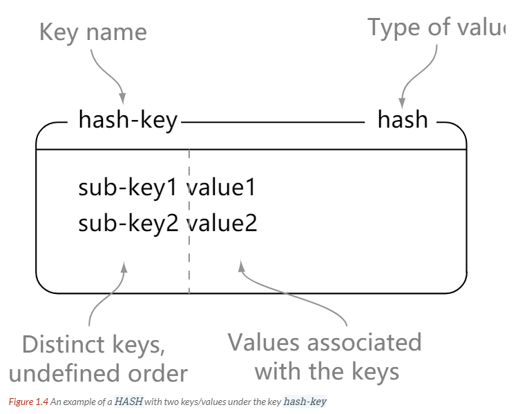


```html
> hset hash-key sub-key1 value1
(integer) 1
> hset hash-key sub-key2 value2
(integer) 1
> hset hash-key sub-key1 value1
(integer) 0

> hgetall hash-key
1) "sub-key1"
2) "value1"
3) "sub-key2"
4) "value2"

> hdel hash-key sub-key2
(integer) 1
> hdel hash-key sub-key2
(integer) 0

> hget hash-key sub-key1
"value1"

> hgetall hash-key
1) "sub-key1"
2) "value1"
```

----

#### 5. ZSET

相当于在 SET 类型的基础上增加了一个**分数**。

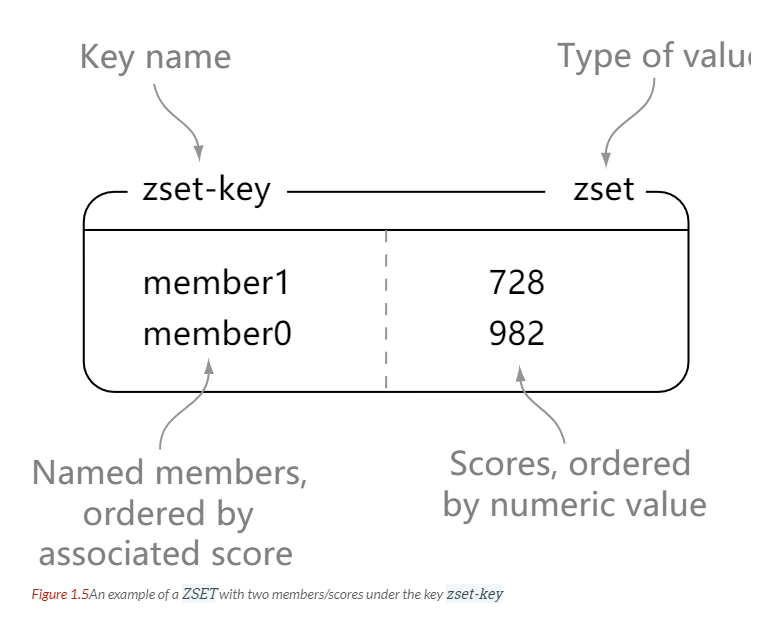

```html
> zadd zset-key 728 member1
(integer) 1
> zadd zset-key 982 member0
(integer) 1
> zadd zset-key 982 member0
(integer) 0

> zrange zset-key 0 -1 withscores
1) "member1"
2) "728"
3) "member0"
4) "982"

> zrangebyscore zset-key 0 800 withscores
1) "member1"
2) "728"

> zrem zset-key member1
(integer) 1
> zrem zset-key member1
(integer) 0

> zrange zset-key 0 -1 withscores
1) "member0"
2) "982"
```


### 命令行操作

#### 1.基本操作

##### ①切换数据库

``` html
Redis默认有16个数据库。
115 # Set the number of databases. The default database is DB 0, you can select
116 # a different one on a per-connection basis using SELECT <dbid> where
117 # dbid is a number between 0 and 'databases'-1
118 databases 16
使用select进行切换，数据库索引从0开始
127.0.0.1:6379> select 2
OK
127.0.0.1:6379[2]> select 0
OK
127.0.0.1:6379> 
```

##### ②查看数据库长度

``` html
127.0.0.1:6379> dbsize
(integer) 3
```

#### 2.KEY操作

``` mysql
● KEYS PATTERN
● TYPE KEY
	# 返回KEY对应的值的类型
● MOVE KEY DB
	# 把一组键值对数据移动到另一个数据库中
●DEL KEY [KEY ...]
	# 根据KEY进行删除，至少要指定一个KEY
●EXISTS KEY
	# 检查指定的KEY是否存在。指定一个KEY时，存在返回1，不存在返回0。可以指定多个，返回存在的KEY的数量。
●RANDOMKEY
	# 在现有的KEY中随机返回一个
●RENAME KEY NEWKEY
	# 重命名一个KEY，NEWKEY不管是否是已经存在的都会执行，如果NEWKEY已经存在则会被覆盖。
●RENAMENX KEY NEWKEY
	# 只有在NEWKEY不存在时能够执行成功，否则失败
●TIME
	# 返回当前UNIX时间戳
●TTL KEY
	# 以秒为单位查看KEY还能存在多长时间
●PTTL KEY
	# 以毫秒为单位查看KEY还能存在多长时间
●EXPIRE KEY SECONDS
	# 给一个KEY设置在SECONDS秒后过期，过期会被Redis移除。
●EXPIREAT KEY TIMESTAMP
	# # 设置一个KEY在TIMESTAMP指定的时间过期
●PEXPIRE KEY MILLISECONDS
	# 以毫秒为单位指定过期时间
●PEXPIREAT KEY MILLISECONDS-TIMESTAMP
	# 以毫秒为单位指定过期的时间戳
●PERSIST KEY
	# 移除过期时间，变成永久key
```

#### 2.string操作

``` mysql
●SET KEY VALUE [EX SECONDS] [PX MILLISECONDS] [NX|XX]
	# 给KEY设置一个string类型的值。
	# EX参数用于设置存活的秒数。
	# PX参数用于设置存活的毫秒数。
	# NX参数表示当前命令中指定的KEY不存在才行。
	# XX参数表示当前命令中指定的KEY存在才行。
●GET KEY
	# 根据key得到值，只能用于string类型。
●APPEND KEY VALUE
	# 把指定的value追加到KEY对应的原来的值后面，返回值是追加后字符串长度
●STRLEN KEY
	# 直接返回字符串长度
●INCR KEY
	# 自增1
●DECR KEY
	# 自减1
●INCRBY KEY INCREMENT
	# 原值+INCREMENT
●DECRBY KEY DECREMENT
	# 原值-DECREMENT
●GETRANGE KEY START END
	# 从字符串中取指定的一段
●SETRANGE KEY OFFSET VALUE
	# 从offset开始使用VALUE进行替换
●SETEX KEY SECONDS VALUE
	# 设置KEY,VALUE时指定存在秒数
●SETNX KEY VALUE
	# 新建字符串类型的键值对
●MSET KEY VALUE [KEY VALUE ...]
	# 一次性设置一组多个键值对
●MGET KEY [KEY ...]
	# 一次性指定多个KEY，返回它们对应的值，没有值的KEY返回值是(nil)
●MSETNX KEY VALUE [KEY VALUE ...]
	# 一次性新建多个值
●GETSET KEY VALUE
	# 设置新值，同时能够将旧值返回

```

#### 3.list操作

``` mysql
●LPUSH key value [value ...]
●RPUSH key value [value ...]
●LRANGE key start stop
	# 根据list集合的索引打印元素数据
	# 正着数：0,1,2,3,...
	# 倒着数：-1,-2,-3,...
●LLEN key
●LPOP key
	# 从左边弹出一个元素。
	# 弹出=返回+删除。
●RPOP key
	# 从右边弹出一个元素。
●RPOPLPUSH source destination
	# 从source中RPOP一个元素，LPUSH到destination中
●LINDEX key index
	# 根据索引从集合中取值
●LINSERT key BEFORE|AFTER pivot value
	# 在pivot指定的值前面或后面插入value
●LPUSHX key value
	# 只能针对存在的list执行LPUSH
●LREM key count value
	# 根据count指定的数量从key对应的list中删除value
●LSET key index value
	# 把指定索引位置的元素替换为另一个值
●LTRIM key start stop
	# 仅保留指定区间的数据，两边的数据被删除
```

#### 4.set操作

``` mysql
●SADD key member [member ...]
●SMEMBERS key
●SCARD key
	# 返回集合中元素的数量
●SISMEMBER key member
	# 检查当前指定member是否是集合中的元素
●SREM key member [member ...]
	# 从集合中删除元素
●SINTER key [key ...]
	# 将指定的集合进行“交集”操作
	# 集合A：a,b,c
	# 集合B：b,c,d
	# # 交集：b,c
●SINTERSTORE destination key [key ...]
	# 取交集后存入destination
●SDIFF key [key ...]
	# 将指定的集合执行“差集”操作
	# 集合A：a,b,c
	# 集合B：b,c,d
	# A对B执行diff：a
	# 相当于：A-交集部分
●SDIFFSTORE destination key [key ...]
●SUNION key [key ...]
	# 将指定的集合执行“并集”操作
	# 集合A：a,b,c
	# 集合B：b,c,d
	# 并集：a,b,c,d
●SUNIONSTORE destination key [key ...]
●SMOVE source destination member
	# 把member从source移动到destination
●SPOP key [count]
	# 从集合中随机弹出count个数量的元素，count不指定就弹出1个
●SRANDMEMBER key [count]
	# 从集合中随机返回count个数量的元素，count不指定就返回1个
●SSCAN key cursor [MATCH pattern] [COUNT count]
	# 基于游标的遍历

```

#### 5.hash操作

``` mysql
●HSET key field value
●HGETALL key
●HGET key field
●HLEN key
●HKEYS key
●HVALS key
●HEXISTS key field
●HDEL key field [field ...]
●HINCRBY key field increment
●HMGET key field [field ...]
●HMSET key field value [field value ...]
●HSETNX key field value
●HSCAN key cursor [MATCH pattern] [COUNT count]
```

#### 6.zset操作

``` mysql
●ZADD key [NX|XX] [CH] [INCR] score member [score member ...]
●ZRANGE key start stop [WITHSCORES]
●ZCARD key
●ZCOUNT key min max
	# 根据分数在min，max之间查找元素
●ZSCORE key member
●ZINCRBY key increment member
●ZLEXCOUNT key min max
●ZRANGEBYLEX key min max [LIMIT offset count]
	# 按照字母顺序在区间内返回member
	# min和max使用“[a”表示闭区间，使用“(a”表示开区间
	# -表示负无穷
	# +表示正无穷
●ZRANGEBYSCORE key min max [WITHSCORES] [LIMIT offset count]
	# 在分数的指定区间内返回数据
●ZRANK key member
	# 先对分数进行升序排序，返回member的排名
●ZREM key member [member ...]
●ZREMRANGEBYLEX key min max
●ZREMRANGEBYRANK key start stop
●ZREMRANGEBYSCORE key min max
●ZREVRANGE key start stop [WITHSCORES]
●ZREVRANGEBYSCORE key max min [WITHSCORES] [LIMIT offset count]
●ZREVRANK key member
●ZINTERSTORE destination numkeys key [key ...] [WEIGHTS weight [weight ...]] [AGGREGATE SUM|MIN|MAX]
●ZUNIONSTORE destination numkeys key [key ...] [WEIGHTS weight] [AGGREGATE SUM|MIN|MAX]
	# 把指定集合的member取交集，分数会相加
●ZSCAN key cursor [MATCH pattern] [COUNT count]
```


### 三、数据结构

#### 字典

**dictht** 是一个**散列表**结构，使用**拉链法保存哈希冲突**。

```c
/* This is our hash table structure. Every dictionary has two of this as we
 * implement incremental rehashing, for the old to the new table. */
typedef struct dictht {
    dictEntry **table;
    unsigned long size;
    unsigned long sizemask;
    unsigned long used;
} dictht;
```

```c
typedef struct dictEntry {
    void *key;
    union {
        void *val;
        uint64_t u64;
        int64_t s64;
        double d;
    } v;
    struct dictEntry *next;
} dictEntry;
```

Redis 的字典 dict 中包含**两个哈希表 dictht**，这是为了方便进行 rehash 操作。在扩容时，将其中一个 dictht 上的键值对 rehash 到另一个 dictht 上面，完成之后释放空间并交换两个 dictht 的角色。

```c
typedef struct dict {
    dictType *type;
    void *privdata;
    dictht ht[2];
    long rehashidx; /* rehashing not in progress if rehashidx == -1 */
    unsigned long iterators; /* number of iterators currently running */
} dict;
```

rehash 操作不是一次性完成，而是采用**渐进方式**，这是为了避免一次性执行过多的 rehash 操作给服务器带来过大的负担。

渐进式 rehash 通过记录 dict 的 rehashidx 完成，它从 0 开始，然后每执行一次 rehash 都会递增。例如在一次 rehash 中，要把 dict[0] rehash 到 dict[1]，这一次会把 dict[0] 上 table[rehashidx] 的键值对 rehash 到 dict[1] 上，dict[0] 的 table[rehashidx] 指向 null，并令 rehashidx++。

在 rehash 期间，每次对字典执行添加、删除、查找或者更新操作时，都会执行一次渐进式 rehash。

采用渐进式 rehash 会导致字典中的数据分散在两个 dictht 上，因此对字典的查找操作也需要到对应的 dictht 去执行。

```c
/* Performs N steps of incremental rehashing. Returns 1 if there are still
 * keys to move from the old to the new hash table, otherwise 0 is returned.
 *
 * Note that a rehashing step consists in moving a bucket (that may have more
 * than one key as we use chaining) from the old to the new hash table, however
 * since part of the hash table may be composed of empty spaces, it is not
 * guaranteed that this function will rehash even a single bucket, since it
 * will visit at max N*10 empty buckets in total, otherwise the amount of
 * work it does would be unbound and the function may block for a long time. */
int dictRehash(dict *d, int n) {
    int empty_visits = n * 10; /* Max number of empty buckets to visit. */
    if (!dictIsRehashing(d)) return 0;

    while (n-- && d->ht[0].used != 0) {
        dictEntry *de, *nextde;

        /* Note that rehashidx can't overflow as we are sure there are more
         * elements because ht[0].used != 0 */
        assert(d->ht[0].size > (unsigned long) d->rehashidx);
        while (d->ht[0].table[d->rehashidx] == NULL) {
            d->rehashidx++;
            if (--empty_visits == 0) return 1;
        }
        de = d->ht[0].table[d->rehashidx];
        /* Move all the keys in this bucket from the old to the new hash HT */
        while (de) {
            uint64_t h;

            nextde = de->next;
            /* Get the index in the new hash table */
            h = dictHashKey(d, de->key) & d->ht[1].sizemask;
            de->next = d->ht[1].table[h];
            d->ht[1].table[h] = de;
            d->ht[0].used--;
            d->ht[1].used++;
            de = nextde;
        }
        d->ht[0].table[d->rehashidx] = NULL;
        d->rehashidx++;
    }

    /* Check if we already rehashed the whole table... */
    if (d->ht[0].used == 0) {
        zfree(d->ht[0].table);
        d->ht[0] = d->ht[1];
        _dictReset(&d->ht[1]);
        d->rehashidx = -1;
        return 0;
    }

    /* More to rehash... */
    return 1;
}

```

---


#### 跳跃表

是**有序集合**的底层实现之一。

跳跃表是基于==多指针有序链表==实现的，可以看成多个**有序链表**。


在**查找**时，从**上层指针**开始查找，找到对应的区间之后再到下一层去查找。下图演示了查找 22 的过程。

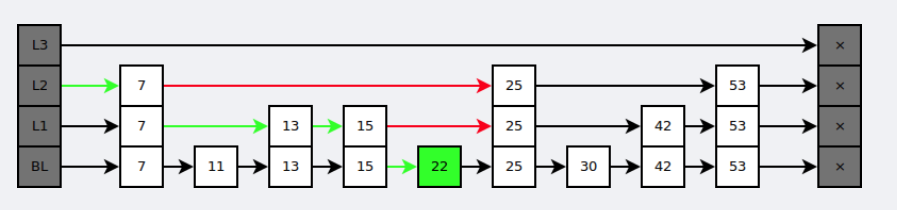

与红黑树等平衡树相比，跳跃表具有以下优点：

- **插入速度非常快速，因为不需要进行旋转等操作来维护平衡性**；
- 更容易实现；
- 支持**无锁操作**。

----


### 四、使用场景

#### 计数器

可以对 **String** 进行自增自减运算，从而实现计数器功能。

Redis 这种内存型数据库的读写性能非常高，很适合**存储频繁读写的计数量**。

#### 缓存

将热点数据放到内存中，设置内存的最大使用量以及**淘汰策略**来保证缓存的命中率。

#### 查找表

例如 DNS 记录就很适合使用 Redis 进行存储。

查找表和缓存类似，也是利用了 Redis 快速的查找特性。但是查找表的内容不能失效，而缓存的内容可以失效，因为缓存不作为可靠的数据来源。

#### 消息队列

**List 是一个双向链表**，可以通过 lpush 和 rpop 写入和读取消息

不过最好使用 Kafka、RabbitMQ 等**消息中间件**。

#### 会话缓存

可以使用 Redis 来统一存储多台应用服务器的**会话信息**。

当应用服务器不再存储用户的会话信息，也就不再具有状态，一个用户可以请求任意一个应用服务器，从而更容易实现高可用性以及可伸缩性。

#### 分布式锁实现

在分布式场景下，无法使用单机环境下的锁来对多个节点上的进程进行同步。

可以使用 ==Redis 自带的 SETNX 命令实现分布式锁==，除此之外，还可以使用官方提供的 ==RedLock 分布式锁==实现。

#### 其它

Set 可以实现交集、并集等操作，从而实现共同好友等功能。

ZSet 可以实现**有序性**操作，从而实现**排行榜**等功能。


### 五、Redis 与 Memcached

两者都是**非关系型内存键值数据库**，主要有以下不同：

#### 数据类型

Memcached **仅支持字符串类型**，而 Redis 支持五种不同的数据类型，可以更灵活地解决问题。

#### 数据持久化

Redis 支持两种持久化策略：**RDB 快照和 AOF 日志**，而 Memcached **不支持**持久化。

#### 分布式

Memcached **不支持分布式**，只能通过在客户端使用**一致性哈希**来实现分布式存储，这种方式在存储和查询时都需要先在客户端计算一次数据所在的节点。

Redis Cluster 实现了**分布式**的支持。

#### 内存管理机制

- 在 Redis 中，并不是所有数据都一直存储在内存中，可以将一些**很久没用的 value 交换到磁盘**，而 Memcached 的数据则会**一直**在内存中。
- Memcached 将内存分割成**特定长度的块**来存储数据，以完全解决内存碎片的问题。但是这种方式会使得内存的利用率不高，例如块的大小为 128 bytes，只存储 100 bytes 的数据，那么剩下的 28 bytes 就浪费掉了。


### 六、键的过期时间

Redis 可以为每个**键设置过期时间**，当键过期时，会自动删除该键。

对于散列表这种容器，只能为整个键设置过期时间（**整个散列表**），而不能为键里面的单个元素设置过期时间。


### 七、数据==淘汰策略==

可以设置**内存最大使用量**，当内存使用量超出时，会施行数据淘汰策略。

Redis 具体有 6 种淘汰策略：

|      策略       |                             描述                             |
| :-------------: | :----------------------------------------------------------: |
|  volatile-lru   | 从**已设置过期**时间的数据集中挑选**最近最少使用**的数据淘汰 |
|  volatile-ttl   |     从已设置过期时间的数据集中挑选**将要过期**的数据淘汰     |
| volatile-random |        从已设置过期时间的数据集中**任意选择**数据淘汰        |
|   allkeys-lru   |       从**所有**数据集中挑选**最近最少使用**的数据淘汰       |
| allkeys-random  |            从所有数据集中**任意选择**数据进行淘汰            |
|   noeviction    |                       **禁止驱逐**数据                       |

作为内存数据库，出于对性能和内存消耗的考虑，Redis 的淘汰算法实际实现上并非针对所有 key，而是抽样一小部分并且从中选出被淘汰的 key。

使用 Redis 缓存数据时，为了提高缓存命中率，需要保证缓存数据都是**热点数据**。**可以将内存最大使用量设置为热点数据占用的内存量，然后启用 allkeys-lru 淘汰策略，将最近最少使用的数据淘汰。**

Redis 4.0 引入了 volatile-lfu 和 allkeys-lfu 淘汰策略，LFU 策略通过统计访问频率，将访问频率最少的键值对淘汰。


### 八、持久化

Redis 是内存型数据库，为了保证数据在断电后不会丢失，需要将内存中的数据持久化到**硬盘**上。

#### RDB 持久化

每隔一定的时间把内存中的**数据**作为一个**快照**保存到内存中，**默认**开启此模式。

保存的是**==数据==**本身。

将某个时间点的**所有数据**都存放到硬盘上。

可以将快照复制到其它服务器从而创建具有相同数据的服务器副本。

如果系统发生故障，将会丢失最后一次创建快照之后的数据。

如果数据量很大，保存快照的时间会很长。

可以在配置文件 redis.conf 中设置啥时候进行持久化，也可以设置持久化的文件名等。可以使用 save 指令进行人为触发持久化操作。服务器关闭命令 SHUTDOWN 让 Redis 正常退出就会执行数据保存操作。

持久化之后的数据文件之后可以恢复数据到 Redis 中。

 redis.conf 中的 dir 配置工作目录，则保存的持久化数据库文件会在 dir 指定的目录中，读也是如此。

由于是隔一段时间保存一次并不能完全保证数据安全，但是 Redis 也用不着绝对的安全。

数据文件默认为 dump.rdb。 

---

#### AOF 持久化

将写**命令**添加到 **AOF 文件**（Append Only File）的末尾。保存的是**命令**。配置项 appendonly 用于配置开启关闭 AOF 持久化方式。RDB 和 AOF 都启用则使用 AOF。

使用 AOF 持久化需要**设置同步选项**，从而确保写命令什么时候会同步到磁盘文件上。这是因为对文件进行写入并不会马上将内容同步到磁盘上，而是先存储到缓冲区，然后由操作系统决定什么时候同步到磁盘。配置文件中有 一个配置项：appendfsync，有以下同步选项：

|     选项     |           同步频率           |
| :----------: | :--------------------------: |
|    always    |       每个写命令都同步       |
| **everysec** |       **每秒**同步一次       |
|      no      | 让**操作系统**来决定何时同步 |

- always 选项会**严重减低**服务器的性能；
- everysec 选项**比较合适**，可以保证系统崩溃时只会丢失一秒左右的数据，并且 Redis 每秒执行一次同步对服务器性能几乎没有任何影响；
- no 选项并不能给服务器性能带来多大的提升，而且也会增加系统崩溃时数据丢失的数量。

随着服务器写请求的增多，AOF 文件会越来越大。Redis 提供了一种将 **AOF 重写**的特性，能够去除 AOF 文件中的冗余写命令。比如下面有 10000 条指令。

```redis
SET COUNT 1
// 以下是自增操作9999次
INCR COUNT
...
INCR COUNT 
INCR COUNT 

```

重写后，只有一条指令。

```
SET COUNT 10000

```


### 九、事务

一个事务包含了**多个命令**，服务器在执行事务期间，不会改去执行其它客户端的命令请求。

事务中的**多个命令被一次性发送**给服务器，而不是一条一条发送，这种方式被称为**流水线**，它可以减少客户端与服务器之间的网络通信次数从而提升性能。

Redis 最简单的事务实现方式是使用 ==MULTI 和 EXEC 命令==将事务操作**包围**起来。

|   命令    |                             含义                             |
| :-------: | :----------------------------------------------------------: |
| **MULTI** | 表示开始收集命令，后面所有命令都不是马上执行，而是加入到一个队列中 |
| **EXEC**  |             执行 MULTI 后面命令队列中的所有命令              |
|  DISCARD  |                     放弃执行队列中的命令                     |
|   WATCH   | “观察”、“监控”一个KEY, 在当前队列外的其他命令操作这个KEY时，**放弃执行自己**队列的命令，是一种**乐观锁**的策略 |
|  UNWATCH  |                       放弃监控一个KEY                        |

Redis 执行错误时不会整体回滚。

如果你有使用关系式数据库的经验， 那么 “==**Redis 在事务失败时不进行回滚，而是继续执行余下的命令**==”这种做法可能会让你觉得有点奇怪。以下是这种做法的优点：
Redis 命令只会因为错误的**语法而失败**（并且这些问题不能在入队时发现），或是命令用在了错误类型的键上面：这也就是说，从实用性的角度来说，**失败的命令是由编程错误**造成的，而这些错误应该在开发的过程中被发现，而不应该出现在生产环境中。
因为不需要对回滚进行支持，所以 Redis 的内部可以**保持简单且快速**。
有种观点认为 Redis 处理事务的做法会产生 bug ， 然而需要注意的是， 在通常情况下， 回滚并不能解决编程错误带来的问题。 举个例子， 如果你本来想通过 INCR 命令将键的值加上 1 ， 却不小心加上了 2 ， 又或者对错误类型的键执行了 INCR ， 回滚是没有办法处理这些情况的。

因我我们需要**加强对生产环境中的错误异常处理**。

Redis 事务的几个性质：

- 单独的隔离操作：事务中的所有命令会被序列化、按顺序执行，在执行的过程中不会被其他客户端发送来的命令打断。

- 没有隔离级别的概念：队列中的命令在事务没有被提交之前不会被实际执行。

- 不保证原子性：Redis 中的一个事务中如果存在命令执行失败，那么其他命令依然会被执行，没有回滚机制。


**悲观锁与乐观锁**

Redis 是以**乐观锁**的策略操作事务的，如上述的 WATCH 指令，没有悲观锁。


### 十、事件

Redis 服务器是一个**事件驱动**程序。

#### 文件事件

服务器通过**套接字**与客户端或者其它服务器进行通信，**文件事件就是对套接字操作的抽象**。

Redis 基于 **Reactor 模式**开发了自己的网络事件处理器，使用 I/O **多路复用**程序来同时监听多个套接字，并将到达的事件传送给文件事件分派器，分派器会根据套接字产生的事件类型调用相应的事件处理器。


----

#### 时间事件

服务器有一些操作需要在**给定的时间点**执行，时间事件是对这类定时操作的抽象。

时间事件又分为：

- **定时事件**：是让一段程序在指定的时间之内执行一次；
- **周期性事件**：是让一段程序每隔指定时间就执行一次。

Redis 将所有时间事件都放在一个==无序链表==中，通过遍历整个链表查找出已到达的时间事件，并调用相应的事件处理器。

---

#### 事件的调度与执行

服务器需要不断监听文件事件的套接字才能得到待处理的文件事件，但是不能一直监听，否则时间事件无法在规定的时间内执行，因此监听时间应该根据距离现在最近的时间事件来决定。

事件调度与执行由 **aeProcessEvents 函数**负责，伪代码如下：

```python
def aeProcessEvents():
    # 获取到达时间离当前时间最接近的时间事件
    time_event = aeSearchNearestTimer()
    # 计算最接近的时间事件距离到达还有多少毫秒
    remaind_ms = time_event.when - unix_ts_now()
    # 如果事件已到达，那么 remaind_ms 的值可能为负数，将它设为 0
    if remaind_ms < 0:
        remaind_ms = 0
    # 根据 remaind_ms 的值，创建 timeval
    timeval = create_timeval_with_ms(remaind_ms)
    # 阻塞并等待文件事件产生，最大阻塞时间由传入的 timeval 决定
    aeApiPoll(timeval)
    # 处理所有已产生的文件事件
    procesFileEvents()
    # 处理所有已到达的时间事件
    processTimeEvents()

```

将 aeProcessEvents 函数置于一个循环里面，加上初始化和清理函数，就构成了 Redis 服务器的**主函数**，伪代码如下：

```python
def main():
    # 初始化服务器
    init_server()
    # 一直处理事件，直到服务器关闭为止
    while server_is_not_shutdown():
        aeProcessEvents()
    # 服务器关闭，执行清理操作
    clean_server()

```

从事件处理的角度来看，服务器运行流程如下：


### 十一、主从复制

Redis 集群在运行时使用的是**同一个可执行文件**，只是用的**不同的配置文件**。

通过 redis 的主从复制机制就可以避免这种**单点故障**。

通过使用 **slaveof host port** 命令来让一个服务器成为另一个服务器的**从服务器**。命令需要连接到之后才能输入。

通过使用 **slaveof no one** 来取消作为其他服务器的从服务器，此时自己就可以变成一个 master 服务器。

一个从服务器**只能有一个主服务器**，并且**不支持主主复制**。

主服务器写入数据之后，数据就被同步到服务器，从服务器就能读取到写入的数据，实现了==读写分离==，**默认情况下写是通过主服务器，读是通过从服务器。**

主服务器掉线之后从服务器依然会是从服务器，主服务器上线之后又重新成为主服务器。而从服务器如果掉线之后再上线就默认变成了主服务器，不再是从服务器，需要重新建立主从关系。


#### 连接过程

1. 主服务器创建**快照文件**，发送给从服务器，并在发送期间使用**缓冲区**记录执行的写命令。快照文件发送完毕之后，开始向从服务器发送存储在缓冲区中的写命令；

2. 从服务器**丢弃所有旧数据**，载入主服务器发来的**快照文件**，之后从服务器开始接受主服务器发来的**写命令**；

3. 主服务器**每执行一次写命令**，就向从服务器发送相同的**写命令**。

#### 主从链

随着负载不断上升，主服务器可能无法很快地更新所有从服务器，或者重新连接和重新同步从服务器将导致系统超载。为了解决这个问题，可以创建一个**中间层**来分担主服务器的复制工作。**中间层的服务器是最上层服务器的从服务器，又是最下层服务器的主服务器。**

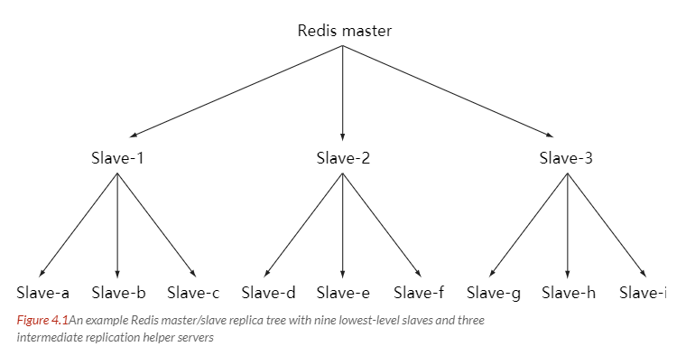


### 十二、哨兵模式

**Sentinel（哨兵）**可以**监听集群中的服务器**，并在主服务器进入下线状态时，自动从从服务器中**选举出新的**主服务器。哨兵持续不断的给各个服务器发送心跳消息来判断服务器是否在线。心跳消息是通过**网络**传输，因此可能因为网络传输的问题导致判断失误，所以哨兵也可以配置多个，服务器之间使用内网比较好。

哨兵模式是一种特殊的模式，首先 Redis 提供了哨兵的命令，哨兵是一个独立的进程，作为进程，它会独立运行。其原理是**哨兵通过发送命令，等待Redis服务器响应，从而监控运行的多个Redis实例。**

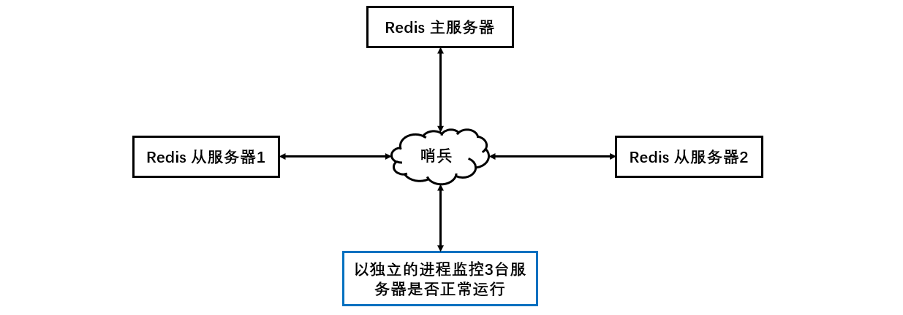

哨兵的作用：

- 通过发送命令，让Redis服务器返回监控其运行状态，包括主服务器和从服务器。
- 当哨兵监测到 master 宕机，会自动选举 slave 成为 master，然后通过**发布订阅模式**通知其他的从服务器，修改配置文件，让它们切换主机。


### 十三、分片

分片是将数据划分为**多个部分**的方法，可以将数据存储到多台机器里面，这种方法在解决某些问题时可以获得线性级别的性能提升。

假设有 4 个 Redis 实例 R0，R1，R2，R3，还有很多表示用户的键 user:1，user:2，... ，有不同的方式来选择一个指定的键存储在哪个实例中。

- 最简单的方式是**范围分片**，例如用户 id 从 0\~1000 的存储到实例 R0 中，用户 id 从 1001\~2000 的存储到实例 R1 中，等等。但是这样需要维护一张**映射范围表**，维护操作代价很高。
- 还有一种方式是**哈希分片**，使用 CRC32 哈希函数将键转换为一个数字，再对实例数量求模就能知道应该存储的实例。

根据执行分片的位置，可以分为**三种分片方式**：

- **客户端分片**：客户端使用一致性哈希等算法决定键应当分布到哪个节点。
- **代理分片**：将客户端请求发送到代理上，由代理转发请求到正确的节点上。
- **服务器分片**：Redis Cluster。


### 十四、一个简单的论坛系统分析

该论坛系统功能如下：

- 可以发布文章；
- 可以对文章进行点赞；
- 在首页可以按文章的发布时间或者文章的点赞数进行排序显示。

#### 文章信息

文章包括标题、作者、赞数等信息，在关系型数据库中很容易构建一张表来存储这些信息，在 Redis 中可以使用 **HASH** 来存储每种信息以及其对应的值的映射。

Redis 没有关系型数据库中的**表**这一概念来将同种类型的数据存放在一起，而是使用**==命名空间==**的方式来实现这一功能。**键名的前面部分存储命名空间**，后面部分的内容存储 ID，通常**使用 : 来进行分隔**。例如下面的 HASH 的键名为 article:92617，其中 article 为命名空间，ID 为 92617。

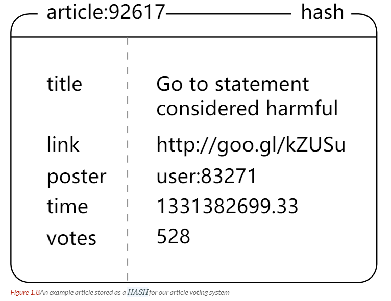

---

#### 点赞功能

当有用户为一篇文章点赞时，除了要对该文章的 votes 字段进行加 1 操作，还必须记录该用户已经对该文章进行了点赞，防止用户点赞次数超过 1。可以建立文章的**已投票用户**集合来进行记录。

为了节约内存，规定一篇文章发布满一周之后，就不能再对它进行投票，而文章的已投票集合也会被删除，可以为文章的已投票集合设置一个一周的**过期时间**就能实现这个规定。


----

#### 对文章进行排序

为了按发布时间和点赞数进行排序，可以建立一个文章发布时间的**有序集合**和一个文章点赞数的有序集合。（下图中的 score 就是这里所说的点赞数；下面所示的有序集合分值并不直接是时间和点赞数，而是根据时间和点赞数间接计算出来的）

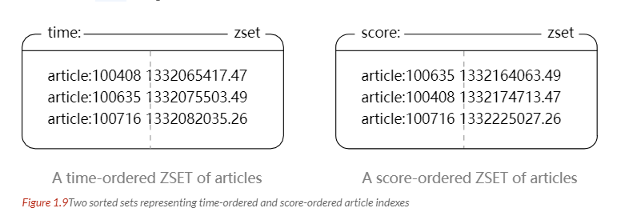

----


### 十五、性能优化

- Master最好不要做任何持久化工作，如RDB内存快照和AOF日志文件
- 如果数据比较重要，某个Slave开启AOF备份数据，策略设置为每秒同步一次
- 为了主从复制的速度和连接的稳定性，Master和Slave最好在同一个局域网内
- 尽量避免在压力很大的主库上增加从库
- 主从复制不要用图状结构，用单向链表结构更为稳定，即：Master <- Slave1 <- Slave2 <- Slave3... 这样的结构方便解决单点故障问题，实现Slave对Master的替换。如果Master挂了，可以立刻启用Slave1做Master，其他不变。


### 十六、Jedis

Java 中用于连接 Redis 的连接池。

依赖

```xml
<!-- Redis客户端 -->
<dependency>
    <groupId>redis.clients</groupId>
    <artifactId>jedis</artifactId>
</dependency>

```

**连接单机版**

第一步：创建一个 Jedis 对象。需要指定服务端的 IP 及端口。
第二步：使用 Jedis 对象操作数据库，每个 Redis 命令对应一个方法。
第三步：打印结果。
第四步：关闭 Jedis。

```java
@Test
public void testJedis() throws Exception {
    // 第一步：创建一个Jedis对象。需要指定服务端的ip及端口。
    Jedis jedis = new Jedis("192.168.25.153", 6379);
    // 第二步：使用Jedis对象操作数据库，每个redis命令对应一个方法。
    String result = jedis.get("hello");
    // 第三步：打印结果。
    System.out.println(result);
    // 第四步：关闭Jedis
    jedis.close();
}

```

**使用连接池连接单机版**

第一步：创建一个 JedisPool 对象。需要指定服务端的 IP 及端口。
第二步：从 JedisPool 中获得 Jedis 对象。
第三步：使用 Jedis 操作 Redis 服务器。
第四步：操作完毕后关闭 Jedis 对象，连接池回收资源。
第五步：关闭 JedisPool 对象。

```java
@Test
public void testJedisPool() throws Exception {
    // 第一步：创建一个JedisPool对象。需要指定服务端的ip及端口。
    JedisPool jedisPool = new JedisPool("192.168.25.153", 6379);
    // 第二步：从JedisPool中获得Jedis对象。
    Jedis jedis = jedisPool.getResource();
    // 第三步：使用Jedis操作redis服务器。
    jedis.set("jedis", "test");
    String result = jedis.get("jedis");
    System.out.println(result);
    // 第四步：操作完毕后关闭jedis对象，连接池回收资源。
    jedis.close();
    // 第五步：关闭JedisPool对象。
    jedisPool.close();
}

```

**连接集群版**

第一步：使用 JedisCluster 对象。需要一个 Set\<HostAndPort> 参数。Redis节点的列表。
第二步：直接使用 JedisCluster 对象操作 Redis。在系统中单例存在。
第三步：打印结果.
第四步：系统关闭前，关闭 JedisCluster 对象。

```java
@Test
public void testJedisCluster() throws Exception {
    // 第一步：使用JedisCluster对象。需要一个Set<HostAndPort>参数。Redis节点的列表。
    Set<HostAndPort> nodes = new HashSet<>();
    nodes.add(new HostAndPort("192.168.25.153", 7001));
    nodes.add(new HostAndPort("192.168.25.153", 7002));
    nodes.add(new HostAndPort("192.168.25.153", 7003));
    nodes.add(new HostAndPort("192.168.25.153", 7004));
    nodes.add(new HostAndPort("192.168.25.153", 7005));
    nodes.add(new HostAndPort("192.168.25.153", 7006));
    JedisCluster jedisCluster = new JedisCluster(nodes);
    // 第二步：直接使用JedisCluster对象操作redis。在系统中单例存在。
    jedisCluster.set("hello", "100");
    String result = jedisCluster.get("hello");
    // 第三步：打印结果
    System.out.println(result);
    // 第四步：系统关闭前，关闭JedisCluster对象。
    jedisCluster.close();
}

```


### 十七、Redis 配置文件详解

注意：如果想在一台机器上不同端口启动多个redis服务，就把后面的配置文件修改下，后面加上配置文件路径启动即可。端口，和数据，日志等改下。

|  参数名称  |      含义      |                示例                 |
| :--------: | :------------: | :---------------------------------: |
| dbfilename | 存放数据的地方 | /usr/local/redis/6380/data/dump.rdb |
|  logfile   | 存放日志的地方 |         /var/log/redis.log          |
|            |                |                                     |

```properties
# Redis配置文件样例

# Note on units: when memory size is needed, it is possible to specifiy
# it in the usual form of 1k 5GB 4M and so forth:
#
# 1k => 1000 bytes
# 1kb => 1024 bytes
# 1m => 1000000 bytes
# 1mb => 1024*1024 bytes
# 1g => 1000000000 bytes
# 1gb => 1024*1024*1024 bytes
#
# units are case insensitive so 1GB 1Gb 1gB are all the same.

# Redis默认不是以守护进程的方式运行，可以通过该配置项修改，使用yes启用守护进程
# 启用守护进程后，Redis会把pid写到一个pidfile中，在/var/run/redis.pid
daemonize yes

# 当Redis以守护进程方式运行时，Redis默认会把pid写入/var/run/redis.pid文件，可以通过pidfile指定
pidfile /var/run/redis.pid

# 指定Redis监听端口，默认端口为6379
# 如果指定0端口，表示Redis不监听TCP连接
port 6379

# 绑定的主机地址
# 你可以绑定单一接口，如果没有绑定，所有接口都会监听到来的连接
# bind 127.0.0.1

# Specify the path for the unix socket that will be used to listen for
# incoming connections. There is no default, so Redis will not listen
# on a unix socket when not specified.
#
# unixsocket /tmp/redis.sock
# unixsocketperm 755

# 当客户端闲置多长时间后关闭连接，如果指定为0，表示关闭该功能
timeout 0

# 指定日志记录级别，Redis总共支持四个级别：debug、verbose、notice、warning，默认为verbose
# debug (很多信息, 对开发／测试比较有用)
# verbose (many rarely useful info, but not a mess like the debug level)
# notice (moderately verbose, what you want in production probably)
# warning (only very important / critical messages are logged)
loglevel verbose

# 日志记录方式，默认为标准输出，如果配置为redis为守护进程方式运行，而这里又配置为标准输出，则日志将会发送给/dev/null
logfile /var/log/redis.log

# To enable logging to the system logger, just set 'syslog-enabled' to yes,
# and optionally update the other syslog parameters to suit your needs.
# syslog-enabled no

# Specify the syslog identity.
# syslog-ident redis

# Specify the syslog facility.  Must be USER or between LOCAL0-LOCAL7.
# syslog-facility local0

# 设置数据库的数量，默认数据库为0，可以使用select <dbid>命令在连接上指定数据库id
# dbid是从0到‘databases’-1的数目
databases 16

################################ SNAPSHOTTING  #################################
# 指定在多长时间内，有多少次更新操作，就将数据同步到数据文件，可以多个条件配合
# Save the DB on disk:
#
#   save <seconds> <changes>
#
#   Will save the DB if both the given number of seconds and the given
#   number of write operations against the DB occurred.
#
#   满足以下条件将会同步数据:
#   900秒（15分钟）内有1个更改
#   300秒（5分钟）内有10个更改
#   60秒内有10000个更改
#   Note: 可以把所有“save”行注释掉，这样就取消同步操作了

save 900 1
save 300 10
save 60 10000

# 指定存储至本地数据库时是否压缩数据，默认为yes，Redis采用LZF压缩，如果为了节省CPU时间，可以关闭该选项，但会导致数据库文件变的巨大
rdbcompression yes

# 指定本地数据库文件名，默认值为dump.rdb
dbfilename /usr/local/redis/dump.rdb

# 工作目录.
# 指定本地数据库存放目录，文件名由上一个dbfilename配置项指定
# 
# Also the Append Only File will be created inside this directory.
# 
# 注意，这里只能指定一个目录，不能指定文件名
dir /usr/local/redis

################################# REPLICATION #################################

# 主从复制。使用slaveof从 Redis服务器复制一个Redis实例。注意，该配置仅限于当前slave有效
# so for example it is possible to configure the slave to save the DB with a
# different interval, or to listen to another port, and so on.
# 设置当本机为slav服务时，设置master服务的ip地址及端口，在Redis启动时，它会自动从master进行数据同步
# slaveof <masterip> <masterport>


# 当master服务设置了密码保护时，slav服务连接master的密码
# 下文的“requirepass”配置项可以指定密码
# masterauth <master-password>

# When a slave lost the connection with the master, or when the replication
# is still in progress, the slave can act in two different ways:
#
# 1) if slave-serve-stale-data is set to 'yes' (the default) the slave will
#    still reply to client requests, possibly with out of data data, or the
#    data set may just be empty if this is the first synchronization.
#
# 2) if slave-serve-stale data is set to 'no' the slave will reply with
#    an error "SYNC with master in progress" to all the kind of commands
#    but to INFO and SLAVEOF.
#
slave-serve-stale-data yes

# Slaves send PINGs to server in a predefined interval. It's possible to change
# this interval with the repl_ping_slave_period option. The default value is 10
# seconds.
#
# repl-ping-slave-period 10

# The following option sets a timeout for both Bulk transfer I/O timeout and
# master data or ping response timeout. The default value is 60 seconds.
#
# It is important to make sure that this value is greater than the value
# specified for repl-ping-slave-period otherwise a timeout will be detected
# every time there is low traffic between the master and the slave.
#
# repl-timeout 60

################################## SECURITY ###################################

# Warning: since Redis is pretty fast an outside user can try up to
# 150k passwords per second against a good box. This means that you should
# use a very strong password otherwise it will be very easy to break.
# 设置Redis连接密码，如果配置了连接密码，客户端在连接Redis时需要通过auth <password>命令提供密码，默认关闭
# requirepass foobared

# Command renaming.
#
# It is possilbe to change the name of dangerous commands in a shared
# environment. For instance the CONFIG command may be renamed into something
# of hard to guess so that it will be still available for internal-use
# tools but not available for general clients.
#
# Example:
#
# rename-command CONFIG b840fc02d524045429941cc15f59e41cb7be6c52
#
# It is also possilbe to completely kill a command renaming it into
# an empty string:
#
# rename-command CONFIG ""

################################### LIMITS ####################################

# 设置同一时间最大客户端连接数，默认无限制，Redis可以同时打开的客户端连接数为Redis进程可以打开的最大文件描述符数，
# 如果设置maxclients 0，表示不作限制。当客户端连接数到达限制时，Redis会关闭新的连接并向客户端返回max Number of clients reached错误信息
# maxclients 128

# Don't use more memory than the specified amount of bytes.
# When the memory limit is reached Redis will try to remove keys with an
# EXPIRE set. It will try to start freeing keys that are going to expire
# in little time and preserve keys with a longer time to live.
# Redis will also try to remove objects from free lists if possible.
#
# If all this fails, Redis will start to reply with errors to commands
# that will use more memory, like SET, LPUSH, and so on, and will continue
# to reply to most read-only commands like GET.
#
# WARNING: maxmemory can be a good idea mainly if you want to use Redis as a
# 'state' server or cache, not as a real DB. When Redis is used as a real
# database the memory usage will grow over the weeks, it will be obvious if
# it is going to use too much memory in the long run, and you'll have the time
# to upgrade. With maxmemory after the limit is reached you'll start to get
# errors for write operations, and this may even lead to DB inconsistency.
# 指定Redis最大内存限制，Redis在启动时会把数据加载到内存中，达到最大内存后，Redis会先尝试清除已到期或即将到期的Key，
# 当此方法处理后，仍然到达最大内存设置，将无法再进行写入操作，但仍然可以进行读取操作。
# Redis新的vm机制，会把Key存放内存，Value会存放在swap区
# maxmemory <bytes>

# MAXMEMORY POLICY: how Redis will select what to remove when maxmemory
# is reached? You can select among five behavior:
# 
# volatile-lru -> remove the key with an expire set using an LRU algorithm
# allkeys-lru -> remove any key accordingly to the LRU algorithm
# volatile-random -> remove a random key with an expire set
# allkeys->random -> remove a random key, any key
# volatile-ttl -> remove the key with the nearest expire time (minor TTL)
# noeviction -> don't expire at all, just return an error on write operations
# 
# Note: with all the kind of policies, Redis will return an error on write
#       operations, when there are not suitable keys for eviction.
#
#       At the date of writing this commands are: set setnx setex append
#       incr decr rpush lpush rpushx lpushx linsert lset rpoplpush sadd
#       sinter sinterstore sunion sunionstore sdiff sdiffstore zadd zincrby
#       zunionstore zinterstore hset hsetnx hmset hincrby incrby decrby
#       getset mset msetnx exec sort
#
# The default is:
#
# maxmemory-policy volatile-lru

# LRU and minimal TTL algorithms are not precise algorithms but approximated
# algorithms (in order to save memory), so you can select as well the sample
# size to check. For instance for default Redis will check three keys and
# pick the one that was used less recently, you can change the sample size
# using the following configuration directive.
#
# maxmemory-samples 3

############################## APPEND ONLY MODE ###############################

# 
# Note that you can have both the async dumps and the append only file if you
# like (you have to comment the "save" statements above to disable the dumps).
# Still if append only mode is enabled Redis will load the data from the
# log file at startup ignoring the dump.rdb file.
# 指定是否在每次更新操作后进行日志记录，Redis在默认情况下是异步的把数据写入磁盘，如果不开启，可能会在断电时导致一段时间内的数据丢失。
# 因为redis本身同步数据文件是按上面save条件来同步的，所以有的数据会在一段时间内只存在于内存中。默认为no
# IMPORTANT: Check the BGREWRITEAOF to check how to rewrite the append
# log file in background when it gets too big.

appendonly no

# 指定更新日志文件名，默认为appendonly.aof
# appendfilename appendonly.aof

# The fsync() call tells the Operating System to actually write data on disk
# instead to wait for more data in the output buffer. Some OS will really flush 
# data on disk, some other OS will just try to do it ASAP.

# 指定更新日志条件，共有3个可选值：
# no:表示等操作系统进行数据缓存同步到磁盘（快）
# always:表示每次更新操作后手动调用fsync()将数据写到磁盘（慢，安全）
# everysec:表示每秒同步一次（折衷，默认值）

appendfsync everysec
# appendfsync no

# When the AOF fsync policy is set to always or everysec, and a background
# saving process (a background save or AOF log background rewriting) is
# performing a lot of I/O against the disk, in some Linux configurations
# Redis may block too long on the fsync() call. Note that there is no fix for
# this currently, as even performing fsync in a different thread will block
# our synchronous write(2) call.
#
# In order to mitigate this problem it's possible to use the following option
# that will prevent fsync() from being called in the main process while a
# BGSAVE or BGREWRITEAOF is in progress.
#
# This means that while another child is saving the durability of Redis is
# the same as "appendfsync none", that in pratical terms means that it is
# possible to lost up to 30 seconds of log in the worst scenario (with the
# default Linux settings).
# 
# If you have latency problems turn this to "yes". Otherwise leave it as
# "no" that is the safest pick from the point of view of durability.
no-appendfsync-on-rewrite no

# Automatic rewrite of the append only file.
# Redis is able to automatically rewrite the log file implicitly calling
# BGREWRITEAOF when the AOF log size will growth by the specified percentage.
# 
# This is how it works: Redis remembers the size of the AOF file after the
# latest rewrite (or if no rewrite happened since the restart, the size of
# the AOF at startup is used).
#
# This base size is compared to the current size. If the current size is
# bigger than the specified percentage, the rewrite is triggered. Also
# you need to specify a minimal size for the AOF file to be rewritten, this
# is useful to avoid rewriting the AOF file even if the percentage increase
# is reached but it is still pretty small.
#
# Specify a precentage of zero in order to disable the automatic AOF
# rewrite feature.

auto-aof-rewrite-percentage 100
auto-aof-rewrite-min-size 64mb

################################## SLOW LOG ###################################

# The Redis Slow Log is a system to log queries that exceeded a specified
# execution time. The execution time does not include the I/O operations
# like talking with the client, sending the reply and so forth,
# but just the time needed to actually execute the command (this is the only
# stage of command execution where the thread is blocked and can not serve
# other requests in the meantime).
# 
# You can configure the slow log with two parameters: one tells Redis
# what is the execution time, in microseconds, to exceed in order for the
# command to get logged, and the other parameter is the length of the
# slow log. When a new command is logged the oldest one is removed from the
# queue of logged commands.

# The following time is expressed in microseconds, so 1000000 is equivalent
# to one second. Note that a negative number disables the slow log, while
# a value of zero forces the logging of every command.
slowlog-log-slower-than 10000

# There is no limit to this length. Just be aware that it will consume memory.
# You can reclaim memory used by the slow log with SLOWLOG RESET.
slowlog-max-len 1024

################################ VIRTUAL MEMORY ###############################

### WARNING! Virtual Memory is deprecated in Redis 2.4
### The use of Virtual Memory is strongly discouraged.

### WARNING! Virtual Memory is deprecated in Redis 2.4
### The use of Virtual Memory is strongly discouraged.

# Virtual Memory allows Redis to work with datasets bigger than the actual
# amount of RAM needed to hold the whole dataset in memory.
# In order to do so very used keys are taken in memory while the other keys
# are swapped into a swap file, similarly to what operating systems do
# with memory pages.
# 指定是否启用虚拟内存机制，默认值为no，
# VM机制将数据分页存放，由Redis将访问量较少的页即冷数据swap到磁盘上，访问多的页面由磁盘自动换出到内存中
# 把vm-enabled设置为yes，根据需要设置好接下来的三个VM参数，就可以启动VM了
vm-enabled no
# vm-enabled yes

# This is the path of the Redis swap file. As you can guess, swap files
# can't be shared by different Redis instances, so make sure to use a swap
# file for every redis process you are running. Redis will complain if the
# swap file is already in use.
#
# Redis交换文件最好的存储是SSD（固态硬盘）
# 虚拟内存文件路径，默认值为/tmp/redis.swap，不可多个Redis实例共享
# *** WARNING *** if you are using a shared hosting the default of putting
# the swap file under /tmp is not secure. Create a dir with access granted
# only to Redis user and configure Redis to create the swap file there.
vm-swap-file /tmp/redis.swap

# With vm-max-memory 0 the system will swap everything it can. Not a good
# default, just specify the max amount of RAM you can in bytes, but it's
# better to leave some margin. For instance specify an amount of RAM
# that's more or less between 60 and 80% of your free RAM.
# 将所有大于vm-max-memory的数据存入虚拟内存，无论vm-max-memory设置多少，所有索引数据都是内存存储的（Redis的索引数据就是keys）
# 也就是说当vm-max-memory设置为0的时候，其实是所有value都存在于磁盘。默认值为0
vm-max-memory 0

# Redis swap文件分成了很多的page，一个对象可以保存在多个page上面，但一个page上不能被多个对象共享，vm-page-size是要根据存储的数据大小来设定的。
# 建议如果存储很多小对象，page大小最后设置为32或64bytes；如果存储很大的对象，则可以使用更大的page，如果不确定，就使用默认值
vm-page-size 32

# 设置swap文件中的page数量由于页表（一种表示页面空闲或使用的bitmap）是存放在内存中的，在磁盘上每8个pages将消耗1byte的内存
# swap空间总容量为 vm-page-size * vm-pages
#
# With the default of 32-bytes memory pages and 134217728 pages Redis will
# use a 4 GB swap file, that will use 16 MB of RAM for the page table.
#
# It's better to use the smallest acceptable value for your application,
# but the default is large in order to work in most conditions.
vm-pages 134217728

# Max number of VM I/O threads running at the same time.
# This threads are used to read/write data from/to swap file, since they
# also encode and decode objects from disk to memory or the reverse, a bigger
# number of threads can help with big objects even if they can't help with
# I/O itself as the physical device may not be able to couple with many
# reads/writes operations at the same time.
# 设置访问swap文件的I/O线程数，最后不要超过机器的核数，如果设置为0，那么所有对swap文件的操作都是串行的，可能会造成比较长时间的延迟，默认值为4
vm-max-threads 4

############################### ADVANCED CONFIG ###############################

# Hashes are encoded in a special way (much more memory efficient) when they
# have at max a given numer of elements, and the biggest element does not
# exceed a given threshold. You can configure this limits with the following
# configuration directives.
# 指定在超过一定的数量或者最大的元素超过某一临界值时，采用一种特殊的哈希算法
hash-max-zipmap-entries 512
hash-max-zipmap-value 64

# Similarly to hashes, small lists are also encoded in a special way in order
# to save a lot of space. The special representation is only used when
# you are under the following limits:
list-max-ziplist-entries 512
list-max-ziplist-value 64

# Sets have a special encoding in just one case: when a set is composed
# of just strings that happens to be integers in radix 10 in the range
# of 64 bit signed integers.
# The following configuration setting sets the limit in the size of the
# set in order to use this special memory saving encoding.
set-max-intset-entries 512

# Similarly to hashes and lists, sorted sets are also specially encoded in
# order to save a lot of space. This encoding is only used when the length and
# elements of a sorted set are below the following limits:
zset-max-ziplist-entries 128
zset-max-ziplist-value 64

# Active rehashing uses 1 millisecond every 100 milliseconds of CPU time in
# order to help rehashing the main Redis hash table (the one mapping top-level
# keys to values). The hash table implementation redis uses (see dict.c)
# performs a lazy rehashing: the more operation you run into an hash table
# that is rhashing, the more rehashing "steps" are performed, so if the
# server is idle the rehashing is never complete and some more memory is used
# by the hash table.
# 
# The default is to use this millisecond 10 times every second in order to
# active rehashing the main dictionaries, freeing memory when possible.
#
# If unsure:
# use "activerehashing no" if you have hard latency requirements and it is
# not a good thing in your environment that Redis can reply form time to time
# to queries with 2 milliseconds delay.
# 指定是否激活重置哈希，默认为开启
activerehashing yes

################################## INCLUDES ###################################

# 指定包含其他的配置文件，可以在同一主机上多个Redis实例之间使用同一份配置文件，而同时各实例又拥有自己的特定配置文件
# include /path/to/local.conf
# include /path/to/other.conf

```


### 参考资料

- Carlson J L. Redis in Action[J]. Media.johnwiley.com.au, 2013.
- [黄健宏. Redis 设计与实现 [M]. 机械工业出版社, 2014.](http://redisbook.com/index.html)
- [REDIS IN ACTION](https://redislabs.com/ebook/foreword/)
- [Skip Lists: Done Right](http://ticki.github.io/blog/skip-lists-done-right/)
- [论述 Redis 和 Memcached 的差异](http://www.cnblogs.com/loveincode/p/7411911.html)
- [Redis 3.0 中文版- 分片](http://wiki.jikexueyuan.com/project/redis-guide)
- [Redis 应用场景](http://www.scienjus.com/redis-use-case/)
- [Using Redis as an LRU cache](https://redis.io/topics/lru-cache)