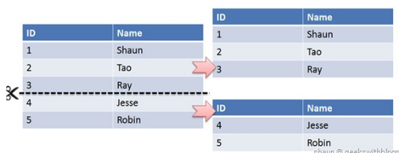
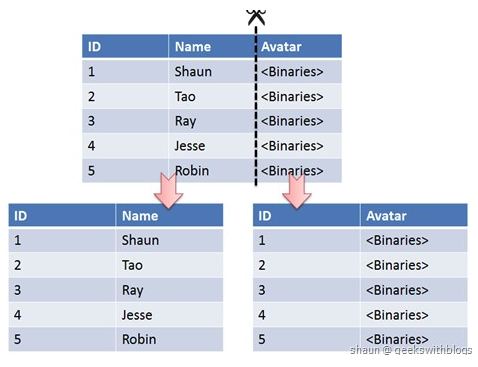

[TOC]

### MySQL分区与切分

#### 水平切分

水平切分又称为 **Sharding**，它是将**同一个表**中的记录拆分到**多个结构相同的表**中。

当一个表的数据不断增多时，Sharding 是必然的选择，它可以将数据分布到**集群**的不同节点上，从而缓解单个数据库的压力。

---

#### 垂直切分

垂直切分是将一张表**按列切分**成多个表，通常是按照列的**关系密集程度**进行切分，也可以利用垂直切分将经常被使用的列和不经常被使用的列切分到不同的表中。

在数据库的层面使用垂直切分将按数据库中表的密集程度部署到不同的库中，例如将原来的电商数据库垂直切分成商品数据库、用户数据库等。

----

#### Sharding 策略

- 哈希取模：**hash(key) % N**；
- 范围：可以是 **ID 范围**也可以是**时间范围**；
- 映射表：使用单独的一个数据库来存储映射关系。

#### Sharding 存在的问题

##### 1. 事务问题

使用**分布式事务**来解决，比如 XA 接口。

##### 2. 连接

可以将原来的连接分解成多个单表查询，然后在用户程序中进行连接。

##### 3. ID 唯一性

- 使用全局唯一 ID（GUID）
- 为每个分片指定一个 ID 范围
- 分布式 ID 生成器 (如 Twitter 的 Snowflake 算法)

