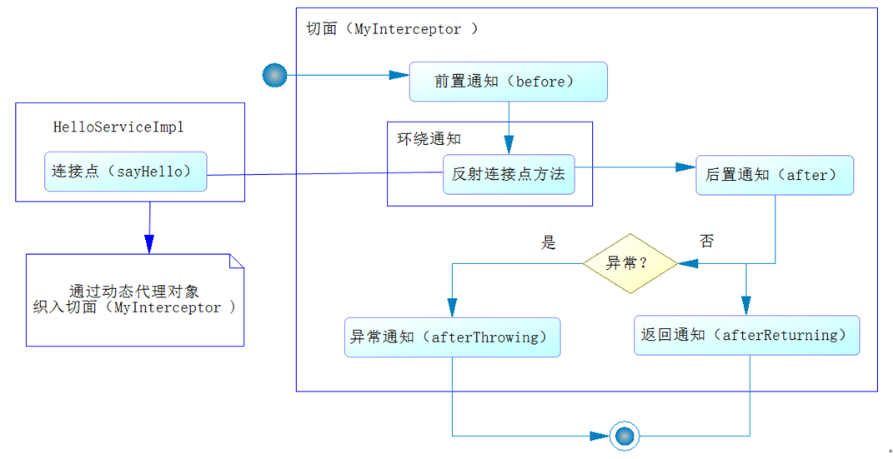

[TOC]

## Spring AOP

#### AOP 的概念

- 是一种约定流程的编程。
- 通过约定把对应的方法通过动态代理技织入约定的流程中。
- 核心：约定编程。作用：数据库事务、减少大量重复工作、对所有的web请求做切面来记录日志等。
- Spring AOP只能对方法进行拦截。


**为什么使用AOP？**

以下是数据库操作的流程图。


其中大量的操作都是默认的操作流程，所以数据库的打开和关闭以及事物的提交和回滚都是可以通过默认的流程实现的，我们只需要关注SQL的编写。

Spring AOP 的**流程约定**如下




#### AOP名词

- 切面（Aspect）：一个关注点的模块化，这个关注点可能会横切多个对象。事务管理是J2EE应用中一个关于横切关注点的很好的例子。在Spring AOP中，切面可以使用基于模式或者基于@Aspect注解的方式来实现。
- 连接点（Joinpoint）：在程序执行过程中某个特定的点，比如某方法调用的时候或者处理异常的时候。在Spring AOP中，一个连接点总是表示一个方法的执行。
- 通知（Advice）：在切面的某个特定的连接点上执行的动作。其中包括了“around”、“before”和“after”等不同类型的通知（通知的类型将在后面部分进行讨论）。许多AOP框架（包括Spring）都是以拦截器做通知模型，并维护一个以连接点为中心的拦截器链。
- 切入点（Pointcut）：匹配连接点的断言。通知和一个切入点表达式关联，并在满足这个切入点的连接点上运行（例如，当执行某个特定名称的方法时）。切入点表达式如何和连接点匹配是AOP的核心：Spring缺省使用AspectJ切入点语法。
- 引入（Introduction）：用来给一个类型声明额外的方法或属性（也被称为连接类型声明（inter-type declaration））。Spring允许引入新的接口（以及一个对应的实现）到任何被代理的对象。例如，你可以使用引入来使一个bean实现IsModified接口，以便简化缓存机制。
- 目标对象（Target Object）：被一个或者多个切面所通知的对象。也被称做被通知（advised）对象。既然Spring AOP是通过运行时代理实现的，这个对象永远是一个被代理（proxied）对象。
- AOP代理（AOP Proxy）：AOP框架创建的对象，用来实现切面契约（例如通知方法执行等等）。在Spring中，AOP代理可以是JDK动态代理或者CGLIB代理。
- 织入（Weaving）：把切面连接到其它的应用程序类型或者对象上，并创建一个被通知的对象。这些可以在编译时（例如使用AspectJ编译器），类加载时和运行时完成。Spring和其他纯Java AOP框架一样，在运行时完成织入。


#### 使用 @AspectJ 注解实现AOP

Spring  AOP 只能对方法进行拦截。

##### 确定连接点

首先确定在什么地方使用AOP，确定**连接点(就是什么类的什么方法)**。 首先定义一个接口

```java
// 用户服务接口
public interface UserService {
	
	public void printUser();
	public void printUser(User user);
	public void manyAspects();
}
```

实现此接口

```java
// 用户服务接口实现类
@Service
public class UserServiceImpl implements UserService {
	
	private User user = null;

	@Override
	public void printUser(User user) {
		if (user == null) {
			throw new RuntimeException("检查用户参数是否为空......");
		}
		System.out.print("id =" + user.getId());
		System.out.print("\tusername =" + user.getUsername());
		System.out.println("\tnote =" + user.getNote());
	}

	@Override
	public void printUser() {
		if (user == null) {
			throw new RuntimeException("检查用户参数是否为空......");
		}
		System.out.print("id =" + user.getId());
		System.out.print("\tusername =" + user.getUsername());
		System.out.println("\tnote =" + user.getNote());
	}
	
    @Override
	public void manyAspects() {
		System.out.println("测试多个切面顺序");
	}
	// Getter and setter
	
}
```

所以将上述的printUser() 方法作为连接点。


##### 开发切面与定义切点

使用@Aspect 注解定义一个切面类。方法中的 @After、@Before、@AfterThrowing 等注解是定义流程中的方法。

```java
@Aspect
public class MyAspect {
	
    // 此方法为切点，下面的传入此方法名即可
	@Pointcut("execution(* com.springboot.chapter4.*.*.*.*.print(..)) && bean('userServiceImpl')")
	public void pointCut() {
	}
	
	@Before("pointCut() && args(user)")
	public void beforeParam( User user) {
		System.out.println("before ......");
	} 
	
	@Before("pointCut()")
	public void before() {
		System.out.println("before ......");
	}
	
	@After("pointCut()")
	public void after() {
		System.out.println("after ......");
	}
	
	
	@AfterReturning("pointCut()")
	public void afterReturning() {
		System.out.println("afterReturning ......");
	}
	
	@AfterThrowing("pointCut()")
	public void afterThrowing() {
		System.out.println("afterThrowing ......");
	}
	

	@Around("pointCut()")
	public void around(ProceedingJoinPoint jp) throws Throwable {
		System.out.println("around before......");
		jp.proceed();
		System.out.println("around after......");
	}
}
```

上述中

```java
@Pointcut("execution(* com.springboot.chapter4.*.*.*.*.print(..)) && bean('userServiceImpl')")
public void pointCut() {
}
```

@Pointcut 注解定义了一个切点， 使用一个方法名指代，如 pointCut()。后面的 @AfterThrowing("pointCut()") 等注解中传入此方法名即可。

@Pointcut 注解中定义一个正则式，用于拦截方法。

```java
execution(* com.springboot.chapter4.*.*.*.*.print(..)
```

- execution 表示执行的时候拦截里面的正则匹配的方法。
- \* 表示任意返回值的方法。
- com.springboot.chapter4.*.*.*.*.print 指定方法。
- (..) 表示任意参数进行匹配。


**配置文件**

```java
// 指定扫描包
@SpringBootApplication(scanBasePackages = { "com.springboot.chapter4.aspect" })
public class Chapter4Application {

	// 启动切面
	public static void main(String[] args) {
		SpringApplication.run(Chapter4Application.class, args);
	}

	// 定义切面
	@Bean(name = "myAspect")        // 与自定义的切面类对应
	public MyAspect initMyAspect() {
		return new MyAspect();	
	}
}
```


##### 测试AOP

在controller中调用对应的方法测试。

```java
// 定义控制器
@Controller
// 定义类请求路径
@RequestMapping("/user")
public class UserController {

	// 注入用户服务
	@Autowired
	private UserService userService = null;

	// 定义请求
	@RequestMapping("/print")
	// 返回json
	@ResponseBody
	public User printUser(Long id, String userName, String note) {
		User user = new User();
		user.setId(id);
		user.setUsername(userName);
		user.setNote(note);
		userService.printUser(user);  // 此处调用了printUser方法就会调用切面中的逻辑
		return user;
	}
}	
```


**环绕通知（Around）**

是最强大的通知，但也难以控制，使用场景是需要大幅度修改原有目标对象的服务逻辑时，否则尽量使用其他的通知。


##### 引入

引入是给接口引入新的方法以增强其功能，可以给接口引入新的接口。

如现在给 UserService接口 引入一个用户检测接口 UserValidator。

```java
// 用户检测接口
public interface UserValidator {	
	public boolean validate(User user);
}
```

实现类

```java
public class UserValidatorImpl implements UserValidator {

	@Override
	public boolean validate(User user) {
		System.out.println("引入新的接口："+ UserValidator.class.getSimpleName());
		// 检测用户是否合法
        return user != null;
	}
}
```

引入新的接口,即在上面的 MyAspect 切面类中添加引入新的接口。

```java
@Aspect	// 切面类
public class MyAspect {
    
	@DeclareParents(value = "com.springboot.chapter4.aspect.service.impl.UserServiceImpl+", defaultImpl = UserValidatorImpl.class)
	public UserValidator userValidator;
}
```

@DeclareParents 注解用于引入新的类来增强服务，必须要定义两个属性：

- value：指向需要增强的目标对象
- defaultImpl：引入增强功能的类


测试引入

```java
// 定义请求
@RequestMapping("/vp")
@ResponseBody
public User validateAndPrint(Long id, String userName, String note) {
    User user = new User();
    user.setId(id);
    user.setUsername(userName);
    user.setNote(note);
    // 强制转换 因为userService 也引入了 UserValidator 接口的功能， 所以可以强制转换
    UserValidator userValidator = (UserValidator) userService;
    // 验证用户是否为空
    if (userValidator.validate(user)) {
        userService.printUser(user);
    }
    return user;
}
```


##### 织入

织入是一个生成动态代理对象且将切面和目标对象方法编织成为约定流程的过程。

两种模式，一是接口 + 实现类。如上述的流程就是，是Spring 推荐的方式。二是不使用接口模式。Spring采用了 JDK 和 CGLIB 两种方式实现动态代理，但是 Spring的处理规则是当需要使用AOP的类拥有接口时，会以 JDK 动态代理运行，否则以 CGLIB 运行。因此如果不使用 接口模式就会使用 CGLIB 动态代理。


####  多个切面

定义第一个切面类 实现Order接口

```java
@Aspect
public class MyAspect1 implements Ordered {     // 实现Order接口
	
	@Override
	public int getOrder() {
		return 1;
	}

	@Pointcut("execution(* com.springboot.chapter4.aspect.service.impl.UserServiceImpl.manyAspects(..))")
	public void manyAspects() {
	}

	@Before("manyAspects()")
	public void before() {
		System.out.println("MyAspect1 before ......");
	}

	@After("manyAspects()")
	public void after() {
		System.out.println("MyAspect1 after ......");
	}

	@After("manyAspects()")
	public void afterReturning() {
		System.out.println("MyAspect1 afterReturning ......");
	}

}
```

定义第二个切面类 使用@Order注解

```java
@Aspect
@Order(2)       // 使用@Order注解
public class MyAspect2 implements Ordered  {
	
	@Pointcut("execution(* com.springboot.chapter4.aspect.service.impl.UserServiceImpl.manyAspects(..))")
	public void manyAspects() {
	}

	@Before("manyAspects()")
	public void before() {
		System.out.println("MyAspect2 before ......");
	}

	@After("manyAspects()")
	public void after() {
		System.out.println("MyAspect2 after ......");
	}

	@After("manyAspects()")
	public void afterReturning() {
		System.out.println("MyAspect2 afterReturning ......");
	}

	@Override
	public int getOrder() {
		return 2;
	}
}
```

以下配置多个切面类。

```java
// 指定扫描包
@SpringBootApplication(scanBasePackages = { "com.springboot.chapter4.aspect" })
public class Chapter4Application {

	// 启动切面
	public static void main(String[] args) {
		SpringApplication.run(Chapter4Application.class, args);
	}

	// 定义切面
	@Bean(name = "myAspect")
	public MyAspect initMyAspect() {
		return new MyAspect();
	}

	// 定义切面
	@Bean(name = "myAspect2")
	public MyAspect2 initMyAspect2() {
		return new MyAspect2();
	}

	// 定义切面
	@Bean(name = "myAspect1")
	public MyAspect1 initMyAspect1() {
		return new MyAspect1();
	}

}
```

上述的多个切面可以是监控同一个方法，当调用方法时，使用 **@Order** 注解或者实现 Order接口 都能定义不同切面的执行顺序。推荐使用 **@Order** 注解。


