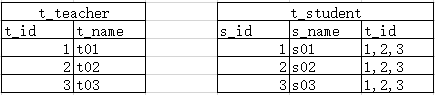
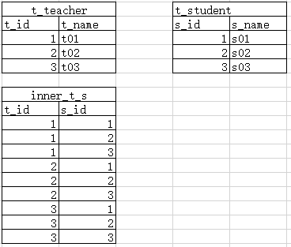
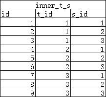
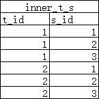

[TOC]

## Spring Boot 安全

- 应用程序的两个主要区域是“**认证”和“授权**”（或者访问控制）。这两个主要区域是Spring Security 的两个目标。

- “**认证**”（Authentication），是建立一个他声明的主体的过程（一个“主体”一般是指用户，设备或一些可以在你的应用程序中执行动作的其他系统）。

- “**授权**”（Authorization）指确定一个主体是否允许在你的应用程序执行一个动作的过程。为了抵达需要授权的店，主体的身份已经有认证过程建立。

- 这个概念是通用的而不只在Spring Security 中。


#### Spring Boot整合 Spring Security

依赖

```xml
<dependency>
	<groupId>org.springframework.boot</groupId>
	<artifactId>spring-boot-starter-security</artifactId>
</dependency>
```

 

#### 权限概述

- “权”：能做的事情

- “限”：限制

对登录系统的用户进行操作、行为方面的限制，对项目中的功能进行保护，让没有权力访问的用户不能访问。

**资源**

项目中被保护的功能就是资源。

资源可以体现为多种形式：

- URL地址

```
http://localhost:8080/oa/save/emp.html
```

- Java方法

```java
AdminServiceImpl.saveAdmin();
```

- 页面元素

```html
<a href="xxx">Show Something secret</a>
<form ...
<img ...
```

 

根据资源保护方式不同，可以把权限控制分成两部分：

- **粗粒度**权限控制

使用类似 **Filter** 或 Interceptor这样的机制，在项目运行的宏观层面从总体上控制每一个请求是否有权限访问一个资源。

- 细粒度权限控制

把用户不能操作的功能隐藏起来，让用户看不到不能访问的资源。

用户分类

- 登录后台管理系统的用户：Admin

- 登录前台会员系统的用户：User

用户可以看做使用系统的人在操作系统中具体功能的时候的具体身份。系统根据这个身份记录日志、控制权限。

**关联关系**

- **权限→资源**

数据库表：**多对多**关系

一个权限往往包含**多个**资源；

一个资源很有可能会被分配给**多个**不同权限；

Java类：单向；

关心一个权限中包含哪些资源，所以 Java 类方面权限对象能够获取到包含的资源即可。

不关心一个资源被分配给哪些权限了。

- **角色→权限**

数据库表：多对多关系

一个角色使用系统时会用到很多具体功能，这些功能必须都有权限才可以。

一个权限往往会被分配给多个不同角色。

Java类：单向；

关心一个角色包含哪些权限，需要通过角色对象获取对应的权限。

不关心权限被分配给了哪些角色。

- **用户→角色**

数据库表：多对多关系

一个角色是用户分类，同一个分类下往往包含很多具体用户。

一个用户有可能身兼数职，同时具备多个角色。

Java类：双向；

关心角色中包含哪些用户。有可能在管理用户数据时列出某个角色下所有用户。

关心用户包含哪些角色，从而决定这个用户是否可以访问某个资源。


**数据库中表示多对多**

需要用到中间表。  

- 不用中间表：



- 使用中间表：



中间表设置主键方式

- 方案一：另外设置专门字段



- 方案二：使用**联合主键**



两个字段（或多个字段）联合起来**共同构成主键**。构成联合主键的具体字段可以有重复值，**联合主键合并的值不能重复**。


#### 使用 Spring Security

基于角色进行访问控制

```java
security.authorizeRequests()        // 对请求进行授权
        .antMatchers("/layui/**","/index.jsp")   // 使用ANT风格设置要授权的URL地址
        .permitAll()                // 允许上面使用ANT风格设置的全部请求
        .antMatchers("/level1/**")
        .hasRole("学徒")
        .antMatchers("/level2/**")
        .hasRole("大师")
        .antMatchers("/level3/**")
        .hasRole("宗师")
        .anyRequest()               // 其他未设置的全部请求
        .authenticated()            // 需要认证
        .and()
        .formLogin()                // 设置未授权请求跳转到登录页面：开启表单登录功能
        .loginPage("/index.jsp")    // 指定登录页
        .permitAll()                // 为登录页设置所有人都可以访问
        .defaultSuccessUrl("/main.html") // 设置登录成功后默认前往的URL地址
        .and()
        .logout()
        .logoutUrl("/my/logout")
        .logoutSuccessUrl("/index.jsp")
    	.and()
    	.exceptionHandling().
    	accessDeniedPage("/to/no/auth/page");	// 配置访问被拒绝后的重定向路径

```

通过 AuthenticationManagerBuilder 对象设置用户登录时具备的角色。(基于内存的方式)

```java
builder.inMemoryAuthentication()
    .withUser("tom").password("123123")  // 设置账号密码
    .roles("ADMIN","学徒","宗师")           // 设置角色
    .and()
    .withUser("jerry").password("456456")// 设置另一个账号密码
    .authorities("SAVE","EDIT");         // 设置权限
```

注意：调用顺序。

```java
.antMatchers("/level1/**")		// 设置匹配/level1/**的地址
.hasRole("学徒")				   // 要求具备“学徒”角色
.antMatchers("/level2/**")
.hasRole("大师")
.antMatchers("/level3/**")
.hasRole("宗师") 
.anyRequest()	                // 其实未设置的所有请求
.authenticated() 				// 需要认证才可以访问
```

**范围小的放前面！！！！！**

所以要先做具体小范围设置，再做大范围模糊设置。


