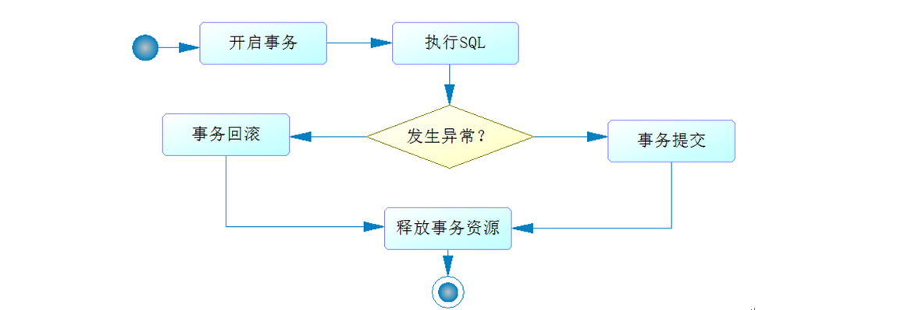
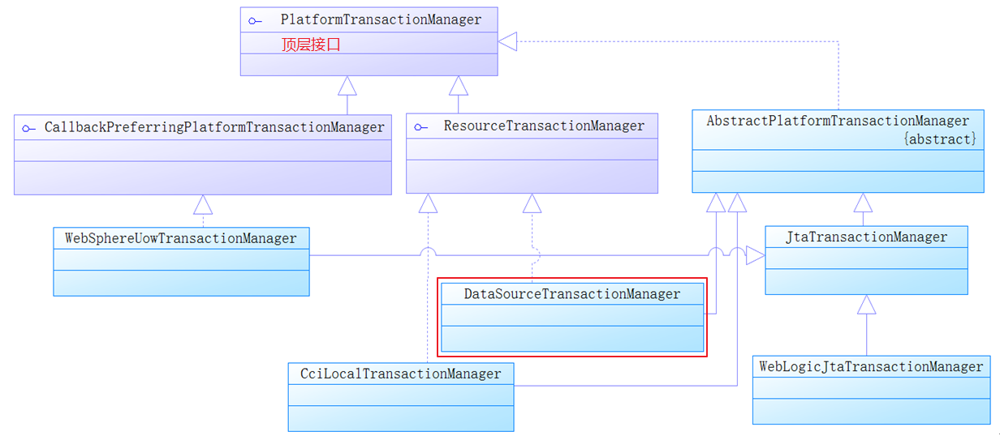

[TOC]

### Spring Boot事务

#### 概述

数据库事务是通过AOP 技术提供服务的。

Spring 数据库事务多采用声明式事务，编程式事务已经用的不多了。

执行SQL 事务的流程如下。



AOP 将除去SQL之外公共的代码抽离出来单独实现。


#### Spring 声明式事务的使用

Spring 数据库的事务约定如下：


##### @Transactional

对于声明式事务，Spring 通过注解 @Transactional 进行标注，告诉 Spring 在什么地方启用数据库事务功能。这个注解可以标注到类或方法上。 @Transactional 还可以配置隔离级别和传播行为等。

无论发生异常与否，Spring 都会释放事务。

@Transactional 可以放在接口或者实现类中，推荐放在实现类上。

**@Transactional 源码分析**

```java
package org.springframework.transaction.annotation;

import java.lang.annotation.Documented;
import java.lang.annotation.ElementType;
import java.lang.annotation.Inherited;
import java.lang.annotation.Retention;
import java.lang.annotation.RetentionPolicy;
import java.lang.annotation.Target;
import org.springframework.core.annotation.AliasFor;

@Target({ElementType.TYPE, ElementType.METHOD})
@Retention(RetentionPolicy.RUNTIME)
@Inherited
@Documented
public @interface Transactional {
    // 通过bean name指定事务管理器
    @AliasFor("transactionManager")
    String value() default "";

    // 同value属性
    @AliasFor("value")
    String transactionManager() default "";

    // 指定传播行为
    Propagation propagation() default Propagation.REQUIRED;

    // 指定隔离级别
    Isolation isolation() default Isolation.DEFAULT;

    // 指定超时时间
    int timeout() default -1;

    // 是否只读事务
    boolean readOnly() default false;

    // 下面是关于异常回滚的内容
    Class<? extends Throwable>[] rollbackFor() default {};

    String[] rollbackForClassName() default {};

    Class<? extends Throwable>[] noRollbackFor() default {};

    String[] noRollbackForClassName() default {};
}
```

使用注解，在实现类中使用。

```java
@Service
public class UserServiceImpl implements UserService {

	@Autowired
	private UserDao userDao = null;

	@Override
    // 定义了隔离级别和超时时间
	@Transactional(isolation = Isolation.READ_COMMITTED, timeout = 1)
	public int insertUser(User user) {
		return userDao.insertUser(user);
	}

	@Override
	@Transactional(isolation = Isolation.READ_COMMITTED, timeout = 1)
	public User getUser(Long id) {
		return userDao.getUser(id);
	}
}
```


##### Spring 事务管理器

事务流程都是由事务管理器完成的。其接口体系如图所示。



DataSourceTransactionManager 是比较常用的事务管理器。

如果依赖 mybatis-spring-boot-starter 之后，会自动创建一个 DataSourceTransactionManager 对象作为事务管理。

如果依赖 spring-boot-starter-jpa ，会自动穿件 JpaTransactionManager 对象作为事务管理器。

可以直接注入事务管理器类。

```java
@MapperScan(
    basePackages = "com.springboot.chapter6", 
    annotationClass = Repository.class)
@SpringBootApplication(scanBasePackages = "com.springboot.chapter6")
public class Chapter6Application {
    public static void main(String[] args) throws Exception {
        SpringApplication.run(Chapter6Application.class, args);
    }
    // 注入事务管理器，它由Spring Boot自动生成
    @Autowired
    PlatformTransactionManager transactionManager = null; 

    // 使用后初始化方法，观察自动生成的事务管理器
    @PostConstruct
    public void viewTransactionManager() {
        // 启动前加入断点观测
        System.out.println(transactionManager.getClass().getName());
    }
}
```


#### 传播行为

传播行为是方法之间调用事务采取的策略问题。七种传播行为常用的三种。

##### PROPAGATION_REQUIRED

如果存在一个事务，则支持当前事务。如果没有事务则开启一个新的事务。 
可以把事务想像成一个胶囊，在这个场景下方法B用的是方法A产生的胶囊（事务）。 

```java
@Transactional(propagation = Propagation.REQUIRED)
public void methodA() {
 	methodB();
// do something
}
 
@Transactional(propagation = Propagation.REQUIRED)
public void methodB() {
    // do something
}
```

单独调用methodB方法时，因为当前上下文不存在事务，所以会开启一个新的事务。 
调用methodA方法时，因为当前上下文不存在事务，所以会开启一个新的事务。当执行到methodB时，methodB发现当前上下文有事务，因此就加入到当前事务中来。


##### PROPAGATION_REQUIRES_NEW

使用PROPAGATION_REQUIRES_NEW,需要使用 JtaTransactionManager作为事务管理器。 
它会开启一个新的事务。如果一个事务已经存在，则先将这个存在的事务挂起。

##### PROPAGATION_NESTED

如果一个活动的事务存在，则运行在一个嵌套的事务中。 如果没有活动事务, 则按TransactionDefinition.PROPAGATION_REQUIRED 属性执行。 
这是一个**嵌套事务**,使用JDBC 3.0驱动时,仅仅支持 DataSourceTransactionManager 作为事务管理器。 
需要JDBC 驱动的java.sql.Savepoint类。使用PROPAGATION_NESTED，还需要把PlatformTransactionManager的 nestedTransactionAllowed 属性设为 true (属性值默认为false)。


#### @Transactional 自调用失效

AOP 的原理是动态代理，在自调用的过程中，是类自身的调用，而不是代理对象去调用，就不会产生 AOP，这样Spring就不会把代码织入到相关的流程中，产生失败问题。


