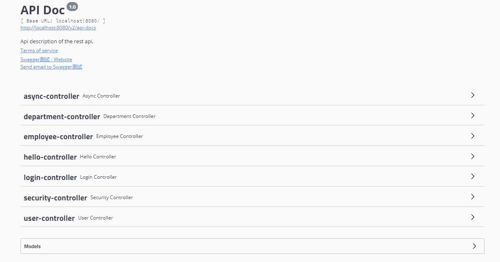

[TOC]

### Spring Boot Swagger

#### 整合Swagger

依赖

```xml
<!--引入swagger-->
<dependency>
	<groupId>io.springfox</groupId>
	<artifactId>springfox-swagger2</artifactId>
	<version>2.9.2</version>
</dependency>
<dependency>
	<groupId>io.springfox</groupId>
	<artifactId>springfox-swagger-ui</artifactId>
	<version>2.9.2</version>
</dependency>
```

配置类

```java
import org.springframework.context.annotation.Bean;
import org.springframework.context.annotation.Configuration;
import springfox.documentation.builders.ApiInfoBuilder;
import springfox.documentation.builders.PathSelectors;
import springfox.documentation.builders.RequestHandlerSelectors;
import springfox.documentation.service.ApiInfo;
import springfox.documentation.service.Contact;
import springfox.documentation.spi.DocumentationType;
import springfox.documentation.spring.web.plugins.Docket;
import springfox.documentation.swagger2.annotations.EnableSwagger2;

/**
 * Swagger 配置类
 * @author cz
 */
@Configuration
@EnableSwagger2
public class SwaggerConfig {

    @Bean
    public Docket createRestApi() {
        return new Docket(DocumentationType.SWAGGER_2)
                .apiInfo(apiInfo())
                .select()
                // swagger要扫描的包路径
                .apis(RequestHandlerSelectors.basePackage("com.example.demo.controller"))
                .paths(PathSelectors.any())
                .build();
    }

	// 配置API信息
    private ApiInfo apiInfo() {
        return new ApiInfoBuilder()
                .title("API Doc")
                .description("Api description of the rest api.")
                .termsOfServiceUrl("localhost:8080/api")
                .contact(new Contact("联系我","http://localhost:8080/swagger-ui.html","1174520425@qq.com"))
                .version("1.0")
                .build();
    }
}
```

在Controller上标注API信息

```java
@RestController
public class UserController {

    @Autowired
    UserRepository userRepository;

    @ApiOperation(value = "获取用户", notes = "根据id查询用户信息")
    @ApiImplicitParam(name = "id", value = "用户id", required = true, dataType = "Integer")
    @GetMapping("/user/{id}")
    public User getUser(@PathVariable("id") Integer id){
        User user = userRepository.findById(id).get();
        return user;
    }
}    
```

其他常见的注解如下

```java
@Api：表示标识这个类是swagger的资源 
@ApiOperation：描述针对特定路径的操作或HTTP方法
@ApiImplicitParam：表示API操作中的单个参数
@ApiImplicitParams：允许多个ApiImplicitParam对象列表的包装器
@ApiModel：提供关于Swagger模型的额外信息
@ApiModelProperty：添加和操作模型属性的数据
@ApiParam：为操作参数添加额外的元数据
@ApiResponse：描述一个操作的可能响应
@ApiResponses：允许多个ApiResponse对象列表的包装器
@ResponseHeader：表示可以作为响应的一部分提供的标头
@Authorization：声明要在资源或操作上使用的授权方案
@AuthorizationScope：描述OAuth2授权范围
```

访问   http://localhost:8080/swagger-ui.html



