[TOC]

[TOC]

## HDFS

### 1.概述


#### 1.1 HDFS产生的背景


#### 1.2 HDFS定义


#### 1.3 HDFS优缺点

优点：

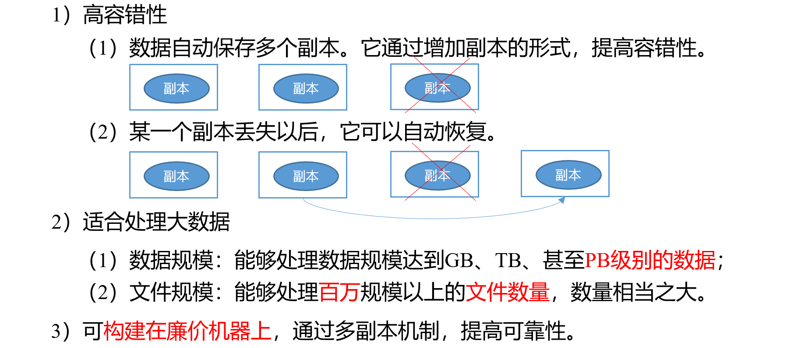

缺点：

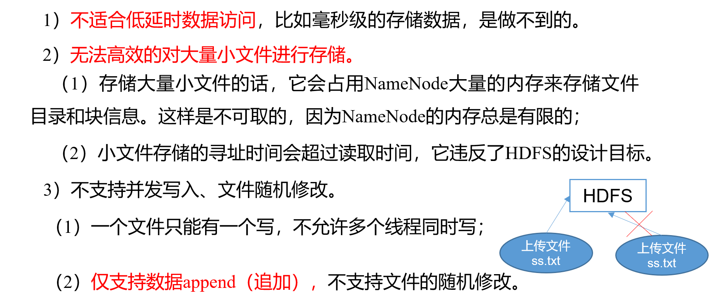

#### ==1.4 HDFS组成架构==

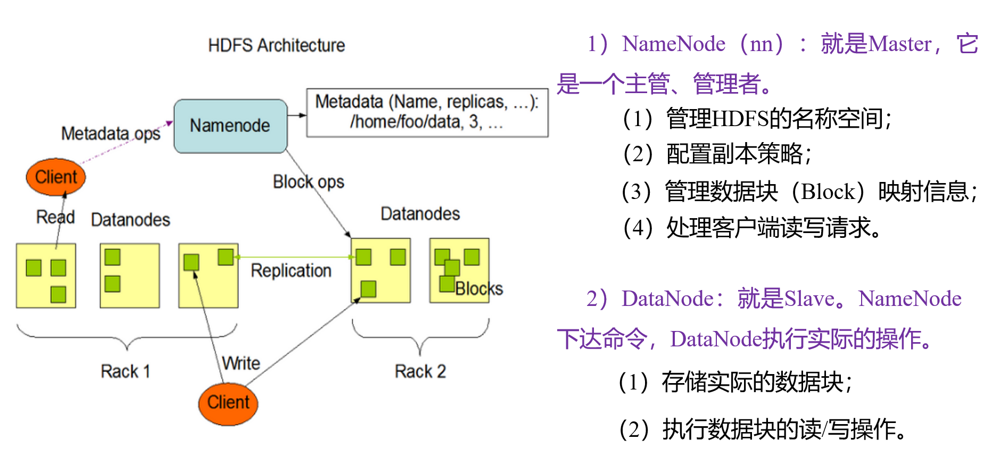


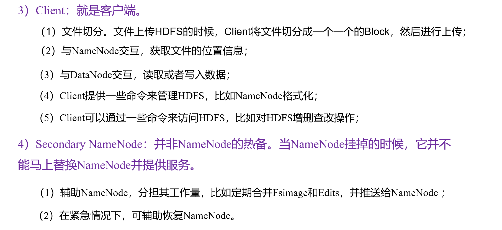


#### 1.5 HDFS文件块

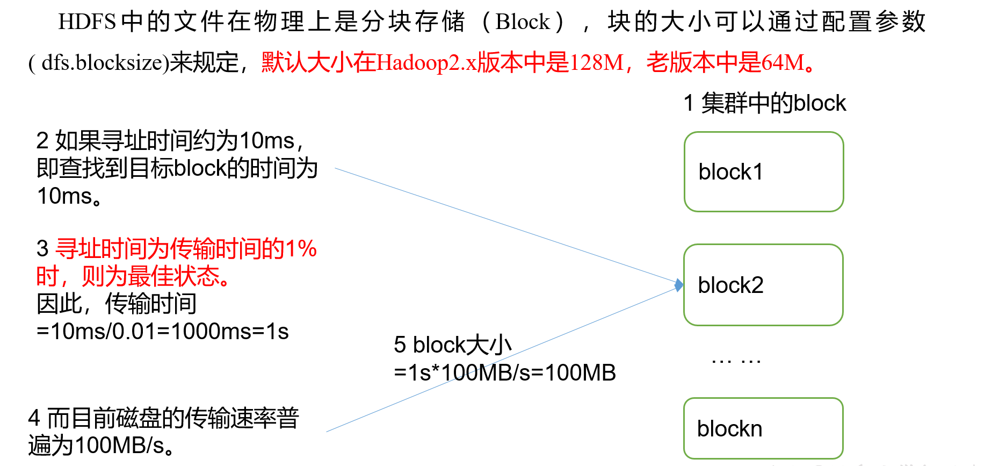


为什么块的大小不能设置太小或者太大？

- HDFS 的块设置太小，会增加寻址时间，程序一直在找块的位置。
- 如果块设置太大，从磁盘传输数据的时间会明显大于块寻址所花的时间。
- **HDFS 块的大小设置主要取决于磁盘传输速率。**


### 2. HDFS Shell操作

**基本语法**

```shell
bin/hadoop fs 具体命令   
OR  
bin/hdfs dfs 具体命令
dfs是fs的实现类
```

**命令大全**

```bash
$ bin/hadoop fs
[-appendToFile <localsrc> ... <dst>]
    [-cat [-ignoreCrc] <src> ...]
    [-checksum <src> ...]
    [-chgrp [-R] GROUP PATH...]
    [-chmod [-R] <MODE[,MODE]... | OCTALMODE> PATH...]
    [-chown [-R] [OWNER][:[GROUP]] PATH...]
    [-copyFromLocal [-f] [-p] <localsrc> ... <dst>]
    [-copyToLocal [-p] [-ignoreCrc] [-crc] <src> ... <localdst>]
    [-count [-q] <path> ...]
    [-cp [-f] [-p] <src> ... <dst>]
    [-createSnapshot <snapshotDir> [<snapshotName>]]
    [-deleteSnapshot <snapshotDir> <snapshotName>]
    [-df [-h] [<path> ...]]
    [-du [-s] [-h] <path> ...]
    [-expunge]
    [-get [-p] [-ignoreCrc] [-crc] <src> ... <localdst>]
    [-getfacl [-R] <path>]
    [-getmerge [-nl] <src> <localdst>]
    [-help [cmd ...]]
    [-ls [-d] [-h] [-R] [<path> ...]]
    [-mkdir [-p] <path> ...]
    [-moveFromLocal <localsrc> ... <dst>]
    [-moveToLocal <src> <localdst>]
    [-mv <src> ... <dst>]
    [-put [-f] [-p] <localsrc> ... <dst>]
    [-renameSnapshot <snapshotDir> <oldName> <newName>]
    [-rm [-f] [-r|-R] [-skipTrash] <src> ...]
    [-rmdir [--ignore-fail-on-non-empty] <dir> ...]
    [-setfacl [-R] [{-b|-k} {-m|-x <acl_spec>} <path>]|[--set <acl_spec> <path>]]
    [-setrep [-R] [-w] <rep> <path> ...]
    [-stat [format] <path> ...]
    [-tail [-f] <file>]
    [-test -[defsz] <path>]
    [-text [-ignoreCrc] <src> ...]
    [-touchz <path> ...]
    [-usage [cmd ...]]
```

常用命令实操

- 启动Hadoop集群（方便后续的测试）

```shell
$ sbin/start-dfs.sh
$ sbin/start-yarn.sh
```

- -help：输出这个命令参数

```shell
$ hadoop fs -help rm
```

- -ls: 显示目录信息

```shell
$ hadoop fs -ls /
```

- -mkdir：在HDFS上创建目录

```shell
$ hadoop fs -mkdir -p /sanguo/shuguo
```

- -moveFromLocal：从本地剪切粘贴到HDFS

```shell
$ touch kongming.txt  # 新建文件
$ hadoop fs -moveFromLocal ./kongming.txt /sanguo/shuguo
```

- -appendToFile：追加一个文件到已经存在的文件末尾

```shell
$ touch liubei.txt
$ vi liubei.txt   # 输入 san gu mao lu
$ hadoop fs -appendToFile liubei.txt /sanguo/shuguo/kongming.txt
```

- -cat：显示文件内容

```shell
$ hadoop fs -cat /sanguo/shuguo/kongming.txt
```

- -chgrp 、-chmod、-chown：Linux文件系统中的用法一样，修改文件所属权限

```shell
$ hadoop fs -chmod 666 /sanguo/shuguo/kongming.txt
$ hadoop fs -chown atguigu:atguigu  /sanguo/shuguo/kongming.txt
```

- -copyFromLocal：从本地文件系统中拷贝文件到HDFS路径去

```shell
$ hadoop fs -copyFromLocal README.txt /
```

- -copyToLocal：从HDFS拷贝到本地

```shell
$ hadoop fs -copyToLocal /sanguo/shuguo/kongming.txt ./
```

- -cp ：从HDFS的一个路径拷贝到HDFS的另一个路径

```shell
$ hadoop fs -cp /sanguo/shuguo/kongming.txt /zhuge.txt
```

- -mv：在HDFS目录中移动文件

```shell
$ hadoop fs -mv /zhuge.txt /sanguo/shuguo/
```

- -get：等同于copyToLocal，就是从HDFS下载文件到本地

```shell
$ hadoop fs -get /sanguo/shuguo/kongming.txt ./
```

- -getmerge：合并下载多个文件，比如HDFS的目录 /user/atguigu/test下有多个文件:log.1, log.2,log.3,...

```sh
$ hadoop fs -getmerge /user/atguigu/test/* ./zaiyiqi.txt
```

- -put：等同于copyFromLocal

```sh
$ hadoop fs -put ./zaiyiqi.txt /user/atguigu/test/

```

- -tail：显示一个文件的末尾

```sh
$ hadoop fs -tail /sanguo/shuguo/kongming.txt

```

- -rm：删除文件或文件夹

```sh
$ hadoop fs -rm /user/atguigu/test/jinlian2.txt

```

- -rmdir：删除空目录

```sh
$ hadoop fs -mkdir /test
$ hadoop fs -rmdir /test

```

- -du统计文件夹的大小信息

```sh
$ hadoop fs -du -s -h /user/atguigu/test
2.7 K /user/atguigu/test
$ hadoop fs -du -h /user/atguigu/test
1.3 K /user/atguigu/test/README.txt
15   /user/atguigu/test/jinlian.txt
1.4 K /user/atguigu/test/zaiyiqi.txt

```

- -setrep：设置HDFS中文件的副本数量,如下图。

```sh
$ hadoop fs -setrep 10 /sanguo/shuguo/kongming.txt

```


这里设置的副本数只是记录在 NameNode 的元数据中，是否真的会有这么多副本，还得看 DataNode 的数量。因为目前只有 3 台设备，最多也就 3 个副本，只有节点数的增加到 10 台时，副本数才能达到 10。


### 3. HDFS 客户端操作

#### 3.1 客户端环境准备

- 根据自己电脑的操作系统拷贝对应的编译后的hadoop jar包到非中文路径（例如：D:\Develop\hadoop-2.7.2），如图所示。

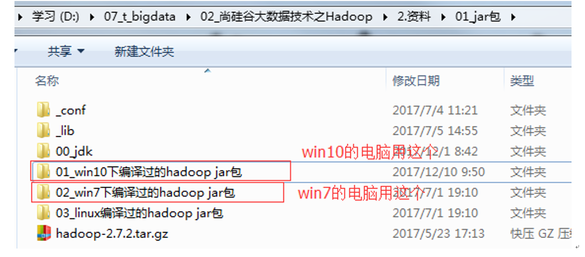

- 配置HADOOP_HOME环境变量。  

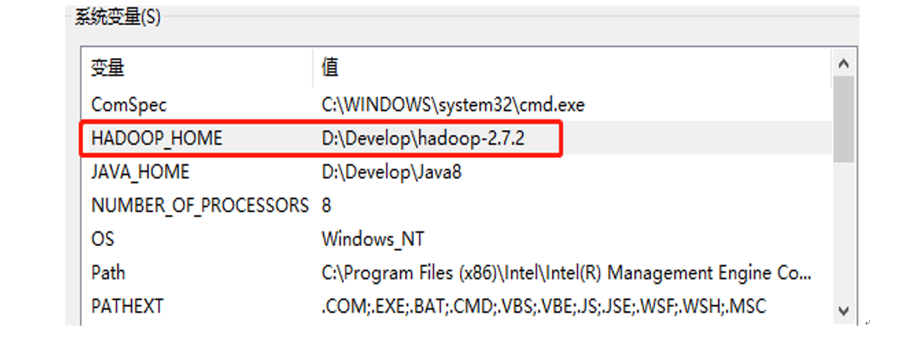

- 配置Path环境变量  

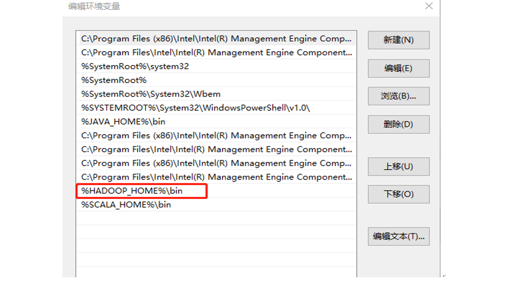

- 创建一个Maven工程HdfsClientDemo

- 导入相应的依赖坐标+日志添加

```xml
<dependencies>
    <dependency>
        <groupId>junit</groupId>
        <artifactId>junit</artifactId>
        <version>RELEASE</version>
    </dependency>
    <dependency>
        <groupId>org.apache.logging.log4j</groupId>
        <artifactId>log4j-core</artifactId>
        <version>2.8.2</version>
    </dependency>
    <dependency>
        <groupId>org.apache.hadoop</groupId>
        <artifactId>hadoop-common</artifactId>
        <version>2.7.2</version>
    </dependency>
    <dependency>
        <groupId>org.apache.hadoop</groupId>
        <artifactId>hadoop-client</artifactId>
        <version>2.7.2</version>
    </dependency>
    <dependency>
        <groupId>org.apache.hadoop</groupId>
        <artifactId>hadoop-hdfs</artifactId>
        <version>2.7.2</version>
    </dependency>
    <dependency>
        <groupId>jdk.tools</groupId>
        <artifactId>jdk.tools</artifactId>
        <version>1.8</version>
        <scope>system</scope>
        <systemPath>${JAVA_HOME}/lib/tools.jar</systemPath>
    </dependency>
</dependencies>

```

注意：如果Idea打印不出日志，在控制台上只显示如下内容：

```java
1.log4j:WARN No appenders could be found for logger (org.apache.hadoop.util.Shell).  
2.log4j:WARN Please initialize the log4j system properly.  
3.log4j:WARN See http://logging.apache.org/log4j/1.2/faq.html#noconfig for more info.

```

需要在项目的 src/main/resources 目录下，新建一个文件，命名为“ **log4j.properties** ”，在文件中填入

```properties
log4j.rootLogger=INFO, stdout
log4j.appender.stdout=org.apache.log4j.ConsoleAppender
log4j.appender.stdout.layout=org.apache.log4j.PatternLayout
log4j.appender.stdout.layout.ConversionPattern=%d %p [%c] - %m%n
log4j.appender.logfile=org.apache.log4j.FileAppender
log4j.appender.logfile.File=target/spring.log
log4j.appender.logfile.layout=org.apache.log4j.PatternLayout
log4j.appender.logfile.layout.ConversionPattern=%d %p [%c] - %m%n

```

- 创建包名：com.atguigu.hdfs
- 创建 HdfsClient 类

```java
public class HdfsClient{	
	@Test
	public void testMkdirs() throws IOException, InterruptedException, URISyntaxException{
        // 1 获取文件系统
        Configuration configuration = new Configuration();
        // 配置在集群上运行
        // configuration.set("fs.defaultFS", "hdfs://hadoop102:9000");
        // FileSystem fs = FileSystem.get(configuration);
        FileSystem fs = FileSystem.get(new URI("hdfs://hadoop102:9000"), configuration, "atguigu");
        // 2 创建目录
        fs.mkdirs(new Path("/1108/daxian/banzhang"));
        // 3 关闭资源
        fs.close();
    }
}

```

- 执行程序, 运行时需要配置用户名称。

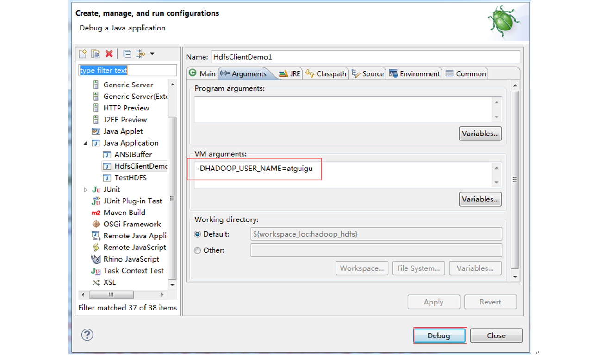

客户端去操作 HDFS 时，是有一个**用户身份**的。默认情况下，HDFS 客户端 API 会从 JVM 中获取一个**参数**来作为自己的用户身份：-DHADOOP_USER_NAME=atguigu，atguigu为用户名称。


#### 3.2 HDFS的API操作

##### 3.2.1 HDFS 文件上传（测试参数优先级）

```java
@Test
public void testCopyFromLocalFile() throws IOException, InterruptedException,         		URISyntaxException {
    // 1 获取文件系统
    Configuration configuration = new Configuration();
    configuration.set("dfs.replication", "2");
    FileSystem fs = FileSystem.get(new URI("hdfs://hadoop102:9000"), configuration, "atguigu");

    // 2 上传文件
    fs.copyFromLocalFile(new Path("e:/banzhang.txt"), new Path("/banzhang.txt"));

    // 3 关闭资源
    fs.close();

    System.out.println("over");
}

```

**将 hdfs-site.xml 拷贝到项目的根目录下** 。这是必须的动作，客户端需要Hadoop的配置文件！！！

```xml
<?xml version="1.0" encoding="UTF-8"?>
<?xml-stylesheet type="text/xsl" href="configuration.xsl"?>
<configuration>
	<property>
		<name>dfs.replication</name>
        <value>1</value>
	</property>
</configuration>

```

- 参数优先级

参数优先级排序：（1）客户端代码中设置的值 >（2）ClassPath下的用户自定义配置文件 >（3）然后是服务器的默认配置。

##### 3.2.2 HDFS 文件下载

```java
@Test
public void testCopyToLocalFile() throws IOException, InterruptedException, 				URISyntaxException{
    // 1 获取文件系统
    Configuration configuration = new Configuration();
    FileSystem fs = FileSystem.get(new URI("hdfs://hadoop102:9000"), configuration, "atguigu");

    // 2 执行下载操作
    // boolean delSrc 指是否将原文件删除
    // Path src 指要下载的文件路径
    // Path dst 指将文件下载到的路径
    // boolean useRawLocalFileSystem 是否开启文件校验
    fs.copyToLocalFile(false, new Path("/banzhang.txt"), new Path("e:/banhua.txt"), true);

    // 3 关闭资源
    fs.close();
}

```

##### 3.2.3 HDFS 文件夹删除

```java
@Test
public void testDelete() throws IOException, InterruptedException, URISyntaxException{
	// 1 获取文件系统
	Configuration configuration = new Configuration();
	FileSystem fs = FileSystem.get(new URI("hdfs://hadoop102:9000"), configuration, "atguigu");
		
	// 2 执行删除
	fs.delete(new Path("/0508/"), true);
		
	// 3 关闭资源
	fs.close();
}

```

##### 3.2.4 HDFS 文件名更改

```java
@Test
public void testRename() throws IOException, InterruptedException, URISyntaxException{
	// 1 获取文件系统
	Configuration configuration = new Configuration();
	FileSystem fs = FileSystem.get(new URI("hdfs://hadoop102:9000"), configuration, "atguigu"); 
		
	// 2 修改文件名称
	fs.rename(new Path("/banzhang.txt"), new Path("/banhua.txt"));
		
	// 3 关闭资源
	fs.close();
}

```

##### 3.2.5 HDFS文件详情查看

查看文件名称、权限、长度、块信息

```java
@Test
public void testListFiles() throws IOException, InterruptedException, URISyntaxException{

	// 1获取文件系统
	Configuration configuration = new Configuration();
	FileSystem fs = FileSystem.get(new URI("hdfs://hadoop102:9000"), configuration, "atguigu"); 
		
	// 2 获取文件详情
	RemoteIterator<LocatedFileStatus> listFiles = fs.listFiles(new Path("/"), true);
		
	while(listFiles.hasNext()){
		LocatedFileStatus status = listFiles.next();
			
		// 输出详情
		// 文件名称
		System.out.println(status.getPath().getName());
		// 长度
		System.out.println(status.getLen());
		// 权限
		System.out.println(status.getPermission());
		// 分组
		System.out.println(status.getGroup());
			
		// 获取存储的块信息
		BlockLocation[] blockLocations = status.getBlockLocations();
			
		for (BlockLocation blockLocation : blockLocations) {
				
			// 获取块存储的主机节点
			String[] hosts = blockLocation.getHosts();
				
			for (String host : hosts) {
				System.out.println(host);
			}
		}
			
		System.out.println("-----------班长的分割线----------");
	}

    // 3 关闭资源
    fs.close();
}

```

##### 3.2.6 HDFS 文件和文件夹判断

```java
@Test
public void testListStatus() throws IOException, InterruptedException, URISyntaxException{
		
	// 1 获取文件配置信息
	Configuration configuration = new Configuration();
	FileSystem fs = FileSystem.get(new URI("hdfs://hadoop102:9000"), configuration, "atguigu");
		
	// 2 判断是文件还是文件夹
	FileStatus[] listStatus = fs.listStatus(new Path("/"));
		
	for (FileStatus fileStatus : listStatus) {
		
		// 如果是文件
		if (fileStatus.isFile()) {
				System.out.println("f:"+fileStatus.getPath().getName());
			}else {
				System.out.println("d:"+fileStatus.getPath().getName());
			}
		}
		
	// 3 关闭资源
	fs.close();
}

```


#### 3.3 HDFS的I/O流操作

上面我们学的 API 操作HDFS系统都是**框架封装**好的。那么如果我们想自己实现上述 API 的操作该怎么实现呢？

我们可以采用 **IO 流**的方式实现数据的上传和下载。

##### 3.3.1 HDFS 文件上传

需求：把本地 e 盘上的 banhua.txt 文件上传到 HDFS 根目录  

编写代码

```java
@Test
public void putFileToHDFS() throws IOException, InterruptedException, URISyntaxException {

	// 1 获取文件系统
	Configuration configuration = new Configuration();
	FileSystem fs = FileSystem.get(new URI("hdfs://hadoop102:9000"), configuration, "atguigu");

	// 2 创建输入流
	FileInputStream fis = new FileInputStream(new File("e:/banhua.txt"));

	// 3 获取输出流
	FSDataOutputStream fos = fs.create(new Path("/banhua.txt"));

	// 4 流对拷
	IOUtils.copyBytes(fis, fos, configuration);

	// 5 关闭资源
	IOUtils.closeStream(fos);
	IOUtils.closeStream(fis);
    fs.close();
}

```


##### 3.3.2 HDFS 文件下载

需求：从HDFS上下载banhua.txt文件到本地e盘上  

```java
// 文件下载
@Test
public void getFileFromHDFS() throws IOException, InterruptedException, URISyntaxException{

	// 1 获取文件系统
	Configuration configuration = new Configuration();
	FileSystem fs = FileSystem.get(new URI("hdfs://hadoop102:9000"), configuration, "atguigu");
		
	// 2 获取输入流
	FSDataInputStream fis = fs.open(new Path("/banhua.txt"));
		
	// 3 获取输出流
	FileOutputStream fos = new FileOutputStream(new File("e:/banhua.txt"));
		
	// 4 流的对拷
	IOUtils.copyBytes(fis, fos, configuration);
		
	// 5 关闭资源
	IOUtils.closeStream(fos);
	IOUtils.closeStream(fis);
	fs.close();
}

```


##### 3.3.3 定位文件读取

需求：分块读取HDFS上的大文件，比如根目录下的/hadoop-2.7.2.tar.gz

编写代码

- 下载第一块

```java
@Test
public void readFileSeek1() throws IOException, InterruptedException, URISyntaxException{

	// 1 获取文件系统
	Configuration configuration = new Configuration();
	FileSystem fs = FileSystem.get(new URI("hdfs://hadoop102:9000"), configuration, "atguigu");
		
	// 2 获取输入流
	FSDataInputStream fis = fs.open(new Path("/hadoop-2.7.2.tar.gz"));
		
	// 3 创建输出流
	FileOutputStream fos = new FileOutputStream(new File("e:/hadoop-2.7.2.tar.gz.part1"));
		
	// 4 流的拷贝
	byte[] buf = new byte[1024];
		
	for(int i =0 ; i < 1024 * 128; i++){
		fis.read(buf);
		fos.write(buf);
	}
		
	// 5关闭资源
	IOUtils.closeStream(fis);
	IOUtils.closeStream(fos);
	fs.close();
}

```

- 下载第二块

```java
@Test
public void readFileSeek2() throws IOException, InterruptedException, URISyntaxException{

	// 1 获取文件系统
	Configuration configuration = new Configuration();
	FileSystem fs = FileSystem.get(new URI("hdfs://hadoop102:9000"), configuration, "atguigu");
		
	// 2 打开输入流
	FSDataInputStream fis = fs.open(new Path("/hadoop-2.7.2.tar.gz"));
		
	// 3 定位输入数据位置
	fis.seek(1024*1024*128);
		
	// 4 创建输出流
	FileOutputStream fos = new FileOutputStream(new File("e:/hadoop-2.7.2.tar.gz.part2"));
		
	// 5 流的对拷
	IOUtils.copyBytes(fis, fos, configuration);
		
	// 6 关闭资源
	IOUtils.closeStream(fis);
	IOUtils.closeStream(fos);
}

```

- 合并文件  

在 Window 命令窗口中进入到目录 E:\，然后执行如下命令，对数据进行合并

type hadoop-2.7.2.tar.gz.part2 >> hadoop-2.7.2.tar.gz.part1

合并完成后，将 hadoop-2.7.2.tar.gz.part1 重新命名为 hadoop-2.7.2.tar.gz。解压发现该 tar 包非常完整。


### 4. HDFS 的读写数据分析

#### 4.1 HDFS写数据流程

##### 4.1.1 剖析剖析文件写入

==HDFS写数据流程==，如图所示。

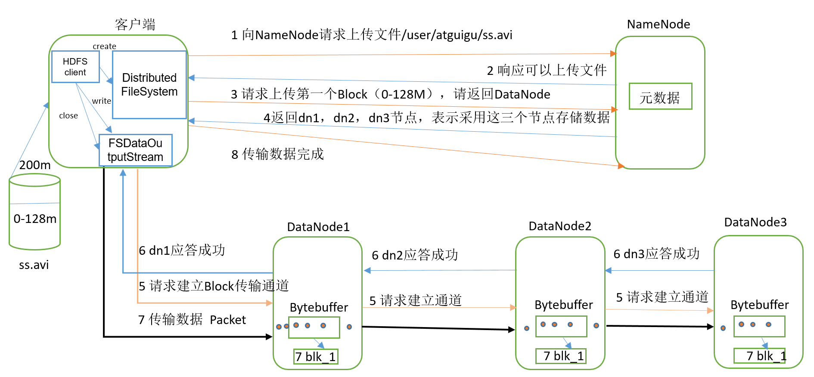

1）客户端通过 Distributed FileSystem 模块向 **NameNode** 请求上传文件，NameNode 检查目标文件是否已存在，父目录是否存在。

2）NameNode 返回是否可以上传。

3）客户端请求第一个 Block 上传到哪几个 DataNode 服务器上。

4）NameNode 返回 3 个 DataNode 节点，分别为 dn1、dn2、dn3 。

5）客户端通过 FSDataOutputStream 模块请求 dn1 上传数据，dn1 收到请求会继续调用 dn2，然后 dn2 调用dn3，将这个**通信管道**建立完成。

6）dn1、dn2、dn3 逐级应答客户端。

7）客户端开始往 dn1 上传第一个Block（先从磁盘读取数据放到一个本地内存缓存），以 Packet 为单位，dn1 收到一个 Packet 就会传给 dn2，dn2 传给 dn3；dn1 每传一个 packet 会放入一个应答队列等待应答。

8）当一个 Block 传输完成之后，客户端再次请求 NameNode 上传第二个 Block 的服务器。（重复执行3-7步）。


##### 4.1.2 网络拓扑-节点距离计算

在 HDFS 写数据的过程中，NameNode 会选择距离待上传数据**最近距离**的 DataNode 接收数据。那么这个最近距离怎么计算呢？  

**节点距离：两个节点到达最近的共同祖先的距离总和。**  

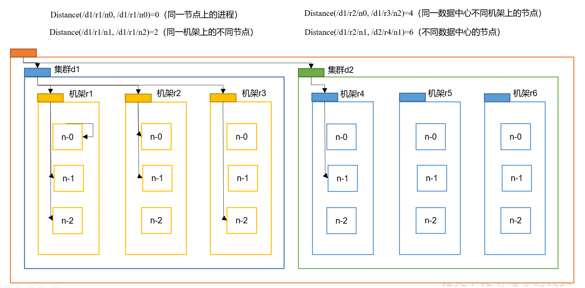

例如，假设有数据中心 d1 机架 r1 中的节点 n1。该节点可以表示为 /d1/r1/n1。利用这种标记，这里给出四种距离描述，如上图所示。

大家算一算每两个节点之间的距离，如下图所示。

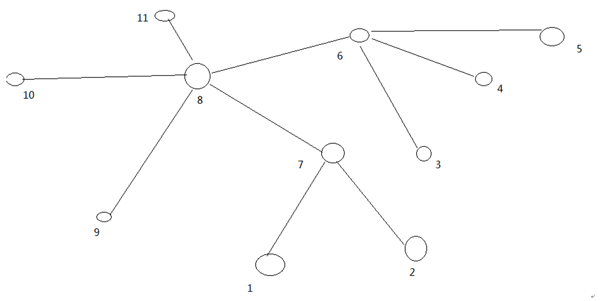


##### 4.1.3 机架感知（副本存储节点选择）

机架感知说明

```
For the common case, when the replication factor is three, HDFS’s placement policy is to put one replica on one node in the local rack, another on a different node in the local rack, and the last on a different node in a different rack.

```

**Hadoop2.7.2副本节点选择**

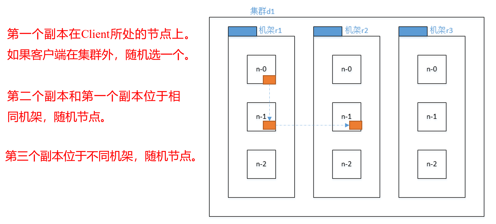


#### 4.2 HDFS读数据流程

HDFS 的==读数据流程==，如图所示  

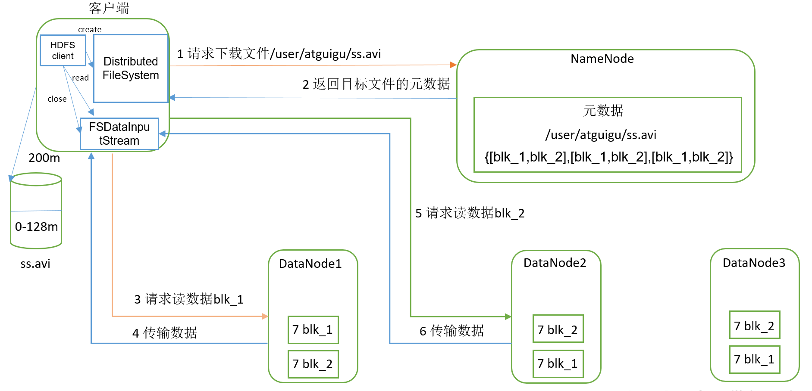

1）客户端通过Distributed FileSystem向NameNode请求下载文件，NameNode通过查询元数据，找到文件块所在的DataNode地址。

2）挑选一台DataNode（就近原则，然后随机）服务器，请求读取数据。

3）DataNode开始传输数据给客户端（从磁盘里面读取数据输入流，以Packet为单位来做校验）。

4）客户端以Packet为单位接收，先在本地缓存，然后写入目标文件。


### 5. NameNode和SecondaryNameNode  

#### 5.1 NN和2NN工作机制

**思考：NameNode 中的元数据是存储在哪里的？**

首先，我们做个假设，如果存储在 NameNode 节点的磁盘中，因为经常需要进行随机访问，还有响应客户请求，必然是效率过低。因此，元数据需要存放在**内存**中。但如果只存在内存中，一旦断电，元数据丢失，整个集群就无法工作了。因此产生在**磁盘中备份元数据的 ==FsImage==**。

这样又会带来新的问题，当在内存中的元数据更新时，如果同时更新 FsImage，就会导致效率过低，但如果不更新，就会发生一致性问题，一旦 NameNode 节点断电，就会产生数据丢失。因此，引入 **==Edits 文件==**(只进行追加操作，效率很高)。每当元数据有更新或者添加元数据时，修改内存中的元数据并追加到 Edits 中。这样，一旦NameNode 节点断电，可以**通过 FsImage 和 Edits 的合并，合成元数据**。

但是，如果长时间添加数据到 Edits 中，会导致该文件数据过大，效率降低，而且一旦断电，恢复元数据需要的时间过长。因此，需要**定期进行 FsImage 和 Edits 的合并**，如果这个操作由 NameNode 节点完成，又会效率过低。因此引入一个新的节点 **SecondaryNameNode**，**专门用于 FsImage 和 Edits 的合并**。

==NN 和 2NN 工作机制==，如下图所示。

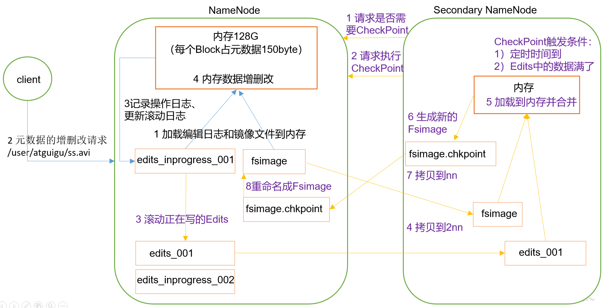

**第一阶段：NameNode启动**

（1）第一次启动 NameNode 格式化后，创建 Fsimage 和 Edits 文件。如果不是第一次启动，直接加载编辑日志和镜像文件到内存。

（2）客户端对元数据进行增删改的请求。

（3）NameNode 记录操作日志，更新滚动日志。

（4）NameNode 在内存中对元数据进行增删改。

**第二阶段：Secondary NameNode工作**

​    （1）SecondaryNameNode 询问 NameNode 是否需要 CheckPoint。直接带回 NameNode 是否检查结果。

​    （2）SecondaryNameNode 请求执行 CheckPoint。

​    （3）NameNode 滚动正在写的 Edits 日志。

​    （4）将滚动前的编辑日志和镜像文件拷贝到 SecondaryNameNode。

​    （5）SecondaryNameNode 加载编辑日志和镜像文件到内存，并合并。

​    （6）生成新的镜像文件 fsimage.chkpoint。

​    （7）拷贝 fsimage.chkpoint 到 NameNode。

​    （8）NameNode 将 fsimage.chkpoint 重新命名成 FSImage。


**==NN和2NN工作机制详解：==**

**Fsimage**：NameNode 内存中**元数据**序列化后形成的文件。

**Edits**：记录客户端**更新**元数据信息的每一步操作（可通过 Edits 运算出元数据，类似于日志？）。

NameNode 启动时，先滚动 Edits 并生成一个空的 edits.inprogress，然后**加载** Edits 和 Fsimage 到**内存**中，此时 NameNode 内存就持有**最新**的元数据信息。Client 开始对 NameNode 发送元数据的增删改的请求，这些请求的操作首先会被记录到 edits.inprogress 中（查询元数据的操作不会被记录在 Edits 中，因为查询操作不会更改元数据信息），如果此时 NameNode 挂掉，重启后会从 Edits 中读取元数据的信息。然后，NameNode  会在内存中执行元数据的增删改的操作。

由于 Edits 中记录的操作会越来越多，Edits 文件会越来越大，导致 NameNode 在启动加载 Edits 时会很慢，所以需要对 Edits 和 Fsimage 进行==**合并**==（所谓合并，就是将 Edits 和 Fsimage 加载到内存中，照着 Edits 中的操作一步步执行，最终形成新的 Fsimage）。SecondaryNameNode 的作用就是帮助 NameNode 进行 Edits 和 Fsimage 的合并工作，所以 SecondaryNameNode **不是** NameNode 的热备。

SecondaryNameNode 首先会询问是否需要（触发需要满足两个条件中的任意一个，定时时间到和中数据写满了）。直接带回是否检查结果。执行操作，首先会让滚动并生成一个空的，滚动的目的是给打个标记，以后所有新的操作都写入，其他未合并的和会拷贝到的本地，然后将拷贝的和加载到内存中进行合并，生成，然后将拷贝给，重命名为后替换掉原来的。在启动时就只需要加载之前未合并的和即可，因为合并过的中的元数据信息已经被记录在中。


#### 5.2 Fsimage和Edits解析

**1. 概念**

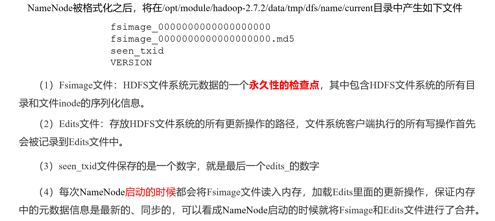

**2. oiv查看Fsimage文件**  

- 查看 oiv 和 oev 命令  

```sh
$ hdfs
oiv     # apply the offline fsimage viewer to an fsimage
oev     # apply the offline edits viewer to an edits file

```

- 基本语法

```sh
hdfs oiv -p 文件类型 -i镜像文件 -o 转换后文件输出路径

```

- 案例实操

```sh
$ pwd
/opt/module/hadoop-2.7.2/data/tmp/dfs/name/current

$ hdfs oiv -p XML -i fsimage_0000000000000000025 -o /opt/module/hadoop-2.7.2/fsimage.xml

$ cat /opt/module/hadoop-2.7.2/fsimage.xml

```

将显示的xml文件内容拷贝到Eclipse中创建的xml文件中，并格式化。部分显示结果如下。

```xml
<inode>
    <id>16386</id>
    <type>DIRECTORY</type>
    <name>user</name>
    <mtime>1512722284477</mtime>
    <permission>atguigu:supergroup:rwxr-xr-x</permission>
    <nsquota>-1</nsquota>
    <dsquota>-1</dsquota>
</inode>
<inode>
    <id>16387</id>
    <type>DIRECTORY</type>
    <name>atguigu</name>
    <mtime>1512790549080</mtime>
    <permission>atguigu:supergroup:rwxr-xr-x</permission>
    <nsquota>-1</nsquota>
    <dsquota>-1</dsquota>
</inode>
<inode>
    <id>16389</id>
    <type>FILE</type>
    <name>wc.input</name>
    <replication>3</replication>
    <mtime>1512722322219</mtime>
    <atime>1512722321610</atime>
    <perferredBlockSize>134217728</perferredBlockSize>
    <permission>atguigu:supergroup:rw-r--r--</permission>
    <blocks>
        <block>
            <id>1073741825</id>
            <genstamp>1001</genstamp>
            <numBytes>59</numBytes>
        </block>
    </blocks>
</inode >

```

思考：可以看出，Fsimage 中**没有**记录块所对应 DataNode，为什么？

在集群启动后，要求 DataNode上 报数据块信息，并间隔一段时间后再次上报。

**3. oev查看Edits文件**  

- 基本语法  

```sh
hdfs oev -p 文件类型 -i编辑日志 -o 转换后文件输出路径

```

-  案例实操  

```sh
$ hdfs oev -p XML -i edits_0000000000000000012-0000000000000000013 -o /opt/module/hadoop-2.7.2/edits.xml
$ cat /opt/module/hadoop-2.7.2/edits.xml

```

将显示的 xml 文件内容拷贝到 Eclipse 中创建的 xml 文件中，并格式化。显示结果如下。

```xml
<?xml version="1.0" encoding="UTF-8"?>
<EDITS>
    <EDITS_VERSION>-63</EDITS_VERSION>
    <RECORD>
        <OPCODE>OP_START_LOG_SEGMENT</OPCODE>
        <DATA>
            <TXID>129</TXID>
        </DATA>
    </RECORD>
    <RECORD>
        <OPCODE>OP_ADD</OPCODE>
        <DATA>
            <TXID>130</TXID>
            <LENGTH>0</LENGTH>
            <INODEID>16407</INODEID>
            <PATH>/hello7.txt</PATH>
            <REPLICATION>2</REPLICATION>
            <MTIME>1512943607866</MTIME>
            <ATIME>1512943607866</ATIME>
            <BLOCKSIZE>134217728</BLOCKSIZE>
            <CLIENT_NAME>DFSClient_NONMAPREDUCE_-1544295051_1</CLIENT_NAME>
            <CLIENT_MACHINE>192.168.1.5</CLIENT_MACHINE>
            <OVERWRITE>true</OVERWRITE>
            <PERMISSION_STATUS>
                <USERNAME>atguigu</USERNAME>
                <GROUPNAME>supergroup</GROUPNAME>
                <MODE>420</MODE>
            </PERMISSION_STATUS>
            <RPC_CLIENTID>908eafd4-9aec-4288-96f1-e8011d181561</RPC_CLIENTID>
            <RPC_CALLID>0</RPC_CALLID>
        </DATA>
    </RECORD>
    <RECORD>
        <OPCODE>OP_ALLOCATE_BLOCK_ID</OPCODE>
        <DATA>
            <TXID>131</TXID>
            <BLOCK_ID>1073741839</BLOCK_ID>
        </DATA>
    </RECORD>
    <RECORD>
        <OPCODE>OP_SET_GENSTAMP_V2</OPCODE>
        <DATA>
            <TXID>132</TXID>
            <GENSTAMPV2>1016</GENSTAMPV2>
        </DATA>
    </RECORD>
    <RECORD>
        <OPCODE>OP_ADD_BLOCK</OPCODE>
        <DATA>
            <TXID>133</TXID>
            <PATH>/hello7.txt</PATH>
            <BLOCK>
                <BLOCK_ID>1073741839</BLOCK_ID>
                <NUM_BYTES>0</NUM_BYTES>
                <GENSTAMP>1016</GENSTAMP>
            </BLOCK>
            <RPC_CLIENTID></RPC_CLIENTID>
            <RPC_CALLID>-2</RPC_CALLID>
        </DATA>
    </RECORD>
    <RECORD>
        <OPCODE>OP_CLOSE</OPCODE>
        <DATA>
            <TXID>134</TXID>
            <LENGTH>0</LENGTH>
            <INODEID>0</INODEID>
            <PATH>/hello7.txt</PATH>
            <REPLICATION>2</REPLICATION>
            <MTIME>1512943608761</MTIME>
            <ATIME>1512943607866</ATIME>
            <BLOCKSIZE>134217728</BLOCKSIZE>
            <CLIENT_NAME></CLIENT_NAME>
            <CLIENT_MACHINE></CLIENT_MACHINE>
            <OVERWRITE>false</OVERWRITE>
            <BLOCK>
                <BLOCK_ID>1073741839</BLOCK_ID>
                <NUM_BYTES>25</NUM_BYTES>
                <GENSTAMP>1016</GENSTAMP>
            </BLOCK>
            <PERMISSION_STATUS>
                <USERNAME>atguigu</USERNAME>
                <GROUPNAME>supergroup</GROUPNAME>
                <MODE>420</MODE>
            </PERMISSION_STATUS>
        </DATA>
    </RECORD>
</EDITS >

```


#### 5.3 CheckPoint时间设置

指的是 SecondaryNameNode 执行一次FSImage 与 Edits 合并的时间。

- 通常情况下，SecondaryNameNode每隔一小时执行一次。

> hdfs-default.xml

```xml
<property>
    <name>dfs.namenode.checkpoint.period</name>
    <value>3600</value>
</property>

```

- 一分钟检查一次操作次数，

```xml
<property>
    <name>dfs.namenode.checkpoint.check.period</name>
    <value>60</value>
    <description> 1分钟检查一次操作次数</description>
</property >

```

- 3当操作次数达到1百万时，SecondaryNameNode 执行一次。

```xml
<property>
    <name>dfs.namenode.checkpoint.txns</name>
    <value>1000000</value>
    <description>操作动作次数</description>
</property>

```


####  5.4 NameNode故障处理

NameNode故障后，可以采用如下两种方法恢复数据。

**方法一：**将 SecondaryNameNode 中数据拷贝到 NameNode 存储数据的目录；

- kill -9 NameNode 进程

- 删除 NameNode 存储的数据（/opt/module/hadoop-2.7.2/data/tmp/dfs/name）

```sh
$ rm -rf /opt/module/hadoop-2.7.2/data/tmp/dfs/name/*

```

- 拷贝 SecondaryNameNode 中数据到原 NameNode 存储数据目录

```sh
$ scp -r atguigu@hadoop104:/opt/module/hadoop-2.7.2/data/tmp/dfs/namesecondary/* ./name/

```

- 重新启动NameNode

```sh
$ sbin/hadoop-daemon.sh start namenode

```

**方法二**：使用 -importCheckpoint 选项启动 NameNode 守护进程，从而将 SecondaryNameNode 中数据拷贝到NameNode 目录中。

- 修改 hdfs-site.xml 中的

```xml
<property>
    <name>dfs.namenode.checkpoint.period</name>
    <value>120</value>
</property>
<property>
    <name>dfs.namenode.name.dir</name>
    <value>/opt/module/hadoop-2.7.2/data/tmp/dfs/name</value>
</property>

```

- kill -9 NameNode进程

- 删除NameNode存储的数据（/opt/module/hadoop-2.7.2/data/tmp/dfs/name）

```sh
$ rm -rf /opt/module/hadoop-2.7.2/data/tmp/dfs/name/*

```

- 如果 SecondaryNameNode 不和 NameNode 在一个主机节点上，需要将 SecondaryNameNode 存储数据的目录拷贝到 NameNode 存储数据的平级目录，并删除 in_use.lock 文件

```sh
$ scp -r atguigu@hadoop104:/opt/module/hadoop-2.7.2/data/tmp/dfs/namesecondary ./
$ rm -rf in_use.lock
$ pwd
/opt/module/hadoop-2.7.2/data/tmp/dfs
$ ls
data name namesecondary

```

- 导入检查点数据（等待一会 ctrl+c 结束掉）

```sh
$ bin/hdfs namenode -importCheckpoint

```

- 启动 NameNode

```sh
$ sbin/hadoop-daemon.sh start namenode

```


#### 5.5 集群安全模式

- **概述**

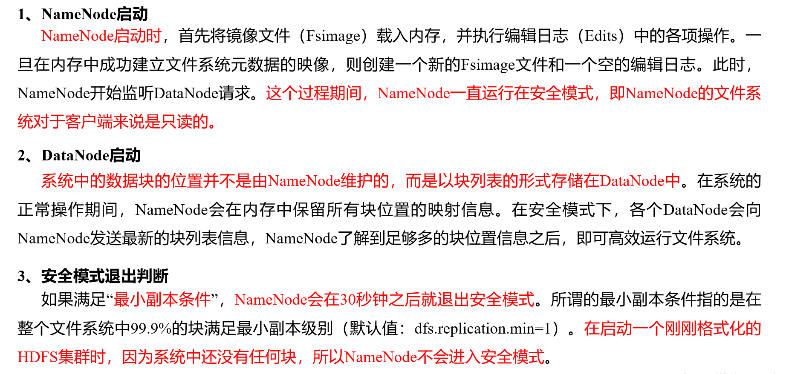

- **基本语法**

集群处于安全模式，不能执行重要操作（写操作）。集群启动完成后，自动退出安全模式。

```sh
bin/hdfs dfsadmin -safemode get     （功能描述：查看安全模式状态）
bin/hdfs dfsadmin -safemode enter   （功能描述：进入安全模式状态）
bin/hdfs dfsadmin -safemode leave   （功能描述：离开安全模式状态）
bin/hdfs dfsadmin -safemode wait    （功能描述：等待安全模式状态）

```

- 案例

模拟等待安全模式

（1）查看当前模式

```sh
$ hdfs dfsadmin -safemode get
Safe mode is OFF

```

（2）先进入安全模式

```sh
$ bin/hdfs dfsadmin -safemode enter

```

   (3）创建并执行下面的脚本

在 /opt/module/hadoop-2.7.2 路径上，编辑一个脚本 safemode.sh

```sh
$ touch safemode.sh
$ vim safemode.sh
#!/bin/bash
hdfs dfsadmin -safemode wait
hdfs dfs -put /opt/module/hadoop-2.7.2/README.txt /
$ chmod 777 safemode.sh
$ ./safemode.sh 

```

（4）再打开一个窗口，执行

```sh
$ bin/hdfs dfsadmin -safemode leave

```

（5）观察

1. 再观察上一个窗口

```
Safe mode is OFF

```

2. HDFS集群上已经有上传的数据了。


### 6. DataNode

#### 6.1 DataNode 工作机制

DataNode工作机制，如图所示。

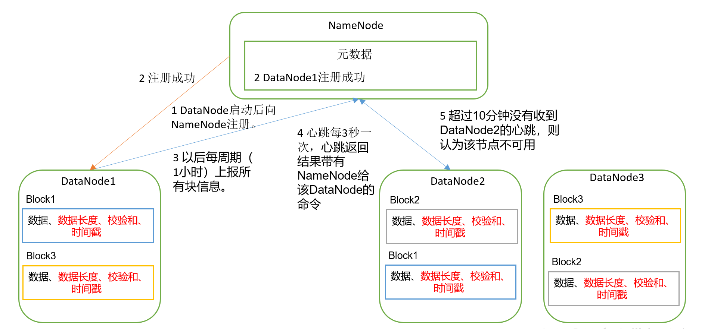


- 一个数据块在 DataNode 上以文件形式存储在**磁盘**上，包括**两个**文件，一个是数据本身，一个是元数据包括数据块的长度，块数据的校验和，以及时间戳。

- DataNode 启动后向 NameNode 注册，通过后，周期性（1小时）的向 NameNode 上报所有的**块信息**。

- 心跳是每 3 秒一次，心跳返回结果带有 NameNode 给该 DataNode 的命令如复制块数据到另一台机器，或删除某个数据块。如果超过 10 分钟没有收到某个 DataNode 的心跳，则认为该节点**不可用**。

- 集群运行中可以**安全**加入和退出一些机器。


#### 6.2 数据完整性

**思考**：如果电脑磁盘里面存储的数据是控制高铁信号灯的红灯信号（1）和绿灯信号（0），但是存储该数据的磁盘坏了，一直显示是绿灯，是否很危险？同理 DataNode 节点上的数据**损坏了**，却没有发现，是否也很危险，那么如何解决呢？

如下是 DataNode 节点**保证数据完整性**的方法。

1）当 DataNode 读取 Block 的时候，它会计算 CheckSum（校验和）。

2）如果计算后的 CheckSum，与 Block 创建时值不一样，说明 Block 已经**损坏**。

3）Client 读取其他 DataNode 上的 Block。

4）DataNode 在其文件创建后**周期验证 CheckSum**，如图所示。

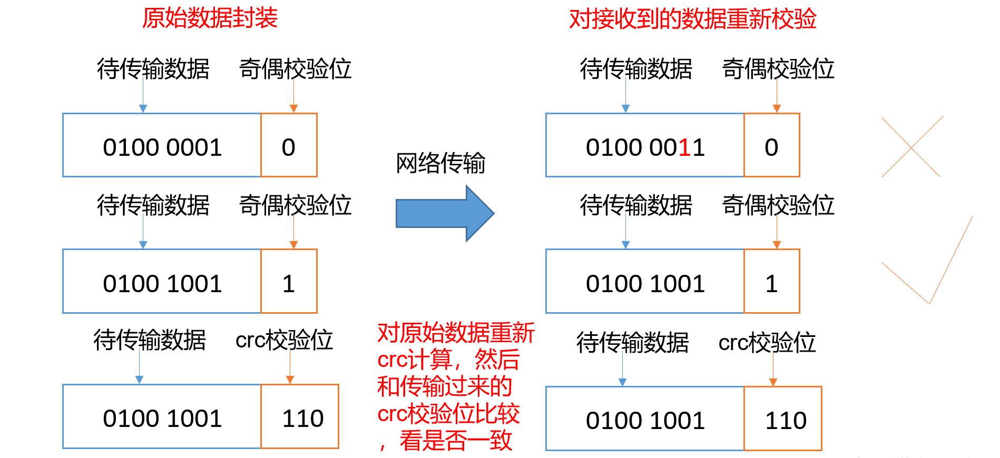


#### 6.3 掉线时限参数设置

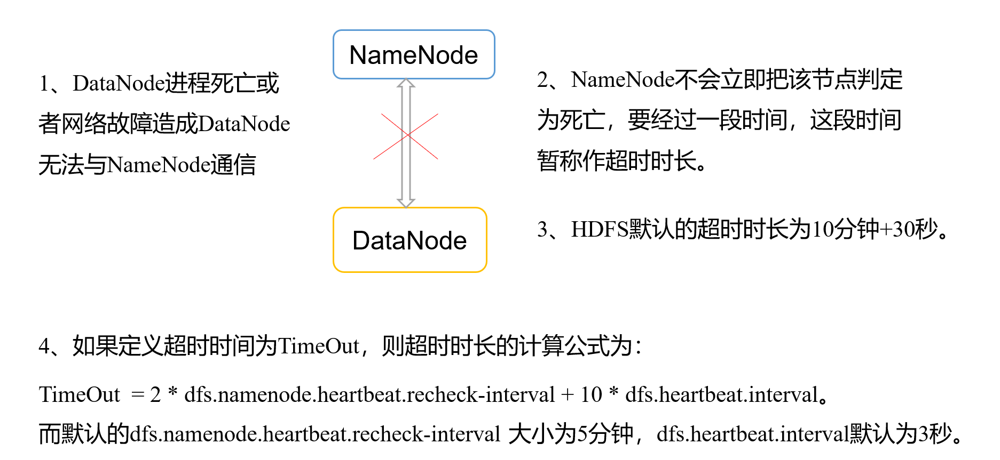

需要注意的是 hdfs-site.xml 配置文件中的 **heartbeat.recheck.interval** 的单位为**毫秒**，**dfs.heartbeat.interval**的单位为**秒**。

```xml
<property>
    <name>dfs.namenode.heartbeat.recheck-interval</name>
    <value>300000</value>
</property>
<property>
    <name>dfs.heartbeat.interval</name>
    <value>3</value>
</property>

```

#### 6.4 新服役DataNode

随着公司业务的增长，数据量越来越大，原有的数据节点的容量已经不能满足存储数据的需求，需要在原有集群基础上**动态添加新的数据节点**。

1. **环境准备**

​    （1）在 hadoop104 主机上再**克隆**一台 hadoop105 主机

​    （2）修改 IP 地址和主机名称

​    （3）删除原来HDFS文件系统留存的文件（/opt/module/hadoop-2.7.2/data 和 log)

​    （4）source 一下配置文件

```sh
$ source /etc/profile

```

2. **服役新节点具体步骤**  

（1）直接启动DataNode，即可关联到集群

```sh
$ sbin/hadoop-daemon.sh start datanode
$ sbin/yarn-daemon.sh start nodemanager

```

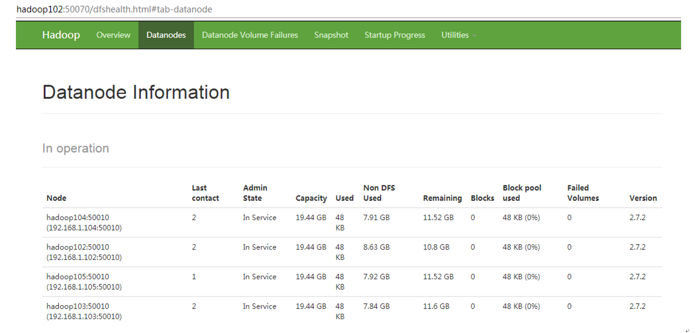

（2）在hadoop105上上传文件

```sh
$ hadoop fs -put /opt/module/hadoop-2.7.2/LICENSE.txt /

```

（3）如果数据不均衡，可以用命令实现集群的**再平衡**

```sh
$ ./start-balancer.sh
starting balancer, logging to /opt/module/hadoop-2.7.2/logs/hadoop-atguigu-balancer-hadoop102.out
Time Stamp        Iteration# Bytes Already Moved Bytes Left To Move Bytes Being Moved

```


#### 6.5 退役旧DataNode

##### 6.5.1 添加白名单

添加到白名单的主机节点，都允许访问 NameNode，不在白名单的主机节点，都会被**退出**。

配置白名单的具体步骤如下：

（1）在 NameNode 的 /opt/module/hadoop-2.7.2/etc/hadoop 目录下创建 dfs.hosts 文件

```sh
$ pwd
/opt/module/hadoop-2.7.2/etc/hadoop
$ touch dfs.hosts
$ vi dfs.hosts

```

添加如下主机名称（不添加 hadoop105 ）

```
hadoop102
hadoop103
hadoop104

```

（2）在 NameNode 的 hdfs-site.xml 配置文件中增加 dfs.hosts 属性

```xml
<property>
    <name>dfs.hosts</name>
    <value>/opt/module/hadoop-2.7.2/etc/hadoop/dfs.hosts</value>
</property>

```

（3）配置文件分发

```sh
$ xsync hdfs-site.xml

```

（4）刷新NameNode

```sh
$ hdfs dfsadmin -refreshNodes
Refresh nodes successful

```

（5）更新 ResourceManager 节点

```sh
$ yarn rmadmin -refreshNodes
17/06/24 14:17:11 INFO client.RMProxy: Connecting to ResourceManager at hadoop103/192.168.1.103:8033

```

（6）在 web 浏览器上查看

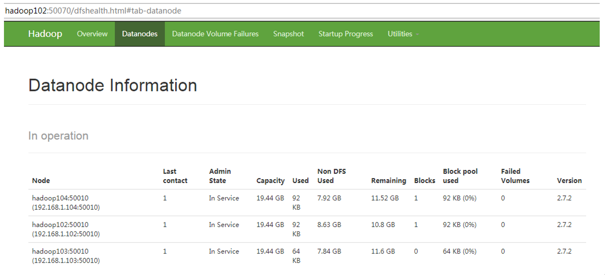

（7） 如果数据不均衡，可以用命令实现集群的**再平衡**

```sh
$ ./start-balancer.sh
starting balancer, logging to /opt/module/hadoop-2.7.2/logs/hadoop-atguigu-balancer-hadoop102.out
Time Stamp        Iteration# Bytes Already Moved Bytes Left To Move Bytes Being Moved

```


##### 6.5.2 黑名单退役

在黑名单上面的主机都会被**强制退出**。

（1）在 NameNode 的 /opt/module/hadoop-2.7.2/etc/hadoop 目录下创建 dfs.hosts.exclude 文件

```sh
$ pwd
/opt/module/hadoop-2.7.2/etc/hadoop
$ touch dfs.hosts.exclude
$ vi dfs.hosts.exclude

```

添加如下主机名称（要退役的节点）

```
hadoop105

```

（2）在 NameNode 的 hdfs-site.xml 配置文件中增加 dfs.hosts.exclude 属性

```xml
<property>
    <name>dfs.hosts.exclude</name>
    <value>/opt/module/hadoop-2.7.2/etc/hadoop/dfs.hosts.exclude</value>
</property>

```

（3）刷新NameNode、刷新 ResourceManager

```sh
$ hdfs dfsadmin -refreshNodes
Refresh nodes successful
$ yarn rmadmin -refreshNodes
17/06/24 14:55:56 INFO client.RMProxy: Connecting to ResourceManager at hadoop103/192.168.1.103:8033

```

（4）检查 Web 浏览器，退役节点的状态为 Decommission In  Progress（退役中），说明数据节点正在复制块到其他节点，如下图所示

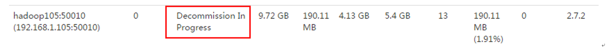

（5）等待退役节点状态为 decommissioned（所有块已经复制完成），停止该节点及节点资源管理器。注意：如果副本数是 3，服役的节点小于等于 3，是**不能**退役成功的，需要修改副本数后才能退役，如下图所示。

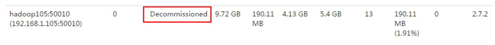

```sh
$ sbin/hadoop-daemon.sh stop datanode

```

stopping datanode

```sh
$ sbin/yarn-daemon.sh stop nodemanager

```

stopping nodemanager

（6） 如果数据不均衡，可以用命令实现集群的**再平衡**

```sh
$ ./start-balancer.sh
starting balancer, logging to /opt/module/hadoop-2.7.2/logs/hadoop-atguigu-balancer-hadoop102.out
Time Stamp        Iteration# Bytes Already Moved Bytes Left To Move Bytes Being Moved

```


#### 6.6 DataNode多目录配置

1. DataNode 也可以配置成**多个目录**，每个目录存储的数据不一样。即：**数据不是副本**

2. 具体 hdfs-site.xml 配置如下

``` xml
<property>
   <name>dfs.datanode.data.dir</name> 	
   <value>file:///${hadoop.tmp.dir}/dfs/data1,file:///${hadoop.tmp.dir}/dfs/data2</value>
</property>

```


### 7.HDFS 2.X新特性

#### 7.1 集群间数据拷贝

1. scp实现两个远程主机之间的文件复制

```sh
$ scp -r hello.txt [root@hadoop103:/user/atguigu/hello.txt](mailto:root@hadoop103:/user/atguigu/hello.txt)       # 推 push

$ scp -r [root@hadoop103:/user/atguigu/hello.txt hello.txt](mailto:root@hadoop103:/user/atguigu/hello.txt  hello.txt)      # 拉 pull

$ scp -r [root@hadoop103:/user/atguigu/hello.txt](mailto:root@hadoop103:/user/atguigu/hello.txt) root@hadoop104:/user/atguigu  # 是通过本地主机中转实现两个远程主机的文件复制；如果在两个远程主机之间ssh没有配置的情况下可以使用该方式。

```

2. 采用 distcp 命令实现两个 Hadoop 集群之间的**递归**数据复制

```sh
$ bin/hadoop distcp hdfs://haoop102:9000/user/atguigu/hello.txt hdfs://hadoop103:9000/user/atguigu/hello.txt

```

#### 7.2 小文件存档

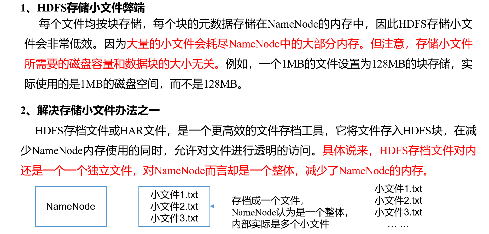


### 8. ==HDFS HA高可用==

#### 8.1 HA概述

- 所谓HA（High Available），即高可用（7*24小时不中断服务）。

- 实现高可用最关键的策略是消除单点故障。HA严格来说应该分成各个组件的HA机制：HDFS 的 HA 和 YARN的 HA。

- Hadoop2.0 之前，在 HDFS 集群中 NameNode 存在**单点故障（SPOF）**。

- NameNode 主要在以下两个方面影响 HDFS 集群

    ​    NameNode 机器发生意外，如宕机，集群将无法使用，直到管理员重启

    ​    NameNode 机器需要升级，包括软件、硬件升级，此时集群也将无法使用

HDFS HA 功能通过配置 Active/Standby 两个 NameNodes 实现在集群中对 NameNode 的热备来解决上述问题。如果出现故障，如机器崩溃或机器需要升级维护，这时可通过此种方式将 NameNode 很快的切换到另外一台机器。       


#### 8.2 HDFS HA工作机制

通过**双 NameNode 消除单点故障**。

##### 8.2.1 HDFS-HA工作要点  

（1）元数据管理方式需要改变

内存中各自保存一份元数据；

Edits 日志只有 Active 状态的 NameNode 节点可以做写操作；

两个 NameNode 都可以读取 Edits；

共享的 Edits 放在一个共享存储中管理（qjournal 和 NFS两个主流实现）；

（2）需要一个状态管理功能模块

实现了一个  ZookeeperFailover，常驻在每一个NameNode所在的节点，每一个 ZookeeperFailover 负责监控自己所在 NameNode 节点，利用 Zookeeper 进行状态标识，当需要进行状态切换时，由 ZookeeperFailover来负责切换，切换时需要防止 Brain Split 现象的发生。

（3）必须保证两个 NameNode 之间能够 SSH 无密码登录

（4）隔离（Fence），即同一时刻仅仅有一个 NameNode 对外提供服务


##### 8.2.2 HDFS-HA自动故障转移工作机制

前面学习了使用命令 

```
hdfs haadmin -failover

```

手动进行故障转移，在该模式下，即使现役 NameNode 已经失效，系统也不会自动从现役 NameNode 转移到待机NameNode，下面学习如何配置部署 HA 自动进行**故障转移**。

自动故障转移为 HDFS 部署增加了两个新组件：**ZooKeeper** 和 **ZooKeeperFailoverController**（ZKFC）进程。ZooKeeper 是维护少量协调数据，通知客户端这些数据的改变和监视客户端故障的高可用服务。HA 的自动故障转移依赖于 ZooKeeper 的以下功能：

- **故障检测**：集群中的每个 NameNode 在 ZooKeeper 中维护了一个**持久会话**，如果机器崩溃，ZooKeeper 中的会话将终止，ZooKeeper 通知另一个 NameNode 需要触发**故障转移**。

- **现役 NameNode 选择**：ZooKeeper 提供了一个简单的机制用于唯一的选择一个节点为 active 状态。如果目前现役 NameNode 崩溃，另一个节点可能从 ZooKeeper 获得特殊的排外锁以表明它应该成为现役NameNode。
    ZKFC 是自动故障转移中的另一个新组件，是 ZooKeeper 的**客户端**，也监视和管理 NameNode 的状态。每个运行 NameNode 的主机也运行了一个 **ZKFC 进程**。

    ==ZKFC负责：==

- **健康监测**：ZKFC 使用一个健康检查命令定期地 **ping** 与之在相同主机的 NameNode，只要该 NameNode 及时地回复健康状态，ZKFC 认为该节点是健康的。如果该节点崩溃，冻结或进入不健康状态，健康监测器标识该节点为非健康的。

- **ZooKeeper 会话管理**：当本地 NameNode 是健康的，ZKFC 保持一个在 ZooKeeper 中打开的会话。如果本地 NameNode 处于 active 状态，ZKFC 也保持一个特殊的 znode 锁，该锁使用了 ZooKeeper 对短暂节点的支持，如果会话终止，锁节点将自动删除。

- **基于 ZooKeeper 的选择**：如果本地 NameNode 是健康的，且 ZKFC 发现没有其它的节点当前持有 znode锁，它将为自己获取该锁。如果成功，则它已经赢得了选择，并负责运行故障转移进程以使它的本地NameNode 为 Active。故障转移进程与前面描述的手动故障转移相似，首先如果必要保护之前的现役NameNode，然后本地 NameNode 转换为 Active 状态。

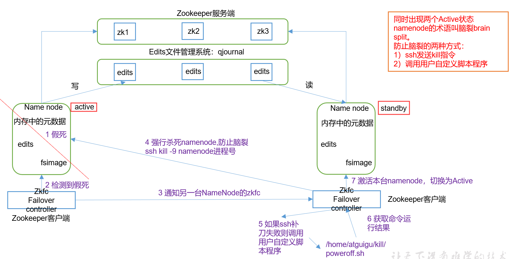


#### 8.3 HDFS HA集群配置

##### 8.3.1 环境准备

1.	修改 IP
2.	修改主机名及主机名和 IP 地址的映射
3.	关闭防火墙
4.	ssh 免密登录
5.	安装 JDK，配置环境变量等

##### 8.3.2 规划集群

|  hadoop102   |    hadoop103    |  hadoop104  |
| :----------: | :-------------: | :---------: |
| **NameNode** |  **NameNode**   |             |
| JournalNode  |   JournalNode   | JournalNode |
|   DataNode   |    DataNode     |  DataNode   |
|      ZK      |       ZK        |     ZK      |
|              | ResourceManager |             |
| NodeManager  |   NodeManager   | NodeManager |

##### 8.3.3 配置Zookeeper集群

1. **集群规划**
    在 hadoop102、hadoop103 和 hadoop104 三个节点上部署 Zookeeper。

2. **解压安装**
    （1）解压 Zookeeper 安装包到 /opt/module/ 目录下

    ```sh
    $ tar -zxvf zookeeper-3.4.10.tar.gz -C /opt/module
    
    ```

    （2）在 /opt/module/zookeeper-3.4.10/ 这个目录下创建 zkData

    ```sh
    $ mkdir -p zkData
    
    ```

    （3）重命名 /opt/module/zookeeper-3.4.10/conf 这个目录下的 zoo_sample.cfg 为 zoo.cfg

    ```sh
    $ mv zoo_sample.cfg zoo.cfg
    
    ```

3. **配置 zoo.cfg 文件**
    （1）具体配置

    ```sh
    $ dataDir=/opt/module/zookeeper-3.4.10/zkData
    
    ```

    增加如下配置

    ```
    #######################cluster##########################
    server.2=hadoop102:2888:3888
    server.3=hadoop103:2888:3888
    server.4=hadoop104:2888:3888
    
    ```

    （2）配置参数解读

    ```
    Server.A=B:C:D。
    
    ```

    A 是一个数字，表示这个是第几号服务器；
    B 是这个服务器的 IP 地址；
    C 是这个服务器与集群中的 Leader 服务器交换信息的端口；
    D 是万一集群中的 Leader 服务器挂了，需要一个端口来重新进行选举，选出一个新的 Leader，而这个端口就是用来执行选举时服务器相互通信的端口。

    集群模式下配置一个文件 **myid**，这个文件在 dataDir 目录下，这个文件里面有一个数据就是 A 的值，Zookeeper 启动时读取此文件，拿到里面的数据与 zoo.cfg 里面的**配置信息**比较从而判断到底是哪个 server。

4. **集群操作**
    （1）在 /opt/module/zookeeper-3.4.10/zkData 目录下创建一个 myid 的文件

    ```sh
    $ touch myid
    
    ```

    添加 myid 文件，注意一定要在 linux 里面创建，在 notepad++ 里面很可能乱码
    （2）编辑myid文件

    ```sh
    $ vi myid
    
    ```

    在文件中添加与 server 对应的编号：如 2
    （3）**拷贝**配置好的 zookeeper 到其他机器上

    ```sh
    $ scp -r zookeeper-3.4.10/ root@hadoop103.atguigu.com:/opt/app/
    $ scp -r zookeeper-3.4.10/ root@hadoop104.atguigu.com:/opt/app/
    
    ```

    并分别修改 myid 文件中内容为3、4
    （4）分别启动 zookeeper

    ```sh
    $ bin/zkServer.sh start
    $ bin/zkServer.sh start
    $ bin/zkServer.sh start
    
    ```

    （5）几个机器分别查看状态

    ```sh
    [root@hadoop102 zookeeper-3.4.10]$ bin/zkServer.sh status
    JMX enabled by default
    Using config: /opt/module/zookeeper-3.4.10/bin/../conf/zoo.cfg
    Mode: follower
    [root@hadoop103 zookeeper-3.4.10]$ bin/zkServer.sh status
    JMX enabled by default
    Using config: /opt/module/zookeeper-3.4.10/bin/../conf/zoo.cfg
    Mode: leader
    [root@hadoop104 zookeeper-3.4.5]$ bin/zkServer.sh status
    JMX enabled by default
    Using config: /opt/module/zookeeper-3.4.10/bin/../conf/zoo.cfg
    Mode: follower
    
    ```

    ##### 8.3.4 配置HDFS-HA集群

（1）官方地址：http://hadoop.apache.org/

（2）在 opt 目录下创建一个 ha 文件夹

```sh
$ mkdir ha

```

（3）将 /opt/app/ 下的 hadoop-2.7.2 拷贝到 /opt/ha 目录下

```sh
$ cp -r hadoop-2.7.2/ /opt/ha/

```

（4）配置 hadoop-env.sh

```sh
$ export JAVA_HOME=/opt/module/jdk1.8.0_144

```

（5）配置 **core-site.xml**

```xml
<configuration>
    <!-- 把两个NameNode）的地址组装成一个集群mycluster -->
    <property>
        <name>fs.defaultFS</name>
        <value>hdfs://mycluster</value>
    </property>
    <!-- 指定hadoop运行时产生文件的存储目录 -->
    <property>
        <name>hadoop.tmp.dir</name>
        <value>/opt/ha/hadoop-2.7.2/data/tmp</value>
    </property>
</configuration>

```

（6）配置 **hdfs-site.xml**

```xml
<configuration>
    <!-- 完全分布式集群名称 -->
    <property>
        <name>dfs.nameservices</name>
        <value>mycluster</value>
    </property>

    <!-- 集群中NameNode节点都有哪些 -->
    <property>
        <name>dfs.ha.namenodes.mycluster</name>
        <value>nn1,nn2</value>
    </property>

    <!-- nn1的RPC通信地址 -->
    <property>
        <name>dfs.namenode.rpc-address.mycluster.nn1</name>
        <value>hadoop102:9000</value>
    </property>

    <!-- nn2的RPC通信地址 -->
    <property>
        <name>dfs.namenode.rpc-address.mycluster.nn2</name>
        <value>hadoop103:9000</value>
    </property>

    <!-- nn1的http通信地址 -->
    <property>
        <name>dfs.namenode.http-address.mycluster.nn1</name>
        <value>hadoop102:50070</value>
    </property>

    <!-- nn2的http通信地址 -->
    <property>
        <name>dfs.namenode.http-address.mycluster.nn2</name>
        <value>hadoop103:50070</value>
    </property>

    <!-- 指定NameNode元数据在JournalNode上的存放位置 -->
    <property>
        <name>dfs.namenode.shared.edits.dir</name>
        <value>qjournal://hadoop102:8485;hadoop103:8485;hadoop104:8485/mycluster</value>
    </property>

    <!-- 配置隔离机制，即同一时刻只能有一台服务器对外响应 -->
    <property>
        <name>dfs.ha.fencing.methods</name>
        <value>sshfence</value>
    </property>

    <!-- 使用隔离机制时需要ssh无秘钥登录-->
    <property>
        <name>dfs.ha.fencing.ssh.private-key-files</name>
        <value>/home/atguigu/.ssh/id_rsa</value>
    </property>

    <!-- 声明journalnode服务器存储目录-->
    <property>
        <name>dfs.journalnode.edits.dir</name>
        <value>/opt/ha/hadoop-2.7.2/data/jn</value>
    </property>

    <!-- 关闭权限检查-->
    <property>
        <name>dfs.permissions.enable</name>
        <value>false</value>
    </property>

    <!-- 访问代理类：client，mycluster，active配置失败自动切换实现方式-->
    <property>
        <name>dfs.client.failover.proxy.provider.mycluster</name>
        <value>org.apache.hadoop.hdfs.server.namenode.ha.ConfiguredFailoverProxyProvider</value>
    </property>
</configuration>

```

（7）拷贝配置好的 Hadoop 环境到其他节点

##### 8.3.5 启动HDFS-HA集群

（1） 在各个 JournalNode 节点上，输入以下命令启动 journalnode 服务

```sh
$  sbin/hadoop-daemon.sh start journalnode

```

（2）在 [NameNode1] 上，对其进行格式化，并启动

```sh
$ bin/hdfs namenode -format
$ sbin/hadoop-daemon.sh start namenode

```

（3）在[NameNode2]上，同步 NameNode1 的元数据信息

 ```sh
$ bin/hdfs namenode -bootstrapStandb

 ```

（4）启动[NameNode2]

```sh
$ sbin/hadoop-daemon.sh start namenode

```

（5）查看 web 页面显示，如下图所示


（6）在 [NameNode1] 上，启动所有 DataNode

```sh
$ sbin/hadoop-daemons.sh start datanode

```

（7）将 [NameNode1] 切换为 Active

```sh
$ bin/hdfs haadmin -transitionToActive nn1

```

（8）查看是否 Active

```sh
$ bin/hdfs haadmin -getServiceState nn1

```


##### 8.3.6 配置HDFS-HA自动故障转移

1. 具体配置

​    （1）在 hdfs-site.xml 中增加

```xml
<property>
    <name>dfs.ha.automatic-failover.enabled</name>
    <value>true</value>
</property>

```

​    （2）在 core-site.xml 文件中增加

```xml
<property>
    <name>ha.zookeeper.quorum</name>
    <value>hadoop102:2181,hadoop103:2181,hadoop104:2181</value>
</property>

```

2. 启动

​    （1）关闭所有HDFS服务：

```sh
$ sbin/stop-dfs.sh

```

​    （2）启动 Zookeeper 集群：

```sh
$ bin/zkServer.sh start

```

​    （3）初始化 HA 在 Zookeeper 中状态：

```sh
$ bin/hdfs zkfc -formatZK

```

​    （4）启动 HDFS 服务：

```sh
$ sbin/start-dfs.sh

```

3. 验证

​    （1）将 Active NameNode 进程 kill

```sh
$ kill -9 namenode的进程id

```

​    （2）将 Active NameNode 机器断开网络

```sh
$ service network stop

```


#### 8.4 YARN HA 配置

##### 8.4.1 YARN-HA工作机制

- 官方文档：

 http://hadoop.apache.org/docs/r2.7.2/hadoop-yarn/hadoop-yarn-site/ResourceManagerHA.html 

- YARN-HA工作机制，如图所示

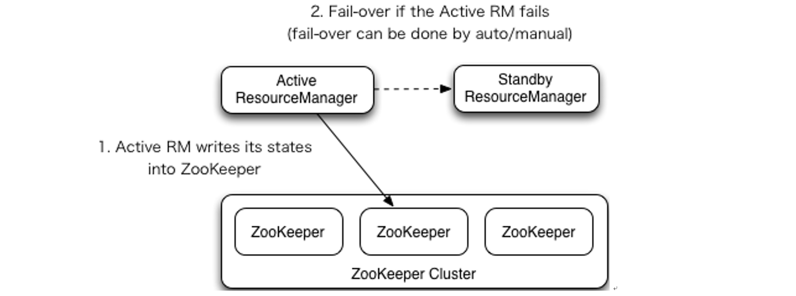

##### 8.4.2 配置YARN-HA集群

1. **环境准备**

（1）修改 IP

（2）修改主机名及主机名和 IP 地址的映射

（3）关闭防火墙

（4）ssh 免密登录

（5）安装 JDK，配置环境变量等

   (6）配置 Zookeeper集群

2. **规划集群**

|    hadoop102    |    hadoop103    |  hadoop104  |
| :-------------: | :-------------: | :---------: |
|  **NameNode**   |  **NameNode**   |             |
|   JournalNode   |   JournalNode   | JournalNode |
|    DataNode     |    DataNode     |  DataNode   |
|       ZK        |       ZK        |     ZK      |
| ResourceManager | ResourceManager |             |
|   NodeManager   |   NodeManager   | NodeManager |

3. **具体配置**

（1）配置**yarn-site.xml**

```xml
<configuration>
    <property>
        <name>yarn.nodemanager.aux-services</name>
        <value>mapreduce_shuffle</value>
    </property>

    <!--启用resourcemanager ha-->
    <property>
        <name>yarn.resourcemanager.ha.enabled</name>
        <value>true</value>
    </property>

    <!--声明两台resourcemanager的地址-->
    <property>
        <name>yarn.resourcemanager.cluster-id</name>
        <value>cluster-yarn1</value>
    </property>

    <property>
        <name>yarn.resourcemanager.ha.rm-ids</name>
        <value>rm1,rm2</value>
    </property>

    <property>
        <name>yarn.resourcemanager.hostname.rm1</name>
        <value>hadoop102</value>
    </property>

    <property>
        <name>yarn.resourcemanager.hostname.rm2</name>
        <value>hadoop103</value>
    </property>

    <!--指定zookeeper集群的地址--> 
    <property>
        <name>yarn.resourcemanager.zk-address</name>
        <value>hadoop102:2181,hadoop103:2181,hadoop104:2181</value>
    </property>

    <!--启用自动恢复--> 
    <property>
        <name>yarn.resourcemanager.recovery.enabled</name>
        <value>true</value>
    </property>

    <!--指定resourcemanager的状态信息存储在zookeeper集群--> 
    <property>
        <name>yarn.resourcemanager.store.class</name>     <value>org.apache.hadoop.yarn.server.resourcemanager.recovery.ZKRMStateStore</value>
    </property>

</configuration>

```

（2）同步更新其他节点的配置信息

4. **启动 HDFS ** 

（1）在各个 JournalNode 节点上，输入以下命令启动 JournalNode服务：

```sh
$ sbin/hadoop-daemon.sh start journalnode

```

（2）在[ NameNode1 ]上，对其进行格式化，并启动：

```sh
$ bin/hdfs namenode -format
$ sbin/hadoop-daemon.sh start namenode

```

（3）在[NameNode2]上，同步 NameNode1 的元数据信息：

```sh
$ bin/hdfs namenode -bootstrapStandby

```

（4）启动[NameNode2]：

```sh
$ sbin/hadoop-daemon.sh start namenode

```

（5）启动所有DataNode

```sh
$ sbin/hadoop-daemons.sh start datanode

```

（6）将[ NameNode1 ]切换为 Active

```sh
$ bin/hdfs haadmin -transitionToActive nn1

```

5. **启动 YARN** 

（1）在 hadoop102 中执行：

```sh
$ sbin/start-yarn.sh

```

（2）在 hadoop103 中执行：

```sh
$ sbin/yarn-daemon.sh start resourcemanager

```

（3）查看服务状态，如图所示

```sh
$ bin/yarn rmadmin -getServiceState rm1

```

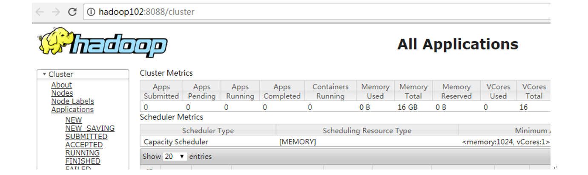


#### 8.5 HDFS Federation架构设计

**NameNode架构的局限性**

- **Namespace**（命名空间）的限制

由于 NameNode 在内存中存储所有的**元数据**（metadata），因此单个 NameNode 所能存储的对象（文件 + 块）数目受到 NameNode 所在 JVM 的 **heap size** 的限制。50G 的 heap 能够存储 20亿（200million）个对象，这 20 亿个对象支持 4000 个 DataNode，12PB 的存储（假设文件平均大小为 40MB）。随着数据的飞速增长，存储的需求也随之增长。单个 DataNode 从 4T 增长到 36T，集群的尺寸增长到 8000 个DataNode。存储的需求从 12PB 增长到大于 100PB。

- 隔离问题

由于 HDFS 仅有一个 NameNode，无法隔离各个程序，因此 HDFS 上的一个实验程序就很有可能影响整个 HDFS上运行的程序。

- 性能的瓶颈

由于是单个 NameNode 的 HDFS 架构，因此整个 HDFS 文件系统的吞吐量受限于单个 NameNode 的**吞吐量**。


**HDFS Federation架构设计**  

能不能有多个 NameNode

| NameNode | NameNode |     NameNode      |
| :------: | :------: | :---------------: |
|  元数据  |  元数据  |      元数据       |
|   Log    | machine  | 电商数据/话单数据 |

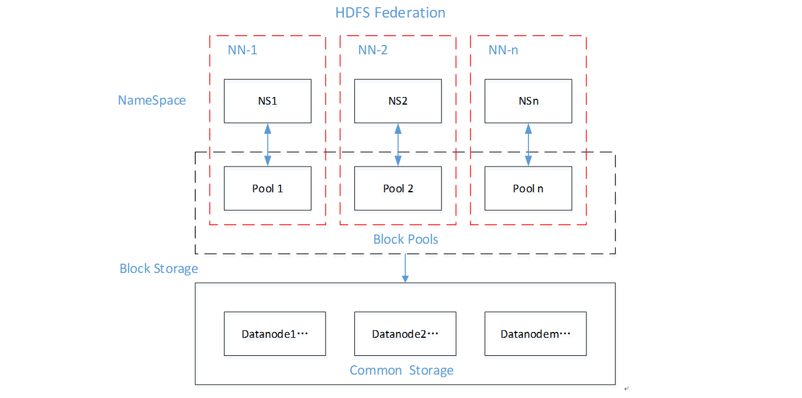


不同**应用**可以使用不同 **NameNode** 进行数据管理

- 图片业务、爬虫业务、日志审计业务

Hadoop 生态系统中，不同的**框架**使用不同的 NameNode 进行管理 NameSpace。（隔离性）


### 参考文献

- 尚硅谷 HDFS 教程


