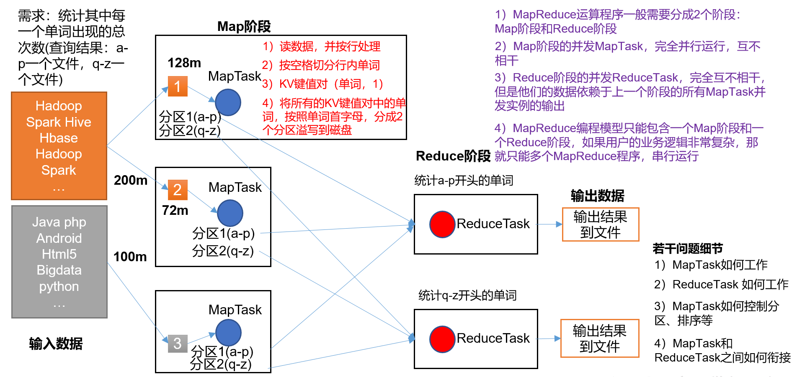

[TOC]

### MapReduce

[TOC]

## MapReduce

### 1. MapReduce 概述

MapReduce核心编程思想，如下图所示。

1）分布式的运算程序往往需要分成至少 2 个阶段。

2）第一个阶段的 MapTask 并发实例，完全并行运行，互不相干。

3）第二个阶段的 ReduceTask 并发实例互不相干，但是他们的数据依赖于上一个阶段的所有 MapTask 并发实例的输出。

4）MapReduce 编程模型只能包含一个 Map 阶段和一个 Reduce 阶段，如果用户的业务逻辑非常复杂，那就只能多个 MapReduce 程序，串行运行。

**总结**：分析 WordCount 数据流走向深入理解 MapReduce 核心思想。

### 2. Hadoop 序列化

### 3. MapReduce 框架原理

### 4. Hadoop 数据压缩

### 5. YARN 资源调度器

### 6. Hadoop 企业优化

### 7. MapReduce 拓展案例

