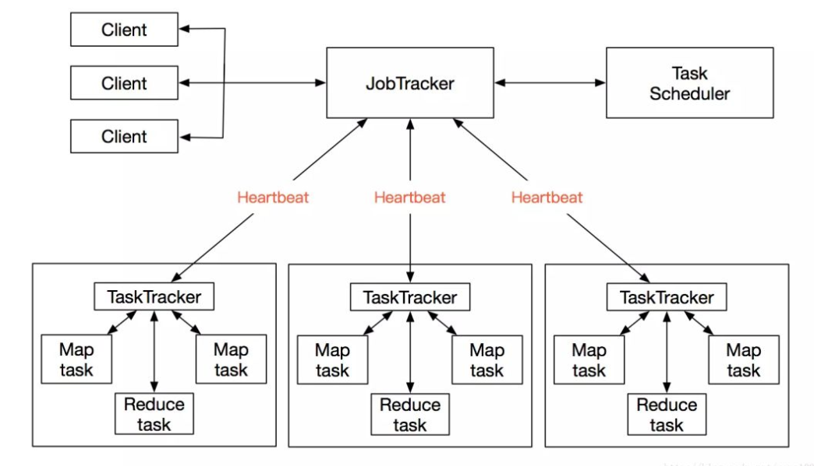
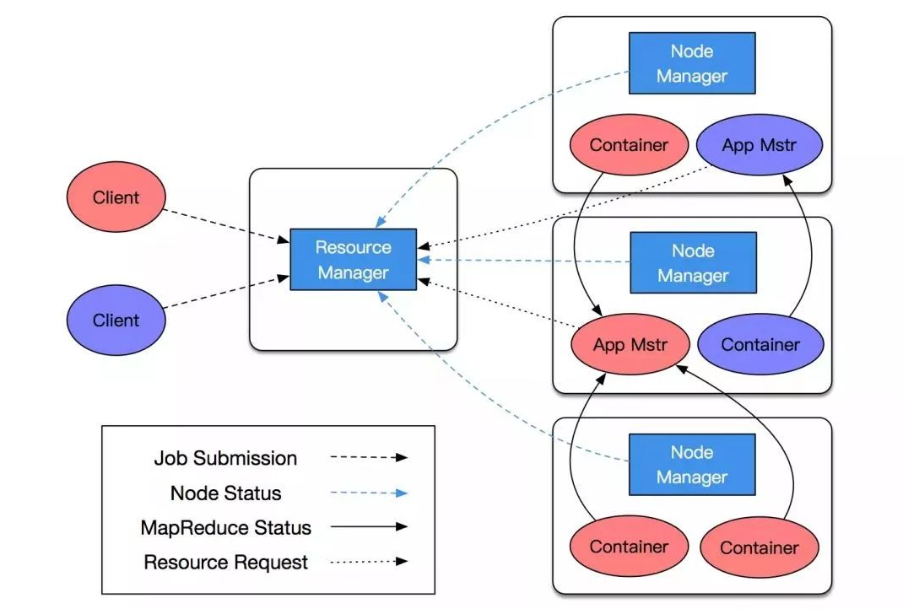
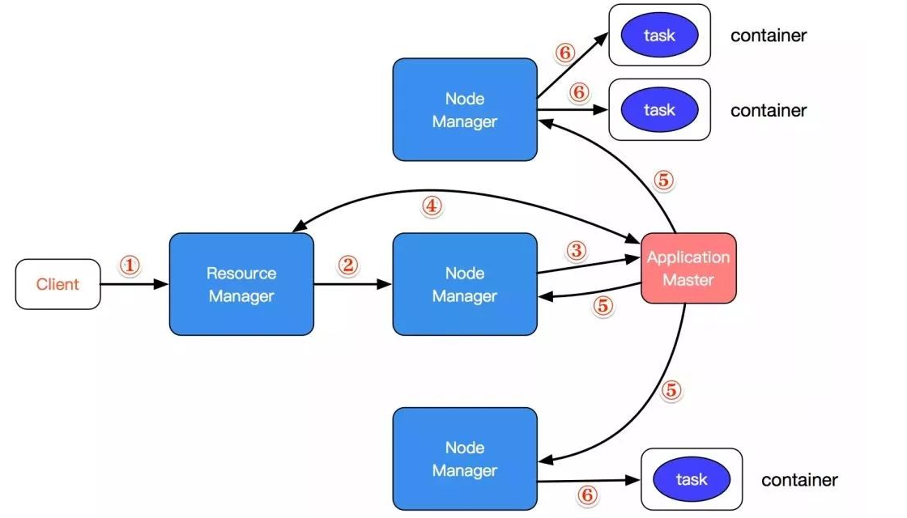

[TOC]

### YARN

[TOC]

## YARN

#### MapReduce1.x 的限制

为什么会产生YRAN？这个与 MapReduce1.x 的架构有关，正是因为 MapReduce1.x 存在许多的问题，才会产生 YARN。 

 MapReduce1.x 的架构如下： 

Hadoop1.x时，MapReduce 的架构仍然是**主从架构**。一个 JobTracker 带多个 TaskTracker，主节点为JobTracker，只有一个，从节点为 TaskTracker，可以有多个，从节点通过向主节点发送心跳信息（heartbeat）来告诉它自己的运行情况，而主节点则是负责管理调度的工作。 **资源调度和计算任务都是通过 MapReduce 完成的，也无法扩展其他计算框架。**

- **JobTracker(JT)**：负责资源管理和作业调度。

- **TaskTracker(TT)**：定期向JT汇报本节点的健康状况、资源使用情况、作业执行情况。接收来自JT的命令，从而启动任务或杀死任务。

 那么这个架构存在什么样的问题呢？ 

首先是**单点故障**的问题，所有的从节点(TT)都是跟主节点(JT)直接关联的，如果主节点不小心挂了，那么整个系统就崩溃了，就没有办法运行了。

其次，**JT的压力大且不易扩展**，他要接收所有从节点(TT)的心跳信息(heartbeat)和客户端的请求，JT承担的职责特别多，随着集群扩展后，那么JT的压力就会越来越大。

最后，最大的问题就是**兼容性问题**，它**不兼容**除了 MapReduce 外的其他框架，比如 Spark 是不能跑在这个系统上的。

而有了 YARN 之后，基于 YARN 之上可以**运行很多其他的计算框架**，不同计算框架可以共享同一个 HDFS 集群上数据，享受整体的资源调度。**它相当于操作系统，起着调度管理的工作。** 

#### YARN概述

- YARN 的全称是 Yet Another Resource Negotiator。
- 通用的资源管理系统，要申请资源统一经过 YARN 进行申请就行了。
- 为上层应用提供统一的资源管理和调度。

#### YARN基本架构

- **ResourceManager（RM）：资源管理器** 

整个集群同一时间提供服务的 RM 只有一个，负责集群资源的统一管理和调度。一般来说 RM 只有一个，多了的话不好协调容易混乱，但是如果只有一个的话，如果 RM 出问题了整个系统就崩溃了，所以生产中尽量会再加一个作为备用，这样就算主 RM 挂了，备用的 RM 也可以继续工作，但是在同一时间提供服务的只有一个，要么是主 RM，要么是备用 RM。

可以处理客户端的请求：提交作业、杀死作业。

监控 NM，一旦某个 NM 挂了，那么该NM 上运行的任务需要告诉 AM 来如何进行处理。

-  **NodeManager（NM）：节点管理器** 

整个集群中有**多个** NM，负责自己本身节点资源管理使用。管理自身节点的资源，比如某一时刻还剩多少资源，NM 是能知道的。

定时向RM汇报本节点的资源使用情况，RM 只有知道所有 NM 上的资源使用情况，才能合理的进行调度。对于一个特定的作业，他才知道该分配到哪个 NM 上去。

接受并处理来自 RM 的各种命令，比如启动 Container。NM既然作为主从结构的从节点，那么就应该听老大的话，老大给你分配了任务，让你去执行你就去执行，让你别干了你就别干了。

处理来自 AM 的命令，AM 告诉NM需要在节点上启动多少 container 跑 task，NM 才能运行。

单个节点的资源管理，在跑作业的过程中，对自己节点上资源的使用和剩余多少资源必须要有数。

-  **ApplicationMaster（AM）：应用程序主控程序** 

每个应用程序对应一个，比如一个 Spark 或者一个 MapReduce 作业对应一个 AM。负责应用程序的管理，为应用程序向 RM 申请资源，比如需要多少内存和计算量。拿到资源后再分配给内部的 task 进行处理。

需要与 NM 进行通信，启动或者停止 task，task 是运行在 container 里面，AM 也是运行在 container 里面。

-  **Container：容器** 

 封装了 CPU、Memory 等资源的一个容器，相当于一个任务运行环境的抽象。 

-  **Client：客户端**

 提交作业、查看作业的运行进度、杀死作业 

#### YARN 执行流程

1. 客户端提交一个作业请求给 RM，可以是 MapReduce 作业，也可以 Spark 作业。
2. RM 会为作业分配第一个 container，假设这个 container 运行在第二个节点上，这样 RM 就会与对应的 NM进行通信，也就是跟第二个节点的 NM 说，我要在你上面启动一个 container。
3. NM 在接到了 RM 的指令后，在 NM 上启动了一个 container，而 ApplicationMaster 就运行在这个container 之中。
4. AM 启动完了之后，会在 RM 中进行注册，注册了用户就可以通过 RM 看到作业执行的进度了。并且 AM 会将需要使用的资源，比如需要多少 memory，向 RM 进行申请，如果申请到资源就美滋滋，接着进行下面的步骤。
5. 申请到资源后，AM 就在对应的 NM 上开始启动任务。假设需要在第一个 NM 启动 2 个 task，在第三个 NM 上启动 1 个 task，那么把这些通知发送给对应的 NM。
6. NM 在接受到这些通知后，就知道自己需要创建几个 task，于是在 NM 上启动相应的 container，并把 task放到 container 中去运行。

我们再来思考一个问题，为什么说在1.x版本不能支持其他计算框架的运行，而使用了YARN后就可以了呢？关键在于这个流程是个通用的流程，AM 作为应用程序的主控程序，如果我们对于相应的框架都做出对应的 AM 的实现，也就是说，如果是 MapReduce，那么这里的 AM 就是 MapReduce 对应的 AM，对于 spark 也是同样的道理。那么在 YARN 之上就可以**运行很多计算框架**了。其实可以把 YARN 的作用理解成可以跑各种计算框架的操作系统，就跟使用 Windows 操作系统，你就可以在这个操作系统上运行各种软件一样 。

