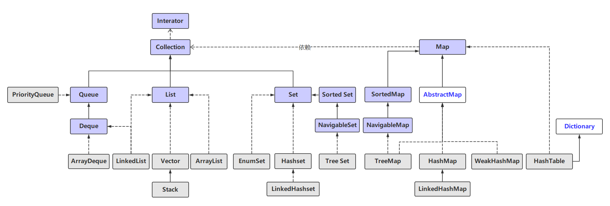
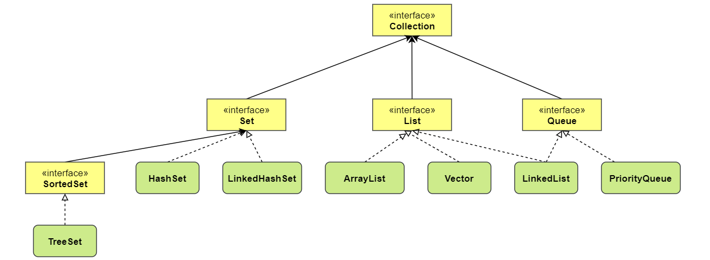

[TOC]

### 通用容器类

#### 概述

**集合框架**主要包括 **Collection** 和 **Map** 两大体系，Collection 存储着对象的**集合**，而 Map 存储着键值对（两个对象）的**映射表**。整个集合框架大概如下。



**通用实现**

<table align="center"><tr><td colspan="2" rowspan="2" align="center" border="0"></td><th colspan="5" align="center">Implementations</th></tr><tr><th>Hash Table</th><th>Resizable Array</th><th>Balanced Tree</th><th>Linked List</th><th>Hash Table + Linked List</th></tr><tr><th rowspan="4">Interfaces</th><th>Set</th><td><tt>HashSet</tt></td><td></td><td><tt>TreeSet</tt></td><td></td><td><tt>LinkedHashSet</tt></td></tr><tr><th>List</th><td></td><td><tt>ArrayList</tt></td><td></td><td><tt>LinkedList</tt></td><td></td></tr><tr><th>Deque</th><td></td><td><tt>ArrayDeque</tt></td><td></td><td><tt>LinkedList</tt></td><td></td></tr><tr><th>Map</th><td><tt>HashMap</tt></td><td></td><td><tt>TreeMap</tt></td><td></td><td><tt>LinkedHashMap</tt></td></tr></table>


#### Collection接口



##### 1. Set

不允许有重复元素的集合类。

- TreeSet：基于**红黑树**实现，支持**有序性**操作，例如根据一个范围查找元素的操作。但是查找效率不如 HashSet，HashSet 查找的时间复杂度为 O(1)，TreeSet 则为 O(logN)。
- HashSet：基于**哈希表**实现，支持快速查找，但不支持有序性操作。并且失去了元素的插入顺序信息，也就是说使用 Iterator 遍历 HashSet 得到的结果是不确定的。
- LinkedHashSet：具有 HashSet 的查找效率，且内部使用双向链表维护元素的**插入顺序**。

##### 2. List

**列表**类型。

- ArrayList：基于**动态数组**实现，支持**随机**访问。
- Vector：和 ArrayList 类似，但它是**线程安全**的。
- LinkedList：基于**双向链表**实现，只能顺序访问，但是可以快速地在**链表**中间插入和删除元素。不仅如此，LinkedList 还可以用作栈、队列和双向队列。

##### 3. Queue

队列类型。

- LinkedList：可以用它来实现**双向队列**。
- PriorityQueue：基于**堆结构**实现，可以用它来实现优先队列。


#### Map接口


- **TreeMap**：基于**红黑树**实现。
- **HashMap**：基于**哈希表**实现。
- **HashTable**：和 HashMap 类似，但它是线程安全的，这意味着同一时刻多个线程可以同时写入 HashTable 并且不会导致数据不一致。它是**遗留类**，不应该去使用它。现在可以使用 **ConcurrentHashMap** 来支持线程安全。
- **LinkedHashMap**：使用**双向链表**来维护元素的顺序，顺序为插入顺序或者最近最少使用（**LRU**）顺序。可以设置使用**插入顺序还是访问顺序**。
- **WeakHashMap**：从名字可以看出它是某种 Map。它的特殊之处在于 WeakHashMap 里的 **entry** 可能会被 **GC** 自动删除，即使程序员没有调用 `remove()` 或者 `clear()` 方法。


#### 容器中的设计模式

##### 1. 迭代器模式


Collection 继承了 **Iterable** 接口，其中的 iterator() 方法能够产生一个 **Iterator 对象**，通过这个对象就可以迭代遍历 Collection 中的元素。

从 JDK 1.5 之后可以使用 **foreach** 方法来遍历实现了 **Iterable** 接口的聚合对象。

```java
List<String> list = new ArrayList<>();
list.add("a");
list.add("b");
for (String item : list) {
    System.out.println(item);
}
```

##### 2. 适配器模式

java.util.Arrays.**asList**() 可以把**数组**类型转换为 **List** 类型。

```java
@SafeVarargs
public static <T> List<T> asList(T... a)
```

应该注意的是 asList() 的参数为泛型的变长参数，**不能使用基本类型**数组作为参数，只能使用相应的包装类型数组。

```java
Integer[] arr = {1, 2, 3};
List list = Arrays.asList(arr);
```

也可以使用以下方式调用 asList()：

```java
List list = Arrays.asList(1, 2, 3);
```


#### 容器类别

##### 1. 普通容器类

- **List：** List 接口存储一组不唯一（可以有多个元素引用相同的对象），存储**有序**的对象。
- **Set：** 不允许重复的集合。不会有多个元素引用相同的对象。
- **Map：使用键值对存储**。Map 会维护与 Key 有关联的值。两个 Key 可以引用相同的对象，但 Key 不能重复，典型的 Key 是 String 类型，但也可以是任何对象。

##### 2. 同步容器类

**同步容器类**就是将**方法通过 synchronized 修饰达到线程安全的类**。这些类实现线程安全的方式多半是加锁而仅仅只实现同步。

常见的同步容器类：

- **Vector**(implements List)
- **Hashtable**(implements Map)
- **Stack**(extends Vector)。
- **Collections.synchronizedXxxx**。

同步容器在**单线程**的环境下能够保证**线程安全**，但是通过 synchronized 同步方法将访问操作**串行化**，导致并发环境下效率低下。而且同步容器在多线程环境下的**复合操作**（**迭代**、条件运算如没有则添加等）是**非线程安全**，需要**客户端代码**来实现**加锁**。所以同步容器**迭代是需要加锁**的。

-_- 真没啥用，别用了。真是**鸡肋**，食之无味，弃之可惜

##### 3. 并发容器类

**并发容器类**可以改进同步容器类的性能。并发容器类主要是 **JUC** 下面的一些**容器类**，可以实现**线程安全**。同时性能也不错。

常见的有：

- ConcurrentHashMap
- CopyOnWriteArrayList


#### 同步容器类

这里先介绍同步容器类，后面重点介绍其他的。

##### 1. Vector

###### (1) 同步

Vector 的实现与 **ArrayList** 类似，但是使用了 **synchronized** 进行同步，所以是==**线程安全**==的。最好使用 ArrayList 而不是 Vector，因为**同步操作**可以由程序员自己控制。

```java
public synchronized boolean add(E e) {
    modCount++;
    ensureCapacityHelper(elementCount + 1);
    elementData[elementCount++] = e;
    return true;
}

public synchronized E get(int index) {
    if (index >= elementCount)
        throw new ArrayIndexOutOfBoundsException(index);
    return elementData(index);
}
```

###### (2) 与ArrayList的比较

- **ArrayList** 线程**不安全**，而 Vector 类采用了**同步机制**保证了线程**安全**。
- Vector 是**同步**的，因此==**开销**==就比 ArrayList 要**大**，访问速度更慢。
- Vector 每次扩容请求其大小的 **2 倍**空间，而 ArrayList 是 **1.5 倍**。
- 内部也有 **modCount** 记录**结构性变化次数**。

###### (3) 替代方案

可以使用 **Collections.synchronizedList()**; 得到一个线程安全的 ArrayList。但是也是使用了 synchronized  锁。

```java
List<String> list = new ArrayList<>();
// 得到一个线程安全的锁
List<String> synList = Collections.synchronizedList(list);
```

也可以使用 **JUC** 包下的 **CopyOnWriteArrayList** 类。

```java
List<String> list = new CopyOnWriteArrayList<>();
```

##### 2. Hashtable

Hashtable 类似于 HashMap。其底层数据结构也是 **数组 + 链表**。由于其内部使用了 **synchronized** 锁住了全表（**全表锁**），所以是**线程安全**的。


###### (1) Hashtable与HashMap对比

- **底层数据结构：** 内部都是用**数组存放元素**。JDK1.8 以后的 HashMap 在解决哈希冲突时有了较大的变化，当链表长度大于阈值（默认为8）（将链表转换成红黑树前会判断，如果当前数组的长度小于 64，那么会选择先进行数组扩容，而不是转换为红黑树）时，将链表转化为红黑树，以减少搜索时间。Hashtable 没有这样的机制。

- **线程安全性**： HashMap 是**非**线程安全的，HashTable 内部的方法基本都经过 **synchronized** 修饰所以是线程安全的。
- **效率：** HashTable 加了锁，效率低下。要同时保证**线程安全与效率**的话就使用 **ConcurrentHashMap**。
- **对 Null key 和 Null value 的支持：** HashMap 中，**null 可以作为键**，这样的**键只有一个，**可以有一个或多个键所对应的值为 null。但是 HashTable **不支持键或值**为 null，插入 null 直接抛出 NPE。
- **内部初始容量大小和数组扩容量大小不同：** ① 不指定容量初始值时 Hashtable 默认的初始大小为 **11**，之后每次扩容为原来的 **2n+1**。HashMap 默认的初始化大小为 **16**。之后每次扩容为原来的 **2 倍**。② 创建时如果**给定**了容量初始值，那么 Hashtable 会**直接使用**这个容量值。而 HashMap 会将其扩充为 **2 的幂次方**大小。

###### (2) ConcurrentHashMap和Hashtable的区别

ConcurrentHashMap 和 Hashtable 的区别主要体现在实现**线程安全**的方式上不同。ConcurrentHashMap 的实现方式是使用分段锁（Java8 之前），后面使用了 synchronized 和 CAS（Java8）。而 Hashtable 则使用了**全表锁**来锁住整个表。

##### 3. Collections

**Collections** 类中有一些方法可以返回线程安全的**同步容器**（不是并发容器）。它是给**所有容器方法**都加上 **synchronized** 关键字实现的。这些是**线程安全**的，但是效率较低。


```java
public static <T> List<T> synchronizedList(List<T> list) {
    return (list instanceof RandomAccess ?
            // 实现了RandomAccess接口就返回可以随机访问的安全列表
            new SynchronizedRandomAccessList<>(list) :
            // 否则返回一般的安全列表
            new SynchronizedList<>(list));
}
```

但是给所有的方法加 synchronized 关键词时所有的方法必须使用**相同的锁**，不然可能造成伪同步的问题。在**并发编程**当中，虽然同步容器类是**线程安全**的，但是在某些情况下（如**迭代**遍历）可能需要**额外的客户端加锁**来保护**复合操作**。

##### 4. 容器类的问题

**同步容器**的**单个操作是安全**的，但是**迭代操作不是**。如果在遍历容器时发生了**结构性变化**，就会**抛出异常**。同步容器没有解决这个问题，要避免这个异常，需要在遍历时给整个容器对象加锁。由于加了**锁**，所以**开销**比较大。

如下面一段代码：

```java
public static Object getLast(Vector list) {
    int lastIndex = list.size() - 1;
    return list.get(lastIndex);
}

public static void deleteLast(Vector list) {
    int lastIndex = list.size() - 1;
    list.remove(lastIndex);
}
```

上述两个方法中，虽然 **Vector 是线程安全**的，但是获取 Vector 大小与**获取/删除之间**没有锁保护，当获得 Vector 大小之后，如另外一个线程删除了 Vector 中的最末尾位置的元素，则每个函数的最后一句代码执行将报错。因此，对于**复合操作**，需要在**复合操作上用锁**来保证操作的原子性：

```java
public static Object getLast(Vector list) {
    synchronized (list) {
        int lastIndex = list.size() - 1;
        return list.get(lastIndex);
    }
}

public static void deleteLast(Vector list) {
    synchronized (list) {
        int lastIndex = list.size() - 1;
        list.remove(lastIndex);
    }
}
```

**同步容器不好，可以使用并发容器。并发容器都是线程安全的，且没有使用 synchronized 关键字，且没有迭代问题，而且直接支持一些复合操作。**


#### 参考资料

- <http://www.cnblogs.com/chengxiao/p/6842045.html>


