[TOC]

### JMM与Volatile

#### 计算机基础架构与模型

现代计算机模型是基于-冯诺依曼计算机模型计算机在运行时，先从内存中取出第一条指令，通过控制器的译码，按指令的要求，从存储器中取出数据进行指定的运算和逻辑操作等加工，然后再按地址把结果送到内存中去。接下来，再取出第二条指令，在控制器的指挥下完成规定操作。依此进行下去直至遇到停止指令。

程序与数据一样存贮，按程序编排的顺序，一步一步地取出指令，自动地完成指令规定的操作是计算机最基本的工作模型。下图-冯诺依曼计算机模型图  

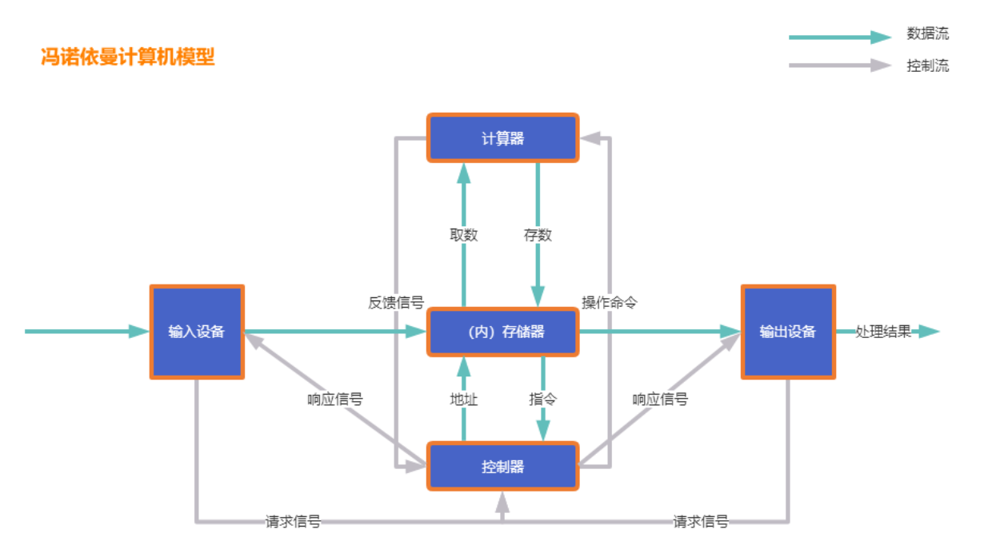

现代计算机硬件结构原理图  

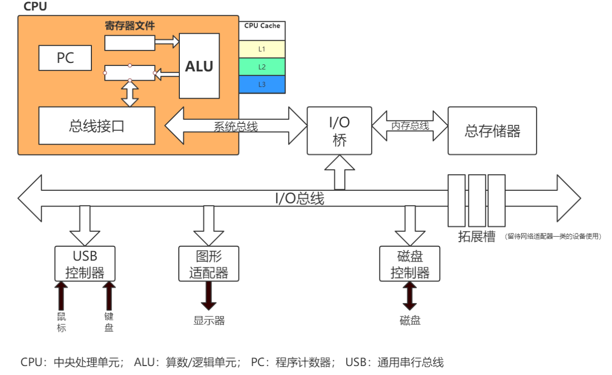

##### 1. 多CPU架构

计算机硬件多 CPU 架构：  

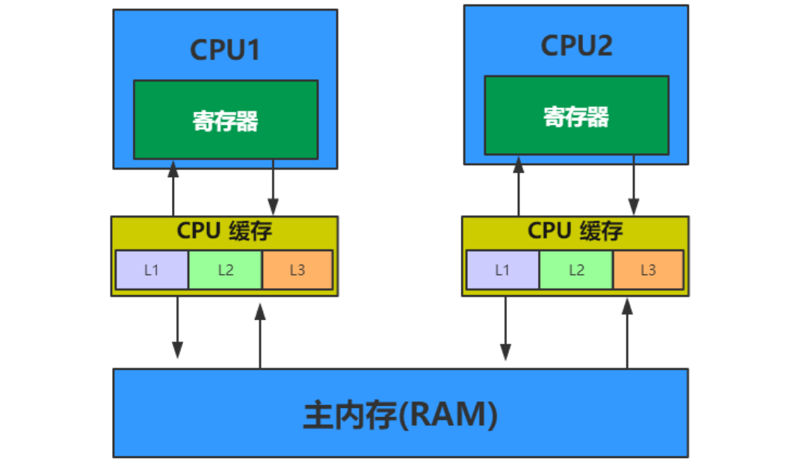

一个现代计算机通常由两个或者多个 CPU，如果要运行多个程序（进程）的话，假如只有一个 CPU 的话，就意味着要经常进行进程**上下文切换**，因为单 CPU 即便是多核的，也只是多个处理器核心，其他设备都是共用的，所以 多个进程就必然要经常进行进程上下文切换，这个代价是很高的。

**多核 CPU**

一个现代 CPU 除了处理器核心之外还包括寄存器、L1 L2 L3 缓存这些存储设备、浮点运算单元、整数运算单元等一些辅助运算设备以及内部总线等。**一个多核的 CPU 也就是一个 CPU 上有多个处理器核心**，这样有什么好处呢？比如说现在我们要在一台计算机上跑一个**多线程**的程序，因为**是一个进程里的线程**，所以需要一些**共享一些存储变量**，如果这台计算机都是单核单线程 CPU 的话，就意味着这个程序的不同线程需要经常在 CPU 之间的外部总线上通信，同时还要处理**不同 CPU 之间**不同缓存导致数据不一致的问题，所以在这种场景下**多核单 CPU 的架构**就能发挥很大的优势，通信都在内部总线，**共用同一个缓存。**

**CPU 寄存器**

每个 CPU 都包含**一系列的寄存器**，它们是 CPU 内内存的基础。CPU **在寄存器上执行操作的速度==远大于==在主存上执行的速度**。这是因为 CPU 访问寄存器的速度远大于主存。

**CPU 缓存**

即**高速缓冲存储器**，是位于 CPU 与**主内存**间的一种容量较小但**速度很高的存储器**。由于 CPU 的速度远高于主内存，CPU 直接从内存中存取数据要**等待一定时间周期**，Cache 中保存着 CPU 刚用过或循环使用的**一部分数据**，当 CPU 再次使用该部分数据时可从 **Cache** 中**直接调用**，减少 CPU 的等待时间，提高了系统的效率。

- 一级 Cache(L1 Cache)
- 二级 Cache(L2 Cache)
- 三级 Cache(L3 Cache)

**内存**

一个计算机还包含一个**主存**。所有的 CPU 都可以访问主存。主存通常比 CPU 中的缓存大得多。

**CPU 读取存储器数据过程**

- CPU 要取**寄存器 XX** 的值，只需要一步：**直接读取**。

- CPU 要**取 L1 cache** 的某个值，需要 1-3 步（或者更多）：把 cache 行锁住，把某个数据拿来，解锁，如果没锁住就慢了。

- CPU 要**取 L2 cache** 的某个值，先要到 L1 cache 里取，L1 当中不存在，在 L2 里，L2 开始加锁，加锁以后，把L2里的数据复制到 L1，再执行读 L1 的过程，上面的 3 步，再解锁。

- CPU **取 L3 cache** 的也是一样，只不过先由 L3 复制到 L2，从 L2 复制到 L1，从 L1 到 CPU。

- CPU **取内存**中的值则最复杂：通知内存控制器占用总线带宽，通知内存加锁，发起内存读请求，等待回应，回应数据保存到 L3（如果没有就到 L2），再从 L3/2 到 L1，再从 L1 到 CPU，之后解除总线锁定。

##### 2. 多线程环境下存在的问题

###### (1) 缓存一致性问题

在多处理器系统中，每个处理器都有自己的**高速缓存**，而它们又**共享同一主内存**（MainMemory）。基于**高速缓存的存储交互很好地解决了处理器与内存的速度矛盾，但是也引入了新的问题：缓存一致性（CacheCoherence）**。当多个处理器的运算任务都涉及同一块主内存区域时，将可能导致**各自的缓存数据不一致**的情况，如果真的发生这种情况，那同步
回到主内存时以谁的缓存数据为准呢？为了**解决一致性的问题**，需要各个处理器**访问缓存时都遵循一些协议**，在读写时要根据协议来进行操作，这类协议有 MSI、**MESI**（IllinoisProtocol）、MOSI、Synapse、Firefly 及 DragonProtocol，等等。

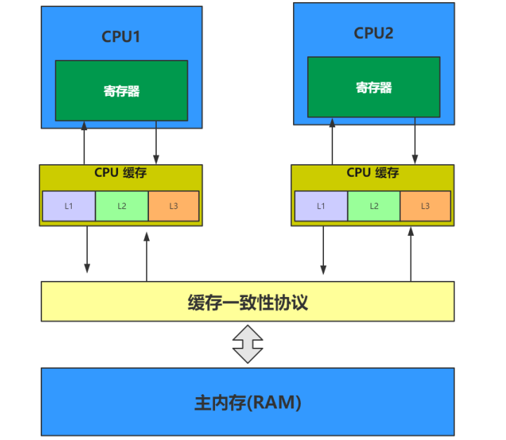

###### (2) 指令重排序问题

为了使得处理器内部的运算单元能尽量被充分利用，**处理器**可能会对输入代码进行**乱序执行（Out-Of-Order Execution）优化**，处理器会在计算之后将**乱序执行的结果重组**，保证该结果与顺序执行的**结果是一致**的，**但并不保证程序中各个语句计算的先后顺序与输入代码中的顺序一致**。因此，如果存在一个计算任务**依赖**另一个计算任务的中间结果，那么其顺序性并不能靠代码的先后顺序来保证。与处理器的乱序执行优化类似，Java 虚拟机的**即时编译器**中也有类似的指令重排序（Instruction Reorder）优化。

#### 线程

##### 1. 线程概述

现代操作系统在运行一个程序时，会为其创建一个**进程**。例如，启动一个 Java 程序，操作系统就会创建一个 **Java 进程**。现代操作系统调度 **CPU** 的最小单元是线程，也叫**轻量级进程**（Light Weight Process），在一个进程里可以创建多个线程，这些线程都拥有**各自的计数器、堆栈和局部变量**等属性，并且能够访问**共享的内存变量**。处理器在这些线程上高速切换，让使用者感觉到这些线程在同时执行。

线程的实现可以分为两类：

- **用户级**线程(User-Level Thread)
- **内核线**线程(Kernel-Level Thread)

在理解线程分类之前我们需要先了解系统的**用户空间与内核空间**两个概念，以 4G 大小的内存空间为例。

Linux 为内核代码和数据结构预留了几个**页框**，这些页永远不会被转出到磁盘上。从0x00000000 到 0xc0000000（PAGE_OFFSET） 的线性地址可由用户代码 和 内核代码进行引用（即用户空间）。从0xc0000000（PAGE_OFFSET）到 0xFFFFFFFFF 的线性地址**只能由内核代码进行访问**（即内核空间）。内核代码及其数据结构都必须位于这 1GB 的地址空间中，但是对于此地址空间而言，更大的消费者是物理地址的**虚拟映射**。

这意味着在 4GB 的内存空间中，只有 3GB 可以用于用户应用程序。一个**进程只能运行在用户方式**（usermode）或内核方式（kernelmode）下。用户程序运行在用户方式下，而系统调用运行在内核方式下。在这两种方式下所用的**堆栈不一样**：用户方式下用的是**一般的堆栈**，而内核方式下用的是**固定大小的堆栈**（一般为一个内存页的大小）每个进程都有自己的 3G 用户空间，它们**共享 1GB 的内核空间**。当一个进程从用户空间进入内核空间时，它**就不再有自己的进程空间**了。这也就是为什么经常说**线程上下文切换会涉及到用户态到内核态的切换原因**所在。

**用户线程**：指不需要内核支持而在用户程序中实现的线程，其不依赖于操作系统核心，**应用进程利用线程库提供创建、同步、调度和管理线程的函数来控制用户线程**。另外，用户线程是由应用进程利用线程库创建和管理，不依赖于操作系统核心。不需要用户态/核心态切换，速度快。操作系统内核**不知道**多线程的存在，因此一个线程阻塞将使得整个进程（包括它的所有线程）阻塞。由于这里的处理器时间片分配是以进程为基本单位，所以每个线程执行的时间相对减少。

**内核线程**： 线程的所有管理操作都是由**操作系统内核**完成的。内核保存线程的状态和上下文信息，当一个线程执行了引起阻塞的系统调用时，内核可以调度该进程的其他线程执行。在多处理器系统上，内核可以分派属于同一进程的多个线程在多个处理器上运行，提高进程执行的并行度。由于需要内核完成线程的创建、调度和管理，所以和用户级线程相比这些操作要慢得多，但是仍然比进程的创建和管理操作要快。大多数市场上的操作系统，如 Windows，Linux 等都支持内核级线程。

原理区别如下图所示（图 a 用户线程，图 b 内核线程）

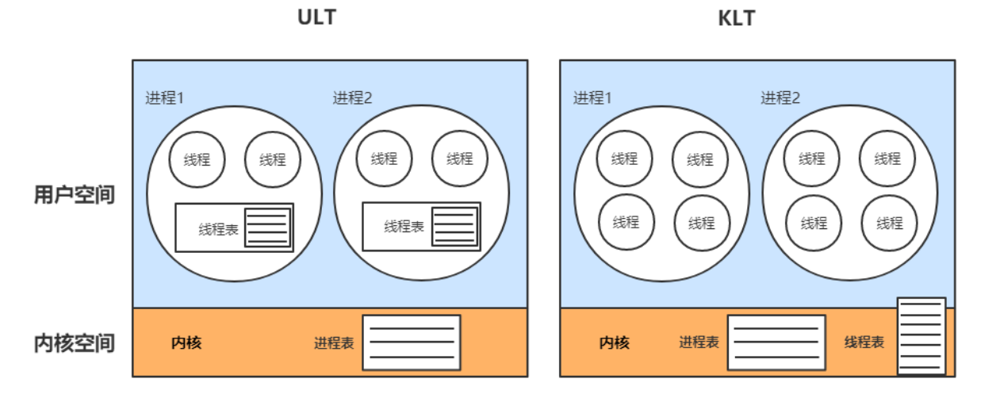

Java 线程与系统内核线程关系  

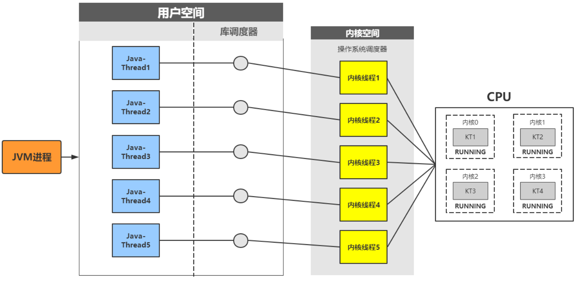

##### 2. Java线程

JVM 中创建线程有 2 种方式：

- new java.lang.**Thread**().start()
- 使用 **JNI** 将一个 **native thread** attach 到 JVM 中

**针对 new java.lang.Thread().start()这种方式**，只有**调用 start() 方法**的时候，才会真正的在 JVM 中去创建线程，主要的生命周期步骤有：

- 创建对应的 JavaThread 的 instance。
- 创建对应的 OSThread 的 instance。
- 创建实际的底层操作系统的 native thread。
- 准备相应的 JVM 状态，比如 ThreadLocal 存储空间分配等。
- 底层的 native thread 开始运行，调用 java.lang.Thread 生成的 Object 的 run() 方法。
- 当 java.lang.Thread 生成的 Object 的 run() 方法执行完毕返回后,或者抛出异常终止后，终止 native thread。
- 释放 JVM 相关的 thread 的资源，清除对应的 JavaThread 和 OSThread。

**针对 JNI 将一个 native thread attach 到 JVM 中**，主要的步骤有：

- 通过 JNI call AttachCurrentThread 申请连接到执行的 JVM 实例。
- JVM 创建相应的 JavaThread 和 OSThread 对象。
- 创建相应的 java.lang.Thread 的对象。
- 一旦 java.lang.Thread 的 Object 创建之后，JNI 就可以调用 Java 代码了。
- 当通过 JNI call DetachCurrentThread 之后，JNI 就从 JVM 实例中断开连接。
- JVM 除相应的 JavaThread, OSThread, java.lang.Thread 对象。

Java 线程的生命周期：  

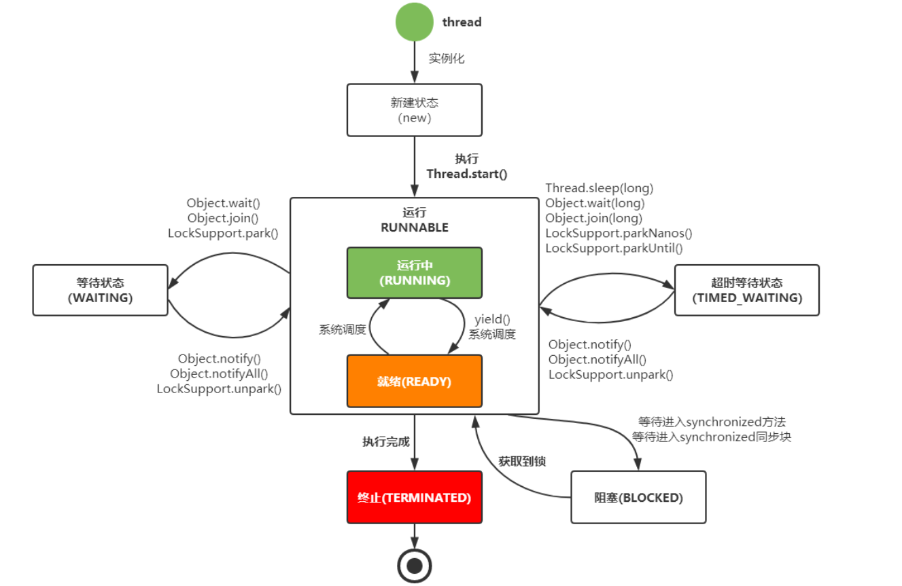

#### 并发

为什么用到并发？并发编程的本质其实就是**利用多线程技术**，在现代多核的 CPU 下，通过并发编程可以将多核 CPU 的计算能力发挥到极致，性能得到提升。除此之外，面对复杂业务模型，并行程序会比串行程序更适应业务需求，而并发编程更能吻合这种业务拆分 。
即使是**单核处理器也支持多线程**执行代码，CPU 通过给每个线程分配 **CPU 时间片**来实现这个机制。时间片是 CPU 分配给各个线程的时间，因为时间片非常短，所以 CPU 通过**不停地切换线程**执行，让我们感觉多个线程是同时执行的，时间片一般是几十毫秒（ms）。**并发不等于并行**：并发指的是多个任务交替进行，而并行则是指真正意义上的“同时进行”。实际上，如果系统内只有一个 CPU，而使用多线程时，那么真实系统环境下不能并行，只能通过切换时间片的方式交替进行，而成为并发执行任务。真正的并行也只能出现在拥有多个 CPU 的系统中。

并发的优点：

- 充分利用多核 CPU 的计算能力；
- 方便进行业务拆分，提升应用性能；

并发产生的问题：
高并发场景下，**导致频繁的上下文切换临界区线程安全问题**，容易出现死锁的，产生死锁就会造成系统功能不可用其它 CPU 通过时间片分配算法来循环执行任务，当前任务执行一个时间片后会切换到下一个任务。但是，在切换前会保存上一个任务的状态，以便下次切换回这个任务时，可以再加载这个任务的状态。所以任务从保存到再加载的过程就是一次上下文切换。
**线程上下文切换**过程：  

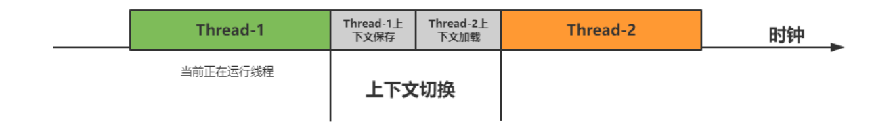

#### JMM模型

##### 1. 概述

Java 内存模型(**Java Memory Model 简称 JMM)**是一种抽象的概念，并不真实存在，它描述的是**一组规则或规范**，通过这组规范定义了程序中各个变量（包括实例字段，静态字段和构成数组对象的元素）的**访问方式**。JVM 运行程序的实体是线程，而每个线程创建时 JVM 都会为其创建一个**工作内存**(有些地方称为栈空间)，用于**存储线程私有的数据**，而 Java 内存模型中规定**所有变量都存储在主内存**，**主内存是共享内存区域，所有线程都可以访问，但线程对变量的操作(读取赋值等)必须在工作内存中进行，首先要将变量从主内存拷贝的自己的工作内存空间，然后对变量进行操作，操作完成后再将变量写回主内存，不能直接操作主内存中的变量，工作内存中存储着主内存中的变量副本拷贝**，前面说过，工作内存是每个线程的私有数据区域，因此不同的线程间无法访问对方的工作内存，线程间的**通信(传值)必须通过主内存**来完成。

##### 2. JMM不同于JVM内存区域模型  

JMM 与 JVM 内存区域的**划分是不同的概念层次**，更恰当说 **JMM 描述的是一组规则**，通过**这组规则控制程序中各个变量在共享数据区域和私有数据区域的访问方式**，JMM 是围绕**==原子性，有序性、可见性==**展开。JMM 与 Java 内存区域唯一相似点，都存在共享数据区域和私有数据区域，在 JMM 中主内存属于共享数据区域，从某个程度上讲应该包括了堆和方法区，而工作内存数据线程私有数据区域，从某个程度上讲则应该包括程序计数器、虚拟机栈以及本地方法栈。

线程，工作内存，主内存工作交互图（基于JMM规范）  

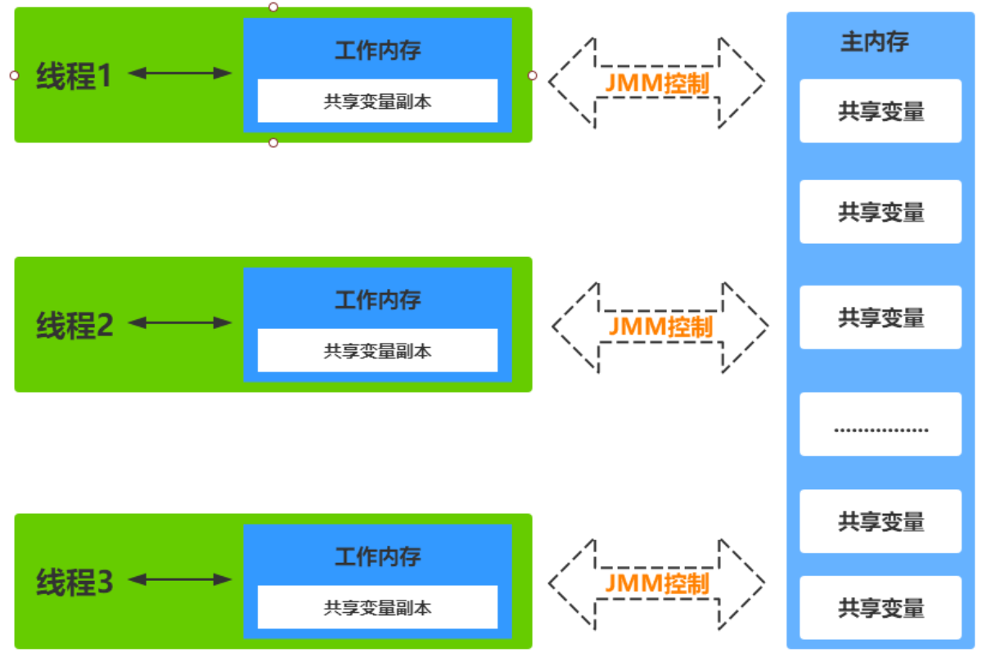

##### 3. 主内存

主要存储的是 Java **实例对象**，所有**线程创建的实例对象都存放在主内存中**，不管该实例对象是成员变量还是方法中的本地变量(也称局部变量)，当然也包括了共享的类信息、常量、静态变量。由于是共享数据区域，**多条线程对同一个变量进行访问可能会发生线程安全问题**。

##### 4. 工作内存

主要存储当前方法的所有**本地变量信息**(工作内存中**存储着主内存中的变量==副本拷贝==**)，每个线程只能访问自己的工作内存，即线程中的本地变量对其它线程是**不可见**的，就算是两个线程执行的是同一段代码，它们也会各自在自己的工作内存中创建属于**当前线程的本地变量**，当然也包括了字节码行号指示器、相关 Native 方法的信息。注意由于工作内存是每个线程的私有数据，线程间无法相互访问工作内存，因此**存储在工作内存的数据不存在线程安全问题**。根据 JVM 虚拟机规范主内存与工作内存的数据存储类型以及操作方式，对于一个实例对象中的成员方法而言，如果方法中包含**本地变量**是**基本数据类型**（boolean,byte,short,char,int,long,float,double），将**直接存储在工作内存的帧栈结构**中，但倘若**本地变量**是**引用类型**，那么该变量的引用会存储在功能**内存的帧栈**中，而**对象实例将存储在主内存**(共享数据区域，堆)中。

但对于**实例对象**的成员变量，不管它是基本数据类型或者包装类型(Integer、Double等)还是引用类型，都会被存储到**堆区**。至于 **static 变量**以及类本身相关信息将会存储在**主内存**中。需要注意的是，在主内存中的实例对象可以被多线程共享，倘若两个线程同时调用了同一个对象的同一个方法，那么两条线程会将要操作的数据拷贝一份到自己的工作内存中，执行完成操作后才刷新到主内存。

模型如下图所示  

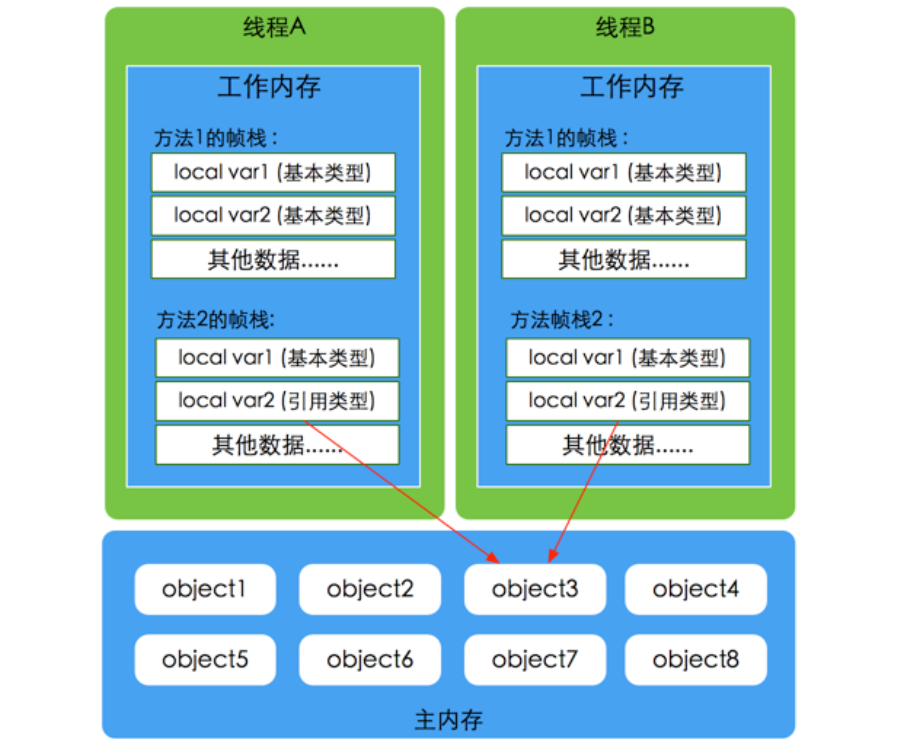

##### 5. Java内存模型与硬件内存架构的关系  

通过对前面的硬件内存架构、Java 内存模型以及 Java 多线程的实现原理的了解，我们应该已经意识到，多线程的执行最终都会映射到**硬件处理器**上进行执行，但 **Java 内存模型和硬件内存架构并不完全一致**。对于硬件内存来说只有寄存器、缓存内存、主内存的概念，并**没有工作内存**(线程私有数据区域)和主内存(堆内存)之分，也就是说 Java 内存模型对内存的划分对硬件内存并没有任何影响，因为 JMM 只是一种**抽象**的概念，是一组规则，并不实际存在，不管是工作内存的数据还是主内存的数据，对于计算机硬件来说都会存储在计算机**主内存**中，当然也有可能存储到 CPU 缓存或者寄存器中，因此总体上来说，Java 内存模型和计算机硬件内存架构是一个相互交叉的关系，是一种抽象概念划分与真实物理硬件的交叉。(注意对于 Java 内存区域划分也是同样的道理)  。

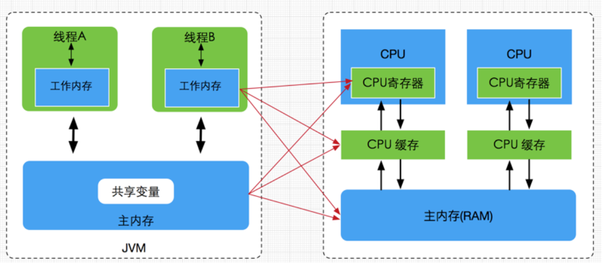

##### 6. JMM存在的必要性  

由于 JVM 运行程序的实体是**线程**，而每个线程创建时 JVM 都会为其创建一个**工作内存**(有些地方称为**栈空间**)，用于存储线程**私有**的数据，线程与主内存中的变量操作必须通过**工作内存**间接完成，主要过程是将变量从主内存拷贝的每个线程各自的工作内存空间，然后对变量进行操作，操作完成后再将变量**写回**主内存，如果存在两个线程同时对一个主内存中的实例对象的变量进行操作就有可能诱发线程安全问题。

假设主内存中存在一个**共享变量 x**，现在有 A 和 B 两条线程分别对该变量 x=1 进行操作，A/B 线程各自的工作内存中存在共享变量副本 x。假设现在 A 线程想要修改 x 的值为 2，而 B 线程却想要读取 x 的值，那么 B 线程读取到的值是 A 线程更新后的值 2 还是更新前的值 1 呢？

答案是，**不确定**，即 B 线程有可能读取到 A 线程更新前的值 1，也有可能读取到 A 线程更新后的值 2，这是因为工作内存是每个线程私有的数据区域，而线程 A 修改变量 x 时，首先是将变量从主内存拷贝到 A 线程的**工作内存**中，然后对变量进行操作，操作完成后再将变量 x **写回主内存**，而对于 B 线程的也是类似的，这样就有**可能造成主内存与工作内存间数据存在一致性问题**，假如 A 线程修改完后正在将数据写回主内存，而B线程此时正在读取主内存，即将 x=1 拷贝到自己的工作内存中，这样 B 线程读取到的值就是 x=1，但如果 A 线程已将 x=2 写回主内存后，B 线程**才开始读取**的话，那么此时 B 线程读取到的就是 x=2，但到底是哪种情况先发生呢？  

以上关于主内存与工作内存之间的**具体交互协议**，即一个变量如何从主内存拷贝到工作内存、如何从工作内存同步到主内存之间的实现细节，Java 内存模型定义了**八种操作**来完成。

##### 7. 交互的8种操作

- **lock**(锁定)：作用于主内存的变量，把一个变量标记为一条线程独占状态。
- **unlock**(解锁)：作用于主内存的变量，把一个处于锁定状态的变量释放出来，释放后的变量才可以被其他线程锁定。
- **read**(读取)：作用于主内存的变量，把一个变量值从主内存传输到线程的工作内存中，以便随后的load动作使用。
- **load**(载入)：作用于工作内存的变量，它把 read 操作从主内存中得到的变量值放入工作内存的变量副本中。
- **use**(使用)：作用于工作内存的变量，把工作内存中的一个变量值传递给执行引擎。
- **assign**(赋值)：作用于工作内存的变量，它把一个从执行引擎接收到的值赋给工作内存的变量。
- **store**(存储)：作用于工作内存的变量，把工作内存中的一个变量的值传送到主内存中，以便随后的 write 的操作。
- write(写入)：作用于工作内存的变量，它把 store 操作从工作内存中的一个变量的值传送到主内存的变量中。

如果要把一个变量从**主内存中复制到工作内存**中，就需要**按顺序地执行 read 和 load 操作**，如果把变量从**工作内存中同步到主内存**中，就需要按**顺序地执行 store 和 write 操作**。但 Java 内存模型**只要求上述操作必须按顺序执行，而没有保证必须是连续执行。**  

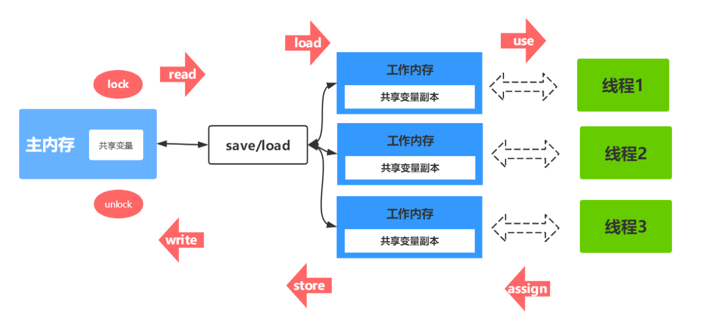

##### 8. 同步规则分析

- 不允许一个线程无原因地（没有发生过任何 assign 操作）把数据从工作内存同步回主内存中 。
- 一个新的变量只能在主内存中诞生，不允许在工作内存中直接使用一个未被初始化（load 或者 assign）的变量。即就是对一个变量实施 use 和 store 操作之前，必须先自行 assign 和 load 操作。
- 一个变量在同一时刻只允许一条线程对其进行 lock 操作，但 lock 操作可以被**同一线程**重复执行多次，多次执行 lock 后，只有执行相同次数的 unlock 操作，变量才会被解锁。lock 和 unlock 必须**成对**出现。
- 如果对一个变量执行 lock 操作，将会清空工作内存中此变量的值，在执行引擎使用这个变量之前需要重新执行 load 或 assign 操作初始化变量的值。
- 如果一个变量事先没有被 lock 操作锁定，则不允许对它执行 unlock 操作；也不允许去 unlock 一个被其他线程锁定的变量。
- 对一个变量执行 **unlock 操作之前**，必须先把此**变量同步到主内存**中（执行 store 和 write 操作）  。

##### 9. 并发编程的可见性，原子性与有序性问题

原子性、可见性和有序性是**并发编程**必须考虑的问题，这里先描述这几个问题，然后再讨论 JMM 模型是如何解决这些问题的。

###### (1) 原子性

原子性指的是一个操作是不可中断的，即使是在多线程环境下，一个操作一旦开始就不会被其他线程影响。  

在 Java 中，对基本数据类型的变量的读取和赋值操作是**原子性操作**有点要注意的是，对于基本数据类型，byte, short, int, float, boolean, char 来说，其**读写是原子操作**。而对于 32 位系统的来说，long 类型数据和 double 类型数据，它们的读写**并非原子性**的，也就是说如果存在两条线程同时对 long 类型或者 double 类型的数据进行读写是存在相互干扰的，因为对于 32 位虚拟机来说，每次原子读写是 32 位的，而 long 和 double 则是 **64 位**的存储单元，这样会导致一个线程在写时，操作完前 32 位的原子操作后，轮到 B 线程读取时，恰好只读取到了**后 32 位**的数据，这样可能会读取到一个既非原值又不是线程修改值的变量，它可能是“**半个变量**”的数值，即 64 位数据被两个线程分成了两次读取。但也不必太担心，因为读取到“半个变量”的情况比较少见，至少在目前的商用的虚拟机中，几乎都把64位的数据的读写操作作为原子操作来执行，因此对于这个问题不必太在意，知道这么回事即可。

###### (2) 可见性

**可见性指的是当一个线程修改了某个共享变量的值，其他线程是否能够马上得知这个修改的值**。对于串行程序来说，可见性是不存在的，因为我们在任何一个操作中修改了某个变量的值，后续的操作中都能读取这个变量值，并且是修改过的新值。

但在多线程环境中可就不一定了，前面我们分析过，由于线程对共享变量的操作都是线程拷贝到各自的工作内存进行操作后才写回到主内存中的，这就可能存在一个线程 A 修改了共享变量 x 的值，还**未写回主内存**时，另外一个线程 B 又对主内存中同一个共享变量 x 进行操作，但此时 A 线程工作内存中共享变量 x 对线程 B 来说**并不可见**，这种**工作内存与主内存同步延迟现象就造成了可见性问题**，另外指令重排以及编译器优化也可能导致可见性问题，通过前面的分析，我们知道无论是编译器优化还是处理器优化的重排现象，在多线程环境下，确实会导致程序轮序执行的问题，从而也就导致可见性问题。

###### (3) 有序性

有序性是指对于**单线程**的执行代码，我们总是认为代码的执行是按顺序依次执行的，这样的理解并没有毛病，毕竟对于单线程而言确实如此，但对于**多线程**环境，则可能出现**乱序现象**，因为程序编译成**机器码指令后可能会出现指令重排现象**，重排后的指令与原指令的顺序未必一致，要明白的是，在 Java 程序中，倘若在本线程内，所有操作都**视为有序行为**，如果是多线程环境下，一个线程中观察另外一个线程，所有操作都是**无序**的，前半句指的是单线程内保证串行语义执行的一致性，后半句则指指令重排现象和工作内存与主内存同步延迟现象。  

##### 10. JMM如何解决原子性&可见性&有序性问题

这里讨论一下 **JMM 模型**是如何解决并发编程的这几个问题的。

###### (1) 解决原子性问题

除了 JVM 自身提供的对基本数据类型读写操作的原子性外，可以通过 **synchronized 和 Lock** 实现原子性。因为 synchronized 和 Lock 能够**保证任一时刻只有一个线程访问该代码块** 。

###### (2) 解决可见性问题

**volatile 关键字保证可见性**。当一个共享变量被 volatile 修饰时，它会保证**修改的值立即被其他的线程看到**，即修改的值**立即更新到主存**中，当其他线程需要读取时，它会去内存中读取新值。

**synchronized 和 Lock 也可以保证可见性**，因为它们可以保证任一时刻只有一个线程能访问共享资源，并在其**释放锁之前**将修改的变量**刷新到内存**中。

###### (3) 解决有序性问题

可以通过 volatile **关键字来保证一定的“有序性”**。

另外可以通过 **synchronized 和 Lock 来保证有序性**，很显然，synchronized 和 Lock 保证每个时刻是有一个线程执行同步代码，相当于是让线程顺序执行同步代码，自然就保证了有序性。  

#### 指令重排序

##### 1. 概述

Java 语言规范规定 JVM **线程内部**维持**顺序化**语义。即只要程序的最终结果与它顺序化情况的结果相等，那么指令的执行顺序可以与代码顺序不一致，此过程叫**指令的重排序**。

指令重排序的意义是什么？JVM 能根据**处理器特性**（CPU 多级缓存系统、多核处理器等）适当的对机器指令进行重排序，**使机器指令能更符合 CPU 的执行特性，最大限度的发挥机器性能。**

下图为从源码到最终执行的指令序列示意图。

##### 2. as-if-serial语义

as-if-serial 语义的意思是：**不管怎么重排序**（编译器和处理器为了提高并行度），（**单线程**）程序的执行结果**不能被改变**。**编译器、runtime 和处理器**都必须遵守 as-if-serial 语义。

为了遵守 as-if-serial 语义，编译器和处理器**==不会对存在数据依赖关系==的操作做重排序**，因为这种重排序会改变执行结果。但是，如果操作之间**不存在**数据依赖关系，这些操作就可能被编译器和处理器**重排序**。  

##### 3. happens-before原则

只靠sychronized和volatile关键字来保证原子性、可见性以及有序性，那么编写并发程序可能会显得十分麻烦，幸运的是，从JDK 5开始，Java使用新的JSR-133内存模型，提供了happens-before 原则来辅助保证程序执行的原子性、可见性以及有序性的问题，它是判断数据是否存在竞争、线程是否安全的依据，happens-before 原则内容如下：

- 程序顺序原则：即在**一个线程内必须保证语义串行性**，也就是说按照代码顺序执行。
- 锁规则：解锁(unlock)操作必然发生在后续的同一个锁的加锁(lock)之前，也就是说，如果对于一个锁解锁后，再加锁，那么加锁的动作必须在解锁动作之后(同一个锁)。
- volatile 规则：volatile 变量的写，**先发生于读**，这保证了 volatile 变量的可见性，简单的理解就是，**volatile 变量在每次被线程访问时，都强迫从主内存中读该变量的值，而当该变量发生变化时，又会强迫将最新的值刷新到主内存，任何时刻，不同的线程总是能够看到该变量的最新值**。
- 线程启动规则：线程的 start() 方法先于它的每一个动作，即如果线程 A 在执行线程 B 的 start 方法之前修改了共享变量的值，那么当线程 B 执行 start 方法时，线程 A 对共享变量的修改对线程 B 可见。
- 传递性：A 先于 B ，B 先于 C 那么 A 必然先于 C。
- 线程终止规则：线程的所有操作先于线程的终结，Thread.join() 方法的作用是等待当前执行的线程终止。假设在线程B终止之前，修改了共享变量，线程 A 从线程 B 的 join 方法成功返回后，线程 B 对共享变量的修改将对线程 A 可见。
- 线程中断规则：对线程 interrupt() 方法的调用先行发生于被中断线程的代码检测到中断事件的发生，可以通过 Thread.interrupted() 方法检测线程是否中断。
- 对象终结规则：对象的构造函数执行，结束先于 finalize() 方法  。

#### Volatile内存语义

volatile 是 Java 虚拟机提供的**轻量级的同步机制**。volatile 关键字有如下两个作用：

- **保证可见性**：保证被 volatile 修饰的共享变量**对所有线程总数可见**的，也就是当一个线程修改了一个被 volatile 修饰共享变量的值，新值总是可以被其他线程立即得知。**对 volatile 变量的修改，修改之后，马上同步回主内存，而对其读则每次必须从主内存进行刷新读。**
- **禁止指令重排序优化**。  

##### 1. volatile的可见性

关于 volatile 的可见性作用，我们必须意识到被 volatile 修饰的变量对所有线程总数立即可见的，对 **volatile 变量**的所有写操作总是能立刻反应到其他线程中。

##### 2. volatile无法保证原子性

在并发场景下，i 变量的任何改变都会立马反应到其他线程中，但是如此存在**多条线程**同时调用 **increase()** 方法的话，就会出现线程安全问题，毕竟 i**++; 操作并不具备原子性**，该操作是先读取值，然后写回一个新值，相当于原来的值加上 1，分两步完成，如果第二个线程在第一个线程读取旧值和写回新值期间读取 i 的域值，那么第二个线程就会与第一个线程一起看到同一个值，并执行相同值的加 1 操作，这也就造成了线程安全失败，因此对于 increase 方法必须使用 synchronized 修饰，以便保证线程安全，需要注意的是一旦使用 synchronized 修饰方法后，由于 synchronized 本身也具备与 volatile **相同的特性**，即可见性，因此在这样种情况下就完全可以**省去** volatile 修饰变量。  

##### 3. volatile禁止重排优化  

volatile 关键字另一个作用就是**禁止指令重排优化**，从而避免多线程环境下程序出现乱序执行的现象，关于指令重排优化前面已详细分析过，这里主要简单说明一下 volatile 是如何实现禁止指令重排优化的。先了解一个概念，**==内存屏障==**(Memory Barrier）。

**内存屏障**，又称内存栅栏，是一个 **CPU 指令**，它的作用有两个，一是**保证特定操作的执行顺序**，二是**保证某些变量的内存可见性**（利用该特性实现 volatile 的内存可见性）。

由于编译器和处理器都能执行指令重排优化。如果在**指令间插入一条 Memory Barrier 则会告诉编译器和 CPU，不管什么指令都不能和这条 Memory Barrier 指令重排序，也就是说通过插入内存屏障禁止在内存屏障前后的指令执行重排序优化。**Memory Barrier 的另外一个作用是**强制刷出各种 CPU 的缓存数据**，因此任何 CPU 上的线程都能读取到这些数据的最新版本。总之，**==volatile 变量正是通过内存屏障实现其在内存中的语义，即可见性和禁止重排优化==**。下面看一个非常典型的禁止重排优化的例子 DCL，如下  

#### Volatile内存语义的实现

前面提到过重排序分为编译器重排序和处理器重排序。为了实现 volatile 内存语义，JMM 会分别限制这两种类型的重排序类型。
下图是 JMM 针对编译器制定的 volatile 重排序规则表。

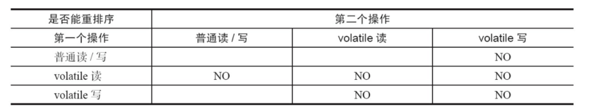

举例来说，第三行最后一个单元格的意思是：在程序中，当第一个操作为普通变量的读或写时，如果第二个操作为 volatile 写，则编译器不能重排序这两个操作。

从上图可以看出：

- 当第二个操作是 volatile 写时，不管第一个操作是什么，都不能重排序。这个规则确保 volatile 写之前的操作不会被编译器重排序到 volatile 写之后。
- 当第一个操作是 volatile 读时，不管第二个操作是什么，都不能重排序。这个规则确保 volatile 读之后的操作不会被编译器重排序到 volatile 读之前。
- 当第一个操作是 volatile 写，第二个操作是 volatile 读时，不能重排序。

为了实现 volatile 的内存语义，编译器在生成字节码时，会在指令序列中插入**内存屏障**来禁止特定类型的处理器重排序。对于编译器来说，发现一个最优布置来最小化插入屏障的总数几乎不可能。为此，JMM采取保守策略。下面是基于保守策略的 JMM 内存屏障插入策略。  

- 在每个 volatile 写操作的前面插入一个 StoreStore 屏障。
- 在每个 volatile 写操作的后面插入一个 StoreLoad 屏障。
- 在每个 volatile 读操作的后面插入一个 LoadLoad 屏障。
- 在每个 volatile 读操作的后面插入一个 LoadStore 屏障。

上述内存屏障插入策略非常保守，但它可以保证在任意处理器平台，任意的程序中都能得到正确的 volatile 内存语义。

举个例子：下面是保守策略下，**volatile 写插入内存屏障**后生成的指令序列示意图。

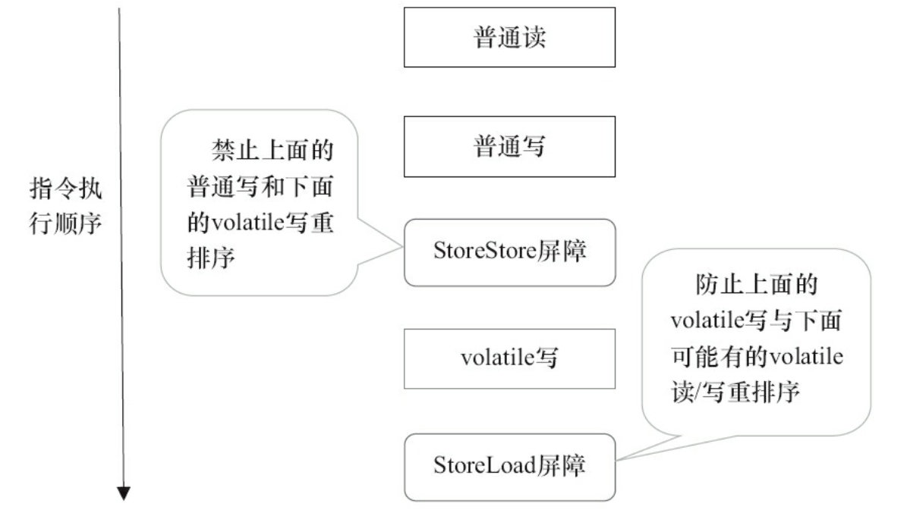

上图中 StoreStore 屏障可以保证在 volatile 写之前，其前面的所有普通写操作已经对任意处理器可见了。这是因为 StoreStore 屏障将保障上面所有的普通写在 volatile 写之前刷新到主内存。  

