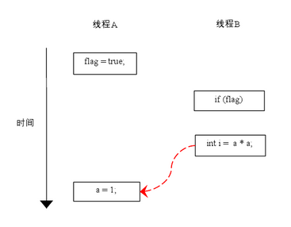

[TOC]

### Java内存模型

> **为什么要有Java内存模型**？

Java **内存模型**试图屏蔽各种**硬件和操作系统的内存访问差异**，以实现让 Java 程序在各种平台下都能达到**一致的内存访问效果**。

#### 主内存与工作内存

处理器上的**寄存器**的读写的速度比**内存**快几个数量级，为了解决这种**速度矛盾**，在它们之间加入了**高速缓存**，而且缓存一般有多级：一级缓存、二级缓存、三级缓存。很多时候寄存器是直接从**缓存**中读取缓存数据的，但是**内存**中才是存放各种数据的主要位置。

但是加入**高速缓存**带来了一个新的问题：**==缓存一致性问题==**。如果多个缓存**共享同一块主内存**区域，那么多个缓存的数据可能会不一致，需要一些**协议**来解决这个问题。如下图所示。 


Java 的内存模型就是所有的**变量**都存储在**主内存**中，每个线程还有自己的**工作内存**，工作内存存储在**高速缓存或者寄存器**中，保存了该线程使用的变量的**主内存副本拷贝**。

**线程**只能直接操作**工作内存**中的变量，不同线程之间的变量**值传递**需要通过**主内存**来完成。如下图所示。


在当前的 Java 内存模型下，线程可以把变量保存**本地内存**（比如机器的**寄存器**）中，**而不是直接在主存**中进行读写。这就可能造成一个线程在主存中修改了一个变量的值，而另外一个线程还继续使用它在寄存器中的变量值的拷贝，造成**数据的不一致**。

要解决这个问题，就需要把**变量**声明为 **volatile**，这就指示 JVM 这个变量是**不稳定**的，每次**使用它都到主存**中进行读取或写入。

**Java 内存模型和硬件关系图**


#### 内存间交互操作

Java 内存模型定义了 **8 个操作**来完成**主内存和工作内存**的交互操作。如下图所示，发现围绕箭头**绕了一圈**。


- **lock**（锁定）：作用于**主内存**的变量，把一个**变量**标识为**一条线程独占**的状态。
- **unclock**（解锁）：作用于**主内存**的变量，把一个处于**锁定状态的变量释放**出来，释放后的变量才可以被其他线程锁定。
- **read**（读取）：作用于**主内存**的变量，把一个变量的值从**主内存**传输到线程的**工作内存**，以便随后的 **load** 动作使用。
- **load**（载入）：作用于**工作内存**的变量，把 read 操作从主内存中得到的变量值**放入工作内存的变量副本**中。
- **use**（使用）：作用于**工作内存**的变量，把**工作内存**中一个变量的值传递给**执行引擎**。
- **assign**（赋值）：作用于**工作内存**的变量，把**执行引擎**接收到的值赋给**工作内存**的变量。
- **store**（存储）：作用于**工作内存**的变量，把工作内存中一个变量的值传送给**主内存**中，以便随后的 write 操作使用。
- **write**（写入）：作用于**主内存**的变量，把 store 操作从工作内存中得到的变量的值放入**主内存的变量**中。


#### 内存模型三大特性

这里的三大特性其实也就是反应了多线程下的几个问题：**原子性问题、可见性问题、有序性问题**。

- **原子性** : 一个的操作或者多次操作，要么所有的操作全部都得到执行并且不会收到任何因素的干扰而中断，要么所有的操作都执行，要么都不执行。**synchronized** 可以保证代码片段的**原子性**。
- **可见性**  ：当一个变量对**共享变量**进行了修改，那么另外的线程都是可以**立即看到**修改后的最新值。volatile 关键字可以保证共享变量的**可见性**。
- **有序性** ：代码在执行的过程中的先后顺序，Java 在编译器以及运行期间的优化，代码的执行顺序未必就是编写代码时候的顺序。volatile 关键字可以禁止指令进行重排序优化。

##### 1. 原子性

Java 内存模型保证了 read、load、use、assign、store、write、lock 和 unlock 操作具有**原子性**，例如对一个 int 类型的变量执行 assign 赋值操作，这个操作就是**原子性**的。但是 Java 内存模型**允许**虚拟机将**没有**被 volatile 修饰的 64 位数据（long，double）的读写操作划分为**两次 32 位**的操作来进行，即 **load、store、read 和 write** 操作**可以不具备**原子性（了解即可）。

有一个**错误认识**就是，**int** 等基本数据类型在多线程环境中**不会**出现线程安全问题。下面的 cnt 属于 int 类型变量，1000 个线程对它进行**自增**操作之后，得到的值为 997 而不是 1000。

```java
public void add() {
    // 这一句其实并不是原子操作
    cnt++; // 998
}
```

**在多线程环境下，有可能线程 A 将 cnt 读取到本地内存中，此时其他线程可能已经将 cnt 增大了很多，而线程 A 依然对过期的 cnt 进行自加，然后重新刷新到主存中，最终导致了 cnt 的结果不合预期，而是小于 1000。**

为啥？将内存间的交互操作简化为 3 个：**load、assign、store**。

下图演示了两个线程同时对变量 cnt 进行操作，load、assign、store 这一系列操作整体上来看不具备原子性，那么在 T1 修改 cnt 并且还没有将修改后的值写入主内存，T2 依然可以读入旧值。可以看出，这两个线程虽然执行了两次自增运算，但是主内存中 cnt 的值最后为 1 而不是 2。对 int 类型读写操作只是说明 load、assign、store 这些**单个操作具备原子性**，组合在一起不一定具有原子性。


使用 **AtomicInteger** 类能保证多个线程对 int 类型修改的**原子性**。


使用 **AtomicInteger** 重写之前线程不安全的代码之后得到以下线程安全实现：

```java
public class AtomicExample {
    private AtomicInteger cnt = new AtomicInteger();

    public void add() {
        cnt.incrementAndGet();
    }

    public int get() {
        return cnt.get();
    }
}
```

```java
public static void main(String[] args) throws InterruptedException {
    final int threadSize = 1000;
    // 只修改这条语句
    AtomicExample example = new AtomicExample(); 
    final CountDownLatch countDownLatch = new CountDownLatch(threadSize);
    ExecutorService executorService = Executors.newCachedThreadPool();
    for (int i = 0; i < threadSize; i++) {
        executorService.execute(() -> {
            example.add();
            countDownLatch.countDown();
        });
    }
    countDownLatch.await();
    executorService.shutdown();
    System.out.println(example.get());
}
```

```html
1000
```

##### 2. 可见性

**可见性**指当一个线程**修改了共享变量的值**，其它线程能够**立即得知**这个修改。Java 内存模型是通过在变量修改后**将新值同步回主内存**，==在变量**读取前**从主内存**刷新变量值**来实现可见性的==。当多个线程访问与操作同一个对象，当一个线程对一个**共享变量**修改时，另一个线程不一定**马上就能看到**，甚至永远看不到。除了**内存**，数据还会被缓存到 CPU 的**寄存器以及各级缓存**中，当访问一个变量时，可能**直接从寄存器或 CPU 缓存读**取，而**不一定从内存**中去读取，当修改一个变量时，也可能是**先写到缓存**，之后再**同步更新到内存**中。这在多线程下就可能造成**内存可见性**问题。

主要有三种**实现可见性**的方式：

- ==**volatile**==，轻量级。**仅能保证可见性**，不能保证操作的原子性，所以不能解决线程不安全问题。
- ==**synchronized**==，对一个变量执行**解锁**操作之前，**必须**把变量值**同步回**主内存。
- ==**final**==，即时编译器在 final 写操作后，会插入**内存屏障**，来禁止重排序，保证可见性。

对前面的线程不安全示例中的 cnt 变量使用 volatile 修饰，**不能解决线程不安全问题**，因为 volatile 并**不能保证操作的原子性**。

##### 3. 有序性

有序性是指：在**本线程**内观察，所有操作都是**有序**的。在一个线程观察另一个线程，所有操作都是**无序**的，无序是因为发生了**指令重排序**。在 Java 内存模型中，**允许**编译器和处理器对指令进行**重排序**，重排序过程不会影响到单线程程序的执行，却会影响到**多线程并发执行的正确性**。

**volatile** 关键字通过添加**内存屏障**的方式来**禁止指令重排**，即重排序时不能把后面的指令放到内存屏障之前。

也可以通过 **synchronized** 来保证有序性，它保证每个时刻只有一个线程执行同步代码，相当于是让线程顺序执行同步代码。


#### Volatile关键字

volatile 是一种**轻量级的同步机制**，它主要有两个特性：一是保证**共享变量**对所有线程的**可见性**；二是**禁止指令重排序优化**。需要注意的是，volatile 对于单个的共享变量的读/写具有原子性，但是像 num++ 这种**复合**操作， volatile **无法保证其原子性**，解决方案就是使用并发包中的原子操作类，通过**循环 CAS** 地方式来保证 num++ 操作的原子性。

##### 1. 保证可见性

将一个共享变量声明为 volatile 后，当**写**一个 volatile 变量时，JMM 会把该线程对应的**本地内存**中的变量**==强制刷新到主内存==**中去，这个写会操作会导致其他线程中的**缓存无效**。**读操作**会强制要求线程去**主内存读取最新的数据**。


##### 2. 禁止指令重排序

volatile 还有一个特性：**禁止指令重排序优化。**

重排序是指**编译器和处理器**（这两个地方都可能发生指令重排序）为了**优化程序性能**而对指令序列进行排序的一种手段。但是重排序也需要遵守一定规则：

- **1. 重排序操作不会对存在数据依赖关系的操作进行重排序。**比如：a=1; b=a; 这个指令序列，由于第二个操作依赖于第一个操作，所以在编译时和处理器运行时这两个操作不会被重排序。
- **2. 重排序是为了优化性能，但是不管怎么重排序，单线程下程序的执行结果不能被改变**。

**重排序**在单线程模式下是一定会保证最终结果的正确性，但是在**多线程**环境下问题就出来了，看个例子。

```java
public class TestVolatile {
    int a = 1;
    boolean status = false;

    /**
     * 状态切换为true
     */
    public void changeStatus(){
        a = 2; // 1
        status = true;// 2
    }

    /**
     * 若状态为true，则running
     */
    public void run(){
        if(status){// 3
            int b = a + 1;// 4
            System.out.println(b);
        }
    }
}
```

假设线程 A 执行 changeStatus 后，线程 B 执行 run，能保证在 4 处，b 一定等于 3 么？

**答案依然是无法保证！**也有可能 b 仍然为 2。因为为了提供程序**并行度**，编译器和处理器可能会对指令进行重排序，而上例中的 1 和 2 由于**不存在数据依赖关系**，则有可能会被重排序，先执行 status = true 再执行 a = 2。而此时线程 B 会顺利到达 4 处，而线程 A 中 a = 2 这个操作还未被执行，所以 b = a + 1的结果也有可能依然等于 2。

使用 volatile 关键字修饰共享变量便可以**禁止**这种重排序。**若用 volatile 修饰共享变量，在编译时，会在指令序列中==插入内存屏障==来禁止特定类型的处理器重排序**（这是实现禁止重排序的**方法**）。

volatile 禁止指令重排序也有一些规则，简单列举一下：

**1. 当第二个操作是 voaltile 写时，无论第一个操作是什么，都不能进行重排序**。

**2. 当地一个操作是 volatile 读时，不管第二个操作是什么，都不能进行重排序**。

**3. 当第一个操作是 volatile 写时，第二个操作是 volatile 读时，不能进行重排序**。

##### 3. synchronized关键字和volatile关键字的区别

synchronized 和 volatile 是两个**互补**的而不是对立的存在：

- **volatile 关键字**是线程同步的**轻量级实现**，所以 **volatile 性能肯定比 synchronized 关键字要好**。但是 **volatile 关键字只能用于变量而 synchronized 关键字可以修饰方法以及代码块**。synchronized 关键字在 JavaSE1.6 之后进行了主要包括为了**减少获得锁和释放锁**带来的性能消耗而引入的偏向锁和轻量级锁以及其它各种优化之后执行效率有了显著提升，**实际开发中使用 synchronized 关键字的场景还是多一些**。
- **多线程访问 volatile 关键字不会发生阻塞，而 synchronized 关键字可能会发生阻塞**。
- volatile 关键字能保证数据的**可见性**，
- volatile 关键字主要用于解决变量在多个线程之间的**可见性**，但不能保证数据的**原子性**。而 synchronized 关键字解决的是多个线程之间访问**资源的同步性**，可见性与原子性**都能保证**。

##### 4. volatile与CAS的大量使用会有啥问题？

可能会导致**==总线风暴==**问题。这要看 JMM 模型，由于 volatile 的 **MESI** 缓存一致性协议需要不断的从**主内存嗅探**和 CAS 不断循环无效交互导致**总线带宽达到峰值**。

解决办法：部分 volatile 和 CAS 使用 synchronize。

volatile 与 synchronize 同时使用的场景：**单例模式**。


#### 指令重排序

##### 1. 概述

在执行程序时为了提高性能，**编译器和处理器**常常会对**指令做重排序**。Java 虚拟机的**即时编译器**中也有类似的指令重排序（Instruction Reorder）优化。

指令重排序包括：**编译器重排序**和**处理器重排序**。

重排序分**三种类型**：

1. **编译器优化的重排序**。编译器在不改变单线程程序语义的前提下，可以重新安排语句的执行顺序。
2. **指令级并行的重排序**。现代处理器采用了**指令级并行技术**（Instruction-Level Parallelism， ILP）来将多条指令重叠执行。如果不存在数据依赖性，处理器可以改变语句对应机器指令的执行顺序。
3. **内存系统的重排序**。由于处理器使用缓存和读/写缓冲区，这使得**加载和存储**操作看上去可能是在乱序执行。

从 Java **源代码**到最终实际执行的**指令序列**，会分别经历下面三种重排序：


**上述的 1 属于编译器重排序，2 和 3 属于处理器重排序**。这些重排序**都可能**会导致多线程程序出现**内存可见性**问题。对于编译器，JMM 的编译器重排序规则会禁止特定类型的编译器重排序（不是所有的编译器重排序都要禁止）。对于**处理器**重排序，JMM 的处理器重排序规则会要求 Java 编译器在**生成指令序列时，插入特定类型的内存屏障（memory barriers，intel 称之为 memory fence）指令**，通过内存屏障指令来禁止特定类型的处理器重排序（不是所有的处理器重排序都要禁止）。

JMM 属于语言级的内存模型，它确保在不同的编译器和不同的处理器平台之上，通过禁止特定类型的编译器重排序和处理器重排序，为程序员提供一致的内存可见性保证。

> **指令重排发生在什么阶段**？

1. **字节码**指令**被编译器翻译成机器码的阶段**进行指令重排。

2. 另一个发生在 **CPU 执行汇编指令**的时候。

##### 2. 数据依赖性

如果两个操作访问**同一个变量**，且这两个操作中有一个为写操作，此时这两个操作之间就存在**数据依赖性**。数据依赖分下列三种类型：

|    名称    |   代码示例    |              说明              |
| :--------: | :-----------: | :----------------------------: |
| **写后读** | a = 1; b = a; | 写一个变量之后，再读这个位置。 |
| **写后写** | a = 1; a = 2; | 写一个变量之后，再写这个变量。 |
| **读后写** | a = b; b = 1; | 读一个变量之后，再写这个变量。 |

上面三种情况其实就是只要重排序两个操作的执行顺序，程序的执行结果**将会被改变**。

编译器和处理器在重排序时，会**遵守数据依赖性**，编译器和处理器**不会对存在数据依赖关系**的两个操作的进行重排序。注意，这里所说的数据依赖性仅针对**单个处理器**中执行的指令序列和单个线程中执行的操作，不同处理器之间和不同线程之间的数据依赖性不被编译器和处理器考虑。

##### 3. as-if-serial语义

指令重排必须遵守 **as-if-serial 语义**。

as-if-serial 语义的意思指：不管怎么重排序（编译器和处理器为了提高并行度），（在**单线程**中）程序的执行结果不能被改变。编译器、runtime 和 处理器**都必须遵守** as-if-serial 语义。

为了遵守 as-if-serial 语义，编译器和处理器不会对存在数据**依赖关系**的操作做重排序，因为这种重排序会改变执行结果。但是如果操作之间**不存在数据依赖关系**，这些操作可能被编译器和处理器重排序。为了具体说明，请看下面计算圆面积的代码示例：

```java
double pi  = 3.14;    //A
double r   = 1.0;     //B
double area = pi * r * r; //C
```

上面三个操作的**数据依赖关系**如下图所示：


如上图所示，**A 和 C** 之间存在数据依赖关系，同时 **B 和 C** 之间也存在数据依赖关系。因此在最终执行的指令序列中，C 不能被重排序到 A 和 B 的前面（C 排到 A 和 B 的前面，程序的结果将会被改变）。但 **A 和 B 之间没有**数据依赖关系，编译器和处理器**可以重排序 A 和 B** 之间的执行顺序。下图是该程序的两种执行顺序：


as-if-serial 语义把**单线程程序**保护了起来，遵守 as-if-serial 语义的编译器，runtime 和处理器共同为编写单线程程序的程序员创建了一个幻觉：单线程程序是按程序的顺序来执行的。as-if-serial 语义使单线程程序员无需担心重排序会干扰他们，也无需担心内存可见性问题。

##### 4. 程序顺序规则

根据 **happens- before** 的程序顺序规则，上面计算圆的面积的示例代码存在三个 happens- before 关系：

1. A happens- before B；
2. B happens- before C；
3. A happens- before C；

这里的第 3 个 happens- before 关系，是根据 happens- before 的**传递性**推导出来的。

这里 A happens- before B，但实际执行时 B 却可以**排在 A 之前执行**（看上面的重排序后的执行顺序）。如果 A happens- before B，JMM 并不要求 A 一定要在 B 之前执行。JMM 仅仅要求前一个操作（执行的结果）对后一个操作可见，且前一个操作按顺序排在第二个操作之前。这里操作 A 的执行结果不需要对操作 B 可见；而且重排序操作 A 和操作 B 后的执行结果，与操作 A 和操作 B 按 happens- before 顺序执行的结果一致。在这种情况下， JMM 会认为这种重排序并不非法（not illegal），JMM 允许这种重排序。

在计算机中，软件技术和硬件技术有一个共同的目标：**在不改变程序执行结果的前提下，尽可能的开发并行度**。编译器和处理器遵从这一目标，从 happens- before 的定义我们可以看出，JMM 同样遵从这一目标。

##### 5. 重排序对多线程的影响

现在来看看重排序是否会改变**多线程程序**的**执行结果**。请看下面的示例代码：

```java
class ReorderExample {
    int a = 0;
    boolean flag = false;

    public void writer() {
        a = 1;                   // 1
        flag = true;             // 2
    }

    Public void reader() {
        if (flag) {                // 3
            int i =  a * a;        // 4
            // ……
        }
    }
}
```

flag 变量是个标记，用来标识变量 a 是否已被写入。这里假设有两个线程 A 和 B，A首先执行 writer() 方法，随后 B 线程接着执行 reader() 方法。线程 B 在执行操作 4 时，能否看到线程 A 在操作 1 对共享变量 a 的写入？

答案是：**不一定能看到**。

由于操作 1 和操作 2 **没有数据依赖关系**，编译器和处理器可以对这两个操作重排序；同样，操作 3 和操作 4 没有数据依赖关系，编译器和处理器也可以对这两个操作重排序。当操作 1 和操作 2 重排序时，可能会产生什么效果？请看下面的程序执行时序图：



如上图所示，操作 1 和操作 2 做了**重排序**。程序执行时，线程 A 首先写标记变量 flag，随后线程 B 读这个变量。由于条件判断为真，线程 B 将读取变量 a。此时，变量 a 还根本没有被线程 A 写入，在这里多线程程序的语义被重排序破坏了！

※注：本文统一用红色的虚箭线表示错误的读操作，用绿色的虚箭线表示正确的读操作。

下面再让我们看看，当操作 3 和操作 4 重排序时会产生什么效果（借助这个重排序，可以顺便说明控制依赖性）。下面是操作 3 和操作 4 重排序后，程序的执行时序图：


在程序中，操作 3 和操作 4 存在控制依赖关系。当代码中存在控制依赖性时，会影响指令序列执行的并行度。为此，编译器和处理器会采用猜测（Speculation）执行来克服控制相关性对并行度的影响。以处理器的猜测执行为例，执行线程 B 的处理器可以提前读取并计算 a*a，然后把计算结果临时保存到一个名为重排序缓冲（reorder buffer ROB）的硬件缓存中。当接下来操作3的条件判断为真时，就把该计算结果写入变量 i 中。

从图中我们可以看出，猜测执行实质上对操作 3 和 4 做了重排序。重排序在这里破坏了多线程程序的语义！

在单线程程序中，对存在控制依赖的操作重排序，不会改变执行结果（这也是 as-if-serial 语义允许对存在控制依赖的操作做重排序的原因）；但在多线程程序中，对存在控制依赖的操作重排序，可能会改变程序的执行结果。

##### 6. 重排序实例

**编译器和处理器**必须**同时遵守重排**规则。**多核处理器**需使用内存屏障指令来**确保一致性**。内存屏障指令仅直接**控制 CPU 与其缓存**之间，与垃圾回收机制中“写屏障（write barriers）”无关。

编译器或者 CPU 对代码的结构重排排序，达到**最佳**效果。

**（1）编译器重排**


**CPU 只读一次** x 和 y 的值。不需反复读取**寄存器**来**交替 x 和 y 值**。

**（2）处理器重排**


写缓存区**没有及时刷新**，使得处理器执行的读写操作与内存上**顺序不一致**。

处理器 A 读 b=0，处理器 B 读 a=0。A1 写 a=1 先写到处理器 A 的写缓存区中，此时内存中 a=0。如果这时处理器 B 从内存中读 a，读到的将是 0。可能会出现 x, y 都是 0。


#### 内存屏障

为了解决指令重排序带来的问题，**处理器提供内存屏障指令**（Memory Barrier）：

- **写内存屏障**（Store Memory Barrier）：处理器将存储缓存值**写回主存**（阻塞方式）。

- **读内存屏障**（Load Memory Barrier）：处理器处理**失效队列**（阻塞方式）。

保证两个操作之间数据的**可见性**。

在 volatile **读前插**读屏障，**写后加**写屏障，**避免 CPU 重排序**导致的问题，实现多线程之间数据的**可见性**。

**屏障类型**


**StoreLoad** 开销最大。万能屏障，兼具其它三种内存屏障功能。执行时，处理器通常要把写缓冲区中的数据**全部刷新的内存中**。

对于处理器来说，**内存屏障**会导致 **CPU 缓存的刷新**，刷新时，会遵循缓存一致性协议。

- **Synchronized**：**解锁时**，JVM 会强制**刷新 CPU 缓存**，导致当前线程更改，对其他线程可见。

- **volatile**：标记 volatile 的字段，在**写**操作时，会强制**刷新 CPU 缓存**，每次读取都是**直接读内存**。

- **final**：即时编译器在 final 写操作后，会插入**内存屏障**，来禁止重排序，保证可见性。

> 还有没有什么方法可以禁止指令重排序？

禁止指令重排序其实只需要加**内存屏障**就行了。上述的加锁、volatile、final 等都会加上内存屏障，如果不用这些，还可以**自己手动在代码中加内存屏障**。利用 Unsafe 类中的 **loadFence()、storeFence()** 等方法。


#### 先行发生原则

上面提到了可以用 volatile 和 synchronized 来保证**有序性**。除此之外，JVM 还规定了**先行发生原则**，让**一个操作无需控制就能先于另一个操作完成。**

##### 1. 单一线程原则

> Single Thread rule

在**一个线程**内，在程序前面的操作先行发生于后面的操作。


##### 2. 管程锁定规则

> Monitor Lock Rule

一个 unlock 操作先行发生于**后面**对**同一个锁**的 lock 操作。


##### 3. volatile变量规则

> Volatile Variable Rule

对一个 **volatile** 变量的**写操作**先行发生于后面对这个变量的**读操作**。


##### 4. 线程启动规则

> Thread Start Rule

Thread 对象的 **start**() 方法调用先行发生于此线程的**每一个**动作。


##### 5. 线程加入规则

> Thread Join Rule

Thread 对象的**结束**先行发生于 **join**() 方法返回。


##### 6. 线程中断规则

> Thread Interruption Rule

对线程 interrupt() 方法的调用先行发生于被中断线程的代码检测到中断事件的发生，可以通过 interrupted() 方法检测到是否有中断发生。

##### 7. 对象终结规则

> Finalizer Rule

一个对象的初始化完成（构造函数执行结束）先行发生于它的 finalize() 方法的开始。

##### 8. 传递性

> Transitivity

如果操作 A 先行发生于操作 B，操作 B 先行发生于操作 C，那么操作 A 先行发生于操作 C。


