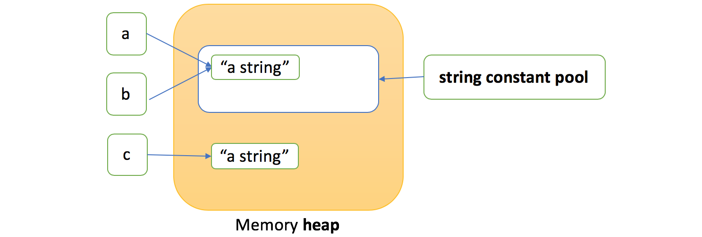

[TOC]

### 常用类

#### 1.包装类

##### 自动装箱/拆箱

- 基本类型都有对应的包装类型，基本类型与其对应的包装类型之间的赋值使用**自动装箱与拆箱**完成。
- 对象包器类为 **==final==不可变**，一旦构造就不能改变其包含的值。其内部基本数值类型是私有的，且声明为 final。
- 自动装箱过程是**编译器**自动在代码中插入一条对象装箱代码。拆箱也是如此。
- 每种包装类都有一个静态方法 valueOf(), 接收基本类型，返回引用类型，也有一个实例方法 xxxValue()，返回对应的基本类型。
- 6 种数值型的包装类有一个共同的父类 **Number** 类。

```java
/**
* byte 			Byte
* short			Short
* int			Integer
* long			Long
* float			Float
* double		Double
* char			Character
* boolean		Boolean
*/
// <>中不能写基本类型，需要写其对应的包装器类
ArrayList<Integer> list = new ArrayList<>();    
list.add(3);    
list.add(Integer.valueOf(3));   // 与上句等价，自动装箱
int n = list.get(i);    
int n = list.get(i).intValue(); // 与上句等价，自动拆箱
```

##### Integer类API

```java
int intValue();     // 以int形式返回Integer对象的值
static String toString(int i);
static String toString(int i, int radix);   // 以一个新String对象的形式返回给定数值i的radix进制参数表示。默认10进制。
static int parseInt(String s);
static int parseInt(String s, int radix);   // 解析字符串参数对应的整数，第二个参数为进制
```

##### ==缓存池==

new Integer(123) 与 Integer.valueOf(123) 的区别在于：

- new Integer(123) 每次都会**==新建==一个对象**；
- Integer.valueOf(123) 会使用**缓存池中的对象**，多次调用会取得**同一个对象**的引用。

```java
Integer x = new Integer(123);
Integer y = new Integer(123);
System.out.println(x == y);    // false
Integer z = Integer.valueOf(123);
Integer k = Integer.valueOf(123);
System.out.println(z == k);   // true
```

**valueOf() 方法**的实现比较简单，就是先判断值是否在**缓存池**中，如果在的话就直接返回缓存池的内容。Integer 是不可变的，所以缓存的对象可以安全的被共享。是一种==**享元模式**==的思想。

```java
public static Integer valueOf(int i) {
    if (i >= IntegerCache.low && i <= IntegerCache.high)
        return IntegerCache.cache[i + (-IntegerCache.low)];
    return new Integer(i);
}
```

在 Java 8 中，Integer 缓存池的大小==默认为 -128\~127==。

```java
static final int low = -128;    // 默认最小值
static final int high = 127;    // 默认最大值
static final Integer cache[];

static {
    // high value may be configured by property
    int h = 127;
    String integerCacheHighPropValue =
        sun.misc.VM.getSavedProperty("java.lang.Integer.IntegerCache.high");
    if (integerCacheHighPropValue != null) {
        try {
            int i = parseInt(integerCacheHighPropValue);
            i = Math.max(i, 127);
            // Maximum array size is Integer.MAX_VALUE
            h = Math.min(i, Integer.MAX_VALUE - (-low) -1);
        } catch( NumberFormatException nfe) {
            // If the property cannot be parsed into an int, ignore it.
        }
    }
    high = h;

    cache = new Integer[(high - low) + 1];
    int j = low;
    for(int k = 0; k < cache.length; k++)
        cache[k] = new Integer(j++);

    // range [-128, 127] must be interned (JLS7 5.1.7)
    assert IntegerCache.high >= 127;
}
```

编译器会在**自动装箱**过程调用 valueOf() 方法，因此多个值相同且值在缓存池范围内的 Integer 实例使用自动装箱来创建，那么就会引用**相同的对象**。下面 m, n 引用的是缓存中的相同的对象，因此可以直接用 == 比较。但是在 -128~127 区间外的不在缓存区内，**不能**直接用 == 判断比较，得用 equals() 方法。

```java
Integer m = 123;  // 123在缓存池中
Integer n = 123;
System.out.println(m == n); // true 
// 500不在缓存池中
Integer a = Integer.valueOf(500);
Integer b = Integer.valueOf(500);
System.out.println(a == b); 	// false
System.out.println(a.equals(b));// true
```

其他基本类型对应的**缓冲池**范围如下：

- boolean values true and false
- all byte values
- short values between -128 and 127
- int values between -128 and 127
- char in the range \u0000 to \u007F

在使用这些基本类型对应的包装类型时，就可以直接使用缓冲池中的对象。但是==只有Integer类可以修改默认的缓存范围==。在VM options加入参数：==-XX:AutoBoxChacheMax=7777==.就可以将最大缓存值设置为 7777.在此范围内的都可以用 == 进行是否相等判断。


##### Integer 与二进制算法

Integer 类有一些二进制操作，包括位翻转与循环移位等。

**位翻转**

Integer 的静态方法，可以进行位翻转。

```java
public static int reverse(int i);
public static int reverseBytes(int i);
```

位翻转就是将 int 当做二进制，左边的位与右边的位进行互换，reverse 是按照位进行互换，reverseBytes 是按 byte 进行互换。高效实现位翻转的基本思路是：首先交换相邻的单一位，然后以两位为一组，再交换相邻的位，接着4 位一组交换、然后 8 位一组、16位一组交换之后就完成了。


#### 2. String类

##### 概述

- String类对象为==不可变==字符串。优点：编译器可以让字符串**共享**。(可以想象各种字符串存放在公共的**存储池**中，字符串变量指向存储池中的位置)。
- 使用 equals() 方法来检验两个字符串是否**相等**。比较的是内容。一定不要用 “==” 比较字符串，此比较的是对象，完全可能有两个字符串对象的内容一样但是地址不同。
- 虚拟机中实际上只有**字符串常量**是共享的(final 修饰)，而 + 或 substring 等操作产生的结果通常并不是共享的。
- "" 是空串，也是一个对象，有自己的长度 (0) 和内容(空)。
- String 被声明为==final==，因此它不可被继承。

##### 源码分析

在 Java 8 中，String 内部使用 **char 数组**存储数据。

```java
public final class String
    implements java.io.Serializable, Comparable<String>, CharSequence {
    /** The value is used for character storage. */
    private final char value[];     // 声明为final不可变
}
```

在 Java 9 之后，String 类的实现改用 ==byte 数组==存储字符串，同时使用 `coder` 来标识使用了哪种编码。

```java
public final class String
    implements java.io.Serializable, Comparable<String>, CharSequence {
    /** 用数组存储实际的数据 */
    private final byte[] value;     

    /** The identifier of the encoding used to encode the bytes in {@code value}. */
    private final byte coder;
    
    priva int hash;
}
```

value 数组被声明为 final，这意味着 value 数组初始化之后就**不能再引用其它数组**。并且 String 内部没有改变 value 数组的方法，因此可以保证 String **不可变**。

String 类提供了很多看似修改的方法，实际上都是通过**创建新的String 对象**来实现的。

以下是 String 构造函数的源码，可以看到，在将一个**字符串对象**作为另一个字符串对象的构造函数参数时，并**不会完全复制** value 数组内容，而是都会**指向同一个 value 数组**。

```java
public String(String original) {
    this.value = original.value;    // value是String类中内部存放数据的final数组
    this.hash = original.hash;
}
```


##### 不可变的好处

**①. 可以缓存 hash 值** 

因为 String 的 hash 值经常被使用，例如 String 用做 **HashMap 的 key**。不可变的特性可以使得 hash 值也不可变，因此只需要进行**一次**计算。

**②. String Pool 的需要** 

如果一个 String 对象已经被创建过了，那么就会从 String Pool 中取得引用。只有 String 是不可变的，才可能使用 String Pool。一个存放 String 的池。

**③. 安全性** 

String 经常作为参数，String不可变性可以保证**参数不可变**。例如在作为网络连接参数的情况下如果 String 是可变的，那么在网络连接过程中，String 被改变，改变 String 对象的那一方以为现在连接的是其它主机，而实际情况却不一定是。

**④. ==线程安全==** 

String 不可变性天生具备==线程安全==，可以在多个线程中安全地使用。可共享。String类是 **immutable** 类，可以安全的在多线程中共享。


##### String Pool

字符串常量池（String Pool）保存着所有**字符串字面量**（literal strings），这些字面量在**编译时期**就确定。不仅如此，还可以使用 **String 的 ==intern()==** 方法在运行过程中**将字符串添加到 String Pool** 中。



当一个字符串调用 intern() 方法时，如果 String Pool 中已经存在一个字符串和该字符串**值相等**（使用 equals() 方法进行确定），那么就会返回 String Pool 中字符串的**引用**；否则，就会在 String Pool 中**添加**一个新的字符串，并返回这个新字符串的引用。

下面示例中，s1 和 s2 采用 new String() 的方式新建了两个不同字符串，而 s3 和 s4 是通过 s1.intern() 方法取得一个字符串引用。intern() 首先把 s1 引用的字符串放到 String Pool 中，然后返回这个字符串引用。因此 s3 和 s4 引用的是**同一个**字符串。

```java
String s1 = new String("aaa");
String s2 = new String("aaa");
System.out.println(s1 == s2);           // false
String s3 = s1.intern();                // 检查String Pool中没有"aaa"则添加进去
String s4 = s1.intern();                // 检查String Pool已经有了"aaa"则直接获取出来
System.out.println(s3 == s4);           // true 因为指向的是同一对象
```

如果是采用 "bbb" 这种**字面量**的形式创建字符串，会**==自动==地将字符串放入 String Pool 中**。

```java
String s5 = "bbb";
String s6 = "bbb";
System.out.println(s5 == s6);  // true
```

在 Java 7 之前，String Pool 被放在运行时常量池中，它属于永久代。而在 Java 7，String Pool 被移到==堆==中。这是因为永久代的空间有限，在大量使用字符串的场景下会导致 OutOfMemoryError 错误。


##### new String("abc")

使用这种方式一共会创建**两个字符串对象**（前提是 String Pool 中还没有 "abc" 字符串对象）。

- "abc" 属于字符串**字面量**，因此编译时期会在 **String Pool** 中创建一个字符串对象，指向这个 "abc" 字符串字面量；
- 而使用 new 的方式会在**堆中**创建一个字符串对象。

创建一个测试类，其 main 方法中使用这种方式来创建字符串对象。

```java
public class NewStringTest {
    public static void main(String[] args) {
        String s = new String("abc");
    }
}
```

```java
String name1 = "TestName";
String name2 = "TestName";
System.out.println(name1 == name2);	// true name1 name2指向同一对象
```

```java
String name1 = new String("TestName");
String name2 = new String("TestName");
System.out.println(name1 == name2);	// false name1 name2指向不同对象
System.out.println(name1.equals(name2));  // true
```

使用 javap -verbose 进行**反编译**，得到以下内容：

```java
// ...
Constant pool:
// ...
   #2 = Class              #18            // java/lang/String
   #3 = String             #19            // abc
// ...
  #18 = Utf8               java/lang/String
  #19 = Utf8               abc
// ...

  public static void main(java.lang.String[]);
    descriptor: ([Ljava/lang/String;)V
    flags: ACC_PUBLIC, ACC_STATIC
    Code:
      stack=3, locals=2, args_size=1
         0: new           #2                  // class java/lang/String
         3: dup
         4: ldc           #3                  // String abc
         6: invokespecial #4                  // Method java/lang/String."<init>":(Ljava/lang/String;)V
         9: astore_1
// ...
```

在 Constant Pool 中，#19 存储这字符串**字面量** "abc"，#3 是 String Pool 的字符串**对象**，它指向 #19 这个字符串字面量。在 main 方法中，0: 行使用 new #2 在堆中创建一个字符串对象，并且使用 ldc #3 将 String Pool 中的字符串对象作为 String 构造函数的参数。


##### String类 API

- 所有已实现的接口：

```java
Serializable, CharSequence, Comparable<String>
```

- 构造方法

```java
String()  				// 初始化一个新创建的 String 对象，使其表示一个空字符序列
String(byte[] bytes) 	 // 通过使用平台的默认字符集解码指定的 byte 数组，构造一个新的 String
String(byte[] bytes, String charsetName) // 通过使用指定的 charset 解码指定的 byte 数组，构造一个新的 String
String(char[] value) 	 // 使用字符数组(char[])创建String对分配一个新的String 
String(StringBuffer buffer) 	// 分配一个新的字符串，它包含字符串缓冲区参数中当前包含的字符序列
String(StringBuilder builder) 	// 分配一个新的字符串，它包含字符串生成器参数中当前包含的字符序列
```

- 字符串的长度，判断字符串是否为空字符串。

```java
boolean isEmpty() // 当且仅当 length() 为 0 时返回 true
int length()      // 返回此字符串的长度
```

- 判断该字符串中是否包含指定的字符串，获取字符

```java
boolean contains(CharSequence s) 	// 当且仅当此字符串包含指定的char值序列时，返回 true
```

- 返回指定索引处的字符值：

```java
char charAt(int index) 	// 返回指定索引处的 char 值
```

- 字符串连接：

```java
String concat(String str)  	// 将指定字符串连接到此字符串的结尾
```

- 从前向后扫描，返回字符或者字符串参数在该字符串中第一次出现的索引：

```java
int indexOf(int ch) 		// 返回指定字符在此字符串中第一次出现处的索引
int indexOf(String str)   	// 返回指定子字符串在此字符串中第一次出现处的索引
int indexOf(int ch, int fromIndex) 	// 返回在此字符串中第一次出现指定字符处的索引，从指定的索引开始搜索
int indexOf(String str, int fromIndex) // 返回指定子字符串在此字符串中第一次出现处的索引，从指定的索引开始
```

- 从后向前扫描，返回字符或字符串参数在该字符串中第一次出现的索引：

```java
int lastIndexOf(int ch) 		// 返回指定字符在此字符串中最后一次出现处的索引
int lastIndexOf(String str)  	// 返回指定子字符串在此字符串中最右边出现处的索引 
int lastIndexOf(int ch, int fromIndex) 	// 返回指定字符在此字符串中最后一次出现处的索引，从指定的索引处开始进行反向搜索
int lastIndexOf(String str, int fromIndex) // 返回指定子字符串在此字符串中最后一次出现处的索引，从指定的索引开始反向搜索
```

- 获取该字符串的一部分子字符串：

```java
String substring(int beginIndex) 			// 返回一个新的字符串，它是此字符串的一个子字符串
String substring(int beginIndex, int endIndex) // 返回一个新字符串，它是此字符串的一个子字符串
// 这个方法经常与上面两个方法String.lastIndexOf()和String.indexOf()方法一起使用，使用这两个方法查找分割的位置，然后再使用String.subString()方法进行分割
```

- 获取该字符串的一部分，以字符序列返回：

```java
CharSequence subSequence(int beginIndex, int endIndex) // 返回一个新的字符序列，它是此序列的一个子序列
```

- 重写Object的方法：

```java
boolean equals(Object anObject) // 将此字符串与指定的对象比较
int hashCode()                  // 返回此字符串的哈希码
String toString()               // 返回此对象本身（它已经是一个字符串！）
```

- 实现 comparable 接口的比较方法：

```java
int compareTo(String anotherString)  // 按字典顺序比较两个字符串 
```

- 连接得到字符串

```java
static String join(CharSequence delimiter, CharSequence... elements)      // 在后面的每个字符串之间插入第一个字符串
String all = String.join("/", "a", "b", "c");  // all = "a/b/c";
```

- 不按大小写的比较方法

```java
int compareToIgnoreCase(String str)  // 按字典顺序比较两个字符串，不考虑大小写 
boolean equalsIgnoreCase(String anotherString) // 将此 String 与另一个 String 比较，不考虑大小写
```

- 基本类型：int, long, float, double, char, char数组，Object(对象)转换成 String 的方法:String.valueOf(xxx)

```java
static String valueOf(int i)        // 返回 int 参数的字符串表示形式
static String valueOf(long l)       // 返回 long 参数的字符串表示形式
static String valueOf(float f)      // 返回 float 参数的字符串表示形式
static String valueOf(double d)     // 返回 double 参数的字符串表示形式
static String valueOf(boolean b)    // 返回 boolean 参数的字符串表示形式
static String valueOf(char c)       // 返回 char 参数的字符串表示形式
static String valueOf(char[] data)  // 返回 char 数组参数的字符串表示形式
static String valueOf(Object obj)   // 返回 Object 参数的字符串表示形式
static String valueOf(char[] data, int offset, int count) // 返回 char 数组参数的特定子数组的字符串表示形式
```

- 把 String 字符串转换为字节数组：

```java
byte[] getBytes() // 使用平台的默认字符集将此 String 编码为 byte 序列，并将结果存储到一个新的 byte 数组中
byte[] getBytes(Charset charset)  	// 使用给定的 charset 将此 String 编码到 byte 序列，并将结果存储到新的 byte 数组	
byte[] getBytes(String charsetName)// 使用指定的字符集将此 String 编码为 byte 序列，并将结果存储到一个新的 byte 数组中
```

- 对 String 中所有的字符都进行大小写转换：

```java
String toLowerCase()   	// 使用默认语言环境的规则将此 String 中的所有字符都转换为小写
String toUpperCase()  		// 使用默认语言环境的规则将此 String 中的所有字符都转换为大写
String toLowerCase(Locale locale)  // 使用给定 Locale 的规则将此 String 中的所有字符都转换为小写
String toUpperCase(Locale locale)  // 使用给定 Locale 的规则将此 String 中的所有字符都转换为大写
```

- 判断该字出发是否匹配给定的正则表达式:

```java
boolean matches(String regex)  // 告知此字符串是否匹配给定的正则表达式
```

- 使用正则表达式分割该字符串为字符串数组：

```java
String[] split(String regex)   // 根据给定正则表达式的匹配拆分此字符串
String[] split(String regex, int limit)  // 根据匹配给定的正则表达式来拆分此字符串 
 // 注意，获取的数组中不包含作为分割符的字符(或字符串)
```

- 判断字符串的前缀后缀：

```java
boolean startsWith(String prefix)  // 测试此字符串是否以指定的前缀开始
boolean startsWith(String prefix, int toffset) // 测试此字符串从指定索引开始的子字符串是否以指定前缀开
boolean endsWith(String suffix)    // 测试此字符串是否以指定的后缀结束
```

- 该字符串与指定的字符序列或者 StringBuffer 比较

```java
boolean contentEquals(CharSequence cs) // 将此字符串与指定的 CharSequence 比较
boolean contentEquals(StringBuffer sb) // 将此字符串与指定的 StringBuffer 比较 
```

- 把字符数组转换成 String

```java
static String copyValueOf(char[] data) // 返回指定数组中表示该字符序列的 String
static String copyValueOf(char[] data, int offset, int count) // 返回指定数组中表示该字符序列的 String
```

- 把该字符串中的字符拷贝到指定的字符数组中去

```java
void getChars(int srcBegin, int srcEnd, char[] dst, int dstBegin) // 将字符从此字符串复制到目标字符数组
```

- 把该字符串转换成字符数组

```java
char[] toCharArray() // 将此字符串转换为一个新的字符数组
```

- 使用新字符替换字符串中的旧字符

```java
String replace(char oldChar, char newChar) // 返回一个新的字符串，用newChar替换此字符串中所有的oldChar得到
String replace(CharSequence target, CharSequence replacement) // 使用指定的字面值替换序列替换此字符串所有匹配字面值目标序列的子字符串
```

- 使用新子字符串替换该字符串中匹配正则表达式的那些旧子字符串：一个全部替换，一个只替换第一个

```java
// 使用给定的 replacement 替换此字符串所有匹配给定的正则表达式的子字符串 
String replaceAll(String regex, String replacement) 
// 使用给定的 replacement 替换此字符串匹配给定的正则表达式的第一个子字符串    
String replaceFirst(String regex, String replacement) 
```

- 把该字符串规范化表示，去掉该字符串的前后空白符：

```java
String intern()    // 返回字符串对象的规范化表示形式 放到常量池
String trim()      // 返回字符串的副本，忽略前导空白和尾部空白。中间不去
```

- Unicode代码点相关：

```java
int codePointAt(int index) 	// 返回指定索引处的字符（Unicode 代码点）
int codePointBefore(int index) // 返回指定索引之前的字符（Unicode 代码点）
int codePointCount(int beginIndex, int endIndex) // 返回此String的指定文本范围中的 Unicode 代码点数
int offsetByCodePoints(int index, int codePointOffset) // 返回此 String 中从给定的 index 处偏移 codePointOffset 个代码点的索引
```

- 格式化字符串：

```java
static String format(Locale l, String format, Object... args) // 使用指定的语言环境、格式字符串和参数返回一个格式化字符串
static String format(String format, Object... args) // 使用指定的格式字符串和参数返回一个格式化字符串
```

- 判断该字符串的子字符串是否相等：

```java
boolean regionMatches(boolean ignoreCase, int toffset, String other, int ooffset, int len) // 测试两个字符串区域是否相等
boolean regionMatches(int toffset, String other, int ooffset, int len) // 测试两个字符串区域是否相等
```


##### StringBuilder/StringBuffer类

- 字符串修改较为频繁时使用，StringBuilder 与 StringBuffer 实现几乎相同，只是StringBuilder 线程不安全（不能同步访问）， StringBuffer 线程安全。由于 StringBuilder 相较于 StringBuffer 有速度优势，**所以多数情况下建议使用 StringBuilder 类**。然而在应用程序要求线程安全的情况下，则必须使用 StringBuffer 类。
- 修改时不产生新的未使用变量。
- 继承体系如下图所示


- **基本原则**：如果要操作少量的数据，用 String ；单线程操作大量数据，用 StringBuilder ；多线程操作大量数据，用 StringBuffer。


**String, StringBuffer and StringBuilder对比**

**1. 可变性** 

- String 不可变
- StringBuffer 和 StringBuilder 可变

**2. 线程安全** 

- String 不可变，因此是**线程安全**的
- StringBuilder 不是线程安全的
- StringBuffer 是线程安全的，内部使用 **synchronized** 进行同步，所以速度慢


#### 4. ==Arrays类==

##### 概述

- 创建一个数字数组时，所有元素初始化为 0。boolean 数组的元素初始化为 false。对象数组的**元素**则初始化为 **null**，因此需要对每个对象进行对象引用才行，否则使用时会有 NPE 异常。
- **一旦创建**数组就**不能改变其大小**，但可以改变元素。
- 数组拷贝：允许一个数组变量拷贝给另一个数组变量。两个变量将指向同一个数组。一个操作会==**影响**==另一个。
- 如果希望把一个数组的**全部值**拷贝到一个新数组里，可使用 Arrays 类的 **copyOf()** 方法。
- 使用 **Arrays.sort()** 方法对数值型数组排序，使用的是**快速排序**算法。

```java
int[] a = new int[3];     // 创建新的数字数组 自动初始化为0
int[] b = {1, 2, 3, 4}    // 创建并初始化数组

a.length                  // 数组长度，不加方法的括号
    
for(int element : a){}    // 使用for each遍历可以不关注下标

String[] args   // 命令行参数
java Test -g ruler test     // args[0] = "-g"  args[1] = "ruler"  args[2] = "test"

Arrays.sort(b);  // 对数组b进行排序，排序结果就在b里面，会把原数组打乱
```


##### Arrays类的API

```java
String static toString(type[] b);   	    // 将数组中的元素拼接成一个字符串 [1, 2, 3, 4]
type static valueOf(type[] a, int length);  // 将数据按照传入的长度拷贝到一个新的数组中
type static copyOfRange(type[] a, int start, int end);  // 将源数组按照传入的开始位置和结束位置拷贝到一个新的数组中;
static void sort(type[] a);     			// 将源数组按照优化的快速排序法进行排序
static int binarySearch(type[] a, type v);   //  在整个数组中按照二分查找法查找数据，查找成功返回下标，否则返回-1
static int binarySearch(type[] a, int start, int end, type v);  // 在整个数组中按照二分查找法从传入的开始位置和结束位置查找数据，查找成功返回下标，否则返回-1
static void fill(type[] a, type v);     	// 将数组中的所有元素值都设置为v
static boolean equals(type[] a, type[] b);  // 如果两个数组的长度和每个元素值都相等，那么返回true,否则返回false

String static deepToString(type[] a);   	    // 将二维数组拼接为字符串形式
int[][] magicSquare = {{1, 2}, {3, 4}, {5, 6}}; // 定义一个二维数组
String s = Arrays.deepToString(magicSquare);    // 将二维数组转字符串
// s = "[[1, 2], [3, 4], [5, 6]]";
String[] a = {"11", "22", "33"};		
List<String> stringList = Arrays.asList(a);	// 将字符串数组转换为列表
int[] b = {1, 2, 3, 4}    // 创建并初始化数组
int[] copyb = Arrays.copyOf(b, b.length);   // 将数组b全部重新拷贝给另一个数组两者指向不同。第二个参数为长度。
```


#### 5. ==Object类==

重点！

##### 概览

Object 类的API（面试题：问有哪些方法？）

```java
public final native Class<?> getClass();  // 返回此Object的运行类
public native int hashCode()	// 用于获取对象的哈希值 不覆写就默认返回对象的存储地址
public boolean equals(Object obj)	// 用于确认两个对象是否“相同”
protected native Object clone() throws CloneNotSupportedException	// 创建并返回此对象的一个副本
public String toString()	// 不覆写则默认为：类名@hashCode
public final native Class<?> getClass()
protected void finalize() throws Throwable {}	// 当垃圾回收器确定不存在对该对象的更多引用时，由对象的垃圾回收器调用此方法
public final native void notify()	// 唤醒在此对象监视器上等待的单个线程 
public final native void notifyAll()	// 唤醒在此对象监视器上等待的所有线程
public final native void wait(long timeout) throws InterruptedException  // 在其他线程调用此对象的notify()方法或notifyAll()方法，或者超过指定的时间量前，导致当前线程等待。 
public final void wait(long timeout, int nanos) throws InterruptedException
public final void wait() throws InterruptedException // 用于让当前线程失去操作权限，当前线程进入等待序列
```

native: Java关键字，Native Method 用以修饰**非 Java 代码实现**的方法(C || C++)， 类似 Java 调用非 Java 代码的接口。


##### equals()

**1. 等价关系** 

① 自反性

```java
x.equals(x); 	// true
```

② 对称性

```java
x.equals(y) == y.equals(x); // true
```

③ 传递性

```java
if (x.equals(y) && y.equals(z))
    x.equals(z);  // true;
```

④ 一致性

多次调用 equals() 方法结果不变

```java
x.equals(y) == x.equals(y); // true
```

⑤ 与 null 的比较

对任何不是 null 的对象 x 调用 x.equals(null) 结果都为 false

```java
x.equals(null); // false;
```

**2. 等价与相等** 

- 对于基本类型，== 判断两个值是否**相等**，基本类型没有 equals() 方法。
- **对于引用类型，== 判断两个变量是否引用同一个对象，而 equals() 判断引用的对象是否等价。**

```java
Integer x = new Integer(1);
Integer y = new Integer(1);
System.out.println(x.equals(y));  // true 等价
System.out.println(x == y);       // false 对象相等
Integer m = 1;
Integer n = 1;
System.out.println(m == n);  	 // true 注意赋值方法，此处m n的值均从Integer的缓存池中获取
```

**3. 实现**

- 检查是否为同一个对象的引用，如果是直接返回 true；
- 检查是否是同一个类型，如果不是，直接返回 false；
- 将 Object 对象进行转型；
- 判断每个关键域是否相等。

```java
public class EqualExample {

    private int x;
    private int y;
    private int z;

    public EqualExample(int x, int y, int z) {
        this.x = x;
        this.y = y;
        this.z = z;
    }
    
    // 覆写equals()方法
    @Override
    public boolean equals(Object o) {
        if (this == o) return true;
        if (o == null || getClass() != o.getClass()) return false;

        EqualExample that = (EqualExample) o;

        if (x != that.x) return false;
        if (y != that.y) return false;
        return z == that.z;
    }
}
```

- Object类中的equals方法用于检测一个对象是否等于另一个对象，判断两个对象是否具有相同的引用。
- equals 方法的特性：**自反性、对称性、传递性、一致性**。

写出**完美equals方法**的建议（源自 JavaCore）：

- 显示参数命名为 otherObject，之后转换为一个叫 other 的变量。
- 检测 this 与 otherObject 是否引用同一对象。
- 检测 otherObject 是否为 null。
- 比较 this 与 otherObject 是否属于同一个类。
- 将 otherObject 转换为相应的类类型变量。
- 现在开始对所有需要比较的域进行比较。使用==比较基本类型域，使用 equals 比较对象域。

```java
// 以下是Employee类的equals方法
public boolean equals(Object otherObject){
    if(this == otherObject) return true;    // 检测this与otherObject是否引用同一对
    if(otherObject == null) return false;   // 检测otherObject是否为null
    // 比较this与otherObject是否属于同一个类
    if(getClass() != otherObject.geClass()) return false;
    Employee other = (Employee) otherObject;    // 将otherObject转换为相应的类类型变量
    // 现在开始对所有需要比较的域进行比较。使用 == 比较基本类型域，使用equals比较对象域。
    return Object.equals(name, other.name) && salary == other.salary && Objects.equals(hireDay, other.hireDay);
}
```


##### hashCode()

hashCode() 返回**散列值**，而 equals() 是用来判断两个对象是否**等价**。**等价的两个对象散列值一定相同**，但是散列值相同的两个对象不一定等价。散列值是由对象导出的一个**整形值**。

每个对象都有一个**默认的散列码**，其值为对象的**存储地址**。如果对象不重写该方法，Object 类的 hashCode 方法就返回对象的存储地址。

在覆写 equals() 方法时应当总是覆写 hashCode() 方法，保证等价的两个对象散列值也相等，一般两个需要**同时**覆写。

下面的代码中，新建了**两个等价**的对象，并将它们添加到 HashSet 中。我们希望将这两个对象当成一样的，只在集合中添加一个对象，但是因为 EqualExample **没有实现** hasCode() 方法，因此这两个对象的散列值是**不同**的，最终导致集合添加了两个等价对象。

```java
EqualExample e1 = new EqualExample(1, 1, 1);	// 因为上述的只是覆写了equals()
EqualExample e2 = new EqualExample(1, 1, 1);    // 没有覆写 hashCode()
System.out.println(e1.equals(e2));   		    // true
HashSet<EqualExample> set = new HashSet<>();
set.add(e1);
set.add(e2);
System.out.println(set.size());   // 2
```

==**必须同时覆写 equals() 和 hashCode() 方法！**==如果重新定义类中的 equals 方法，就必须**重新**定义 hashCode 方法。因为两种定义必须一致：如果 x.equals(y) 返回 **true**，那么 x.hashCode() 就必须与 y.hashCode() 具有**相同的值**。

理想的散列函数应当具有**均匀性**，即不相等的对象应当均匀分布到所有可能的散列值上。这就要求了散列函数要把所有域的值都考虑进来。可以将每个域都当成 R 进制的某一位，然后组成一个 R 进制的整数。**R 一般取 31**，因为它是一个**奇素数**，如果是**偶数**的话，当出现**乘法溢出，信息就会丢失**，因为与 2 相乘相当于向左移一位。

一个数与 31 相乘可以转换成移位和减法：`31*x == (x<<5)-x`，编译器会自动进行这个优化。

```java
// 覆写 hashCode() 方法
@Override
public int hashCode() {
    int result = 17;
    // xyz为类的实例变量
    result = 31 * result + x;
    result = 31 * result + y;
    result = 31 * result + z;
    return result;
}
```

```java
// 一个简单的覆写hashCode方法
@Override
public int hashCode() {
	return Objects.hash(firstName, lastName);   // 传入多个对象到hash()返回hashCode
}
```

上述方法借用了 Objects 这个工具类。


- Hashtable 实现一个哈希表，为了成功地在哈希表中存储和检索对象，用作键的对象必须实现 hashCode 方法和 equals 方法。因为哈希表通过 hashCode 检索对象。


##### toString()

该方法默认返回 ToStringExample@4554617c 这种形式，其中 @ 后面的数值为 **hashCode 散列码**的无符号十六进制表示，@前面为类名。

```java
public class ToStringExample {
    private int number;
    public ToStringExample(int number) {
        this.number = number;
    }
}
```

```java
ToStringExample example = new ToStringExample(123);
System.out.println(example.toString());
```

```html
ToStringExample@4554617c    // 类名@地址值(默认的hashCode)
```

- 建议每个类都覆写 toString() 方法。方便调试。
- 静态的 Arrays.toString() 方法可以直接**打印数组**（内部已经覆写了该方法）。打印多维数组使用 Arrays.deepToString() 方法。

```java
System.out.print(System.out);
java.io.PrintStream@2f6684      // 输出类名和HashCode

int[] a = {1, 2, 3};
Arrays.toString(a);             // [1, 2, 3]    Arrays类已经覆写了toString()
```


##### clone()

- 是 **protected** 的方法。
- 详细用法见接口章节中的 Cloneable 接口。


#### 100. 其他类

##### BigDecimal / BigInteger 类

BigInteger 和 BigDecimal 类可以处理**任意长度**数字序列的数值，用于**精确计算**。

BigInteger不是基本数据类型之一，是一个类，然而它的初始化方式却没有 String 那么方便可以直接赋值，而是需要调用它的**构造器**进行初始化。

BigInger(String val) 这个构造器，可以直接将十进制的**字符串**格式变成大整数。

既然不是基本数据类型，所以大数的加减乘除也**不能**使用 +、-、*、/ 这些运算符号，Java也没有对这些运算符号进行重定义，取而代之的是用一些方法来代替，比如 add()、subtract()、mutiply()、divide() 这四种方法。

```Java
BigInteger a = BigInteger.valueOf(100);
// API BigInteger和BigDecimal 的方法类似
BigInteger abs()                    // 返回大整数的绝对值
BigInteger add(BigInteger val)      // 返回两个大整数的和
BigInteger divide(BigInteger val)   // 返回两个大整数的商
float floatValue()                  // 返回大整数的float类型的值
int intValue()                      // 返回大整数的整型值
long longValue()                    // 返回大整数的long型值
BigInteger max(BigInteger val)      // 返回两个大整数的最大者
BigInteger min(BigInteger val)      // 返回两个大整数的最小者
BigInteger mod(BigInteger val)      // 用当前大整数对val求模
BigInteger multiply(BigInteger val) // 返回两个大整数的积
BigInteger pow(int exponent) 返回当前大整数的exponent次方
BigInteger remainder(BigInteger val) 返回当前大整数除以val的余数
BigInteger subtract(BigInteger val)返回两个大整数相减的结果
String toString() 将当前大整数转换成十进制的字符串形式
```


##### Random 类

###### Random 类概述

- Random 类位于 java.util 包中，主要用于生成**伪随机数**。

- Random 类将 种子数 作为随机算法的起源数字，计算生成伪随机数，其与生成的随机数字的区间无关

- 创建 Random 实例时，若没有指定种子数，则会以**当前时间**作为种子数，来计算生成伪随机数。

- 拥有相同种子的 Random 实例，在相同次数下，生成的伪随机数完全相同

```java
Random random1 = new Random(10);
Random random2 = new Random(10);
System.out.println(random1.nextInt()); // -1157793070
System.out.println(random2.nextInt()); // -1157793070
```

- Random 类是**线程安全**的，多个线程可以同时使用一个Random 实例对象，不过如果并发性很高，会产生**竞争**，这是可以考虑使用多线程库中的 ==**ThreadLocalRandom**==类。

###### Random 类的常用方法

**random.nextBoolean()**

- 用于从该随机数生成器的序列中得到下一个伪均匀分布的 boolean 值

    ```java
    Random random = new Random();
    System.out.println(random.nextBoolean()); // true
    ```

**random.nextBytes()**

- 用于生成随机 byte 值并将其放入用户提供的 byte 数组中

- 生成的随机 byte 数等于 byte 数组的长度

```java
Random random = new Random();
byte[] data = new byte[5];
random.nextBytes(data);
System.out.println(Arrays.toString(data)); // [29, 73, -58, -60, -101]
```

**random.nextInt()**

- 用于从该随机数生成器的序列中得到下一个伪均匀分布的 int 值

    ```java
    Random random = new Random();
    System.out.println(random.nextInt()); // 1414623307
    ```

**random.nextInt(int bound)**

- 用于从该随机数生成器的序列中得到下一个 0 到结束值之间伪均匀分布的 int 值，**[0, 结束值)**

```java
Random random = new Random();
System.out.println(random.nextInt(10)); // 5
```


