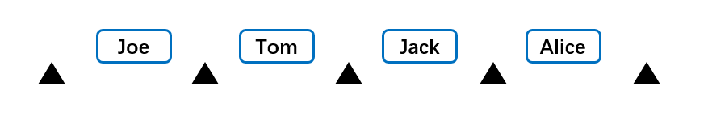
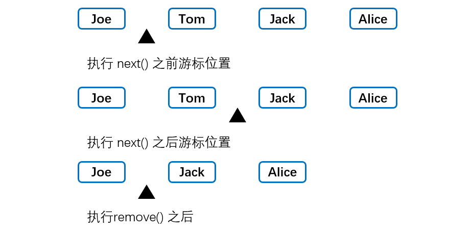

[TOC]

### 常用接口


#### 1. Comparable 接口

- **Arrays.sort()** 方法可以对==对象数组==排序，但是要求对象所属的类必须实现了==Comparable接口==。
- Comparable 接口

```java
public interface Comparable<T> {
    // 用这个对象与other进行比较，如果这个对象小于other则返回负值，相等返回0，大于other则返回正值
    int compareTo(T other);     // parameter has type T 已经为泛型接口
}
```

使用泛型 Comparable 接口可提供类型参数。

```java
Class Employee implements Comparable<Employee> {    // 传入类型参数
    // 实现接口中的方法
    @Override
    public int compareTo(Employee other){   
        return Double.compare(salary, other.salary);    
    }
}
```

排序测试

```java
Employee[] staff = new Employee[3];     // 对象数组

staff[0] = new Employee("Harry Hacker", 35000);
staff[1] = new Employee("Carl Cracker", 75000);
staff[2] = new Employee("Tony Tester", 38000);

Arrays.sort(staff);     // 使用Arrays类方法进行排序，底层采用快排排序

// 打印排序后的结果
for (Employee e : staff){
    System.out.println("name=" + e.getName() + ",salary=" + e.getSalary());
}
```


#### 2.  Comparator 接口

- 注意对比上一节。
- **Arrays.sort()** 方法可以对实现了 Comparable 接口的类对象的数组进行排序。
- Arrays.sort() 方法还有第二种形式，即传入**一个对象数组和一个比较器**作为参数。**比较器**是实现了Comparator 接口的类的实例。
- 比较 Comparator 接口和 Comparable 接口

```java
public interface Comparator<T> {
    int compare(T first, T second);     // 比较方法
}

public interface Comparable<T> {
    int compareTo(T other);     // parameter has type T 为泛型接口
}
```

Comparator 接口使用示例

```Java
// 实现一个长度比较器类
class LengthComparator implements Comparator<String> {
    public int compare(String first, String second){    // 实现接口方法
        return first.lenth - second.length();
    }
}

// 一般使用
Comparator<String> comp = new LengthComparator();
if(comp.compare(words[i], words[j]) > 0){...}

// 在Arrays.sort()中使用
String[] names = {"Bob", "Jack", "Alice"};
// 传入一个待排序的数组和一个比较器对象
Arrays.sort(names, new LengthComparator());
```


#### 3. Cloneable 接口(对象克隆)

##### ① Cloneable 接口与 Clone 方法

clone() 是 Object 的 **protected** 方法，它不是 public，一个类不显式去重写 clone()，其它类就**不能直接去调用**该类实例的 clone() 方法。

```Java
public class CloneExample {
    private int a;
    private int b;
}
```

```java
CloneExample e1 = new CloneExample();
// CloneExample e2 = e1.clone(); // 'clone()' has protected access in  'java.lang.Object' 不能直接通过简单对象访问
```

**重写 Clone 方法**例子如下（事情哪有这么简单）：

```java
public class CloneExample {
    private int a;
    private int b;

    // 仅覆写clone()方法没有实现了Cloneable接口
    @Override
    public CloneExample clone() throws CloneNotSupportedException {
        return (CloneExample)super.clone();
    }
}
```

```java
CloneExample e1 = new CloneExample();
try {
    CloneExample e2 = e1.clone();       // 尝试克隆
} catch (CloneNotSupportedException e) {
    e.printStackTrace();
}
```

```java
java.lang.CloneNotSupportedException: CloneExample      // 上述结果抛出异常
```

以上抛出了 **CloneNotSupportedException**，这是因为 CloneExample **没有**实现 ==**Cloneable 接口**==。

应该注意的是，clone() 方法并不是 Cloneable 接口的方法，而是 Object 的一个 protected 方法。Cloneable 接口只是规定，**如果一个类没有实现 ==Cloneable 接口==又调用了 clone() 方法，就会抛出 CloneNotSupportedException**。以下是实现 Cloneable 接口便可以克隆了。

**要克隆必须实现 Cloneable 接口然后再覆写 clone() 方法。**

即使 clone 默认的(浅拷贝)实现能够满足要求，还是需要实现 Cloneable 接口，并将 clone 重新定义为**public**，再调用 super.clone()。

```java
// 实现Cloneable接口
public class CloneExample implements Cloneable {
    private int a;
    private int b;

    // 覆写clone()方法
    @Override
    public Object clone() throws CloneNotSupportedException {
        return super.clone();   // 实现了Cloneable接口才能使用超类的clone方法
    }
}
```

Cloneable 接口其实**不含任何方法**，成为**标记接口**。其作用在于允许在类型查询中使用 instanceof 方法，如果没有这个标记接口而使用 clone 方法就会像上面抛出异常。

##### ② 浅拷贝

对于浅拷贝，**拷贝对象和原始对象的引用类型引用同一个对象**。也就是两个对象会有==共享的子对象==。String 等**不可变**的对象即使是浅拷贝也是安全的。**clone() 方法默认是浅拷贝的**。

实例代码如下：

```java
public class ShallowCloneExample implements Cloneable {

    private int[] arr;      // 可变类，浅拷贝会造成原对象与拷贝后的对象对此子对象域共享 
    private int index;      // 基本类型没问题
    private String name;    // String 等不可变类就算共享也安全 因为不可变

    public ShallowCloneExample() {
        arr = new int[10];
        for (int i = 0; i < arr.length; i++) {
            arr[i] = i;
        }
    }

    public void set(int index, int value) {
        arr[index] = value;
    }

    public int get(int index) {
        return arr[index];
    }
	
    // 覆写克隆方法
    @Override
    public ShallowCloneExample clone() throws CloneNotSupportedException {
        return (ShallowCloneExample) super.clone();
    }
}
```

测试代码

```java
ShallowCloneExample e1 = new ShallowCloneExample();
ShallowCloneExample e2 = null;
try {
    e2 = e1.clone();
} catch (CloneNotSupportedException e) {
    e.printStackTrace();
}
e1.set(2, 222);     			// 改变e1，e2中的arr[]也被改变了。因为浅拷贝使两者共享此子对象
System.out.println(e2.get(2));  // 222
```

##### ==③ 深拷贝==

- 深拷贝：拷贝对象和原始对象的**引用类型引用不同对象**。重新定义 **clone** 方法来同时克隆**所有子对象**。全部子对象的状态都拷贝了一份。
- 可以先用默认的 clone() 方法去克隆一个对象，然后再克隆该对象的**全部可变类子类**的内容。

深拷贝实例代码

```java
public class DeepCloneExample implements Cloneable {
	// 可变属性 浅拷贝导致共享
    private int[] arr;      

    public DeepCloneExample() {
        arr = new int[10];
        for (int i = 0; i < arr.length; i++) {
            arr[i] = i;
        }
    }

    // 重写了一个实现了深拷贝的clone方法
    @Override
    public DeepCloneExample clone() throws CloneNotSupportedException {
        DeepCloneExample result = (DeepCloneExample) super.clone(); // 先默认方法克隆一个对象
        // 再克隆该对象的全部可变类子类的内容
        result.arr = new int[arr.length];
        for (int i = 0; i < arr.length; i++) {
            result.arr[i] = arr[i];
        }
        return result;  // 返回克隆好的对象
    }

    public void set(int index, int value) {
        arr[index] = value;
    }

    public int get(int index) {
        return arr[index];
    }
}
```

```java
DeepCloneExample e1 = new DeepCloneExample();
DeepCloneExample e2 = null;
try {
    e2 = e1.clone();    // 克隆e1
} catch (CloneNotSupportedException e) {
    e.printStackTrace();
}
e1.set(2, 222);         // 设置e1
System.out.println(e2.get(2));      // 深拷贝后e2不受影响
```


##### ④ clone() 的替代方案

使用 clone() 方法来拷贝一个对象即复杂又有风险，它会抛出异常，并且还需要类型转换。Effective Java 书上讲到，最好不要去使用 clone()，**可以使用拷贝构造方法或者拷贝工厂来拷贝一个对象**。即自己实现一个用于拷贝原对象的构造方法。

```java
// 不使用Cloneable接口的拷贝
public class CloneConstructorExample {

    private int[] arr;  

    // 默认构造方法
    public CloneConstructorExample() {
        arr = new int[10];
        for (int i = 0; i < arr.length; i++) {
            arr[i] = i;
        }
    }
    
    // 实现一个可以进行深拷贝的构造方法 传入需要拷贝的原对象
    public CloneConstructorExample(CloneConstructorExample original) {
        arr = new int[original.arr.length];
        for (int i = 0; i < original.arr.length; i++) {
            arr[i] = original.arr[i];
        }
    }

    public void set(int index, int value) {
        arr[index] = value;
    }

    public int get(int index) {
        return arr[index];
    }
}
```

```java
CloneConstructorExample e1 = new CloneConstructorExample();     // 构造e1
CloneConstructorExample e2 = new CloneConstructorExample(e1);   // 拷贝e1
e1.set(2, 222);
System.out.println(e2.get(2));      // 2 实现深拷贝
```


##### ==⑤ 数组与拷贝==

所以**数组类型**都有一个 public 的 clone 方法（已经覆写了？），而不是 protected ，可以使用这个方法建立一个完全**新的**数组，包含原数组的副本。

```javascript
int[] numbers = {2, 3, 4};
int[] cloned = number.clone();
cloned[1] = 12;     // numbers数组不受影响
```


#### 4. 迭代接口

迭代器（iterator）让我们能够从第一项开始完整**遍历**一个数据集合。一个迭代周期内，每个数据项都被访问一次。

##### ① Iterable 接口

```java
public interface Iterable<T> {
    /**
     * 返回一个迭代器 ※
     */
    Iterator<T> iterator();

    /**
     * 默认实现
     */
    default void forEach(Consumer<? super T> action) {
        Objects.requireNonNull(action);
        for (T t : this) {
            action.accept(t);
        }
    }

    default Spliterator<T> spliterator() {
        return Spliterators.spliteratorUnknownSize(iterator(), 0);
    }
}
```

实现了此接口的类可以返回一个 **Iterator 迭代器对象**，可以进行迭代操作。


##### ② Iterator 接口

```java
public interface Iterator<E> {
    /**
    * 是否含有下一个元素
    */    
    boolean hasNext();

    /**
    * 返回下一个元素
    */
    E next();

    /**
     * 删除一个元素
     */
    default void remove() {
        throw new UnsupportedOperationException("remove");
    }

    /**
     * 默认实现方法
     */
    default void forEachRemaining(Consumer<? super E> action) {
        Objects.requireNonNull(action);
        while (hasNext())
            action.accept(next());
    }
}
```

共4个方法，常用是前三个。

迭代器对象内部有一个**游标**，如下图所示的集合。集合有 N 个元素，则游标可能出现在 N + 1 个位置。



方法 **hasNext**() 返回游标后面**是否还有元素**，方法 **next()** 返回游标后的一个元素，并将**游标后移**；方法 **remove**() 将删除==**最后一次调用**== **next**() 方法时返回的项。




**==不能同时连续两次调用==** remove() 方法，因为调用之前必须要调用 **next()** 方法==**移动游标**==才行，否则抛UnsupportedOperationException异常。一般操作如下。

```java
// String类型的迭代器
Iterator<String> nameIterator = nameList.iterator();
while(nameIterator.haseNext()) {
    System.out.println(nameIterator.next());
}
```


##### ③ ListIterator 接口

| 方法          | 功能                               |
| :------------ | :--------------------------------- |
| hasNext()     | 判断是否还有下一个元素可以迭代     |
| next()        | 返回下一个元素                     |
| hasPrevious() | 判断是否还有上一个元素可以迭代     |
| previous()    | 返回上一个元素                     |
| add()         | 返回上一个元素（可选方法）         |
| set(E e)      | 用指定的元素**替换**最近返回的元素 |
| remove()      | 移除最近返回的元素                 |

比 Iterator 接口多了一些方法。使其可以在前后两个方向上移动游标，同样 remove() 方法需要**先**调用next() 或者previous() 方法。


- ListIterator有`add()`方法，可以向List中添加对象，而 Iterator 不能。
- ListIterator 和 Iterator 都有 hasNext() 和 next() 方法，可以实现顺序向后遍历，但是 ListIterator 有**hasPrevious() ** 和 **previous() **方法，可以实现**逆向（顺序向前）遍历**。Iterator 就不可以。
- 都可实现删除对象，但是 ListIterator 可以实现对象的**修改**，set() 方法可以实现。Iierator 仅能遍历，不能修改。


#### 5 标记接口

标记接口没有任何方法。标识接口不对实现它的类有任何语义上的要求,它仅仅表明实现它的类属于一个特定的类型。实现标记接口相当于打一个标签。

例子：

**Serializable** 接口：序列化。

**Cloneable** 接口：克隆。

**RandomAccess** 接口：快速随机访问，如在 ArrayList 类实现中，其内部使用数组存储元素，可以做到快速随机访问。ArrayList 实现了 RandomAccess 接口，RandomAccess 是一个标记接口，用于标明实现该接口的 List 支持快速随机访问，主要目的是使算法能够在随机和顺序访问的 List 中性能更加**高效**（在 Collections 二分查找时）。如果集合类实现了 RandomAccess，则尽量用 **for 循环来遍历**，没有实现则用 **Iterator** 进行遍历。


